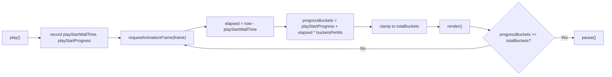

# Smooth Replay Playback

Swap the integer `bucketsShown` counter for a floating-point `progressBuckets` counter updated via `requestAnimationFrame`. The chart gains a fractional "tail" point that grows through the bucket's duration, and the scrub thumb + time readout glide continuously. Companion stats snap per bucket so numeric values stay readable.

## Smoothing Decisions (defaults from discussion)

| Element | Behavior |
|---|---|
| Chart line extension | Smooth, continuous fractional tail |
| Scrub thumb | Smooth, float value each frame |
| Time readout | Smooth per-second (no tenths) |
| Running leaderboard | Snap per bucket |
| Faction tug-of-war bar widths | Smooth interpolated |
| Momentum chip | Snap per bucket (rolling window) |
| Bucket spotlight | Snap per bucket |
| Kill markers | Appear the instant their bucket start is crossed |

## Core State Change (in [js/timeline-player.js](js/timeline-player.js))

Replace the integer `bucketsShown` with:

```js
progressBuckets: 0,         // float, 0..totalBuckets
rafId: null,                // requestAnimationFrame handle
playStartWallTime: null,    // performance.now() at resume
playStartProgress: 0,       // progressBuckets at resume
lastSnappedBucket: -1,      // last integer boundary companion stats saw
```

Introduce two derived helpers used throughout rendering:

```js
function getCompletedBuckets() { return Math.floor(state.progressBuckets); }
function getFractionIntoCurrent() { return state.progressBuckets - Math.floor(state.progressBuckets); }
```

## Playback Loop

Replace `setInterval(onTick, intervalMs)` with a rAF loop. Speed math stays the same — only the driver changes.



Frame function:

```js
function frame(now) {
  if (!state.isPlaying) return;
  const bucketsPerMs = state.speed / (state.timeline.bucket_seconds * 1000);
  const target = state.playStartProgress + (now - state.playStartWallTime) * bucketsPerMs;
  state.progressBuckets = Math.min(state.totalBuckets, target);
  render();
  if (state.progressBuckets >= state.totalBuckets) pause();
  else state.rafId = requestAnimationFrame(frame);
}
```

`play()` captures the anchor values before the first rAF. `pause()` / `destroy()` cancel via `cancelAnimationFrame(state.rafId)`. Speed change while playing: re-anchor (`playStartWallTime = now`, `playStartProgress = progressBuckets`) so the new rate kicks in cleanly.

## Chart Slice with Fractional Tail

`renderChartSlice()` becomes:

```js
const full = Math.floor(state.progressBuckets);
const frac = state.progressBuckets - full;

// Labels: full bucket labels + smooth time label for the partial tail.
const labels = state.timeline.labels.slice(0, full);
if (frac > 0 && full < state.totalBuckets) {
  labels.push(formatMatchTime(state.progressBuckets * state.timeline.bucket_seconds));
}
state.chart.data.labels = labels;

for (const ds of state.chart.data.datasets) {
  const fd = ds.fullData || [];
  const sliced = fd.slice(0, full);
  if (frac > 0 && full < fd.length) sliced.push((fd[full] || 0) * frac);
  ds.data = sliced;
}
state.chart.update('none');
```

This is the visual "lie" that makes playback feel alive: the current bucket's damage linearly ramps in over its wall-clock duration. The underlying bucket boundaries are unchanged; only the rendered curve interpolates.

## Scrub Bar (continuous motion)

In `buildDom()`, widen the `step`:

```html
<input ... step="0.01" max="${state.totalBuckets}" ...>
```

In `renderTransport()`:

```js
if (scrub && !state.scrubbing) scrub.value = String(state.progressBuckets);
const pct = state.totalBuckets > 0 ? (state.progressBuckets / state.totalBuckets) * 100 : 0;
scrub.style.setProperty('--vt-scrub-progress', pct.toFixed(2) + '%');
```

Scrub `input` handler:

```js
state.progressBuckets = parseFloat(e.target.value) || 0;
// Re-anchor so a subsequent play resumes smoothly from scrubbed position.
if (state.isPlaying) {
  state.playStartWallTime = performance.now();
  state.playStartProgress = state.progressBuckets;
}
render();
```

## Time Readout (smooth per-second)

`getCurrentTimeLabel()` returns `formatMatchTime(progressBuckets * bucket_seconds)`. The existing `formatMatchTime` already floors to whole seconds, so `4:03` → `4:04` transitions naturally as the frame counter advances past each second boundary.

## Companion Stat Snap Behavior

Most companion stats should only recompute on integer bucket crossings (otherwise the damage numbers would flicker 60 times a second). Guard inside `render()`:

```js
const completed = getCompletedBuckets();
if (completed !== state.lastSnappedBucket) {
  state.lastSnappedBucket = completed;
  renderLeaderboard();     // snap per bucket
  renderSpotlight();       // snap per bucket
  renderMomentum();        // snap per bucket
}
renderChartSlice();        // every frame
renderTransport();         // every frame
renderTugbar();            // every frame (smooth-interpolated, see below)
```

This keeps frame cost low while still feeling smooth. `renderMomentum` should be extracted from `renderTugbar` so tugbar can run every frame without re-doing the momentum chip each tick.

## Tug-of-War (smooth interpolation)

Include a fractional contribution from the current partial bucket so the bar slides continuously:

```js
let t1 = 0, t2 = 0;
const full = Math.floor(state.progressBuckets);
const frac = state.progressBuckets - full;
for (let i = 0; i < full; i++) {
  t1 += (t1Series[i] || 0);
  t2 += (t2Series[i] || 0);
}
if (frac > 0 && full < state.totalBuckets) {
  t1 += (t1Series[full] || 0) * frac;
  t2 += (t2Series[full] || 0) * frac;
}
```

Bar width percentages derive from these interpolated totals, so the segments glide rather than step.

## Kill Markers

Already threshold-based — change `state.bucketsShown` to `state.progressBuckets`:

```js
if (bucket >= state.progressBuckets) continue;
```

A kill at bucket 5 appears the instant `progressBuckets` crosses 5.0. Natural "incident" pop as playback reaches that moment.

## Transport Actions

- `reset`: `progressBuckets = 0`, cancel rAF.
- `step-back`: `progressBuckets = Math.max(0, Math.floor(progressBuckets) - 1)` — snaps to the previous whole bucket.
- `step-fwd`: `progressBuckets = Math.min(totalBuckets, Math.ceil(progressBuckets + 0.0001))` — snaps to the next whole bucket.
- `play()`: if at end, reset to 0; record anchor; start rAF.
- `pause()`: cancel rAF; `progressBuckets` keeps its current fractional value.

## Fullscreen Snapshot

`renderFullscreenSnapshot(canvasId)` uses the same slicing approach as `renderChartSlice` (full buckets + fractional tail) so the modal shows the exact same visual state as the inline chart at the moment of expand. No further animation in the modal — it's a snapshot.

## Back-Compat Concerns

- **reduced-motion**: `@media (prefers-reduced-motion: reduce)` in [css/vtstats-theme.css](css/vtstats-theme.css) already zeros `--vt-anim-duration`, but doesn't affect our rAF loop. Add a guard: when `window.matchMedia('(prefers-reduced-motion: reduce)').matches` is true, fall back to the old `setInterval` per-bucket cadence and skip the fractional tail. This is a one-branch fallback in `play()` and `renderChartSlice()`.
- **tab backgrounded**: `requestAnimationFrame` auto-pauses when tab is hidden. On return, re-anchor so `progressBuckets` doesn't jump forward a huge amount: listen for `visibilitychange` while playing, and reset `playStartWallTime = performance.now(); playStartProgress = progressBuckets;` on return.
- **Performance**: 60fps chart updates with ~10 datasets × ~130 points is well under 16ms on modern hardware. If this becomes a concern on low-end devices, cap chart updates to 30fps via a simple accumulator; keep scrub/time at 60fps.

## Documentation Touch-up

In [docs/DATA_DICTIONARY.md](docs/DATA_DICTIONARY.md), update the **Playhead (Replay)** glossary entry:

```
| Playhead (Replay) | Continuous playback position expressed in buckets | timeline.labels, timeline.bucket_seconds | progressBuckets ranges 0.0 (empty) to totalBuckets (full). Chart and scrub interpolate continuously each frame; numeric panels snap per whole bucket; tug-of-war interpolates fractionally. |
```

No other doc changes — the high-level feature description in [DEVELOPER_GUIDE.md](DEVELOPER_GUIDE.md) still reads correctly.

## Out of Scope

- No change to [js/app.js](js/app.js), [index.html](index.html), [css/vtstats-theme.css](css/vtstats-theme.css) layout (CSS may get one tiny addition for the wider scrub step if rendering requires it — none expected).
- No pipeline or JSON changes.
- Filter integration, match-switch lifecycle, mode toggle, fullscreen expand — all untouched conceptually.

## Verification After Change

- At 10x, the chart line visibly extends to the right rather than popping each second.
- At 0.5x slow-mo, the line growth is very smooth (each bucket reveal takes 20 wall seconds, rendered at 60fps).
- At 20x, still smooth (bucket reveal takes 0.5s, plenty of frames).
- Scrub thumb glides; releasing play resumes from exact scrubbed position.
- Time readout ticks every second naturally (no 10-second jumps).
- Running leaderboard numbers update each bucket (not 60 times per second).
- Tug-of-war bar slides continuously.
- Kill markers appear one by one at their correct wall-clock moments.
- Backgrounding/returning to tab doesn't cause playback to skip ahead.
- `prefers-reduced-motion` users get the old step-per-interval behavior.
