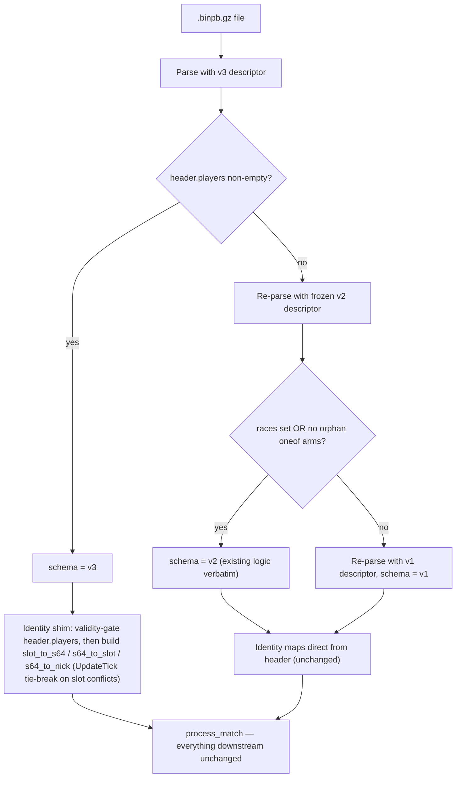

# Statsgate Proto v3 Migration — Full Plan

## Context

Upstream commits `879eb0f` + `12c2e4b` changed the collector: `StatHeader` fields 6/7/9/10 (`s64_to_nick`, `teamnum_to_s64`, `s64_to_teamnum`, `player_count`) are **removed** (`reserved`), replaced by `repeated PlayerInfo players = 22` accumulated by a per-tick slot scan (fixes host-not-detecting-players bug, captures late joiners). New `Outcome game_outcome = 21` — host-attested Team 1 Win / Team 2 Win / Draw / Cancelled from an end-of-game dialog (enum values 1000–1003; `0` = unspecified). No event-message changes.

Three real v3 sessions now exist locally (`data/sessions/VTrider/2026-08-23-*.binpb.gz`, untracked) and were fully decoded and analyzed before this plan was finalized. The pipeline auto-pulls `statsgate/` every run — under current code these files silently produce zero-roster garbage matches (empirically confirmed: v2-descriptor parse yields empty identity maps, `player_count=0`, races set → misclassified "v2"). This migration must land before the next pipeline run.

## Empirical findings from the real v3 data (drives the decisions below)

Analyzed: `2026-08-23-01-49-40` (37min, vsrscammed, attested TEAM2_WIN), `2026-08-23-02-34-27` (14min, STBarren, attested TEAM1_WIN), `2026-08-23-02-50-32` (19min, vsrebola, attested TEAM1_WIN). All decode cleanly with the upstream v3 descriptor; legacy map fields verified absent on the wire; terrain/start_time/races/tick_rate healthy; `none-arm` scan clean (v1 detection unaffected).

1. **Phantom roster entries are real.** Empty slot 10 produced garbage `PlayerInfo` entries in all three files: Steam64s `8029124719555444850` and `30064771072` (not in the Steam64 range — `(s64 >> 32) != 0x01100001`), nick `'Unknown'`, present in every UpdateTick at position (0,0), one changing identity mid-game (tick 384). Root cause: upstream `record_update` dropped the old `GetPlayerHandle()` guard and trusts `GetSteam64(teamnum) != 0`. **The shim needs a Steam64 validity gate.**
2. **Attestation is noisy human input: 1 of 3 outcomes is provably wrong.** Game 1's host clicked "Team 2 Win", but Team 1 outkilled 115–59, outdamaged 817K–588K, and razed Team 2's base in the final minutes (service bay, bunker, power gens, factory tick 40766, recycler tick 44506) — an unambiguous Team 1 clean win. Games 2–3 show the opposite value: kill-feed inference alone would be *unclear* (only a recycler / only a factory died), and attestation resolves them. **Both directions confirm the trust ladder below.**
3. **Collector data regressions (upstream exu2 hook breakage, not schema):** `bullet_hit` events are entirely absent (0 across all three games vs 6,318 in the May v2 baseline; 41,843 bullets fired in game 1 alone) — kills accuracy, PvP accuracy, engagement range, and the structure-damage FIFO. `pickup_powerup` is dead (0 vs 4,473 baseline). `unit_sniped` fires but with every field blank except `tick` (no teams — worse than the old collector bug; slot-derivation impossible). **Core attribution is healthy**: real `unit_destroyed` and `damage_dealt` carry proper Steam64s/teams/ODFs (79.5K attributed damage events in game 1), `bullet_init` shooters all valid.
4. **Not regressions** (verified against the v2 baseline): blank `unit_destroyed` events (181 in v3 game 1 vs 196 in the v2 baseline — pre-existing, already handled); `author_nickname='Unknown'` (cosmetic; we use the folder name); `players[]` list order is `unordered_map` hash order, **not** first-seen order (corrects an earlier plan assumption — slot-conflict tie-breaks cannot use list position).

## Locked design decisions (opinionated, per request)

- **Triple descriptors, not a merged one.** Follow the v1-freeze precedent exactly: frozen snapshots keep `scripts/statsgate.proto` a verbatim upstream mirror, and decoding v2 files with the v3 descriptor would silently drop the identity maps (fields are `reserved`), breaking corpus byte-parity.
- **v2-vs-v3 detection is field-presence, never try/catch** — both descriptors parse both files cleanly. `header.players` non-empty → v3; otherwise fall into today's v2/v1 dance unchanged.
- **Identity normalization stays pipeline-side.** A single shim builds `slot_to_s64` / `s64_to_slot` / `s64_to_nick` from `header.players`; everything downstream (reroutes, positioning gate, leaderboard, ELO, aggregator, all frontends) is untouched by construction.
- **Steam64 validity gate in the shim** (driven by finding 1): `_valid_steam64(x) = (x >> 32) == 0x01100001` (universe 1, individual account). Invalid `PlayerInfo` entries are dropped from the working identity dicts — the phantom then never reaches `s64_to_nick`, so the existing positioning gate automatically discards its (0,0) ghost trail and it never gets a leaderboard row. Raw entries remain visible in `match.roster` with a per-entry `valid` flag.
- **Slot churn: earliest-UpdateTick-appearance wins, loudly.** `players[]` is hash-ordered (finding 4), so list position can't tie-break. If two *valid* Steam64s claim the same slot, run a cheap UpdateTick pre-scan and award the slot to the earliest first-appearing Steam64; WARN + record the displaced entries in `match.roster_conflicts` (computed after the validity gate — the observed double-garbage slot 10 produces no conflict, just two invalid entries). Multi-row-per-slot stays out of scope until real data shows it matters; in the three real files, zero genuine conflicts exist.
- **`player_count` = valid occupied slots** (preserves "10p" picker semantics; the real files correctly yield 8 for their 4v4s once phantoms are filtered). The existing `header.player_count or len(nick_map)` fallback already yields this once the shim runs — zero code change at that site.
- **Evidence-first trust ladder for outcomes** (rewritten after finding 2 — one of three real attestations is provably wrong): a `clean_win` kill-feed inference (one team's rec+fac dead, other side untouched) is near-incontrovertible physical evidence and **beats a contradicting attestation**; attestation resolves everything weaker. `OUTCOME_GAME_CANCELLED` is a validity statement, not an outcome claim, and always wins. `OUTCOME_UNSPECIFIED` **and any unknown value** (e.g. `IDCANCEL = 2` if the host ESCs the dialog) fall back to inference. Full precedence table in Phase 3. Validated against all three real games: game 1 records the true Team 1 win with `agreement: false` telemetry; games 2–3 get attestation-resolved outcomes their inference alone couldn't determine.
- **Collector data gaps get availability flags, not silent zeros** (finding 3): new `match.has_bullet_hit_data` flag mirroring the `has_target_lock_data` precedent — accuracy surfaces render em-dash instead of a misleading 0.0%, accuracy-dependent highlight cards gate off, career accuracy sums skip gap matches so v2-era career accuracy isn't diluted, and the ELO `thug_accuracy` axis is treated as unavailable for gap matches (weight renormalization already handles absent axes). Pickups and snipes need zero new work (existing `has_pickup_data` flag and tick-only-snipe-row precedents cover them).
- **Draw / Cancelled are first-class attested outcomes** with `team: null`: `decided_by: "draw"` / `"cancelled"`. They naturally stay out of win-rate denominators (aggregator's determined check requires `team === 1|2` — zero change needed there).
- **Cancelled matches are excluded from ELO** (new counter + exclusion reason) but stay visible everywhere else with a badge. Draws stay rated (VTSR-T is performance-based; ALPHA = 0).
- **Wins-ELO activation (ALPHA > 0) is explicitly out of scope** — separate validation-gated project once attested matches accumulate (per `scripts/validate_elo.py` Phase 2 plan).
- Version bumps: `PIPELINE_VERSION 26 → 27`, `match.schema_version 14 → 15`, new `PROTO_SCHEMA_V3 = "v3"`. **No `ELO_SCHEMA_VERSION` bump** (cancelled-exclusion matches zero existing matches; ratings byte-identical).

## Data flow after migration

---

## Phase 1 — Schema adoption + descriptor freeze

0. **Toolchain preflight**: the v2 freeze requires *local* codegen (upstream never had a `statsgate_v2.proto`). Current `scripts/statsgate_pb2.py` was generated with protoc/Protobuf Python **6.31.1** (editions-2023-capable) — verify the local `grpcio-tools`/`protoc` matches or exceeds that before generating (`pip install -U grpcio-tools` if needed). If `npx pbjs` chokes on `edition = "2023"`, documented fallback: generate the descriptor JSON from a temp copy with `edition = "2023"` → `syntax = "proto3"` (wire-identical for this schema — no editions-specific features are used).
1. **Freeze v2 first** (before overwriting): create [scripts/statsgate_v2.proto](scripts/statsgate_v2.proto) — copy of current [scripts/statsgate.proto](scripts/statsgate.proto) with `package statsgate;` → `package statsgate_v2;` and a frozen-snapshot header comment (mirror [scripts/statsgate_v1.proto](scripts/statsgate_v1.proto), which uses the same package-rename pattern to avoid descriptor-pool symbol collisions).
2. Generate `scripts/statsgate_v2_pb2.py`: `python -m grpc_tools.protoc --proto_path=scripts --python_out=scripts statsgate_v2.proto`.
3. Generate `vendor/protobufjs/statsgate_v2.proto.json`: `npx pbjs -t json scripts/statsgate_v2.proto` (root message `statsgate_v2.ClientStatSession`).
4. **Adopt v3**: copy `statsgate/statsgate.proto` (upstream HEAD `12c2e4b`) verbatim → [scripts/statsgate.proto](scripts/statsgate.proto). Regenerate `scripts/statsgate_pb2.py` locally; sanity-compare against upstream's `statsgate/scripts/statsgate_pb2.py` (they should agree — upstream is the same proto).
5. Regenerate `vendor/protobufjs/statsgate.proto.json` from the v3 proto.

## Phase 2 — Pipeline: detection + identity shim ([scripts/process_stats.py](scripts/process_stats.py))

6. Add `PROTO_SCHEMA_V3 = "v3"` beside the existing labels (~line 31); `import statsgate_v2_pb2`.
7. `load_session()` (~line 1548): parse with v3 descriptor; if `session.header.players` non-empty → return `(session, PROTO_SCHEMA_V3)`. Otherwise re-parse with `statsgate_v2_pb2` and run the **existing** races-check + `WhichOneof` scan verbatim for v2/v1. Update docstring with the three-way strategy.
8. New helper `_build_identity_maps(header, schema, events)` replacing the three dict literals at lines 2717–2720: v1/v2 path reads the maps as today; v3 path iterates `header.players` and **first drops entries failing `_valid_steam64(x) = (x >> 32) == 0x01100001`** (observed phantoms: `8029124719555444850`, `30064771072` on empty slot 10 — nick `'Unknown'`, position (0,0) every tick), then builds `s64_to_nick[p.steam64] = p.nickname`, `s64_to_slot[p.steam64] = p.teamnum`, `slot_to_s64[p.teamnum] = winner-of-slot`. When two *valid* Steam64s claim one slot (zero occurrences in the real files), tie-break by earliest first-appearance in a cheap `update_tick` pre-scan (list order is hash order — unusable). Returns `(maps..., roster_conflicts, invalid_count)`; WARN print when either is non-empty/non-zero.
9. `ACCOUNT_REROUTES`, `nick_map`, `team_leaders`, the positioning `s64 not in s64_to_nick` gate (line 3812), and `player_count` (line 4783) all work unchanged through the shim — verify, don't touch. The validity gate is what keeps the phantom's 44K-sample (0,0) ghost trail out of positioning/leaderboard/ELO.
10. New `match` fields: `roster` (v3-only raw PlayerInfo passthrough `[{steam64: str, slot, nickname, valid: bool}]`, `null` pre-v3 — includes phantom entries, flagged), `roster_conflicts` (list, `[]` normally), `game_outcome` (raw enum name string or `null`) — telemetry mirrors of the `shutdown_requested` precedent. Stamp `proto_schema_version: "v3"`. **Contract note:** `roster` stays RAW (pre-`ACCOUNT_REROUTES` identity, wire-accurate provenance — mirrors the tiers-1/2 philosophy); the reroute rewrite applies only to the shim's working dicts, and the existing `rerouted_from` chip + `match.account_reroutes` audit log already document the rewrite.

## Phase 3 — Outcome integration (evidence-first trust ladder)

11. New `resolve_match_outcome(game_outcome, kill_feed)` in [scripts/process_stats.py](scripts/process_stats.py) wrapping `compute_match_winner()` (line 1650). The inference always runs; precedence (validated against all three real games):

| Inference | Attestation | `winner.team` | `decided_by` | `agreement` | Notes |
|---|---|---|---|---|---|
| any | `GAME_CANCELLED` | null | `cancelled` | null | Validity statement — always wins; ELO-excluded |
| `clean_win` T=x | team win T=x | x | `attested` | true | Human + physical evidence agree |
| `clean_win` T=x | team win T=y or draw | **x (inference)** | `clean_win` | **false** | Real case: game 1 misclick; `disputed: true`, WARN, UI marker |
| `clean_win` T=x | absent / UNSPECIFIED / unknown value | x | `clean_win` | null | Pre-v3 + ESC/`IDCANCEL=2` path |
| `contested`/`unclear` | team win T=y | y | `attested` | vs contested guess, else null | Real cases: games 2–3 (inference alone was unclear) |
| `contested`/`unclear` | `DRAW` | null | `draw` | null | |
| `contested`/`unclear` | absent / UNSPECIFIED / unknown | as today | as today | null | Unchanged legacy behavior |

    New `winner` fields: `attested: bool` (attestation drove the outcome), `disputed: bool` (attestation contradicted a clean_win), `inferred: {team, decided_by, decided_at_tick} | null` (preserved when attestation drove or disputed), `agreement`. `decided_at_tick` borrows the inference tick when teams agree (milestone divider), else null. `evidence` always from the inference machinery. **Caller extracts the outcome via `getattr(header, "game_outcome", 0)`** — the v1/v2 descriptor headers have no such attribute, so a bare field access would raise `AttributeError` on every legacy session; the pipeline-side `OUTCOME_*` int → name mapping constant lives next to `RACE_TO_FACTION_CODE`.
12. ELO ([scripts/elo.py](scripts/elo.py) ~line 1206): third match-level exclusion branch — `winner.decided_by == "cancelled"` → `exclusion_reason: "cancelled"`, new top-level `matches_excluded_cancelled` counter. Applies to both canonical and thugs-only passes automatically (shared `_rating_pass` path). `matches_excluded_no_winner` stays reserved.
13. Contribution + aggregator: `_extract_contribution`'s `winner: {team, decided_by}` slice passes new values automatically. One-line fix in [js/all-matches-aggregator.js](js/all-matches-aggregator.js) (~line 411): the maps rollup's if/elif chain gets a final `else mr.unclear += 1` so draw/cancelled don't break the documented `count == wins_t1 + wins_t2 + contested + unclear` invariant. Everything else (determined-winner check, commander pairs, streak log) already handles the new values correctly by construction — verify with the real v3 files.

## Phase 3b — Collector data-gap handling (empirically required)

The new collector currently records zero `bullet_hit` and zero `pickup_powerup` events, and blank `unit_sniped` fields (upstream exu2 hook breakage — see upstream report note in Phase 7). Graceful-degradation work, all following the `has_target_lock_data` availability-flag precedent:

13a. New `match.has_bullet_hit_data` flag — derive from the existing `bullet_hit_distance_count` accumulator (line 2957, incremented unconditionally per BulletHit at line 3155; zero new accumulators needed), mirrored onto the manifest entry and `_extract_contribution`. On gap matches: `shots_hit`/`pvp_shots_hit`/weapon `hits`/`pvp_hits` are genuinely zero, `structure_dealt` is 0 (BulletHit-FIFO-derived), `bullet_hit_distance.with_distance` is 0 (range UI already hides itself).
13b. UI: leaderboard `Acc`/`PvP Acc` cells render em-dash (with tooltip "No hit data — collector gap") instead of a misleading 0.0% when the flag is false; the Shot Accuracy table/chart shows an empty state; weapon-breakdown hit columns em-dash.
13c. `compute_highlights()`: gate **Sharpshooter** on `has_bullet_hit_data` — its ranking metric is accuracy, and on a gap match everyone passes the `shots_fired >= 100` floor at 0% so the "winner" degenerates to an alphabetical tiebreak pick. **Gunner stays** (its ranking metric is `shots_fired`, `bullet_init`-derived and healthy in v3) but its accuracy `value_breakdown` is nulled on gap matches so the card doesn't caption a misleading 0.0%. Other cards' existing gates suffice.
13d. [js/all-matches-aggregator.js](js/all-matches-aggregator.js): skip `total_shots_fired`/`total_shots_hit`/`total_pvp_shots_hit`/weapon `hits` accumulation for gap matches (keep both sides of every accuracy ratio consistent) so career accuracy reflects only matches that actually carry hit data — prevents v3-era zeros from diluting v2-era career accuracy. Surface `matches_with_bullet_hit_data` on `career_stats[]` rows + `meta` (denominator transparency, mirrors `matches_with_target_lock_data`).
13e. [scripts/elo.py](scripts/elo.py): treat the `thug_accuracy` axis as **unavailable** for gap matches (existing absent-axis weight renormalization handles the rest). Also verify the zero-variance backstop (all-zero axis → z=0, no contribution) as defense-in-depth. `snipe_bonus` needs nothing: blank snipe fields → zero attributed snipes → zero-variance no-op at 0.005 weight.
13f. Pickups and snipes: **zero new work.** `has_pickup_data` already flags pickup-less matches (UI hides, Pod Goblin self-omits); blank snipes produce tick-only feed rows exactly like pre-Phase-3 sessions (Chris Kyle self-omits).

## Phase 4 — Dashboard + map UI

14. [js/app.js](js/app.js) `applyWinnerBadge()` (line 5133): add `attested` branch (solid trophy, `"<Faction> wins"`, tooltip "Outcome attested by the match host at game end"), `draw` branch (`bi-circle-half`, "Draw (attested)"), `cancelled` branch (`bi-slash-circle`, "Game cancelled"), and a **disputed marker** on the `clean_win` branch when `winner.disputed` (small warning glyph + tooltip "Host attested Team N — physical evidence overrode it"; real case exists in the 08-23 data). Extend the two gates that whitelist decided_by values: faction-panel winner highlight (line 4526) and milestone-divider gate (line 5224) — add `'attested'`.
15. [js/maps.js](js/maps.js) (~line 729): extend the recent-matches winner-chip label map for `attested` / `draw` / `cancelled`. [scripts/generate_map_pages.py](scripts/generate_map_pages.py) passthrough is already value-agnostic — verify only.
16. [js/player.js](js/player.js) — two `decided_by` consumers found in the sanity pass: the match-log row builder (~line 855; its `won` logic keys on `winner.team` being finite, so attested wins and null-team draw/cancelled already behave correctly — verify only) and the compare-view common-matches winner badge (~line 3006), which renders the **raw `decided_by` string** in a secondary badge whenever `winnerTeam` is null — add a small label map so `draw` / `cancelled` render as "Draw" / "Cancelled" instead of raw tokens; check the single-profile match log's W/L chip renderer for the same raw-string pattern.
17. [css/vtstats-theme.css](css/vtstats-theme.css): add `.vt-winner-badge[data-decided-by="attested"|"draw"|"cancelled"]` tone variants (success / neutral / muted).

## Phase 5 — Raw Data Browser ([js/raw-browser.js](js/raw-browser.js))

18. Triple-descriptor chain in `fetchAndDecodeBinpb()` (line 468): decode with v3 root → `header.players` non-empty → v3; else lazy-load `statsgate_v2.proto.json` (new `loadProtoRootV2()`, mirror of the v1 loader) and re-decode → v2; existing catch-throw → v1 path unchanged. Add `PROTO_SCHEMA_V3` constant. Accepted trade-off: every legacy v2 match view now performs one extra decode (the v3 root cannot surface the reserved map fields, so re-decode is unavoidable); v3-first ordering is deliberate since the v2 corpus is frozen (~100 files) while all future files are v3.
19. `buildS64Resolver()` (~line 660): build from `header.s64ToNick` when present, else from `header.players[]` (v3).
20. `PROTO_TYPE_MAP` (line 84): add `'header.players.*': 'PlayerInfo'`. `EVENT_ARMS_BY_SCHEMA`: add `v3` key (identical to v2). Fix the three Reconcile-view `isV2 = protoSchemaVersion === PROTO_SCHEMA_V2` checks (lines 2631/2662/2712) to `!== PROTO_SCHEMA_V1` (v3 reconciles identically to v2; the v1-only branch at line 2217 already uses `=== PROTO_SCHEMA_V1` and needs no change).
21. `data/field-docs-manual.json`: manual entries for `header.gameOutcome` (incl. the 1000-series enum values — `extract_proto_docs.py` doesn't parse enum bodies) and `header.players`.

## Phase 6 — Versioning + documentation (complete agent/dev docs surface)

Verified: the repo has **no** `CLAUDE.md`, `.cursorrules`, or `.github/` instruction files — the complete agent/dev documentation surface is `AGENTS.md`, the five `.cursor/rules/*.mdc` files, `DEVELOPER_GUIDE.md`, `docs/DATA_DICTIONARY.md`, and `README.md`. All touched below except `styling.mdc` (no styling-system changes — new badge variants follow existing patterns).

22. `PIPELINE_VERSION 26 → 27`; `match.schema_version 14 → 15` (new: `game_outcome`, `roster`, `roster_conflicts`, `has_bullet_hit_data`, extended `winner` shape) with the version-history comment updated (~line 4831).
23. `.cursor/rules/data-schema.mdc` — rewrite the "Schema Version Strategy" section for the triple-descriptor arrangement (v1 / v2-frozen / v3-current), add the v3 `StatHeader` field table (`players`, `game_outcome`, reserved 6/7/9/10), PlayerInfo message, Outcome enum, the new winner taxonomy (`attested`/`draw`/`cancelled` + `attested`/`inferred`/`agreement` fields), and the first-seen slot rule.
24. `.cursor/rules/schema-migration.mdc` — the playbook itself still describes a dual-descriptor world: update Step 1 ("regenerate **both** descriptor pairs" → all three; freeze-before-adopt sequencing), the Python/JS detection-strategy notes, and add the presence-based-detection caveat (v2↔v3 cannot be distinguished by parse failure).
25. `.cursor/rules/filter-contract.mdc` — run the six-question checklist and add reference-table rows for `match.game_outcome`, `match.roster`, `match.roster_conflicts` (all match-global, always-unfiltered passthrough) and extend the existing `match.winner` row with the new decided_by values + `attested`/`inferred`/`agreement` fields.
26. `DEVELOPER_GUIDE.md` §2 (schema tables), §3 (evolution status: v3), §5 (JSON structure: new match fields + winner shape), §11 (Raw Data Browser triple decode), §13 (ELO cancelled-exclusion note).
27. `docs/DATA_DICTIONARY.md` §10 (Match Winner: attestation source, agreement telemetry, draw/cancelled) + Player Identity section (PlayerInfo, per-tick roster accumulation, first-seen rule, roster_conflicts).
28. `.cursor/rules/project-overview.mdc` + `AGENTS.md` — update the "Key File Locations" / "Key Conventions" schema entries: dual → triple descriptor notes, new frozen v2 file paths, v3 identity/outcome summary, version bumps. `README.md` — update if it names the winner feature or schema support.

## Phase 7 — Verification (corpus must stay byte-identical; real v3 data is the primary fixture)

29. **Primary end-to-end verification = the three real files** already in `data/sessions/VTrider/2026-08-23-*.binpb.gz`. Expected results (pre-computed during analysis, act as acceptance criteria): all classify `v3`; rosters = 8 valid players each (4v4, slots 1/2/4/5 vs 6/7/8/9), phantoms filtered with `roster` showing 1–2 `valid: false` entries, zero `roster_conflicts`; `player_count = 8`; outcomes — game 1 = Team 1 `clean_win` + `disputed: true` + `agreement: false`, game 2 = Team 1 `attested`, game 3 = Team 1 `attested`; all three `has_bullet_hit_data: false` (Acc columns em-dash, Sharpshooter/Gunner absent), `has_pickup_data: false`; snipe feeds tick-only; positioning has no (0,0) ghost player.
30. `scripts/dev_make_v3_fixture.py` still ships, now only for cases real data doesn't cover: `DRAW`, `GAME_CANCELLED`, out-of-enum outcome (`2`/IDCANCEL), and a synthetic same-slot two-valid-Steam64 conflict.
31. Parity: `python scripts/process_stats.py --force` (with the 08-23 files temporarily moved out) → `git diff data/processed` must show **only** `pipeline_version`, `schema_version`, and the new null/default fields on every existing match; elo outputs byte-identical except `matches_excluded_cancelled: 0` (+ `computed_at` timestamp noise). Then re-add the v3 files and verify item 29.
32. Update + run `scripts/verify_proto_decode.mjs` (mirror the triple chain; print schema + roster source + game_outcome) against one v1 file (April 2026 — verified to carry the paired-`damage_received` none-arms signature), one v2 file (e.g. `Nomad/2026-05-11`), and one real v3 file.
33. Browser smoke: dashboard (leaderboard em-dash accuracy, winner badges incl. the disputed marker on game 1, positioning), raw browser (all three tiers on v1/v2/v3, `header.players` tree with PlayerInfo tooltips), player page match log.

**Upstream report (goodwill + data quality — send to VTrider alongside this migration):** (a) `record_update` lost the `GetPlayerHandle()` guard — empty slots emit garbage Steam64s (`8029124719555444850`, `30064771072`) into `players[]` and every UpdateTick; (b) `bullet_hit` hook records nothing (0 events across three games; 41,843 bullets fired in one); (c) `pickup_powerup` hook records nothing (was ~4.5K/game); (d) `unit_sniped` fields all blank except tick (worse than the pre-May bug — teams gone too); (e) outcome dialog: game 1's attestation contradicts overwhelming kill-feed evidence (misclick risk — uncommenting the planned roster overview + a confirm step would help); (f) `author_nickname` resolves to `'Unknown'` at last_tick.

## Phase 8 — Recommended additions (small, in-scope)

34. Picker **Outcome facet** in the match-picker modal (Any / Winner known / Attested only) reading `winner_decided_by` off the manifest — the field was put there for exactly this; wire through `pickerState` (v2 sessionStorage shape gets one new optional key, no migration needed).
35. [scripts/validate_elo.py](scripts/validate_elo.py): extend the ground-truth cohort definition to include attested outcomes alongside `clean_win` (labeled separately in the report), and report the attestation-vs-inference **agreement rate + disputed-match list** (the game-1 misclick shows why this metric matters from day one) — flows into the ELO page's "Does it work?" tab via the existing summary file (note: [js/elo.js](js/elo.js) winner-provability funnel (~line 1103) reads `funnel.decided_by_*` keys from `validation_summary.json` — add an `attested` funnel row when the validator emits one).

**Explicit non-goals / non-changes:** ALPHA > 0 Wins-ELO activation; multi-row-per-slot leaderboard for slot churn; upstream `sessions/` ingestion changes (sync mechanism untouched); no `ELO_SCHEMA_VERSION` bump; no `PLAYER_TEMPLATE_VERSION` / `MAP_TEMPLATE_VERSION` bumps (no stub-HTML shape change); no manifest shape change (`winner_decided_by` passes new values through the existing key); no `styling.mdc` update.