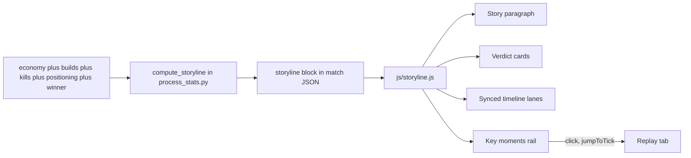

# Storyline Tab (v4 Matches)

Promote the `_investigation/econ_story_preview.html` concept into the product, fixing all review feedback. Doctrine-compliant: all aggregation moves into the pipeline as a new match-global `storyline` block; JS only renders.



## Phase 1 — Pipeline: `storyline` block

New `compute_storyline()` in [scripts/process_stats.py](scripts/process_stats.py) (sibling of `compute_highlights`), called in `process_match()` after economy/builds/positioning/winner exist. **Emitted only when `has_resource_data AND has_build_data`** (v4 matches, per your scope); positioning-dependent lanes are `null`-safe. Match-global, always-unfiltered (same passthrough contract as `highlights`).

Block shape (30 s buckets, `STORYLINE_BUCKET_SEC` tunable):

```
storyline: {
  schema_version: 1, bucket_sec: 30, duration_sec,
  lanes: {
    net_combat_value_diff[],      // cum fielded − lost, team1 − team2 (reuses build_combat_ship_odfs + build_scrap_cost_resolver)
    pool_diff[], intensity[],     // from econ series + timeline
    front: {1:[],2:[]},           // mean projection on base axis, null w/o positioning
    base_intruders: {1:[],2:[]}   // enemies inside base perimeter (rush detector) — NO garrison lane (see below)
  },
  bands: {1:[[startSec,endSec,band],...], 2:[...]},   // segmented from the WIRE's own per-tick ResourceState.scrap_status enum (display use is its documented purpose); regen-segment model demoted to cross-check
  beats: [{sec, tick, kind, team, weight, args:{...}}],  // structured args, NO English (titles render client-side)
  facts: { archetype, income{1,2}, extractor_war{1,2}, materiel_lost{1,2}, front_mean{1,2},
           structure_spend{1,2},  // total structure-order scrap (source: economy.teams[n].outflow_structure_orders)
           opening{1,2},          // first 3 distinct builds + time_to_3_pools_sec + time_to_first_upgrade_sec (all already emitted)
           cast[],                // <=4 dramatis-personae roles auto-picked from existing stats (decisive killer, extractor-war leader, materiel loser, top damage)
           base_radius_m, decisive{sec, tick, killer, victim_team, structure, intruders_peak},
           winner{team, decided_by},
           base_defense: null     // RESERVED plug — populated when structure-location telemetry lands (see Deferred section)
  }
}
```

**Soundness: adjudication restamp (review finding).** `scripts/adjudication.py::apply_outcome` rewrites winner blocks in `main()`'s reconciliation pass every run — including on CACHED matches that are not reprocessed — so a winner flip would strand a stale story. Design: `compute_storyline(match_dict, ...)` is pure over the assembled match dict (probe proved feasibility — it consumed processed JSON only); the winner-dependent outputs (`facts.winner`, `facts.archetype`, the `result` beat) are factored into a `restamp_storyline_outcome(match_dict)` helper that the reconciliation path calls whenever `apply_outcome` returns `changed=True`, before the per-match JSON rewrite. Lanes/bands/other beats are winner-independent and never restamped.

- **Player-garrison element REMOVED by design** (your call): base defense in BZCC is structures, not parked players, so "defenders home" measured the wrong thing. No `base_garrison` lane, no `base_empty_share` fact, no defender claims anywhere in copy. The `base_intruders` lane stays — it marks *when and who* rushed, which is orthogonal and validated.
- Beat curation (from probe learnings): pool-tempo fires on first-time counts only; upgrades on first + new highs; structure kills cross-team only (same-team = `demolition`, weight 1); decisive kills weight 5 with rush context (`intruders_peak`, killer, killer ship); kill bursts keep top 3 by size + any within 2 min of a decisive kill; first blood; result.
- **Structure naming + classification (review fix — the probe got this wrong)**: display names come from `prettify_odf` / `odf_map` VERBATIM (`fblung_vsr` = "Lung" not "Antenna Mound"; `fbrecy_vsr` = "Matriarch" not "Recycler"; `fbdowe_vsr` = "Dower") — the probe's hand-rolled `STRUCTURE_KIND` substring table is explicitly discarded, per the documented ODF rule (`data-schema.mdc` resolution chain; builds-block rule: "classLabel chains, NEVER the ODF DB top-level category"). Structure ROLE (for weighting + copy hints) is classified separately: decisive = membership in the existing `RECYCLER_ODFS` / `FACTORY_ODFS` frozensets (same source of truth as the winner inference); extractor-war set = ODF DB `inheritanceChain` terminal `extractor` — **data-verified, not assumed**: all 9 `upgrade_count` upticks across both Wasteland teams correlate with an `*bscup` constructor queue 12–120 s prior (`fbscup` "Extractor+" / `ebscup` "Refinery+", both terminal `extractor`), while the Dower (`supplydepot`) correlates with none — it is genuinely not the Scion pool upgrade. Beat args carry `{odf, name, role}`; copy renders the real name with a muted role hint (e.g. "Matriarch — the team's Recycler; losing it is usually fatal").
- **Kill-burst beats carry their constituent kills (review addition)**: `args.events = [{sec, killer, victim, victim_ship}]` (ship names odf_map-resolved, hard-cap 20) so the rail can expand a firefight into its unit list.
- **New beat kinds (review additions)**: `snipe` (from `snipes.feed` rows with both sniper + victim resolved — rare and dramatic: on Wasteland it is Sev, the eventual Recycler killer, sniping mort's team's Archers twice; weight 2, no cap needed at observed rates but hard-cap 5 defensively) and `tide_turn` (largest |swing| of `net_combat_value_diff` over a sliding 5-min window, cap 1 per sign — names the momentum lane's biggest visible reversal).
- Archetype classifier (decision tree over facts): `divergence` (econ leader lost), `stomp`, `attrition_grind`, `comeback`, `even` fallback. Only `divergence` + fallback are testable on the current 1-match v4 corpus — classifier must fail safe to the generic template, and the other archetype templates ship marked best-effort until more v4 sessions land.
- Narrative arc completeness: the story paragraph gets an **opening sentence** from `facts.opening` (on Wasteland: mort opened 6x Harvester; Domakus mixed Collectors + Service Pods and was FASTER to 3 pools, 170s vs 223s, and first upgrade, 172s vs 287s — a nuance the preview missed), so the paragraph reads beginning → middle → climax → result.
- **Versions**: `match.schema_version` 21 → 22 (line ~6627), `PIPELINE_VERSION` 38 → 39.
- **Rating-inertness gate**: new `_investigation/golden_storyline_inert.py` (strip + perturb the block, require byte-identical `elo_history.json` + VTSR-C), mirroring `golden_builds_inert.py`.

## Phase 2 — Frontend: nav pill + renderer

- [index.html](index.html): `#tab-storyline-li` (hidden default, `NEW` badge) **immediately after Overview**; pane `#tab-storyline` with four cards (story / verdict / timeline with 5 canvases + band-strip container + zoom-reset / key moments). The existing hidden-`<li>` skip in `activateTabFromSlug` (js/app.js:480) gives the pre-v4 deep-link bounce for free.
- New [js/storyline.js](js/storyline.js) (loaded after `charts.js`), exposing `window.VTStoryline = { render, destroy }`; wired via `registerTabRenderer('#tab-storyline', ...)` next to the economy registration (js/app.js:2419); li toggled in `renderMatchData` on `currentData.storyline` presence; charts pushed into the shared `activeCharts` registry so theme/match switches destroy them.
- **Charts**: Chart.js lanes with `glassTooltipConfig`-based tooltips on every lane; beats drawn as a pinned scatter dataset so the gold flags have native hover tooltips (title + time); crosshair sync retained.
- **Zoom**: x-only drag-select zoom synced across all lanes via the vendored `chartjs-plugin-zoom` (already loaded, index.html:1899), mirroring the linked-pan pattern of `renderEconomyPoolsChart` ([js/charts.js](js/charts.js):378); shared reset button; band strips re-render clipped to the zoom window on the sync callback.
- **Copy tables in JS** (`STORY_COPY`): archetype paragraph templates + beat title templates + verdict card definitions — `HIGHLIGHT_COPY` precedent, so wording iterates without reprocessing. Front-line smoothing (5-bucket rolling mean, proven in the preview) happens render-side; the JSON keeps raw buckets so zoomed views stay honest.
- **Beats rail**: Bootstrap Icons (vendored `bi-*`, no emoji); hover locates the crosshair; click switches to Replay tab + `VTReplay.jumpToTick(tick)` (Bootstrap `Tab.show()` then seek after `shown.bs.tab` — a small pending-seek handoff since the Replay renderer inits lazily). Replay-only for v1: `window.VTPositionPlayer` exposes no public seek API, so Positioning deep-links are deferred.
- **Expandable beat detail (review addition)**: rows with detail payloads (kill bursts' unit lists; decisive kills' rush context) render a chevron toggle that expands small muted sub-rows ("100:37 — Sev destroyed VTrider's Sabre"); the chevron is a separate affordance from the row body, which keeps the click-to-Replay behavior — no interaction conflict.
- **Cast chips**: up to 4 dramatis-personae chips under the story paragraph from `facts.cast` (names via `vtPlayerLinkHtml` — 8th cross-link site), e.g. on Wasteland the data auto-surfaces Sev (2 Archer snipes + the Recycler kill) as the match's protagonist.
- Styles as `.vt-story-*` in [css/vtstats-theme.css](css/vtstats-theme.css); all colors via `--kb-*` reads at render time; Geist mono for stat values; zero inline styles.

## Phase 3 — Copy and legibility fixes (your review, as acceptance criteria)

- Narrative: remove unbacked clauses ("left the base to do it"); every sentence traceable to a fact key; NO player-defender claims ("0.34 defenders stood home" is gone entirely) — the decisive sentence is built from rush facts only (killer, structure, `intruders_peak`, timing), e.g. "At 100:11 Sev drove into mort's base and destroyed the Recycler". The *why it worked* explanation (base-defense investment) is deferred to the structure-location enrichment.
- Verdict cards: every comparative stat gets team-colored name attribution (`mort 13,033 · Domakus 9,772`) + a marker on the stat winner; extractor war shows who won it; field control becomes plain language ("mort held mid-map · Domakus pinned at home") with the 0–1 axis explained in a tooltip; "The lapse" card is REPLACED by **"Structure investment"** (total structure scrap per team from `structure_spend` — the number that made this loss possible is at least visible today, and it upgrades to a base-vs-field split later); result card tooltip explains `decided_by` (reuse `applyWinnerBadge` taxonomy copy, js/app.js:6117).
- Timeline: one-line explainer under each lane title (momentum = "net combat-ship value fielded minus lost — above zero = mort ahead"); map-control legend clarified ("bars = enemy ships inside a base perimeter"); hover tooltips everywhere including beat flags.

## Deferred — base-defense enrichment (structure-location telemetry)

The collector now records structure locations, but **no session in the corpus carries the data yet**, so nothing is computed or speculatively implemented now. The plug:

- `facts.base_defense` reserved as `null`; renderer self-omits everything reading it (same convention as highlight-card data gates).
- When sessions with structure locations land: compute per-team **defensive-structure value inside the base perimeter** (classification: chain terminal `turret` + gun-tower classes — verified: `fbspir_vsr` "Gun Spire" chain is `[fbspir, turret]`) vs **field-structure spend** (the rest of `structure_spend`), populate `base_defense = {1: {base_def_value, base_def_count, field_structure_spend}, 2: ...}`. Wasteland already corroborates the story numerically: mort's constructor queued **41 Gun Spires** (of 56 structure orders) — the location data will show where they went.
- Copy then unlocks the real explanation: "mort spent 3,935 scrap on field structures while a single Gun Spire guarded the base" — narrative clause in the divergence/base-rush archetypes + the Structure-investment verdict card splits into base vs field.
- This lands as its own additive `storyline.schema_version` 1 → 2 bump + a `data-schema.mdc` note; no UI restructuring needed because the slot and self-omission ship now.

## Phase 4 — Verify

- `python scripts/process_stats.py` (Wasteland gains the block; rest of corpus byte-identical except version stamps); run the new golden gate + existing `_investigation` gates.
- New `_investigation/check_story_templates.mjs` gate: renders EVERY archetype paragraph template and EVERY beat-kind title template against fixture facts; fails on any unfilled `{slot}`, and on double quotes inside tooltip copy (the `esc()` constraint). Protects the untestable-on-current-corpus archetype templates.
- Adjudication restamp test: flip the Wasteland entry in `data/match_outcome_adjudications.json` in a scratch copy, rerun, confirm `storyline.facts.winner` + archetype + result beat follow; revert.
- Name-resolution spot-checks on Wasteland: `fblung_vsr` renders "Lung", `fbrecy_vsr` renders "Matriarch", `fbdowe_vsr` renders "Dower"; the Dower kill does NOT count in the extractor-war tally; burst rows expand to their unit lists.
- Browser test on the Wasteland match: all lanes, synced drag-zoom + reset, tooltips, beat flag hovers, beat expand chevrons, beat click → Replay seek, `?match=...&tab=storyline` deep link, pre-v4 bounce to Overview, theme switch re-render, light mode, mobile width.
- Docs: `docs/DATA_DICTIONARY.md` §5, `.cursor/rules/data-schema.mdc`, `filter-contract.mdc` reference table row, `DEVELOPER_GUIDE.md`, `AGENTS.md`/`project-overview.mdc` mentions.

## Assumptions audit — every derived mechanism and its grounding

Prompted by the probe's ODF-naming failure. Rule of record: names resolve through `prettify_odf` / `odf_map`, classification through `data/odf.min.json` classLabel / inheritance chains — never hand-rolled tables, never the DB's top-level category (documented in `data-schema.mdc` + the builds-block conventions).

Grounded in existing project machinery (no new assumptions):
- Structure/ship display names — `odf_map` verbatim.
- Decisive-structure classification — existing `RECYCLER_ODFS` / `FACTORY_ODFS` frozensets (shared with winner inference).
- Extractor-war set — chain terminal `extractor`; data-verified against all 9 upgrade upticks (see above).
- Scrap bands — segmented from the wire's own `scrap_status` enum (its documented display purpose); the regen-segment model (already VERIFIED in rules) becomes a cross-check; the 1 Hz preview derivation matched emitted shares to 3 decimals as additional evidence.
- Momentum fielded/lost values — existing `build_combat_ship_odfs` chains + `build_scrap_cost_resolver`; validated exact against emitted `combat_ship_value` (5425/4575) with 144/144 kill-row cost coverage.
- Base perimeter radius — the positioning pass's own `R_base = 0.15 × base_separation` convention; floor follows the `personal_base_radius` [100, 400] clip precedent. Exposed as tunable constants.
- Intensity lane — existing `timeline.by_faction` buckets. Pool-diff lane — existing `pool_count` series.
- Cast picks — all from emitted fields (decisive beat killer; top enemy-extractor kills from the feed; `thug_supply.thugs[0]` which the pipeline already sorts heaviest-first; leaderboard `dealt`). Role LABELS are editorial copy — same convention as the invented-but-honest highlight card names (Bully, Grim Reaper).

Explicit decisions (defensible, labeled in UI):
- Materiel-lost curve counts ALL combat-ship losses including AI-owned hulls — deliberately different from `thug_supply`'s human-piloted-only semantics (that block attributes losses to thugs; this lane totals destroyed materiel). Tooltip states the inclusion.
- Demolition beats use neutral copy ("destroys own …") — the data cannot distinguish intentional recycling from friendly fire.
- Structure-investment card label is precise: "scrap sent to structure orders" (`outflow_structure_orders`).

Flagged heuristics (tunable constants, calibration steps in Phase 4):
- Kill-burst threshold (≥5 kills / 60 s) — tuned on one match; MUST be calibrated on the full corpus (kill feed is corpus-wide) before ship; `STORY_BURST_*` constants.
- Tide-turn window (5 min sliding) — descriptive annotation of what the lane already shows; capped 1 per sign; `STORY_TIDE_*` constants.
- `STORYLINE_BUCKET_SEC = 30`, opening build count (3), render-side front smoothing window (5 buckets), decisive rush-context window (3 min) — display-only tunables, no schema impact.
- Archetype decision-tree thresholds — only `divergence` + fallback testable today; fail-safe to generic template; guarded by the template gate.

## Review sweep — candidates considered (simple → complex)

Adopted (meaningful, cheap, data exists today):
- **Opening story element** (`facts.opening`) — stories need beginnings; tempo fields + `first_builds` already emitted.
- **Snipe beats** — rare, dramatic, fully-resolved rows on v4 sessions.
- **Tide-turn beat** — names the momentum lane's biggest reversal instead of leaving it implicit.
- **Cast chips** (`facts.cast`) — stories have characters; auto-picked from existing per-player stats.
- **Structure-investment verdict card** — interim stand-in for the deferred base-defense split.

Rejected (fail the "meaningful story contribution" bar):
- Win-probability curve — no honest model exists (validator shows rating barely predicts tight matches); momentum lane IS the honest proxy.
- Bank-crash / spend-burst beats — noise; the band strips + momentum already carry spending tempo.
- What-if counterfactuals — not data-grounded.
- Match-banner "read the story" CTA — the NEW-badged pill suffices.

Deferred (meaningful but blocked or v2):
- Base-defense narrative — blocked on structure-location sessions (the null plug ships now).
- Spatial pool-control map — blocked on the same telemetry.
- Reship-pressure lane (thugs on foot over time) — needs a new per-second pilot series emission; thug attrition facts already cover the theme.
- Chapter ribbon (auto-segmented phases) — polish once beat quality is calibrated on more v4 matches.
- Positioning-player beat deep-links — blocked on a seek API.

## Decisions made (veto at review if you disagree)

- Player-garrison story element removed entirely (structures defend bases, not parked players); rush detection via `base_intruders` stays; base-defense explanation deferred behind the `facts.base_defense` null plug until structure-location sessions exist.
- Tab position: immediately after Overview (it is the bird's-eye entry point).
- Narrative English lives client-side in `STORY_COPY`; pipeline emits only facts/archetype (wording iterable without reprocess).
- The shelved `Team Scrap Over Time` card stays untouched per its do-not-fix rule.
- No changes to `builds.feed[]` / `kills.feed[]` shapes — the storyline block is self-contained.
- No `data-expand` fullscreen button on the composite timeline card in v1 (multi-canvas card doesn't fit the single-chart fullscreen contract; per-lane expand is a follow-up).
- Beats carry both `sec` and `tick`; econ-series beats synthesize `tick = sec × tick_rate` so every rail row can seek Replay.