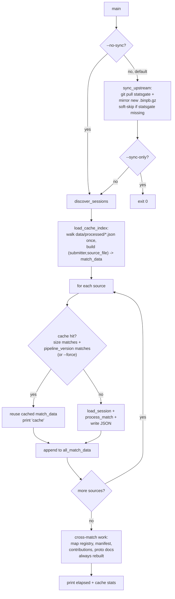

# Sync + Incremental Pipeline

## Decision

One zero-flag entrypoint, three opt-out flags, one cache key, one new constant. Everything stays in [scripts/process_stats.py](scripts/process_stats.py) to honor the project's "all data processing happens in `process_stats.py`" rule. No new files, no sidecar cache index — we reuse fields already in the per-match JSON.

**Sync is default-on.** A missing `statsgate/` clone is a soft-skip (warn + continue with local sessions); a failing `git pull` is a hard-fail with a clear `--no-sync` hint.

```
python scripts/process_stats.py              # default: sync + process only changed
python scripts/process_stats.py --no-sync    # offline: skip git pull + mirror, process locally
python scripts/process_stats.py --sync-only  # sync, don't process (fetch-only)
python scripts/process_stats.py --force      # sync + reprocess every match (cache invalidation override)
```

`--no-sync` and `--sync-only` are mutually exclusive (argparse mutex group). `--force` composes with both sync modes.

## How It Fits Together



## Concrete Changes — All in [scripts/process_stats.py](scripts/process_stats.py)

### 1. New constant near other top-level constants (~line 28)

```python
PIPELINE_VERSION = 1  # Bump when process_match() output semantics change.
                      # Cached per-match JSONs with a different version are
                      # invalidated. Orthogonal to match.schema_version
                      # (frontend contract).
```

### 2. Embed cache fields in the `match` block

In [scripts/process_stats.py](scripts/process_stats.py) at lines 2628-2663, add three lines next to the existing `source_file`/`submitter` fields. `process_match()` already takes `source_file` (line 1682) — we just thread the size through:

```python
"match": {
    "id": match_id,
    "source_file": source_file,
    "source_size_bytes": source_size_bytes,   # NEW
    "submitter": submitter,
    "pipeline_version": PIPELINE_VERSION,     # NEW
    ...
}
```

Update the `process_match()` signature (line 1682) to accept `source_size_bytes` as a new positional arg, and update the call site at line 3185 to pass `session_path.stat().st_size`.

### 3. New helper `sync_upstream()` (~35 lines)

Lives near `discover_sessions()` (line 1054). Pseudocode:

```python
STATSGATE_DIR = PROJECT_ROOT / "statsgate"
STATSGATE_SESSIONS = STATSGATE_DIR / "sessions"

def sync_upstream():
    """Pull upstream statsgate clone + mirror new .binpb.gz into data/sessions/.

    Soft-skips (warn + return) if statsgate/ isn't cloned — supports the
    'I only ever drop files in manually' workflow without needing --no-sync.
    Hard-fails on git pull errors (auth, conflicts, network) so the user
    notices real problems; --no-sync is the documented escape hatch.
    """
    if not STATSGATE_DIR.exists():
        print(f"  Note: {STATSGATE_DIR.name}/ not present; skipping sync.")
        print("  (Clone it with: git clone https://github.com/vtrider/statsgate.git statsgate)")
        return

    print(f"Pulling upstream in {STATSGATE_DIR}...")
    try:
        subprocess.run(
            ["git", "-C", str(STATSGATE_DIR), "pull", "--ff-only"],
            check=True,
        )
    except subprocess.CalledProcessError as e:
        print(f"\nERROR: git pull failed (exit {e.returncode}).")
        print("  Use --no-sync to skip and process local sessions only.")
        sys.exit(2)

    copied = []
    skipped_size_mismatch = []
    for user_dir in sorted(STATSGATE_SESSIONS.iterdir()):
        if not user_dir.is_dir(): continue
        for src in sorted(user_dir.iterdir()):
            if src.suffix != ".gz" or not src.stem.endswith(".binpb"): continue
            dest = SESSIONS_DIR / user_dir.name / src.name
            if dest.exists():
                if dest.stat().st_size != src.stat().st_size:
                    skipped_size_mismatch.append(dest)  # warn, never overwrite
                continue
            dest.parent.mkdir(parents=True, exist_ok=True)
            shutil.copy2(src, dest)
            copied.append(f"{user_dir.name}/{src.name}")

    print(f"Synced {len(copied)} new file(s)")
    for c in copied: print(f"  [copy] {c}")
    for s in skipped_size_mismatch:
        print(f"  WARN: size mismatch, NOT overwritten: {s.relative_to(SESSIONS_DIR)}")
```

Safety guarantees baked in:
- Never deletes from `data/sessions/` (additive only — protects the local-only `Sev/` folder)
- Never overwrites existing files (size mismatch warns, doesn't clobber — preserves any local edits)
- `--ff-only` makes a divergent local statsgate clone fail loudly instead of auto-merging
- Missing `statsgate/` is a soft-skip with a clone hint (supports manual-drop-only workflow without `--no-sync`)
- Failed `git pull` is a hard-fail with a `--no-sync` hint (real problems should be visible, not swallowed)

### 4. New helper `load_cache_index()`

```python
def load_cache_index():
    """Walk data/processed/*.json once, build {(submitter, source_file): match_data}."""
    index = {}
    if not OUTPUT_DIR.exists(): return index
    SKIP = {"matches.json", "match_contributions.json", "all_matches.json"}
    for json_path in OUTPUT_DIR.glob("*.json"):
        if json_path.name in SKIP: continue
        try:
            with open(json_path, "r", encoding="utf-8") as f:
                cached = json.load(f)
        except (OSError, json.JSONDecodeError):
            continue
        m = cached.get("match", {})
        if m.get("pipeline_version") != PIPELINE_VERSION: continue
        sub = m.get("submitter"); src = m.get("source_file")
        if sub and src and m.get("source_size_bytes") is not None:
            index[(sub, src)] = cached
    return index
```

### 5. Refactor the per-match loop in [main()](scripts/process_stats.py#L3144) (lines 3174-3193)

```python
cache = {} if args.force else load_cache_index()
print(f"Cache index: {len(cache)} prior matches available")

all_match_data = []
submitter_by_id = {}
n_cache_hit = n_processed = 0

for session_path, submitter in sources:
    cache_key = (submitter, session_path.name)
    current_size = session_path.stat().st_size
    cached = cache.get(cache_key)
    if cached and cached["match"].get("source_size_bytes") == current_size:
        match_data = cached
        n_cache_hit += 1
        print(f"  [cache] {submitter}/{session_path.name}")
    else:
        print(f"  [fresh] {submitter}/{session_path.name}")
        session = load_session(session_path)
        match_data = process_match(session, session_path.name, current_size,
                                   submitter, resolve_weapon, resolve_unit,
                                   known_powerup_odfs, known_players)
        out_path = OUTPUT_DIR / f"{match_data['match']['id']}.json"
        with open(out_path, "w", encoding="utf-8") as f:
            json.dump(match_data, f, indent=2, ensure_ascii=False)
        n_processed += 1
    all_match_data.append(match_data)
    submitter_by_id[match_data["match"]["id"]] = submitter

print(f"\n{n_cache_hit} cached, {n_processed} reprocessed")
```

Cross-match work (lines 3195-3290 — map registry, manifest, contributions, proto docs) stays exactly as-is. It's already cheap and depends only on `all_match_data`.

### 6. Argparse + timing in `main()`

```python
import argparse, time
parser = argparse.ArgumentParser(
    description="VT Stats pipeline. Default: sync upstream + process only changed matches."
)
sync_group = parser.add_mutually_exclusive_group()
sync_group.add_argument("--no-sync", action="store_true",
                        help="Skip git pull + mirror; process only what's already in data/sessions/")
sync_group.add_argument("--sync-only", action="store_true",
                        help="Sync upstream then exit; don't process")
parser.add_argument("--force", action="store_true",
                    help="Ignore cache; reprocess every match (composes with sync flags)")
args = parser.parse_args()

t0 = time.perf_counter()
if not args.no_sync:
    sync_upstream()
    if args.sync_only:
        print(f"\nDone in {time.perf_counter()-t0:.1f}s (sync-only)")
        return
# ... rest of main ...
print(f"\nDone in {time.perf_counter()-t0:.1f}s "
      f"({n_cache_hit} cached, {n_processed} reprocessed)")
```

Flag combinations:
- `(none)` → sync + process incrementally
- `--no-sync` → process incrementally, no network
- `--sync-only` → sync, skip processing
- `--force` → sync + reprocess all
- `--no-sync --force` → reprocess all locally
- `--sync-only --force` → argparse allows it (mutex group only spans `--no-sync` vs `--sync-only`), but `--force` is a no-op since we exit before processing. Print a one-line warning and proceed.
- `--no-sync --sync-only` → rejected by argparse (mutex group)

## Cache Invalidation Rules

The cache hits **only** when both conditions hold:

1. `cached.match.source_size_bytes == current_source.stat().st_size` (source byte-identical)
2. `cached.match.pipeline_version == PIPELINE_VERSION` (code semantically unchanged)

When to bump `PIPELINE_VERSION`:

- Any change to `process_match()` output shape or values
- Any change to helper functions it calls (positioning, highlights, weapon meta, etc.)
- Any change to `_extract_contribution()` (since cached per-match JSONs feed into it)

When NOT to bump:

- Frontend-only changes (those bump `match.schema_version` instead)
- Sync logic changes
- Cache logic changes itself
- Manifest/contributions cross-match logic (always rebuilt from in-memory list)

The two version fields are deliberately orthogonal: `schema_version` is a frontend contract (the JS reads it to decide rendering), `pipeline_version` is an internal cache invalidator. Don't fuse them.

If you ever forget to bump and ship stale data: just run `--force` once to rebuild from scratch. No persistent state to corrupt.

## Out of Scope (Explicit Non-Goals)

- Pruning orphan per-match JSONs whose source `.binpb.gz` was deleted (rare; they're invisible to the frontend since they're not in `matches.json`)
- Parallel processing of fresh matches (could come later if process_match becomes a bottleneck even for new files)
- Auto-cloning `statsgate/` if missing (we print a clear hint instead — clone is a one-time setup)
- Touching `js/all-matches-aggregator.js` (browser side already incremental — it just reads `match_contributions.json`)
- Changing the existing `match.source_file` semantics (kept as bare basename, `submitter` already pairs with it)

## Documentation Touch-Ups (small)

- [AGENTS.md](AGENTS.md) — add a one-paragraph "Pipeline Invocation" note under "Key Conventions" mentioning the three flags and the `PIPELINE_VERSION` bumping discipline.
- [DEVELOPER_GUIDE.md](DEVELOPER_GUIDE.md) — same one-paragraph note in the pipeline section.
- No rule file changes needed.

## Verification Checklist

After implementing, run in this order:

1. `python scripts/process_stats.py --no-sync --force` — clean rebuild without touching upstream; should look exactly like today's output. Confirm `data/processed/*.json` files now contain `source_size_bytes` and `pipeline_version`.
2. `python scripts/process_stats.py --no-sync` — second run; should print `54 cached, 0 reprocessed` and finish in seconds.
3. Touch a single source file (`copy /b data\sessions\VTrider\<one>.binpb.gz +,,` to bump mtime without changing size) — should still cache-hit (we key on size, not mtime, deliberately).
4. Modify a single per-match JSON's `source_size_bytes` to wrong value — should reprocess just that one.
5. `python scripts/process_stats.py --sync-only` (with statsgate up to date) — should pull, print `Synced 0 new file(s)`, then exit.
6. Temporarily rename `statsgate/` to `statsgate.bak/` and run `python scripts/process_stats.py` — should print the soft-skip note ("statsgate/ not present; skipping sync") and continue processing local sessions only. Restore the folder afterward.
7. Diff `data/processed/matches.json` and `data/processed/match_contributions.json` between a `--no-sync --force` run and a `--no-sync` cached run — they should be byte-identical (the cache path is a true no-op for downstream artifacts).