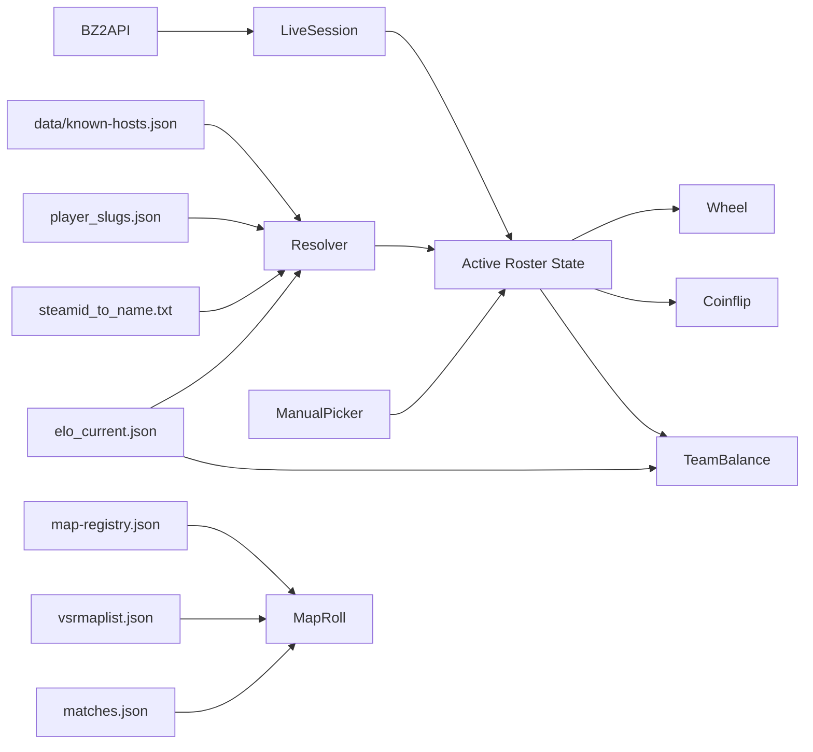
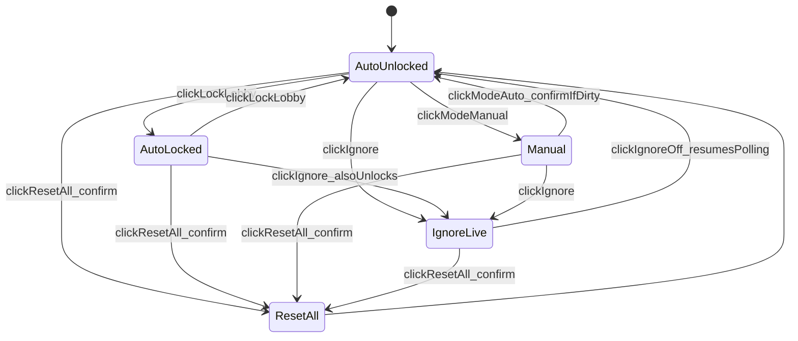

# Lobby Tools Page

A new picker-unaware, picker-irrelevant, purely-client-side `/tools` page. Six section cards (Live Session, Active Roster, Player Wheel, Coinflip, Map Roll, Team Balonce) consume the existing pipeline outputs (`elo_current.json`, `player_slugs.json`, `map-registry.json`, `vsrmaplist.json`, `steamid_to_name.txt`, `known-hosts.json`) plus live BZ2 lobby data via the vendored `BZ2API`. Zero new pipeline outputs needed.

## Project conventions inherited (non-negotiable)
- All styles via CSS custom properties (`--kb-*` for colors, `--vt-*` for effects). Zero hardcoded colors in HTML/JS.
- Geist Sans / Geist Mono fonts (vendored).
- Bootstrap 5.3.2 components only (modals, toasts, dropdowns, button groups). No new dependencies.
- All inline interactions through CSS files only; no `<style>` blocks in HTML.
- All disabled pills use `disabled` attribute + muted opacity. **Never** add "Coming soon" chips, tooltips, or any future-feature explainer text.
- Pill groups (selection-method on wheel, mode on coinflip, pool count on map roll) implemented as Bootstrap `btn-group` with radio-style toggle behavior — only one selected at a time.

## Testing

This project has no JS test framework. Verification is manual via the page itself (with fixture data and live lobbies where applicable). Each phase's deliverables include a manual-test checklist captured in the corresponding PR description / commit message.

## Viewport-fit layout strategy

The page targets a **single-viewport fit** on desktop (no page-scroll on a typical 1080p+ screen). Strategy:

- **Above 1280px wide**: CSS Grid 2-column layout. Left column carries the "data trio" (Live Session, Active Roster, Team Balonce); right column carries the "tools trio" (Player Wheel, Coinflip, Map Roll). Header action row spans both columns at the top.
- **Below 1280px wide**: Falls back to single-column stacked layout with normal page scroll. No attempt to viewport-fit on narrow screens.
- **Within each card**: internal `overflow-y: auto` on the content area so long content (e.g., 16-entry manual roster) scrolls inside the card instead of pushing the layout.
- **Section heights**: each card carries a `max-height: calc((100vh - var(--vt-tools-chrome-offset)) / 3)` ceiling. `--vt-tools-chrome-offset` accounts for the sticky topnav height (~56px) + page header action row (~64px) + grid gap (~24px). Cards with too little content shrink to natural height; cards with too much enable internal scroll.
- **Toast container** floats top-right (fixed positioning), out of the grid flow.
- The 1280px breakpoint is tunable post-ship via a single CSS custom property `--vt-tools-grid-breakpoint`.

## High-level data flow



## Topnav scope decision: Reading C

The pulsing topnav pill is reduced to a tiny "live activity" pulse on the new `Tools` link. The full live-session card, Steam Join button, and known-host dropdown all migrate into the `/tools` Live Session section.

- Existing [`js/active-game-indicator.js`](js/active-game-indicator.js) is gutted to ~150 LOC: still polls every 30s with the same backoff, still filters by `known-hosts.json` allowlist, but only emits a single signal — `pulse on / pulse off` — applied to the `Tools` topnav link's container.
- `#vt-active-game` + `#active-game-modal` DOM removed from all six shells.

## Phasing (all ships together, ordered logically)

### Phase 0 — Shared plumbing
- Factor [`js/active-game-indicator.js`](js/active-game-indicator.js)'s `renderModal()` / `renderTeamColumns()` / `renderPlayerRow()` into a new `js/live-session-card.js`. Stateless: `renderLiveSessionCard(session, container, opts)`.
- Reduce [`js/active-game-indicator.js`](js/active-game-indicator.js) to a "pulse Tools link if known-host lobby is live" mini-poller. Public surface shrinks to just the boot block.
- Remove `#vt-active-game`, `.vt-active-game-pill`, `.vt-active-game-gamewatch`, `#vt-active-game-dropdown`, `#vt-active-game-join`, `#active-game-modal` from all shells: [`index.html`](index.html), [`docs.html`](docs.html), [`raw.html`](raw.html), [`odf/index.html`](odf/index.html), [`player/index.html`](player/index.html), [`map/index.html`](map/index.html).
- Add `Tools` topnav link (icon `bi-controller`) sibling of `Maps` on the same six shells. The link's container exposes `data-vt-tools-live="0|1"` for the pulse-css to hook into.
- **CSS class naming**: the factored `js/live-session-card.js` reuses the existing `.vt-active-game-modal-*` class names verbatim — no rename — to minimize CSS churn. The "active-game" semantic prefix is acceptable historical naming; rename can happen post-ship if it ever becomes confusing.
- Add `Tools` link to [`scripts/player_template.html`](scripts/player_template.html) and [`scripts/map_template.html`](scripts/map_template.html). Bump `PLAYER_TEMPLATE_VERSION` 6 → 7 in [`scripts/generate_player_pages.py`](scripts/generate_player_pages.py:49); bump `MAP_TEMPLATE_VERSION` 1 → 2 in [`scripts/generate_map_pages.py`](scripts/generate_map_pages.py:54).
- Create [`tools/index.html`](tools/index.html) skeleton (topnav, header action row, six empty section cards arranged in the **2-col viewport-fit grid layout** with `data-trio` left column [Live Session / Active Roster / Team Balonce] and `tools-trio` right column [Player Wheel / Coinflip / Map Roll], plus modals + toast container).
- Create [`css/tools.css`](css/tools.css) — set up the `@media (min-width: 1280px)` grid layout from day one with per-card `max-height` ceilings + internal `overflow-y: auto`; component-specific styling added in subsequent phases.
- Create [`js/tools/player-resolver.js`](js/tools/player-resolver.js). Eager loaders for `known-hosts.json`, `elo_current.json`, `player_slugs.json`; lazy loader for `steamid_to_name.txt`. Exposes `window.VTToolsResolver = { ready: Promise, resolve(steam64, lobbyNick) -> {displayName, slug, steamProfileUrl, vtstatsUrl, vtsr, matchesPlayed, matchesAsCmdr, cmdrShare, tier, isProvisional, isUnknown, lobbyNick} }`.

### Phase 1 — Page shell + Live Session + Roster + global toggles
- [`js/tools/live-session.js`](js/tools/live-session.js): polls `BZ2API.fetchSessions({enrichMaps: false, enrichVsrMaps: true})` every 30s (same cadence + backoff posture as `active-game-indicator.js`). Filter survivors to `known-hosts.json` allowlist AND `gameBalance === 'VSR'`. If multiple survive, surface a dropdown picker; pre-select largest. Render via the factored `renderLiveSessionCard()`. Exposes the current `liveRoster` to `main.js` via an event bus.
- Header controls on the Live Session card:
  - `Refresh now` button (immediate `tick()` reset of poll timer)
  - `Lock lobby` toggle button (padlock icon) — when ON, polling continues silently but the surfaced session/roster is frozen at lock-time. Lock indicator shows `Locked at HH:MM:SS`. Suppresses join/leave toasts while locked.
  - `Ignore live data` toggle (right side) — master kill-switch: stops `BZ2API` polling entirely, forces `mode` to manual, disables the Auto radio with tooltip explanation.
- [`js/tools/main.js`](js/tools/main.js):
  - Page bootstrap, wires all section modules.
  - Top-of-page action row: `Reset all` button + `Ignore live data` toggle.
  - State object `pageState = { mode: 'auto'|'manual', ignoreLive: bool, lobbyLocked: bool, liveRoster: [], manualRoster: [], rosterSnapshotForLockOrSwitch: [], lastSessionId: string|null, isDirty: bool, components: {...} }`.
  - Mode toggle (radio): Auto / Manual. **Lives in the Active Roster card header**, not the page action row.
    - Auto→Manual = snapshot current `liveRoster` into `manualRoster`; auto-unlock lobby if locked.
    - Manual→Auto = confirm-discard if `manualRoster.length > 0`; clear `manualRoster`; resume polling-driven roster.
  - `beforeunload` guard wired to a centralized `isDirty` getter: returns `true` when ANY of — `mode === 'manual' && manualRoster.length > 0` OR wheel has been spun (`wheel.lastWinner !== null`) OR wheel has removals (`wheel.removedSteam64s.size > 0`) OR coin has flipped (`coin.lastResult !== null`) OR map has rolled (`mapRoll.lastResults.some(r => r !== null)`) OR team-balonce has been computed (`balonce.partition !== null`) OR has any manual swap (`balonce.manualSwaps.size > 0`).
  - `Reset all` button opens confirm modal; on confirm, resets every component's state, clears toggles back to defaults (`mode: 'auto', ignoreLive: false, lobbyLocked: false`), wipes dirty flag, triggers a fresh poll if not ignoring.
  - **Cross-toggle interactions** (made explicit so the state machine is fully specified):
    - `lobbyLocked` is force-cleared when `ignoreLive` flips ON (no polling = nothing to lock).
    - `lobbyLocked` is force-cleared when `mode` switches to Manual (manual roster doesn't track live data).
    - `mode` is forced to `manual` when `ignoreLive` flips ON; Auto radio is disabled with a tooltip until `ignoreLive` is flipped OFF.
    - Toggling `ignoreLive` OFF does **not** auto-switch mode back to Auto; the user must opt back in via the mode toggle.
- Active Roster card: list of current roster (Auto mode: read-only from live data; Manual mode: editable). Each row carries the resolved display name, lobbyNick subtext (if differs), VTSR-T tier pill, commander-history badge (`Strong cmdr` / `Cmdr-curious` / `Rare cmdr`), Steam icon + VTstats icon, and (Manual mode only) a remove button. Card header carries the Mode toggle + roster source attribution chip (`Live: <host>'s lobby` / `Locked at HH:MM:SS` / `Manual roster`).
- Manual mode adds: search-driven `Add player` dropdown (union of `player_slugs` + `steamid_to_name.txt`) + a `Custom entry` input for ad-hoc guests. **Provisional anchoring rules** (used by team-balonce + roster row chips):
  - Unrated (no entry in `elo_current.ratings[]`): assigned VTSR `1500`, flagged `isUnknown: true`, `isProvisional: true` — renders a `provisional` chip.
  - Rated but `matches_provisional: true` in `elo_current.json`: their actual VTSR carries through, flagged `isProvisional: true` — also renders a `provisional` chip.
  - Custom (no Steam64, user-typed name): assigned VTSR `1500`, flagged `isCustom: true`, `isProvisional: true` — renders a `custom` chip.
- [`js/tools/toast-manager.js`](js/tools/toast-manager.js): tiny Bootstrap-toast wrapper. `showJoin(name, count)` / `showLeave(name, count)`. Stacks in the **toast container** (fixed top-right, `position: fixed; top: 80px; right: 24px; z-index: 1080;` to clear sticky topnav). Max 5 visible, auto-dismiss 4s. Suppressed when `lobbyLocked || ignoreLive || mode === 'manual'`.
- Join/leave detection: in `live-session.js` after each successful poll, diff previous vs new `roster` by steam64 and call the toast manager. **Baseline reset rules** (no toasts on any of these conditions, to avoid spurious spam):
  - First successful poll after page load
  - First successful poll after `ignoreLive` is toggled OFF
  - First successful poll after the selected `sessionId` changes (user picked a different lobby from the session picker)
  - First successful poll after `lobbyLocked` is toggled OFF (catches up to whatever the live state is now)
  - When `mode === 'manual'` (no polling-driven roster diff is meaningful)

### Phase 2 — Player Wheel
- [`js/tools/wheel.js`](js/tools/wheel.js).
- Canvas-based wheel. Slice colors **alternate** `--kb-primary` / `--kb-secondary`. Slice text in `--kb-text-primary` rotated to slice angle. Center hub uses `--kb-bg-card`. Pointer/marker uses `--kb-text-primary`.
- **Theme-reactivity mechanism**: on init, resolve colors via `getComputedStyle(document.documentElement).getPropertyValue(...)`. Listen for theme changes via a `MutationObserver` on `<html>` watching `data-theme` / `class` attribute changes. On change → re-read colors and re-render the wheel.
- Selection-method pills above the wheel: `Wheel` (active), `Plinko` (disabled), `Sniper` (disabled). Implemented as a Bootstrap `btn-group` radio. Disabled pills carry the `disabled` attribute + muted opacity. **No "Coming soon" chip, no label, no tooltip teaser** — pills are just disabled as-is.
- Spin: click anywhere on the wheel OR the `SPIN` button. Pre-compute target via `Math.random()`. Animation uses `requestAnimationFrame` with angular velocity decay (~4–6s friction-based deceleration) landing on target. `prefers-reduced-motion` → 800ms snap.
- Result modal (Bootstrap): extravagant reveal with the resolved display name + tier pill + lobbyNick subtext + Steam profile icon link + VTstats profile icon link + `Remove from wheel` button + `Spin again` button. Removing populates a `Removed (N)` chip list below the wheel with `Restore` per-item buttons.
- Roster sync: when active roster changes, wheel slice list updates silently (no respin). Wheel-local `removedSteam64s` Set persists across roster updates (a removed player who re-joins the lobby stays removed until restored).
- **Empty states**: 0 active slices → "Add at least 2 players to spin" placeholder, SPIN button disabled. 1 active slice → "Only 1 player available — add or restore others to spin", SPIN button disabled.

### Phase 3 — Coinflip
- [`js/tools/coinflip.js`](js/tools/coinflip.js).
- Mode pills: `Single` (active), `Best 3 of 5` (disabled). Bootstrap `btn-group` radio. Same convention as wheel pills — disabled pill renders as-is, no chip / label / tooltip teaser.
- Animation: horizontal-shuffle selector bar oscillating between two team cards labeled `Team 1` / `Team 2` (or the live session's `teamNames.svar1` / `svar2` when present and non-empty). Decelerates onto winner over ~2s using `requestAnimationFrame`; `prefers-reduced-motion` → 500ms snap.
- Result inline; doesn't open a modal (already attention-grabbing on a stacked page).
- **No empty-state gate**: coinflip is always operable regardless of roster (it's just choosing a team, not a player).

### Phase 4 — Random Map (slot machine)
- [`js/tools/map-roll.js`](js/tools/map-roll.js).
- Pool count pills: `7+` (default) · `6+` · `All`. Bootstrap `btn-group` radio. Apply to all three reels.
- Three reels:
  - Reel 1 (Popular): `vsrmaplist.json` entries where `Tags === "popular"`, filtered by pool count
  - Reel 2 (Played before): `map-registry` entries whose `map_file` is in `data/processed/matches.json`, filtered by pool count
  - Reel 3 (Unplayed): `map-registry` entries NOT in matches, filtered by pool count
- Per reel: CSS `translateY()` keyframe with ~60-80 cells scrolling past, decelerating onto winner. Stagger end-times (reel 1 stops at 3s, reel 2 at 4s, reel 3 at 5s). `prefers-reduced-motion` → reveal three cards directly.
- Each cell shows tiny `data/maps/<file>.png` thumbnail + map name. Final landed cell expands below the reel with author chip, pool count chip, `View map page` deep-link to `map/<slug>/`.
- Lazy-load `vsrmaplist.json` + `map-registry.json` + `matches.json` on first interaction.

### Phase 5 — Team Balonce
- [`js/tools/team-balonce.js`](js/tools/team-balonce.js). Section title `Team Balonce` (intentional community-in-joke misspell — applies everywhere in the UI, file names, and CSS class names).
- **Commander Configurator** (top of card): two slots (Team 1 cmdr, Team 2 cmdr) with `Pick from roster` dropdowns + `Clear` + `Auto-suggest both` button. Live status chip: `0/2 commanders set` / `1/2` / `2/2`.
- Candidacy score for auto-suggestion:
  ```
  candidacy = vtsr_zscore + 1.5 * cmdr_experience_zscore
  cmdr_experience = matches_as_commander / max(matches_played, 1)
  ```
  Tie-break with raw `matches_as_commander` DESC.
- Three-scenario banner:
  - **0 set** — orange: *"Commander picks suggested from VTSR-T + commander match count. VTSR-T measures thug skill — it's not a perfect proxy for commander ability. Consider setting commanders manually for best results."*
  - **1 set** — yellow: *"Suggesting the second commander from VTSR-T + commander match count. Same caveat applies."*
  - **2 set** — green/informational: *"Both commanders locked. Showing best thug balance. Cmdr ΔVTSR is informational — commander ability and thug VTSR are different skills."* Plus a `Cmdr ΔVTSR: ±N` chip on the banner.
- Per-roster-row commander hint badges (also surfaced in the Active Roster card so they're glanceable everywhere):
  - `Strong cmdr` — `matches_as_commander >= 5 AND cmdr_share >= 0.4`
  - `Cmdr-curious` — `1 <= matches_as_commander < 5`
  - `Rare cmdr` — `matches_as_commander >= 5 AND cmdr_share < 0.2` (the Domakus case)
- **Partition algorithm** (odd-lobby-aware): exhaustively enumerate **all non-trivial subset splits** of the thug pool — not just N/2 vs N/2. For thug count M, iterate over all `2^M` subsets (skip empty + full); each subset = one team's thugs, complement = other team's. Slot cap is ≤5 per team total (commander + thugs). Score by `|ΣVTSR_team1 − ΣVTSR_team2|`; pick min-delta. This naturally handles:
  - 10-player lobby (2 cmdrs + 8 thugs) → best 4-thug vs 4-thug split
  - 8-player lobby (2 cmdrs + 6 thugs) → best 3v3
  - 7-player lobby (2 cmdrs + 5 thugs) → best 3v2 or 2v3 (smaller of two becomes the disadvantaged side, but min-delta is what's optimized — equal-strength uneven splits can still beat naively-balanced even ones)
  - Edge: ≤2 players total → no partition, surface a "Need at least 3 players" empty state
  - Edge: lobbies of N ≥ 9 with 0 commanders set → still enumerable (max thug pool is 10 → 1024 subsets, trivial)
- Unrated/custom roster entries anchored at 1500 with `provisional` chip; their inclusion in the sum carries a small uncertainty annotation on the banner ("N provisional players included — balance has reduced confidence").
- Render two team columns. Each row: drag handle, name, VTSR, tier pill, commander chip (if applicable). Empty-team-slot rows render as `+1` ghost placeholders so the visual asymmetry of an uneven split is obvious.
- Drag-to-swap (HTML5 drag-and-drop) — supports moving a player between columns as well as reordering within a column (intra-column reorder is cosmetic only). Cross-column swap recomputes `ΔVTSR` + Played Meter live. Manual swaps tracked in a `Set`; `Reset to best balance` button reverts.

#### Played Meter (imbalance gauge)

A dynamic horizontal bar that visualises team-strength delta. Sits below the team columns, full-width across both.

- **Visual**: horizontal pill-shaped track with a gradient backdrop running `green → yellow → orange → red` left-to-right. A floating chevron indicator on the bar marks the **current** imbalance position; the chevron points to the disadvantaged team (left = Team 1 disadvantaged, right = Team 2 disadvantaged). A center tick mark indicates "perfectly balanced".
- **Position formula**:
  ```
  delta = ΣVTSR_team1 − ΣVTSR_team2   // signed
  abs_delta = |delta|
  normalized = min(abs_delta / MAX_PLAYED_METER_DELTA, 1.0)
  chevron_pos = 50% + 50% * normalized * sign(delta)   // 0% = Team1 disadvantaged, 50% = perfect, 100% = Team2 disadvantaged
  ```
  with `MAX_PLAYED_METER_DELTA = 1000` (about a 4-thug-team-sum delta of 250 per player — covers realistic worst-case 10-player VSR lobbies; values above peg the indicator at the rail end).
- **Color band** at the indicator position drives a label chip next to the bar:
  - `< 100 ΔVTSR` — green chip: `Well balanced`
  - `100–300` — yellow-green chip: `Slight edge to <team>`
  - `300–600` — orange chip: `Imbalanced — <team> at disadvantage`
  - `>= 600` — red chip: `Heavily imbalanced — <team> at disadvantage`
- **Disadvantaged-team indicator** is always explicit: the disadvantaged team's column header gets a `Disadvantaged` badge when `abs_delta >= 100`. Removed when below threshold or when teams are perfectly balanced.
- **Updates live**: every drag-swap, every commander reassignment, every roster change recomputes the meter. Animation is a CSS transition on the chevron's `left` property (~200ms ease-out) so changes feel responsive but readable.
- **Reduced motion**: `prefers-reduced-motion` → instant chevron jump instead of transition.

### Phase 6 — Polish
- **Viewport-fit grid layout** finalized:
  - CSS Grid 2-col above 1280px (`@media (min-width: 1280px)`); single-col below.
  - Per-card `max-height` via CSS calc against viewport height + header offsets so the three rows distribute vertical space evenly.
  - Internal `overflow-y: auto` on each card's content region for long content.
  - `--vt-tools-grid-breakpoint` custom property for post-ship tuning.
- `prefers-reduced-motion` audit across wheel, coin, slot, Played Meter chevron transition.
- Mobile/sub-1280 polish: slot reels stack vertically, wheel resizes to viewport-min, team-balonce drag-swap falls back to a tap-to-swap row picker (HTML5 drag is unreliable on touch).
- Error states: lobby fetch failure ("Lobby unreachable — switch to Manual or try again"), empty roster ("Roster is empty — switch to Manual or wait for a lobby"), empty filter result for map roll, < 3 players for team balonce.
- Documentation:
  - Update [`AGENTS.md`](AGENTS.md) with `/tools` page summary + cross-references.
  - Update [`.cursor/rules/project-overview.mdc`](.cursor/rules/project-overview.mdc) Architecture section to include `/tools` as the project's seventh standalone page.
  - Update [`DEVELOPER_GUIDE.md`](DEVELOPER_GUIDE.md) with a new section on the Tools page architecture + Reading C topnav scope + Played Meter formula + odd-lobby partition behavior.

## File-by-file summary

### New files
- [`tools/index.html`](tools/index.html) — page shell: topnav, page header action row (`Reset all` button + `Ignore live data` toggle), 2-col grid with six section cards (data-trio left: Live Session, Active Roster, Team Balonce; tools-trio right: Player Wheel, Coinflip, Map Roll), modals (wheel result, reset confirm, manual-→-auto discard confirm), Bootstrap toast container (fixed top-right, `z-index: 1080`)
- [`css/tools.css`](css/tools.css) — 2-col viewport-fit grid (above 1280px) + single-col fallback, per-card max-height + internal overflow, wheel canvas styling, slot machine reel layout, coin animation, team-balonce drag styling, Played Meter gradient track + chevron, section card chrome
- [`js/tools/main.js`](js/tools/main.js) — page bootstrap, state machine, Mode + Ignore + Lock + Reset wiring, beforeunload guard
- [`js/tools/player-resolver.js`](js/tools/player-resolver.js) — shared 4-tier Steam64 resolver, eager + lazy loaders
- [`js/tools/live-session.js`](js/tools/live-session.js) — known-hosts-filtered poller, session picker, force-refresh, lock-lobby, join/leave detection
- [`js/tools/wheel.js`](js/tools/wheel.js) — canvas wheel, spin physics, method pills, result modal
- [`js/tools/coinflip.js`](js/tools/coinflip.js) — horizontal-shuffle coin, mode pills
- [`js/tools/map-roll.js`](js/tools/map-roll.js) — three-reel slot machine, pool pills, category filtering
- [`js/tools/team-balonce.js`](js/tools/team-balonce.js) — commander configurator, candidacy ranking, odd-lobby-aware exhaustive partition, drag-to-swap, Played Meter
- [`js/tools/toast-manager.js`](js/tools/toast-manager.js) — small Bootstrap toast wrapper for join/leave notifications
- [`js/live-session-card.js`](js/live-session-card.js) — factored stateless renderer (`renderLiveSessionCard(session, container, opts)`)

### Modified files
- [`js/active-game-indicator.js`](js/active-game-indicator.js) — gut to ~150 LOC: keep polling + known-hosts filter + backoff; emit only `data-vt-tools-live` on the Tools topnav link container
- [`index.html`](index.html) — remove `#vt-active-game` (lines ~36–55) + `#active-game-modal` (lines ~1458–1483); add `Tools` topnav link (desktop + mobile burger variants)
- [`docs.html`](docs.html), [`raw.html`](raw.html), [`odf/index.html`](odf/index.html), [`player/index.html`](player/index.html), [`map/index.html`](map/index.html) — same removal + addition
- [`scripts/player_template.html`](scripts/player_template.html) — add `Tools` topnav link
- [`scripts/map_template.html`](scripts/map_template.html) — add `Tools` topnav link
- [`scripts/generate_player_pages.py`](scripts/generate_player_pages.py) — bump `PLAYER_TEMPLATE_VERSION` 6 → 7
- [`scripts/generate_map_pages.py`](scripts/generate_map_pages.py) — bump `MAP_TEMPLATE_VERSION` 1 → 2
- [`css/vtstats-theme.css`](css/vtstats-theme.css) — add `.vt-nav-icon-btn--tools-live` pulse keyframes + selector hook for `[data-vt-tools-live="1"]`; remove the bulk of the `.vt-active-game-*` block (keep what `js/live-session-card.js` still uses, e.g. `.vt-active-game-modal-*` since the card markup is now reused)
- [`AGENTS.md`](AGENTS.md) — document `/tools` as the project's seventh standalone page; document the Reading C topnav scope change
- [`.cursor/rules/project-overview.mdc`](.cursor/rules/project-overview.mdc) — same architectural addition
- [`DEVELOPER_GUIDE.md`](DEVELOPER_GUIDE.md) — new section describing Tools page architecture

## Cross-cutting state contracts



- **Lock lobby**: freezes the surfaced roster/session at lock-time; polling continues silently in the background so unlocking is immediate. Suppresses join/leave toasts. Wheel/coin/balonce keep working against the frozen roster. Force-cleared by `ignoreLive` ON and by mode switch to Manual.
- **Ignore live data**: full poll kill-switch. Force-clears `lobbyLocked`. Forces Manual mode (Auto radio disabled with tooltip). Cleanest way to escape bad lobby data.
- **Reset all**: confirm modal, then wipe — `mode: 'auto', ignoreLive: false, lobbyLocked: false`, all component states (wheel removals + last winner, coin result, map results, team-balonce commander config + manual swaps + partition), dirty flag. Triggers immediate poll.
- **Dirty flag** (drives beforeunload): true when ANY of — `mode === 'manual' && manualRoster.length > 0`, wheel has been spun, wheel has removals, coin has flipped, map has rolled, team-balonce has computed partition OR has manual swaps.
- **Join/leave toasts**: diff each poll's roster against the previous; emit only when `mode === 'auto' AND NOT lobbyLocked AND NOT ignoreLive`. Reset baseline (no toasts on next poll) when: first load, `ignoreLive` toggles OFF, selected `sessionId` changes, `lobbyLocked` toggles OFF.

## Load order in [`tools/index.html`](tools/index.html)

```
vendor/bootstrap/...
css/vtstats-theme.css
css/tools.css
js/bz2api.js                  -- existing vendored API
js/live-session-card.js       -- shared renderer
js/tools/player-resolver.js
js/tools/toast-manager.js
js/tools/live-session.js
js/tools/wheel.js
js/tools/coinflip.js
js/tools/map-roll.js
js/tools/team-balonce.js
js/tools/main.js              -- bootstrap last, wires everything
js/active-game-indicator.js   -- gutted-down topnav pulse poller
```