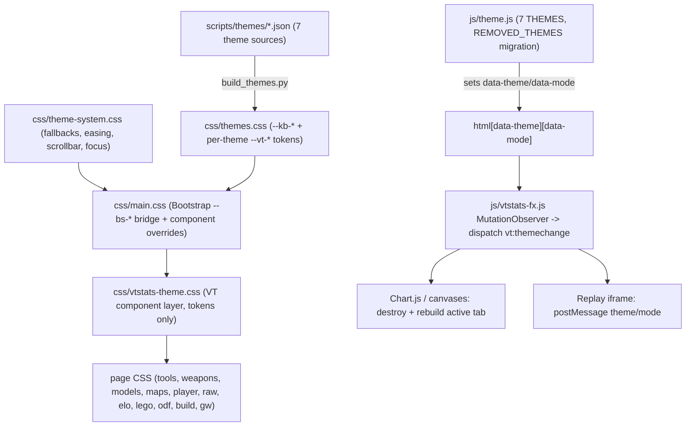

# VT HUD Style Revamp

## Locked decisions

- Stack stays Bootstrap 5.3.2 + vanilla JS; 21st.dev is used for component **patterns**, ported onto existing Bootstrap hooks. No Tailwind, no React, no new runtime deps, everything vendored.
- Identity: modern + BZCC in-game HUD. Primary reference = the game's own UI assets harvested from the local BZ2R install; 21st supplies layout/motion patterns.
- Theme set pruned 44 → 7: **`vt-hud`** (new default) · `neo-brutalism` · `cyberpunk` · `doom-64` · `retro-arcade` · `graphite` · **`classic-glass`** (today's `default` preserved).
- Geist Sans + Geist Mono stay. Light mode stays supported on every theme.
- Scope = everything: tokens, component CSS, all 18 shells, both pre-gen templates (30 player + 145 map stubs), the 3D Replay iframe. Out of scope: `fable/`, `critique/web/`, `_ui-cursor/`, `_odf-browser-seed/`, `_axis-analysis/`.
- Delivery: one branch `style-revamp`, four phases with approval checkpoints, nothing merges until Phase 4 passes.

## Design language — "VT HUD"

- **Surfaces**: opaque panels, hairline borders, flat elevation; hover/focus = thin accent glow, not blur/lift. Primary cards carry **corner brackets** (the game's `corner.0–3` sprite motif, drawn as CSS pseudo-elements sized by a token so other themes can zero it).
- **Palette**: derived in Phase 0 from the HUD sheets — one dominant interactive accent (`--kb-primary`), neutral HUD-tinted greys, status colors mapped to the game's own readout conventions. **Faction colors become theme-independent identity tokens** (ISDF / Hadean / Scion no longer alias `--kb-primary/--kb-warning/--kb-accent`).
- **Typography**: Geist Sans headings (tight tracking), uppercase letter-spaced HUD labels for `.stat-label`, Geist Mono tabular numerals everywhere data lives; large stats get a "readout" treatment inspired by the `bignum` sprite digits.
- **Glyphs**: Bootstrap Icons stay for UI verbs; BZCC glyphs (reticles, hardpoint icons, radar dots, triangles, diamond, brackets) are used as **semantic** decoration via a small committed sprite sheet + `.vt-glyph-*` classes.
- **Motion**: number tickers (existing `VTFx.animateCounters`), entrance stagger retained, one hero sweep; everything honors `prefers-reduced-motion`; no infinite loops except the existing Tools live pulse.
- **Background**: faint HUD grid + vignette driven by `--vt-ambient-*` (replaces the two radial washes); off in light mode.
- **Classic Glass** = today's `default` palette + today's `--vt-glass-*` values. It works as insurance only because Phase 2 makes glass/blur/radius/brackets **token-driven** — any hardcoded `backdrop-filter`/shadow left in component CSS is a defect.

## Architecture after the revamp

`css/layout.css` is removed from the stack (0 of 103 classes used).

## Phase 0 — Reference harvest + style tile (Checkpoint 1)

- New standalone `scripts/build_ui_reference.py` (mirrors [scripts/build_hud_assets.py](scripts/build_hud_assets.py); reuses `parse_sprite_table` generalized to every row, `dds_decode.decode_dds`, and the sRGB 78→77 patch from [scripts/build_cursor_sprite.py](scripts/build_cursor_sprite.py)):
  - Reads `bz2r_res/interface/sprite.txt` (all rows, grouped by its `#` comment headers: radar numerals, big numbers, dots, squares, cross, diamond, corners, triangles, every reticle sheet, misc) and dumps every frame plus every `baked/UI/**/*.dds` and `baked/HUD/**/*.dds` sheet whole into gitignored `_design/bzcc-ui/` with a contact-sheet `index.html`.
  - Emits `_design/palette.json`: dominant/accent hues sampled from the UI sheets, as the raw material for the `vt-hud` palette.
  - `--emit-glyphs` mode writes the **committed** production glyph sheet `data/ui/hud-glyphs.png` + `hud-glyphs.json` (brackets, dots, diamond, triangles, selected numerals), following the reticle/hp-icon precedent.
- Hand-author the `vt-hud` light + dark token sets from the palette (`scripts/themes/vt-hud.json`).
- Build `_design/style-tile.html` (gitignored) that loads the **real** CSS stack with the draft `themes.css`: palette, type scale, radius/border/glow, nav, card with brackets, leaderboard table, badge/tier/faction set, stat strip with ticker, gauge, tabs — for `vt-hud` and one alternate, light + dark.
- 21st patterns pulled here (reference only; ported later): stat strip / number ticker, bento grid, segmented control, sticky-header data table, hero with grid background, badge sets, timeline rail, gauge.
- Add `_design/` to `.gitignore`.
- **Checkpoint 1: style tile approved before any production file changes.**

## Phase 1 — Token system rebuild

- **`scripts/build_themes.py` (new)**: regenerates [css/themes.css](css/themes.css) from `scripts/themes/<id>.json`. Input = shadcn/tweakcn `cssVars.light/dark` shape (so any 21st/tweakcn theme imports in one command) plus the same shape hand-written for `vt-hud` and `classic-glass`. Output reproduces the existing variable contract exactly (base `--kb-bg-*` / `--kb-text-*` / `--kb-primary` … `--kb-admin-*`, the `color-mix()` derived set, static status colors, code/scrollbar tokens, `--kb-shadow-*`) — verified by diffing the regenerated `graphite` block against today's.
  - Contract additions: `--kb-chart-1..5` (from shadcn `chart-1..5`; hand-picked for `vt-hud`), `--kb-faction-i/e/f` as fixed identity colors (per-theme override allowed, default constant), and per-theme **`--vt-*` surface tokens** emitted alongside the palette: `--vt-surface-blur`, `--vt-surface-opacity`, `--vt-surface-border`, `--vt-radius-sm/md/lg`, `--vt-border-w`, `--vt-glow`, `--vt-bracket-size`, `--vt-ambient-grid`, `--vt-ambient-opacity`, `--vt-shadow-elevation-1/2/3`.
  - Define the tokens that are consumed today but never declared: `--vt-font-mono`, `--vt-font-system`, `--vt-navbar-h`, `--vt-radius`, `--vt-compare-accent`.
  - The `:root` fallback block carries `vt-hud` dark so an un-regenerated stub still renders the new theme.
  - `solarized`, `default` and the other 36 tweakcn ids are dropped; the five kept tweakcn themes are extracted verbatim from the current generated CSS into their JSON sources.
- **[js/theme.js](js/theme.js)**: `THEMES` → 7 entries with preview swatches; `REMOVED_THEMES` += the 38 dropped ids (including `default`); every `'default'` fallback (L75, L120, L307–314) → `'vt-hud'`; counter copy.
- **[css/main.css](css/main.css) L17–23 Bootstrap bridge** extended: `--bs-border-radius*`, `--bs-border-color`, `--bs-card-*`, `--bs-dropdown-*`, `--bs-modal-*`, `--bs-nav-pills-link-active-bg`, `--bs-table-*`, `--bs-tooltip-*`, `--bs-popover-*`, `--bs-toast-*`, `--bs-link-*`.
- **Theme-change reactivity (closes the inventory gap)**: [js/vtstats-fx.js](js/vtstats-fx.js) `initThemeChangeListener` (L192–208) dispatches `window` CustomEvent `vt:themechange {theme, mode}` after `applyThemeDefaults()`. Listeners: [js/app.js](js/app.js) → `destroyAllCharts()` + reset tab flags + re-render active tab (the existing filter-change path; `VTReplay`/`VTPositionPlayer` destroy first); `js/player.js`, `js/elo.js`, `js/maps.js`, `js/match-elo.js`, `js/storyline.js` → rebuild their charts; `js/tools/wheel.js` keeps its own observer; models/lego viewers re-read `--kb-bg-body` for the stage backdrop; dashboard forwards the event to the replay iframe via postMessage.
- `[data-mode="light"]` and `prefers-reduced-motion` blocks in [css/vtstats-theme.css](css/vtstats-theme.css) L317–343 move into the generated token layer.

## Phase 2 — Component layer rewrite (CSS only; Checkpoint 2)

- **Delete [css/layout.css](css/layout.css)** (Fumadocs-era `.kb-*` shell, 0/103 used) and the `.kb-site-modal-body` rule in main.css.
- **[css/main.css](css/main.css)**: rewrite the Bootstrap override sections (buttons L42, cards L367, forms L405, alerts L498, badges L579, tables L624, modals L663, dropdowns L711, theme dropdown L747, nav/tabs L822, pagination/breadcrumb, utilities) on tokens; purge its 38 literal colors.
- **[css/vtstats-theme.css](css/vtstats-theme.css)** section by section (line refs = current file):
  - Rewrite: `--vt-*` block (258) → thin shim pointing at generated tokens; AMBIENT (345) → HUD grid + vignette; GLASS SURFACES (375) → `.card/.navbar/.modal-content/.dropdown-menu` read `--vt-surface-*` + bracket pseudo-elements; NAV-PILLS (429) → HUD segmented tabs; TABLE ROW HOVER (474); TOPNAV ICON BUTTONS (713) + TOOLS PULSE (1154); GLOBAL FILTER BAR (1711); RADAR (1887); FACTION SCOREBOARD + badges (2080, faction tokens at 2345); DOCS PAGE (2740); MOBILE (3262); POSITIONING (3438–3852); MATCH PICKER (3852); HERO + RECENT (4746); DOCS SEARCH PALETTE (4949); HIGHLIGHTS (5254); TIER LADDER (5452); KATEX (5625); EXPLAINER STAGES (5772); TEASER (6049); LOADOUT/CHIPS (6111); CURSOR + GEAR (6724); ECONOMY (6894); STORYLINE (7246); BALONCE (7689).
  - Audit before touching: ACTIVE GAME INDICATOR (871) + MODAL (1188) — `index.html` L38–56 still carries `#vt-active-game` markup, so restyle rather than delete.
- **Page CSS purge to tokens** (literal colors today): `tools.css` 67, `replay-quality.css` 48, `tools-sniper.css` 16, `lego.css` 10, `maps.css` 5, `player.css` 4, `models.css` 3, `raw-browser.css` 2; `backdrop-filter` → `var(--vt-surface-blur)` in all 29 occurrences. Documented literal exceptions stay: `--vt-heatmap-team1/2`, `--vt-youtube`.
- **Chart.js**: `getThemeColors()` ([js/charts.js](js/charts.js) L22–35) exposes `--kb-chart-1..5` + faction tokens; multi-series charts use the chart palette; `glassTooltipHandler` (L65–125) reads surface tokens; `chartShadowPlugin` reads the per-theme shadow tokens.
- **Porting protocol** added to `.cursor/rules/styling.mdc`: every 21st "copy prompt" is prefixed with the adapter preamble — Bootstrap 5.3 + vanilla JS, colors only via `--kb-*`, effects only via `--vt-*`, no new deps, no inline styles, honor `prefers-reduced-motion`, motion via CSS or `VTFx`.
- **Checkpoint 2: dashboard + ELO + Tools screenshots, all 7 themes × light/dark.**

## Phase 3 — Markup, nav, templates, replay iframe (Checkpoint 3)

- **Shells (18)**: `index.html`, `docs.html`, `raw/`, `odf/`, `odf/guide/`, `build/`, `weapons/`, `models/`, `lego/`, `lego/studio/`, `map/`, `player/`, `elo/`, `tools/`, `gw/` + [scripts/player_template.html](scripts/player_template.html) + [scripts/map_template.html](scripts/map_template.html). Per shell: drop the `layout.css` link, `data-theme="default"` → `data-theme="vt-hud"`, new topnav markup, purge inline `style=` attributes (47 in index.html, 16 tools, 8 raw, 7 docs, 6 each map/player/elo/templates, 3–4 elsewhere) into classes.
- **Topnav**: new look, same canonical order and every hook preserved — `.vt-nav-menu` (gear anchor for `js/cursor-settings.js`), `[data-theme-menu]`, `[data-vt-tools-link][data-vt-tools-live]`, `hidden data-vt-page-control` relocation, `#topnav-collapse`. Brand gets a reticle glyph. Copy source stays `models/index.html` per the existing convention.
- **Dashboard** ([index.html](index.html)): match banner (L170+) → HUD "mission header" (map thumb, readouts, actions); `#match-tabs`/`#all-tabs` → segmented HUD tabs; section cards with brackets; hero/VTSR teaser stat strips → tickers. JS-emitted markup changes bounded to: leaderboard rows, highlight tiles, picker modal cards, VTSR teaser, directory cards — all `#section-*`, tab ids and `data-*` attributes unchanged.
- **Directory landings** (`player/`, `map/`, `models/`, `lego/`, `lego/studio/`) → bento card grids; ELO explainer headers, Tools header + card frames, Weapons Lab panels, Raw browser chrome, ODF browser/guide, Build Trees, Game Watch, docs.
- **Replay iframe** (`_map-analysis/render/replay.html` + `css/style.css` + `css/replay-style.css`): `<html data-theme data-mode>`, load `theme-system.css` + `themes.css` + Geist; its `--bg/--accent/...` tokens re-pointed to `var(--kb-*)` with current values as fallbacks; [js/app.js](js/app.js) `renderReplayTab` (L2774–2855, src at L2838) appends `&theme=&mode=`; `replay-data.js` URL parser (L45–61) applies them; parent `vt:themechange` → postMessage `{source:'vt-stats', action:'theme'}` handled in `replay.js`; remove the hardcoded `--kb-*` fallback palette in [css/replay-quality.css](css/replay-quality.css) L256–267.
- **Pre-gen stubs**: bump `PLAYER_TEMPLATE_VERSION` 19→20 ([scripts/generate_player_pages.py](scripts/generate_player_pages.py) L63) and `MAP_TEMPLATE_VERSION` 13→14 ([scripts/generate_map_pages.py](scripts/generate_map_pages.py) L68); regenerate once via the pipeline (`python scripts/process_stats.py --no-sync --no-prompt` — generators run post-ELO on cache hits) → 30 + 145 stubs rewritten.
- **Checkpoint 3: full-site sweep.**

## Phase 4 — Verification + docs

- Browser sweep on `python scripts/dev_server.py` (:8000): every shell × 7 themes × light/dark; widths 390 / 768 / 1280 / 1920; reduced-motion emulation; theme switch mid-session rebuilds charts on dashboard / player / elo / maps / tools; three.js canvases unaffected; replay iframe follows theme; no console errors.
- Contrast check: text tokens vs surfaces for every theme × mode (WCAG AA) via devtools/axe in the sweep.
- Gates: `python _investigation/run_all_gates.py` + `node _investigation/check_weapons_calc.mjs` / `check_weapon_fx.mjs` / `check_weapon_weave.mjs`. Markers that must survive: `function renderEconomyProductionCard` … `function buildlogFilterFn` slice and `statRow(` contract; `function econBuildChip(r)` … `function renderBuildLog()` + `class="vt-econ-chip-sep"`; terminology regex `salvag|lump` across app/player/elo/aggregator/charts/index.html; explainer digit needles in `js/vtsr-explainers.js`; `VTStoryline._testables` with `bi-` icons.
- Docs: `.cursor/rules/styling.mdc` (load order minus layout.css, 7 themes, new tokens, real theme re-render, porting protocol, canonical topnav), `DEVELOPER_GUIDE.md` §6 Styling (L1206–1252) + File Map (L10) + load orders (L1402/1412) + §9 deps + §16.5 topnav, `README.md` Features/Tech Stack (44 themes → 7), `AGENTS.md` conventions, `.cursor/rules/project-overview.mdc` theme mentions, `_ui-cursor`-style notes for the new harvest script.

## Hooks and invariants that must not change

- Element ids / `data-*` used by JS and gates: `#section-*`, tab pane ids, `#match-tabs`, `#all-tabs`, `#topnav-collapse`, `[data-theme-menu]`, `[data-vt-tools-link]`, `[data-vt-page-control]`, `[data-expand]`, `.vt-econ-chip-sep`, `.vt-faction-badge[data-faction-code]`, `.vt-balonce-*`, `.vt-active-game-modal-*`, `.vt-tools-balonce-played-meter-*`.
- `--kb-*` variable **names** (consumed by ~40 JS files via `getComputedStyle`).
- Theme storage keys `kb-theme` / `kb-mode`; `window.KBTheme` API.
- No `PIPELINE_VERSION` / `match.schema_version` / `ELO_SCHEMA_VERSION` bump — presentation only.

## Risks and mitigations

- 8.4k-line `vtstats-theme.css` rewrite hides regressions → section-by-section commits, per-theme screenshot sweep at Checkpoint 2.
- Theme-change chart rebuild can leak instances → always route through `destroyAllCharts()` / `VTReplay.destroy()` / `VTPositionPlayer.destroy()` before re-render.
- Classic Glass only survives if glass is fully tokenized → grep for literal `backdrop-filter`/`rgba` shadows as a Phase 2 exit criterion.
- Stub regeneration touches 175 files → done once at the end of Phase 3, reviewed as a single commit.