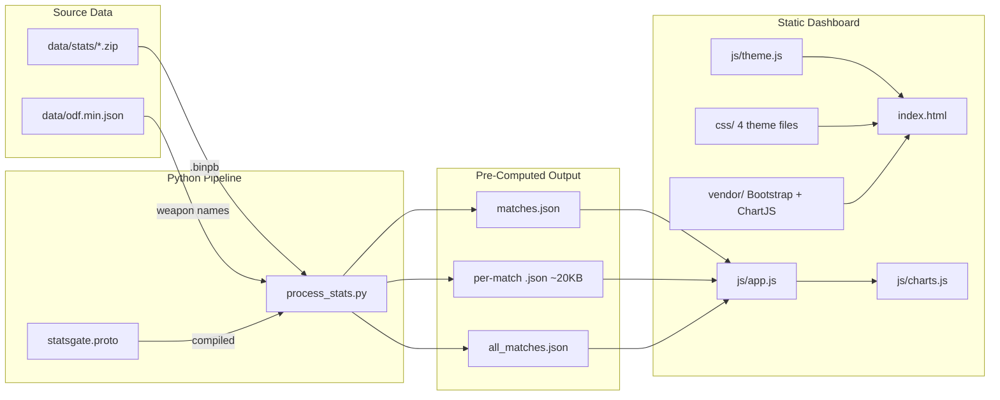

# VT Stats - Major Project Rebuild

## Architecture

## Phase 0: Proto Setup and Python Pipeline

Create the data processing pipeline that reads `.binpb` files and outputs pre-computed stats JSON.

**Create `scripts/statsgate.proto`** - Copy the canonical proto schema provided by the game developer.

**Create `scripts/requirements.txt`** - `protobuf>=4.25.0`

**Compile proto** - `protoc --python_out=. statsgate.proto` to generate `statsgate_pb2.py`

**Create `scripts/process_stats.py`** - The main pipeline script:
- Discovers all `.zip` files in `data/stats/` (future: also `.gz` archives)
- Extracts `.binpb` from each zip (ignores all other files)
- Parses via `statsgate_pb2.ClientStatSession`
- Loads `data/odf.min.json` and builds weapon name resolver (same resolution chain: `Weapon -> *.odf -> WeaponClass.wpnName`, fallback through `DispenserClass`, `TargetingGunClass`, explosion mapping via `Vehicle -> TorpedoClass`; raw ODF string minus `.odf` extension when no match; `"Unknown"` when ordnance is null)
- Single pass through event stream:
  - `BulletInit` -> `shots_fired[shooter][ordnance]++`
  - `BulletHit` -> `shots_hit[shooter][ordnance]++`
  - `DamageDealt` + `DamageReceived` (always adjacent pairs):
    - Skip `team == 0` (world props) and `amount == 0.0`
    - `shooter > 0`: player personal dealt credit
    - `shooter == 0`: asset dealt credit to owning slot
    - `victim > 0`: player personal received credit
    - `victim == 0`: asset received credit to owning slot
    - Both `shooter > 0` AND `victim > 0`: rivalry matrix entry
    - Always: faction totals (derive faction from `header.team_1`/`team_2`)
    - Timeline: bucket into 10-second windows per player and per faction
- Computes derived stats: net, ratio, accuracy, fav_weapon
- Outputs to `data/processed/<match_id>.json` (~15-25 KB each)
- Generates `data/processed/matches.json` manifest
- Generates `data/processed/all_matches.json` cross-match aggregate (career stats by nickname, global weapon meta, global rivalries)

## Phase 1: Run Pipeline and Verify

Execute `process_stats.py` against all 4 zips. Verify output JSON structure, spot-check stat values against `sample_data.json` for the ragnarok match.

## Phase 2: Delete Old Files

| File | Action |
|------|--------|
| `css/dashboard.css` | DELETE |
| `js/app.js` | DELETE |
| `js/charts.js` | DELETE |
| `js/dataProcessor.js` | DELETE |
| `data/remnant.json` | DELETE |

## Phase 3: Move Static Resources

Move from `project_update/static_content/` into the main project:

| Source | Destination |
|--------|-------------|
| `css/theme-system.css` | `css/theme-system.css` |
| `css/themes.css` | `css/themes.css` |
| `css/main.css` | `css/main.css` |
| `css/layout.css` | `css/layout.css` |
| `js/theme.js` | `js/theme.js` |
| `vendor/bootstrap/` | `vendor/bootstrap/` |
| `vendor/bootstrap-icons/` | `vendor/bootstrap-icons/` |

Do NOT move: `js/admin-nav.js`, `js/editor.js`, `js/navigation.js`, `js/search.js`, `js/toc.js`, `vendor/sortablejs/`, `vendor/toastui-editor/`, `data/bootstrap-icons.json` -- these are KB-specific and not applicable.

## Phase 4: Vendor Chart.js Locally

Download Chart.js 4.4.7 UMD bundle and save to `vendor/chartjs/chart.umd.min.js`. No CDN.

## Phase 5: Build New index.html

Rebuilt from scratch:
- Local Bootstrap CSS + JS from `vendor/bootstrap/`
- Local Bootstrap Icons from `vendor/bootstrap-icons/`
- CSS load order: `theme-system.css` -> `themes.css` -> `main.css` -> `layout.css`
- Local Chart.js from `vendor/chartjs/`
- JS load order: `theme.js` -> `charts.js` -> `app.js`
- Navbar: brand, match selector dropdown (includes "All Matches"), theme selector, light/dark toggle
- Match info banner (map, date, duration, players, config mod in muted small text)
- Faction scoreboard (Team 1 vs Team 2: player dealt, asset dealt, total, received, accuracy, net, rosters)
- Player leaderboard (sortable: rank, name, faction, personal dealt/received/net/ratio/accuracy, asset dealt, fav weapon, weapons used)
- Combat timeline (stacked area, toggle per-player / per-faction)
- Weapon meta (horizontal bar, ranked by damage, with accuracy)
- Rivalry heatmap (player-on-player only)
- Per-player weapon breakdown (stacked bar, top 8 + Other)
- Top rivalries (cards + doughnut charts)
- Shot accuracy table (per player per weapon)
- Weapon accuracy ranking (global hit rates)
- Asset damage panel (per-player AI/structure contribution, per-faction totals)
- All theme-aware using `--kb-*` CSS variables, zero hardcoded colors

## Phase 6: Build New js/app.js

- Loads `data/processed/matches.json` on startup
- Populates match selector (with "All Matches" entry)
- On match change: fetches the pre-computed JSON, calls render functions
- Match info banner renderer
- Faction scoreboard renderer
- Leaderboard renderer with sortable columns
- Rivalry heatmap renderer (player-on-player data only)
- Top rivalries card renderer
- Asset damage panel renderer
- "All Matches" view: swap to career stats layout when selected

## Phase 7: Build New js/charts.js

- Theme-aware colors: read `--kb-primary`, `--kb-info`, `--kb-accent` etc. via `getComputedStyle()` at render time
- Re-render on theme change (listen for theme switch events)
- `renderTimeline(canvasId, data, mode)` - stacked area, supports player and faction toggle
- `renderWeaponMeta(canvasId, weaponMeta)` - horizontal bar with accuracy overlay
- `renderPlayerWeapons(canvasId, leaderboard)` - stacked bar, top 8 weapons + Other
- `renderRivalryDoughnut(container, rivalry)` - mini doughnut per rivalry card
- `renderAccuracyChart(canvasId, data)` - weapon accuracy ranking visualization
- `destroyAllCharts()` on match switch

## Phase 8: Test and Iterate

Load each match, verify all panels render correctly. Test theme switching (light/dark, multiple palettes). Check responsive behavior. Fix bugs.

## Phase 9: Write DEVELOPER_GUIDE.md

Project-specific technical specification at repo root. Adapted from [project_update/DEVELOPER_GUIDE.md](project_update/DEVELOPER_GUIDE.md) but stripped of Flask/KB references:

1. Project Architecture (static site, pipeline diagram, file map)
2. Data Schema (full proto, all event types, damage semantics with all 5 scenarios, the `team` field = always player slot 1-10, edge cases)
3. Schema Evolution (Steam64 on events, `UpdateTick`, timestamped gz archives)
4. ODF Integration (weapon name resolution chain)
5. Pre-Computed Output Format (full field reference)
6. Styling Standards (Bootstrap-first, `--kb-*` variable catalog, theme rules)
7. Adding New Matches / Stats / Event Types (step-by-step)
8. Chart Architecture (Chart.js setup, theme-aware colors)

## Phase 10: Create Cursor Rules

**`.cursor/rules/project-overview.mdc`** (alwaysApply: true) - Architecture, data flow, proto location, schema evolution expectations, player identity strategy, archive format roadmap.

**`.cursor/rules/styling.mdc`** (globs: `**/*.{html,css,js}`) - Bootstrap-first, `--kb-*` variable catalog, `*-muted` not `bg-*-opacity-*`, solid bg -> `text-*-fg` / muted bg -> `text-*`, Chart.js colors via getComputedStyle.

**`.cursor/rules/data-schema.mdc`** (globs: `**/*.{py,js,json}`) - Event types, damage semantics (shooter/victim > 0 = player, == 0 = non-player, team = owning slot 1-10, team 0 = world prop ignore), adjacent pair rule, rivalry = player-on-player only, ODF resolution, null ordnance = "Unknown".

## Phase 11: Cleanup

- Delete entire `project_update/` directory
- Rewrite `README.md` with real project description and setup instructions
