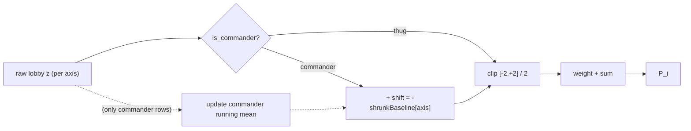

# VTSR-T v2.4 — Commander Role Adjustment

## Context

The audit ([_investigation/audit_commander_bias.py](_investigation/audit_commander_bias.py)) confirmed a systematic bias: commander match-rows score `−0.115` lower on composite `P_i` than thug rows (~8 ELO/match), with consistent within-player evidence (median gap `+0.103` across 13 dual-role players). The fix shifts each commander's per-axis z-score against a *typical-commander* baseline before clipping, making VTSR-T role-neutral while letting "fightin' commander" outliers earn extra credit naturally.



## Decisions locked from prior conversation

- **Per-axis additive shift** (Option A) on commander rows only
- **Symmetric** — every axis with an empirical prior gets shifted, including positive-prior ones (`pve_share`, `thug_accuracy`)
- **Shrinkage strength = 30** (empirical prior carries weight of 30 observations vs. running mean)
- **`snipe_bonus` deliberately excluded** from the shift mechanism (n=22 too noisy; treat as role-blind)
- **Full schema bump** + corpus re-rate; `peak_vtsr` migration warning across docs and methodology modal
- **Backward-compat axis_contributions** — keep flat shape, add parallel `axis_contributions_meta` only on commander rows for forensics (zero JS rendering changes needed)

## Empirical seed values (from the audit)

```python
COMMANDER_AXIS_PRIOR = {
    "mobility":         -0.488,
    "target_lock_pct":  -0.595,
    "thug_kill_rate":   -0.164,
    "net_damage_share": -0.131,
    "thug_efficiency":  -0.106,
    "pve_share":        +0.111,
    "thug_accuracy":    +0.069,
    # snipe_bonus deliberately omitted
}
COMMANDER_BASELINE_SHRINKAGE = 30.0
```

## File-by-file changes

### 1. [scripts/elo.py](scripts/elo.py) — algorithm change (~50 LOC net)

**Constants block** (after line 82, the `THUG_WEIGHTS` dict):

```python
COMMANDER_AXIS_PRIOR = { ... }            # values above
COMMANDER_BASELINE_SHRINKAGE = 30.0
ELO_SCHEMA_VERSION = 5                    # was 4
```

**`compute_performance_index()` signature change** (line 384):
- Add optional `commander_baseline: dict[str, dict[str, float]] | None = None` argument carrying `{axis: {"sum": float, "n": int}}` (or `None` on first call)
- After `_zscore_axis()` (line 442), branch per row: if `lobby[i].get("is_commander")` is truthy, apply `shifted_z = z + (-shrunk_baseline[axis])` BEFORE the `_clip(zi, -2, 2) / 2` step (line 443)
- For each axis where the shift was applied, also stash the `(shift, raw_z)` pair so the caller can emit `axis_contributions_meta`
- Return shape extends from `(perfs, keys, per_player_axis_z)` to `(perfs, keys, per_player_axis_z, per_player_axis_meta)` where `axis_meta[i] = {axis: {"shift": float, "z_raw": float}}` for commander rows only

**`compute_elo()` state additions** (after line 504):

```python
commander_axis_running_sum:   dict[str, float] = defaultdict(float)
commander_axis_running_count: dict[str, int]   = defaultdict(int)
```

**`compute_elo()` per-match loop** (line 540):
- Build snapshot baseline dict from running buffers BEFORE calling `compute_performance_index()` (so the current match's commander rows don't influence their own shift)
- Pass it in
- After processing the match, accumulate this match's commander rows' RAW z-scores (not shifted) into the running buffers

**`compute_elo()` per-row delta emit** (around line 603):

```python
"axis_contributions": axis_contrib,           # post-shift, post-clip (existing; flat dict)
"axis_contributions_meta": axis_meta_for_row, # new; only present on commander rows; {axis: {shift, z_raw}}
```

**`elo_current.json` shape additions** (line 658, the `elo_current = {...}` dict):

```python
"commander_axis_prior": dict(COMMANDER_AXIS_PRIOR),
"commander_baseline_shrinkage": COMMANDER_BASELINE_SHRINKAGE,
"commander_baseline_observed": {
    a: {
        "n": commander_axis_running_count[a],
        "running_mean": (commander_axis_running_sum[a] / commander_axis_running_count[a])
                        if commander_axis_running_count[a] > 0 else 0.0,
        "shrunk_baseline_at_corpus_end": shrunk(...),
    }
    for a in COMMANDER_AXIS_PRIOR
},
```

**Per-row `ratings[]` additions** (line 638):

```python
"matches_as_commander": commander_match_count[key],
"matches_as_thug":      n - commander_match_count[key],
```

(Tracked alongside `matches_played` in the loop — trivial counter.)

**Module docstring** (line 1) — add a paragraph describing the role adjustment, mirror the `R^T` math notation but with commander-conditional shift.

### 2. [scripts/process_stats.py](scripts/process_stats.py) — version bump

```python
PIPELINE_VERSION = 15  # was 14 — VTSR-T v2.4 commander role adjustment
```

(Line 56. No other pipeline code changes — `is_commander` is already on contribution rows from v2.3.)

### 3. [js/app.js](js/app.js) — methodology modal text only (no rendering changes)

**Update modal caveat block at line 5409** to add v2.4 entry:

> **VTSR-T v2.4 · commander role adjustment.** Each commander match-row now shifts per-axis z-scores against a typical-commander baseline before clipping (audit-derived empirical priors blended with a running mean of all commander rows seen so far, shrinkage strength 30). Commanders posting typical-commander values land at z′ ≈ 0 on every adjusted axis, exactly like thugs posting typical-thug values. Commanders defying expectations — high mobility, high net damage — get correspondingly larger z′ values and earn rating credit naturally. `snipe_bonus` is deliberately role-blind. **Pre-v2.4 peak_vtsr values are no longer comparable** — corpus re-rated.

(`axis_contributions` rendering at lines 4344, 5753, 5774 unchanged — flat values still flow through as today. `axis_contributions_meta` is purely audit/forensics for now; can be surfaced in a follow-up UI pass.)

### 4. [DEVELOPER_GUIDE.md §13](DEVELOPER_GUIDE.md) — algorithm derivation

Extend the existing v2.3 section with a v2.4 subsection:

- The role-adjustment math: `z'_a = z_a − μ̂_commander[a]` for commander rows, identity for thugs
- The shrinkage formula: `μ̂[a] = (n·running_mean[a] + S·prior[a]) / (n + S)` with `S = 30`
- Why symmetric (role-neutral vs. role-favoring)
- The empirical priors as v1 seeds (audit-derived; tunable post-ship via constants, re-runs the corpus on change — same contract as `ALPHA_PVE`)
- `snipe_bonus` exclusion rationale (n=22, noise floor)
- Path-dependence note: rolling baseline accumulates chronologically; the seed prior dominates early matches and the running mean dominates later ones

### 5. [docs/DATA_DICTIONARY.md §11](docs/DATA_DICTIONARY.md) — schema additions

- Document new top-level fields on `elo_current.json`: `commander_axis_prior`, `commander_baseline_shrinkage`, `commander_baseline_observed`
- Document new per-row fields on `ratings[]`: `matches_as_commander`, `matches_as_thug`
- Document new optional sibling block on `elo_history.deltas[]`: `axis_contributions_meta` (commander rows only)
- Bump `ELO_SCHEMA_VERSION 4 → 5` reference
- **Mark all `peak_vtsr` values incomparable across the v2.3→v2.4 migration**

### 6. [.cursor/rules/project-overview.mdc](.cursor/rules/project-overview.mdc) — VTSR-T entry refresh

Replace the `v2.3 (current)` paragraph with a `v2.4 (current)` block summarizing:
- Role-adjustment mechanism (one sentence)
- Symmetric shift across all 7 priored axes
- `snipe_bonus` role-blind exclusion
- Shrinkage strength 30
- Schema bumps: `ELO_SCHEMA_VERSION 4→5`, `PIPELINE_VERSION 14→15`
- `peak_vtsr` incomparable warning

### 7. [AGENTS.md](AGENTS.md) — Key Conventions VTSR-T entry

Mirror the project-overview.mdc one-paragraph summary in the existing VTSR-T bullet under "Key Conventions".

### 8. [_investigation/audit_commander_bias.py](_investigation/audit_commander_bias.py) — keep as validation harness

Already exists; gitignored. Used in validation step (re-run after pipeline finishes; expect cmdr mean P_i ≈ 0 and within-player gap ≈ 0). No edits.

## Migration impact summary

| Field/Behavior | Impact |
|---|---|
| `peak_vtsr` (per-player) | **Recomputed**, no longer comparable to pre-v2.4 values |
| `vtsr` / `thug_elo` (per-player) | Frequent commanders rise ~50-150 ELO; thug-pure players essentially unchanged |
| `axis_contributions` shape on history | Unchanged (flat dict of post-shift values) — JS UI works as-is |
| `axis_contributions_meta` (NEW, optional) | Commander rows only; carries `{shift, z_raw}` per axis for audit |
| `commander_axis_prior` / `commander_baseline_shrinkage` / `commander_baseline_observed` | NEW top-level fields on `elo_current.json` |
| `matches_as_commander` / `matches_as_thug` | NEW per-row fields on `elo_current.json` ratings[] |
| `js/all-matches-aggregator.js` | **Zero changes** — passes ELO through |
| `js/app.js` | **One block of modal text updated**; rendering paths untouched |

## Validation (manual, after implementation)

1. `python scripts/process_stats.py --force` — full corpus re-rate
2. `python _investigation/audit_commander_bias.py` — confirm:
   - Commander mean P_i ≈ 0 (was −0.093)
   - Within-player gap ≈ 0 (was +0.117)
   - Per-axis commander mean z ≈ 0 on the 7 shifted axes
   - `snipe_bonus` commander mean unchanged (was +0.186)
3. Spot-check the 13 dual-role players' VTSR-T values against their pre-migration values — frequent commanders (Snake, Danya, Just!ce, Lithium) should rise; thug-pure (VTrider, F9bomber) should be flat
4. Eyeball `commander_baseline_observed.shrunk_baseline_at_corpus_end` — should land between `COMMANDER_AXIS_PRIOR` (seed) and the audit's empirical means, weighted toward empirical
5. Hard refresh dashboard, hover the new methodology modal text, verify it reads correctly and `peak_vtsr` warning is current
6. Open VTSR-T leaderboard detail panel for one commander player — confirm `axis_contributions` values still render in the per-axis bars (no breakage from the shape compatibility decision)
7. Run `python scripts/process_stats.py` (no flags) twice — second run should be a clean cache hit (no recomputation), confirming `PIPELINE_VERSION` bump worked correctly on the first run

## Out of scope (explicit)

- VTSR-C (commander-flavored sibling rating) — separate future work; will incorporate VTSR-T as one of its inputs
- UI surface for `axis_contributions_meta` (the `{shift, z_raw}` forensic block) — data is emitted but not rendered yet
- Re-tuning the empirical priors against expanded corpus — current seed values are the audit snapshot; can be refreshed in a future PR by re-running the audit and bumping the constants
- Adding commander-specific axes (`assets_built`, `base_uptime`, etc.) — that's Option B territory and belongs to VTSR-C work
- Per-axis rescaling — audit confirmed cmdr/thug spread is comparable on every axis, so a flat shift is sufficient
