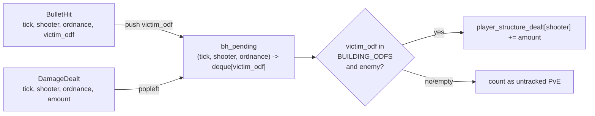
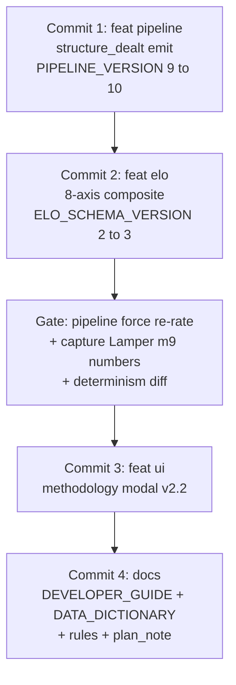

# VTSR-T v2.2 — thug-axis rebalance

## Goal

VTSR-T is "individual dogfighter skill." Drop one axis that measures something else (asset_multiplier = damage by owned AI), replace it with two thug-relevant axes (structure damage and T-key usage), gently trim sniper to keep the sum at 1.00.

## Final weights (8 axes, sum = 1.00)

| Axis | Old | New | Change | Notes |
|---|---|---|---|---|
| `net_damage_share` | 0.25 | **0.21** | -0.04 | Still the dominant signal |
| `kill_rate` | 0.20 | **0.20** | — | |
| `pvp_share` | 0.20 | **0.18** | -0.02 | Anti-PvE-farming role preserved |
| `accuracy` | 0.15 | **0.15** | — | |
| `structure_share` | — | **0.10** | NEW | Player-dealt damage to enemy buildings / total dealt |
| `mobility` | 0.10 | **0.08** | -0.02 | |
| `target_lock_pct` | — | **0.04** | NEW | T-key usage share (already gated by `has_target_lock_data`) |
| `snipe_bonus` | 0.05 | **0.04** | -0.01 | Still rewarded, slightly less |
| `asset_multiplier` | 0.05 | — | REMOVED | Belongs in future VTSR-C |

Direct-dogfight axes (`net_damage_share + kill_rate + pvp_share + accuracy + snipe_bonus`) still total 0.78, so the rebalance doesn't blunt the core "thugging" signal — it just sharpens what counts as thug work.

## Pipeline change: structure damage attribution

`DamageDealt` has no `victim_odf` in the proto ([scripts/statsgate.proto:68](scripts/statsgate.proto)). Only `BulletHit` carries it ([scripts/statsgate.proto:51](scripts/statsgate.proto)). So we join.



### What counts as a building

- Load once at pipeline startup: read [data/odf.min.json](data/odf.min.json), collect every ODF whose category is `Building` → `BUILDING_ODFS` frozenset (lowercased, with `.odf` suffix).
- That bucket already includes recyclers, factories, extractors/scavs, defensive turrets, power pads, service pods, comm bunkers — i.e. "enemy economy and base."
- Enemy filter via first-letter faction prefix (existing `faction_from_odf` helper in [scripts/process_stats.py:179](scripts/process_stats.py)). Skip when shooter or building faction can't be resolved (modded ODFs without prefix) — those just don't count, which is honest.

### Where in the event loop

Single-pass works because BulletHit events for a tick already precede DamageDealts in the stream:

```python
# Existing BulletHit handler around [scripts/process_stats.py:2287](scripts/process_stats.py)
if bh.shooter > 0 and bh.victim_odf:
    bh_pending[(bh.tick, bh.shooter, (bh.ordnance_odf or "").lower())].append(bh.victim_odf.lower())

# Existing DamageDealt handler around [scripts/process_stats.py:2370](scripts/process_stats.py)
if shooter > 0:
    player_dealt[shooter] += dd.amount  # existing
    # NEW:
    key = (dd.tick, shooter, odf.lower())
    queue = bh_pending.get(key)
    if queue:
        v_odf = queue.popleft()
        if v_odf in BUILDING_ODFS and _is_enemy_building(shooter_faction, v_odf):
            player_structure_dealt[shooter] += dd.amount
```

### Expose new field

- Per-player leaderboard `personal.structure_dealt` ([scripts/process_stats.py:2953](scripts/process_stats.py) area).
- Propagate into `_extract_contribution()` ([scripts/process_stats.py:3349](scripts/process_stats.py)) as `structure_dealt`.

## ELO module changes ([scripts/elo.py](scripts/elo.py))

1. **Constants block**
   - Delete `asset_multiplier` from `COMBAT_WEIGHTS`; add `structure_share: 0.10` and `target_lock_pct: 0.04`; adjust the four trims above.
   - Bump `ELO_SCHEMA_VERSION = 2 → 3` (weights keys changed, two new axes — meaningful schema change).
   - Update module docstring header from "seven axes" to "eight axes" and mention thug-specific framing.

2. **Axis helpers**
   - Delete `_asset_multiplier_lobby` ([scripts/elo.py:342](scripts/elo.py)).
   - Add `_structure_share_lobby(lobby)` mirroring `_pvp_share_lobby` shape, reads `personal.structure_dealt` divided by `max(1, personal.dealt)`. Returns `None` if no player has any structure damage (axis-missing → weight redistribution).
   - Add `_target_lock_pct_lobby(lobby, pos_players, has_target_lock)` reading `pos_players[name].metrics.target_lock_pct`. Returns `None` if `has_target_lock_data` is False or no positioning data — same redistribution pattern as `_mobility_lobby`.

3. **Wire into `compute_performance_index`** ([scripts/elo.py:382](scripts/elo.py))
   - Drop the `"asset_multiplier"` entry from the `raw` dict.
   - Add `"structure_share"` and `"target_lock_pct"`.

## Pipeline version bump

- [scripts/process_stats.py:47](scripts/process_stats.py) `PIPELINE_VERSION = 9 → 10`. Forces a full re-process so every cached match emits the new `structure_dealt` field and every rating is recomputed under the new weights.

## Modal reordering + content updates ([js/app.js](js/app.js) `buildVtsrTooltipHtml`)

New section order:

1. **Performance Composite (P)** — what we measure (moved to top per request)
2. The Update Rule
3. Expected Performance (E)
4. K-factor & Hope Mechanics
5. Tier Ladder
6. Worked Example

Section content changes:

- **Composite section**: rewrite `weightsRows` to the 8-axis table above. New axis copy:
  - `Structure share — 0.10 — share of your damage that landed on enemy buildings / economy (recyclers, factories, extractors, turrets)`
  - `T-key usage — 0.04 — fraction of the match you held an active target lock (situational awareness proxy)`
- **Worked example**: the K-factor and E_i math don't change (still S_R=800). The Lamper m9 P_i value shifts slightly under the new weights — pick the recomputed number from the post-rerate `elo_history.json` and refresh the ΔR line. Caveat sentence updated to mention v2.2.
- **Footer caveat block**: append a v2.2 note explaining the axis swap + that `peak_vtsr` values from v2.1 are no longer comparable.
- Cache-busting: the existing `vtsrTooltipHtmlCache` invalidates naturally on next deploy since the string changes.

## Modal subtitle ([index.html](index.html) ~line 1336)

```
v2.1 · opponent-strength-weighted (S_R = 800)
```
→
```
v2.2 · 8-axis thug composite (structure share + T-key, S_R = 800)
```

## Documentation updates

- [DEVELOPER_GUIDE.md](DEVELOPER_GUIDE.md) §13.4 — replace 7-axis table with 8-axis table; update the per-axis-metric definitions; bump intro from "Seven combat axes" to "Eight combat axes."
- [DEVELOPER_GUIDE.md](DEVELOPER_GUIDE.md) §13.7 — add a v2.1 → v2.2 row to the migration table, brief rationale paragraph below it.
- [docs/DATA_DICTIONARY.md](docs/DATA_DICTIONARY.md) §11.1 — update the JSON example's `weights` block to show 8 keys (no `asset_multiplier`, plus the two new keys); bump `schema_version` reference 2 → 3; add note that `personal.structure_dealt` joins to `BulletHit.victim_odf` via tick+shooter+ordnance.
- [AGENTS.md](AGENTS.md) + [.cursor/rules/data-schema.mdc](.cursor/rules/data-schema.mdc) + [.cursor/rules/project-overview.mdc](.cursor/rules/project-overview.mdc) — VTSR-T bullet: "8-axis composite (structure_share + target_lock_pct added in v2.2; asset_multiplier removed — moved to future VTSR-C)."
- Append a v2.2 note under Phase 12 in the existing overhaul plan file.

## Commit cadence (four incremental commits)

Each commit is independently revertible. The data layer ships first because the ELO module reads a field that doesn't exist yet — once Commit 1 lands, the field is on disk; Commit 2 then plugs the algorithm into it.



| # | Commit | Files | Why this boundary |
|---|---|---|---|
| 1 | `feat(pipeline): emit personal.structure_dealt via BulletHit-DamageDealt join (PIPELINE_VERSION 9 -> 10)` | `scripts/process_stats.py` + regenerated `data/processed/*.json` | New data field on disk. ELO output unchanged at this point (algorithm still v2.1; the new field is unused). Safe intermediate state for rollback. |
| 2 | `feat(elo): VTSR-T v2.2 eight-axis thug composite (drop asset_multiplier, add structure_share + target_lock_pct, ELO_SCHEMA_VERSION 2 -> 3)` | `scripts/elo.py` | Algorithm change. After this commit, the next pipeline run re-rates the corpus. |
| — | **Gate (no commit)** | — | Run `python scripts/process_stats.py --force`. Capture Lamper m9 tuple from regenerated `elo_history.json`. Diff `elo_current.json` against a second back-to-back run (ignoring `computed_at`) to confirm determinism. Capture top-tier peak_vtsr deltas for the migration table. |
| 3 | `feat(ui): VTSR-T methodology modal v2.2 (Performance Composite leads, 8-axis table, real v2.2 worked example)` | `index.html` + `js/app.js` | UI now reflects the new algorithm, with the worked example wired to real post-rerate numbers. |
| 4 | `docs(vtsr-t): v2.2 methodology refresh (eight-axis composite, structure_share + target_lock_pct, peak_vtsr migration caveat)` | `DEVELOPER_GUIDE.md` + `docs/DATA_DICTIONARY.md` + `AGENTS.md` + `.cursor/rules/*.mdc` + this plan's umbrella file | Public methodology and internal rules synced to the shipped behavior. |

Pre-commit hygiene before each: `git status` to confirm only the planned files are staged; `git diff --staged` to eyeball the patch; no `.env` / `_investigation/` / scratch files swept in. Commit messages via HEREDOC to a temp file + `git commit -F` (PowerShell HEREDOC quirk).

## Verification (final smoke pass — no commit)

1. `git log --oneline -4` lists the four v2.2 commits in order.
2. `personal.structure_dealt` appears in a sample per-match JSON and is non-zero for a known structure-busting game (recycler killer).
3. Run pipeline twice; diff `elo_current.json` ignoring `computed_at` — byte-identical (determinism).
4. A player who dealt recycler damage in match X has higher `performance` under v2.2 than they did under v2.1 (spot-check via the captured tuple).
5. Tier distribution: Tiers 1-4 populated; record VTrider / Domakus / Cyber deltas vs v2.1.
6. Methodology modal opens with Performance Composite first, all KaTeX equations render (no `<code>` fallback), 8-axis weights table renders correctly with `structure_share = 0.10` and `target_lock_pct = 0.04`, subtitle reads `v2.2 - 8-axis thug composite (structure share + T-key, S_R = 800)`.

## Out of scope (intentional)

- Tier 1 population: not addressing the user's secondary question in this commit. Discussed in the prior Ask-mode response; if needed, a separate tweak (shift Tier 1 threshold or widen S_R) can ship later. v2.2 will redistribute ratings slightly and we'll see where the top tail lands first.
- VTSR-C (commander rating): future work. `asset_multiplier` is removed from VTSR-T but the `assets.dealt` field stays in the per-match data, ready for VTSR-C to consume.
- Friendly-fire structure damage filtering: handled via `_is_enemy_building` faction check on the new axis; FF on enemy buildings isn't possible (different faction prefix). Self-demoing your own recycler doesn't credit you.
- Splash damage attribution: when a DamageDealt has no matching BulletHit in the queue (splash from a previously-impacted bullet, environmental damage), it's silently uncounted — same honesty as the existing `pve_dealt` calculation.