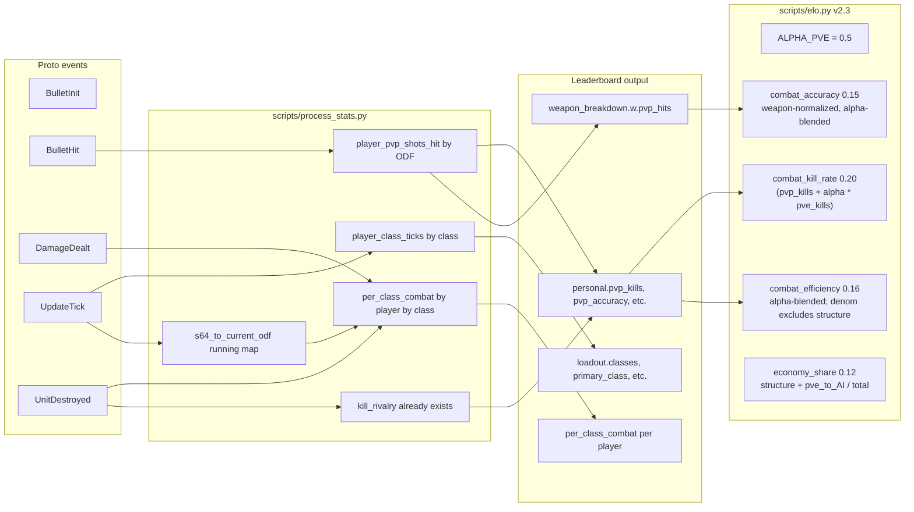

## Goals

VTSR-T is a **thug** rating, and a thug can be effective in more ways than one. v2.3 rebalances the composite so role players doing PvE / economy disruption are rated fairly alongside dogfighters, while keeping AI-farming guarded against. Seven changes:

1. **Alpha-blended combat axes (α = 0.5).** The three combat axes (`combat_kill_rate`, `combat_accuracy`, `combat_efficiency`) credit PvE work at fractional weight (`α = 0.5`) rather than zero. Locked module constant `ALPHA_PVE` in [scripts/elo.py](scripts/elo.py); surfaced in `elo_current.json` and the methodology modal so it's auditable and tunable later. Lobby z-scoring already handles "exceeded expectations" naturally — a player who does dramatically more PvE damage than peers z-scores high on multiple axes simultaneously, no separate "PvE excellence" axis needed.
2. **Weapon-normalized accuracy.** Replace flat shots_hit/shots_fired with `pwa = Σ_w (player_pvp_acc_w / lobby_pvp_acc_w) × (player_shots_w / player_total_shots)`. Robust to weapon-mix bias (sniper rifles, sabot guns); cross-references each player's per-weapon hit rate against the lobby's per-weapon baseline. Numerator additionally includes `α × pve_hits_w` (alpha-blended) so role players landing hits on AI/economy targets get credit.
3. **Broader `economy_share` axis** replaces v2.2's narrower `structure_share`. Captures damage to all enemy non-human assets (structures + mobile AI like Scavengers, Producers, Extractors). Sources from `personal.pve_dealt` and `personal.structure_dealt`, both of which already exclude player-owned-AI damage by construction (only events with `shooter > 0` enter `personal.dealt`). Rewards all "asset disruption" roles — base-busters AND scrap-killers.
4. **Loadout Profile + per-class combat breakdown** (display-only, no composite impact). Per-match + career data showing each player's class-time distribution + most-used ODF per class + per-class kills/dmg/accuracy/DPM joined to active ship at event time. Sourced entirely from `update_tick.players[].odf` ticks + `data/odf.min.json` `classLabel` field. Zero editorial role labels — consumers see raw `tank` / `wingman` / `walker` etc. and form their own narrative.
5. **PvP/PvE split surfaced everywhere a kill or death is shown.** The composite *integrates* PvP+PvE kills under α-weighting, but the displayed numbers stay *separated* in every UI surface: Player Leaderboard, Career Leaderboard, Per-Class Combat table, VTSR-T Leaderboard. Compact `TOTAL (PvP/PvE)` chip rendering on existing Kills/Deaths cells with hover tooltips for fuller breakdown; Per-Class Combat table gets explicit `PvP K` + `PvE K` columns; VTSR-T Leaderboard gains a `PvP K/D` column.
6. **VTSR-T Leaderboard answers "why does this player have this rating?"** New `Primary Class` column shows each player's most-played ship class (career-aggregated). New `PvP K/D` column. Hover tooltip on the VTSR-T value cell shows the player's top 2 strongest axes (e.g. *"Strong: combat_kill_rate +1.2σ, economy_share +0.8σ"*). Popover on the Last-delta cell shows axis-by-axis breakdown of why their rating moved last match. Tooltips on Peak (peak match + date) and Trend sparkline (raw last-10 deltas).
7. Bump `ELO_SCHEMA_VERSION` 3 → 4, `PIPELINE_VERSION` 10 → 11, `match.schema_version` 3 → 4. Full re-rate. peak_vtsr resets (v2.2 precedent applies; disclose).

## Why this addresses the community's concern

The original community feedback: role players in defensive/utility ships get systematically downweighted because the composite assumes everyone has equal opportunity to do PvP. Worked example: in a 10-player lobby, **Player 1** (5k PvP damage, 5 PvP kills, classic fragger) vs **Player 2** (0 PvP, 13k PvE damage including 4k structure + 9k mobile-AI, ~20 AI kills — economy-cripple role, "essentially won the game"). Under v2.3 with α = 0.5:

- `net_damage_share` rewards Player 2 (26% of lobby damage) over Player 1 (10%): **+1.5σ vs 0.0σ**
- `combat_kill_rate` is roughly even (5 PvP × 1.0 ≈ 20 AI × 0.5)
- `combat_accuracy` slightly favors Player 1 (more PvP-focused)
- `combat_efficiency` favors Player 1 (denominator excludes structure but their pvp_dealt is higher)
- `economy_share` rewards Player 2 dramatically: **+2.0σ vs −1.0σ** (Player 2 is the lobby's standout)

Net composite: Player 2 narrowly outperforms Player 1, which matches the community's expected outcome. Lobby z-scoring is the "exceeded expectations" mechanism — when one player does dramatically more PvE work, it shows up across multiple axes simultaneously.

## Commit strategy

This is a coordinated multi-file change but it cleanly factors into eight atomic commits on a feature branch (`feat/vtsr-t-v2.3`). Commits 1–7 are code; commit 8 is the regenerated processed-JSON snapshot (separately committable so the code diff is reviewable without the JSON noise). Each commit leaves the dashboard in a buildable state — though only commits 1+2+3 together produce a self-consistent rated output. Suggested order and message stems below; final messages can use the project's existing `feat:` / `docs:` / `data:` prefix style.

1. **`feat(pipeline): emit pvp/pve kills, weapon pvp_hits, loadout, per_class_combat`** — Step 1 entirely. [scripts/process_stats.py](scripts/process_stats.py) only. New accumulators + class-label resolver + per-tick + per-class combat. `PIPELINE_VERSION` 10 → 11 and `match.schema_version` 3 → 4. Old ELO math still runs (unchanged), but consumes the new fields' absence harmlessly via `.get()` defaults — i.e. v2.3 axes don't activate yet. Gate: `python scripts/process_stats.py` runs to completion; spot a fresh `data/processed/<match>.json` and confirm `personal.pvp_kills` / `loadout` / `per_class_combat` are populated.

2. **`feat(elo): VTSR-T v2.3 — combat-weighted axes + economy_share`** — Steps 2a–2g. [scripts/elo.py](scripts/elo.py) only. `ALPHA_PVE` constant, four lobby helpers renamed/rewritten, `COMBAT_WEIGHTS` v2.3 dict, `ELO_SCHEMA_VERSION` 3 → 4, `alpha_pve` field surfaced in `elo_current.json`. Activates the new rating math. Gate: `python scripts/process_stats.py` runs to completion; `elo_current.json` shows `schema_version: 4`, weights block has the 8 new keys with sum=1.00, sample player VTSR-T values shift relative to previous run.

3. **`feat(elo): per-axis attribution in elo_history + axis_means in elo_current`** — Step 2h. [scripts/elo.py](scripts/elo.py) only. `compute_performance_index()` returns per-axis z-scores; `compute_elo()` threads them into each delta as `axis_contributions` and accumulates per-player career means as `axis_means` on `ratings[]`. Powers the VTSR-T leaderboard popover/tooltip in commit 6. Gate: `elo_history.json` deltas have `axis_contributions` block with row sum equal to `performance` ± rounding; `elo_current.json` ratings have `axis_means` block with all 8 axes (or fewer when any axis was unavailable across all rated matches).

4. **`feat(aggregator): pvp/pve + loadout + per_class_combat career rollups`** — Steps 3 + 4. [scripts/process_stats.py](scripts/process_stats.py) `_extract_contribution()` extension + [js/all-matches-aggregator.js](js/all-matches-aggregator.js) `VTAggregate.build()` extension. New per-player career fields. Gate: pipeline emits richer `match_contributions.json`; aggregator output's `career_stats[].total_pvp_kills` matches the pipeline-side career sum byte-identically when the picker has no filter active.

5. **`feat(dashboard): Loadout Profile + Per-Class Combat + PvP/PvE kill chips`** — Steps 5 + 6 combined (per-match + career UI for the same data shapes). [js/app.js](js/app.js), [index.html](index.html), [css/vtstats-theme.css](css/vtstats-theme.css). Loadout card, Per-Class Combat table, weapon-breakdown new columns, kill/death compact-chip rendering on Player Leaderboard + Career Leaderboard. Gate: load dashboard, expand a leaderboard row → see Loadout + Per-Class Combat sections; observe `(PvP/PvE)` chips on Kills/Deaths cells with hover tooltip; All Matches view shows Career equivalents.

6. **`feat(dashboard): VTSR-T leaderboard primary class, axis tooltips, breakdown popover`** — Step 6.5. [js/app.js](js/app.js) `renderVtsrLeaderboard()` + [index.html](index.html) `#vtsr-table` headers + [css/vtstats-theme.css](css/vtstats-theme.css) `.vt-vtsr-popover` / `.vt-axis-contrib-row` / `.vt-vtsr-primary-class`. Two new columns + four new tooltips/popovers. Gate: VTSR-T table renders Primary Class + PvP K/D columns; hover VTSR-T cell shows top axes; click Last-delta cell shows axis-by-axis breakdown popover; sort works on both new columns.

7. **`docs: VTSR-T v2.3 methodology, Loadout Profile spec, schema updates`** — Steps 7 + 8. Methodology modal HTML/KaTeX rewrite in [js/app.js](js/app.js) + all markdown docs ([DEVELOPER_GUIDE.md](DEVELOPER_GUIDE.md), [docs/DATA_DICTIONARY.md](docs/DATA_DICTIONARY.md), [.cursor/rules/data-schema.mdc](.cursor/rules/data-schema.mdc), [.cursor/rules/filter-contract.mdc](.cursor/rules/filter-contract.mdc), [AGENTS.md](AGENTS.md), [.cursor/rules/project-overview.mdc](.cursor/rules/project-overview.mdc)). [docs.html](docs.html) requires **zero changes** — it's a markdown viewer that auto-renders `DEVELOPER_GUIDE.md` + `docs/DATA_DICTIONARY.md` via marked.js + KaTeX (see DOC_REGISTRY at line 201); TOC, search index, and KaTeX math all rebuild from the markdown source on every page load. Gate: open `docs.html` in browser, switch between Data Dictionary + Developer Guide, scroll to §13 / §13.11 / new §13 Loadout schema, confirm KaTeX renders the new formulas, search for "alpha_pve" / "economy_share" / "Loadout" → results land. Open the dashboard's VTSR-T methodology modal → confirm new axes table + worked example renders.

8. **`data: regenerate processed JSONs under VTSR-T v2.3`** — Step 9 in full. Pipeline rerun output. Optional separately-committable so review of the code (commits 1–7) is decoupled from the regenerated JSON diff (which is large and noisy). Gate: see Step 9.

The 1+2+3 sequence is the *minimum* set that produces a self-consistent rated output (anything less leaves the dashboard rendering on inconsistent data). 4 must follow 1 (consumes new contribution fields). 5 + 6 can land in either order or fold together — they touch overlapping JS surfaces. 7 lands last so the methodology modal references the actually-shipped weights.

If a single-commit-on-main workflow is preferred for review, the same boundaries serve as PR commits within a stacked PR. Either way, treat 1+2 as the "blast radius" commits and run the full pipeline end-to-end after each before the next one starts.

## Out-of-scope problems we explicitly accept

- **AI-combat vs AI-economy distinction.** `economy_share` includes damage to enemy AI combat tanks too (not just scavs/extractors). Distinguishing requires per-victim-ODF classification at every damage event, doable but adds material engineering scope. Acceptable approximation for v2.3 — most VSR matches don't have heavy commander-spawned AI combat fleets, so this is a small residual.
- **Per-ship-class skill conditioning.** A player with 80% scout time and a player with 80% tank time are still compared on the same axes. Approach C territory (needs ~75 players × 600 matches to fit reliably). The Loadout Profile data lays groundwork for that future axis.

## Data flow for new + reshaped fields



## Scope summary

- Pipeline: [scripts/process_stats.py](scripts/process_stats.py)
- ELO module: [scripts/elo.py](scripts/elo.py)
- JS aggregator: [js/all-matches-aggregator.js](js/all-matches-aggregator.js)
- Dashboard render + markup: [js/app.js](js/app.js), [index.html](index.html), [css/vtstats-theme.css](css/vtstats-theme.css)
- Methodology modal: KaTeX strings in `js/app.js` (existing pattern)
- Docs: [DEVELOPER_GUIDE.md](DEVELOPER_GUIDE.md) §13, [docs/DATA_DICTIONARY.md](docs/DATA_DICTIONARY.md) §11 + new §13, [.cursor/rules/data-schema.mdc](.cursor/rules/data-schema.mdc), [.cursor/rules/filter-contract.mdc](.cursor/rules/filter-contract.mdc), [AGENTS.md](AGENTS.md), [.cursor/rules/project-overview.mdc](.cursor/rules/project-overview.mdc)

## Implementation outline

### Step 1 — Pipeline accumulators ([scripts/process_stats.py](scripts/process_stats.py))

**1a. Per-weapon PvP-hit accumulator** (in `bullet_hit` branch around line 2320). Mirror existing `player_shots_hit[s64][odf]`:

```python
if shooter > 0 and odf and bh.victim > 0:
    player_pvp_shots_hit[shooter][odf] += 1
```

`player_pvp_shots_hit` is a new `defaultdict(lambda: defaultdict(int))` declared near the existing `player_shots_hit` accumulator.

**1b. Class-label resolver helper.** New module-level function `_load_class_labels(odf_db)` that returns `{odf_lower -> classLabel}` for every entry under `Vehicle.*`. Pattern mirrors the existing `_load_known_powerup_odfs()` and `_load_building_odfs()`. Includes `_strip_vsr_suffix` fallback for VSR-mod ODFs without a direct `classLabel`. Threaded into `process_match()` as `class_label_map=` parameter.

**1c. Per-tick class accumulator + running-odf tracker.** In the `update_tick` branch (line 2755), alongside the existing position-sample loop:

```python
s64_to_current_odf[s64] = ps.odf  # running map updated each tick
if ps.odf:
    cls = class_label_map.get(ps.odf.lower()) or "unknown"
    player_class_ticks[s64][cls] += 1
    player_class_odf_ticks[s64][cls][ps.odf.lower()] += 1
```

Two new accumulators: `player_class_ticks[s64][class] -> int` and `player_class_odf_ticks[s64][class][odf] -> int` (for "most-used ODF per class").

**1d. Per-class combat accumulator using tick-join.** At each `damage_dealt`, `unit_destroyed`, and `bullet_hit`/`bullet_init` event with a player shooter, look up `s64_to_current_odf.get(shooter)` and classify. Increment the appropriate per-class counters:

```python
per_class[shooter][cls]["kills"]
per_class[shooter][cls]["pvp_kills"]
per_class[shooter][cls]["dealt"]
per_class[shooter][cls]["shots"]
per_class[shooter][cls]["hits"]
per_class[shooter][cls]["pvp_hits"]
per_class[shooter][cls]["deaths"]   # joined via UnitDestroyed where victim==s64
per_class[shooter][cls]["ticks"]    # convert to seconds at end via tick_rate
```

`s64_to_current_odf` starts empty; events that fire before any `update_tick` for that player (rare; first ~tick) bucket to `"unknown"`.

**1e. Post-loop derivations.**

```python
player_pvp_kills[s64]   = sum(kill_rivalry[s64].values())
player_pvp_deaths[s64]  = sum(victims.get(s64, 0) for victims in kill_rivalry.values())
player_pve_kills[s64]   = max(0, player_kills[s64] - player_pvp_kills[s64])
player_pve_deaths[s64]  = max(0, player_deaths[s64] - player_pvp_deaths[s64])

# pwa-friendly: also expose pvp_shots_fired (= shots_fired in current data, 
# since BulletInit doesn't tell us the target)
total_pvp_shots_hit[s64]   = sum(player_pvp_shots_hit[s64].values())
total_pvp_accuracy[s64]    = total_pvp_shots_hit / max(1, total_shots_fired)
```

**1f. Leaderboard new fields** (around line 3045 where the leaderboard row is built):

- `personal.pvp_kills`, `personal.pve_kills`, `personal.pvp_deaths`, `personal.pve_deaths`
- `personal.pvp_shots_hit`, `personal.pvp_accuracy`
- `weapon_breakdown[w].pvp_hits` (alongside existing `shots`/`hits`/`accuracy`/`dealt`)

**1g. New top-level per-player blocks** (sibling to `weapon_breakdown` in the leaderboard row):

- `loadout`: 
  - `classes: {<classLabel>: <share 0..1>, ...}` (sum to ~1.0 across all classes incl. `pilot`/`unknown`)
  - `class_seconds: {<classLabel>: <float>}` (raw seconds in each class)
  - `primary_class`, `primary_share`
  - `secondary_class`, `secondary_share` (null if only one class used)
  - `class_diversity` (count of distinct classes with >0 ticks)
  - `most_used_odf: {<classLabel>: <odf_lower_string>}`
  - `active_seconds` (sum of all class_seconds)
- `per_class_combat`: list of objects, one per class the player used, sorted by `time_seconds` desc:
  - `class`, `time_seconds`, `kills`, `deaths`, `pvp_kills`, `pvp_deaths`, `dealt`, `shots`, `hits`, `pvp_hits`
  - Derived display fields: `accuracy = hits / max(1, shots)`, `pvp_accuracy = pvp_hits / max(1, shots)`, `dpm = dealt / (time_seconds / 60)`, `kd = pvp_kills / max(1, pvp_deaths)`

NO `role_label` field. The data dictionary will note "consumers may derive role groupings client-side from `classes`; the pipeline emits no editorial bucket."

**1h. Schema bumps.**

```python
# scripts/process_stats.py module top
PIPELINE_VERSION = 11   # was 10
# match_data["match"]["schema_version"] = 4   # was 3
```

### Step 2 — ELO axis math ([scripts/elo.py](scripts/elo.py))

**2a. New module constant `ALPHA_PVE`.** Locked default 0.5; surfaced in `elo_current.json` for auditability and future tuning.

```python
# Fractional weight for PvE work in the three combat axes. A "thug" can
# be effective in more ways than one — α=0.5 means PvE damage / kills /
# hits count at half the weight of equivalent PvP work in the combat
# axes, while remaining standalone-rewardable via lobby z-scoring when
# a player's PvE output is exceptional. economy_share already credits
# PvE work at full weight (separate axis); this constant tunes how
# much PvE shows up in the dogfight-flavored axes.
ALPHA_PVE = 0.5
```

**2b. `_combat_kill_rate_lobby`** (replaces `_kill_rate_lobby`). Blends PvP + α·PvE kills:

```python
def _combat_kill_rate_lobby(lobby, minutes_played):
    minutes = max(1e-3, minutes_played)
    out = []
    for p in lobby:
        pd = p.get("personal", {}) or {}
        pvp_k = pd.get("pvp_kills", 0) or 0
        pve_k = pd.get("pve_kills", 0) or 0
        out.append((pvp_k + ALPHA_PVE * pve_k) / minutes)
    return out
```

Renamed in the `raw` dict to `"combat_kill_rate"`.

**2c. `_combat_accuracy_lobby`** (weapon-normalized, replaces `_accuracy_lobby`). The pwa formula with an α-blended numerator at the per-weapon level:

```python
def _combat_accuracy_lobby(lobby):
    # Build lobby-wide per-weapon sums (combat-weighted: pvp_hits + alpha * pve_hits).
    # Each weapon_breakdown[w] is {shots, hits, pvp_hits, dealt}; pve_hits = hits - pvp_hits.
    lobby_shots_w = defaultdict(int)
    lobby_combat_hits_w = defaultdict(float)
    for p in lobby:
        for w, wd in (p.get("weapon_breakdown") or {}).items():
            shots   = wd.get("shots", 0) or 0
            hits    = wd.get("hits", 0) or 0
            pvp_h   = wd.get("pvp_hits", 0) or 0
            pve_h   = max(0, hits - pvp_h)
            lobby_shots_w[w] += shots
            lobby_combat_hits_w[w] += pvp_h + ALPHA_PVE * pve_h

    out = []
    for p in lobby:
        wb = p.get("weapon_breakdown") or {}
        total_player_shots = sum((wd.get("shots", 0) or 0) for wd in wb.values())
        if total_player_shots <= 0:
            out.append(0.0)
            continue
        score_num = 0.0
        used_weight = 0.0
        for w, wd in wb.items():
            p_shots = wd.get("shots", 0) or 0
            p_pvp_h = wd.get("pvp_hits", 0) or 0
            p_pve_h = max(0, (wd.get("hits", 0) or 0) - p_pvp_h)
            p_combat_h = p_pvp_h + ALPHA_PVE * p_pve_h
            if p_shots <= 0:
                continue
            l_shots = lobby_shots_w.get(w, 0)
            l_combat_h = lobby_combat_hits_w.get(w, 0)
            if l_shots <= 0 or l_combat_h <= 0:
                continue   # no lobby signal for this weapon → drop
            player_acc = p_combat_h / p_shots
            lobby_acc  = l_combat_h / l_shots
            ratio = player_acc / lobby_acc   # ≥0; 1.0 = matches lobby
            weight = p_shots / total_player_shots
            score_num += ratio * weight
            used_weight += weight
        if used_weight <= 0:
            out.append(0.0)
        else:
            # Renormalize over the weapons that had lobby signal.
            out.append(score_num / used_weight)
    return out
```

Returns a positive number per player; lobby z-score in `compute_performance_index()` handles centering. No `None`-returning behavior since `weapon_breakdown` is always present (empty dict if nobody fired).

**2d. `_combat_efficiency_lobby`** (replaces `_pvp_share_lobby`). α-blended numerator; denominator excludes structure damage so a structure-buster's economy work is credited via `economy_share` instead of penalized here:

```python
def _combat_efficiency_lobby(lobby):
    out = []
    for p in lobby:
        pd = p.get("personal", {}) or {}
        pvp_d  = pd.get("pvp_dealt", 0) or 0
        total  = pd.get("dealt", 0) or 0
        struct = pd.get("structure_dealt", 0) or 0
        # pve_dealt_to_AI ≈ pve_dealt - structure_dealt (mobile AI damage,
        # excluding world props which are negligible after the sentinel filter).
        pve_to_ai = max(0.0, (pd.get("pve_dealt", 0) or 0) - struct)
        numer = pvp_d + ALPHA_PVE * pve_to_ai
        denom = max(1.0, total - struct)
        out.append(numer / denom)
    return out
```

Rationale: measures "of your non-structure damage, how effectively did you dogfight (with PvE damage credited at α weight)?" Structure damage flows entirely to `economy_share`; mobile-AI damage gets partial credit here AND full credit on `economy_share`.

**2e. `_economy_share_lobby`** (replaces `_structure_share_lobby`). Broadens to all enemy non-human assets — structures + mobile AI like Scavengers, Producers, Extractors. Sources from `personal.pve_dealt` (which already excludes player-owned-AI damage by construction since only `shooter > 0` events enter `personal.dealt`):

```python
def _economy_share_lobby(lobby):
    """Player damage to enemy non-human assets / total dealt.
    
    Captures all "asset disruption" work — structure damage AND mobile-AI
    damage (Scavengers, Producers, Extractors, AI tanks). Sources from
    personal.pve_dealt + personal.structure_dealt; both already exclude
    player-owned AI damage (assets.dealt is a separate bucket).
    
    Returns None when no player in the lobby has any non-human damage —
    axis-missing triggers weight redistribution.
    """
    any_present = False
    out = []
    for p in lobby:
        pd = p.get("personal", {}) or {}
        pve_d = pd.get("pve_dealt", 0) or 0
        # pve_dealt already includes structure_dealt + mobile-AI damage
        # (it's just total_dealt - pvp_dealt). No double-counting.
        total = pd.get("dealt", 0) or 0
        if pve_d > 0:
            any_present = True
        out.append(pve_d / max(1.0, total))
    return out if any_present else None
```

Note: `pve_dealt` is already `total_dealt - pvp_dealt`, so it implicitly includes all non-human damage (structures + mobile AI + world props after sentinel filter). Structure damage is **not** double-counted; this is one share over a clean denominator.

**2f. New v2.3 weights.** Sum locked at 1.00:

```python
COMBAT_WEIGHTS = {
    "net_damage_share":   0.20,   # unchanged from v2.2
    "combat_kill_rate":   0.20,   # was kill_rate (alpha-blended)
    "combat_accuracy":    0.15,   # was accuracy (weapon-normalized + alpha-blended)
    "combat_efficiency":  0.16,   # was pvp_share (alpha-blended; denom excl. structure)
    "economy_share":      0.12,   # was structure_share (broadened to incl. mobile AI)
    "mobility":           0.08,   # unchanged
    "snipe_bonus":        0.05,   # was 0.04 (+0.01)
    "target_lock_pct":    0.04,   # unchanged
}
# Sum: 1.00
```

Direct-dogfight axes (`combat_kill_rate + combat_accuracy + combat_efficiency`) total 0.51. Asset-disruption axis (`economy_share`) is 0.12. Volume / utility axes (`net_damage_share + mobility + snipe_bonus + target_lock_pct`) total 0.37. The composite is **explicitly** more multi-modal than v2.2.

**2g. Bump + surface ALPHA_PVE in output.**

```python
ELO_SCHEMA_VERSION = 4   # was 3
```

Add to the `elo_current` dict written by `compute_elo()`:

```python
"alpha_pve": ALPHA_PVE,   # 0.5; tunable in future without schema bump
```

Adjust `compute_performance_index()` `raw` dict to call the renamed lobby helpers.

**2h. Per-axis attribution emit (powers VTSR-T Leaderboard tooltip + popover).**

Today `compute_performance_index()` returns `(per_player_P, player_keys)`. Extend it to also return a parallel list `per_player_axis_z[i] = {axis_name: clipped_z, ...}` — the per-axis z-scores AFTER clip and divide-by-2 (so each value lives in `[-1, +1]` and is the actual contribution before weighting). Implementation is a one-line change inside the existing axis loop in `compute_performance_index()` — we already iterate `available` axes and compute `z_by_axis[axis][i]`; just collect those into per-player dicts alongside the running sum.

Threading into `compute_elo()`:

```python
# In match_deltas.append(...) for each player i:
match_deltas.append({
    ...
    "performance": round(perfs[i], 4),
    "expected":    round(e_i, 4),
    "axis_contributions": {
        a: round(per_player_axis_z[i][a], 4)
        for a in per_player_axis_z[i]
    },
})
```

Per-player career-axis means (running average of `axis_contributions` across rated matches) accumulate alongside `combat_elo` / `matches_played` / etc., and surface on each `elo_current.ratings[]` row:

```python
"axis_means": {a: round(running_mean_axis[key][a], 4) for a in COMBAT_WEIGHTS},
```

Storage cost: `axis_contributions` adds ~8 floats per delta × ~570 deltas = ~25 KB on `elo_history.json`. `axis_means` adds ~8 floats × ~32 players = ~1 KB on `elo_current.json`. Negligible.

### Step 3 — Contributions ([_extract_contribution()](scripts/process_stats.py))

Add to the per-player slim shape:

```python
"pvp_kills":         p.get("kills", 0) - p.get("pve_kills", 0),  # use new field
"pve_kills":         <new>,
"pvp_deaths":        <new>,
"pve_deaths":        <new>,
"pvp_shots_hit":     personal.get("pvp_shots_hit", 0),
"weapon_breakdown": {
    wname: {
        "dealt": ...,
        "shots": ...,
        "hits":  ...,
        "pvp_hits": wdata.get("pvp_hits", 0),   # NEW
    } for wname, wdata in ...
},
"loadout": {
    "classes":         dict(p["loadout"]["classes"]),
    "class_seconds":   dict(p["loadout"]["class_seconds"]),
    "most_used_odf":   dict(p["loadout"]["most_used_odf"]),
    "active_seconds":  p["loadout"]["active_seconds"],
},
"per_class_combat":   list of slim per-class rows for career rollup,
```

`primary_class` etc. are NOT carried — the aggregator rederives from summed `class_seconds` to avoid double-rounding.

### Step 4 — JS aggregator ([js/all-matches-aggregator.js](js/all-matches-aggregator.js))

`VTAggregate.build()` per-player rollups gain:

```js
total_pvp_kills    += contrib.pvp_kills
total_pve_kills    += contrib.pve_kills
total_pvp_deaths   += contrib.pvp_deaths
total_pve_deaths   += contrib.pve_deaths
total_pvp_shots_hit += contrib.pvp_shots_hit
weapon_breakdown[w].pvp_hits += contrib.weapon_breakdown[w].pvp_hits

// Loadout: sum class_seconds per class; track most-used ODF per (player, class)
career_class_seconds[name][cls] += contrib.loadout.class_seconds[cls]
career_class_odf_seconds[name][cls][odf] += contrib.loadout.most_used_odf-counted-by-time

// Per-class combat: sum per-class kills/dmg/shots/hits/pvp_hits/time
career_per_class[name][cls].time_seconds += row.time_seconds
career_per_class[name][cls].kills        += row.kills
... etc
```

After summation, derive `career_loadout` and `career_per_class_combat` for each `career_stats[]` row. Mirror Python rounding (`r1`, `r3` helpers in the aggregator).

The 5-match `MIN_CAREER_MATCHES` cascade-filter applies to these career fields naturally — they live on `career_stats[]` rows, which are pruned together.

### Step 5 — Per-match dashboard ([js/app.js](js/app.js))

**5a. Loadout Profile card** (in the existing Player Leaderboard expand modal):
- Stacked horizontal bar showing `loadout.classes` shares (color per class)
- Below: small list `<classLabel>: <pct>% — most-used: <unitName> (<odf>)` using existing `prettify_odf`
- Tail line: `active: <m:ss> · <class_diversity> distinct classes`

**5b. Per-Class Combat table** (immediately below the Loadout bar):
- Columns: `Class`, `Time`, `PvP K`, `PvE K`, `Deaths`, `Dmg dealt`, `PvP Acc`, `DPM`
- PvP K / PvE K are explicit separate columns here so the per-ship split is visible at a glance
- One row per class with `time_seconds > 0`, sorted by `time_seconds` desc
- All numbers from `per_class_combat[]` directly

**5c. Weapon breakdown enhancement.** The existing weapon table in the leaderboard expand modal gains two columns: `PvP Hits` and `PvP Acc` (`pvp_hits / shots`). Existing columns unchanged.

**5d. Player Leaderboard Kills/Deaths cells get the compact-chip treatment.** The existing `Kills` and `Deaths` columns at [index.html](index.html#L376-L377) lines 376-377 keep their headers + sort behavior (sort still uses total kills / total deaths), but the cell rendering becomes:

```html
<td class="text-end">20 <span class="vt-kd-split text-muted small">(8/12)</span></td>
```

with a Bootstrap tooltip on the cell: *"PvP: 8 kills · PvE: 12 kills (combat_kill_rate weights PvP at 1.0 and PvE at 0.5)"*. Same treatment for Deaths. Existing K/D ratio cell stays — it's already total-based; we don't change ratio semantics.

CSS additions in [css/vtstats-theme.css](css/vtstats-theme.css):
- `.vt-loadout-bar` (multi-segment horizontal bar mirroring `.vt-faction-panel` styling)
- `.vt-loadout-classlist`
- `.vt-kd-split` (muted parenthetical chip for the kill split)

Class colors come from `--kb-*` tokens (no new color tokens — reuse the chart palette).

### Step 6 — Career dashboard ([js/app.js](js/app.js))

On the All Matches → per-player Career card:

- **Career Loadout Profile** (same shape as 5a but lifetime sums, captioned `<N> matches, <hh>h <mm>m active`)
- **Career Per-Class Combat** table (lifetime equivalent of 5b, with an extra `Matches` column counting matches in which `time_seconds > 0` for that class)
- **Career Leaderboard Kills/Deaths chip treatment** — same compact-chip rendering as 5d, applied to the existing `Total Kills` / `Total Deaths` cells at [index.html](index.html#L1021) lines 1021 / 1028. Tooltips reference career totals: *"Career PvP: 142 · Career PvE: 218"*. Sort behavior unchanged.

Backwards compat: pre-v4 matches have no `loadout` — UI hides Loadout cards when the data block is absent. The kill-chip split renders `(0/0)` gracefully when pvp_kills/pve_kills aren't yet emitted, so the chip layout doesn't break during the transient pre-rerate state.

### Step 6.5 — VTSR-T Leaderboard enrichment ([js/app.js](js/app.js) `renderVtsrLeaderboard()`)

Powered by Step 2h's per-axis attribution data (`elo_history.json` `axis_contributions` per delta + `elo_current.json` `axis_means` per rating row) and the new career_loadout / pvp/pve split data on `career_stats[]`.

**6.5a. Two new columns** added to `#vtsr-table` headers in [index.html](index.html#L859-L869):

```
# | Tier | Player | Primary Class | VTSR-T | PvP K/D | Last | Peak | Matches | Trend
```

- **Primary Class** — sourced from `careerStats[].career_loadout.primary_class` (the most-played classLabel across the player's career). Renders as raw classLabel (e.g. `tank`, `wingman`) with a tooltip showing the secondary class + share percentages: *"Tank 58.2% · Wingman 22.8% · 4 distinct classes"*.
- **PvP K/D** — compact `X.X / Y.Y` rendering where left side is PvP K/D (`total_pvp_kills / max(1, total_pvp_deaths)`) and right side is PvE K/D. Tooltip: *"Career: 142 PvP kills / 71 PvP deaths = 2.00 PvP K/D · 218 PvE kills / 35 PvE deaths = 6.23 PvE K/D"*.

**Initialization detail.** Bootstrap 5 does not auto-init tooltips/popovers; new `data-bs-toggle="tooltip"` markup must be initialized via the existing `ensureTooltips(container)` helper at [js/app.js](js/app.js#L5874) (`bootstrap.Tooltip.getOrCreateInstance` over `[data-bs-toggle="tooltip"]`). Add a sibling `ensurePopovers(container)` helper (same shape, `bootstrap.Popover.getOrCreateInstance` over `[data-bs-toggle="popover"]`) and call both at the end of `renderVtsrLeaderboard()` so re-renders (filter changes, sort changes) re-bind cleanly. Mirror the existing `ensureTooltips(document.getElementById('leaderboard'))` pattern at line 2197.

**6.5b. Tooltip on the VTSR-T rating cell** showing top axes:

```
Strong: combat_kill_rate +1.2σ, economy_share +0.8σ
Weak:   combat_accuracy −0.4σ
```

Implementation: read `elo.ratings[i].axis_means`, sort by absolute value, pick top-2 positive (Strong) and top-1 most-negative (Weak). Use the existing Bootstrap tooltip pattern (mirror `tierBadgeHtml` which already does title-attribute tooltips at [js/app.js](js/app.js#L5007)).

**6.5c. Popover on the Last-delta cell** showing the axis-by-axis breakdown of the most recent rated match for that player:

```
Last match: 2026-05-04T03-45-41 (Lamper m9)
Performance:  +0.5435    Expected:  +0.0647
Δ +40.96 = K(34.22) × 2.5 × (P − E)

Per-axis contributions (z-score after clip):
  combat_kill_rate     +0.85   (weight 0.20 → +0.17)
  economy_share        +1.00   (weight 0.12 → +0.12)
  combat_accuracy      +0.50   (weight 0.15 → +0.075)
  combat_efficiency    +0.30   (weight 0.16 → +0.048)
  net_damage_share     +0.40   (weight 0.20 → +0.080)
  mobility             −0.20   (weight 0.08 → −0.016)
  ...
```

Implementation: lazy-load `elo_history.json` once on page entry into `window.__vtEloHistory` (file is small — currently ~50 KB even after Step 2h adds axis_contributions). On row click (or hover-then-click pattern), look up the player's last `match_excluded: false` entry and render the breakdown into a Bootstrap popover. Use `customClass: 'vt-vtsr-popover'` mirroring the existing `vt-odf-popover` / `vt-katex-tooltip` patterns at [js/app.js](js/app.js).

**6.5d. Tooltip on Peak cell:** *"Peak 1820.5 reached at 2026-05-04T03-45-41 (Lamper m9)"* — uses existing `peak_at` field already on `elo.ratings[]`. Resolve the match name via the manifest if available; fall back to the raw match id.

**6.5e. Popover on Trend sparkline:** showing the last 10 raw deltas as a numbered list with match-id labels. Click-through opens the match in the per-match view.

CSS additions in [css/vtstats-theme.css](css/vtstats-theme.css):
- `.vt-vtsr-popover` (Bootstrap popover custom-class with project theme tokens; mirrors `.vt-odf-popover`)
- `.vt-axis-contrib-row` (one row per axis in the popover body — uses CSS grid for the axis name / z-score / weighted contribution alignment)
- `.vt-vtsr-primary-class` (small chip for the new column)

Backwards compat: when `axis_contributions` / `axis_means` aren't present (pre-v4 elo files in flight; should never happen post-rerate), the tooltip / popover degrade to "no breakdown available."

### Step 7 — Methodology modal copy

The methodology modal is the dashboard's primary in-product explainer for VTSR-T (linked from the VTSR-T card header). The cached HTML is built once in [js/app.js](js/app.js) at line 4815 (the `vtsrTooltipHtmlCache = ...` template-literal block) and reused for both the modal body and the tooltip on the VTSR-T card title. **Substantive rewrite**, not a string find-and-replace. Specific edits:

- **Composite axes table** ([js/app.js](js/app.js) `weightsRows` array, lines 4774–4783): replace all 8 rows. New axis names + descriptions + weights matching `COMBAT_WEIGHTS` v2.3. Sort order remains by weight desc.
- **Caveat under composite axes table** (line 4825): replace the "Direct-dogfight axes total 0.78..." sentence with a v2.3 equivalent. New numbers: `combat_kill_rate + combat_accuracy + combat_efficiency = 0.51`; `economy_share = 0.12`; volume + utility axes `0.37`.
- **New "What is α (ALPHA_PVE)?" subsection** between the composite-axes section and the update-rule section. Three-line plain-language explanation: "α = 0.5 means PvE work (damage dealt to AI / structures, kills on AI ships, hits landed on AI/structures) counts at half the weight of equivalent PvP work in the three combat axes. Lobby z-scoring still naturally rewards exceptional PvE — a player who does dramatically more economy work than peers z-scores high on `economy_share` and `combat_efficiency` simultaneously, no extra mechanism needed. α is exposed in `elo_current.json` for transparency and may be tuned post-ship without a schema bump." Inline KaTeX example showing the formula `combat_kill_rate = (pvp_kills + α × pve_kills) / minutes`.
- **Combat-accuracy formula derivation** as a new sub-section showing the per-weapon ratio derivation (`pwa = Σ_w (player_acc_w / lobby_acc_w) × shots_w / total_shots`) with the α-blend at the per-weapon-hits level.
- **Worked example overhaul** (lines 4802–4890): replace the v2.2 Lamper m9 example with a v2.3 walkthrough. **Source**: pick a real post-rerate match where one player was clearly economy/role-focused and another was clearly fragger-focused (Step 9 surfaces this candidate). Show same shape — lobby roster + before-ratings + per-axis z-scores + final delta — but illustrate the role-player gain explicitly. Numbers must come from the actual `elo_history.json` after the v2.3 rerate, not be invented. Cited match id + lobby roster updated to whatever real match best illustrates the worked example.
- **Bottom caveat box** (line 4894): replace the v2.2 paragraph with v2.3 disclosure language. Mention the rebalance, ALPHA_PVE introduction, axis renames, broader `economy_share`, and that pre-v2.3 `peak_vtsr` values are no longer comparable. Reuse the same prose pattern as the v2.2 caveat for consistency.

`vtsrTooltipHtmlCache` invalidation is automatic via the page reload (the cache is module-local and rebuilt on first access).

### Step 8 — Docs pass

- `DEVELOPER_GUIDE.md` §13.4: replace axes table with v2.3 weights + `combat_*` / `economy_share` axis descriptions; add a paragraph on `combat_accuracy` (weapon-normalized + α-blended) derivation; add a paragraph defining `ALPHA_PVE` and the rationale (thug rating recognizes multi-modal effectiveness).
- `DEVELOPER_GUIDE.md` §13.7: add v2.3 column to the migration table (Phase 14 row, symmetric with v2.2's Phase 13). Note ALPHA_PVE introduction, axis renames, and broader scope of `economy_share`.
- `DEVELOPER_GUIDE.md` new §13.11: "Loadout Profile" — describe `loadout.*` and `per_class_combat[]` shapes; explicitly state "no editorial role labels in v2.3 — consumers derive groupings from `classes`."
- `docs/DATA_DICTIONARY.md` §11: schema_version 4 elo files; new top-level `alpha_pve` constant on `elo_current.json`; new `axis_means` field per `elo_current.ratings[]` row; new `axis_contributions` field per `elo_history.history[].deltas[]` row; new fields on `personal.*` (pvp_kills/pve_kills/pvp_deaths/pve_deaths/pvp_shots_hit/pvp_accuracy), `weapon_breakdown[w].pvp_hits`.
- `docs/DATA_DICTIONARY.md` new §13: Loadout Profile schema (per-match shape, career rollup, and the explicit "no role_label is emitted; consumers derive from `classes`" note).
- `.cursor/rules/data-schema.mdc`: bullet for `personal.pvp_kills` / `personal.pvp_accuracy` / `loadout` / `per_class_combat` / `economy_share` derivation.
- `.cursor/rules/filter-contract.mdc`: 6-question checklist entries for each new field. Classifications:
  - `personal.pvp_kills` / `personal.pve_kills` / `personal.pvp_deaths` / `personal.pve_deaths` / `personal.pvp_shots_hit` / `personal.pvp_accuracy`: narrowed upstream by `getFilteredData` (per-player narrowing); absolute; valid direct average for career.
  - `loadout.*`: narrowed upstream (per-player); raw class shares are absolute; career aggregation is direct sum-of-seconds then renormalize at end.
  - `per_class_combat[]`: narrowed upstream; absolute; career aggregation is direct sum across matches.
  - `weapon_breakdown[w].pvp_hits`: same row as existing `weapon_breakdown` entry (already covered by recompute-from-leaderboard rule).
- `AGENTS.md` Key Conventions: bullet for VTSR-T v2.3 (combat-weighted axes + ALPHA_PVE + economy_share scope + Loadout Profile).
- `.cursor/rules/project-overview.mdc`: bullet for VTSR-T v2.3 + Loadout Profile.

### Step 9 — Re-rate verification

**9a. Pre-flight: capture v2.2 baseline (before commit 1).** Snapshot `data/processed/elo_current.json` and `data/processed/elo_history.json` to a temp scratch dir (`/tmp/vtsr-v2.2-baseline/` or equivalent). This is the diff target for the post-rerate review and the source of "before/after rating shifts" in the methodology-modal worked example. Capture the top-10 VTSR-T list, the bottom-5 list, and a sample of mid-band players. Keep this scratch out of the commit.

**9b. Post-rerate validation (after all 7 commits).**
- Bumping `PIPELINE_VERSION` to 11 triggers a full re-process of all 57 matches.
- Spot-check 3 matches representative of different role mixes (one heavy-tank lobby, one with snipers, one with strong utility/economy-disruption presence).
- Verify ELO output: `match_count` should be unchanged (57 rated matches expected); `weights` block should show 8 keys with `combat_*` + `economy_share` names; `alpha_pve` field present at 0.5; `axis_means` block on every rating row; `axis_contributions` block on every non-excluded delta in `elo_history.json`. Sample player VTSR-T values should differ from v2.2 — particularly for known role players (utility/structure-busters should rise; pure dogfighters in soft lobbies may compress slightly).
- Sanity-check the All Matches aggregator against pipeline-side career sums for `total_pvp_kills`, `total_pve_kills`, `total_pvp_shots_hit`: byte-identical when no picker filter is active.
- Validate the Goals worked example empirically: pick a real match where one player was clearly economy-focused and another was clearly PvP-focused, and confirm the relative VTSR-T deltas match the expected direction.
- Smoke-test the VTSR-T table enrichments: open the dashboard, hover the VTSR-T cell on a top-rated player and confirm the "Strong axes" tooltip appears; click the Last-delta cell and confirm the per-axis popover renders with the math from Step 2h. Sort by Primary Class; sort by PvP K/D. Confirm the kill-chip tooltip on Player Leaderboard + Career Leaderboard cells reads correctly.
- Smoke-test [docs.html](docs.html): switch between Data Dictionary + Developer Guide via the picker; scroll to §13 (Methodology), §13.11 (Loadout Profile, new), §13 Loadout schema in DATA_DICTIONARY (new). Confirm KaTeX renders the new `combat_*` and `economy_share` formulas. Use the in-page search modal (Ctrl+K) to search "alpha_pve", "economy_share", "Loadout" — all should land on rendered headings. Confirm the TOC sidebar shows the new section anchors.
- Validate `axis_contributions` row-sum invariant on a sampled delta: pick any non-excluded `elo_history.history[].deltas[]` entry and confirm `Σ_axis (axis_contributions[axis] × COMBAT_WEIGHTS[axis_or_redistributed]) ≈ performance` to within rounding. This is the audit invariant the popover relies on.

## What v2.3 explicitly does NOT touch

Confirmation pass to scope risk:

- **Proto schema** ([scripts/statsgate.proto](scripts/statsgate.proto)) — unchanged. No regen of [vendor/protobufjs/statsgate.proto.json](vendor/protobufjs/statsgate.proto.json), no `pbjs` invocation, no [scripts/verify_proto_decode.mjs](scripts/verify_proto_decode.mjs) rerun needed. All new pipeline data sources from existing fields (`update_tick.players[].odf`, `bullet_hit.victim`, `kill_rivalry`, `personal.pve_dealt`).
- **Pipeline cache key shape** — unchanged. Still `(submitter, source_file, source_size_bytes)`. Cache invalidation rides on `PIPELINE_VERSION` bump alone.
- **Audit/debug scripts** — [scripts/audit_sentinel_events.mjs](scripts/audit_sentinel_events.mjs), [scripts/audit_pickup_powerup.mjs](scripts/audit_pickup_powerup.mjs), [scripts/dump_events_window.mjs](scripts/dump_events_window.mjs), [scripts/extract_proto_docs.py](scripts/extract_proto_docs.py), [scripts/build_map_registry.py](scripts/build_map_registry.py), [scripts/refresh_vsrmaplist.py](scripts/refresh_vsrmaplist.py) all unaffected (they don't touch ELO axis names or composite math).
- **Raw browser** ([raw.html](raw.html), [js/raw-browser.js](js/raw-browser.js)) — unaffected. New leaderboard fields are pipeline-side processed JSON; the raw browser only renders raw protobuf + decoded JSON of individual sessions, not aggregates.
- **ODF browser** ([odf/index.html](odf/index.html), [js/odf-browser.js](js/odf-browser.js)) — unaffected. We *consume* `data/odf.min.json`'s `classLabel` field but don't modify the ODF data.
- **Picker filter contract** ([js/app.js](js/app.js) `pickerState` + `applyPickerFilters()`) — unaffected. New career fields ride on `career_stats[]`, which already participates in the existing `MIN_CAREER_MATCHES = 5` cascade.
- **Existing radar charts** ([js/charts-radar.js](js/charts-radar.js)) — unaffected. Continues to read its own 8 axes (`accuracy`, `mobility`, etc.) from the per-player leaderboard row; the composite-axis renames in elo.py don't propagate to radar (different feature, separate axis set).
- **`docs.html`** itself — zero edits. Auto-renders the markdown via marked.js + KaTeX. TOC, search index, and KaTeX math all rebuild on every page load. Updating the source markdown updates the rendered docs.

## Open risks / disclosure

- **All `peak_vtsr` from v2.2 are reset.** Same precedent and disclosure language as v2.2. Update the methodology modal + the leaderboard's existing "rating system updated" badge if one exists.
- **`combat_accuracy` interpretation** is a ratio centered ~1.0, not an accuracy percentage. Clamping during z-score in `compute_performance_index` (already in place: clip to [-2, +2] / 2) handles outliers. Worked example to be added to §13.6 alongside the existing Lamper m9 walkthrough.
- **`ALPHA_PVE = 0.5` is a tunable.** It's exposed in `elo_current.json` so we can iterate (0.4 / 0.6 / etc.) post-ship without a schema bump (only `PIPELINE_VERSION` to force re-rate). Document the rationale prominently and surface community feedback as the trigger condition for tuning.
- **`economy_share` doesn't distinguish AI-combat from AI-economy targets.** A player who killed 12 enemy AI tanks (commander-spawned combat fleet) gets the same `economy_share` credit as one who killed 12 enemy scavengers (pure economy work). Acceptable approximation for v2.3 — most VSR matches have minimal commander-spawned combat AI. If this becomes a real bias, future versions can per-victim-ODF classify economy vs combat AI using `data/odf.min.json` `classLabel` (already loaded for the Loadout Profile work).
- **`axis_contributions` semantics.** The values stored are post-clip-and-divide-by-2 z-scores in `[-1, +1]`. The popover's "weighted contribution" column multiplies that by `COMBAT_WEIGHTS[axis]`, summing to the player's total `performance` field (audit-friendly: row sum should equal `performance` to within rounding). When an axis is unavailable for the lobby (e.g. no positioning, no T-key data), the axis is omitted from `axis_contributions` and the popover renders an "—" row noting "axis unavailable in this match" using the same redistribution rule the rating math already follows.
- **Tick-join precision** on `per_class_combat`: at 20 Hz, a damage event lands within 50ms of the active-ship snapshot. Edge case: a player ship-switch exactly between the previous `update_tick` and a damage event mis-attributes that one event. Negligible at our event volumes (~10K events / match).
- **Storage growth**: `loadout` + `per_class_combat` adds roughly 500–800 bytes per player per match. ~5 KB / match × 200 matches = ~1 MB. Comfortable.
- **No proto schema change.** Everything sources from existing fields (`update_tick.players[].odf` for class-time; `bullet_hit.victim` for PvP filter; `kill_rivalry` matrix already populated; `personal.pve_dealt` derived from existing accumulators). No `statsgate.proto` update needed; no `vendor/protobufjs/statsgate.proto.json` regen.
- **Player-owned-AI damage exclusion confirmed.** `personal.dealt` (and therefore `personal.pve_dealt` and `personal.structure_dealt`) only counts events where `shooter > 0` is a Steam64 player. `assets.dealt` is a separate bucket and never enters any v2.3 axis. No additional code needed to honor the "don't count AI-owned damage" requirement — the existing pipeline structure already enforces it.
- **`s64_to_current_odf` cold-start.** A damage / bullet-hit event before the first `update_tick` for a player buckets to class `"unknown"` in `per_class_combat`. At 20 Hz the first tick lands within ~50ms of match start, so this affects roughly the first 1–2 events per player per match. Negligible noise; the `unknown` row is rendered explicitly in the Per-Class Combat table (no silent merge into another class) so any user audit can see the magnitude.
- **`_combat_accuracy_lobby` weapon-with-no-lobby-signal handling.** A player firing a weapon nobody else fired has `l_shots = 0` for that weapon. The implementation drops it from the player's `pwa` (`continue` in the loop) and renormalizes via `used_weight`. Edge case: a player who *only* fires unique weapons gets `used_weight == 0` and is assigned `pwa = 0.0` (lowest score). Acceptable — they have no lobby signal to compare against. Documented in the function docstring.
- **`_economy_share_lobby` returns None when nobody dealt PvE damage.** Triggers the existing weight-redistribution path in `compute_performance_index()`. This is the same axis-missing handling already used for `mobility` (no positioning data) and `target_lock_pct` (no T-key data); no new code path needed.
- **Career-table PvP K/D zero-deaths.** `total_pvp_kills / max(1, total_pvp_deaths)` is mathematically valid but renders ugly when `total_pvp_deaths = 0`. UI rule: when `total_pvp_deaths == 0` AND `total_pvp_kills > 0`, render `"∞"`; when both are 0, render `"—"`. Same rule on the PvE side. Tooltip always shows raw counts so the reading isn't ambiguous.
- **`primary_class` is null for players with no class data.** Pre-v4 matches in flight (transient state during the staged rollout) emit no `loadout` block. The VTSR-T table renders Primary Class as `"—"` with tooltip "No class data — re-run the pipeline." Sortable column treats null as last regardless of asc/desc.
- **`axis_means` cold-start.** A player with zero rated matches has no `axis_means`. They're filtered out by `MIN_CAREER_MATCHES = 5` before reaching the VTSR-T table renderer, so the tooltip never sees a missing-axis-means case in practice. Defensive guard in the tooltip builder anyway: empty axis_means → tooltip text *"No per-axis breakdown available."*
- **Re-rate tunability of `ALPHA_PVE`.** Because `compute_elo()` is corpus-wide (recomputed every pipeline run, not cached per-match), tuning `ALPHA_PVE` post-ship from 0.5 → 0.4 / 0.6 / etc. requires only a `compute_elo()` rerun — no `PIPELINE_VERSION` bump, no per-match reprocess. This is a feature, surfaced in `elo_current.json` for transparency. Future tunings ship as a follow-up commit touching only the constant and the methodology modal copy.
- **`peak_at` resolution in tooltip (Step 6.5d).** `elo.ratings[i].peak_at` is the match id (timestamp string from `elo_history.history[].match_id`). The tooltip resolves it through the existing `manifestById` lookup at [js/app.js](js/app.js) (same pattern `loadAllMatches()` uses) to get the human-friendly map name. Falls back to the raw match id when the manifest entry is missing.
- **Active-seconds vs match-duration drift.** A player who joined late or quit early has `loadout.active_seconds < match.duration_sec`. The Loadout card caption uses `active_seconds` exclusively (the time the player was actually in a ship); the Per-Class Combat table's `time_seconds` column is also derived from class-tick counts so it's internally consistent. We do *not* surface "% of match duration" — the comparison would be misleading for partial-match players.

## Out of scope (deferred to Approach C)

- Role-conditional z-scoring (per-class baselines).
- Learned axis weights via ridge regression against W/L.
- `role_fit_residual` / counterfactual ship-fit.
- Editorial role bucketing (Combat / Sniper / Utility labels).
- VTSR-S / VTSR-U / VTSR-C role-specific ratings.