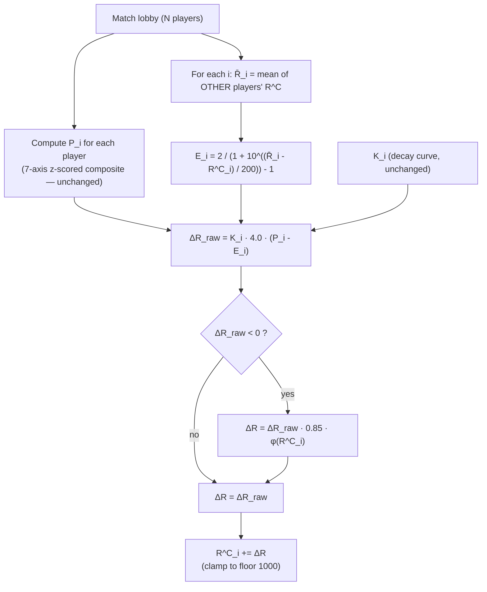

# VTSR v2 — Opponent-Strength-Weighted Combat ELO

## Why this change

Working through real numbers (Lamper +49/+45 in soft lobbies; econchump -32/-26 in heavyweight lobbies) made the lobby-stratification failure mode visible: the current within-lobby z-score baseline rewards "be the best of whoever showed up" rather than "perform above expectation for your rating." We're moving to the chess-ELO answer to this problem — strength-of-schedule baked into every per-match update via a logistic expected-score curve.

## Locked decisions

These are the opinionated calls; each one is intentionally not a knob in the plan:

- **Comparison baseline**: replace `P_med` (lobby median) with `E_i` (rating-aware expected performance index).
- **Lobby reference rating** `R̄_i` = mean of *all OTHER players'* current Combat ELO at the start of the match. Chess convention; cleanest interpretation.
- **Logistic scale** `S_R = 200`. A 200-pt rating gap → expected-performance gap of ~0.5; lines up with our 150-pt tier widths and is the standard chess-ELO half-width feel.
- **Outcome scale rebump** `S_O = 4.0` (was 2.5). `(P_i − E_i)` is naturally smaller than `(P_i − P_med)` because expectations track actuals; bumping S keeps typical swings in the same range veterans/rookies already feel.
- **Cold start**: no special-case. When all ratings = 1500, `E_i = 0` for everyone and the math degrades gracefully. K-decay alone handles the noise floor.
- **Tier ranges**: unchanged. Tiers are absolute, not percentile — the new spread will see top players come down (VTrider est. 2700 → ~2000–2150) and mid-pack compress. We accept the redistribution.
- **Provisional threshold**: unchanged at 10 matches. The new model calibrates faster, but the UX promise of "10 matches to drop the badge" stays.
- **Hope mechanics intact**: loss aversion (×0.85), soft floor (1000), 150-pt taper, asymptotic clamp — all unchanged, applied on top of the new raw delta.
- **Wins ELO**: still stubbed at 1500, `α = 0.0`, blend equation untouched. The bump-to-0.55 path stays open.
- **Single commit, single PIPELINE_VERSION bump**. No staged rollout — there's no useful intermediate state.

## New math (the only thing actually changing)

For each match, walking the corpus chronologically:

```
R̄_i      = (1 / (N - 1)) · Σ_{j != i} R^C_j           (lobby mean of opponents)
E_i      = 2 / (1 + 10^((R̄_i - R^C_i) / 200)) - 1     (logistic expected, mapped to [-1, +1])
ΔR_raw   = K_i · 4.0 · (P_i - E_i)
ΔR       = ΔR_raw                                      (gain case)
         = ΔR_raw · 0.85 · φ(R^C_i)                    (loss case, with floor taper)
```

`P_i`, `K_i`, `φ`, the 7 axis weights, the exclusion gates, and the output schema rows are all unchanged. The only deletion is `P_med` (the population median).



## Sanity-check predictions (will verify post-run)

| Player | Current VTSR | Predicted v2 | Reason |
|---|---|---|---|
| VTrider | 2709 | ~2050–2150 | Stops gaining vs sub-1700 lobbies (E_i pinned near +1) |
| Domakus | 2280 | ~1900–2000 | Same regression toward expected |
| Lamper | 1646 | ~1560–1600 | Two recent monster wins compress to ~+15 each instead of +45 |
| econchump | 1435 | ~1490–1530 | Stops bleeding for "average game in pro lobby" |
| Sly (5 matches) | 1753 | volatile | Calibrates faster — could go higher or lower |

Compression is the correct outcome; chess ratings only spread that wide because of millions of games. Our 25-player league should land in roughly a 1000-pt span (1000 floor → ~2000 ceiling), not a 1700-pt span.

## File-by-file changes

### 1. [scripts/elo.py](scripts/elo.py) — the algorithm

- **Add constants**:
  - `ELO_LOGISTIC_SCALE = 200.0` (rating points per "tier" of expected perf)
  - Bump `ELO_RATING_SCALE` from `2.5` → `4.0` and update its comment to reflect the new role (multiplies the `(P_i − E_i)` outcome diff, not `(P_i − P_med)`)
  - Bump `ELO_SCHEMA_VERSION` from `1` → `2`
- **Add helper** `expected_performance(r_i: float, r_others_mean: float) -> float` returning the logistic mapped to `[-1, +1]`. Pure, no I/O.
- **Refactor `compute_elo()` per-match loop** in the `for md in matches:` block (around lines 367–460):
  - Delete `p_med = _median(perfs)`
  - Compute `r_others_mean[i]` for each player from the **current** `combat_elo[key]` snapshot (importantly: read all ratings *before* applying any updates from this match, so order-within-match doesn't matter — store a snapshot list before the inner loop).
  - Replace `dr_raw = ki * ELO_RATING_SCALE * (perfs[i] - p_med)` with `dr_raw = ki * ELO_RATING_SCALE * (perfs[i] - expected_performance(r_before, r_others_mean[i]))`.
  - Add `expected` (the `E_i` value) to the `match_deltas[]` row alongside `performance` for audit/debug.
- **Update `elo_current` constants block** to include `expected_score_logistic_scale: ELO_LOGISTIC_SCALE` so the dashboard methodology renderer can read it.
- **Update module docstring** at the top to reflect the new formula.

### 2. [scripts/process_stats.py](scripts/process_stats.py) — pipeline cache invalidation

- Bump `PIPELINE_VERSION` from `7` → `8` (line 47). Forces a full re-process of every cached match so per-match contributions get re-emitted under the same shape, and `compute_elo()` runs on the full corpus.
- No other change — the `elo_current.json` / `elo_history.json` writer in `main()` keeps working unchanged because the output shape is preserved.

### 3. Methodology modal — make it the actual single best place to learn VTSR

The modal stopped being a tooltip three iterations ago; we still treat it like one. With v2 dropping a brand-new equation in front of users, this is the moment to lay it out as the proper reference it should be.

**Layout shell ([index.html](index.html) lines 1324–1342):**

- Bump `<div class="modal-dialog modal-dialog-centered modal-lg modal-dialog-scrollable">` → `modal-xl` (1140px max-width). The page is dark-themed and content-dense; no need to keep it narrow.
- Fix the docs link target: `<a href="docs.html?doc=developer#vtsr-methodology">` (was `docs.html#vtsr-methodology` — missing `?doc=developer` and the page was loading the data dictionary instead). Even with the slugify fix below, the `?doc=developer` query is required because docs.html's default doc is the data dictionary.
- Modal title gains a small subtitle line: `<small class="text-muted">v2 · opponent-strength-weighted</small>` so users instantly see the version.

**Body rewrite — `buildVtsrTooltipHtml()` in [js/app.js](js/app.js) at line 4704**:

Replace the current single-pass block with six clearly-titled sections in this order. Each section is a `<section class="vt-vtsr-doc-section">` so we can target spacing in CSS.

1. **The golden equation (hero)** — the full update rule rendered once at large size, plus the symbol legend in a 2-column grid:
   ```
   ΔR^C_i = K_i · S_O · (P_i - E_i)         [if ≥ 0]
          = K_i · S_O · (P_i - E_i) · L · φ(R)   [if < 0]
   ```
   Symbol grid: `K_i` (K-factor) · `S_O = 4.0` (outcome scale) · `P_i` (your performance index) · `E_i` (expected performance) · `L = 0.85` (loss aversion) · `φ(R)` (floor taper).

2. **Expected performance** — the v2 piece. Renders the logistic equation, the curve described in prose ("a 200-pt rating advantage means we expected you to score ~+0.5; a 200-pt deficit means ~-0.5"), and a small 5-row table showing E_i for representative `R̄ - R` deltas (-400, -200, 0, +200, +400) so users can build intuition without reading the math.

3. **Performance composite (P_i)** — the existing 7-axis weights table, with each axis row gaining a one-line plain-English description ("net damage share — how much of the lobby's total damage you accounted for, after subtracting what you took"). Already-rendered in the current modal but currently un-explained.

4. **K-factor & hope mechanics** — combine K-decay + loss aversion + soft floor into one section. Show the K-decay equation, a 4-row K-by-matches table (0 / 5 / 20 / 50+ matches → K = 52 / 38 / 25 / ~19), and the φ taper equation. End with a one-line "why these exist" note: rookies move fast, losses sting less than wins, players near the floor stop dropping.

5. **Tier ladder** — keep the existing 5-row tier table but wrap it in this section so it has its own heading. Add a one-liner above: "Tiers are absolute VTSR thresholds — they don't track percentile, so a thin top tier is a thin top tier."

6. **Worked example: Lamper's match #9** — concrete numbers from real data so the abstraction lands. Show the raw inputs (R^C = 1551, R̄ = 1430, P = 0.50, K = 34), the substitution (E_i ≈ +0.29), the result (ΔR ≈ +29), and a one-line v1→v2 comparison: "Under v1 this same match produced +49; the v2 reduction reflects that out-rating the lobby was part of why the performance looked so dominant."

End with a single `vt-katex-caveat` note: "**VTSR v2 · changed Phase 12.** Per-match comparison switched from lobby-median to rating-weighted expected. Existing `peak_vtsr` values from v1 are no longer comparable. Wins ELO blend (α) still 0.0; full algorithm in DEVELOPER_GUIDE §13."

**CSS in [css/vtstats-theme.css](css/vtstats-theme.css)**:
- Add a `.vt-vtsr-doc-section` rule (top margin, bottom border on all but the last) and a `.vt-vtsr-doc-section h6` rule (uppercase tracking, `--kb-text-muted` color) so the six sections feel like a real reference layout, not a long blob.
- Add a `.vt-vtsr-doc-symbols` 2-column grid and a `.vt-vtsr-doc-curve-table` minimal table style for the expected-score legend table. Keep total CSS additions under ~30 lines.

The KaTeX cache pattern (module-local `vtsrTooltipHtmlCache`) stays intact — we cache the new HTML the same way.

### 4. [docs.html](docs.html) — kramdown-anchor support so the modal's deep link actually jumps

The modal footer's `Read the full methodology` link points at `docs.html?doc=developer#vtsr-methodology`, but vanilla marked doesn't honor the `{#vtsr-methodology}` extension on `## 13. VTSR Methodology {#vtsr-methodology}`. The current docs.html slugify (line 277) auto-IDs the heading from its full `textContent`, so the actual ID becomes `13-vtsr-methodology-vtsr-methodology` and the deep link silently no-ops.

**Fix in the heading-post-processor at [docs.html](docs.html) lines 281–300**: before calling `slugify(heading.textContent)`, regex-detect a trailing `{#anchor}`, extract it as the explicit ID, and strip it from the displayed text. Roughly:

```js
content.querySelectorAll('h1, h2, h3, h4').forEach(heading => {
  const explicit = heading.textContent.match(/\s*\{#([\w-]+)\}\s*$/);
  let id;
  if (explicit) {
    id = explicit[1];
    heading.textContent = heading.textContent.replace(/\s*\{#[\w-]+\}\s*$/, '');
  } else {
    id = slugify(heading.textContent);
  }
  // ... existing dedup + anchor-link logic stays
});
```

This is a general improvement (any future `{#anchor}` in any registered doc just works) and unblocks the modal link with zero modal-side coupling. The existing `location.hash` jump-on-load handler (lines 458–467) and the smooth-scroll TOC handler (line 437) both already work off `getElementById`, so nothing else needs to change in docs.html.

### 5. [DEVELOPER_GUIDE.md](DEVELOPER_GUIDE.md) §13 VTSR Methodology

> docs.html re-renders this file as the "Developer Guide" doc, so editing §13 here is also the docs.html VTSR-methodology change. No separate docs.html content edit.

- **§13.2 Combat ELO derivation** (lines 1576–1593): swap `P_med` for `E_i`, add the logistic equation as a new sub-derivation. Update the table of symbols (drop `P_med`, add `E_i`, `R̄_i`, `S_R`, rename `S` → `S_O = 4.0`).
- **§13.4 Performance index** (lines 1612–1636): unchanged (composite stays).
- **§13.5 Hope mechanics** (lines 1638–1661): unchanged (apply on raw `ΔR` after the new substitution). The "Median P_med drifts up alongside it" sentence is now stale — replace with one acknowledging that `E_i` self-corrects for league drift because it's anchored on absolute ratings, not in-lobby distribution.
- **§13.6 Worked example** (lines 1663+): rewrite using the new formula. Use Lamper match-9 (`R^C = 1551`, `R̄ ≈ 1430`, `P = 0.50`, K=34) so the example matches the discussion: `E_i ≈ +0.29`, `ΔR_raw = 34 · 4 · (0.50 − 0.29) ≈ +29`. Add a brief comparison sentence: "Under v1 this same match would have produced +49; the v2 reduction reflects that out-rating the lobby is part of why the performance was good."
- Add a short **§13.7 Migration note** explaining v1 → v2: what changed, why, what the empirical effect is (compression of the high tail, expansion of the mid-band), and that `peak_vtsr` values from v1 are no longer comparable.

### 6. [docs/DATA_DICTIONARY.md](docs/DATA_DICTIONARY.md) §11

- §11.1 constants block: add `expected_score_logistic_scale` (200.0) to the listed top-level fields. Update the `rating_scale` description to reflect its new value (4.0) and new role.
- §11.2 `history[].deltas[]` row: add `expected` field alongside `performance`. One-line description.
- Bump the schema_version reference from 1 → 2.

### 7. [AGENTS.md](AGENTS.md) and [.cursor/rules/data-schema.mdc](.cursor/rules/data-schema.mdc)

- Update the VTSR rule paragraph in both files to mention v2 / opponent-strength weighting in one sentence each. The "corpus-wide / picker-filter-unaware" contract is unchanged and should stay verbatim.
- AGENTS.md: append a sentence to the existing VTSR bullet noting "v2 (Phase 12): per-match comparison switched from lobby-median to rating-weighted expected performance; Wins ELO blend path unchanged."

### 8. [.cursor/plans/all_matches_&_vtsr_overhaul_e674a0d7.plan.md](.cursor/plans/all_matches_&_vtsr_overhaul_e674a0d7.plan.md)

- Append a short "Phase 12 — VTSR v2" section noting the change, predicted effects, and that PIPELINE_VERSION bumped 7 → 8. Don't rewrite the historical phases.

## Verification (must pass before commit)

1. **Run `python scripts/process_stats.py --force`** to rebuild every match under PIPELINE_VERSION 8 and recompute ELO.
2. **Determinism**: re-run with `--force` a second time; diff `elo_current.json` ignoring `computed_at`. Must be byte-identical.
3. **Spot-check predictions**: confirm Lamper drops from 1646, econchump rises from 1435, gap shrinks. Exact numbers don't need to match the table above (those are estimates) but directional movement does.
4. **No floor breaches**: grep `elo_history.json` for any `after < 1000`. Should be zero.
5. **Schema versions read correctly**: load `index.html`, confirm VTSR card renders.
6. **Modal smoke test**:
   - Click "How It's Calculated" → modal opens centered, `modal-xl` width.
   - All 6 sections render (golden equation / expected curve / composite / K & hope / tiers / worked example), all KaTeX equations render (no `[KaTeX]` console warnings).
   - Footer "Read the full methodology" link goes to `docs.html?doc=developer` AND scrolls to the §13 heading on load.
7. **Sparkline + tier badges**: scroll the VTSR table, every row has a tier badge and sparkline. No `Tier 5` rows below 1000.

## Out of scope (deferred)

- Per-match rating-trajectory chart (still deferred from the original plan).
- Tier range retuning to match the new compressed spread — let the new spread settle first, then revisit if needed.
- Wins ELO bump (`α = 0.55`) — still gated on the in-game winner-attestation UI in `statsgate`.
- Explicit Glicko-2-style RD (rating deviation) tracking — opponent-strength weighting is most of what RD buys you for our cadence.