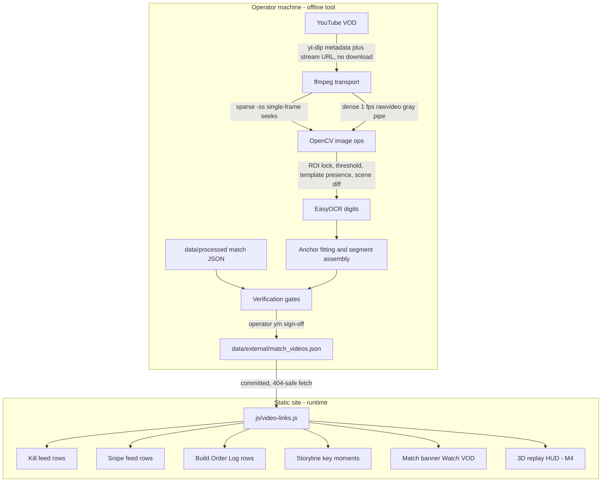

# YouTube VOD Timestamp Sync — Engineering Plan

## 1. Objective and posture

Map **match time** (wire ticks) to **YouTube video time** for community VODs of recorded matches, so any timestamped dashboard surface can emit `https://www.youtube.com/watch?v=<id>&t=<sec>s` deep links. Videos come from multiple channels (F9bomber, HerpMcDerperson, vtriderbz2, …) and are posted days/weeks after the match is processed, so this is a **human-curated, tool-assisted** process — never automatic discovery.

Posture (mirrors the F9 ledger + adjudication precedents exactly):

- **Zero pipeline interaction.** No `PIPELINE_VERSION` / `match.schema_version` / `ELO_SCHEMA_VERSION` bumps. The mapping lives in its own committed file, never in per-match JSON (videos arrive after processing; embedding would force reprocess churn). Rating-inert **by construction**.
- **Operator is final authority.** The tool proposes; a human verifies spot-check links and signs off (`verified: true`), like `data/match_outcome_adjudications.json`.
- **Display-only, corpus-adjacent, picker-unaware, 404-safe** on every consumer.
- **Credit every channel** wherever a link renders (the F9bomber credit-anchor convention).

## 2. System architecture



## 3. Time-base contract (the math every component shares)

This is the load-bearing section; get it wrong and every link is skewed.

- **Wire ticks** are per-match at `match.tick_rate` Hz (20 on modern sessions, e.g. `2026-09-13T02-32-33`). Never hardcode — read the field. Known nuance: the replay iframe path in [js/app.js](js/app.js) (~line 2496) defaults `Number(matchMeta.tick_rate) || 10` while the pipeline defaults to 20; our helper always reads the real field.
- **Canonical match seconds**: `match_sec = (tick − match.tick_range[0]) / match.tick_rate`. This is exactly the displayed match clock — `renderKillFeed(data.kills, currentData.match.tick_range[0]…)` at [js/app.js](js/app.js) line 2618 and `fmtMatchClock()` in [js/charts.js](js/charts.js) line 382 already use this base, as does `positioning.trail.t`.
- **Video seconds**: position on the YouTube timeline. YouTube `&t=` takes integer seconds.
- **Mapping = ordered rate-1.0 segments**: `{video_sec, match_sec, duration_sec}`. For a target `T` inside `[match_sec, match_sec + duration_sec)`:
  `video_t = video_sec + (T − match_sec)` → `&t=${Math.floor(video_t)}s`.
  An **uncut** video is exactly one segment (the "constant offset model"). Cuts produce multiple segments; trimmed footage = gaps in match-space; the union of segment match-ranges is the video's **coverage**.
- **HUD clock skew**: the in-game "Mission Time" may differ from our tick base by a constant (collector start vs mission clock zero). Module constant `MISSION_CLOCK_SKEW_SEC = 0.0`, measured once in Milestone 0 via the kill-counter cross-check on the Egypt pair; anchors convert as `anchor_match_sec = ocr_mission_sec − MISSION_CLOCK_SKEW_SEC`. Whatever the value, it is constant and folds into the stored segments — the QA spot-check validates end-to-end regardless.
- Mission clock parses as `(\d{1,3}):(\d{2})` — the corpus has matches past 99 minutes (the "recycler died at 100:11" precedent).

## 4. Component A — committed store: `data/external/match_videos.json`

Sibling of the F9 ledger files (external, community-sourced, standalone-tool-written). Human-editable like the adjudication store.

```json
{
  "schema_version": 1,
  "_comment": "Human-verified YouTube VOD time mappings, keyed by match id. Written by scripts/map_match_video.py; safe to hand-edit. Segments map dashboard match-seconds ((tick - tick_range[0]) / tick_rate) to video-seconds at playback rate 1.0.",
  "matches": {
    "2026-09-13T02-32-33": [
      {
        "video_id": "2sLbGfx3rXQ",
        "url": "https://www.youtube.com/watch?v=2sLbGfx3rXQ",
        "title": "<yt-dlp title>",
        "channel": { "name": "F9bomber", "url": "https://www.youtube.com/@<handle>" },
        "pov_steam64": "76561198...",
        "uploaded_at": "2026-09-14",
        "video_duration_sec": 1580,
        "mapping_kind": "uncut",
        "segments": [
          { "video_sec": 41.0, "match_sec": 0.0, "duration_sec": 1503.0 }
        ],
        "anchors": [
          { "video_sec": 1128, "mission_time": "18:07", "match_sec": 1087.0, "offset_sec": 41.0 }
        ],
        "identity_check": { "names_matched": 7, "roster_size": 9, "at_video_sec": 1128 },
        "kill_check": { "video": [35, 19], "data": [34, 19], "at_match_sec": 1087, "status": "ok" },
        "verified": true,
        "verified_at": "2026-09-22T20:00:00Z",
        "tool_version": 1,
        "notes": ""
      }
    ]
  }
}
```

Field semantics:

- **Array per match** — multiple videos/POVs coexist (F9bomber's POV, HerpMcDerperson's POV, a caster's spectate). `channel` comes from yt-dlp metadata (`channel` + `channel_url`), CLI-overridable; no channel registry needed.
- `pov_steam64` — nullable; whose cockpit this is (operator supplies `--pov <name|steam64>`, resolved against the match roster).
- `mapping_kind` — `"uncut"` (single OCR-fit segment) | `"edited"` (multi-segment) | `"manual"` (operator-supplied anchors/offset).
- `anchors` / `identity_check` / `kill_check` — audit trail (why we believe this mapping), mirroring the adjudication store's evidence-preserving style.
- `verified` — operator clicked the QA links and signed off. Frontend prefers verified entries.

Invariants (enforced by the gate script, section 7):

- Every match key exists in [data/processed/matches.json](data/processed/matches.json).
- Segments sorted by `match_sec`, non-overlapping in **both** match space and video space, `duration_sec > 0`.
- `0 ≤ match_sec` and `match_sec + duration_sec ≤ manifest duration_sec + 30` (slack for end-screen).
- `video_id` unique within a match's array; `url` embeds `video_id`; `channel.name` non-empty.

Write mechanics: atomic temp-file + rename, `sort_keys=True`, 2-space indent, trailing newline (repo JSON style).

## 5. Component B — operator CLI: `scripts/map_match_video.py`

Standalone, **NOT pipeline-invoked** — the `scripts/import_f9_ledger.py` precedent, including the header banner ("THIS SCRIPT IS NOT PART OF THE PIPELINE") and call-time import guards with fail-loud install hints. Dependencies (operator-only, never required by `process_stats.py`): `yt-dlp`, `opencv-python`, `easyocr` (+ torch; CUDA used when available — RTX 3080 — but CPU must work), `numpy`, and an `ffmpeg` binary on PATH (`shutil.which` check). No requirements file; documented in the script docstring + DEVELOPER_GUIDE runbook (openpyxl precedent).

### CLI surface

```
python scripts/map_match_video.py
  --match 2026-09-13T02-32-33
  --video https://www.youtube.com/watch?v=2sLbGfx3rXQ   (or --input local.mp4 for testing/fallback)
  [--pov <name|steam64>]
  [--channel-name X --channel-url Y]        override yt-dlp metadata
  [--mode auto|uncut|edited]                default auto
  [--anchor MM:SS@VIDEO_SEC ...]            manual anchors (repeatable)
  [--offset SEC]                            direct constant offset (mapping_kind manual)
  [--force-identity]                        bypass the roster gate (logged in notes)
  [--no-gpu] [--debug-frames] [--dry-run]
```

### Phase A — Ingest and metadata

`yt_dlp.YoutubeDL({'format': 'bestvideo[height<=720][vcodec^=avc1]/best[height<=720]'}).extract_info(download=False)` → stream URL, title, channel, channel_url, upload_date, duration. 720p pin gives a stable ROI scale and fast HTTP range seeks. Load `data/processed/<match>.json` + the manifest entry; hard-fail on unknown match id. Note: stream URLs expire (~6 h) — irrelevant at operator scale; `--input` accepts a local file when a channel blocks extraction or for offline testing.

### Phase B — Sparse anchor scan (both modes start here)

The critical empirical constraint: **the mission timer is only visible while the scoreboard overlay is up** (confirmed by the user's screenshot), so most frames have no clock. Design is presence-gated:

1. Sample the video every `SPARSE_STEP_SEC = 45` via per-sample `ffmpeg -ss <t> -i <url> -frames:v 1 -f rawvideo -pix_fmt gray -` (server-side seeks; cv2.VideoCapture network seeking is flaky on DASH/HLS — **ffmpeg owns transport in both modes; OpenCV is the in-memory image toolkit**, which sharpens the original OpenCV-vs-ffmpeg split).
2. Until the ROI is locked: run EasyOCR `readtext` on the top-left quadrant, regex `Mission\s*Time\s+(\d{1,3}):(\d{2})`. On first hit, **lock the ROI bbox and capture the "Mission Time" label crop as an in-video template** (per-video template ⇒ immune to resolution/UI-scale differences across channels; no shipped template assets).
3. After lock: presence test = `cv2.matchTemplate` (TM_CCOEFF_NORMED ≥ `TEMPLATE_PRESENCE_MIN = 0.70`) — sub-millisecond — then binary-threshold the digits sub-ROI and EasyOCR with `allowlist='0123456789:'` only on hits.
4. Collect anchors until ≥ `MIN_ANCHORS = 4` spread across ≥ 60% of the video, or samples are exhausted.
5. Outlier rejection: within an unedited span, mission time must advance 1:1 with video time — drop readings that break monotonicity / deviate from the local median offset (classic OCR confusions: 1↔7, 0↔8).

### Phase C — Mode decision (constant-offset fit)

Per anchor: `offset_i = video_sec_i − (mission_sec_i − MISSION_CLOCK_SKEW_SEC)`.
If `max|offset_i − median(offset)| ≤ OFFSET_TOL_SEC = 2.0` → **uncut**: emit one segment covering the intersection of the video with match `[0, duration_sec]`; go to Phase E. Otherwise → **edited** (Phase D). Always collect multiple anchors even when the video "looks" uncut — a single anchor cannot *prove* uncutness.

### Phase D — Dense scan for edited VODs

One ffmpeg process pipes the entire video: `-vf fps=1,scale=640:-2 -f rawvideo -pix_fmt gray -`, consumed frame-by-frame via `numpy.frombuffer`. 1 fps is the correct cadence: the mission clock has 1 s resolution and YouTube seeks whole seconds, so ±1 s is the natural precision floor. Per frame, two cheap passes:

- **Anchor pass**: template presence on the locked ROI → OCR digits on hits only (tens of OCR calls, not 1800).
- **Cut pass**: scene-change score = mean absolute diff vs the previous frame on a 160×90 downscale; score ≥ `SCENE_CUT_MIN` (with a 2 s refractory) → cut candidate. OCR anchors alone only *bracket* a cut between two scoreboard appearances, possibly minutes apart; scene detection *localizes* it.

Segment assembly:

1. Group anchors into runs of consistent offset (`|Δoffset| ≤ 2.0`).
2. Each run boundary snaps to the strongest cut candidate inside the bracketing anchor interval (fallback: interval midpoint, flagged `"boundary": "estimated"` in notes).
3. Rate check per run: least-squares slope of mission vs video time; `|slope − 1| > SPEED_RAMP_SLOPE_TOL = 0.05` → span flagged speed-ramped and **excluded** from segments (v1 does not model rate ≠ 1 playback).
4. Every emitted segment needs ≥ 2 supporting anchors or explicit operator confirmation.

### Phase E — Verification gates (the part the original spec leaves on the table)

The scoreboard frame contains more than a clock — use it:

1. **Identity gate (hard)**: OCR the roster-name column from the best scoreboard frame (2× upscale + adaptive threshold; names are colored text on noisy background). Fuzzy-match (difflib ratio ≥ `NAME_MATCH_RATIO = 0.75`, case-insensitive) against `leaderboard[].name` + `match.roster[].nickname`. Pass at ≥ max(3, roster_size/2) matches; otherwise **abort** — proves the video actually is this match before anything is written. `--force-identity` overrides with a logged note.
2. **Kill-counter gate (advisory)**: OCR the Team 1 / Team 2 Kills cells (35/19 in the reference screenshot); compare against cumulative `kills.feed` counts at the anchor's match_sec (killer_team slots 1–5 vs 6–10). Tolerance ±5 absolute or ±15% — WARN only, never fail: the engine scoreboard may count kills the pipeline deliberately excludes (v2.9 pilot-victim exclusion). This is also the instrument that measures `MISSION_CLOCK_SKEW_SEC` in Milestone 0.
3. **Operator QA (hard)**: print 5 sampled kill-feed moments as ready-to-click `&t=` URLs; interactive y/n confirm → `verified: true` + `verified_at`. Same sign-off culture as outcome adjudication.

### Phase F — Write

Merge into the store keyed `(match_id, video_id)` — re-running replaces that entry (idempotent). Atomic write, `--dry-run` prints the would-be JSON. `--debug-frames` dumps annotated frames (ROI boxes, OCR readings, cut candidates) to gitignored `_investigation/output/video_sync/<match>/<video_id>/`.

### Module constants (all tunable without schema changes)

`SPARSE_STEP_SEC 45 · MIN_ANCHORS 4 · OFFSET_TOL_SEC 2.0 · DENSE_FPS 1 · TEMPLATE_PRESENCE_MIN 0.70 · SCENE_CUT_MIN (calibrate in M0) · SPEED_RAMP_SLOPE_TOL 0.05 · NAME_MATCH_RATIO 0.75 · KILL_TOL_ABS 5 / KILL_TOL_PCT 0.15 · MISSION_CLOCK_SKEW_SEC 0.0 · FORMAT_MAX_HEIGHT 720`

Performance envelope: uncut path ≈ 30–60 network-bound sparse probes (~1–2 min); edited path streams the whole video once at 1 fps (~3–6 min for a 30-min VOD, network-bound); EasyOCR runs only on scoreboard hits (tens of frames) — GPU is a convenience, not a requirement.

## 6. Component C — frontend: `js/video-links.js` + surfaces

New IIFE module → `window.VTVideoLinks` (the `js/balonce-meter.js` module pattern). Script tag in [index.html](index.html) immediately **before** `js/storyline.js` (~line 2027) since both storyline.js and app.js consume it.

API:

- `ensureLoaded()` — one 404-safe fetch of `data/external/match_videos.json` → `window.__vtMatchVideos` (`{}` on 404; sentinel pattern of `ensureCmdrHistoryLoaded()`). Called fire-and-forget in boot and awaited at the top of `renderMatchData()` (file is tiny; resolves from cache after first call).
- `videosFor(matchId)` → entries array (verified first, then coverage desc).
- `linkForMatchSec(matchId, sec)` → `{url, channel, title, approx} | null` — finds the first covering segment across videos; if `sec` falls in a trimmed gap of an otherwise-covering video, snaps **forward** to the next segment start within `GAP_SNAP_MAX_SEC = 90` and marks `approx: true` (tooltip: "moment trimmed in VOD — nearest kept footage"); otherwise null.
- `linkForTick(matchId, tick, tickRate, minTick)` → convenience wrapper computing `match_sec = (tick − minTick) / tickRate`.

Surfaces (v1):

1. **Match banner**: new `#info-video-link` anchor after `#info-map-link` in [index.html](index.html) (~line 205), same `vt-nav-icon-btn vt-nav-icon-btn--secondary` classes, `bi-youtube` icon, "Watch VOD" label; hidden `d-none` when no mapping. Single video → direct link at the first segment; multiple videos → small dropdown listing `channel — title` per entry (multi-channel support is native: F9bomber, HerpMcDerperson, vtriderbz2 each carry their own `channel` block). Wired where `renderMapBannerFields()` wires `#info-map-link` in [js/app.js](js/app.js).
2. **Kill feed rows** — `renderKillFeed(kills, tickRate, minTick)` at [js/app.js](js/app.js) line 6483: append a trailing `.vt-video-link` icon anchor per row when `linkForTick(entry.tick…)` is non-null (`tickRate`/`minTick` already in scope), `target="_blank" rel="noopener"`, title `Watch on YouTube — <channel>`.
3. **Snipe feed** — same treatment in `renderSnipeFeed` (line 6622).
4. **Storyline key-moments rail** — [js/storyline.js](js/storyline.js) rail rows: icon sibling of the expand chevron; `stopPropagation()` so the existing row-click → `vtOpenReplayAtTick` replay seek is untouched; guard `typeof window.VTVideoLinks !== 'undefined'`. Beats already carry `sec`, so use `linkForMatchSec` directly.
5. **Build Order Log rows** — the build-log renderer in [js/app.js](js/app.js): per-row icon revealed on row hover via CSS (rows are dense). Respect the gate-slice rule: any new build-log helper lives **at or after** `buildlogFilterFn` (`_investigation/check_econ_tooltips.mjs` slices that region).

CSS: `.vt-video-link` (+ `.vt-video-chip` for the banner) block in [css/vtstats-theme.css](css/vtstats-theme.css), sibling of `.vt-odf-link`; colors via `--kb-*` variables only (muted default, `--kb-danger` hover tint) — zero hardcoded colors per styling rules.

Deferred to M4 (follow-ups, each small and independent):

- **3D replay HUD button** in [_map-analysis/render/js/replay-hud.js](_map-analysis/render/js/replay-hud.js): "Watch this moment" using the current playhead second; the replay app fetches the store itself using its existing data-root resolution (see [_map-analysis/render/js/replay-data.js](_map-analysis/render/js/replay-data.js) / `loader.js`).
- **Picker facet / badge**: "Has VOD" chip in the match-picker modal — pure client-side join against the loaded store, no pipeline change.
- **Player-page match log column** in [js/player.js](js/player.js).

## 7. Component D — validation gate: `_investigation/check_match_videos.py`

Stdlib-only, mirrors `_investigation/check_f9_ledger.py`:

- Validates every store invariant from section 4 against `matches.json`.
- **Forbidden-consumer grep**: `scripts/process_stats.py`, `scripts/elo.py`, `scripts/elo_commander.py`, `js/all-matches-aggregator.js` must never reference `match_videos` (keeps rating-inertness structural, not aspirational).
- Register in `_investigation/run_all_gates.py` alongside the existing gates.

## 8. Documentation and convention updates

- [docs/DATA_DICTIONARY.md](docs/DATA_DICTIONARY.md) — new §16 "Match Video Links (YouTube VOD Sync)": store schema, invariants, time-base contract, gap/coverage semantics, verification-evidence fields.
- [DEVELOPER_GUIDE.md](DEVELOPER_GUIDE.md) — operator runbook: end-to-end "a new VOD appeared, map it" walkthrough (command, gates, sign-off, commit), plus the frontend helper contract.
- [AGENTS.md](AGENTS.md) + [.cursor/rules/project-overview.mdc](.cursor/rules/project-overview.mdc) — key-file bullets: the store, the tool, the module; the "display-only / picker-unaware / rating-inert / forbidden consumers / credit the channel" convention line.
- [.cursor/rules/filter-contract.mdc](.cursor/rules/filter-contract.mdc) — reference-table row: `data/external/match_videos.json` = match-global, never narrowed, 404-safe, NOT picker-aware.

## 9. Milestones and acceptance criteria

**M0 — Calibration spike (the spec's acceptance test), on the reference pair** `2026-09-13T02-32-33` (Egypt, 1503 s, 9 players) × `2sLbGfx3rXQ`:
- Tool skeleton through Phase C with `--debug-frames --dry-run`.
- Accept: ROI locks; ≥ 4 anchors; residuals ≤ 2 s; `MISSION_CLOCK_SKEW_SEC` measured via kill counters and fixed as a constant; 5 QA links land within ±2 s by human check; scoreboard-visibility frequency documented (drives whether `SPARSE_STEP_SEC` needs tuning).

**M1 — Operator tool complete**: Phase E/F, manual modes (`--anchor`, `--offset`), atomic writes, gate script.
- Accept: rerun is idempotent (byte-identical store); identity gate blocks a deliberately wrong `--match`; `check_match_videos.py` passes; a hand-edited store entry survives validation.

**M2 — Frontend v1**: module + banner + kill feed + snipe feed + storyline rail + build log + CSS + docs.
- Accept: icons appear only on covered ticks for the Egypt match; deleting the store file leaves the dashboard behaviorally identical with zero console errors (404-safe); two-video fixture renders the dropdown with both channel credits.

**M3 — Edited-VOD support**: dense pass, cut localization, speed-ramp exclusion.
- Accept: synthetic splice test — locally cut a copy of the reference VOD with ffmpeg (`--input`), recovered segment boundaries within ±2 s of the known splice points.

**M4 — Follow-ups** (independent): replay HUD button, picker "Has VOD" facet, player-page match-log column.

## 10. Risks and mitigations

- **Timer only visible on the scoreboard overlay** → presence-gated scanning (deaths/score checks surface it regularly); worst case: `--anchor` manual mode still yields a valid verified mapping.
- **OCR digit confusion** (1↔7, 0↔8) → digit+colon allowlist, monotonicity rejection, median-of-anchors offset, ≥2 anchors per segment.
- **Resolution / UI-scale variance across channels** → per-video in-video template lock at 720p pin; nothing shipped or global.
- **Speed-ramped edits / timelapses** → slope check flags and excludes those spans rather than emitting wrong links.
- **Stream URL expiry / throttling** → operator-scale only; `--input` local-file fallback.
- **Video deleted later** → store entries persist (historical record); dead link is acceptable; optional `unavailable` flag later.
- **Scoreboard kill semantics ≠ pipeline kill semantics** (v2.9 pilot-victim exclusion) → kill-counter gate is advisory-only by design.
- **Overlapping coverage from multiple videos** → deterministic ordering (verified desc → coverage desc → upload date asc); banner dropdown lists all.
- **yt-dlp API churn** → operator-only dependency; not in any CI or pipeline path.