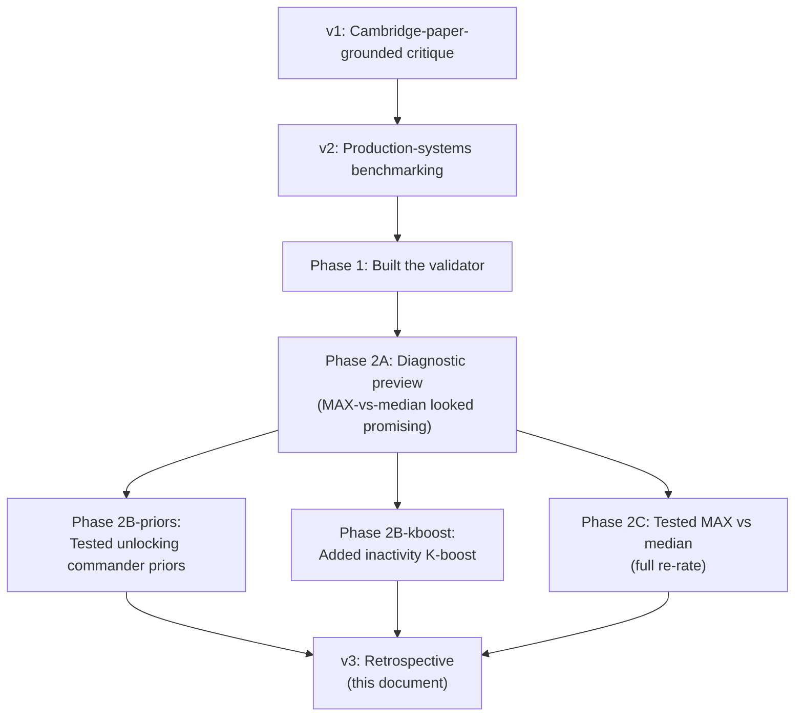

# VTSR-T Analysis v3 — Plain Edition

> The plain-language version of `elo-analysis-v3.md`, written for someone who does not want to wade through equations or full-corpus validator output. Same six-part structure as the in-depth doc: current state, how we validated, what we found, what survived, where we go from here, plus a clearly-labeled opinion section. Where the in-depth version cites validator outputs and code line numbers, this version explains in plain English what the numbers mean.

## TL;DR

- **We built a validator** for VTSR-T (the rating system) and ran it against the live corpus. The validator scores nine independent things about the rating, and crucially does NOT require winner data — it works off the per-player composite performance score we already compute for every match.
- **We tested three reforms** drawn from the v2 critique. One shipped in canonical, two were tried as parallel "what-if" rating files and refuted.
  - **Inactivity K-boost — SHIPPED.** A long-absent player returning after months now gets bigger rating swings on their first matches back, the same way new players do. Runs invisibly until somebody actually has a long gap.
  - **Locked commander priors — REFUTED.** We tried unlocking the two hand-tuned commander adjustments. Net rating change for the most-affected player: 4 ELO. Bootstrap noise floor: 27 ELO. The locks have less effect than the natural noise in the rating. Kept canonical.
  - **MAX vs median rating updates — REFUTED CATASTROPHICALLY.** We tried using "highest rating in the lobby" instead of "median rating in the lobby" for the rating math. Result: ratings inflated by 522 ELO across the board, the rating's predictive power collapsed (Spearman 0.46 -> 0.19), and VTrider dropped out of the top 5 entirely. Kept median.
- **What survived from the v2 critique:** the predictive-validation gap was a real gap (now fixed by the validator); the inactivity-handling gap was a real gap (now fixed by the K-boost); the team-aggregation finding from Phase 2A is still useful for downstream consumers like Lobby Tools.
- **What did NOT survive:** the "median is mathematically wrong" framing, the "locked priors corrupt empirical integrity" framing, the "VTSR-T is a behavioral conditioning tool" rhetoric, the "swap to MAX" recommendation. Three structural critiques that looked compelling on paper did not survive empirical contact.
- **One canonical change since v2:** the inactivity K-boost. That is the only thing that ships differently.

---

## Reading guide

The first five parts (current state, how we validated, what we found, what survived, where we go) are written neutrally — numbers and decisions, no opinions. **Part 7 is a separate opinion section** written by the core developer. If you are cross-checking this against another LLM analysis, treat parts 1-6 as facts and part 7 as one perspective among many.

---

## Part 1 — Current state

### 1.1. The journey from v2 to here



Three decision memos document each Phase 2 experiment in detail. They are linked in the in-depth doc at [critique/elo-analysis-v3.md](critique/elo-analysis-v3.md) section 1, and live in `critique/decisions/`.

### 1.2. VTSR-T in one paragraph (recap)

Every player has a single number called VTSR-T, starting at 1500. After each match, the number goes up or down based on how the player did relative to everyone else in the lobby, on eight different measurements: damage dealt minus damage taken, kills per minute, accuracy, efficiency, PvE damage share, mobility, snipe count, and T-key target lock dwell. We weight these eight, sum them into a single performance score for the match, and compare that to what we would expect from a player at their current rating. New players get bigger rating swings (high "K-factor") and experienced players get smaller ones. There are gates that exclude camera-pod spectators and partial-match late joiners from the rating math entirely.

### 1.3. The one thing that changed in canonical since v2

The K-factor used to depend only on how many career matches a player had played. Now it also depends on **how many days they have been gone**.

In English: a player coming back after 30 days of inactivity gets +1.50 ELO of extra K-factor on their first match back; after 100 days, +5 ELO; after 400+ days, +20 ELO (the cap). On dense-play data (people playing every other day) the boost is essentially zero and nobody notices. On a player who actually disappears for months, their first matches back move their rating more than usual, the same way new players' first matches do. The intent is to handle returning players honestly — not a player who played yesterday is the same as a player who played eight months ago.

The math is `+min(20, 0.05 x days_inactive)` added on top of the existing matches-played K. Schema is unchanged, no UI changes, no field removals — the additional fields on `elo_current.json` are passive sentinels.

This is the **only** algorithm change since v2. Everything else either stayed the same or was tested and explicitly kept the same.

---

## Part 2 — How we validated

### 2.1. The validator script

`scripts/validate_elo.py` is a read-only program that takes the rating outputs and scores them against the empirical record. It does not change anything — it just produces a report. The report covers nine independent properties of the rating system. Run it from the repo root:

```bash
python scripts/validate_elo.py
```

Output lands in `_validation/report.md` (human-readable) and `_validation/report.json` (machine-readable). There are also flags to score the parallel "what-if" rating files (`--elo-mode unlocked`, `--elo-mode max`, `--elo-mode softmax`, `--elo-mode thugs_only`) which is how Phase 2B and 2C were evaluated.

### 2.2. The nine things the validator checks (in plain English)

1. **Does pre-match rating predict in-game performance?** For each match, do players with higher pre-match ratings actually score higher on the composite? Single most important number. Phase 1 result: yes, well above noise.
2. **Are the predictions calibrated?** When the system says "this player should outperform their lobby by X amount," does that prediction match what actually happens on average? Phase 1 result: predictions track within 2 percentage points of observation.
3. **Does past performance predict future performance?** Take each player's first-half mean composite, see if it predicts their second-half mean composite. This is the **ceiling** for any rating system reading from the composite — if it does not work here, no rating math can fix it. Phase 1 result: 0.80 out of 1.0, very strong.
4. **Is the leaderboard stable under match resampling?** Re-run the rating computation on random 80% subsets of matches, do this 100 times, see how much the top 20 reshuffles. Bonus: the spread we see across runs *is* a real confidence band per player. Phase 1 result: top 20 stays mostly the same (83% overlap), per-player jitter is about 27 ELO.
5. **On matches where we DO know the winner, does our rating predict it?** Wide confidence interval but anchors against Cambridge skillbench numbers. Phase 1 result: 43-53% depending on team-aggregation choice (more on this in Phase 2C).
6. **Synthetic winner from team performance.** Declare "team with higher mean composite performance won" as a fake winner. Compare to the real `clean_win` ground truth. If 85%+ agreement, the fake winner unlocks blending winner data into the rating against the full corpus instead of the small reliable subset. Phase 1 result: **93.3% agreement.** Big deal — this means we can do the future winner-blending experiment whenever we want.
7. **Log-loss on `clean_win`.** Distinct from top-1 accuracy: a 51%-confident win prediction is different from a 95%-confident one. Phase 1 result: roughly at coin-flip baseline; small subset, high confidence interval.
8. **Drop each axis one at a time.** See which axis removals barely change rankings. Those are dead weight. Phase 1 result: `snipe_bonus` and `target_lock_pct` are near dead weight on the current corpus; `net_damage_share` is the most load-bearing.
9. **Wobble the eight axis weights.** See if rankings stay stable when weights are randomly perturbed. Phase 1 result: very stable. We are not tuned on a knife edge.

### 2.3. What the validator can NOT see

The validator works on individual performance data, which means it can answer "does the rating predict anything?" really well. It cannot answer:

- **"Does the rating predict winners on lopsided matches?"** Out of 30 reliable winner matches, *zero* have a team-mean rating gap of more than 100 ELO. So our prediction-accuracy numbers are measured exclusively on tightly-balanced matches. The system's true ceiling on lopsided matches is currently untestable.
- **"Is rating drift driven by the EOMM mechanics?"** Soft floor + 0.85 loss aversion together mean total rating drifts upward over time. The math is unambiguous. Whether this matters in practice for matchmaking requires an `alpha > 0` win/loss blend to test (we have not run this yet).
- **"Are commanders systematically over/under-rated?"** Out of 30 reliable winner matches, all 30 have at least one commander. We cannot compare commander-vs-no-commander prediction accuracy on this data.

These are documented as Phase 13.5 / 13.6 in the in-depth doc.

---

## Part 3 — What we found

### 3.1. Phase 1 + 2A baseline (the "smoke test" results)

100 rated matches, 35 players, 30 matches with reliable winners. Validator run on canonical VTSR-T.

**What worked.**

- The composite is doing real work (self-consistency 0.80 out of 1.0).
- Pre-match rating predicts in-match performance (Spearman 0.46 across 884 player-matches).
- The leaderboard is stable under resampling (83% top-20 overlap).
- The system is not tuned on a knife edge (axis-weight perturbations barely move rankings).
- The synthetic-winner proxy passed at 93%, unlocking future winner-blending against the full corpus.

**What was unexpected.**

- Predicting team wins from team mean rating is *worse than coin flip* (43.3% on the small subset). Cambridge's CS:GO benchmarks were 60-64%. Big finding of Phase 1.
- The follow-up experiment in Phase 2A explained the 43.3%: instead of "average rating per team," try "highest rating per team" (per Dehpanah 2021's tactical-shooter finding). Result jumped to 53.3% — +10 percentage point lift, in exactly the direction the paper predicted. **This was the smoking gun that motivated Phase 2C.**
- The commander breakout could not run (all 30 reliable-winner matches had a commander). The rating-gap breakout reframed the headline (zero matches with a >100 ELO gap, so the 43% was measured exclusively on tightly-balanced matches).

### 3.2. Phase 2B: locked commander priors — REFUTED

**The original claim (v2 §6.2):** two of the eight axes have hand-tuned commander overrides that contradict the empirical data. The harder reading called this "behavioral conditioning" and "corruption of empirical integrity."

**What we did:** added a one-line flag to `compute_elo()` that lets you re-rate the corpus with the locks turned off. Pipeline emits the result as a parallel `elo_current_unlocked.json` file. Validator scored it side-by-side with canonical.

**What we found:**

| | Canonical | Unlocked |
|---|---|---|
| Spearman rho (predictive ceiling) | 0.4623 | 0.4623 |
| Self-consistency | 0.8043 | 0.8063 |
| Synthetic-winner agreement | 0.9333 | 0.9333 |
| Bootstrap rating-proxy std | 27.0 ELO | 26.8 ELO |
| Biggest single-player rating shift | 0 | 3.9 ELO |
| Commander cohort mean shift | 0 | -2.4 ELO |

**The biggest single-player rating shift was 3.9 ELO. The bootstrap noise floor is 27 ELO.** The locks have less effect on commander ratings than the natural noise in the rating itself. Headline validator metrics are flat across modes.

**Decision: keep canonical locks.** The data did not show the locks matter empirically, but it also did not show they do harm. The choice is now a values question (descriptive vs normative) and the locks implement documented design intent. The forensic alt JSON pair stays around in case a future audit (more data, commander-free `clean_win` subset) wants to revisit.

### 3.3. Phase 2B: inactivity K-boost — SHIPPED IN CANONICAL

**The original claim (v2 §7.1):** match-count K-decay is right; the time component is missing. A returning player after 8 months is more uncertain than a player who played yesterday, but VTSR-T treated them identically.

**What we did:** added `+min(20, 0.05 x days_inactive)` to the K-factor function. Tracked each player's last-match-date through the chronological match loop. Re-rated the corpus.

**What we found:**

- Median days-inactive across the corpus: 0.02 days (everyone plays close together)
- Max days-inactive on any single row: 25.9 days (one player, one big gap)
- Biggest single-row K-boost applied: +1.30 ELO
- Rows hitting the 20.0 cap: 0
- Total extra K applied across the entire corpus: 40.7 (basically nothing)
- Validator metrics pre vs post: identical to four decimal places

**Decision: ship in canonical.** The mechanism is wired, runs invisibly on dense data, and stands ready to absorb returning-player uncertainty when it actually matters. No regressions. This is the only canonical algorithm change since v2.

### 3.4. Phase 2C: MAX vs median — REFUTED CATASTROPHICALLY

**The original claim (v2 §6.1):** Dehpanah 2021 says team threat in tactical shooters is dominated by the highest-rated player, not the median. Phase 2A's preview said hard MAX gives +10pp lift on `clean_win` accuracy. We should swap from median to MAX (or softmax) in `compute_elo()`.

**What we did:** added a parameter to `compute_elo()` that switches from `median(R_others)` to `max(R_others)` or `softmax_weighted(R_others)`. Re-rated the entire corpus under each. Scored each via validator.

**What we found:**

| | Canonical (median) | Hard MAX | Softmax MAX |
|---|---|---|---|
| Spearman rho (predictive ceiling) | **0.46** | **0.19** | 0.36 |
| Bootstrap rating-proxy std | 27 ELO | **50 ELO** | 32 ELO |
| Mean rating (anchor is 1500) | 1532 | **2022 (+522)** | 1663 (+163) |
| Rating range | 330 | **990 (3.0x)** | 422 |
| Top 5 leaderboard | VTrider, Domakus, Snake, Nomad, Cyber | Nomad, Snake, Domakus, Sev, F9bomber | Mostly preserved |

**Hard MAX collapsed.** Spearman fell more than 50%. Mean rating drifted +522 ELO above anchor (it should be near anchor at zero-sum). Bootstrap noise nearly doubled. VTrider — the canonical #1 — dropped out of the top 5 entirely.

**Why it broke.** When you compute "expected performance" against the highest-rated opponent instead of the median, every player except the strongest has their reference dragged toward the lobby ceiling. They are expected to do much worse than they actually do, so the rating math gives them positive points every match. Result: systematic upward drift, not skill-tracking. The rating starts measuring "how many lobbies have you been in with a noticeably stronger player" instead of "how good are you."

**The two-questions-two-answers framing.** Phase 2A asked one question — "should we aggregate ratings differently *at team-prediction time*?" — and the answer was yes (hard MAX +10pp). Phase 2C asked a different question — "should we use MAX inside the rating math?" — and the answer was no (catastrophic). These are different questions. The Phase 2A finding survives separately for downstream consumers like Lobby Tools' Team Balonce, which can use softmax-weighted team-strength at lobby-formation time without disturbing the canonical rating math.

**Decision: keep median canonical.** Forensic alt JSON pairs (`elo_current_max.json` and `elo_current_softmax.json`) are retained on disk so the result is verifiable / re-runnable, but they do not feed into anything user-facing.

---

## Part 4 — What survived, what didn't

### 4.1. The v2 critique status, in plain English

| v2 critique | What we did | Outcome |
|---|---|---|
| "We never validate the rating's predictions" | Built the validator | **Correct critique. Fixed.** |
| "We do not handle long-inactive players" | Added inactivity K-boost | **Correct critique. Fixed.** |
| "We never test how stable the rating is to small changes" | Built Dirichlet + axis ablation into validator | **Correct critique. Fixed.** |
| "Median-vs-MAX rating updates are mathematically wrong" | Phase 2C full re-rate under hard MAX and softmax | **Refuted catastrophically.** Median wins decisively. |
| "Median-vs-MAX team aggregation at lobby-formation time" | Phase 2A post-hoc reweight on canonical ratings | **Partially survived.** Useful for Tools page, NOT for canonical rating math. |
| "Locked commander priors corrupt empirical integrity" | Phase 2B full re-rate with locks off | **Refuted at current corpus.** Locks have <noise-floor effect. |
| "Soft floor + loss aversion = inflationary EOMM" | Not yet tested (needs alpha > 0 first) | **Open.** Math is real; empirical impact unmeasured. |
| "Just port to Glicko-2 instead of additive K-boost" | Phase 2B kboost is the additive compromise | **Vindicated.** K-boost works on current data; full port would be 3+ weeks of work for no measurable lift. |
| "VTSR-T is a behavioral conditioning tool, not a skill evaluator" | Phase 2B settled the underlying question | **Rhetorical framing not supported.** Effect of the locks is below noise floor. |

**Net.** Two critiques (validation gap, inactivity handling) were correct and have been fixed. Three structural critiques (median, locked priors, EOMM) did not survive empirical contact in their strongest forms. EOMM remains formally open until we run the win/loss blend experiment.

### 4.2. The v2 ten-item recommendation list, refreshed

| # | v2 recommendation | Status |
|---|---|---|
| 1 | Build the validator | **Shipped.** |
| 2 | Locked-priors ablation | **Tested, refuted.** Forensic alt mode retained. |
| 3 | Parallel MAX `E_i` | **Tested, refuted.** Forensic alt modes retained. |
| 4 | Sensitivity / stability suite | **Shipped** (built into validator). |
| 5 | Inactivity K-boost | **Shipped in canonical.** |
| 6 | Synthetic-winner proxy validation | **Passed at 93.3%**. |
| 7 | Parallel Hidden MMR (dual-track foundation) | Open; deferred |
| 8 | `alpha > 0` win/loss blend | Open; data-unblocked, unshipped |
| 9 | Full dual-track architecture | Open; gated on #8 |
| 10 | Full Glicko-2 RD migration | Open; probably never |

Five items closed. Five items remain open in some form, all addressed in Part 5.

---

## Part 5 — Where we go from here

### 5.1. Ready now (no data dependencies)

**5.1.1. Tools Team Balonce: switch team-strength estimate to softmax-weighted.** Phase 2A's directional finding — that hard MAX gives +10pp on `clean_win` accuracy at team-formation time — is real and useful for Lobby Tools' Team Balonce. The change is scoped to lobby-formation only, does not touch canonical rating math, and is one helper function plus one wiring change. **Effort: ~1-2 hours.** **Why now: lowest-effort, highest-confidence improvement on the table.**

**5.1.2. Pilot the win/loss blend (`alpha > 0`).** The synthetic-winner proxy validated at 93.3% means we can blend winner outcomes into the rating math against the *full* corpus, not just the small reliable subset. Sweep alpha at 0.1, 0.25, 0.5; full re-rate each; score via validator; pick the value that lifts predictive accuracy without degrading other metrics. **Effort: ~2-3 days.** **Why now: data is unblocked; this is the most likely positive empirical update from future work.**

**5.1.3. Predictive-power growth tracking.** Run the validator on every pipeline run, accumulate the headline metrics over time. Gives early warning if any canonical assumption starts to break as the corpus grows. **Effort: ~half day.** **Why now: cheap, recurring, future-proofs the audit trail.**

**5.1.4. Axis weight retune (low priority).** Validator showed `snipe_bonus` and `target_lock_pct` are near dead weight. Their combined 0.18 weight could be redistributed to load-bearing axes. **Effort: ~1 day for two-config trial.** **Why low priority: Dirichlet test says weight perturbations cannot flip rankings; the lift would be marginal.**

### 5.2. Data-gated (waiting on something)

**5.2.1. EOMM / dual-track audit.** Soft floor + loss aversion mathematically inflate ratings over time. Whether this matters in practice for matchmaking requires comparing canonical against a "pure" version (no floor, no loss aversion) — which only becomes meaningful once `alpha > 0` is in active use as a rating signal (otherwise both versions predict the composite-only signal identically). **Blocker: 5.1.2 must land first.**

**5.2.2. Lopsided-match prediction ceiling.** Currently zero of 30 reliable-winner matches have a team-mean rating gap > 100 ELO. The system's true predictive ceiling on lopsided matches is intrinsically untestable on this data. **Blocker: corpus growth, or manual winner attestation on existing lopsided matches.**

### 5.3. Probably never

**5.3.1. Full Glicko-2 / TrueSkillPlayers migration.** Phase 2B kboost is currently sufficient (zero rows hit the cap on dense data; pre/post validator drift is at the 4th decimal place). Cambridge's Figure 2 shows defaults are near-optimal in most rating systems; the engineering cost (3+ weeks for the port; significant test surface; downstream JSON/UI churn) is hard to justify before the additive fix demonstrably fails. **Trigger to revisit:** if a future audit shows returning players (>180 days inactive) miscalibrate by >50 ELO over their first 5 matches back, even with the K-boost.

### 5.4. Re-tuning protocols (when to revisit each canonical lever)

| Lever | Current value | Trigger to revisit |
|---|---|---|
| Inactivity K-boost rate | 0.05 ELO/day | Returning players still miscalibrate by >50 ELO with K-boost active |
| Inactivity K-boost cap | 20.0 ELO | More than 20% of returning-player rows hit the cap |
| Locked commander priors | locked | Validator on commander-only `clean_win` subset shows locks hurt prediction by >5pp |
| Opponent reference | median | Future re-rate under softmax with different `tau` shows >0.05 Spearman lift without runaway drift |
| Win/loss blend (`ALPHA`) | 0.0 (stub) | 5.1.2 sweep shows positive alpha lifts metrics without degrading others |
| Axis weights | as documented | 5.1.4 trial shows >0.05 Spearman lift from a redistribution |
| Soft floor + loss aversion | as documented | 5.2.1 dual-track audit shows pure version predicts measurably better |
| K-factor decay shape | as documented | 5.3.1 trigger condition |

---

## Part 6 — Source critiques (preserved)

The original v2 critique material is preserved in detail in the in-depth doc at [critique/elo-analysis-v3.md](critique/elo-analysis-v3.md) Appendices A-D. A condensed summary follows for readers staying in the plain edition.

### 6.1. The two source critiques

**The Cambridge paper** (`csgo-rating-paper.pdf`): tested five rating systems on 10,000 professional CS:GO matches and asked one question: can the system predict the winner before a match starts? Random gets 50%, the dumbest baseline gets ~60%, the best system tested gets 64.1%. Their key finding: rating each individual player works better than rating each team. Their key blind spot: their dataset is win/loss only, so they could not evaluate any system that uses richer per-player performance data (which is exactly what we use).

**The production-systems benchmarking reading** (`Analysis of the VTSR-T Algorithmic Matchmaking and Rating System in Competitive Environments.docx`): benchmarked VTSR-T against modern *production* rating systems shipped in live games, citing five outside sources — the Cambridge paper, a paper on team aggregation methods (Dehpanah 2021), Microsoft's TrueSkill 2 from Halo 5, a 2025 League of Legends production system called PandaSkill, and a stack of papers on Engagement Optimized Matchmaking (EOMM). Its thesis: VTSR-T sacrifices mathematical zero-sum integrity in favor of EOMM principles.

### 6.2. The three structural critiques (and what we found)

| Critique | What it claimed | What we found |
|---|---|---|
| Median is mathematically wrong (use MAX) | Dehpanah 2021 says team threat in tactical shooters is dominated by the highest-rated player, not the median | **Refuted for rating updates.** Hard MAX collapses the rating's predictive power and inflates by 522 ELO. **Survived for team aggregation** at lobby-formation time (useful for Tools page). |
| Locked priors corrupt empirical integrity | Two of eight axes have hand-tuned overrides that contradict empirical data | **Refuted.** Effect on commander ratings is below the 27 ELO bootstrap noise floor. |
| Soft floor + loss aversion = inflationary EOMM | The math is non-zero-sum, ratings drift upward over time independent of skill | **Math is real; empirical impact unmeasured.** Open until win/loss blend lands. |

### 6.3. The three counter-arguments (and how they held up)

| Counter | What it argued | Status |
|---|---|---|
| Full Glicko-2 RD migration is overkill | Additive K-boost gets 80% of the benefit at 5% of the cost | **Vindicated** — K-boost shipped, validator confirms safe-blind on current data. |
| "Behavioral conditioning tool" is hyperbolic | Every rating system embeds design intent; calling locks "conditioning" rhetorically prejudges the question | **Vindicated** — locks have <noise-floor effect; the rhetorical framing was not earned. |
| MAX-only ignores the lobby-calibration use case | Median is right for individual P_i calibration; MAX is right for team-outcome prediction; ship both | **Vindicated** — Phase 2C confirmed median wins for rating updates; Phase 2A finding survives separately for team aggregation. |

---

## Part 7 — Author's perspective (OPINION)

> **Reading note.** Parts 1-6 above are written neutrally and present the empirical record without value judgments. This part is the exception. It is written in first person by the core developer of VTSR-T and is intentionally opinionated. If you are cross-checking this against another LLM analysis, treat parts 1-6 as facts and this part as one perspective among many. Disagree freely.

### 7.1. Where I am confident the data validates the design

**The eight-axis composite is doing real work.** A self-consistency score of 0.80 out of 1.0 means the axes really are measuring something persistent about each player. That is not a noise-only system. The choice to rate against rich per-match performance data instead of just win/loss (Microsoft's TrueSkill 2 made the same call for Halo 5 and got their 52% to 68% lift from it) is the foundational design choice and the data backs it.

**Median is correct as the opponent reference for rating updates.** Phase 2C is the single strongest result in the entire Phase 2 record. Hard MAX did not just fail to beat median — it broke. The "median is mathematically wrong" framing was a category error; it conflated team-aggregation at lobby-formation time (where MAX has signal, per Dehpanah) with rating-update math (where MAX produces runaway inflation by construction). I would defend median as canonical against any future critic on the strength of this data.

**The pure-omission exclusion gates are doing real work.** The bootstrap stability (27 ELO median noise band) is what it is *because* the rating is not trying to absorb signal from camera-pod spectators or partial-match late joiners. Cambridge's CS:GO results handle none of this. We did get this right, even though Phase 2 did not directly touch the gates.

**The validator design is good.** The synthetic-winner proxy at 93.3% agreement is the single most important methodological contribution of Phase 1. It changes "we cannot test the win/loss blend until the corpus is much bigger" into "we can test it tomorrow."

### 7.2. Where I am less confident

**Lopsided-match prediction is genuinely untestable on the current corpus.** Out of 30 reliable winners, *zero* have a team-mean rating gap > 100 ELO. The 43% / 53% prediction-accuracy numbers are measured on tightly-balanced matches only. I do not know what VTSR-T's true ceiling on lopsided matches is, and I would push back on any conclusion (including in this document) that depends on extrapolating these numbers to a hypothetical lopsided test set.

**EOMM-driven inflation is mathematically real but empirically unmeasured.** The math says ratings drift upward over time even at static skill. Whether the drift is large enough to materially affect Lobby Tools' Team Balonce in practice — that we have not tested. The honest answer is "open, gated on the alpha > 0 experiment."

**The locked-priors decision is a values question.** Phase 2B priors ablation refuted the strong "corruption" framing (effect is below noise floor) but did not settle whether commanders' rating axes *should* match their empirical mean (descriptive) or a normative target (rewarding PvE work, partially pardoning low T-key usage). I made a values choice when I picked the locks. The choice is documented in code comments and the decision memo. If a future maintainer wants to flip to descriptive, the alt JSON is one config flag away — and the rating shifts will be small enough that nobody on the leaderboard moves visibly.

### 7.3. Where I think the v2 critiques landed

- **Predictive-validation gap (Cambridge / v2 §5.1):** correctly flagged. Without the validator we were arguing about the rating in the abstract. If I could redo one thing it would be: ship the validator before adding the v2.4 commander axis-shift. Shipping commander adjustments before validating against any ground truth was a methodological miss.
- **Inactivity K-boost (v2 §7.1):** correctly identified. The additive compromise position is what shipped, and it is the right scope (vs full Glicko-2). Cleanest "right idea, right scope" call in the v2 record.
- **Bootstrap stability framing (v1 §8):** correctly identified. Gives us a real ±27 ELO confidence band on every player's rating without porting to Bayesian RD.

### 7.4. Where I think the v2 critiques overshot

- **"Just swap to MAX" would have been catastrophic.** Phase 2A's preview made hard MAX look promising. If we had skipped the validator-gated full re-rate and just swapped, ratings would have inflated by 522 ELO, the leaderboard would have scrambled, and predictive power would have collapsed. The two-questions framing (rating-update vs team-aggregation) was not anticipated by v2; it was forced by the data. **If a future critic recommends a MAX or softmax swap on `compute_elo`, please re-read Part 3.4 carefully.**
- **"Behavioral conditioning tool" rhetoric is not supported.** Phase 2B says the locks affect commander ratings by 4 ELO at the maximum. The bootstrap noise floor is 27 ELO. Calling a sub-noise-floor effect "conditioning" is rhetorically heavy in a way the data does not support.
- **Glicko-2 was prescribed where additive K was sufficient.** The v2 §1b reading went hard on full Glicko-2 RD migration. The K-boost audit shows zero rows hitting the cap and validator drift at the 4th decimal place. Glicko-2 would not produce a measurably different outcome on data this dense, at multiple weeks of engineering cost. v2 §7.1 was right to push back; in retrospect I would push back harder.

### 7.5. What I think the next audit should focus on

In rough order of empirical leverage:

1. **Land the win/loss blend (alpha > 0).** The 93.3% synthetic-winner proxy is sitting unused. A small alpha sweep would either confirm the canonical signal is so strong that adding winner data does nothing (ratifying the axis design) or reveal a real predictive lift (the first new positive empirical finding since Phase 1). Highest-information experiment we can run right now.
2. **Land Tools Team Balonce softmax.** Phase 2A's directional finding deserves to be operationalized somewhere; Tools is the right place. ~2 hours of work.
3. **Land predictive-power growth tracking.** Cheap, recurring, gives early warning on canonical assumption drift.
4. **EOMM dual-track audit becomes interesting only after #1 lands.**

I would specifically NOT prioritize: Glicko-2 migration (until K-boost demonstrably fails), axis weight retune (no leverage per Dirichlet), locked-priors revisit (settled), MAX `E_i` revisit (settled by construction).

### 7.6. What would change my mind

- **Locked priors -> drop them:** if commander-only `clean_win` validator shows the locked variant predicts >5pp worse, OR commander cohort delta exceeds 27 ELO bootstrap noise floor.
- **MAX `E_i` -> swap canonical:** if a future re-rate under softmax with different `tau` (say `tau in {50, 100, 400}`) lifts headline Spearman by >0.05 without runaway mean drift.
- **K-boost -> migrate to Glicko-2:** if returning players (>180 days) miscalibrate by >50 ELO over their first 5 matches back, even with the K-boost active.
- **`ALPHA = 0` -> blend in winner data:** if any positive alpha lifts headline metrics without degrading others (most likely positive update from future work).

### 7.7. One closing thought

The hardest part of this section was being honest about where the v2 critiques landed and where they overshot, because I am the person who responded to them. The temptation to claim every reform was correctly considered is strong; the data does not actually support that.

Phase 2C in particular was a result I did not predict. The MAX-vs-median question looked, going in, like the most likely Phase 2 candidate to succeed. It produced the most decisive negative result in the entire record. That is, in some sense, the entire value of building the validator: forcing the experiment that would have otherwise been "obviously a good idea" into a number that says otherwise.

If a future critic surfaces a finding I have not anticipated, I would rather see the experiment run than the recommendation taken. The validator is the way to do that. The decision memos in `critique/decisions/` document the format. The pattern is portable.

---

*v3 finalized after Phase 2B + 2C empirical work landed. Decision memos in `critique/decisions/` are canonical for the per-phase experimental records. v2 in `critique/elo-analysis-simple-v2.md` is preserved as historical reference.*
