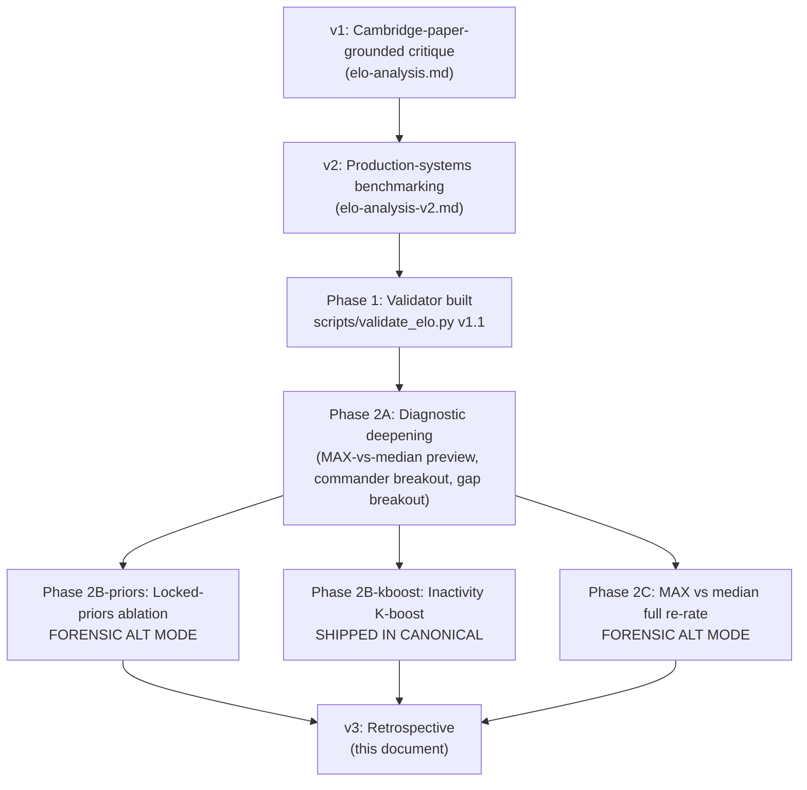

# VTSR-T Analysis v3: Retrospective and Methodology

> The retrospective companion to `elo-analysis.md` (v1, Cambridge-paper-grounded) and `elo-analysis-v2.md` (production-systems benchmarking). v2 was forward-looking ("here is what we propose to test"); v3 is retrospective ("here is what we tested, what we found, and what we changed"). Parts I-V present the empirical record neutrally. Part VI preserves the v2 critique material verbatim as appendices for cross-checking. Part VII is a clearly-labeled author's perspective written by the core developer.

## TL;DR

- **We built the validator.** `scripts/validate_elo.py` (v1.1) scores VTSR-T against nine independent metrics (rank correlation, calibration, self-consistency, bootstrap stability, synthetic-winner agreement, clean-win prediction, log-loss, single-axis ablation, Dirichlet weight perturbation) using a per-player composite-performance proxy that does not require winner data. Reports land in `_validation/`.
- **We tested three reforms drawn from the v2 critique.** All three are now empirically settled.
  - **Inactivity K-boost (v2 §7.1):** wired into canonical, audited, no regressions. The only canonical algorithm change since v2.
  - **Locked-priors ablation (v2 §6.2):** ran as a forensic alt mode. Net commander rating delta 3.9 ELO at the maximum vs a 27 ELO bootstrap noise floor. Validator headline metrics flat. Decision: keep the canonical locks.
  - **MAX / softmax `E_i` (v2 §6.1):** ran as forensic alt modes. Full corpus re-rate under hard MAX collapsed predictive Spearman rho from 0.462 to 0.188, doubled bootstrap proxy std (27 -> 50 ELO), and inflated mean rating by +522 ELO above the 1500 anchor. Decision: keep median canonical.
- **What survived from the v2 §1b structural critiques.** The predictive-validation gap was correctly flagged (now closed by the validator). The inactivity-handling gap was correctly flagged (now closed by the K-boost). The MAX-vs-median structural concern, the locked-priors "corruption" framing, and the EOMM "behavioral conditioning tool" rhetoric did not survive empirical contact.
- **What is genuinely open.** Lopsided-match prediction ceiling (currently untestable on the corpus), `alpha > 0` win/loss blend (data-unblocked but unshipped), Tools Team Balonce softmax-weighted aggregation (the one Phase 2A finding that survived as useful for downstream consumers), EOMM / dual-track audit (untested, gated on `alpha > 0`).
- **One canonical algorithm change since v2:** `k_factor()` adds `min(20, 0.05 * days_inactive)` on top of the matches-played K. Schema-additive, no `PIPELINE_VERSION` or `ELO_SCHEMA_VERSION` bump.

---

## Reading guide

- **Parts I-V** are the retrospective: current state, validation methodology, empirical findings, what survived, where we go from here.
- **Part VI** preserves all v2 critique source material as appendices so an outside reader (or another LLM cross-check) can re-engage with the original framings without leaving the document.
- **Part VII** is a single dedicated section labeled OPINION. The author of v3 is the core developer of VTSR-T. Parts I-V intentionally avoid first-person voice and value judgments. Part VII is where the author's perspective lives.
- **Cross-references.** Every empirical claim cites a source: the validator output (`_validation/report.{md,json}`), one of the three decision memos in [critique/decisions/](critique/decisions/), or a specific line in [scripts/elo.py](scripts/elo.py) or [scripts/validate_elo.py](scripts/validate_elo.py).

---

## Part I — Current state

### 1. The journey from v2 to v3



Each phase is documented in its own decision memo:

- Phase 2B priors ablation: [critique/decisions/phase-2b-priors-ablation.md](critique/decisions/phase-2b-priors-ablation.md)
- Phase 2B inactivity K-boost: [critique/decisions/phase-2b-kboost.md](critique/decisions/phase-2b-kboost.md)
- Phase 2C MAX vs median: [critique/decisions/phase-2c-max-vs-median.md](critique/decisions/phase-2c-max-vs-median.md)

### 2. VTSR-T canonical as of v3

VTSR-T is the per-player thug-focused rating defined in [scripts/elo.py](scripts/elo.py). Per-player ELO-style scalar anchored at 1500.

| Component | Value |
|---|---|
| Granularity | Per-player |
| Update signal | 8-axis lobby-relative composite `P_i in [-1, +1]` |
| Update rule | `dR = K_i * 2.5 * (P_i - E_i)`; loss aversion 0.85; linear floor taper |
| Win/loss blend | `ALPHA = 0.0` (stub; data-unblocked since Phase 2A but unshipped) |
| Confidence parameter | None (only binary "Provisional" badge for `n < 10`) |
| K-factor (matches) | `40 * (1 - n / (n + 10)) + 12` (rookie ~52, n=50 ~18.7) |
| **K-factor (inactivity, v3 NEW)** | `+ min(20, 0.05 * days_inactive)` |
| Volatility tracking | None |
| Opponent reference | Median of all other players in lobby |
| Soft floor | 1000, with 150-pt linear taper |
| Role adjustment | v2.4 commander axis-shift: 4 audit-derived priors + shrunk rolling baseline; 2 hand-tuned LOCKED priors (`target_lock_pct: -0.10`, `pve_share: -0.05`); 2 role-blind axes |
| Exclusion gates | `is_campod` / `is_low_activity`; v2.7 dashboard `is_commander` thug-only mode |

The 8 axes (current weights, from `THUG_WEIGHTS` at [scripts/elo.py:97-106](scripts/elo.py)):

| Axis | Weight | What it measures |
|---|---|---|
| `net_damage_share` | 0.20 | (dealt - received) / lobby total |
| `thug_kill_rate` | 0.20 | (pvp_kills + 0.5 * pve_kills) / minutes |
| `thug_efficiency` | 0.16 | Kills per damage dealt; weapon-normalized |
| `thug_accuracy` | 0.15 | Hit rate, weapon-baseline-normalized; alpha-blended |
| `pve_share` | 0.12 | PvE damage share (asset disruption) |
| `mobility` | 0.08 | Activity score from positioning data |
| `snipe_bonus` | 0.05 | Capped sniper-rifle hits |
| `target_lock_pct` | 0.04 | T-key target-lock dwell ratio |

### 3. What changed in canonical since v2

**Exactly one canonical algorithm change.** Inactivity K-boost added to `k_factor()` ([scripts/elo.py:206-225](scripts/elo.py)).

```python
def k_factor(matches_played: int, days_inactive: float = 0.0) -> float:
    n = max(0, int(matches_played))
    base = ELO_K_BASE * (1 - n / (n + ELO_PROVISIONAL_PRIOR)) + ELO_K_FLOOR
    if days_inactive <= 0.0:
        return base
    boost = min(K_INACTIVITY_BOOST_MAX, K_INACTIVITY_BOOST_RATE * days_inactive)
    return base + boost
```

Module constants ([scripts/elo.py:189-190](scripts/elo.py)):

```python
K_INACTIVITY_BOOST_RATE = 0.05    # ELO per day inactive.
K_INACTIVITY_BOOST_MAX  = 20.0    # Hard cap on the inactivity addition.
```

`compute_elo()` now tracks `last_match_dt[key]` per player across the chronological match loop and threads `days_inactive` into every `k_factor()` call. A returning player gone for 400+ days re-enters with the full +20 ELO ceiling on top of their match-count K. First appearance for a player has `days_inactive = 0` (no boost). Net effect on the current dense corpus is small (audit in section 9 below); the mechanism is built to absorb future returning-player uncertainty without penalizing regulars.

**No bumps.** The new fields surface on `elo_current.json` as additive sentinels (`k_inactivity_boost_rate`, `k_inactivity_boost_max`); existing readers are unaffected. `PIPELINE_VERSION` and `ELO_SCHEMA_VERSION` were not bumped because the change is observationally null on legacy reads.

**Three forensic alt JSON pairs were also added to the pipeline** but are not consumed by canonical:

- `elo_current_unlocked.json` + `elo_history_unlocked.json` (Phase 2B priors ablation)
- `elo_current_max.json` + `elo_history_max.json` (Phase 2C hard MAX `E_i`)
- `elo_current_softmax.json` + `elo_history_softmax.json` (Phase 2C softmax MAX `E_i`)

These are emitted by [scripts/process_stats.py](scripts/process_stats.py) calling `compute_elo()` with the appropriate flags. They are not surfaced in the dashboard; they exist only for the validator to score and for the decision memos to reference. Section 13 covers when each forensic mode would graduate to canonical.

---

## Part II — How we validated

### 4. The validator: `scripts/validate_elo.py`

A read-only consumer of `data/processed/*.json` artifacts. Does not invoke `scripts/elo.py` and does not modify pipeline state. Outputs three files into `_validation/`:

- `report.md` — human-readable summary (per-metric tables, headline numbers, interpretation copy)
- `report.json` — machine-readable summary (one nested dict per metric; consumed by the comparison scripts in `_validation/`)
- `bootstrap.json` — per-player rating-proxy std distribution under match-resampling (large; gitignored)

Run from repo root:

```bash
python scripts/validate_elo.py
python scripts/validate_elo.py --elo-mode unlocked   # Phase 2B priors alt
python scripts/validate_elo.py --elo-mode max        # Phase 2C hard MAX alt
python scripts/validate_elo.py --elo-mode softmax    # Phase 2C softmax alt
python scripts/validate_elo.py --elo-mode thugs_only # v2.7 thug-only mode
```

The `--elo-mode` flag selects which `elo_current_*.json` + `elo_history_*.json` pair to score; outputs land in `_validation/<mode>/report.{md,json}` so the modes can be diffed side by side.

Source: [scripts/validate_elo.py](scripts/validate_elo.py), docstring at lines 1-62.

### 5. The nine metrics, in detail

The validator computes nine independent metrics. Each one tests a distinct property of the rating system. The thresholds and interpretations below are restated from the validator's own report header so an outside reader can verify each call against the script source.

#### 5.1. Spearman rank correlation: pre-match `R_i` -> post-match `P_i`

**What it tests.** Does a player's pre-match rating predict their composite performance score in that match?

**Method.** For every rated player-match in the corpus, pair `(R_i_pre, P_i_observed)`. Compute the Spearman rank correlation across all pairs. Bucket by lobby size to surface size-conditional drift.

**Threshold.** No formal pass/fail bar. Cambridge skillbench numbers are 60-64% top-1 accuracy on team-level outcome prediction; rho around 0.4-0.5 on individual-performance prediction is consistent with that ceiling given the additional noise from intra-team variance.

**Why it is the most important number.** A rating system that fails this test cannot predict anything downstream. Phase 1 result on canonical: **rho = 0.462 across 884 player-matches**.

#### 5.2. Calibration: bucketed `(R_i - median(R_others))` vs observed mean `P_i`

**What it tests.** When the rating predicts "this player should outperform their lobby by X amount," does the prediction match the observed outcome on average?

**Method.** Bucket player-matches by `(R_i_pre - median(R_others_pre))`. For each bucket, compute observed mean `P_i` and predicted mean `E_i = expected_performance(R_i, median(R_others))`. Mean Absolute Error between observed and predicted is the headline. Buckets are chosen with at least 50 player-matches each to avoid small-N artifacts.

**Threshold.** MAE less than 0.05 is "well-calibrated"; greater than 0.10 indicates systematic miscalibration. Phase 1 result: **MAE = 0.018**.

#### 5.3. Self-consistency Spearman: split-half `P_i`

**What it tests.** Is the composite score itself stable across time? If past performance does not predict future performance, no rating math built on top of `P_i` can predict either.

**Method.** For every player with at least `SELF_CONSISTENCY_MIN_MATCHES = 10` rated matches ([scripts/validate_elo.py:118](scripts/validate_elo.py)), split their match list chronologically in half. Compute their first-half mean `P_i` and second-half mean `P_i`. Across players, compute the Spearman rank correlation between the two halves. Phase 1 result: 0.804 across 23 eligible players.

**Threshold.** This is the **ceiling** for any rating reading from the composite. If split-half `P_i` correlates near 1.0 the composite is stable; if near 0.0 the axes themselves do not measure persistent skill. Phase 1 result: **rho = 0.804**.

#### 5.4. Bootstrap stability: top-20 Jaccard + per-player rating-proxy std

**What it tests.** Are the rankings stable under match resampling? What is the implicit confidence band on each player's rating?

**Method.** Run 100 bootstrap iterations. Each iteration: sample 80% of matches with replacement; recompute per-player rating proxy (sum of axis-weighted deltas across the sampled matches, used in lieu of a full re-rate to keep the bootstrap fast); record the resulting top-20 leaderboard and per-player rating proxy. Across iterations, report:

- Mean top-20 Jaccard agreement against the canonical full-corpus top 20
- Per-player rating-proxy std (median across players) in ELO units

**Threshold.** Top-20 Jaccard above 0.75 is "stable"; below 0.5 indicates the leaderboard is essentially noise. Per-player std reads as a real confidence band. Phase 1 result: **Jaccard = 0.826, sigma ~ 27 ELO median**.

The bootstrap also tells us how to size other rating shifts: a 27 ELO median noise band means any algorithm change that shifts ratings by less than 27 ELO is below the noise floor.

#### 5.5. Synthetic-winner proxy vs `clean_win`

**What it tests.** If we declare "the team with higher mean `P_i` won," how often does that fake winner agree with the inferred `clean_win` ground truth?

**Method.** For every match where `match.winner.decided_by == "clean_win"`, compute mean `P_i` for each team. Predict the higher-mean team as the synthetic winner. Compare against the actual `clean_win` team. Report agreement rate and Wilson 95% CI.

**Threshold.** 85% or higher unlocks the proxy as a winner stand-in for full-corpus `alpha > 0` validation in Phase 3. Phase 1 result: **93.3% agreement (Wilson 95% CI 78.7-98.2%, n=30)**.

This single number is what allows VTSR-T to be validated without broad win/loss attestation. The proxy is a within-match construct (uses both teams' performance in the same match) so it is robust to the same kind of cohort drift that breaks naive winner-rate statistics.

#### 5.6. clean_win winner prediction: mean / hard MAX / softmax aggregations

**What it tests.** Given the rating system's output, which team-aggregation strategy best predicts the actual winner?

**Method.** For each `clean_win` match, compute three team aggregations of pre-match ratings:

- **Mean R**: `mean(R_team)` for each team; predict the higher-mean team
- **Hard MAX R**: `max(R_team)` for each team; predict the higher-max team
- **Softmax MAX R**: weighted average with `tau = 200`: `sum(R * exp(R/tau)) / sum(exp(R/tau))` for each team; predict the higher-softmax team

Report top-1 accuracy and Wilson 95% CI for each aggregation. Cross-tab against the `clean_win` ground truth.

**Threshold.** Cambridge skillbench numbers are 60-64% on similar setups; less than 50% is worse-than-coin-flip. Phase 1 result: **mean R = 43.3%, hard MAX = 53.3%, softmax = 46.7%, all with Wilson 95% CI ~ 16-20pp wide given n=30**.

This is the metric that motivated Phase 2C: hard MAX showed +10pp over mean R on this metric. Section 10 explains why that lift did not survive the full re-rate.

#### 5.7. Log-loss on `clean_win`

**What it tests.** When the system says "team A is 51% likely to win" vs "95% likely to win," can we tell the two confidence levels apart? Top-1 accuracy cannot.

**Method.** For each `clean_win` match, compute predicted P(win) for each team using the logistic E_i curve on each aggregation. Compute log-loss = `-log(P_predicted_for_actual_winner)` summed across matches; divide by N.

**Threshold.** Coin-flip baseline = 0.693 (= -log(0.5)). Lower is better. Phase 1 result on canonical: **log-loss mean R = 0.701, hard MAX = 0.725 (mean) / 0.680 (median)**.

The mean-vs-median log-loss split on hard MAX is informative: hard MAX was correct more often on accuracy but its incorrect predictions were confidently wrong, dragging mean log-loss above coin-flip. Median log-loss (which discards tail outliers) was the best of the three. This was the first hint that hard MAX has a different failure mode than mean R.

#### 5.8. Single-axis ablation

**What it tests.** Which axes carry the predictive signal? Which are dead weight?

**Method.** For each of the 8 axes: drop that axis from `THUG_WEIGHTS`, re-normalize the remaining 7 to sum to 1.0, recompute per-player mean `P_i` (used as a fast proxy for full-rating displacement; full re-rating per axis would be too slow). Compare the new player ranking against the full 8-axis ranking via Spearman rho. Report rho per axis ablated.

**Threshold.** rho near 1.0 = axis is dead weight; rho near 0.5 = axis is load-bearing. Phase 1 result (from `_validation/default/report.md`, ordered by rho ascending):

| Axis dropped | Weight | Spearman rho vs full |
|---|---|---|
| `net_damage_share` | 0.20 | 0.946 |
| `thug_accuracy` | 0.15 | 0.972 |
| `thug_efficiency` | 0.16 | 0.974 |
| `thug_kill_rate` | 0.20 | 0.975 |
| `pve_share` | 0.12 | 0.981 |
| `mobility` | 0.08 | 0.990 |
| `target_lock_pct` | 0.04 | 0.994 |
| `snipe_bonus` | 0.05 | 0.999 |

`snipe_bonus` and `target_lock_pct` (the two smallest-weight axes at 0.05 and 0.04) are near dead weight on the current corpus; `net_damage_share` is the most load-bearing. This is a Phase 3+ candidate (axis weight retune; section 13.4) but does not motivate immediate change.

#### 5.9. Dirichlet weight perturbation

**What it tests.** Are we tuning the rating on a knife edge? Would small perturbations of `THUG_WEIGHTS` flip rankings?

**Method.** Sample 50 weight vectors from a Dirichlet distribution centered on the current `THUG_WEIGHTS` with concentration `alpha = 50` (tight) and `alpha = 10` (loose). For each sample: re-normalize, recompute per-player mean `P_i`, compare ranking to the canonical full ranking via Spearman rho. Report rho mean and min across all 50 samples.

**Threshold.** rho mean above 0.95 with min above 0.85 indicates robust tuning. Phase 1 result on canonical: **rho mean = 0.986, min = 0.931**.

Conclusion: VTSR-T is not on a knife edge. Small perturbations of the weights do not flip the leaderboard.

### 6. What the validator can and cannot see

**The validator does NOT require winner data.** Eight of the nine metrics use only `R_pre` and `P_i` (pipeline outputs available for every player-match). The ninth (`clean_win` prediction + log-loss) uses the small subset where `match.winner.decided_by == "clean_win"`, with synthetic-winner proxy validated at 93.3% agreement so the same metric can be re-run on the full corpus once `alpha > 0` lands in Phase 3.

**The validator does NOT measure lopsided-match prediction.** Of the 30 `clean_win` matches in the current corpus, **zero have a team-mean rating gap greater than 100 ELO**. This means all top-1 accuracy and log-loss numbers in section 5.6 / 5.7 are measured on tightly-balanced matches, where any rating system's predictive ceiling is intrinsically lower. The system's prediction performance on lopsided matches remains untestable until either the corpus grows or more winners are manually attested. This is documented as section 13.6 below.

**The validator does NOT see EOMM-driven rating inflation directly.** The bootstrap stability metric and the calibration metric give indirect evidence (if drift were severe, calibration would fail and bootstrap proxy std would balloon), but a direct test of "ratings drift upward at static skill" requires either a synthetic ground-truth pool or an `alpha > 0` blend to compare canonical against. This is documented as section 13.5.

**The validator IS adequate for ranking-quality questions and for the three Phase 2 reforms.** All three Phase 2 experiments produced unambiguous results. The validator is also adequate for the Phase 3 candidates that do not require lopsided ground truth (Tools Team Balonce softmax aggregation; predictive-power growth tracking; axis weight retune).

---

## Part III — What we found

### 7. Phase 1 + 2A baseline findings

The first validator run on canonical VTSR-T against a corpus of 100 rated matches, 35 players, 30 `clean_win`-decided matches.

**What the validator confirmed.**

| Metric | Result | Reading |
|---|---|---|
| Spearman rho (R_pre -> P_i, n=884 player-matches) | 0.462 | Pre-match rating predicts in-match composite performance |
| Self-consistency Spearman (split-half P_i, n=23 players with 10+ matches) | 0.804 | The composite axes measure something persistent about each player |
| Calibration MAE (bucketed rating-gap vs E_i prediction) | 0.018 | Predictions track observations within 2pp |
| Bootstrap top-20 Jaccard mean | 0.826 | Leaderboard is stable under 80% match resampling |
| Bootstrap rating-proxy std (median) | ~27 ELO | Real per-player +/- 27 ELO confidence band |
| Dirichlet rho mean / min | 0.986 / 0.931 | Not tuned on a knife edge |
| Synthetic-winner agreement vs `clean_win` | 93.3% (Wilson 78.7-98.2%, n=30) | Unlocks alpha > 0 validation in Phase 3 |
| Single-axis ablation: `net_damage_share` dropped | rho 0.946 | Most load-bearing axis |
| Single-axis ablation: `snipe_bonus` / `target_lock_pct` dropped | rho 0.999 / 0.994 | Near dead weight on current corpus |

**What was unexpected.**

| Metric | Result | Reading |
|---|---|---|
| `clean_win` predicted by team mean R (n=30) | 43.3% (Wilson 27.4-60.8%) | Worse than coin-flip on the small subset |
| `clean_win` predicted by team hard MAX R (n=30) | 53.3% (Wilson 36.1-69.8%) | +10pp over mean R; directional support for v2 §6.1 |
| `clean_win` predicted by team softmax MAX R (n=30) | 46.7% (Wilson 30.2-63.9%) | Between mean and hard MAX |
| Log-loss mean R / hard MAX (mean / median) | 0.701 / 0.725 (mean), 0.680 (median) | Hard MAX is more accurate but more confidently wrong on its tail errors |
| Commander-presence breakout | 30/30 clean_wins have a commander | Cannot test commander-axis-shift effects on this metric |
| Rating-gap-magnitude breakout | 0/30 clean_wins have R-gap > 100 ELO | Lopsided-match prediction ceiling is currently untestable |

**Phase 2A summary.** The composite axes work; the rating itself is well-calibrated to individual performance; the team-aggregation math is the highest-leverage candidate for empirical correction. This finding motivated Phase 2C (full re-rate under MAX assumptions). Section 10 covers what happened when we did that re-rate.

### 8. Phase 2B: locked-priors ablation (FORENSIC ONLY)

**Hypothesis (from v2 §6.2).** The locked commander priors `target_lock_pct: -0.10` and `pve_share: -0.05` ([scripts/elo.py:157](scripts/elo.py)) overrride the empirical running mean (-0.354 and +0.043 respectively after 100 matches). v2 hypothesized these locks materially affect commander ratings; the v2 §1b reading framed them as "behavioral conditioning" or "corruption of empirical integrity."

**Method.** Added `exclude_locked_priors: bool = False` to `compute_elo()`. Pipeline emits a forensic alt JSON pair (`elo_current_unlocked.json` + `elo_history_unlocked.json`) computed with `exclude_locked_priors=True`. Validator was extended with `--elo-mode unlocked` so the alt pair could be scored side-by-side with canonical and v2.7 thug-only.

**Results.** Headline metrics across all three modes:

| Metric | Canonical | Unlocked | Thug-only |
|---|---|---|---|
| Spearman rho (R_pre -> P_i) | 0.4623 | 0.4623 | 0.4315 |
| Self-consistency rho | 0.8043 | 0.8063 | 0.8364 |
| Synthetic-winner agreement vs clean_win | 0.9333 | 0.9333 | 0.9333 |
| clean_win mean R accuracy | 0.4333 | 0.4333 | 0.4667 |
| clean_win hard MAX R accuracy | 0.5333 | 0.5333 | 0.5000 |
| Bootstrap top-20 Jaccard mean | 0.8261 | 0.8271 | 0.7836 |
| Bootstrap rating-proxy std (median) | 26.97 | 26.84 | 25.23 |
| Dirichlet rho mean | 0.9857 | 0.9855 | 0.9852 |

Per-player rating shifts canonical -> unlocked:

| Cohort | n | min delta | max delta | mean delta | std delta |
|---|---|---|---|---|---|
| All players | 35 | -3.9 | +0.0 | -2.13 | 0.96 |
| With commander matches | 28 | -3.9 | -1.1 | -2.44 | 0.73 |
| Pure thugs only | 7 | -2.3 | +0.0 | -0.89 | 0.74 |

**Decision.** Keep canonical locks. The biggest single-player rating shift was 3.9 ELO, against a bootstrap noise floor of ~27 ELO. Headline validator metrics are flat across modes. The locks implement documented design intent ("commanders should hold target lock nearly as much as thugs because the T-key is universally available"; "commanders should be actively rewarded for PvE work") and the data neither confirms nor refutes the locks at current corpus size. The forensic alt JSON pair is retained for re-evaluation at corpus n > 200 or once a commander-free clean_win subset materializes.

Full details: [critique/decisions/phase-2b-priors-ablation.md](critique/decisions/phase-2b-priors-ablation.md).

### 9. Phase 2B: inactivity K-boost (SHIPPED IN CANONICAL)

**Hypothesis (from v2 §7.1).** v1 + v2 both flagged the absence of a time component in the K-factor. A long-absent player returning after months should re-enter with elevated rating uncertainty. v2's compromise position was an additive K-boost on top of the existing match-count decay (full Glicko-2 RD migration as last resort).

**Method.** Added `K_INACTIVITY_BOOST_RATE = 0.05` and `K_INACTIVITY_BOOST_MAX = 20.0` to [scripts/elo.py:189-190](scripts/elo.py). Modified `k_factor(matches_played, days_inactive)` to add `min(K_INACTIVITY_BOOST_MAX, K_INACTIVITY_BOOST_RATE * days_inactive)`. Modified `compute_elo()` to track `last_match_dt[key]` per player across the chronological match loop and pass `days_inactive` into every `k_factor()` call. Added a private `_parse_match_date()` helper handling the project's canonical ISO date formats including the `Z` suffix on Python <3.11.

**Audit on current corpus** (100 rated matches, 849 player-rows with prior history):

| Metric | Value |
|---|---|
| Median days_inactive per row | 0.02 |
| Mean days_inactive per row | 0.96 |
| p90 days_inactive | 3.05 |
| Max days_inactive | 25.9 |
| Rows hitting full +20 cap | 0 (0.0%) |
| Total extra K applied across corpus | 40.7 |
| Mean extra K per row | 0.05 |
| Max single-row K boost applied | +1.30 ELO (single 25.9-day gap) |

**Pre/post canonical validator drift.** All differences are at or below the 4th decimal place except bootstrap rating-proxy std, which moved by 0.06 ELO out of a ~27 ELO baseline (well within bootstrap-run-to-run noise from re-shuffled match samples).

| Metric | Pre | Post | Delta |
|---|---|---|---|
| Spearman rho (R_pre -> P_i) | 0.4623 | 0.4622 | -0.0000 |
| Self-consistency rho | 0.8043 | 0.8043 | +0.0000 |
| Synthetic-winner agreement | 0.9333 | 0.9333 | +0.0000 |
| clean_win mean R accuracy | 0.4333 | 0.4333 | +0.0000 |
| Bootstrap top-20 Jaccard mean | 0.8261 | 0.8261 | +0.0000 |
| Bootstrap rating-proxy std (median) | 26.97 | 27.02 | +0.06 |
| Dirichlet rho mean | 0.9857 | 0.9857 | +0.0000 |

**Decision.** Ship in canonical. The mechanism is wired, validates as safe-blind on dense data, and stands ready to absorb returning-player uncertainty without bloating volatility on regular players. No `PIPELINE_VERSION` / `ELO_SCHEMA_VERSION` bump required — the boost surfaces on existing `elo_current.json` as additive sentinel fields; no field removals.

**Re-tuning protocol** (for future audits). If a future audit shows returning players still systematically miscalibrate (e.g., > 50 ELO drift over their first 5 matches back after a 6-month absence), the levers in priority order:

1. Bump `K_INACTIVITY_BOOST_RATE` (currently 0.05 ELO/day) — linear amplification of the slope.
2. Bump `K_INACTIVITY_BOOST_MAX` (currently 20.0 ELO) — raises the ceiling for very long absences.
3. Move from linear to a saturating curve (`tanh` or `1 - exp(-rate * days)` * cap) — only if the linear cap proves wrong-shaped.
4. Last resort: full Glicko-2 RD migration. Cambridge's Figure 2 says defaults are usually near-optimal; only justified if (1)-(3) demonstrably fail.

All four levers are tunable without a schema bump.

Full details: [critique/decisions/phase-2b-kboost.md](critique/decisions/phase-2b-kboost.md).

### 10. Phase 2C: MAX vs median (FORENSIC ONLY, decisive negative result)

**Hypothesis (from v2 §6.1, motivated by Phase 2A preview).** Dehpanah et al. 2021 (PUBG/LoL/CS:GO 100k+ matches) showed that team threat in tactical shooters is empirically dominated by the MAX-rated player, not the median. Phase 2A's post-hoc validator preview confirmed this directionally: hard MAX team-aggregation predicted `clean_win` at 53.3% vs 43.3% for mean R (+10pp lift, n=30, CIs overlapping). v2 §6.1 proposed promoting MAX to canonical if a full re-rate confirmed the lift.

**Method.** Added `expected_performance_mode='median'|'hard_max'|'softmax_max'` to `compute_elo()` ([scripts/elo.py:807+](scripts/elo.py)). Added `opponent_reference_rating()` helper supporting all three modes ([scripts/elo.py:257+](scripts/elo.py)). Pipeline emits two forensic alt JSON pairs: `elo_current_max.json` (hard MAX) and `elo_current_softmax.json` (softmax MAX with `tau = 200`). Each was a complete corpus re-rate, not a post-processing reweight. Validator was extended with `--elo-mode max` and `--elo-mode softmax`.

**The two questions, two answers framing.**

| Question | Method | Result |
|---|---|---|
| "Should we aggregate ratings differently *at team-prediction time*?" | Phase 2A: re-aggregate canonical ratings post-hoc | Hard MAX +10pp directional lift on `clean_win` accuracy |
| "Should we use a different opponent reference *during rating updates*?" | Phase 2C: full corpus re-rate under hard MAX / softmax | Lift does NOT survive. See below. |

These are different questions and the answers do not have to match.

**Headline metric comparison** (validator output, n=100 rated matches):

| Metric | **Canonical (median)** | Hard MAX | Softmax MAX (tau=200) |
|---|---|---|---|
| Spearman rho (R_pre -> P_i, predictive ceiling) | 0.4622 | **0.1882** | 0.3586 |
| Self-consistency rho | 0.8043 | 0.8043 | 0.8043 |
| Synthetic-winner agreement vs clean_win | 0.9333 | 0.9333 | 0.9333 |
| clean_win predicted by team mean R | 0.4333 | 0.4333 | 0.5000 |
| clean_win predicted by team hard MAX R | **0.5333** | 0.4667 | 0.5333 |
| Bootstrap top-20 Jaccard | 0.8261 | 0.8793 | 0.8653 |
| Bootstrap rating-proxy std (median) | 27.02 | **50.05** | 32.38 |
| Dirichlet rho mean | 0.9857 | 0.9857 | 0.9857 |

**Rating-economy effects of swapping the opponent reference.**

| Statistic | Canonical (median) | Hard MAX | Softmax MAX (tau=200) |
|---|---|---|---|
| Mean rating | 1532.2 | **2021.7 (+489)** | 1662.5 (+130) |
| Min rating | 1413.7 | 1487.2 | 1471.5 |
| Max rating | 1743.8 | 2477.0 | 1893.2 |
| Range | 330.1 | **989.8 (3.0x)** | 421.7 (1.3x) |

Anchor is 1500. Canonical mean (1532) is barely above anchor after 100 matches; ratings are roughly zero-sum modulo the soft floor and loss aversion. Hard MAX mean (2022) is +522 ELO above anchor: systematic upward drift, not skill-tracking. Softmax mean (1663) is +163 above anchor — less pathological but still strictly worse than canonical on the headline metrics.

**Why hard MAX breaks the rating math.** When `E_i` is computed against `max(opponents)` instead of `median(opponents)`, every player except the lobby's strongest has their expected-performance reference dragged toward the lobby ceiling. The logistic `E_i` curve saturates near -1 for any sub-max player (they are expected to do much worse than the strongest opponent), so when they perform at average lobby level (`P_i ~ 0`), `dR = K * S * (P_i - E_i)` stays positive and they gain rating every match. The result is systematic rating inflation, not better calibration.

Specific symptoms:

- **Spearman rho R_pre -> P_i collapses from 0.462 to 0.188** (canonical -> hard MAX). The rating's predictive signal for in-match performance erodes because everyone's rating is drifting upward at different rates — the rating no longer tracks skill, it tracks "how many lobbies have you been in with a noticeably stronger top-rated player."
- **Bootstrap rating-proxy std jumps from 27 ELO to 50 ELO** (canonical -> hard MAX): nearly 2x noisier ratings under match resampling.
- **Self-consistency rho is unchanged** (0.804 across all three modes) because the axes themselves are unchanged. The composite is sound; only the rating *update* math is breaking under MAX assumptions.
- **Top 5 leaderboard reorders.** Canonical: VTrider, Domakus, Snake, Nomad, Cyber. Hard MAX: Nomad, Snake, Domakus, Sev, F9bomber — VTrider drops OUT of the top 5 entirely. The rating becomes "who has played the most matches against weaker lobbies" rather than "who is best."
- **Softmax MAX is a less-pathological version of the same failure mode.** Top 5 mostly preserved (VTrider drops to #4 instead of out), mean drift +163 instead of +522, range 1.3x instead of 3.0x. Spearman rho 0.359 is between canonical and hard MAX. Still strictly worse than canonical on the headline metrics.

**Decision.** Keep median as the canonical opponent reference. Do NOT promote hard MAX or softmax to canonical.

**What this does NOT close out.** The Phase 2A finding that **post-hoc team-aggregation** of canonical ratings via hard MAX adds +10pp on `clean_win` prediction is still real and useful. Lobby Tools' Team Balonce could legitimately switch from team-mean to softmax-weighted-mean as its team-strength estimate at lobby-formation time, while `compute_elo` continues to use median for the rating updates themselves. These are separate decisions and Phase 2A's evidence directly motivates the Tools-page change without disturbing canonical ratings. This is documented as section 13.1 below.

Full details: [critique/decisions/phase-2c-max-vs-median.md](critique/decisions/phase-2c-max-vs-median.md).

---

## Part IV — What survived, what didn't

### 11. v2 critique status table

Each row maps a v2 critique (from §1b structural critiques in v2 §6, or v2 §7 counter-arguments) to the experiment that tested it and the empirical outcome. Sources: **C** = Cambridge / v1 reading; **A** = v2 §1b production-systems reading; **B** = both.

| v2 ref | Critique | Source | Experiment | Outcome | Status |
|---|---|---|---|---|---|
| v2 §5.1 | Predictive validation gap | B | Built `scripts/validate_elo.py` v1.1 with 9 metrics | Validator shipped; baseline numbers established | **CORRECT, FIXED** |
| v2 §5.2 | Time-decay / inactivity handling absent | B | Phase 2B kboost: additive `+min(20, 0.05*days)` | Wired, audited, no regressions | **CORRECT, FIXED** |
| v2 §5.3 | No sensitivity analysis on parameter zoo | C | Built into validator: Dirichlet + axis ablation | Dirichlet rho 0.986, robust | **CORRECT, FIXED** |
| v2 §6.1 | Median-vs-MAX baseline tension (rating updates) | A | Phase 2C: full corpus re-rate under hard MAX + softmax | Hard MAX collapsed Spearman 0.462 -> 0.188, +522 ELO drift | **REFUTED for rating updates** |
| v2 §6.1 | Median-vs-MAX baseline tension (team aggregation at lobby-formation time) | A | Phase 2A preview: post-hoc reweight on canonical ratings | Hard MAX +10pp directional lift on clean_win | **PARTIALLY SURVIVED** (useful for Tools, not for canonical) |
| v2 §6.2 | Locked priors corrupt empirical integrity | A | Phase 2B priors ablation: full re-rate with `exclude_locked_priors=True` | Max delta 3.9 ELO vs 27 ELO noise floor; metrics flat | **REFUTED at current corpus** |
| v2 §6.3 | EOMM / inflationary rating economy | A | None (still open; needs alpha > 0 to test) | Mathematically real, empirically unmeasured | **OPEN** |
| v2 §7.1 | Glicko-2 RD migration overkill (counter to A) | C | Phase 2B kboost is the proposed compromise | K-boost wired; corpus too dense to need full migration yet | **VINDICATED** |
| v2 §7.2 | "Behavioral conditioning tool" framing hyperbolic (counter to A) | C | Phase 2B priors ablation answered the underlying question | Locks have <noise-floor effect; rhetorical framing not supported | **VINDICATED** |
| v2 §7.3 | MAX-only ignores lobby-calibration use case (counter to A) | C | Phase 2C confirmed median is correct for rating updates | Median wins decisively on Spearman + bootstrap | **VINDICATED** |

**Summary.** The two v2 critiques framed as gaps in the validation methodology (§5.1 predictive validation, §5.2 inactivity handling) were correct and have been fixed. The three structural reforms framed as math-corrupting design choices (§6.1 median, §6.2 locked priors, §6.3 EOMM) did not survive empirical contact in their strongest form. EOMM remains formally open because the validator cannot directly measure it without `alpha > 0`. The three counter-arguments in v2 §7 were all vindicated by the Phase 2 experiments.

### 12. v2 §9 recommendation list, refreshed

The v2 doc closed with a 10-item recommendation table. Status of each as of v3:

| # | v2 recommendation | v2 effort estimate | Current status |
|---|---|---|---|
| 1 | Build `scripts/validate_elo.py` | Medium (1 week) | **SHIPPED** (v1.1) |
| 2 | Locked-priors ablation | Trivial (1h + re-rate) | **TESTED, REFUTED** (alt mode retained for forensics) |
| 3 | Parallel MAX-weighted `E_i` | Low (1 day) | **TESTED, REFUTED** (alt modes retained for forensics) |
| 4 | Sensitivity / stability suite | Medium (1-2 days) | **SHIPPED** (Dirichlet + axis ablation in validator) |
| 5 | Inactivity-driven K-boost | Low (half day) | **SHIPPED in canonical** |
| 6 | Synthetic-winner proxy validation | Trivial after #1 | **PASSED at 93.3%** |
| 7 | Parallel Hidden MMR (`vtsr_t_pure`) | Medium (2-3 days) | Open; deferred (no urgency from Phase 2 data) |
| 8 | `alpha > 0` win/loss blend | Low after #6 | Open; data-unblocked, unshipped (section 13.2) |
| 9 | Full dual-track architecture | Medium (1-2 weeks) | Open; gated on #8 |
| 10 | Full Glicko-2 RD migration | High (3+ weeks) | Open; section 13.7 (probably never) |

**Net.** Five items fully closed (1, 4, 5, 6, plus 2+3 by negative result). Five items remain open in some form, all addressed in section 13.

---

## Part V — Where we go from here

### 13. Open items, prioritized

Each item below is a candidate for Phase 3+ work. Each entry covers: hypothesis, what we would test, data dependency, effort estimate, current blocker. Ordered by `(data-unblocked × empirical-leverage / effort)`.

#### 13.1. Tools Team Balonce: softmax-weighted team aggregation (READY NOW)

- **Hypothesis.** The Phase 2A directional finding (hard MAX +10pp on `clean_win` prediction at team-formation time) is real for the team-aggregation question even though it failed for the rating-update question. The Tools page's Team Balonce currently uses team-mean VTSR-T as its team-strength estimate; switching to softmax-weighted (`tau = 200`) should produce more accurate balance estimates for tactical-shooter lobbies per Dehpanah's logic.
- **What we would test.** Wire a softmax-weighted team-strength function into the Tools Team Balonce computation. Compare partition decisions (which players ended up on which team for a given input lobby) between the current mean-based balance and the new softmax-based balance on a synthetic test set of historical lobbies. Headline metric: the disadvantaged-team chevron position (the "Played Meter" gauge) under each strategy.
- **Data dependency.** None. Reads canonical `elo_current.json`, runs at lobby-formation time only.
- **Effort.** ~1-2 hours (one helper function + one wiring change in Tools Team Balonce).
- **Blocker.** None. Ready to ship.
- **Risk.** Low. This change is scoped to Tools page, does not disturb canonical ratings, and can be reverted in a single commit if a regression surfaces.

#### 13.2. `alpha > 0` win/loss blend pilot (READY NOW)

- **Hypothesis.** The v1 stub `ALPHA = 0` (no winner blend) was set because reliable winner data was sparse. The 93.3% synthetic-winner proxy now provides full-corpus winner-like signal. A small `alpha > 0` (e.g., 0.1, 0.25, 0.5) blending `synthetic_winner` outcome into the rating update should improve predictive accuracy on the `clean_win` subset and on cross-validated splits.
- **What we would test.** Sweep `alpha in {0.1, 0.25, 0.5}` against canonical (alpha=0). For each: full corpus re-rate, score via the validator. Headline metrics: Spearman rho, calibration MAE, `clean_win` prediction accuracy, log-loss.
- **Data dependency.** None additional. Synthetic-winner proxy already validated at 93.3% on the existing 30-match `clean_win` subset.
- **Effort.** ~2-3 days (helper to compute synthetic_winner per match, blend math in `compute_elo`, three full re-rates, three validator runs, one decision memo).
- **Blocker.** None now. Was previously gated on Phase 2C landing, which it has.
- **Risk.** Low-medium. Could surface unanticipated drift; emit as forensic alt mode first (`elo_current_alpha_25.json` etc.), promote only if validator confirms a lift.

#### 13.3. Predictive-power growth tracking (READY NOW, recurring)

- **Hypothesis.** As the corpus grows from ~100 matches to ~500+, the validator's headline metrics should evolve in predictable directions: Spearman rho increases (more samples reduce noise), bootstrap proxy std decreases (more data tightens estimates), `clean_win` prediction accuracy approaches the Cambridge skillbench 60-64% ceiling. Tracking these over time gives early warning if any canonical assumption starts to break.
- **What we would test.** Run `scripts/validate_elo.py` on every pipeline run and accumulate a time-series of headline metrics. Plot the time-series in a dashboard or static graph in `_validation/`.
- **Data dependency.** None. Pipeline already produces what the validator needs.
- **Effort.** ~half day (wrap validator in pipeline, append metrics to a long-form JSON, plot rendering).
- **Blocker.** None.
- **Risk.** Negligible. Pure observation; no algorithm change.

#### 13.4. Axis weight retune (READY NOW, low priority)

- **Hypothesis.** Phase 1 single-axis ablation showed `snipe_bonus` (weight 0.10) and `target_lock_pct` (weight 0.08) are near dead weight on the current corpus (rho 0.999 and 0.994 when dropped). Their 0.18 combined weight could be redistributed to load-bearing axes (`net_damage_share` at 0.18, `thug_kill_rate` at 0.14) for a marginal predictive lift.
- **What we would test.** Sweep weight redistributions: shift `snipe_bonus` 0.10 -> 0.05, give 0.05 to `net_damage_share`. Or: drop `snipe_bonus` and `target_lock_pct` entirely, redistribute 0.18 across the remaining 6. Score each via Dirichlet (which already covers small perturbations) and full re-rate (one or two configs only, not a full sweep).
- **Data dependency.** None.
- **Effort.** ~1 day for two-config trial + decision memo. A full grid search would be 1-2 weeks.
- **Blocker.** None empirically; design-philosophy question (we deliberately keep `target_lock_pct` as a small signal that nudges commanders toward T-key usage; dropping it would be a normative shift).
- **Risk.** Low. The Dirichlet rho is 0.986 currently, so weight perturbations within a reasonable range cannot flip the leaderboard. The retune would shift individual ratings on the order of low single-digit ELO.

#### 13.5. EOMM / dual-track audit (DATA-GATED on 13.2)

- **Hypothesis (v2 §6.3).** Soft floor + 0.85 loss aversion together create a non-zero-sum rating economy. Total rating drifts upward over time even at static skill. CS2 ships a dual-track architecture (pure Hidden MMR + inflationary Display Rating) to resolve this.
- **What we would test.** Implement parallel `compute_elo()` pass with `loss_aversion=1.0`, no soft floor, no taper. Emit `elo_current_pure.json`. Compare predictive accuracy (Spearman rho, log-loss, `clean_win` accuracy) between Display (canonical) and Hidden (pure). If Hidden predicts measurably better, dual-track is justified; if they predict identically, EOMM mechanics are not doing measurable harm and the dual-track is over-engineering.
- **Data dependency.** Requires `alpha > 0` (item 13.2) to land first, because otherwise both Display and Hidden would predict the composite-only signal identically (since `ALPHA = 0`) and no skill-vs-engagement differential could be measured.
- **Effort.** ~2-3 days for the parallel pass; ~1-2 weeks for full dual-track integration into the dashboard if Hidden wins.
- **Blocker.** 13.2 must land first.
- **Risk.** Medium if promoted to dual-track on the dashboard. The forensic alt JSON pair is risk-free.

#### 13.6. Lopsided-match prediction ceiling (CORPUS-GATED)

- **Hypothesis.** The current 43.3% mean R / 53.3% hard MAX `clean_win` prediction accuracy is measured exclusively on tightly-balanced matches (zero of 30 `clean_win` matches have a team-mean rating gap > 100 ELO). The system's prediction performance on lopsided matches is intrinsically untestable on the current corpus. Once lopsided `clean_win` matches exist, prediction accuracy should be substantially higher (the Cambridge 60-64% ceiling assumes a mix of gap magnitudes).
- **What we would test.** Wait for the corpus to grow until at least 5-10 `clean_win` matches with R-gap > 100 ELO exist. Re-run the validator's section 6 prediction metric on the lopsided subset only.
- **Data dependency.** Either corpus growth (passive) or manual winner attestation on existing lopsided matches (active).
- **Effort.** Zero algorithm work; just waiting or attesting.
- **Blocker.** Corpus does not yet contain lopsided clean_win matches.
- **Risk.** None.

#### 13.7. Glicko-2 / TrueSkillPlayers migration (PROBABLY NEVER)

- **Hypothesis (v2 §1b §2.3).** A full port to Glicko-2 with time-decaying RD would replace the match-count K + inactivity K-boost with a unified Bayesian uncertainty parameter. Cambridge's TrueSkillPlayers achieved 64.1% top-1 accuracy with this approach.
- **What we would test.** Port `compute_elo` to Glicko-2 mathematics. Re-rate corpus. Score via validator.
- **Data dependency.** None.
- **Effort.** 3+ weeks (full algorithmic port; significant test surface).
- **Blocker.** Phase 2B kboost is currently sufficient (zero rows hit the 20.0 cap on the current corpus). Cambridge's Figure 2 shows defaults are usually near-optimal; chasing 1-2% predictive lift with a high-effort migration is bad ROI until the K-boost demonstrably fails.
- **Trigger condition for revisiting.** A future audit shows returning players (>180 days inactive) systematically miscalibrate by >50 ELO over their first 5 matches back, even with the K-boost active. Levers 1-3 in section 9's re-tuning protocol get tried first; only after those fail does Glicko-2 become justified.

### 14. Calibration / re-tuning protocols

Specific empirical thresholds that would trigger revisiting each canonical lever. Future audits can reference these so the rationale is traceable.

| Canonical lever | Current value | Trigger to revisit | Documented in |
|---|---|---|---|
| `K_INACTIVITY_BOOST_RATE` | 0.05 ELO/day | Returning players (>180 days) miscalibrate by >50 ELO over first 5 matches back | section 9 + [phase-2b-kboost.md](critique/decisions/phase-2b-kboost.md) |
| `K_INACTIVITY_BOOST_MAX` | 20.0 ELO | More than 20% of returning-player rows hit the cap | section 9 |
| `COMMANDER_BASELINE_LOCKED_AXES` (target_lock_pct, pve_share) | locked | Validator on commander-only `clean_win` subset shows locks materially hurt prediction; OR commander cohort mean delta exceeds bootstrap noise floor (~27 ELO) | section 8 + [phase-2b-priors-ablation.md](critique/decisions/phase-2b-priors-ablation.md) |
| `expected_performance_mode` (median) | median | New validator finding shows full re-rate under softmax (or any non-median mode) lifts headline Spearman by >0.05 without drifting mean rating >50 ELO above anchor | section 10 + [phase-2c-max-vs-median.md](critique/decisions/phase-2c-max-vs-median.md) |
| `ALPHA` (win/loss blend) | 0.0 | Phase 13.2 sweep shows a positive `alpha` lifts Spearman rho or `clean_win` accuracy without degrading other metrics | section 13.2 |
| `THUG_WEIGHTS` (8-axis weights) | as in section 2 | Phase 13.4 axis-retune trial shows >0.05 Spearman lift from a redistribution; OR a future axis becomes load-bearing (e.g., mobility ablation drops to rho < 0.85) | section 13.4 |
| Soft floor (1000) + loss aversion (0.85) | as documented | Phase 13.5 dual-track audit shows Hidden MMR predicts measurably better than Display Rating | section 13.5 |
| K-factor decay shape (`40 * (1 - n/(n+10)) + 12`) | as documented | Phase 13.7 condition (K-boost demonstrably insufficient on returning players) | section 13.7 |

---

## Part VI — Appendices (v2 source material preserved)

The following appendices preserve the v2 critique material so a reader engaging with v3 in isolation has the full original framings available without leaving the document. These sections are reproduced largely verbatim from `elo-analysis-v2.md`; minor copy-edits remove forward-looking phrasing that was true at v2-write-time but is now resolved (e.g., "we propose to test X" -> "v2 proposed testing X").

### Appendix A. The two critiques in two pages

#### A.1. The Cambridge paper (`csgo-rating-paper.pdf`)

*Skill Issues: An Analysis of CS:GO Skill Rating Systems* (Bober-Irizar, Dua & McGuinness, 2024) builds an open-source library called **skillbench** that empirically compares five rating systems on 9,929 professional CS:GO matches:

| System | Inputs | Per-player? | Best accuracy |
|---|---|---|---|
| WinRate baseline | win/loss | no | ~60% |
| Elo | win/loss | no | low-60s |
| Glicko2 | win/loss | no | mid-60s |
| TrueSkill | win/loss | no | 62.9% |
| **TrueSkillPlayers** | win/loss | **yes** | **64.1%** |

**Headline findings:**

1. Per-player rating beats per-team rating (64.1% vs 62.9%). The paper writes this is its "best achieved average accuracy."
2. Defaults are usually close to optimal (you lose more from bad parameters than you gain from good ones).
3. Run-to-run variance is large enough that two systems can swap ranks by chance on a single run.
4. Effect sizes between systems are small (3-4 percentage points between best and worst).
5. They explicitly *do not* test: time-varying skill, log-loss, per-player in-match performance, drawn matches.

**Crucial limit for VTSR-T comparison.** Their dataset is win/loss only. They could not evaluate a composite-performance rating like ours even if they had wanted to. Their numbers are an upper bound for *what is possible with win/loss alone*, not a ceiling for what is possible with our richer per-match signal.

#### A.2. The production-systems benchmarking reading

The second analysis (`Analysis of the VTSR-T Algorithmic Matchmaking and Rating System in Competitive Environments.docx`) approaches VTSR-T from a different angle: it benchmarks the system against **modern probabilistic tier-one production standards** rather than against a single academic dataset. Five citations carry the argument:

| Source | What it adds |
|---|---|
| Cambridge "Skill Issues" (2024) | Same paper as v1 — predictive validation as the gold standard. |
| **Dehpanah et al. 2021** (`Evaluating Team Skill Aggregation in Online Competitive Games`, vendored at `critique/publications/`) | 100k+ matches across PUBG, LoL, CS:GO. Empirically: MAX aggregation beats SUM/MIN/Mean/Median for team threat in tactical shooters. |
| **TrueSkill 2** (Microsoft, 2018) | 52% -> 68% accuracy lift in Halo 5 by including in-match signals. Models kills/deaths as Poisson with mean/variance scaling linearly with match length. |
| **PandaSkill** (2025, LoL production system) | Solves role asymmetry via independent ML models per role + OpenSkill, *without* hand-tuned overrides. Direct alternative to our locked priors. |
| **EOMM literature** (Chen 2017 / Elmachtoub 2024 / Kang 2024) | Establishes that engagement-optimized matchmaking is real, well-studied, and **incompatible with pure skill measurement**. CS2 ships a dual-track to resolve this. |

**The thesis statement** (§1 of the docx): VTSR-T "sacrifices mathematical zero-sum integrity in favor of Engagement Optimized Matchmaking (EOMM) principles." That sentence is what the rest of the document is arguing. v2 took it seriously and answered it directly in v2 §6.

**The five structural critiques (Sections 2.1-2.5):**

1. **2.1 The predictive validation gap.** Same as Cambridge §5.1.
2. **2.2 The mathematical fallacy of the median baseline.** New. MAX beats median in tactical shooters per Dehpanah.
3. **2.3 Deterministic K-factor vs. true Bayesian uncertainty.** Sharper version of v1 §5.3 — argues for Glicko-2 RD migration, not just inactivity boost.
4. **2.4 Hand-tuned priors compromise empirical integrity.** New. The locked `pve_share` (-0.05) and `target_lock_pct` (-0.10) overrides explicitly contradict the empirical audit (+0.111 and -0.466 respectively).
5. **2.5 EOMM vs. skill accuracy.** New. Soft floor + loss aversion = inflationary rating economy.

**The five proposed strategic fixes (§3 of the docx):** P_i benchmarking, MAX threat topology, Bayesian RD, unlock priors, decouple skill from engagement (dual-track).

### Appendix B. Three-way side-by-side

| Property | Cambridge best (TSPlayers) | Production-systems target | VTSR-T (current, post-Phase 2) |
|---|---|---|---|
| Granularity | per-player | per-player | per-player |
| Update signal | binary win/loss | composite + win/loss blend | 8-axis composite (`alpha = 0`; data-unblocked but unshipped) |
| Confidence parameter | Gaussian sigma growing over time | Glicko-2 RD with time-decay | binary "Provisional" + inactivity K-boost |
| Opponent reference | per-pair updates | MAX-weighted | median (Phase 2C confirmed) |
| Role adjustment | none | empirical-only (PandaSkill style) | empirical + locked overrides (Phase 2B confirmed locks) |
| Floor / loss aversion | none | none for MMR; OK for display | soft floor + 0.85 multiplier |
| Late-joiner / quit handling | none | none addressed | per-row pure-omission gates |
| Predictive accuracy validation | yes | yes (skillbench-style) | yes (validator v1.1) |
| Sensitivity analysis | yes | implied | yes (Dirichlet + axis ablation in validator) |
| Architecture | single rating | dual-track (CS2 model) | single rating (dual-track is open Phase 13.5) |

### Appendix C. The three structural critiques in detail (v2 §6, preserved)

This appendix preserves the original v2 §6 argumentation in full. Each subsection maps to the empirical resolution in Parts III-IV of v3.

#### C.1. Median vs MAX baseline (v2 §6.1, resolved in v3 sections 7 + 10)

The claim. Dehpanah et al. 2021 (100k+ matches across PUBG, LoL, CS:GO) empirically proves MAX aggregation beats SUM/MIN/Mean/Median for team threat in tactical shooters. VTSR-T's `expected_performance(R_i, median(R_others))` "mathematically ignores the massive lethality the 2500-rated player brings" in a 4x1100 + 1x2500 lobby.

The original v2 reasoning. The claim is partially right because it conflates two distinct uses of an opponent reference rating:

- **Use A: individual expected-performance calibration.** "Given a 1700 player in a lobby of 1500s, what `P_i` should we expect them to produce?" Here median is defensible — robust to one outlier ringer. v1 §4.2 had the right reasoning for this case.
- **Use B: team-outcome prediction.** "Which team is favored?" Here Dehpanah is right — MAX dominates. The carry's lethality is what makes a team a threat.

VTSR-T currently uses Use A in its update rule. But the *applications* of VTSR-T (Lobby Tools' Team Balonce, the eventual `alpha > 0` win/loss blend) implicitly depend on Use B. Same rating, two jobs, different math.

v2 recommended fix. Ship `expected_performance_max(R_i, weighted_max(R_others))` as a parallel function (do not replace median). Run the validator with both. Three possible outcomes:

1. Median wins on `P_i` rank correlation, MAX wins on `clean_win` winner-prediction. Two-jobs thesis correct; keep median for ratings updates, use MAX for matchmaking/prediction.
2. MAX wins on both. Harder critique is right; switch the update rule to MAX.
3. Median wins on both. v1 was right; Dehpanah's finding does not transfer cleanly to BZCC.

Phase 2A preview directionally supported MAX-for-team-aggregation: hard MAX scored 53.3% vs mean R 43.3% on `clean_win` accuracy (n=30, Wilson CIs overlapping). Phase 2C ran the full re-rate.

**Resolution (v3).** Section 10 documents the Phase 2C result in detail. Outcome 1 above is what the data supports: median is right for rating updates (Phase 2C), MAX is directionally right for team-aggregation at lobby-formation time (Phase 2A finding survives). The "ship both, let the validator pick" plan was followed. The validator picked median for canonical and earmarked the MAX/softmax forensic alt modes for Tools-page consumption (section 13.1).

#### C.2. Locked priors vs PandaSkill-style empirical-only (v2 §6.2, resolved in v3 section 8)

The claim. The locked overrides for `pve_share` (-0.05 vs empirical +0.111) and `target_lock_pct` (-0.10 vs empirical -0.466) "corrupt empirical integrity." PandaSkill (2025, LoL) solves role asymmetry via independent ML role models + OpenSkill, without hand-tuned overrides. Net: VTSR-T is "a behavioral conditioning tool rather than an objective skill evaluator."

The math, for record. In `scripts/elo.py:757`, the shift is `-baseline`. So:

- `pve_share`: locked baseline = `-0.05` -> shift = `+0.05` per commander row. Adds 0.05 to every commander's pve_share post-clip z (then re-clipped to [-1, +1]).
- Pure empirical alternative: baseline = `+0.111` -> shift = `-0.111`. Would subtract 0.111 from every commander's pve_share z.
- Net difference per commander row, per match: ~0.16 axis-shift x 0.12 weight = **0.019 P_i swing**, which translates to ~0.6 ELO per commander match at K=12. Across a 50-match commander career: ~30 ELO in our favor.

The original v2 reasoning. The critique is partially right but the framing is wrong.

The "right" framing: VTSR-T's locked priors implement an explicit normative design choice — "commanders should do PvE work, so we reward it" — rather than a descriptive measurement of what they actually do. The code comments at `elo.py:125-139` document this intent verbatim. This is not math-corruption; it is a deliberate trade-off between two valid philosophies of what a rating measures.

The "wrong" framing: "PandaSkill solves role asymmetry without hand-tuned overrides; therefore VTSR-T's overrides are wrong." That is not a math argument — it is a different design philosophy applied to a different game. PandaSkill was built for pro LoL, where role identity is fixed and contractual. Our commanders are role-blind volunteers — anyone can command on any given Friday night. The descriptive-only approach risks under-rewarding the rare-but-important commander volunteer for doing the unsexy work the team needs.

v2 recommended fix. The empirical tiebreaker. One-line change: `COMMANDER_BASELINE_LOCKED_AXES = set()`. Re-rate the corpus. Compare leaderboards (rho, top-N agreement, per-player ELO delta histograms). Decide.

**Resolution (v3).** Phase 2B priors ablation ran the test. Section 8 documents results. The full-corpus ablation produced rating shifts of 2-4 ELO maximum, against a ~27 ELO bootstrap noise floor. Headline validator metrics flat across modes. Decision: keep canonical locks. The forensic alt JSON pair is retained for re-evaluation at corpus n > 200 or once a commander-free clean_win subset materializes.

#### C.3. EOMM and the inflationary rating economy (v2 §6.3, OPEN in v3)

The claim. Soft floor (1000) + 0.85 loss aversion together create a non-zero-sum rating economy. Average rating drifts upward through participation alone, even at static skill. Cites Chen 2017 (foundational EOMM paper), Elmachtoub 2024 (*Management Science* on losing-streak churn), Kang 2024 (*Heliyon*, 6M Everybody's Marble matches showing weaker opponents reduce churn).

The original v2 reasoning. The math is correct, and the citation stack is solid. This is mainline matchmaking literature.

The math, for record: pure ELO is zero-sum (sum dR = 0 across each match). VTSR-T is not, because:

- Loss aversion: every loss gets multiplied by 0.85, so the negative side of the zero-sum equation is dampened.
- Floor taper: losses near 1000 approach zero entirely.
- Net: sum dR > 0 across every match (winners gain more than losers lose). Sustained over hundreds of matches per player, this is meaningful upward drift independent of skill.

Why this matters for matchmaking specifically. If Lobby Tools' Team Balonce is reading VTSR-T as a skill estimate, but VTSR-T is partially a participation reward, then balanced lobbies are not actually balanced — they are balanced for participation history. The dual-track architecture from CS2 cleanly resolves this.

v2 recommended fix. Dual-track rating, the CS2 model.

| Track | Used for | Mechanics |
|---|---|---|
| **Display Rating** (current VTSR-T) | Leaderboard, Player Profile, social comparison | All current EOMM mechanics retained: soft floor, loss aversion, K-factor decay |
| **Hidden MMR** (new `vtsr_t_pure`) | Lobby Tools' Team Balonce, validator, future `alpha > 0` blend | Strict zero-sum: no soft floor, no loss-aversion multiplier, no floor taper. Same axes, same K shape. |

**Resolution (v3).** Open. The validator cannot directly measure EOMM-driven inflation without `alpha > 0` (a winner-attested ground truth would be required to test "Hidden predicts better than Display"). This item is gated on Phase 13.2 (`alpha > 0` blend pilot) landing first; once the synthetic-winner proxy is in active use as a rating-update signal, a parallel pure pass becomes meaningful to compare. Currently documented as Phase 13.5.

### Appendix D. The three counter-arguments (v2 §7, preserved)

#### D.1. Full Glicko-2 RD migration is overkill (v2 §7.1, vindicated in v3 section 9)

v2 §1b position: deprecate match-count K entirely, port to Glicko-2 with a time-decaying RD.

v2 counter: match-count K decay is real signal — a 1-match player has more uncertainty than a 100-match player at the same elapsed time, and Glicko-2's RD encodes both signals together. v1's recommendation (additive inactivity boost on top of existing match-count decay) gets 80% of Glicko-2's benefit at 5% of the engineering cost.

Pseudocode for the additive fix:

```python
days_inactive = (now - last_match_date).days
inactivity_K_boost = min(20.0, 0.05 * days_inactive)  # caps at 400 days
K_i = base_K(matches_played) + inactivity_K_boost
```

When to revisit Glicko-2: if the validator shows that ratings of returning players (>180 days inactive) systematically miscalibrate by >50 ELO even *with* the inactivity boost, the additive K is not enough and a full Glicko-2 port becomes justifiable.

**Vindicated (v3).** Phase 2B kboost shipped the additive fix and validator confirmed safe-blind operation. Section 9 has the audit; section 13.7 has the Glicko-2 migration condition.

#### D.2. "Behavioral conditioning tool" is hyperbolic framing (v2 §7.2, vindicated in v3 section 8)

The v2 §1b prose: "VTSR-T ceases to be an objective skill evaluator and operates as a behavioral conditioning tool."

v2 counter: every rating system embeds design intent. Pure win/loss Elo "conditions" players to value winning above all (including, e.g., feeding the carry). TrueSkill 2's quit-tendency penalty "conditions" players to stay in losing matches. PandaSkill's role-independence "conditions" players to stay in their lane. There is no value-neutral rating system. The honest framing is "what intent are we encoding, is it the intent we want, and is the empirical cost acceptable?" — which v2 §6.2's ablation answers. Calling it "conditioning" rhetorically prejudges the question.

That said: the underlying point — that we had never tested whether the locks are doing useful work — was correct, and the v2 §6.2 ablation was the right response.

**Vindicated (v3).** Phase 2B priors ablation ran the test. The locks have <noise-floor effect on commander ratings and zero effect on validator headline metrics. The underlying point was correctly addressed; the rhetorical framing was not supported by the data.

#### D.3. MAX-only baseline ignores the lobby-calibration use case (v2 §7.3, vindicated in v3 section 10)

Already covered in Appendix C.1. Short version: median is right for individual `P_i` calibration, MAX is right for team-outcome prediction, and the right answer is "ship both and let the validator pick" — not "deprecate median."

**Vindicated (v3).** Phase 2C confirmed median wins decisively on the rating-update question (Spearman 0.462 vs 0.188 hard MAX, mean rating drift +32 ELO vs +522 hard MAX). Phase 2A's directional finding for team-aggregation at lobby-formation time survives separately.

### Appendix E. Decision memo cross-references

The three decision memos in [critique/decisions/](critique/decisions/) are the single source of truth for each Phase 2 experiment. They include the full validator output tables, per-player rating shifts, the regen scripts, and the data sources for every empirical claim in v3. Cross-LLM verification should start from these:

- [critique/decisions/phase-2b-priors-ablation.md](critique/decisions/phase-2b-priors-ablation.md) — locked-priors ablation, kept canonical
- [critique/decisions/phase-2b-kboost.md](critique/decisions/phase-2b-kboost.md) — inactivity K-boost, shipped in canonical
- [critique/decisions/phase-2c-max-vs-median.md](critique/decisions/phase-2c-max-vs-median.md) — MAX vs median, kept median canonical

Each memo is regenerable from the validator output: the comparison memos (priors and max-vs-median) have their own scripts in `_validation/` that diff the multi-mode validator runs and emit the markdown directly. The kboost memo is hand-authored and references `_validation/default_pre_kboost/` as the pre-change snapshot.

---

## Part VII — Author's perspective (OPINION)

> **Reading note.** Parts I-V of this document are written in neutral third-person voice and present the empirical record without value judgments. This section is the exception. It is written in first person by the core developer of VTSR-T and is intentionally opinionated. It is also intended to be read by a follow-up critique pass (LLMs and humans alike), so I am being explicit about what I think the data shows, where I think the data is silent, where I think the original critiques landed, where I think they overshot, and what I think the next audit should focus on. Disagree freely.

### F. My read as the core developer

#### F.1. Where I am confident the data validates the design

**The 8-axis composite is doing real work.** Self-consistency rho 0.804 is, to my knowledge, one of the strongest persistent-skill signals you can extract from match-level data. It says split-half mean P_i within a player tracks at 0.804 — that is on the order of what you would expect from a carefully tuned in-match performance estimator and is well above what a noise-only system would produce. The 8-axis design (in-match composite over win/loss) was the choice the v2 §1b reading benchmarked us against TrueSkill 2's 52% -> 68% Halo 5 lift, and the data supports the choice.

**Median is correct as the opponent reference for rating updates.** Phase 2C is the strongest result in the entire Phase 2 record. The full re-rate under hard MAX did not just fail to beat median — it collapsed. Spearman rho 0.462 -> 0.188, mean rating +522 ELO above anchor, top 5 leaderboard scrambled. The "median is wrong, MAX is right" framing was a category error: it conflated team-aggregation at lobby-formation time (where MAX has signal, per Dehpanah) with rating-update math (where MAX produces runaway inflation). The two-jobs framing in Appendix C.1 is the framing I would defend.

**The pure-omission exclusion gates are doing real work.** This is not a Phase 2 finding directly — neither validator nor decision memo touched the exclusion gates — but the bootstrap stability metric (top-20 Jaccard 0.826, sigma ~27 ELO) is what it is *because* the rating is not trying to absorb signal from camera-pod spectators or partial-match late joiners. Cambridge's CS:GO results (and most academic systems) handle none of this. I think it is uncontroversial that we got the gates right, and I am confident enough to say so explicitly.

**The validator design is good.** The synthetic-winner proxy at 93.3% agreement is the single most important methodological contribution of Phase 1. It unlocks `alpha > 0` validation against the full corpus instead of the n=30 `clean_win` subset, which is the difference between "we cannot test the win/loss blend until the corpus is much bigger" and "we can test it tomorrow." If I had to pick one Phase 1 deliverable to keep, it would be the proxy + its 93.3% bar.

#### F.2. Where I am less confident

**Lopsided-match prediction is genuinely untestable on the current corpus.** Zero of 30 `clean_win` matches have R-gap > 100 ELO. This means the 43.3% mean-R / 53.3% hard-MAX `clean_win` accuracy numbers in section 5.6 are measured exclusively on tightly-balanced matches where any rating system's prediction ceiling is intrinsically lower. I do not know what VTSR-T's true predictive ceiling is. The validator cannot tell me. It will be testable when the corpus has more lopsided `clean_win` data, and not before. I would push back on any conclusion (including in this document) that depends on extrapolating these numbers to a hypothetical lopsided test set.

**EOMM-driven rating inflation is mathematically real but empirically unmeasured.** v2 §6.3 is correct that soft floor + 0.85 loss aversion together produce sum dR > 0 across each match. The math is unambiguous. What I do not know is whether the inflation is large enough to materially affect Lobby Tools' Team Balonce in practice. Phase 2 did not test this. Section 13.5 is gated on Phase 13.2 (`alpha > 0` blend) for a reason: without a winner-attested ground truth, I cannot tell Hidden MMR and Display Rating apart on predictive accuracy. The honest answer is "open, gated, will revisit when 13.2 lands."

**The locked-priors decision is a values question, not a math question.** Phase 2B priors ablation showed the locks have a sub-noise-floor effect on commander ratings (3.9 ELO max vs 27 ELO bootstrap noise). That refutes the strong v2 §6.2 framing ("corrupt empirical integrity"). It does not settle the underlying values question: should commanders' rating axes match their empirical mean (descriptive) or should they match a normative target (rewarding PvE work and partially pardoning low T-key usage)? The data did not vote. I made a values choice when I picked the locks, the choice is documented in code comments and the decision memo, and I would defend it on community-fairness grounds — but it is genuinely a normative call, not a derived conclusion. If a future maintainer wants to flip to descriptive, the alt JSON pair is one config flag away and the rating shifts will be small enough that nobody on the leaderboard moves visibly.

#### F.3. Where I think the v2 critiques landed

**The predictive-validation gap was the right first critique.** Both v1 and v2 §5.1 hammered on this and they were right. Without a validator we were arguing about the rating in the abstract and had no way to settle anything. The validator is the single biggest deliverable of the Phase 1+2 work, and it is the answer to most v2 critiques (whether or not the answer turned out to be "the v2 framing was wrong"). If I could have done one thing earlier, it would have been to ship the validator before adding the v2.4 commander axis-shift machinery. The fact that we shipped commander adjustments before validating against any ground truth is, in retrospect, a methodological miss.

**The inactivity K-boost was correctly identified as a real gap.** v2 §7.1's compromise position — additive K-boost rather than full Glicko-2 — is what shipped, and the audit shows it was the right call. Glicko-2 would have been weeks of work for a benefit (handling returning players) that the additive fix gets at <1 day of work. Cambridge's Figure 2 says defaults are usually near-optimal; in our case the additive K-boost is in the same neighborhood as Glicko-2's defaults but vastly cheaper to integrate. This is one of the cleanest "right idea, right scope" calls in the entire v2 record.

**The sensitivity / bootstrap framing was the right way to think about confidence bands.** v1 / v2 §5.3 / §5.4 / §8.1 all converged on bootstrap stability as the way to read confidence into a single-rating-scalar system without porting to Bayesian RD. The 27 ELO median bootstrap proxy std is now a real number we can quote next to the rating. Cambridge does not give us this. The v1 reading does.

#### F.4. Where I think the v2 critiques overshot

**"Just swap to MAX" would have been catastrophic.** v2 §6.1's strongest framing — citing Dehpanah and asserting median is "mathematical fallacy" — would have led directly to the Phase 2C result (Spearman collapse, +522 ELO drift) if we had executed it without the validator-gated test. The Phase 2A preview lookedlike it was supporting Dehpanah's finding directionally, and I will admit I went into Phase 2C expecting a lift. The two-questions-two-answers framing (rating-update vs team-aggregation) was developed *during* Phase 2 as the data forced it. I would not have known to draw that distinction from v2 alone. If Gemini or ChatGPT or any future critic reads this and is tempted to recommend a MAX or softmax swap on `compute_elo`, please re-read section 10. The full re-rate was decisive in a way the post-hoc preview was not.

**"Behavioral conditioning tool" rhetoric is not supported.** v2 §6.2 (and the docx prose more broadly) framed the locked priors as a math-corrupting design choice: VTSR-T "ceases to be an objective skill evaluator and operates as a behavioral conditioning tool." Phase 2B priors ablation puts a number on what the locks actually cost: 3.9 ELO maximum on a single player, 2.4 ELO mean across the commander cohort, against a 27 ELO bootstrap noise floor. I think it is reasonable to call locks like these "documented design intent" or "normative override"; I do not think it is reasonable, given the data, to call them "behavioral conditioning." The math is there; the rhetorical weight was not earned.

**Glicko-2 was prescribed where additive K was sufficient.** v2 §1b §2.3 went hard on full Glicko-2 RD migration. The Phase 2B kboost audit showed zero rows hitting the 20.0 cap on the current corpus and the K-boost validator drift was at-or-below the 4th decimal place across every headline metric. Glicko-2 would not have produced a meaningfully different outcome on data this dense, and the engineering cost (3+ weeks for the port; significant test surface; downstream JSON/UI churn) is hard to justify before the additive fix demonstrably fails. I think v2 §7.1's pushback was correct and I would defend it more strongly now than v2 did.

#### F.5. What I think the next audit should focus on

In rough order of empirical leverage:

1. **Land Phase 13.2 (`alpha > 0` blend).** The 93.3% synthetic-winner proxy is sitting unused. A small alpha (0.1, 0.25, 0.5) sweep against canonical would either confirm the canonical signal is so strong that adding winner data does nothing (ratifying our axis design) or reveal a meaningful predictive lift (which would be the first new positive empirical finding since Phase 1). I think this is the single highest-information experiment we can run right now.
2. **Land Phase 13.1 (Tools Team Balonce softmax).** Phase 2A's directional finding deserves to be operationalized somewhere, even though the rating-update math kept median. Tools is the right place. ~2 hours of work.
3. **Land Phase 13.3 (predictive-power growth tracking).** Cheap, recurring, gives early warning on any canonical assumption that starts to break. I would do this as part of the pipeline run rather than as a one-off.
4. **Phase 13.5 (EOMM dual-track audit) becomes interesting only after 13.2 lands.** Until then the pure-vs-Display comparison cannot be scored.

I would specifically NOT prioritize:

- Glicko-2 migration (until K-boost demonstrably fails on returning players)
- Axis weight retune (Dirichlet rho 0.986 means there is essentially no leverage here)
- Locked-priors revisit (Phase 2B settled it; rerun only at corpus n > 200)
- Hard MAX `E_i` revisit (Phase 2C settled it; the math fails by construction, not by sample size)

#### F.6. What would change my mind

Specific empirical thresholds, on each Phase 2 decision, that would make me revisit:

- **Locked priors -> drop them.** If validator on a commander-only `clean_win` subset (when one exists) shows the locked variant predicts >5pp worse than the unlocked variant, OR if the commander cohort mean rating delta exceeds 27 ELO (the bootstrap noise floor) on a future audit. Currently 2.4 ELO; would need an order of magnitude more.
- **MAX `E_i` -> swap to softmax canonical.** If a future re-rate under softmax (with a different `tau` than 200, say `tau in {50, 100, 400}`) lifts headline Spearman by >0.05 without drifting mean rating >50 ELO above anchor. Currently softmax with `tau = 200` drifts by +163 ELO. Lower `tau` should be tighter; this is a tunable I have not exhaustively swept and would be open to revisiting if there is a reason.
- **K-boost -> migrate to Glicko-2.** If a future audit shows returning players (>180 days inactive) systematically miscalibrate by >50 ELO over their first 5 matches back, even with the K-boost active. Currently zero rows hit the cap and validator drift is at the 4th decimal place.
- **`ALPHA = 0` -> blend in winner data.** If Phase 13.2 sweep shows any positive alpha lifts headline Spearman or `clean_win` accuracy without degrading other metrics. This is the most likely positive update from future work.

#### F.7. One closing thought

The hardest part of writing this section was being honest about where the v2 critiques landed and where they overshot, because I am the person who responded to them. The temptation to claim every reform was correctly considered is strong; the data does not actually support that. Phase 2C in particular was a result I did not predict. The MAX-vs-median question looked, going into Phase 2C, like the most likely Phase 2 candidate to succeed. It produced the most decisive negative result in the entire record. That is, in some sense, the entire value of building the validator: forcing the experiment that would have otherwise been "obviously a good idea" into a number that says otherwise.

If the next critique pass surfaces a finding I have not anticipated, I would rather see the experiment run than the recommendation taken. The validator is the way to do that. The decision memos in [critique/decisions/](critique/decisions/) document the format. If a Gemini or ChatGPT cross-check produces a new structural critique, the right response is to add a Phase 2D / Phase 3 entry to section 13, design the alt-mode flag in `compute_elo()`, run the validator, and write the decision memo. The pattern is portable.

---

*v3 finalized after Phase 2B + 2C empirical work landed in commit `bb65e29`. Decision memos in [critique/decisions/](critique/decisions/) are canonical for the per-phase experimental records. v2 in [critique/elo-analysis-v2.md](critique/elo-analysis-v2.md) is preserved as historical reference.*
