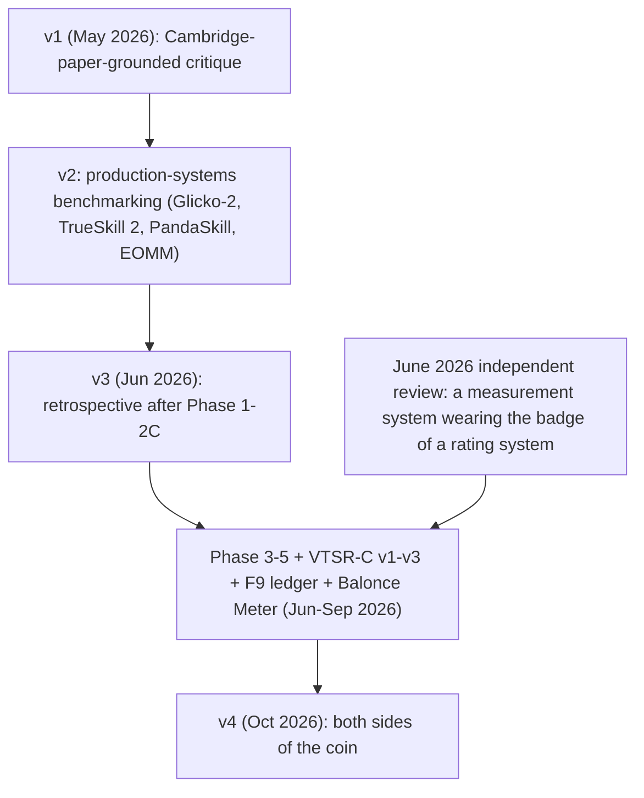
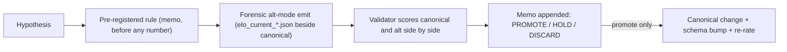

# VTSR Analysis v4: Both Sides of the Coin

> The fourth review of the VT Stats rating system. v1 read VTSR-T against one academic paper; v2 benchmarked it against production systems; v3 was the retrospective after the first round of pre-registered experiments. v4 is written at roughly twice v3's corpus and asks the question the community is actually asking: is a performance-based thug rating plus an outcome-based commander rating the right design for a 20-to-25-player Battlezone league, or should the ratings be split by faction, by role, or by ship? Parts I–VIII are the record; every number in them is regenerable. Part IX is the bibliography. Part X is the author's own view.
>
> **How this document was produced.** It was drafted with an AI assistant, as the previous three were. Every corpus number in it comes from `python scripts/validate_elo.py` (validator v1.8, sections §1–§20) run against the committed `data/processed/*.json` on 2026-10-04, and anyone with the repository can regenerate every one of them with that single command [77]. Every design change discussed here is governed by a rule that was written down before the numbers that judge it existed (the memos in `critique/decisions/`) [79]. Several proposals that the tooling itself drafted have been tested under those rules and refuted; §2.3 lists them.

## TL;DR

- **The corpus roughly doubled since v3.** 228 recorded matches, 193 rated, 45 rated players; 170 rated matches with a determined winner; plus F9bomber's 505 community duels, giving the commander ladder 675 scored duels [76].
- **The headline metrics moved the right way as the corpus grew.** Spearman ρ (pre-match rating → in-match performance) 0.462 → **0.495**; split-half self-consistency 0.804 → **0.888**; calibration MAE 0.018 → **0.009**; winner prediction from team mean rating 43% (n=30) → **58.6%** (n=169); VTSR-C duel prediction 56% → **65.4%** (n=675) [77]. Mean rating now beats hard-MAX aggregation at prediction time, reversing the v3-era preview.
- **The complaint is real and now has numbers.** The composite rating and the win/loss ladder agree only weakly (Spearman **0.38** across the 24 players with ≥20 matches). A thug's team result explains **21%** of the variance in their per-match score; a thug rated ≥1650 on a losing team drops rating **76%** of the time even though they typically still out-perform the lobby. Time spent on foot at base — waiting for a ship — tracks rating loss monotonically (−0.48 Spearman). Two axes carrying 31% of the composite weight (`thug_efficiency`, `thug_accuracy`) point the *wrong* way relative to winning (sign agreement 0.39) [77 §15–§17, §11].
- **Faction is not neutral.** After controlling for both commanders' ratings and both squads' mean VTSR-T, Hadean sides win more than expected: **+0.357 logit (z 2.27), about +62 rating points** on the commander ladder's scale; Scion and ISDF are indistinguishable. The pick share of Hadean has tripled in a year [77 §19]. This is the one place v4 pre-registers a candidate change — a faction-advantage term in the VTSR-C expected score, judged only on games played after this document was written [79].
- **Faction-, role-, and ship-based ladders are not the fix.** Each is argued for and against below with the industry's own record: Blizzard added per-race MMR to a 1v1 ladder with millions of players [36]; Valve split Dota 2 into Core/Support MMR and merged it back into one rating with role handicaps seven months later [38][40]; Riot tested positional ranks and cancelled them after satisfaction fell 20–30 points [42]; Overwatch kept per-role SR because the role is declared and locked before the match [44]. For a 45-player league where the commander picks the faction and a thug's role is set by the ship and weapon they are handed, the designs that survive are a matchup-level faction term, a better-calibrated commander adjustment, and display-only faction and ship profiles.
- **Matchmaking is a bigger lever than rating math.** Commanders sit at the middle of their lobby by VTSR-T (median percentile 0.44), the job is concentrated (four players hold 37% of commander rows), and the two most frequent commanders hold the two lowest VTSR-C ratings. No ladder change fixes a volunteer shortage; the Balonce Meter and team-formation norms are the tools for that [77 §18].
- **"Include all games regardless of size" is half right.** The 23 excluded small-format games (1v1/2v2, 15 with a known winner) are real games whose dynamics measurably differ (a third more kills and damage per player-minute, more structure-shooting, longer); full-format thug ratings predict their winners 10/15 while the commander ladder manages 8/15. The composite cannot score them at all — a two-row lobby z-score is ±0.5 by construction — but the wins ladder can, and the industry's answer to a different format is a separate ladder, never a mix [77 §20]. Verdict: do not throw them away; do not mix them into the composite; record them separately first.
- **One canonical change proposed, zero shipped.** Everything in this document is descriptive until a pre-registered rule passes on data that did not exist when the rule was written.

## Reading guide

- **Part I** — what the system is today and what changed since v3, including the provenance map (§1.4) showing where each mechanism comes from.
- **Part II** — the validation record, how a number becomes a rule here (§2.3), and why the industry's own disagreements matter (§2.4).
- **Part III** — the complaint, quantified: six findings, each tied to its validator section.
- **Part IV** — the steelman: why the current design is defensible.
- **Part V** — the proposals, both sides: faction-based, role-based, by-ship, and "include all games regardless of size".
- **Part VI** — matchmaking and the volunteer-commander problem.
- **Part VII** — the FPS+RTS lens.
- **Part VIII** — roadmap and the do-not-do list.
- **Part IX** — Sources Cited. Inline `[n]` keys throughout refer to this list; the plain edition and the web page use the same numbering.
- **Part X** — author's perspective.

### Lineage

---

## Part I — Current state

### 1.1 Corpus

| Quantity | Value | Source |
|---|---|---|
| Recorded matches | 228 (2026-04-16 → 2026-10-04) | `matches.json` [76] |
| Rated matches (≥6 non-campod rows, ≥240 s, not cancelled/void) | 193 | `elo_current.json` |
| Rated matches with a determined winner (wins ladder / VTSR-C) | 170 | `elo_current.json` `wins_matches_rated` |
| Outcome provenance across all 228 | attested 96 · adjudicated 51 · clean_win 37 · unclear 39 · cancelled 3 · contested 1 · draw 1 | `matches.json` |
| Rated players | 45 (46 display names; one alias merged) | `elo_current.json` |
| Row exclusions | campod 41 · low-activity 20 · zero-damage 54 | `elo_current.json` |
| F9bomber community duels on the commander ladder | 505 (of 506 imported; 1 runtime overlap skip) | `elo_commander_current.json` |
| VTSR-C duels total | 675 (170 telemetry + 505 F9) | `elo_commander_history.json` |
| Mean / spread of published VTSR-T | 1543 / σ 100 | `validation_summary.json` |

### 1.2 Canonical VTSR-T (schema 14) and VTSR-C (schema 10)

VTSR-T — the thug rating, `scripts/elo.py` [77]:

| Component | Value |
|---|---|
| Update | `ΔR = K · 2.5 · (P_i − E_i)`; `E_i` = logistic (scale 800) on `R_i − median(R_others)` |
| `P_i` | 8-axis lobby z-score composite, each axis `clip(z, ±2)/2`, weights renormalized over present axes |
| Weights | `net_damage_share` .20 · `thug_kill_rate` .20 · `thug_efficiency` .16 · `thug_accuracy` .15 · `pve_share` .12 · `mobility` .08 · `snipe_bonus` .005 · `target_lock_pct` .005 |
| K | `40·(1 − n/(n+10)) + 12` plus inactivity boost `min(20, 0.05·days)` |
| Loss aversion / floor | losses ×0.85; soft floor 1000 with 150-pt taper |
| Commander adjustment (v2.4) | per-axis post-clip shift: 4 audit-derived priors on a shrunk rolling baseline (shrinkage 30); `target_lock_pct` −0.10 and `pve_share` −0.05 locked |
| Low-tier at-base lift (v2.8) | `thug_kill_rate` recomputed over non-at-base time for rows whose canonical rating is below 1460 (60-pt taper); 12 players eligible today |
| Wins ladder R^W (Stage E) | real, updated on 170 determined matches, K 24→12, team-mean logistic scale 400; blended at `ALPHA = 0.0` — inert in the published number |
| Inputs corrected since v3 | v11 death-tick position guard · v12 idle-thug omission · v13 terminal bench · v14 six-player gate counts non-campod rows |
| Ladder display gates | ranked `#` at ≥25 matches; 90-day inactivity → Unranked; 3-game comeback |

VTSR-C — the commander rating, `scripts/elo_commander.py` [77]:

| Component | Value |
|---|---|
| Update | classic zero-sum Elo between the two commanders of every determined rated match; K 40→20 over 5 duels; scale 400; no floor |
| Expected score | `E_A = 1/(1 + 10^(−((R_A−R_B) + λ(T_A−T_B))/400))`, `T` = mean pre-match VTSR-T of each side's non-commander rated rows, `λ = 1.0` |
| External duels | F9bomber ledger, full K, day-precision interleave, `source: "f9"` provenance |
| Economy composite (v2) | three opening-window axes recorded on telemetry duels; blended at `α_c = 1.0` — inert |
| Ladder display gates | ranked `#` at ≥8 telemetry duels OR ≥25 older duels; 90-day activity + 90-day command-recency clocks |

### 1.3 What changed since v3

Shipped (all memo-gated, all additive):

| Change | Where | Record |
|---|---|---|
| Wins ladder R^W machinery, inert at ALPHA 0 | `scripts/elo.py` | `phase-5-wins-blend.md` [79] |
| F9bomber ledger import → VTSR-C v3 | `scripts/import_f9_ledger.py`, `elo_commander.py` | `f9-external-duels.md` |
| 50 outcome adjudications applied mechanically from F9 pairings (six gates) | `data/match_outcome_adjudications.json` | `f9-external-duels.md` addendum |
| VTSR-C economy composite (v2) + 2026-09-23 opening-semantics amendment, inert at α_c 1 | `elo_commander.py` | `vtsr-c-v2-composite.md` |
| Ranked-ladder eligibility (25 / 8-or-25) and 90-day inactivity, display-only | both ladders | `vtsr-t-ladder-eligibility.md`, `vtsr-c-ladder-eligibility.md`, `vtsr-inactivity-threshold.md` |
| Balonce Meter — one shared win-probability formula for Tools and the Outcome card | `js/balonce-meter.js` | `balonce-meter-t-term.md` |
| Input corrections v11–v14 (rating moves ≤ ~1 ELO each; comparability notes in `elo.py`) | `process_stats.py` | `scripts/elo.py` header |
| Validator v1.3–v1.8 (§10–§20) | `scripts/validate_elo.py` | this document |

Tested and NOT shipped since v3 (each by a rule registered before the numbers):

| Proposal | Verdict | Record |
|---|---|---|
| ALPHA ∈ {0.10, 0.25, 0.50} wins blend (twice, 39 wins-rated matches) | HOLD — accuracy and log-loss flat; ρ and self-consistency improve monotonically | `phase-5-wins-blend.md` |
| Rank-based lobby scoring (three re-evaluations) | HOLD — self-consistency up, bootstrap σ worse | `phase-3-rank-scoring.md` |
| Converged (whole-history) re-rating | STOP — hypothesis not supported; implementation reverted | `phase-4-converged-rerating.md` |
| VTSR-C economy composite α_c < 1 (26 confirmation duels) | HOLD — no axis clears the 0.55 Wilson lower bound; best log-loss gain 0.0084 < 0.01 | `vtsr-c-v2-composite.md`, validator §12b |
| Balonce T-term variants: commander VTSR-T in the handicap, softmax / hard-MAX thug aggregation | HOLD / DISCARD — softmax degrades monotonically (−2.5 to −11.7 pp); roadmap §13.1 closed negative | `balonce-meter-t-term.md` |

### 1.4 Provenance map — where each mechanism comes from

Nothing in the VTSR design is invented here except the eight axis definitions and their weights. Every other mechanism is lifted from a shipped production system or a peer-reviewed method, and those two local inventions are exactly what Parts II–III put under test.

| VTSR mechanism | Same idea, elsewhere |
|---|---|
| Logistic expected score around a 1500 anchor; rating differences as win odds | Elo's chess system [1]; the Bradley–Terry paired-comparison model it approximates [2] |
| K that falls with games played and rises with inactivity | Rating deviation in Glicko and Glicko-2 [4][5], used by Lichess and (in Glickman's own formulation) by US Chess [7] |
| Rating from in-match statistics, not only win/loss | TrueSkill 2 (Microsoft Research + The Coalition) models kills, deaths, quits and squads and lifted Halo 5 outcome prediction from 52% to 68% [9]; HLTV Rating 2.0 is the Counter-Strike scene's standard composite of kills, deaths, damage, KAST and impact [23]; PandaSkill (PandaScore) rates professional League of Legends from per-role performance models [27] |
| Lobby-relative scoring (every player measured against the room they played in) | Elo-MMR for massive multiplayer contests, where a round is a ranking of everyone present [13]; PandaSkill's free-for-all OpenSkill update on performance scores [27][11] |
| Separate commander and thug ladders | AllegSkill on Microsoft Research's Allegiance: TrueSkill with "separate skill ratings for commanders and pilots" [50]; Natural Selection 2's Hive Skill 3.0, which substitutes a commander skill for the player skill while the player is in the chair [58] |
| Commander role adjustment (axis shifts so a commander is judged against a commander baseline) | The positional adjustment in baseball WAR, which adds or subtracts runs so a catcher and a first baseman can share one scale [19][20] |
| Team-strength handicap inside the expected score | The within-pair order effect of Davidson & Beaver — home advantage, the first move in chess — added to the Bradley–Terry log-odds [3]; Aligulac's matchup-constrained ratings for StarCraft II [48] |
| Exclusion of camera-pod spectators, partial-presence rows and idle rows | TrueSkill 2's explicit modelling of quitting and partial participation [9]; Hive 2.0's proportional credit for players who switch teams mid-round [60] |
| A zero-sum win/loss ladder beside the performance ladder | Classic Elo for the ladder itself [1]; the two-ladder structure of AllegSkill [50] and Hive 3.0 [58] |
| Validation by out-of-sample prediction accuracy and log-loss | The Cambridge *Skill Issues* benchmark [31]; TrueSkill 2's own 52→68% test [9]; Coulom's WHR evaluation [12] |
| Rules registered before the data that judges them | Registered Reports in the sciences: designs and analysis plans fixed before results are known [74][75] |
| Incentive-compatibility as a design constraint (a player who wants rating should never want to underperform) | Elo-MMR's monotonicity guarantee [13]; Bodwin & Zhang on opponent indifference [14] |

---

## Part II — Validation state

### 2.1 Headline metrics, v3 → v4

| Metric | v3 (n=100, Jun 2026) | v4 (n=193, Oct 2026) | Reading |
|---|---|---|---|
| Spearman ρ, pre-match R → in-match P (pooled) | 0.462 | **0.495** (per-match mean 0.479) | rating predicts performance a little better with twice the data |
| Self-consistency ρ (split-half P, ≥10 matches) | 0.804 | **0.888** | the composite measures something persistent |
| Calibration MAE (bucketed R-gap vs E) | 0.018 | **0.009** | predictions match observation within 1 pp |
| Bootstrap top-20 Jaccard / rating-proxy σ | 0.826 / 27 | 0.832 / **33** | ladder stable; σ is the honest ± on a rating |
| Synthetic-winner agreement vs determined winners | 93.3% (n=30) | **94.1%** (n=169) | team mean P picks the actual winner 94% of the time |
| Winner prediction from team mean R | 43.3% (n=30) | **58.6%** (CI 51.0–65.7, n=169) | now in the Cambridge 60–64% neighbourhood [31] |
| Winner prediction from team hard-MAX R | 53.3% | 55.0% | the v3 Phase 2A lift did not survive corpus growth |
| Log-loss (mean R) | 0.701 | 0.683 | below the 0.693 coin-flip line |
| VTSR-C duel prediction | ~56–57% (n≈70, telemetry only) | **65.4%** (CI 61.8–69.0, n=675), log-loss 0.624 | λ ablation: 0 → 63.9%, 0.5 → 64.2%, **1.0 → 65.4%**, 1.5 → 65.1% |
| Rating-gap breakout (mean R) | 0 matches with gap > 100 | small 56.5% (n=85) · mid 58.8% (n=80) · large **100%** (n=4) | the first lopsided matches exist and were all called |

Trend (validator history in `validation_summary.json`): winner prediction climbed 37.5% (n=32, 23 Aug) → 42.5% → 50.0% → 54.7% → 55.5% (n=137 after the F9 pairing adjudications, 20 Sep) → 58.6% (n=169, 4 Oct); VTSR-C 56.1% → 57.1% → 63.1% → 66.2% → 65.4% over the same window [76]. The direction v3 §13.3 predicted is the direction the numbers took.

### 2.2 What the validator still cannot see

- **Lopsided matches** are no longer zero but are four. 4/4 is encouraging and statistically nothing.
- **Recent form** on the hard-MAX aggregation is 43% over the last 30 determined matches (mean-R 70% on the same window) — the two aggregations disagree most on exactly the recent, mostly-balanced games.
- **The wins ladder is still inert**, so the published rating cannot be scored as a win predictor except through the forensic ALPHA pairs.
- **Economy telemetry** covers 100 of 228 matches (proto v4 onward), so VTSR-C's economy axes are judged on 83 duels, 26 of them confirmation.

### 2.3 How a number becomes a rule here

Every proposal since v2 has gone through this sequence. The tally:

| Outcome | Proposals |
|---|---|
| **Shipped** | inactivity K-boost (v2 §7.1); row-exclusion gates v2.5–v2.10; wins-ladder machinery (inert); F9 import; VTSR-C economy machinery (inert); ladder eligibility and inactivity display gates; Balonce Meter formula (the validated VTSR-C formula, no new math) |
| **Held** | ALPHA wins blend ×2; rank scoring ×3; VTSR-C α_c; Balonce commander-VTSR-T term; Phase 6 faction term (this document, not yet testable) |
| **Refuted / stopped** | hard-MAX opponent reference (Spearman 0.46 → 0.19, +522 mean drift); softmax opponent reference; unlocked commander priors (effect below the noise floor); converged re-rating; softmax / hard-MAX thug aggregation in the handicap (−2.5 to −11.7 pp) |

Several entries in the held and refuted rows were drafted by automated reviewers — the v2 production-systems critique's MAX-reference and unlock-the-priors proposals, the June 2026 review's rank-scoring proposal, and this document's own exploratory faction fit — and each went through the same gate as a proposal from the core developer. The record shows the data overruling the tooling. That is the point of the gate.

### 2.4 The industry has not converged either

The questions Part V takes up are not settled anywhere. Valve split Dota 2's rating into Core and Support MMR in August 2019 [38] and replaced that with a single rating plus five per-role handicaps in March 2020 [40]. Riot built positional ranks for League of Legends, previewed them in two regions in 2019, and ended the preview after satisfaction with the feature fell by 20 to 30 points [41][42][43]. Blizzard kept separate per-role ratings in Overwatch because the role is chosen and locked before a match begins [44], and added per-race MMR to StarCraft II six years after launch, at players' request, for a 1v1 ladder [36]. Unknown Worlds' community developers said in 2016 that separate team and commander skills had been "scrapped because there is no good way to implement any of it" [61]; four years later the same community shipped exactly that as Hive Skill 3.0 [58][59]. Professionals iterate on evidence; this document does the same thing in public, with the evidence attached.

---

## Part III — The complaint, quantified

The community's reading of VTSR-T is that it is a raw performance meter that punishes strong thugs for things their commander or their team did. Each finding below is a validator section; none of them is an opinion.

### 3.1 The performance ladder and the wins ladder disagree (§15)

Across the 24 players with ≥20 rated matches, the published composite (`thug_elo`) and the inert win/loss ladder (`wins_elo`) correlate at **Spearman 0.381** (Pearson 0.425). The gap `thug_elo − wins_elo` averages +79 with a standard deviation of 99 and runs from −70 to +258:

| Player | thug_elo | wins_elo | gap | commander share | W–L |
|---|---|---|---|---|---|
| Domakus | 1760 | 1501 | +258 | 18% | 37–37 |
| VTrider | 1796 | 1555 | +242 | 16% | 56–44 |
| Cloaket | 1630 | 1393 | +237 | 44% | 16–34 |
| Snake | 1700 | 1519 | +181 | 53% | 21–18 |
| Muffin | 1766 | 1588 | +178 | 15% | 28–14 |
| Nomad | 1635 | 1459 | +176 | 11% | 57–66 |
| … | | | | | |
| HappyOtter | 1480 | 1493 | −13 | 12% | 22–26 |
| Monkey | 1416 | 1461 | −45 | 9% | 7–12 |
| dd | 1447 | 1508 | −61 | 20% | 10–10 |
| judgeguns | 1444 | 1505 | −61 | 2% | 40–38 |
| Totokomo | 1455 | 1518 | −63 | 7% | 12–9 |
| DraconisMarch | 1387 | 1457 | −70 | 35% | 10–16 |

Two readings are available and both are partly right. One: the composite is measuring individual fighting and the wins ladder is measuring who got put on good teams — Domakus at 37–37 with a +258 gap is a strong player on even teams, which is what a balancer is supposed to produce. Two: the composite rewards things that do not win, and the players who win more than they "perform" (judgeguns, Totokomo, dd) are doing something the eight axes do not see. §3.4 shows which axes are responsible for the second reading. The correlation between a player's commander share and their gap is 0.16 — commanding is not what drives the divergence.

This is the oldest tension in sports analytics: a box-score composite (PER [18], HLTV 2.0 [23]) against a plus-minus impact measure (APM, RAPM [15][16]). Composites reward recorded production and miss defence and spacing; plus-minus captures impact but is noisy and contaminated by teammates [17]. Neither side of that debate won; the field uses both.

### 3.2 A thug's rating moves with the team result (§16)

Among 1,084 determined thug rows: winners average `P` +0.136 and Δ +7.6; losers average −0.096 and −5.6. Only **27%** of winning thugs lose rating and only **24%** of losing thugs gain it. Win/loss alone explains **η² = 0.21** of the variance in thug `P`.

For thugs rated ≥1650 the picture is sharper: those on losing teams still post a positive mean `P` of **+0.098** — they out-performed the lobby — and still drop a mean **−6.5**, with 76% of them losing rating, because their expectation `E` was higher. That is the mechanism behind "it feels brutal": the rating does not fine a strong thug for losing, it fines them for not out-performing the lobby by as much as their rating said they would, and a lost game makes that bar hard to clear.

Commanders show the same shape (η² 0.29, winners +8.9 / losers −5.2).

### 3.3 Time on foot at base tracks rating loss (§17)

Positioning gives each thug's `at_base_pilot_share` — the fraction of the match spent on foot inside their own base radius, which in practice is time waiting for a ship. Banding 1,084 determined thug rows:

| at-base share | n | mean Δ | mean P | team win share | Δ when the team won | Δ when the team lost |
|---|---|---|---|---|---|---|
| <5% | 248 | +8.95 | +0.197 | 79% | +11.8 (n=196) | −2.0 (n=52) |
| 5–15% | 459 | +2.48 | +0.060 | 55% | +6.8 (n=251) | −2.7 (n=208) |
| 15–30% | 298 | −4.51 | −0.112 | 29% | +1.6 (n=86) | −7.0 (n=212) |
| ≥30% | 79 | **−11.41** | −0.263 | 13% | −2.7 (n=10) | −12.7 (n=69) |

Spearman(share, Δ) = −0.48. The gradient survives inside a fixed outcome: among losers, −2.0 at <5% versus −12.7 at ≥30%. The confound is stated plainly in the validator and repeated here: ships go unreplaced more often on losing teams, so this mixes commander supply with team outcome. What it establishes is that the ship-denial complaint is not imaginary — a thug who spends a third of the match on foot at base loses eleven points on average — and that the v2.8 low-tier lift, which only applies below 1460, does not reach most of these rows (mean pre-match rating in the ≥30% band is 1499).

### 3.4 Two core axes point the wrong way (§11)

Across 170 determined matches, the team-mean axis contribution of the winner minus the loser agrees in sign with the outcome:

| Axis | weight | sign agreement | 95% CI |
|---|---|---|---|
| `net_damage_share` | .20 | **0.882** | 0.825–0.923 |
| `mobility` | .08 | **0.882** | 0.825–0.923 |
| `thug_kill_rate` | .20 | 0.856 | 0.799–0.903 |
| `pve_share` | .12 | 0.788 | 0.721–0.843 |
| `target_lock_pct` | .005 | 0.422 | 0.349–0.498 |
| `thug_efficiency` | .16 | **0.394** | 0.324–0.469 |
| `thug_accuracy` | .15 | **0.394** | 0.323–0.470 |
| `snipe_bonus` | .005 | 0.224 | 0.111–0.363 |

Winning teams have, on average, *lower* lobby-relative efficiency and accuracy than losing teams, and the two axes carry 31% of the composite weight. Several mechanisms are plausible — winners shoot more at structures and AI, which dilutes accuracy; losers get fewer kills from more damage because they are fighting through repairs and reinforcements; efficiency and accuracy measure a style of fighting more than its result. Whatever the cause, these are the axes the "utility versus hunter" discussion in Part V should be about: `pve_share` agrees with winning at 0.79, so utility work is already rewarded; the axes that reward *clean* fighting over *effective* fighting are the ones that disagree with the result.

### 3.5 Who commands, and what commanding does to a rating (§18)

Commanders sit at the **48th percentile** of their own lobby by pre-match VTSR-T on average (median 0.44, where 0 is the top) and below their own team's thug mean in **52%** of 386 team-sides. The data does not say the weakest players command; it says the middle does. The job is concentrated: 33 distinct commanders, with the top four (Sev 42, Lithium 36, F9bomber 34, Darkvale 32 rated rows) holding 37% of all commander rows.

The v2.4 role adjustment audit: commander rows gain **+2.07 per match** against **+0.93** for thug rows. Per player, with ≥5 rows in both roles:

| Player | Δ as commander (n) | Δ as thug (n) |
|---|---|---|
| Muffin | **+14.50** (7) | +4.12 (40) |
| blue | **+11.31** (14) | −4.38 (9) |
| Snake | **+8.38** (26) | −0.76 (23) |
| Domakus | +7.09 (16) | +2.03 (72) |
| Cloaket | +6.82 (25) | −1.27 (32) |
| Sev | +3.31 (42) | −0.72 (68) |
| F9bomber | −0.31 (34) | +1.21 (105) |
| Darkvale | −0.95 (32) | +0.82 (73) |
| Lithium | **−4.02** (36) | +3.04 (67) |
| Cyber | −4.92 (6) | +8.43 (22) |
| DraconisMarch | **−5.57** (9) | −3.70 (17) |

The shift is calibrated to the *average* commander's shortfall on each axis (its priors now sit at mobility −0.34, kill rate −0.05, net damage −0.05 after 386 rows). A strong fighter who commands clears that bar easily and harvests rating; a weaker one does not and still bleeds. That is the known failure mode of any positional adjustment that uses a population baseline instead of the player's own [19][21], and it is what a role-adjusted VTSR-T should fix before anyone proposes a separate role ladder (Part V §5.2).

### 3.6 Faction is not neutral (§19)

Raw non-mirror records: Hadean beats ISDF **64.8%** (79–43, n=122) and Scion **57.9%** (62–45, n=107); Scion versus ISDF is 49.2% (87–90, n=177). Across all 675 duels Hadean sides win 59.8% of the time versus 47.8% for ISDF and 47.0% for Scion.

Controlling for the ratings — the canonical expected score (commander gap plus the thug handicap) held fixed as a logistic offset — the Hadean-vs-ISDF contrast is **+0.357 logit (SE 0.157, z 2.27, p 0.023)**, which is **+62 rating points** on the commander ladder's 400 scale: a Hadean side plays as if its commander were 62 points stronger. Scion-vs-ISDF is −0.010 (z −0.08). The likelihood-ratio test for the pair is χ² 6.44 (p 0.040); log-loss on non-mirror duels improves 0.6179 → 0.6099; accuracy is unchanged at 66.5%. The sign is the same in both sources (telemetry +0.31, F9 +0.35); neither is significant alone.

Two caveats that the Phase 6 memo turns into rules [79]. Commanders fielding Hadean are slightly higher rated (1513 pre-duel VTSR-C vs 1489 / 1487) — the regression already removes that, but it shows selection is real. And the pick share of Hadean has risen from roughly 10% of team-sides in late 2025 to 37–38% in September–October 2026 — the community has noticed something, and a community that believes a faction is strong will produce a win rate for it that is part belief. That is why the fit above is treated as discovery and the frozen +60 candidate is judged only on games played after 2026-10-04.

---

## Part IV — Why the current design is defensible

The complaint is real. So is the case for the design as it stands.

**It measures something persistent.** Split-half self-consistency of 0.888 means a player's lobby-relative composite in one half of their career predicts the other half very well. No rating built on noise would do that. The eight axes are doing real measurement work, and rating from per-match statistics rather than only win/loss is exactly the move TrueSkill 2 made to lift Halo 5 prediction from 52% to 68% [9].

**It is calibrated.** When the system says a player should out-perform their lobby by X, they do, within a percentage point on average (MAE 0.009). That is the property that lets the Balonce Meter print a probability with a straight face.

**It predicts, and the prediction improved with data.** 58.6% winner prediction from team mean rating, with a log-loss below coin-flip, on a corpus whose lopsided matches can be counted on one hand. The Cambridge benchmark's best win/loss-only system reached 64.1% on ten thousand professional CS:GO matches [31]; this system is in that neighbourhood on under two hundred. VTSR-C's 65.4% over 675 duels is above that bar.

**Separate commander and thug ratings are the genre's own answer.** The two hybrid FPS/RTS communities that shipped public skill systems both landed there: AllegSkill, built on TrueSkill in a game from the lab that invented TrueSkill, "realises that whether a team wins or loses is highly dependant on the skill of both the commanders and their team … Consequently there are separate skill ratings for commanders and pilots" [50]; Natural Selection 2's Hive Skill 3.0 substitutes a commander skill for the player skill while the player is in the chair, so that "if you're a high ranked player, and are in the command chair, you will no longer be expected to carry to avoid losing skill" [58]. VTSR reached the same architecture independently and earlier in its own corpus.

**The handicap term is validated, not assumed.** λ = 1.0 was ablated against 0, 0.5 and 1.5: it is the most accurate of the four (65.4% against 63.9% at λ = 0) and ties λ = 1.5 on log-loss [77 §10]. The Balonce Meter prints the formula the number was earned on.

**The exclusion gates do real work.** Camera-pod spectators, partial-presence rows, zero-damage idlers and terminal benches are omitted rather than penalized — the same instinct as TrueSkill 2's quit modelling [9] — and the bootstrap stability (top-20 Jaccard 0.83) is what it is partly because the rating is not trying to learn from rows that carry no signal.

**The composite's wrong-way axes are visible because the system measures them.** A pure win/loss ladder would never have shown that efficiency and accuracy anti-correlate with winning; a composite with a validator does, and can be re-weighted under a rule.

**The process is the strongest part.** Three structural reforms that looked compelling on paper — MAX as the opponent reference, unlocking the commander priors, converged re-rating — were tested and refuted before they touched a published number. The refuted list is longer than the shipped list. A system that mostly says no to its own authors is behaving the way a measurement system should.

---

## Part V — The proposals, both sides

### 5.1 Faction-based rating

**The case for.** Faction asymmetry is real in this corpus (§3.6), and a rating that ignores it mis-prices every mixed-faction lobby by about 60 points. Skill is partly faction-specific — build orders, unit timings, the feel of the ships — and a player who is excellent on ISDF and learning Hadean is two different players for prediction purposes. The StarCraft II precedent is exactly this: Blizzard added separate MMR per race in Patch 3.7 (2016) because "many people want to experience the ladder as other races without affecting the rank and MMR of their 'main' race," seeding each off-race from the main-race MMR with high uncertainty and requiring five placements per race [36][37]. Aligulac has rated professional StarCraft II with per-matchup ratings since the game's early years, constrained so the overall rating is the mean of the three matchup ratings [48][49]. And the one hybrid that shipped a faction-aware skill system, NS2, did it for truly asymmetric sides (marines vs aliens) [58].

**The case against.** The SC2 ladder is 1v1, the player chooses their own race, and the population is millions. In BZCC the commander picks the faction for the whole team in the lobby, so a thug's "faction" is a choice someone else made, and the league has 45 rated players. Splitting their histories three ways gives **111 player-faction cells with a median of 8 matches**; only 51 cells reach 10 matches, only 26 reach the 25-match ranked bar, and only 11 players have ≥10 matches on all three factions [77]. Three per-player ladders would be provisional for most of the league most of the time — precisely the dilution Glickman warns about when a rating pool is small and games are split across sub-pools [6]. Worse, VTSR-T's `P_i` is lobby-relative: both teams' faction effects sit in the same lobby and cancel, so a faction axis in the thug composite would measure nothing (the position recorded in `ideas.txt` in June: "faction balance is a META property, not a player-skill property" [81]). Faction-split thug ladders would also hand a thug a rating consequence for a commander's lobby decision.

**Designs, ranked.**

1. **Three per-player ladders (SC2 style)** — rejected for this league on the arithmetic above. The precedent does not transfer: different format, different chooser, three orders of magnitude more players.
2. **Per-player faction offset (NS2 "average skill + team bias" [58][62], or Aligulac's mean-constrained matchup ratings [48])** — the right design *if* per-player faction skill is ever wanted, because it keeps one converging rating and learns a small bias on top with shrinkage. Viable later, display-first: a "faction profile" card on the player page (win rate and mean Δ by faction) costs nothing and tells the community whether per-player faction skill is even a thing before anyone rates it.
3. **A global faction-advantage term in the VTSR-C expected score** — the recommendation, and the only item v4 pre-registers. It is the Bradley–Terry order effect [3]: the same device chess models use for the first-move advantage, applied to the matchup rather than to either player. It leaves every player's measurement alone, corrects the Balonce Meter's probability on mixed lobbies, and makes a commander who always picks the strong faction earn slightly less per win. The memo freezes `+60 Hadean / 0 Scion / 0 ISDF` from the discovery fit and judges it on ≥60 confirmation duels by out-of-sample log-loss, accuracy and sign stability [79]. Verdict today: not yet testable.
4. **A faction axis or shift in VTSR-T** — rejected; lobby-relative scoring makes it meaningless and it penalizes thugs for a commander's choice.

**Where the two sides agree.** Faction imbalance should be measured and displayed. The faction matchup table (§3.6) and the pick-share trend belong on the All Matches → Meta tab regardless of any rating decision.

### 5.2 Role-based rating

**The case for.** Thugs do different jobs. One hunts scavengers and defends pools; another hunts players. A composite weighted toward kills and damage will rate the hunter above the utility player even when the utility player's team wins more. Dota 2 [38][40], League of Legends [41] and Overwatch [44] all built per-role or role-adjusted ratings because a single number across roles was felt to be unfair; PandaSkill models every League role independently "ensuring a fair comparison between them" [27]; Chen et al. decompose MOBA skill into player, hero and player-hero-specific components and find all three matter in League [28]. Our own commander adjustment is a role adjustment, and §3.5 shows it is miscalibrated.

**The case against.** Every shipped role rating that lasted has one property: the role is **declared and locked before the match**. Overwatch's role SR survived because you queue as tank, damage or support and cannot switch [44][45]. Dota 2's Core/Support MMR lasted seven months and was replaced with one rating plus per-role handicaps, because, in Valve's words, the new system "replaces the Core/Support separation with a single rank" [40]. Riot's positional ranks lasted one preview: "a significant number of you are still frustrated with the grindiness, low satisfaction of off-position games, and teammates not taking off-position games seriously enough … we've seen a dramatic negative shift — by 20 to 30% — in satisfaction" [42]. In BZCC a thug's role is not declared; it emerges from the ship and weapon the commander hands out and changes as the match changes — a Xypos with a burst gun should be on pools, the same Xypos with a slicer should be hunting [80]. A role that is *inferred* from behaviour is a rating a player can choose, and a rating a player can choose is a rating a player will game: the proxy becomes the target [70][71][73], and the system stops being incentive-compatible in Elo-MMR's sense [13].

The data also says the premise is only half right. `pve_share` agrees with winning at 0.79 and sits at weight 0.12 — utility work is already credited. What the composite over-credits is *clean* fighting: `thug_efficiency` and `thug_accuracy` disagree with winning (§3.4). The fix for that is a weights question, not a ladder question.

**Designs, ranked.**

1. **Separate inferred-role ladders ("utility VTSR", "hunter VTSR")** — rejected. Inference is gameable, roles are fluid, and the one studio that tried role ranks without locked roles cancelled them.
2. **Role as a declared, pre-match input** — not available in this game's telemetry; nothing in the protocol records an assignment, and nothing in the lobby makes one.
3. **Recalibrate the commander adjustment to the player's own thug baseline** — the WAR analogy made honest [19][20]: judge a commander's shortfall against *their* thug numbers, not the average commander's. Forensic alt mode first, pre-registered rule, same gate as everything else. This is Phase 7 candidate (a).
4. **Re-weight the composite toward win-agreeing axes** — move weight off `thug_efficiency` and `thug_accuracy` toward `net_damage_share`, `thug_kill_rate`, `pve_share`. v3 §13.4 declined this because the Dirichlet test showed small perturbations do not change rankings; §3.4 is a different argument — not that the weights are fragile but that two of them point the wrong way. Phase 7 candidate (b), with the sign-agreement study as the pre-registered judge and a hold-out of future matches.
5. **A ship-denied-time adjustment for all tiers** — generalize the v2.8 lift so that time on foot at base is removed from every thug's denominators, not only the low tier's. Phase 7 candidate (c); the §17 per-outcome split is the diagnostic that says whether it is doing anything beyond the team result.
6. **Display-only role descriptors** — a playstyle label (pools / hunter / mixed) from damage mix, shown on the profile. No rating consequence, so no incentive problem, and it gives the community vocabulary.

### 5.3 By-ship rating

**The case for.** Ships are the unit of skill expression in a tank game; a player who is deadly in a Scout and lost in an Assault Tank is two different fighters. Chen et al. found champion-specific skill a significant predictor in League of Legends [28].

**The case against.** The same study found the champion-specific component added little in Dota 2 [28] — it is game-dependent, not a law. In BZCC the commander builds the ship and the player takes what is available; ships change several times a match; and the per-player-ship cells are far thinner than the per-player-faction cells. Riot's champion mastery is a display-only progression for the same reason. The accuracy axis is already weapon-normalized against the lobby's per-weapon baseline, which is the part of "by-ship" that affects measurement.

**Design.** Display-only ship profile (already present as the Loadout tab's per-ship combat split); ship-normalized axis baselines as a possible future input, never a ladder.

### 5.4 Include all games regardless of size

The rating gates today: a match rates when it has at least six non-campod rows and lasts at least 240 seconds (`ELO_MIN_PLAYER_COUNT`, `ELO_MIN_DURATION_SEC`), which in practice means 3v3 and up. The proposal is to drop the size gate and rate every game. The author's own position is that 1v1 and 2v2 change the game too much to share a ladder with 3v3–5v5. Both claims are testable, and validator §20 tests them [77 §20].

**What is being left out.** 35 history entries are excluded: 27 for size, 6 for duration, 1 cancelled, 1 void. By shape the size exclusions are 1v1 ×12, 2v2 ×7, 2v1/1v2 ×4, two games with an empty side, and a 3v2 pair under the six-row bar. **23 small-format games (≤2 per side, both sides populated), 15 of them with a determined winner.** They are a recent habit — 14 of the 23 were played between 14 September and 4 October — which is why the question is being asked now, and which means the pool will grow if nothing changes.

**The dynamics do change, measurably.** Small-format games at least four minutes long (n=21) against the 193 rated full-format games:

| metric (median) | small format (≤2/side) | rated full format |
|---|---|---|
| duration | 1295 s | 968 s |
| kills per player-minute | **0.42** | 0.31 |
| deaths per player-minute | 0.16 | 0.17 |
| damage per player-minute | **2754** | 2206 |
| PvE share of damage | 0.68 | 0.60 |
| peak pools per team | 4.0 | 4.0 |

Fewer humans, more structure-shooting, longer games, a third more fighting per person. The author's premise is supported — and the axes that shift (kills, damage, PvE share) are exactly the axes the composite weights most.

**Full-format ratings transfer — partially.** For the 15 determined small-format games, reconstructing every player's pre-match rating from the rated history (ratings only move on rated appearances, so the reconstruction is exact): the side with the higher team-mean VTSR-T won **10 of 15** (66.7%, Wilson 42–85%) — the same neighbourhood as its 58.6% on full games — while the side whose leader had the higher VTSR-C won **8 of 15** (53.3%). Thug skill carries into the small format about as well as it predicts the large one; the commander ladder does not. A 1v1 is a fighting duel far more than a command duel, which is the opposite of the intuition that a 1v1 is "the purest commander test", and it is the data point that matters most for design (3) below.

**The hard constraint is statistical, not stylistic.** VTSR-T's `P_i` is a lobby z-score. With two rated rows every axis collapses to ±0.5 by construction — this is literally why the v14 gate counts non-campod rows: "a 1v1 with a camera-pod gallery used to rate" [77]. With four rows the σ estimate is noise. The composite cannot score a 1v1 or a 2v2 whatever anyone thinks of the format. The wins ladder (team-mean logistic) and VTSR-C (pairwise) are mechanically size-agnostic, so "include them" is a real option for those two ladders and not for the composite.

**The case for including.** Twenty-three games is 12% more corpus and 15 more determined outcomes in a corpus starving for them. They are real games — longer than the median rated match, with more combat per player. The people in them are disproportionately the mid- and low-tier regulars (HappyOtter, DraconisMarch, Maverick, sponge appear in nine of the fifteen) who already hold the fewest rated rows, so excluding them widens exactly the gap the 25-match ranked bar and the 90-day inactivity rule create. TrueSkill-family systems rate variable team sizes natively [8][10]. And a player who wins a 2v2 against two higher-rated opponents has demonstrated something the ladder currently refuses to see.

**The case against mixing.** The composite is undefined below about six rows. The dynamics differ in the axes the composite weights. The VTSR-C expected score assumes a thug squad behind each commander, and in a 1v1 there is none. The industry's answer to "a different format" is uniformly a *separate* ladder, never a mix: StarCraft II places players per mode — five placement games each for 1v1, 2v2, 3v3 and 4v4, with a separate rank per random-team mode and a rating per arranged team [83][84]; FIDE split rapid and blitz from classical in July 2012, with the stated rationale that "players have different levels of play depending on the speed of the game" [85]; TrueSkill 2 models skill in other game modes as correlated-but-distinct and borrows across modes rather than pooling them [9]; Overwatch 2 keeps Open Queue and Role Queue on separate competitive ranks [47]; Counter-Strike 2 keeps Wingman's 2v2 on its own skill group, independent of Premier and Competitive [86]. F9bomber's ledger import made the same call independently — 82 wrong-size and 192 uneven rows were dropped at the gate (even 3v3/4v4/5v5 only) [79].

**Designs, ranked.**

1. **Rate everything in the published VTSR-T** — rejected on the mathematics above, not on taste.
2. **Include small games in the wins ladder R^W** — mechanically sound (team-mean logistic, any team size), zero visible effect while ALPHA is 0, so a forensic alt mode is cheap; it would also let the ALPHA re-sweep run on more determined matches. Phase 7(d) candidate.
3. **1v1s as VTSR-C duels** — mechanically possible (handicap term 0, two commanders), but the 8/15 transfer says the commander ladder would be learning the wrong skill from them. Hold; if 1v1s are to be rated, they belong on a 1v1 ladder.
4. **A separate small-format record, then ladder** — the StarCraft II / FIDE / Wingman pattern and the right design if the format persists. Display-only at first (a small-format W-L and the §20 transfer numbers on the player page); a rated small-format ladder when at least 30 determined small games exist, with a rule written before that happens.
5. **A TrueSkill-2-style cross-mode prior** — seed the small-format rating from the main one with high uncertainty and let the two update with a correlation; the principled long-run version of (4) [9].

**Where the author's argument stands.** "The dynamics change too much" is supported — as *different enough to rate separately*, not as *too different to count*. The transfer test says the games carry real information about the same players. The data does not support throwing them away; it supports not mixing them into a room-relative composite calibrated on six-to-ten-player rooms. That is a narrower claim than the one the author started with, and it is the one the evidence will bear.

---

## Part VI — Matchmaking

Twenty to twenty-five active players, teams split by hand after commanders volunteer [80]. No rating design fixes that; it can only describe it honestly.

- **Who commands.** Mid-lobby players by VTSR-T (§3.5). The weakest-player story is not supported; the concentrated-load story is (four players, 37% of commander rows). The volunteer's dilemma is the textbook description — a collective good supplied by whoever is willing to pay its cost, with every incentive to let someone else do it [69].
- **Commander records bend under that load.** The two most frequent commanders hold the two lowest VTSR-C ratings (Lithium 1289 over 135 duels, Darkvale 1311 over 107), while F9bomber's community ledger records Lithium at 26–77 as commander [76]. Whether that is skill or the burden of commanding every time nobody else will is not something a win/loss ladder can tell apart — which is the argument for displaying the burden (games commanded, share of the team's commander rows) beside the rating.
- **Fairness is not the only objective, and the literature says so.** Engagement-optimized matchmaking research shows equal-skill pairing is a special case of engagement maximization that "rarely holds in reality" [65]; a Management Science model finds optimal matchmaking under losing-streak churn differs from skill-based matching by 4–6% engagement [66]; a six-million-match panel finds being matched against *weaker* opponents reduces churn more than fair matches do, and large skill gaps increase it [67]. A hand-balanced league is quietly solving this problem by feel; the Balonce Meter makes the trade visible.
- **Bribing people into the unpopular role does not work for long.** Overwatch's Priority Pass gave players who filled the low-demand role a shorter queue for the popular one; the game's director later wrote that it "had a positive effect for several weeks, but its influence quickly faded," and that loot-box and XP rewards for tanking were not "able to put a dent in the demand for playing DPS" [47]. The lesson for BZCC is to make commanding *measured fairly* (VTSR-C, the handicap, the faction term) and *visibly credited*, not to pay for it with thug rating.
- **What the ladder should do.** Keep the handicap honest (mean thug strength, no headcount term until the uneven-lobby subset is scoreable — it is five duels today [79]), price the faction once confirmed, and let the Tools page do the balancing. Small closed pools also drift: Glickman's committee tracks a fixed cohort's average rating to detect inflation [7]; the validator's `mean_vtsr` history (1532 → 1543 across the corpus) is the same instrument here.

---

## Part VII — The FPS+RTS lens

Battlezone (1998) was "a combination of a tank simulation game, a first-person shooter and a real-time strategy game" [56]; Battlezone II: Combat Commander (1999, remastered 2018) kept the formula [57]. The lineage runs through Allegiance (Microsoft Research, 2000: a commander and pilots in a team space-combat RTS [52]), Natural Selection (2002, "one of the first multiplayer, first-person shooters to incorporate a 'Commander'" [53]), Savage (2003, commander by request or team vote [54]), Nuclear Dawn (2011, random commander [55]), Natural Selection 2 (2012), Eximius (one Commander, four Officers, 5v5 [64]) and Silica (Bohemia Interactive, 2023 Early Access, three factions [63]). Of all of these, two shipped a public skill system — AllegSkill [50] and Hive Skill [58] — and both separated the commander from the field player. The genre's own experience is that the commander is a different job and should be rated as one.

What makes the genre hard to rate is not that it has two jobs; it is that they are **coupled**. The thug's measurable output depends on the commander's supply (§3.3), and the commander's win depends on the thugs' fighting. In sports terms every BZCC thug is on a team whose "coach" also controls what equipment they are allowed to use mid-game. That coupling is why the composite-versus-impact debate transfers so cleanly: box-score composites credit what a player did with what they were given [18][23]; impact measures credit the result but cannot separate the player from the lineup [16][17]. The two ladders VTSR already runs are the two halves of that debate.

Thug skill is FPS skill and is measurable per match: aim, positioning, target selection, trade efficiency — the same statistics TrueSkill 2 found predictive in Halo [9], the same ones HLTV built a rating from [23]. Commander skill is RTS skill — economy, timing, build order, map reading — and it is only visible in outcomes and in economy telemetry. Thompson et al. showed RTS expertise is detectable from telemetry and that the important variables shift with skill level [32]; Chen, Aitchison and Sweetser lifted StarCraft II league prediction from 47% to 62% by adding a macro-economic Spending Quotient to APM-style features [33]. That is the long-run case for VTSR-C's economy axes — recorded, not yet scored, and judged by a confirmation sample [79] — and the reason the econ axes are the right place to look for commander skill that a win/loss ladder cannot see.

---

## Part VIII — Roadmap v4

Ranked by evidence available × leverage ÷ effort. Nothing below changes a published rating without a pre-registered rule passing.

1. **Phase 6 — faction-advantage term in VTSR-C** (memo written, validator §19 scoring it every run). Trigger: ≥60 confirmation non-mirror duels after 2026-10-04. Also authorizes the Balonce Meter's faction inputs if promoted.
2. **ALPHA wins-blend re-sweep.** The memo asked for roughly double the 39 wins-rated matches of the first sweep; the corpus has 170 now. Run the sweep again under the existing rule.
3. **Phase 7(a) — commander adjustment relative to own thug baseline.** Forensic alt mode; judge by §18's cohort gap closing toward zero without §1–§4 degrading.
4. **Phase 7(b) — composite re-weight away from the wrong-way axes.** Forensic alt mode; pre-registered on the §11 sign-agreement study with a hold-out of future matches so the weights are not fitted to the matches that judge them.
5. **Phase 7(c) — ship-denied time adjustment for all tiers.** Forensic alt mode; §17 per-outcome split as the diagnostic.
6. **Phase 7(d) — small formats.** Forensic alt mode that admits ≤2-per-side games to the wins ladder R^W only (the composite stays gated); a display-only small-format record (W-L plus the §20 transfer read) on the player page; a rated small-format ladder, with its rule written first, once at least 30 determined small-format games exist.
7. **Display work with no rating consequence:** faction matchup table and pick-share trend on the Meta tab; faction profile and playstyle descriptor on the player page; commander burden (games commanded, share of team commander rows) beside VTSR-C.
8. **Keep running the validator every pipeline run** (it already is) and append the §19 verdict to the Phase 6 memo at every +60 confirmation duels.

**Do not do:**

- Mix ≤2-per-side games into the lobby-relative composite (two-row z-scores are ±0.5 by construction; four-row σ is noise).
- Three per-player faction ladders (dilution: median cell 8 matches).
- Inferred-role ladders (gameable; the Riot precedent).
- By-ship ladders (dilution; commander-assigned).
- A faction axis in VTSR-T (lobby-relative; penalizes thugs for a commander's choice).
- MAX or softmax as the opponent reference in rating updates (Phase 2C) or as the thug aggregation in the handicap (Balonce T-term memo) — both refuted.
- Refit any frozen constant on the sample that is supposed to judge it.

Re-tune triggers carried from v3 §14 remain in force (inactivity boost, locked priors, opponent reference, ALPHA, weights, floor/loss aversion, K shape).

---

## Part IX — Sources Cited

Access date for every URL: 2026-10-04 unless noted. Vendored PDFs live in `critique/publications/`. "Used for" states where the source carries weight in this document.

### A. Rating-system foundations

1. Elo, A. E. (1978). *The Rating of Chessplayers, Past and Present*. New York: Arco Publishing (2nd ed. 1986). — Used for: the logistic expected score, the anchor-and-K structure, and the idea of a performance rating. Print; no URL.
2. Bradley, R. A., & Terry, M. E. (1952). Rank analysis of incomplete block designs: I. The method of paired comparisons. *Biometrika* 39(3/4), 324–345. doi:10.2307/2334029 — Used for: the paired-comparison model every Elo-family system approximates.
3. Davidson, R. R., & Beaver, R. J. (1977). On extending the Bradley–Terry model to incorporate within-pair order effects. *Biometrics* 33(4), 693–702. doi:10.2307/2529467 — Used for: the additive order-effect (home advantage / first move) that the Phase 6 faction term copies.
4. Glickman, M. E. (1999). Parameter estimation in large dynamic paired comparison experiments. *Journal of the Royal Statistical Society: Series C (Applied Statistics)* 48(3), 377–394. doi:10.1111/1467-9876.00159 — Used for: rating deviation (Glicko).
5. Glickman, M. E. (2001). Dynamic paired comparison models with stochastic variances. *Journal of Applied Statistics* 28(6), 673–689. doi:10.1080/02664760120059219 — Used for: Glicko-2's volatility and inactivity handling. glicko.net/research/dpcmsv.pdf
6. Glickman, M. E., & Jones, A. C. (1999). Rating the chess rating system. *Chance* 12(2), 21–28. glicko.net/research/chance.pdf — Used for: rating-pool deflation/inflation, floors, and the limits of small closed pools.
7. Glickman, M. E. US Chess Ratings Committee annual report (2019), glicko.net/ratings/report19.txt; and *A Conversation with Mark Glickman*, Chess Life, glicko.net/ratings/cl-article.pdf — Used for: floors and bonus points as inflation levers; monitoring a stable cohort's mean rating.
8. Herbrich, R., Minka, T., & Graepel, T. (2006). TrueSkill™: A Bayesian skill rating system. *Advances in Neural Information Processing Systems 19* (NIPS 2006), 569–576. papers.neurips.cc/paper/3079-trueskilltm-a-bayesian-skill-rating-system.pdf — Used for: team-game Bayesian rating; the system AllegSkill and Cambridge build on; Xbox Live deployment.
9. Minka, T., Cleven, R., & Zaykov, Y. (2018). *TrueSkill 2: An improved Bayesian skill rating system*. Microsoft Research technical report MSR-TR-2018-8. microsoft.com/en-us/research/publication/trueskill-2-improved-bayesian-skill-rating-system/ — Used for: rating from individual statistics (kills, deaths, quits, squads); 52% → 68% on Halo 5. Saved copy in the agent-tools cache.
10. Weng, R. C., & Lin, C.-J. (2011). A Bayesian approximation method for online ranking. *Journal of Machine Learning Research* 12, 267–300. jmlr.org/papers/volume12/weng11a/weng11a.pdf — Used for: the closed-form multi-team update family (OpenSkill) PandaSkill uses.
11. Joshy, V. (2024). OpenSkill: A faster asymmetric multi-team, multiplayer rating system. *Journal of Open Source Software* 9(93), 5901. doi:10.21105/joss.05901 — Used for: the OpenSkill implementation.
12. Coulom, R. (2008). Whole-History Rating: A Bayesian rating system for players of time-varying strength. In *Computers and Games (CG 2008)*, LNCS 5131, 113–124. doi:10.1007/978-3-540-87608-3_11; remi-coulom.fr/WHR/WHR.pdf — Used for: the batch re-rating idea behind the Phase 4 converged trial; out-of-sample prediction as the yardstick.
13. Ebtekar, A., & Liu, P. (2021). Elo-MMR: A rating system for massive multiplayer competitions. *Proceedings of The Web Conference 2021 (WWW '21)*. doi:10.1145/3442381.3450091; arXiv:2101.00400 — Used for: lobby-relative rank updates; incentive compatibility ("a player who seeks to maximize their rating will never want to underperform"); volatility farming.
14. Bodwin, G., & Zhang, F. (2023). Opponent indifference in rating systems: A theoretical case for Sonas. *14th Innovations in Theoretical Computer Science Conference (ITCS 2023)*, LIPIcs 251, 21:1–21:21. doi:10.4230/LIPIcs.ITCS.2023.21; arXiv:2209.03950 — Used for: strategic opponent selection as a rating-design property.
15. Rosenbaum, D. T. (2004-04-30). Measuring how NBA players help their teams win. 82games.com/comm30.htm — Used for: the origin of adjusted plus-minus.
16. Sill, J. (2010). Improved NBA adjusted +/− using regularization and out-of-sample testing. *MIT Sloan Sports Analytics Conference 2010*. — Used for: RAPM; ridge-regularized individual impact; the composite-vs-impact debate.
17. Ghimire, S., Ehrlich, J. A., & Sanders, S. D. (2020). Measuring individual worker output in a complementary team setting: Does regularized adjusted plus minus isolate individual NBA player contributions? *PLOS ONE* 15(8): e0237920. doi:10.1371/journal.pone.0237920 — Used for: teammate complementarity contaminates impact metrics (our ship-denial coupling).
18. Hollinger, J. (2002). *Pro Basketball Prospectus: 2002 Edition*. Potomac Books; and *Player efficiency rating*, Wikipedia, en.wikipedia.org/wiki/Player_efficiency_rating — Used for: PER as the canonical box-score composite.
19. FanGraphs Sabermetrics Library. *Positional Adjustment* (library.fangraphs.com/misc/war/positional-adjustment/); *WAR for Position Players* (library.fangraphs.com/war/war-position-players/); *The Beginner's Guide to the Positional Adjustment* (library.fangraphs.com/the-beginners-guide-to-the-positional-adjustment/). — Used for: the role adjustment the commander axis-shift mirrors; its "estimates that could change over time" caveat.
20. Cameron, D. *Position Adjustments*. FanGraphs Baseball blog. blogs.fangraphs.com/position-adjustments/ — Used for: how the adjustment values were derived and debated.
21. FanGraphs Baseball blog. *The Issue of Positional Inequality*. blogs.fangraphs.com/the-issue-of-positional-inequality/ — Used for: the known failure modes of a population-baseline positional adjustment.
22. Tango, T., Lichtman, M., & Dolphin, A. (2007). *The Book: Playing the Percentages in Baseball*. Potomac Books. — Used for: the source FanGraphs cites for the DH adjustment. Print.

### B. Rating from in-match performance

23. HLTV.org (2017-06). *Introducing Rating 2.0*. hltv.org/news/20695/introducing-rating-20 — Used for: the accepted esports performance composite and its component logic (kill, survival, KAST, impact, damage).
24. HLTV.org (2024). *Introducing Rating 2.1*. hltv.org/news/40051/introducing-rating-21 — Used for: the reduction of survival/saving rewards — a composite being re-weighted when a playstyle gamed it.
25. dave. *Reverse engineering the HLTV 2.0 rating*. dave.xn--tckwe/posts/reverse-engineering-hltv-rating/ — Used for: the approximate linear form of Rating 2.0.
26. Sardegna, C. *Exploring problems with Counter-Strike rating systems*. chrissardegna.com/blog/problems-with-csgo-rating-systems/ — Used for: K/D explaining 74% of Rating 2.0; the survival-farming critique.
27. De Bois, M., Parmentier, F., Puget, R., Tanti, M., & Peltier, J. (2025). PandaSkill – Player performance and skill rating in esports: Application to League of Legends. arXiv:2501.10049 — Used for: per-role performance models; OpenSkill free-for-all updates on performance rather than outcome.
28. Chen, Z., Sun, Y., Seif El-Nasr, M., & Nguyen, T.-H. D. (2016). Player skill decomposition in Multiplayer Online Battle Arenas. *Meaningful Play 2016*; arXiv:1702.06253 (2017) — Used for: player base skill vs hero skill vs player-hero skill; the League vs Dota 2 difference.
29. Dehpanah, A., Ghori, M. F., Gemmell, J., & Mobasher, B. (2021). Evaluating team skill aggregation in online competitive games. *IEEE Conference on Games (CoG 2021)*. doi:10.1109/CoG52621.2021.9618994; arXiv:2106.11397 — Used for: MAX vs SUM vs MIN team aggregation (vendored PDF).
30. Dehpanah, A., Ghori, M. F., Gemmell, J., & Mobasher, B. (2021). The evaluation of rating systems in team-based battle royale games. arXiv:2105.14069 — Used for: evaluation-metric choice for rating systems.
31. Bober-Irizar, M., Dua, N., & McGuinness, M. (2024). Skill Issues: An analysis of CS:GO skill rating systems. arXiv:2410.02831 — Used for: TrueSkillPlayers 64.1%; defaults near-optimal; the benchmark the validator anchors against (vendored PDF).
32. Thompson, J. J., Blair, M. R., Chen, L., & Henrey, A. J. (2013). Video game telemetry as a critical tool in the study of complex skill learning. *PLOS ONE* 8(9): e75129. doi:10.1371/journal.pone.0075129 — Used for: RTS expertise is detectable from telemetry; variable importance shifts with skill.
33. Chen, Y., Aitchison, M., & Sweetser, P. (2020). Improving StarCraft II player league prediction with macro-level features. *AI 2020: Advances in Artificial Intelligence*, LNCS 12576, 256–268. doi:10.1007/978-3-030-64984-5_20 — Used for: a macro-economic feature (Spending Quotient) lifting league prediction from 47.3% to 61.7%.
34. Huang, J., Zimmermann, T., Nagappan, N., Harrison, C., & Phillips, B. (2013). Mastering the art of war: How patterns of gameplay influence skill in Halo. *CHI 2013*. jeffhuang.com/papers/HaloLearning_CHI13.pdf — Used for: skill development and persistence in a shooter measured through TrueSkill.
35. Lewis, J. M., Trinh, P., & Kirsh, D. (2011). A corpus analysis of strategy video game play in StarCraft: Brood War. *Proceedings of the 33rd Annual Meeting of the Cognitive Science Society*. escholarship.org/uc/item/3f69f8s4 — Used for: attention-distribution correlates of RTS success.

### C. Role- and faction-specific ratings in shipped games

36. Blizzard Entertainment (2016). *Patch 3.7: Separate MMR Per Race*. StarCraft II news. news.blizzard.com/en-us/article/20308080/patch-3-7-separate-mmr-per-race — Used for: per-race MMR rationale; off-race seeded from main-race MMR with high uncertainty; four-season reset.
37. Blizzard Entertainment (2016). *StarCraft II: Legacy of the Void 3.7.0 Patch Notes*. news.blizzard.com/en-gb/article/20303494/starcraft-ii-legacy-of-the-void-3-7-0-patch-notes — Used for: five placement matches per race; Grandmaster with more than one race.
38. Dota Team, Valve (2019-08-06). *Matchmaking Update* (Core and Support MMR; Ranked Roles for everyone). Dota 2 blog; text mirrored at reddit.com/r/DotA2/comments/cmvnor/matchmaking_update/ — Used for: the Core/Support split.
39. Valve (2020-01-16). *Dota 2 Update – January 16th, 2020*. store.steampowered.com/oldnews/57689 — Used for: fixed ±30/±20 MMR; Ranked Roles vs Ranked Classic.
40. Dota Team, Valve (2020-03-02). *Ranked Roles Update*. blog.dota2.com/2020/03/ranked-roles-update/ (JS-rendered; text mirrored at devtrackers.gg/u/Dota%20Team) — Used for: "replaces the Core/Support separation with a single rank that uses handicaps for each of the five ranked roles."
41. Altorfer, E. "SapMagic" (2018-08). */dev: Position Ranks in 2019*. nexus.leagueoflegends.com/en-us/2018/08/dev-position-ranks-in-2019/ — Used for: the abuse-case and competitive-integrity concerns raised before launch.
42. Altorfer, E. "SapMagic" (2019-03). */dev: State of Ranked*. nexus.leagueoflegends.com/en-us/2019/03/dev-state-of-ranked/ — Used for: the end of the position-ranks preview; satisfaction down 20–30%; positional matchmaking kept then paused.
43. Riot Games Developer Relations (2019-04-17). *Positional Ranking Deprecation*. riotgames.com/en/DevRel/riot-api-update-190417 — Used for: the API-level removal.
44. Blizzard Entertainment (2019). *Introducing Role Queue*. overwatch.blizzard.com/en-us/news/23060961/introducing-role-queue/ — Used for: three separate SRs; matchmaking on the selected role's SR.
45. Blizzard Entertainment, Overwatch forums (2019). *Role Queue Update*. us.forums.blizzard.com/en/overwatch/t/role-queue-update/393978 — Used for: seeding role SR from history; "Stompy games sometimes happen even with great matchmaking."
46. Dexerto (2019). *Overwatch's Jeff Kaplan confirms role queue release date, role-based SR and more*. dexerto.com/overwatch/overwatch-developers-reveal-more-details-on-role-queue-820586/ — Used for: Kaplan's flex-player rationale for role-based SR.
47. Mercer, S., & Kaplan, J. (2020). *The Whats, Whys, and Hows of the Overwatch Priority Pass*. overwatch.blizzard.com/en-us/news/23572231/; and Keller, A. (2024-07). *Director's Take: Opening up the conversation on 5v5 and 6v6*. overwatch.blizzard.com/en-us/news/24104605/ — Used for: incentive design for the unpopular role, and the team's own retrospective that the pass "had a positive effect for several weeks, but its influence quickly faded" and that loot-box and XP rewards for tanking did not "put a dent in the demand for playing DPS."
48. Aligulac. *Frequently Asked Questions*. aligulac.com/about/faq/ — Used for: per-matchup ratings constrained so the overall rating is their mean; the Glicko-like likelihood model.
49. Aligulac. *Database status*. aligulac.com/db/ — Used for: the `rating_vp` / `rating_vt` / `rating_vz` schema.

### D. FPS+RTS hybrids and their skill systems

50. FreeAllegiance Wiki. *AllegSkill*. freeallegiance.org/FAW/index.php/Allegskill — Used for: TrueSkill-based rating with "separate skill ratings for commanders and pilots"; conservative rank μ − 3σ.
51. FreeAllegiance Wiki. *Stack rating*. freeallegiance.org/FAW/index.php/Stack_rating — Used for: measuring team-stacking behaviour alongside skill.
52. Wikipedia. *Allegiance (video game)*. en.wikipedia.org/wiki/Allegiance_(video_game) — Used for: Microsoft Research origin (2000); commander-led team RTS/space-combat hybrid; shared-source release.
53. Wikipedia. *Natural Selection (video game)*. en.wikipedia.org/wiki/Natural_Selection_(video_game) — Used for: the 2002 commander mode.
54. Wikipedia. *Savage: The Battle for Newerth*. en.wikipedia.org/wiki/Savage:_The_Battle_for_Newerth — Used for: commander selection by request or team vote.
55. Wikipedia. *Nuclear Dawn*. en.wikipedia.org/wiki/Nuclear_Dawn — Used for: a randomly selected commander per team.
56. Wikipedia. *Battlezone (1998 video game)*. en.wikipedia.org/wiki/Battlezone_(1998_video_game) — Used for: the FPS/RTS hybrid lineage.
57. Wikipedia. *Battlezone II: Combat Commander*. en.wikipedia.org/wiki/Battlezone_II:_Combat_Commander — Used for: the 1999 sequel and the March 2018 remaster *Battlezone: Combat Commander*.
58. Unknown Worlds Entertainment (2020-10-16). *Introducing Hiveskill 3.0: Per-Team and Commander Hiveskill (Thank you, Moultano!)*. unknownworlds.com/en/news/introducing-hiveskill-3-0-per-team-and-commander-hiveskill-thank-you-moultano — Used for: "average skill" + "team bias" factorization; commander skill substituted while in the chair; unbalanced-team reward scaling.
59. Unknown Worlds Entertainment (2020-10-28). *Update 335 – Hive Skill 3.0 Released!*. unknownworlds.com/ns2/update-335-hive-3-0/ — Used for: the release.
60. Unknown Worlds Entertainment (2016). *Build 310 is now live on Steam!*. unknownworlds.com/ns2/build-310-now-live-steam/ — Used for: Hive 2.0's AdaGrad learning rate and proportional credit for team-switchers.
61. Unknown Worlds forums (2016). *So what about hive 2.0?*. forums.unknownworlds.com/discussion/146789/so-what-about-hive-2-0 — Used for: the community-developer statement that separate team/commander skills were "scrapped because there is no good way to implement any of it."
62. Moultano (2014-08-04). *A skill ranking system for Natural Selection 2*. moultano.wordpress.com/2014/08/04/a-skill-ranking-system-for-natural-selection-2/ — Used for: the original per-team-offset and commander-skill design.
63. Steam. *Silica* (Bohemia Interactive, Early Access 2023-05-03). store.steampowered.com/app/1494420/Silica/ — Used for: a modern three-faction FPS/RTS hybrid with a commander role.
64. Steam. *Eximius: Seize the Frontline* (Ammobox Studios; Early Access 2018-09-27, release 2021-03-16). store.steampowered.com/app/505740/ — Used for: one Commander, four Officers, 5v5.

### E. Matchmaking, engagement, small pools, incentives

65. Chen, Z., Xue, S., Kolen, J., Aghdaie, N., Zaman, K. A., Sun, Y., & Seif El-Nasr, M. (2017). EOMM: An engagement optimized matchmaking framework. *Proceedings of the 26th International Conference on World Wide Web (WWW 2017)*, 1143–1150. arXiv:1702.06820 — Used for: equal-skill matching as a special case of engagement optimization.
66. Chen, M., Elmachtoub, A. N., & Lei, X. (2024). Matchmaking strategies for maximizing player engagement in video games. *Management Science*. doi:10.1287/mnsc.2023.02957 — Used for: losing-streak churn; 4–6% engagement gains over skill-based matching.
67. Kang, H., Suh, C., & Kim, H. K. (2024). Match experiences affect interest: Impacts of matchmaking and performance on churn in a competitive game. *Heliyon* 10(3): e24891. doi:10.1016/j.heliyon.2024.e24891 — Used for: weaker opponents reduce churn more than fair matches; six million matches.
68. Jaffe, A., Miller, A., Andersen, E., Liu, Y.-E., Karlin, A., & Popović, Z. (2012). Evaluating competitive game balance with restricted play. *AIIDE 2012*. — Used for: asymmetric balance as measured win rates.
69. Diekmann, A. (1985). Volunteer's dilemma. *Journal of Conflict Resolution* 29(4), 605–610. doi:10.1177/0022002785029004003 — Used for: the commander-shortage framing.
70. Strathern, M. (1997). 'Improving ratings': Audit in the British University system. *European Review* 5(3), 305–321. — Used for: "when a measure becomes a target, it ceases to be a good measure" (Goodhart's law as usually stated).
71. Campbell, D. T. (1979). Assessing the impact of planned social change. *Evaluation and Program Planning* 2(1), 67–90. — Used for: Campbell's law — indicators used for decisions become corrupted.
72. Hardt, M., Megiddo, N., Papadimitriou, C., & Wootters, M. (2016). Strategic classification. *ITCS 2016*, 111–122. — Used for: agents gaming an evaluation rule.
73. Kleinberg, J., & Raghavan, M. (2020). How do classifiers induce agents to invest effort strategically? *ACM Transactions on Economics and Computation* 8(4), 19:1–23. doi:10.1145/3417742 (EC 2019) — Used for: when an evaluation rule can incentivize real effort rather than gaming.
74. Nosek, B. A., & Lakens, D. (2014). Registered Reports: A method to increase the credibility of published results. *Social Psychology* 45(3), 137–141. doi:10.1027/1864-9335/a000192 — Used for: the pre-registration practice the decision memos copy.
75. Chambers, C. D. (2013). Registered Reports: A new publishing initiative at Cortex. *Cortex* 49(3), 609–610. doi:10.1016/j.cortex.2012.12.016 — Used for: the origin of the format.

### F. Internal provenance

76. Data: `data/processed/elo_current.json` (schema 14, `computed_at` 2026-10-04T20:01:12Z); `elo_history.json`; `elo_commander_current.json` / `elo_commander_history.json` (schema 10, 675 duels); `matches.json` (228); `validation_summary.json` (`generated_at` 2026-10-04, 64 history points); `data/external/f9_ledger.json` + `f9_community.json` (F9bomber, f9bomber.com; workbook sha256 in the import memo). Cite with the publishing commit hash.
77. Code and run: `scripts/elo.py` (`ELO_SCHEMA_VERSION 14`), `scripts/elo_commander.py` (`CMDR_ELO_SCHEMA_VERSION 10`), `scripts/validate_elo.py` v1.8 — sections §1–§20; §15–§19 are the regeneration path for every v4 number and §20 for the format-gate addendum; `_validation/report.{md,json}` run of 2026-10-04 (gitignored; regenerate with `python scripts/validate_elo.py`).
78. Prior reviews: `critique/analysis-archive/elo-analysis.md` (v1) and `elo-analysis-simple.md`; `elo-analysis-v2.md` and `-simple-v2.md`; `elo-analysis-v3.md` and `-simple-v3.md`; `fable/index.html` (June 2026 independent review); `critique/Analysis of the VTSR-T Algorithmic Matchmaking and Rating System in Competitive Environments.docx` (external critique).
79. Decision memos, `critique/decisions/`: `phase-2b-priors-ablation.md`, `phase-2b-kboost.md`, `phase-2c-max-vs-median.md`, `phase-3-rank-scoring.md`, `phase-4-converged-rerating.md`, `phase-5-wins-blend.md`, `balonce-meter-t-term.md`, `f9-external-duels.md`, `vtsr-c-v2-composite.md`, `vtsr-c-ladder-eligibility.md`, `vtsr-t-ladder-eligibility.md`, `vtsr-inactivity-threshold.md`, `phase-6-faction-advantage-term.md` (new).
80. Operator answers recorded in the v4 planning thread (2026-10-04): faction is chosen by the commander per team in the lobby; commanders volunteer and teams are split by hand with the Tools page sometimes consulted; the complaint mechanisms are lobby-relative scoring under a stomp and ship denial; thug roles are a blend of self-selection, commander direction and ship/weapon constraints (burst-gun Xypos → pools, slicer Xypos → hunting).
81. `ideas.txt` §4 *Faction Analytics* (June 2026): "faction balance is a META property, not a player-skill property. Do NOT bake faction into VTSR-T"; the deferred faction-aware axis gate ("≥150 matches AND validate_elo.py shows faction-conditioning improves win-rate prediction"), which this document reassesses.
82. `DEVELOPER_GUIDE.md` §13 (VTSR-T methodology, §13.12 VTSR-C, §13.13 wins ladder, §13.14 Balonce Meter) and `docs/DATA_DICTIONARY.md` §11 (rating output schemas).

### G. Added in the format-gate addendum (2026-10-04)

83. Blizzard Entertainment. *Leagues and Ladders FAQ*. StarCraft II news. news.blizzard.com/en-us/article/110519/leagues-and-ladders-faq — Used for: placement per mode (1v1, 2v2, 3v3, 4v4), a separate rank per random-team mode, a rating per arranged team.
84. Liquipedia. *Battle.net Leagues*. liquipedia.net/starcraft2/Battle.net_Leagues — Used for: per-mode and per-arranged-team ratings; Archon mode's own MMR.
85. Chess.com (2012-05) *First rapid and blitz rating lists to appear July 1st, 2012* (chess.com/news/view/first-rapid-and-blitz-rating-lists-to-appear-july-1st-2012); FIDE (2012-06-30) *July 2012 FIDE Rating List* (old.fide.com/component/content/article/1-fide-news/6270-july-2012-fide-rating-list.html); Kosteniuk, A. (2012-07-01) *FIDE inaugurates new Rapid and Blitz chess Rating Lists* (chessblog.com) — Used for: the first separate rapid and blitz lists and the stated rationale that "players have different levels of play depending on the speed of the game."
86. CSDB.gg. *How CS2 ranking works — Premier rating & skill group system*. csdb.gg/guides/ranks-guide/ — Used for: Wingman 2v2 kept on its own skill group, independent of Premier and Competitive. **Third-party guide**; Valve publishes no Wingman ranking documentation, so this entry is flagged rather than treated as primary.

---

## Part X — Author's perspective

I built this system, I command in it more than anyone else in the corpus, and I am rated by it the same way everyone else is. My own rows are in the tables above: forty-two commander matches at +3.3 a game, sixty-eight thug matches at −0.7, a thug rating 98 points above my win ladder, a commander rating that sits in the middle of the pack. I did not pick those numbers and I cannot move them except by playing.

Here is what I think the record says.

The complaint is correct about the thing it is complaining about and wrong about the cause. VTSR-T is a performance rating. It was built to be one, it says so in its name, and the data in Part III shows it behaving exactly like one: it is stable, it is calibrated, and it disagrees with winning in the specific way performance ratings always have — the same way PER disagrees with plus-minus and HLTV disagrees with who lifted the trophy. When a strong thug loses rating on a lost game while out-performing the lobby, that is not the system failing; it is the system telling them their expectation was higher than what they delivered against the room they were in. Whether that is the rating the community *wants* on the front page is a product question, and it is a fair one. It is not evidence that the math is unsound.

What the complaint gets right is that two of the eight axes are rewarding the wrong thing, and that time on foot at base is being charged to the wrong account. Those are the two findings in this document I would act on first, and both of them came out of looking rather than out of the complaint — the sign-agreement study has existed since v1.2 and nobody, me included, had read it against the weights until now.

On factions: I was skeptical going in. The June position — meta property, not player property — still holds for VTSR-T, and I would not move it. But the regression surprised me. A sixty-point Hadean effect that survives controlling for both commanders and both squads, with the same sign in two independent record sets, is not something I can call noise, and the honest response is the one in the memo: freeze a number, wait for games that have not been played, and let them decide. If the confirmation sample says I am wrong, the memo says so too.

On roles and ships: no. Not because the people proposing them are wrong about what they are seeing, but because every version of a role rating that worked anywhere had the role declared before the match, and ours is a ship someone else built. The right fix for the commander adjustment is to measure a commander against their own thug numbers instead of the average commander's. That is a Phase 7 alt mode and a rule, like everything else.

On the industry: the provenance map in §1.4 is the part of this document I most wanted to write. Every mechanism in this system is in use somewhere that pays people to get it right, and the two parts that are local inventions are the parts under test. Where the professionals disagree with each other — and on roles and factions they disagree with themselves across a single year — the only defensible position is to run the experiment. That is what the memos are for. They have said no to me more often than yes, and several of the things they said no to were drafted by the tooling I am accused of trusting too much. The tooling does not get a vote. The validator does.

If you want to check any of it, the command is `python scripts/validate_elo.py`. Everything in Parts I through VIII is in the report it writes.

---

*v4 drafted 2026-10-04 against `elo_current.json` schema 14 / `elo_commander_current.json` schema 10 / validator v1.7. The decision memos in [critique/decisions/](decisions/) are canonical for every experiment; v1–v3 are preserved in [critique/analysis-archive/](analysis-archive/).*
