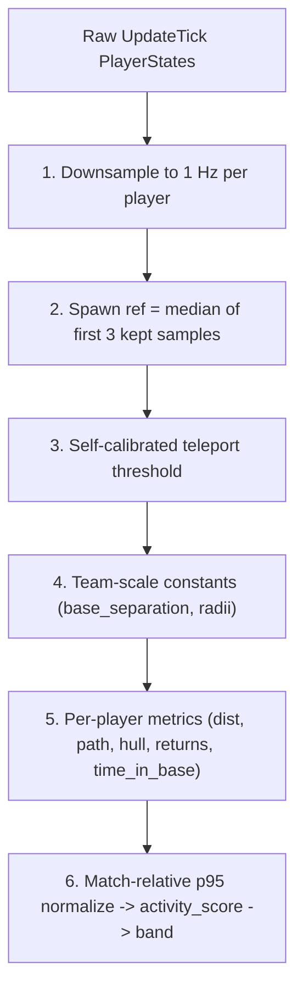

# VT Stats — Data Dictionary

## 1. Overview

VT Stats is a static-site dashboard for Battlezone: Combat Commander match statistics. The system has three stages:

1. **Raw Data** — Match events are captured by the [statsgate](https://github.com/VTrider/statsgate) collector as Protocol Buffer (protobuf) binary files.
2. **Processing Pipeline** — A Python script (`scripts/process_stats.py`) reads the raw protobuf data, aggregates statistics, and writes pre-computed JSON files.
3. **Browser Dashboard** — The static HTML/JS frontend loads the JSON and renders interactive charts, tables, and leaderboards.

```
data/sessions/<username>/*.binpb.gz   Raw session files (protobuf, gzip-compressed)
        │
        ▼
scripts/process_stats.py              Python pipeline
        │
        ├── data/odf.min.json         Weapon name database (ODF lookup)
        │
        ▼
data/processed/*.json                 Pre-computed JSON for the browser
        │
        ▼
index.html + JS                       Dashboard renders charts & tables
```

No data processing happens in the browser — all aggregation, attribution logic, and derived statistics are pre-computed by the pipeline.

---

## 2. Source Data — Protobuf Schema

The canonical schema is defined in `scripts/statsgate.proto`. Every match recording is a single `ClientStatSession` message containing a header and an ordered stream of events.

### ClientStatSession

The top-level container for one match recording.

| Field | Type | Description |
|---|---|---|
| `header` | `StatHeader` | Match metadata and player roster |
| `event_stream` | `repeated StatEvent` | Ordered list of all recorded events |

### StatHeader

Metadata captured at the start of the match.

| Field # | Field | Type | Description |
|---|---|---|---|
| 1 | `map` | `string` | Map filename (e.g. `havenvsr.bzn`) |
| 2 | `start_time` | `Timestamp` | Match start time (UTC) |
| 3 | `author_nickname` | `string` | Recording player's nickname |
| 4 | `author_steam64` | `uint64` | Recording player's Steam64 ID |
| 5 | `tick_rate` | `uint32` | Simulation tick rate (typically 20 ticks/second) |
| 6 | `s64_to_nick` | `map<uint64, string>` | Steam64 ID → Nickname lookup |
| 7 | `teamnum_to_s64` | `map<int32, uint64>` | Slot number (1-10) → Steam64 ID |
| 8 | `active_config_mod` | `string` | Server configuration mod identifier |
| 9 | `s64_to_teamnum` | `map<uint64, int32>` | Steam64 ID → Slot number (reverse of field 7) |
| 10 | `player_count` | `uint32` | Number of players in the match |
| 11 | `last_tick` | `uint32` | Final game tick (0 if not populated by collector) |
| 12 | `terrain_min_x` | `float` | World-space minimum X (west edge). Axis convention: +X East, +Y Up, +Z North |
| 13 | `terrain_max_x` | `float` | World-space maximum X (east edge) |
| 14 | `terrain_min_y` | `float` | World-space minimum Y (lowest elevation) |
| 15 | `terrain_max_y` | `float` | World-space maximum Y (highest elevation) |
| 16 | `terrain_min_z` | `float` | World-space minimum Z (south edge) |
| 17 | `terrain_max_z` | `float` | World-space maximum Z (north edge) |

All six `terrain_*` fields are 0.0 when the collector does not populate them (pre-schema sessions). The pipeline treats all-zero as "unset" and falls back to observed player extents for `positioning.map_bounds`; the source choice is surfaced via `positioning.map_bounds_source` (`"terrain"` vs `"observed"`).

### StatEvent

A wrapper that holds exactly one event type via a `oneof`:

| Field # | Event Type | Description |
|---|---|---|
| 1 | `BulletInit` | A player fires a projectile |
| 2 | `BulletHit` | A projectile connects with a target |
| 3 | `DamageDealt` | Damage source side of a damage event |
| 4 | `DamageReceived` | Damage target side of a damage event |
| 5 | `UpdateTick` | Per-tick snapshot of all player states |
| 6 | `UnitDestroyed` | A unit was destroyed |
| 7 | `UnitSniped` | A snipe event occurred |

### BulletInit

Recorded when a recognized player fires a projectile.

| Field | Type | Description |
|---|---|---|
| `tick` | `uint32` | Game tick when the shot was fired |
| `shooter` | `uint64` | Steam64 ID of the player who fired |
| `ordnance_odf` | `string` | Weapon ODF identifier (e.g. `chaingun_c.odf`) |

Only player-fired projectiles are tracked. AI and structure shots are not recorded by the collector.

### BulletHit

Recorded when a projectile connects with any target.

| Field | Type | Description |
|---|---|---|
| `tick` | `uint32` | Game tick of the hit |
| `shooter` | `uint64` | Steam64 ID of the player who fired (0 if not a player) |
| `ordnance_odf` | `string` | Weapon ODF identifier |
| `victim` | `uint64` | Steam64 ID of the victim (0 if not a player) |
| `victim_odf` | `string` | ODF of the hit entity |
| `shooter_odf` | `string` | Shooter's vehicle ODF (not yet populated by collector) |

The pipeline uses `shooter` and `ordnance_odf` for hit counting per player per weapon.

### DamageDealt + DamageReceived (Adjacent Pair Rule)

These two events represent **two sides of the same damage instance** in the game engine. They **always occur as adjacent pairs** in the event stream — a `DamageDealt` is immediately followed by the corresponding `DamageReceived`.

**DamageDealt:**

| Field | Type | Description |
|---|---|---|
| `tick` | `uint32` | Game tick |
| `shooter` | `uint64` | Steam64 ID of the damage source player. **0 if the source is not a player** (e.g. AI unit, structure). |
| `team` | `int32` | **Owning player's slot (1-10).** This is NOT a faction ID — it is the slot number of the player who owns the source entity. 0 = world prop. |
| `ordnance_odf` | `string` | Weapon ODF identifier. May be null for environmental damage. |
| `amount` | `float` | Damage amount (always matches the paired DamageReceived) |

**DamageReceived:**

| Field | Type | Description |
|---|---|---|
| `tick` | `uint32` | Game tick |
| `victim` | `uint64` | Steam64 ID of the damage target player. **0 if the target is not a player** (e.g. AI unit, structure). |
| `team` | `int32` | **Owning player's slot (1-10).** Slot of the player who owns the target entity. 0 = world prop. |
| `ordnance_odf` | `string` | Weapon ODF identifier |
| `amount` | `float` | Damage amount |

#### The `team` Field

This is the most commonly misunderstood field. The `team` value is **always a player slot number (1-10)**, not a faction or team ID. A slot's faction is determined by convention: slots 1-5 = Team 1, slots 6-10 = Team 2. If a player owns AI units or structures, those entities share the player's slot number.

#### Attribution Logic

How the pipeline assigns credit based on the `shooter`/`victim` values:

| shooter | victim | Dealt Credit | Received Credit | Rivalry? |
|---|---|---|---|---|
| > 0 (player) | > 0 (player) | Personal dealt to shooter | Personal received to victim | Yes |
| > 0 (player) | = 0 (non-player) | Personal dealt to shooter | Asset received to victim's owning slot | No |
| = 0 (non-player) | > 0 (player) | Asset dealt to shooter's owning slot | Personal received to victim | No |
| = 0 (non-player) | = 0 (non-player) | Asset dealt to owning slot | Asset received to owning slot | No |

**Skip conditions:**
- If `dd.team == 0` or `dd.amount == 0.0`, the **entire shooter side is skipped** (no dealt credit given). But the victim's received damage is still processed normally.
- If `dr.team == 0`, the victim side is skipped (world prop target).

### UpdateTick

Periodic state snapshots of all players. Currently captured by the collector but **not processed** by the pipeline (future: heatmaps, movement analysis).

| Field | Type | Description |
|---|---|---|
| `tick` | `uint32` | Game tick |
| `players` | `repeated PlayerState` | State of each player |

**PlayerState fields:**

| Field | Type | Description |
|---|---|---|
| `player` | `uint64` | Steam64 ID |
| `position` | `Vec3` | World position (x, y, z) |
| `speed` | `float` | Current speed |
| `health` | `float` | Current health (actual HP, not ratio) |
| `ammo` | `float` | Current ammo (actual value, not ratio) |
| `odf` | `string` | Current vehicle ODF |
| `has_target` | `bool` | `true` when the player is holding T / target-lock key at this tick (minor aim/tracking advantage). Defaults to `false` for pre-schema collector versions. |

### UnitDestroyed

Recorded when a unit is destroyed. The pipeline tracks kills/deaths from this event.

| Field | Type | Description |
|---|---|---|
| `tick` | `uint32` | Game tick |
| `killer` | `uint64` | Steam64 of killer (0 if not a player) |
| `killer_team` | `uint32` | Killer's team slot |
| `killer_odf` | `string` | Killer's vehicle ODF |
| `victim` | `uint64` | Steam64 of victim (0 if not a player) |
| `victim_team` | `uint32` | Victim's team slot |
| `victim_odf` | `string` | Destroyed unit's ODF |

Note: `UnitDestroyed` events are not yet produced by the current collector version. The pipeline handler is ready for when they arrive.

### UnitSniped

Recorded when a snipe event occurs. The pipeline counts these per match.

| Field | Type | Description |
|---|---|---|
| `tick` | `uint32` | Game tick |

Note: `UnitSniped` events are not yet produced by the current collector version.

### Player Identity

Players are identified by `uint64` Steam64 IDs. The header provides three lookup maps:

| Map | Type | Description |
|---|---|---|
| `s64_to_nick` | `map<uint64, string>` | Steam64 → display name |
| `teamnum_to_s64` | `map<int32, uint64>` | Slot (1-10) → Steam64 |
| `s64_to_teamnum` | `map<uint64, int32>` | Steam64 → Slot (reverse) |

The pipeline builds `nick_map` (slot → name) by joining `teamnum_to_s64` with `s64_to_nick`.

### Faction Resolution

Teams (factions) are determined by player slot convention: slots 1-5 = Team 1, slots 6-10 = Team 2.

### Source-Level Filters

These are applied by the statsgate collector before data reaches the pipeline:

- **Collision damage** (`DAMAGE_TYPE_COLLISION`) is excluded at source — never appears in the data
- **Bullet events** are only recorded for recognized players (those in `s64_to_nick`)
- **Header snapshot timing:** The header is captured at the first tick — players who join/leave after that point are not reflected in team lists

---

## 3. Processing Pipeline

The Python pipeline (`scripts/process_stats.py`) transforms raw protobuf data into pre-computed JSON. Here is each step:

### Step 1: Session Discovery

The pipeline scans `data/sessions/` for username subdirectories. Within each, it finds all `.binpb.gz` files (gzip-compressed protobuf). Each file is paired with its submitter username (the parent folder name). Files are sorted by name within each user folder.

### Step 2: Protobuf Parsing

Each `.binpb.gz` file is decompressed with `gzip.open()` and parsed into a `ClientStatSession` protobuf message. This gives the pipeline access to the header and the complete event stream.

### Step 3: Weapon Name Resolution (ODF)

The `data/odf.min.json` database maps raw ODF strings to human-readable weapon names. The resolution chain tries these lookups in order (first match wins):

| Priority | Lookup | Example |
|---|---|---|
| 1 | `WeaponClass.ordName` → `wpnName` | `chaingun_c` → `Chain Gun` |
| 2 | `DispenserClass.objectClass` → `wpnName` | Dispenser class → parent weapon |
| 3 | `TargetingGunClass.leaderName` → `wpnName` | Targeting gun → parent weapon |
| 4 | Explosion mapping (Vehicle → torpedo/explosion → parent weapon) | Explosion ODF → source weapon |
| 5 | **Fallback:** Raw ODF string minus `.odf` extension | `unknown_wpn.odf` → `unknown_wpn` |
| 6 | **Null ordnance:** Display as `"Unknown"` | `null` → `Unknown` |

When multiple ODF strings resolve to the same display name, the raw ODF is appended in parentheses for disambiguation (e.g. `Shell Gun (shellgun_c)`).

### Step 4: Header / Roster Setup

The pipeline reads identity maps from the header:
- Builds `nick_map` (slot → nickname) by joining `teamnum_to_s64` with `s64_to_nick`
- Builds `slot_to_s64` directly from `header.teamnum_to_s64`
- Builds `s64_to_slot` directly from `header.s64_to_teamnum`
- Faction is determined by slot convention (1-5 = Team 1, 6-10 = Team 2)

### Step 5: Single-Pass Event Processing

The pipeline iterates through the event stream once, processing each event type:

| Event | What It Contributes |
|---|---|
| `BulletInit` | Shot count per player×weapon, faction shot totals, global weapon shot totals, tick range |
| `BulletHit` | Hit count per player×weapon, faction hit totals, global weapon hit totals, tick range |
| `DamageDealt` + `DamageReceived` | Personal dealt/received, asset dealt/received, faction totals, rivalry matrix, weapon damage, ODF collection |
| `UnitDestroyed` | Per-player kills/deaths, kill feed entries (killer/victim with vehicle ODFs) |
| `UnitSniped` | Snipe count for the match |

Damage events are consumed as adjacent pairs. The [attribution logic](#attribution-logic) from Section 2 determines where each damage value is credited.

### Step 6: Timeline Recomputation

After the main pass, the timeline is recomputed from scratch. This is necessary because `min_tick` is not known until all events are processed, so initial bucketing during the main pass may be inaccurate.

- Time is divided into **10-second buckets** based on tick rate
- Each bucket accumulates total damage dealt during that window
- Two parallel timelines are built: **by player** and **by faction**
- Asset damage (shooter = 0) is included in the faction timeline but not the player timeline

### Step 7: Derived Outputs

After event processing, the pipeline computes:

- **Match metadata:** ID (from start_time), map, date, duration, tick range, tick rate, player count, config mod, submitter, snipe count, team rosters
- **Leaderboard:** Sorted by personal damage dealt (descending). Each entry includes personal stats, kills/deaths, asset stats, and per-weapon breakdown.
- **Faction totals:** Aggregate dealt/received/shots/hits/accuracy per team
- **Rivalry matrix:** Player-on-player damage grid (shooter name → victim name → damage)
- **Top rivalries:** Top 5 bidirectional pairs sorted by total mutual damage
- **Weapon meta:** Per-weapon totals (damage, shots, hits, accuracy, user count)
- **Timeline:** Labels (M:SS format) with damage arrays per player and per faction
- **Asset damage:** AI/structure damage breakdown by player and by faction
- **Kills:** Kill leaderboard and kill feed (from UnitDestroyed events)

### Step 8: All-Matches Aggregation

When more than one match is processed, the pipeline builds cross-match aggregate stats:

- **Career stats:** Per-player totals across all matches (dealt, received, accuracy, kills, deaths, favorite weapon, best match, weapon breakdown)
- **Global weapon meta:** Weapon totals summed across all matches
- **Global rivalries:** Top 10 cross-match bidirectional player pairs
- **Meta:** Match count, total duration, maps played, date range, submitters list

---

## 4. Source → Display Mapping

This table traces every dashboard-visible datapoint from its protobuf origin through pipeline processing to its final JSON field and UI location.

### Match Info Banner

| Displayed | JSON Path | Computed From |
|---|---|---|
| Map | `match.map` | `StatHeader.map` (direct) |
| Date | `match.date` | `StatHeader.start_time` → ISO datetime string |
| Duration | `match.duration_sec` | `(max_tick - min_tick) / tick_rate` across all events |
| Players | `match.player_count` | `StatHeader.player_count` or `len(nick_map)` |
| Submitted by | `match.submitter` | Parent folder name of the session file |

### Faction Scoreboard

| Displayed | JSON Path | Computed From |
|---|---|---|
| Player Dealt | `faction_totals[n].player_dealt` | Sum of `player_dealt` for all Steam64s in faction |
| PvP Dealt | `faction_totals[n].pvp_dealt` | Sum of rivalry rows for all faction Steam64s (shooter > 0 AND victim > 0) |
| PvE Dealt | `faction_totals[n].pve_dealt` | `player_dealt − pvp_dealt` — damage to AI units + world props |
| Asset Dealt | `faction_totals[n].asset_dealt` | Sum of `asset_dealt` for all slots in faction |
| Total Dealt | `faction_totals[n].total_dealt` | Running total from `faction_dealt` accumulator |
| Player Received | `faction_totals[n].player_received` | Sum of `player_received` for all Steam64s in faction |
| PvP Received | `faction_totals[n].pvp_received` | Sum of rivalry columns for all faction Steam64s (damage from other humans) |
| PvE Received | `faction_totals[n].pve_received` | `player_received − pvp_received` — damage from AI units + world props |
| Asset Received | `faction_totals[n].asset_received` | Sum of `asset_received` for all slots in faction |
| Total Received | `faction_totals[n].total_received` | Running total from `faction_received` accumulator |
| Shots | `faction_totals[n].shots` | Count of `BulletInit` events for faction |
| Hits | `faction_totals[n].hits` | Count of `BulletHit` events for faction |
| Accuracy | `faction_totals[n].accuracy` | `hits / shots` |

### Player Leaderboard

| Column | JSON Path | Computed From |
|---|---|---|
| Player | `leaderboard[].name` | `s64_to_nick[steam64]` |
| Team | `leaderboard[].faction` | `slot_to_faction(slot)` — slot convention |
| PvP | `leaderboard[].personal.pvp_dealt` | Player-on-player subset of `dealt` — sum of `rivalry_matrix[name]` (shooter > 0 AND victim > 0). Includes friendly-fire between humans. |
| PvE | `leaderboard[].personal.pve_dealt` | `dealt − pvp_dealt` — damage to AI units and world props (single bucket) |
| Dealt | `leaderboard[].personal.dealt` | Sum of `DamageDealt.amount` where `shooter` = this player's Steam64. Equals `pvp_dealt + pve_dealt` within ±0.1 rounding. |
| PvP In | `leaderboard[].personal.pvp_received` | Damage received from other humans — column sum of `rivalry_matrix` for this victim |
| PvE In | `leaderboard[].personal.pve_received` | `received − pvp_received` — damage received from AI units / world |
| Received | `leaderboard[].personal.received` | Sum of `DamageReceived.amount` where `victim` = this player's Steam64. Equals `pvp_received + pve_received` within ±0.1 rounding. |
| Net | `leaderboard[].personal.net` | `dealt - received` |
| Ratio | `leaderboard[].personal.ratio` | `dealt / received` — `null` when received = 0 and dealt > 0 (displayed as ∞) |
| Accuracy | `leaderboard[].personal.accuracy` | `shots_hit / shots_fired` from bullet events |
| Kills | `leaderboard[].kills` | Count of `UnitDestroyed` where `killer` = this player's Steam64 |
| Deaths | `leaderboard[].deaths` | Count of `UnitDestroyed` where `victim` = this player's Steam64 |
| Asset Dmg | `leaderboard[].assets.dealt` | Sum of `DamageDealt.amount` where `shooter = 0` and `team` = this player's slot |
| Fav Weapon | `leaderboard[].personal.fav_weapon` | Weapon with highest dealt damage for this player |
| # Wpns | `leaderboard[].personal.weapons_used` | Count of distinct ODFs with dealt damage |

### Combat Tab — Timeline Chart

| Displayed | JSON Path | Computed From |
|---|---|---|
| Time labels | `timeline.labels` | 10-second buckets: `bucket_index * 10` → `M:SS` format |
| Player series | `timeline.by_player[name]` | Damage dealt per 10s bucket by each player |
| Faction series | `timeline.by_faction[n]` | Damage dealt per 10s bucket by faction (includes asset damage) |

### Combat Tab — Weapon Meta Chart

| Displayed | JSON Path | Computed From |
|---|---|---|
| Weapon name | `weapon_meta[].weapon` | ODF → display name via resolution chain |
| Total damage | `weapon_meta[].total_damage` | Sum of `DamageDealt.amount` per ODF (all players) |
| Total shots | `weapon_meta[].total_shots` | Count of `BulletInit` per ODF |
| Total hits | `weapon_meta[].total_hits` | Count of `BulletHit` per ODF |
| Accuracy | `weapon_meta[].accuracy` | `total_hits / total_shots` |
| Users | `weapon_meta[].users` | Count of distinct players who dealt damage with this weapon |

### Combat Tab — Kill Feed

| Displayed | JSON Path | Computed From |
|---|---|---|
| Kill entries | `kills.feed[]` | `UnitDestroyed` events: `{ tick, killer, killer_odf, victim, victim_odf }` |
| Timestamp | Derived from `tick` | `(tick - min_tick) / tick_rate` → `M:SS` format |

### Combat Tab — Vehicle Destruction Breakdown

| Displayed | JSON Path | Computed From |
|---|---|---|
| Vehicle names | `kills.by_vehicle[].name` | Resolved via `prettify_odf` — weapon ODFs via the `Weapon.*` chain, otherwise via `GameObjectClass.unitName` across every top-level ODF DB category (`Vehicle`, `Building`, `Powerup`, `Pilot`, `Ordnance`). Same-name collisions (including `_vsr` siblings) disambiguate as `Name (raw_stem)`. Falls back to a title-cased stem only for ODFs the DB does not recognize at all. |
| Destruction count | `kills.by_vehicle[].count` | Count of `UnitDestroyed` events per `victim_odf` |

### Player Performance Radar (spiderweb)

Eight-axis normalized shape chart, rendered in four modes across Overview (single), Rivalries (compare), Combat (team), and All Matches (career). All axes normalize to the range 0–100 so shapes are directly comparable within a single polygon and across overlaid polygons. Values closer to the outer ring are always "better" — the Survivability axis combines damage-trade ratio (dealt ÷ received) and K/D (kills ÷ deaths) into a single skill-like composite, so low raw damage taken alone no longer inflates the score.

Every radar card carries a card-header info icon (`<i class="bi bi-info-circle">` with `data-vt-radar-info="per-match"` or `"career"`) whose tooltip describes all eight axes in full — the tooltip HTML is built by `buildRadarInfoTooltipHtml(mode)` in `js/charts-radar.js` so the copy stays in sync across Combat, Rivalries, Career, and the small Profile radar.

| Axis | Source field | Normalizer | Tooltip content |
|---|---|---|---|
| Damage Dealt | `leaderboard[].personal.dealt` | match max of `dealt` (match-level) · career max of `total_dealt` (career-level) | Raw damage |
| Accuracy | `leaderboard[].personal.accuracy` · `career_stats[].overall_accuracy` | already 0–1 | Percentage |
| Kills | `leaderboard[].kills` · `career_stats[].total_kills` | match max of `kills` (floor 1) · career max | Raw count + derived K/D |
| Survivability | `dealt / received` (damage trade) + `kills / deaths` (K/D) | `0.6 × clip(ratio, ratioP95) + 0.4 × clip(kd, kdP95)` — each ratio clipped at the 95th-percentile of the peer distribution, then weighted 60/40 toward damage trade. **Career mode** additionally applies Bayesian shrinkage toward the league mean with a 10-match prior: `w = matches / (matches + 10)`, `shrunk = w·player + (1−w)·leagueMean`. Team mode uses max of the two teams as the p95. Per-match and team modes do NOT shrink. Infinity (zero received / zero deaths) clips to 1.0 on its sub-component. | `Damage trade X.XX (dealt per received) — K/D (Kill-to-Death) Y.YY` |
| Mobility | `positioning.players[name].metrics.activity_score` · `career_stats[].mean_movement_score` | `/ 100` | Score + movement band. "Mobility: no position data" when `positioning.has_position_data === false` (per-match) or `matches_with_positioning === 0` (career). Career value is an average of match-relative scores — carries a minor approximation |
| Weapon Diversity | `leaderboard[].personal.weapons_used` · `len(career_stats[].weapon_breakdown)` | match max of `weapons_used` (floor 1) · career max | Count + `fav_weapon` |
| PvP Share | `personal.pvp_dealt / personal.dealt` · `career_stats[].total_pvp_dealt / total_dealt` | already 0–1 | PvP dealt + PvE dealt |
| T-Key Usage | `positioning.players[name].metrics.target_lock_pct` · `career_stats[].mean_target_lock_pct` | already 0–1 (absolute — no normalizer) | `T-Key NN.N%` when `positioning.has_target_lock_data === true` (per-match) or `matches_with_target_lock_data > 0` (career); otherwise "T-Key: no data". Cross-match comparable — career value is a valid direct average |

**Survivability formula rationale.** The previous `1 − received/max(received)` formulation penalized veteran players: cumulative damage taken scales with match count, so the axis was effectively a "played fewer matches" proxy at career scope. The composite fixes this by measuring *efficiency*:

- `dealt / received` captures how much damage you produce per unit absorbed (trade-efficiency).
- `kills / deaths` captures how often you end engagements on top vs. on the floor.
- 95th-percentile clipping prevents a single outlier (e.g. a player who took almost no damage in one match) from compressing everyone else's score.
- 60/40 weighting favors damage-trade because it's a continuous signal; K/D is an integer event count with less information per sample.
- Career-mode shrinkage with a 10-match prior ensures a player with 2 matches doesn't outrank a player with 100 matches on a single blowout — the short-history player is pulled toward the league average until they accumulate evidence of their true skill.

Implementation lives in `js/charts-radar.js`: `_safeRatio`, `_percentile`, `_finiteMean`, `_clipNorm`, `_compositeSurvivability`, and the per-mode norm computers (`_computeRadarAxes`, `_computeFactionNorms`, `_computeCareerNorms`).

**Mode-specific details:**

| Mode | Home | Data source | Pair selection |
|---|---|---|---|
| single | Overview player profile card | Unfiltered `currentData` so the ghost median reflects the whole match roster | N/A — follows the selected player |
| compare | Rivalries tab (`#section-rivalry-radar`) | Client-filtered `data` | Click a top-rivalry card to drill in (default = `top_rivalries[0]`); **Custom...** reveals two dropdowns for arbitrary pairs. On filter change the selection reconciles against the filtered roster with fallback to the first visible `top_rivalries[]` entry |
| team | Combat tab (`#section-faction-radar`) | Client-filtered `data` | Aggregated from `faction_totals` + per-faction leaderboard subsets. Mobility = mean `activity_score` across faction members with positioning data; T-Key Usage = mean `target_lock_pct` across the same subset |
| career | All Matches tab (`#section-career-radar`) | `all_matches.json → career_stats[]` | Single mode with ghost median by default; the **Compare** toggle reveals a second dropdown. Mobility uses `mean_movement_score` (match-relative average — approximation); T-Key Usage uses `mean_target_lock_pct` (absolute — valid direct average). The All Matches view does **not** apply the global filter — the A/B picker here is the only selection UI |

**Empty states:**

- Zero players in view → the canvas draws "No player data for current selection." and persists the canvas element so subsequent renders can recover.
- Same player picked twice in compare mode → falls through to a single polygon with an inline hint.
- Career tab with fewer than 2 players → Compare toggle is disabled and the median overlay is suppressed.

### Replay Tab — Timeline Player

Animated playback of the same `timeline` data shown on the Combat tab, with transport controls and live companion stats.

| Displayed | JSON Path | Computed From |
|---|---|---|
| Animated chart (Players mode) | `timeline.by_player[name]` | Same per-bucket damage arrays, sliced to `[0..currentIndex]` each tick |
| Animated chart (Teams mode) | `timeline.by_faction["1" / "2"]` | Same per-bucket faction damage arrays, sliced to `[0..currentIndex]` each tick |
| Time labels / scrub range | `timeline.labels` | Bucket labels drive the current-time readout and scrub bar bounds |
| Playback interval | `timeline.bucket_seconds` | `intervalMs = (bucket_seconds × 1000) / speed` (1000ms at 10x with 10s buckets) |
| Kill markers on chart | `kills.feed[].tick` + `match.tick_rate` + `match.tick_range[0]` | `bucket = floor(((tick − tick_range[0]) / tick_rate) / bucket_seconds)`; markers only drawn up to `currentIndex` |
| Running leaderboard | Cumulative sum of `timeline.by_player[name][0..currentIndex]` | Re-sorted each tick; rank/value/bar width update live |
| Faction tug-of-war segments | Cumulative sums of `timeline.by_faction["1"][0..currentIndex]` vs `["2"][0..currentIndex]` | Segment widths as percentage of combined total |
| Bucket spotlight | `argmax(timeline.by_player[*][currentIndex])` | Highlights the biggest contributor in the current bucket |
| Momentum chip | Sum of last 3 buckets per faction | Whichever faction leads by >10% points the arrow; otherwise "Even" or "Quiet" |
| Player colors | `buildPlayerColorMap(leaderboard_names)` | Same 15-color palette used across the dashboard for consistency |

Filter integration: the Replay tab consumes the client-filtered `data.timeline` object the same way the Combat tab does, so "Team" or "Player" filter selections narrow the animated chart and the running leaderboard to the selected subset. `by_faction` passes through unfiltered (matches the Combat tab's behavior).

### Rivalries Tab — Damage Heatmap

| Displayed | JSON Path | Computed From |
|---|---|---|
| Cell values | `rivalry_matrix[shooter][victim]` | Sum of `DamageDealt.amount` where both `shooter > 0` and `victim > 0` |

### Rivalries Tab — Top Rivalry Cards

| Displayed | JSON Path | Computed From |
|---|---|---|
| Player A / B | `top_rivalries[].a` / `.b` | Alphabetically sorted pair |
| A → B damage | `top_rivalries[].a_to_b` | Directional damage from A to B |
| B → A damage | `top_rivalries[].b_to_a` | Directional damage from B to A |
| Total | `top_rivalries[].total` | `a_to_b + b_to_a` |

Top 5 pairs sorted by total mutual damage.

### Rivalries Tab — Kill Rivalry Heatmap

| Displayed | JSON Path | Computed From |
|---|---|---|
| Cell values | `kills.kill_rivalry_matrix[killer][victim]` | Count of `UnitDestroyed` events where both `killer > 0` and `victim > 0` |

### Weapons & Accuracy Tab

| Displayed | JSON Path | Computed From |
|---|---|---|
| Per-player weapon stacks | `leaderboard[].weapon_breakdown` | Per-weapon dealt/received/shots/hits/accuracy for each player |
| Shot Accuracy table | `leaderboard[].personal.shots_fired/shots_hit/accuracy` | From `BulletInit` / `BulletHit` counts |
| Weapon Accuracy ranking | `weapon_meta[].accuracy` | `total_hits / total_shots` per weapon |
| Hit Distribution by Target | `leaderboard[].hit_targets` | Per-player: victim name → `{ hits, damage }`. Columns: Hits, Damage, Dmg/Hit (derived), % of Hits |

### Assets Tab

| Displayed | JSON Path | Computed From |
|---|---|---|
| Per-player asset dealt/received | `asset_damage.by_player[name]` | Damage where `shooter = 0` (dealt to owning slot) or `victim = 0` (received to owning slot) |
| Per-faction asset dealt/received | `asset_damage.by_faction[n]` | Sum of asset damage for all slots in faction |

### All Matches — Career Leaderboard

| Column | JSON Path | Computed From |
|---|---|---|
| Player | `career_stats[].name` | Player nickname |
| Matches | `career_stats[].matches_played` | Count of matches containing this player |
| Total Dealt | `career_stats[].total_dealt` | Sum of `personal.dealt` across all matches |
| Total Received | `career_stats[].total_received` | Sum of `personal.received` across all matches |
| Accuracy | `career_stats[].overall_accuracy` | `total_shots_hit / total_shots_fired` across all matches |
| Kills | `career_stats[].total_kills` | Sum of `kills` across all matches |
| Deaths | `career_stats[].total_deaths` | Sum of `deaths` across all matches |
| Asset Dealt | `career_stats[].total_asset_dealt` | Sum of `assets.dealt` across all matches |
| Fav Weapon | `career_stats[].fav_weapon` | Weapon with highest total dealt across all matches |

### All Matches — Global Weapons & Rivalries

| Displayed | JSON Path | Computed From |
|---|---|---|
| Global weapon chart | `global_weapon_meta[]` | Weapon totals summed across all matches |
| Cross-match rivalries | `global_rivalries[]` | Top 10 bidirectional pairs across all matches |

---

## 5. Output JSON Reference

All numeric values are pre-rounded: 1 decimal place for damage amounts, 3 decimal places for ratios and accuracy, 2 decimal places for the damage ratio.

### matches.json (Manifest)

An array of match summaries used to populate the match selector dropdown.

| Field | Type | Description |
|---|---|---|
| `id` | `string` | Match ID derived from start_time (`YYYY-MM-DDTHH-MM-SS`) |
| `name` | `string` | Display name resolved from `data/map-registry.json[<key>].title` with iteratively-stripped `XYZ: ` prefixes (e.g. `"VSR: Ancient Hills"` → `"Ancient Hills"`, `"ST: VSR: TVD: Ebola"` → `"Ebola"`). Falls back to the raw filename minus `.bzn` (case preserved) when the registry has no title. See `resolve_match_name()` in `scripts/process_stats.py` |
| `file` | `string` | Per-match JSON filename |
| `map` | `string` | Raw map name from header |
| `date` | `string` | ISO datetime from `start_time` |
| `duration_sec` | `number` | Match duration in seconds |
| `player_count` | `number` | Number of named players |
| `submitter` | `string` | Username of who submitted the session file |

### Per-Match JSON

Each match file has these top-level keys:

#### `match`

| Field | Type | Description |
|---|---|---|
| `id` | `string` | Unique match ID |
| `source_file` | `string` | Source `.binpb.gz` filename |
| `submitter` | `string` | Submitter username |
| `map` | `string` | Raw map name |
| `date` | `string` | ISO datetime |
| `duration_sec` | `number` | Duration in seconds |
| `tick_range` | `[number, number]` | `[min_tick, max_tick]` across all events |
| `tick_rate` | `number` | Simulation ticks per second |
| `player_count` | `number` | Number of players |
| `config_mod` | `string` | Server configuration mod |
| `snipe_count` | `number` | Number of UnitSniped events |
| `teams` | `object` | `"1"` and `"2"` → arrays of roster entries |

Each roster entry: `{ slot, player_id, name, steam64 }`

#### `leaderboard[]`

Each entry represents one player, sorted by personal damage dealt (descending).

| Field | Type | Description |
|---|---|---|
| `player_id` | `string` | Player display name |
| `name` | `string` | Player display name (same as player_id) |
| `slot` | `number` | Team slot (1-10) |
| `steam64` | `string` | Steam64 ID as string |
| `faction` | `number` | Team number (1 or 2) |
| `kills` | `number` | UnitDestroyed events where this player is killer |
| `deaths` | `number` | UnitDestroyed events where this player is victim |
| `kd_ratio` | `number\|null` | `kills / deaths`. `null` when deaths = 0. |
| `personal` | `object` | Personal combat stats (see below) |
| `assets` | `object` | Asset damage stats: `{ dealt, received }` |
| `weapon_breakdown` | `object` | Weapon name → `{ dealt, received, shots, hits, accuracy }` |
| `hit_targets` | `object` | Victim name → `{ hits, damage }`. `hits` = BulletHit count, `damage` = total player-on-player damage from rivalry matrix. Dashboard derives Dmg/Hit from these. |

**`personal` object:**

| Field | Type | Description |
|---|---|---|
| `dealt` | `number` | Total personal damage dealt (equals `pvp_dealt + pve_dealt` within ±0.1 rounding) |
| `received` | `number` | Total personal damage received (equals `pvp_received + pve_received` within ±0.1 rounding) |
| `pvp_dealt` | `number` | Player-on-player subset of `dealt`. Row sum of `rivalry_matrix[name]`. Includes friendly-fire between humans. |
| `pve_dealt` | `number` | `dealt − pvp_dealt`. Damage to AI units and world props in one bucket. |
| `pvp_received` | `number` | Damage received from other humans. Column sum of `rivalry_matrix` for this victim. |
| `pve_received` | `number` | `received − pvp_received`. Damage received from AI units / world. |
| `net` | `number` | `dealt - received` |
| `ratio` | `number\|null` | `dealt / received`. `null` when infinite (dealt > 0, received = 0). |
| `shots_fired` | `number` | Total `BulletInit` count |
| `shots_hit` | `number` | Total `BulletHit` count |
| `accuracy` | `number` | `shots_hit / shots_fired` |
| `fav_weapon` | `string` | Weapon name with highest dealt damage |
| `weapons_used` | `number` | Count of distinct weapons with dealt damage |

#### `faction_totals`

Keyed by `"1"` and `"2"` (faction number as string).

| Field | Type | Description |
|---|---|---|
| `player_dealt` | `number` | Sum of all players' personal dealt in this faction |
| `pvp_dealt` | `number` | Player-on-player subset of `player_dealt` (sum of rivalry rows for faction Steam64s) |
| `pve_dealt` | `number` | `player_dealt − pvp_dealt` — damage to AI units / world props |
| `asset_dealt` | `number` | Sum of asset dealt for slots in this faction |
| `total_dealt` | `number` | Total damage dealt by this faction (from running accumulator) |
| `player_received` | `number` | Sum of all players' personal received |
| `pvp_received` | `number` | Damage received from humans — sum of rivalry columns for faction Steam64s |
| `pve_received` | `number` | `player_received − pvp_received` — damage received from AI / world |
| `asset_received` | `number` | Sum of asset received for slots in this faction |
| `total_received` | `number` | Total damage received by this faction |
| `shots` | `number` | Total shots fired by this faction |
| `hits` | `number` | Total shots hit by this faction |
| `accuracy` | `number` | `hits / shots` |

#### `rivalry_matrix`

A nested object: `{ "ShooterName": { "VictimName": damageAmount } }`. Only contains entries where both shooter and victim are players (not skipped).

#### `top_rivalries[]`

Top 5 bidirectional player pairs, sorted by total mutual damage.

| Field | Type | Description |
|---|---|---|
| `a` | `string` | First player (alphabetical) |
| `b` | `string` | Second player |
| `a_to_b` | `number` | Damage dealt from A to B |
| `b_to_a` | `number` | Damage dealt from B to A |
| `total` | `number` | `a_to_b + b_to_a` |

#### `weapon_meta[]`

Per-weapon statistics for the match, sorted by total damage (descending).

| Field | Type | Description |
|---|---|---|
| `weapon` | `string` | Human-readable weapon name |
| `odf` | `string` | Raw ODF identifier |
| `total_damage` | `number` | Total damage dealt with this weapon |
| `total_shots` | `number` | Total times fired |
| `total_hits` | `number` | Total times connected |
| `accuracy` | `number` | `total_hits / total_shots` |
| `users` | `number` | Number of distinct players who used this weapon |

#### `timeline`

Damage over time in 10-second buckets.

| Field | Type | Description |
|---|---|---|
| `bucket_seconds` | `number` | Bucket size (always 10) |
| `labels` | `string[]` | Time labels in `M:SS` format |
| `by_player` | `object` | Player name → array of damage values per bucket |
| `by_faction` | `object` | `"1"` / `"2"` → array of damage values per bucket |

#### `asset_damage`

AI and structure damage attribution.

| Field | Type | Description |
|---|---|---|
| `by_player` | `object` | Player name → `{ dealt, received }` |
| `by_faction` | `object` | `"1"` / `"2"` → `{ dealt, received }` |

#### `kills`

Kill/death data from UnitDestroyed events. After Phase 3, only **real-vehicle** destructions reach this block — powerup pickups, powerup/crate destructions, and deployable destructions are routed away by the four-way classification (see `.cursor/rules/data-schema.mdc` "UnitDestroyed Four-Way Classification" + `docs/pickup-powerup-semantics.md`).

| Field | Type | Description |
|---|---|---|
| `leaderboard` | `array` | Sorted by kills descending. Each: `{ player_id, name, kills, deaths, kd_ratio }` |
| `feed` | `array` | Chronological kill events. Each: `{ tick, killer, killer_in_game_nick, killer_odf, victim, victim_in_game_nick, victim_odf }` |
| `by_vehicle` | `array` | Vehicle types destroyed, sorted by count descending. Each: `{ odf, name, count }`. `name` is resolved via the same `prettify_odf` chain that powers `odf_map`. Capped to top 15 after filtering ignored ODFs (see `VEHICLE_DESTRUCTION_IGNORE_ODFS` in `scripts/process_stats.py`). |
| `kill_rivalry_matrix` | `object` | Nested `{ "KillerName": { "VictimName": killCount } }`. Only player-on-player kills. |

#### `pickups` (Phase 3)

Crate / pod pickups from `PickupPowerup` events (new-schema only). Always emitted; populated only when `has_pickup_data: true`.

| Field | Type | Description |
|---|---|---|
| `has_pickup_data` | `bool` | `true` iff the match contains at least one `PickupPowerup` event. `false` for pre-Phase-3 sessions. |
| `feed` | `array` | Chronological pickup events. Each: `{ tick, picker, picker_in_game_nick, picker_odf, powerup_odf, powerup_name, powerup_team }`. AI pickers labeled as `"Team N"`. |
| `feed[].powerup_name` | `string` | Disambiguated display name (e.g. `"Chain Gun Powerup"`), suffixed with " Powerup" to distinguish the pod from the same-named weapon ordnance. Resolution order: DB Powerup `unitName` -> stripped-vsr Powerup `unitName` -> weapon name -> stripped-vsr weapon name -> title-cased stem. Empty string for empty `powerup_odf`. |
| `by_player` | `array` | Per-player counts. Each: `{ name, count }`, sorted descending. |
| `by_odf` | `array` | Per-powerup counts. Each: `{ odf, name, count }`, sorted descending. `name` via `prettify_odf`. |
| `totals` | `object` | `{ total, team_1, team_2, ai }` — match-global counts; `ai` is pickups by non-player units. |

#### `powerup_destructions` (Phase 3)

Powerups/crates destroyed in real combat (not picked up). Effectively denies the enemy economy by removing the pickup before someone could grab it. Sourced from `UnitDestroyed` events with `victim_odf in KNOWN_POWERUP_ODFS` AND `killer_team != 0`. Populated for both old and new schema (the team-zero filter discriminates regardless of source).

| Field | Type | Description |
|---|---|---|
| `feed` | `array` | Chronological powerup/crate destruction events. Each: `{ tick, killer, killer_in_game_nick, killer_odf, powerup_odf, powerup_name, powerup_team }`. |
| `feed[].powerup_name` | `string` | Same disambiguated display name as `pickups.feed[].powerup_name` (see above). |
| `by_player` | `array` | Per-killer counts. Each: `{ name, count }`. |
| `by_odf` | `array` | Per-powerup counts. Each: `{ odf, name, count }`. |
| `totals` | `object` | `{ total, team_1, team_2 }`. |

#### `deployable_destructions` (Phase 3)

Mine / deployable utility destructions. No `feed` (engine emits a lot of self-detonation noise). Both schemas populate this block.

| Field | Type | Description |
|---|---|---|
| `by_player` | `array` | Per-killer counts. Each: `{ name, count }`. |
| `by_odf` | `array` | Per-deployable counts. Each: `{ odf, name, count }`. |
| `totals` | `object` | `{ total }`. |

#### `snipes` (Phase 3)

Pilot snipes from `UnitSniped` events. Phase 3 enriched the proto event with shooter / victim context; pre-Phase-3 sessions still produce `feed` entries but with empty `sniper_odf` / `victim_odf` strings (protobuf defaults).

| Field | Type | Description |
|---|---|---|
| `feed` | `array` | Chronological snipe events. Each: `{ tick, sniper, sniper_in_game_nick, sniper_odf, victim, victim_in_game_nick, victim_odf }`. |
| `by_player` | `array` | Per-sniper counts. Each: `{ name, count }`. |
| `totals` | `object` | `{ total, team_1, team_2 }`. |

#### `positioning`

Player movement analytics derived from `UpdateTick` events. Captured positions are downsampled to **1 Hz** in the processed JSON regardless of source `tick_rate`. When a session has no `UpdateTick` events, the block is still emitted with `has_position_data: false` and empty `players`.

##### Axis Convention

- **+X = East, −X = West**
- **+Y = Up, −Y = Down**
- **+Z = North, −Z = South** (developer-confirmed)
- Left-handed, Y-up. All distance / path / hull math is horizontal-only: `dist = sqrt(dx² + dz²)`.
- Rendering: screen-X = world-X (east right), screen-Y = `−world-Z` (north up).

##### Top-level fields

| Field | Type | Description |
|---|---|---|
| `has_position_data` | `boolean` | `true` when the session contained `UpdateTick` events |
| `has_target_lock_data` | `boolean` | `true` iff any `PlayerState.has_target=true` sample was observed in the match. `false` for pre-schema matches AND for new-schema matches where no player ever held T. Distinguishes "no data" from "0% lock" in the UI (see T-Key Usage subsection below) |
| `sample_rate_hz` | `number` | Always 1 (downsample target) |
| `match_sample_count` | `number` | Total seconds covered by any player (drives animation duration) |
| `map_bounds` | `object` | `{ min: {x, z}, max: {x, z} }`. 2D reference frame used for `heatmap_grid_xz` binning and all canvas projections. Sourced from `terrain_bounds` when the header provides it, otherwise from observed player extents. `null` when `has_position_data: false` |
| `map_bounds_source` | `string \| null` | `"terrain"` when `map_bounds` came from the header, `"observed"` when derived from player extents, `null` when `has_position_data: false`. Lets frontends label tooltips / axis ticks as absolute-map vs. match-relative |
| `terrain_bounds` | `object \| null` | Full 3D `{ min: {x, y, z}, max: {x, y, z} }` from `StatHeader.terrain_*` (+X East, +Y Up, +Z North). `null` for pre-schema sessions. Mirrored onto the `match` object for convenience |
| `map_diagonal` | `number` | Horizontal distance between `map_bounds` min/max. Used to gate faction-tint overlays |
| `base_separation` | `number` | Floored internal scaling value `max(computed_centroid_dist, 500, observed_max_range × 0.3)`. Drives `R_base = 0.15 × base_separation` for `time_in_base_pct` heuristics. **Not** the user-facing measurement — see `base_to_base_distance` |
| `base_to_base_distance` | `number \| null` | Raw horizontal distance between Team 1 and Team 2 spawn centroids, no floor applied. `null` when either team has zero players. This is the "how far apart are the bases" measurement. Mirrored onto the `match` object |
| `observed_max_range` | `number` | Max horizontal distance any player reached from their personal spawn |
| `p99_speed` | `number` | 99th percentile of per-step speeds (non-teleport filtered) — used for diagnostics |
| `teleport_threshold` | `number` | Self-calibrated: `max(300, p99_speed × 2)` u/s |
| `team_base` | `object` | `"1"` / `"2"` → `{ centroid: {x, z}, radius }` or `null` for an empty team |
| `players` | `object` | Player name → per-player positioning block (see below) |

##### Per-player block

| Field | Type | Description |
|---|---|---|
| `spawn` | `{x, y, z}` | Median of first 3 kept samples — robust against tick-0 jitter |
| `personal_base_radius` | `number` | Clip of `team_radius × 1.1` to the `[100, 400]` range; 150 fallback |
| `sample_count` | `number` | Per-player kept-sample count (may be less than `match_sample_count` for late joiners / early disconnects) |
| `first_seen_sec` | `number` | First `trail.t[]` value |
| `last_seen_sec` | `number` | Last `trail.t[]` value |
| `metrics` | `object` | Derived metrics (see below) |
| `trail` | `object` | Downsampled position arrays + segment breaks |
| `heatmap_grid_xz` | `number[][]` | 32×32 bin counts over `map_bounds`. `[row][col]` where row = x-index (0 = west), col = z-index (0 = south) |
| `heatmap_polar` | `number[][]` | 16 angular × 8 radial bin counts around personal spawn. Angular bin 0 = due East (+X), increasing counter-clockwise. Radial bins span `0 .. p95_dist` |

##### Pipeline overview

Raw `UpdateTick` events pass through a six-stage funnel before metrics are emitted. Each stage feeds the next; the score at the end is a function of every upstream decision.



Stage-by-stage code anchors in `scripts/process_stats.py`:

1. **Downsample to 1 Hz per player.** Independent cadence per player so absences don't drift sampling. Constants: `POSITIONING_SAMPLE_RATE_HZ = 1` at [scripts/process_stats.py:36](scripts/process_stats.py); downsample gate lives in the raw UpdateTick loop around [scripts/process_stats.py:773-776](scripts/process_stats.py).
2. **Spawn reference = median of first 3 kept samples.** Robust against tick-0 jitter. Constant `POSITIONING_SPAWN_SAMPLES = 3` at [scripts/process_stats.py:37](scripts/process_stats.py); computed at [scripts/process_stats.py:446-451](scripts/process_stats.py).
3. **Self-calibrated teleport threshold.** `max(300 u/s, p99_speed × 2)` — see Teleport detection below. Computed at [scripts/process_stats.py:515-522](scripts/process_stats.py).
4. **Team-scale constants.** `base_separation` (three-way floor) and per-team base radii. Computed at [scripts/process_stats.py:453-499](scripts/process_stats.py).
5. **Per-player metrics.** Distances, path length (teleport-aware), convex hull, hysteresis-gated returns, time-in-base. First-pass loop at [scripts/process_stats.py:528-620](scripts/process_stats.py).
6. **Match-relative p95 normalize → `activity_score` → band.** Second pass once all first-pass metrics exist. At [scripts/process_stats.py:622-643](scripts/process_stats.py).

The two-pass structure exists because the `activity_score` normalizers (`p95_max_dist`, `p95_path_per_sec`) are computed across all players in the match — the score of any one player depends on the whole roster's performance in the same match.

##### Per-player `metrics`

All distances computed on the `(x, z)` horizontal plane against the player's personal spawn.

| Metric | Type | Description |
|---|---|---|
| `mean_dist` | `number` | Arithmetic mean of per-sample distances from spawn |
| `max_dist` | `number` | Farthest horizontal distance from spawn |
| `p50_dist`, `p90_dist`, `p95_dist` | `number` | Percentile distances |
| `time_in_base_pct` | `number` | Fraction of this player's samples with `dist < personal_base_radius`. Denominator is **per-player** `sample_count`, not match total |
| `time_to_first_leave_sec` | `number \| null` | First `t` where `dist > personal_base_radius`; `null` if never left |
| `path_length` | `number` | Sum of non-teleport deltas. Teleport-aware (see Teleport detection below) |
| `path_length_per_sec` | `number` | `path_length / (last_seen − first_seen)`. Uses observed presence duration |
| `convex_hull_area` | `number` | Area of convex hull of all positions. 0 when `sample_count < 3` |
| `bounding_box_area` | `number` | Axis-aligned bounding box area. 0 when `sample_count < 2` |
| `return_to_base_count` | `number` | Hysteresis-counted re-entries: cross `R_base × 1.2` out, **stay outside ≥ 5 seconds**, then re-enter past `R_base × 0.8`. Post-teleport re-entries excluded (see Teleport detection below for why respawn returns are filtered out). The min-outside gate filters boundary-noise oscillations |
| `activity_score` | `number` | 0–100. **Higher = more active / more map coverage; lower = stayed at base.** `round(100 × (0.5 × (1 − time_in_base_pct) + 0.3 × normalized_max_dist + 0.2 × normalized_path_per_sec))` where `normalized_max_dist = min(max_dist / p95_max_dist_in_match, 1.0)` and `normalized_path_per_sec = min(path_length_per_sec / p95_path_per_sec_in_match, 1.0)`. p95 is computed across all players in this match, making the score self-calibrate per match (so spread is meaningful even on tightly contested or sluggish games). See Pipeline overview above for where this is computed and Worked example below for a numeric walkthrough |
| `movement_band` | `string` | Bucketed `activity_score`: 0-20 Defensive, 21-40 Territorial, 41-60 Balanced, 61-80 Mobile, 81-100 Aggressive |
| `target_lock_pct` | `number` | 0–1 ratio: fraction of this player's kept 1 Hz samples where `PlayerState.has_target=true` (T-key held). Absolute value — directly comparable across matches, unlike `activity_score`. See T-Key Usage subsection below. 0.0 when `has_target_lock_data=false` at the top level; use the flag to distinguish "no data" from "0% lock" |

##### Per-player `trail`

| Field | Type | Description |
|---|---|---|
| `t` | `number[]` | Sparse per-sample seconds-from-match-start. May skip values if the player was absent from an `UpdateTick` (dead, disconnected, out of scope) |
| `x` | `number[]` | Per-sample world X (east/west) |
| `z` | `number[]` | Per-sample world Z (north/south) |
| `y` | `number[]` | Per-sample world Y (up/down). Stored but not used by v1 metrics; available for future elevation features |
| `segments` | `[number, number][]` | Index ranges `[start, end]` (inclusive) split at teleport detections. Frontend draws one polyline per segment; the first sample of each post-teleport segment is excluded from `return_to_base_count` |

##### Teleport detection

Teleports happen when a player dies and respawns: the next `UpdateTick` can "jump" hundreds of units instantly. Left uncorrected these jumps inflate `path_length` and draw spurious lines across the map.

The threshold is **self-calibrated per match**: compute per-step speeds across all players, take the 99th percentile of values below the floor (`300 u/s`), then set `teleport_threshold = max(300, p99 × 2)`. Steps exceeding the threshold are:

- Excluded from `path_length`
- Recorded as a segment break in `trail.segments`
- First re-entry of each new segment excluded from `return_to_base_count`

But still counted in `time_in_base_pct` because the player genuinely was at their base during the respawn window.

##### `base_separation` derivation

Used as the scale unit that makes `activity_score` comparable across maps of different sizes.

1. Compute each team's spawn centroid from its players' personal spawns (median-of-first-3-samples).
2. `computed_separation = horizontal_dist(team1_centroid, team2_centroid)`.
3. Final value: `max(computed_separation, 500, observed_max_range × 0.3)` — three-way floor protects against maps where both teams spawn close together (FFA / mod variants).

If one team has zero populated spawns, `team_base[n] = null` and the computed separation falls back to the safety floor.

##### Movement band thresholds

| `activity_score` | Band | Interpretation |
|---|---|---|
| 0–20 | Defensive | Stays at or near spawn almost the entire match |
| 21–40 | Territorial | Orbits the base, short pushes |
| 41–60 | Balanced | Mix of defense and offense |
| 61–80 | Mobile | Regular rotations, meaningful time out of base |
| 81–100 | Aggressive | Pushes deep, rarely returns, high path length |

**Operational definition of each band:** bands are pure thresholds on `activity_score`. "Aggressive" means `activity_score >= 81`, which in practice requires a player near the top-5%-roamer in both `max_dist` and `path_length_per_sec` **and** `time_in_base_pct` close to zero. No single metric alone can push someone into the band — the three terms (weighted 0.5 / 0.3 / 0.2) must all be favorable.

##### Known limitations

- **Pilot-eject deflates "active" reading.** Foot speed (~5 u/s) is well below vehicle speed; frequent ejectors score less active than their play warrants. V1 does not filter by `PlayerState.odf`.
- **`trail.t[]` is sparse.** Players can be absent from `UpdateTick` events (dead, disconnected, out of sim scope). Renderers must iterate using `t[i]` as authoritative time, not array index.
- **Unit scale is map-specific.** BZ "world units" are not meters. All thresholds scale with `base_separation`, so activity_score is unit-agnostic.
- **Scores are match-relative, not universal.** Because the `max_dist` and `path_length_per_sec` normalizers are this-match p95s, a score of 90 in a low-action match is not directly comparable to a score of 90 in a high-action match. Absolute comparison across matches should go through the `career_stats` aggregates (`mean_movement_score`, `movement_band_dominant`), which average per-match relative scores.

##### T-Key Usage (Target Lock)

BZCC lets a pilot hold the **T-key** to lock the crosshair onto the nearest enemy, giving a small tracking / aim-assist advantage. The collector captures this as a per-tick boolean in `PlayerState.has_target`; the pipeline distills it into a per-player ratio.

- **Signal**: raw `has_target` booleans in `UpdateTick.players[]`, downsampled to 1 Hz parallel to positioning samples.
- **Per-player metric**: `metrics.target_lock_pct = sum(has_target) / sample_count`, rounded to 3 decimals. 0 means "never held T"; 1 means "held T every kept sample"; in practice expect 0.05–0.40 for active pilots, near 0 for FPS-style ground players or pre-schema matches.
- **Match-global flag**: `positioning.has_target_lock_data` (also mirrored on `match.has_target_lock_data` and manifest entries) is `true` iff any `has_target=true` sample was observed in the match. It gates the T-Key Usage UI so a pre-schema match (where the field did not exist) renders "no data" instead of an indistinguishable 0% bar.
- **Edge case — field present but no player ever held T**: collapses to `has_target_lock_data=false`, same as pre-schema. This is an unavoidable limitation of protobuf's implicit presence: the wire format cannot distinguish "never set" from "explicit false". In practice both cases are correctly labeled "no data" because neither carries a meaningful T-key signal.
- **Contrast with `activity_score`**: unlike `activity_score` (match-relative, p95-normalized across the roster), `target_lock_pct` is **absolute** — a 0.25 ratio means the player held T for a quarter of their kept samples regardless of how anyone else played. This is why `career_stats[].mean_target_lock_pct` is a **straight direct average** across matches (valid), whereas `mean_movement_score` is an average-of-relatives (approximation, noted in the career Mobility tooltip).
- **Career aggregation**: `career_stats[].mean_target_lock_pct` and `career_stats[].matches_with_target_lock_data`; also surfaced as `meta.matches_with_target_lock_data` in `all_matches.json`. Only matches where `has_target_lock_data=true` contribute to the average — that prevents pre-schema zero-fill from diluting real values.
- **UI surface**: the 8th "T-Key Usage" axis on the Player Performance Radar in all four modes (single / compare / team / career). The career Radar reads `mean_target_lock_pct` directly; the per-match Radar reads per-player `target_lock_pct`. Both tooltips fall back to "T-Key: no data" when the availability flag is false.

##### Worked example

Walking through VTrider's score on match `2026-04-16T01-27-48.json` (the published sample match). All numbers pulled live from the processed JSON.

Match-level normalizers (computed across all 10 players in this match):

```
p95_max_dist        = 1051.8
p95_path_per_sec    = 22.80
```

VTrider's first-pass metrics:

```
time_in_base_pct    = 0.256     (25.6% of kept samples were inside personal base radius)
max_dist            = 1024.0    (farthest point from spawn, in world units)
path_length_per_sec = 20.25     (non-teleport path / observed presence duration)
```

Score derivation:

```
term_a = 0.50 × (1 − 0.256)                        = 0.3720
term_b = 0.30 × min(1024.0 / 1051.8, 1.0)
       = 0.30 × 0.9736                             = 0.2921
term_c = 0.20 × min(20.25 / 22.80, 1.0)
       = 0.20 × 0.8883                             = 0.1777

activity_score = round(100 × (0.3720 + 0.2921 + 0.1777))
               = round(84.18)
               = 84

movement_band  = _band_for_score(84) = "Aggressive"    (since 84 >= 81)
```

Reading: VTrider spent ~74% of the match outside their base, reached ~97% of the top-roamer's max distance, and covered ~89% of the top-roamer's path rate. All three terms land near their ceilings, which is what pushes the score over the Aggressive threshold.

Contrast with F9bomber on the same match: `time_in_base_pct = 0.469`, `max_dist = 1006.1`, `path_length_per_sec = 18.62` → `term_a = 0.266`, `term_b = 0.287`, `term_c = 0.163` → score `72` → **Mobile**. Same map, same normalizers — the lower share of time outside base alone drops them a full band.

### all_matches.json (Cross-Match Aggregate)

Only generated when more than one match is processed.

#### `meta`

| Field | Type | Description |
|---|---|---|
| `match_count` | `number` | Total matches processed |
| `total_duration_sec` | `number` | Sum of all match durations |
| `maps_played` | `string[]` | Sorted list of unique map names |
| `date_range` | `[string, string]` | Earliest and latest match dates |
| `submitters` | `string[]` | Sorted list of unique submitter usernames |
| `matches_with_positioning` | `number` | Count of matches whose top-level `match.has_position_data` is `true` |
| `matches_with_target_lock_data` | `number` | Count of matches whose top-level `match.has_target_lock_data` is `true` (i.e. at least one player held T at least once during the match) |

#### `career_stats[]`

Per-player career totals, sorted by total dealt (descending).

| Field | Type | Description |
|---|---|---|
| `player_id` | `string` | Player display name |
| `name` | `string` | Player display name |
| `matches_played` | `number` | Number of matches this player appeared in |
| `total_dealt` | `number` | Lifetime personal damage dealt |
| `total_received` | `number` | Lifetime personal damage received |
| `total_pvp_dealt` | `number` | Lifetime player-on-player damage dealt (sum of per-match `personal.pvp_dealt`) |
| `total_pve_dealt` | `number` | Lifetime player-on-AI damage dealt (sum of per-match `personal.pve_dealt`) |
| `total_pvp_received` | `number` | Lifetime damage received from other humans |
| `total_pve_received` | `number` | Lifetime damage received from AI units / world |
| `total_asset_dealt` | `number` | Lifetime asset damage dealt |
| `overall_accuracy` | `number` | `total_shots_hit / total_shots_fired` across all matches |
| `total_kills` | `number` | Lifetime kills from real-vehicle `UnitDestroyed` events. Phase 3: powerup pickups, powerup/crate destructions, and deployable destructions no longer count (the four-way classification routes them away from `kills.*` at the source). |
| `total_deaths` | `number` | Lifetime deaths from real-vehicle `UnitDestroyed` events |
| `total_pickups` | `number` | Phase 3. Sum of `pickups.by_player[name].count` across all matches the player appeared in. Old-schema matches contribute zero (their `pickups` block is empty). |
| `fav_weapon` | `string` | Weapon with highest total dealt across all matches |
| `best_match` | `object` | `{ id, map, dealt }` — match with highest personal dealt |
| `weapon_breakdown` | `object` | Weapon name → `{ dealt, shots, hits, accuracy }` |
| `mean_movement_score` | `number \| null` | Mean `activity_score` across matches where this player had positioning data. `null` when `matches_with_positioning = 0`. Approximation — averages match-relative scores (see Positioning Block Known limitations) |
| `movement_score_stddev` | `number \| null` | Population stddev of per-match `activity_score`s. 0 when only one match; `null` when no matches contribute |
| `movement_band_dominant` | `string \| null` | Modal `movement_band` across contributing matches |
| `movement_band_distribution` | `object` | Band name → count of matches in that band |
| `total_path_length` | `number` | Sum of `metrics.path_length` across contributing matches |
| `matches_with_positioning` | `number` | Denominator for `mean_movement_score` / `total_path_length` — number of matches where this player had a positioning entry |
| `mean_target_lock_pct` | `number \| null` | Mean `target_lock_pct` across matches where `has_target_lock_data=true` and the player has a positioning entry. **Valid direct average** (target_lock_pct is absolute). `null` when `matches_with_target_lock_data = 0` |
| `matches_with_target_lock_data` | `number` | Denominator for `mean_target_lock_pct`. Always `<= matches_with_positioning`; the delta is the count of pre-schema or no-T-pressed matches that contributed positioning but no T-key signal |

#### `global_weapon_meta[]` — same structure as per-match `weapon_meta` but summed across all matches.

#### `global_rivalries[]` — same structure as per-match `top_rivalries` but aggregated across all matches (top 10 pairs).

---

## 6. Datapoint Glossary

Alphabetical reference of every statistic displayed in the dashboard.

| Datapoint | Definition | Source Events | Formula |
|---|---|---|---|
| **Accuracy (Player)** | Percentage of shots that connected | `BulletInit`, `BulletHit` | `shots_hit / shots_fired` |
| **Accuracy (Weapon)** | Per-weapon hit rate across all users | `BulletInit`, `BulletHit` | `total_hits / total_shots` per ODF |
| **Asset Damage Dealt** | Damage credited to a player's AI units or structures | `DamageDealt` where `shooter = 0` | Sum of `amount` grouped by owning slot (`team` field) |
| **Asset Damage Received** | Damage taken by a player's AI units or structures | `DamageReceived` where `victim = 0` | Sum of `amount` grouped by owning slot (`team` field) |
| **Base-to-Base Distance** | Raw horizontal distance between Team 1 and Team 2 spawn centroids (no floor applied) | `UpdateTick.players[].position` (first 3 kept samples per player) | Median of first-3 samples per player → per-team centroid of (x, z) → `sqrt(dx² + dz²)`. `null` if either team empty. See `positioning.base_to_base_distance` and the mirrored `match.base_to_base_distance`. Hero banner shows empirical as primary with a tooltip comparing to the canonical value |
| **Base-to-Base Distance (Canonical)** | Map-design reference base-to-base distance | `BZ2API.VSR_MAP_DATA[<mapKey>].baseToBase` | Baked-in library value from the VSR map catalog (sevsunday/bz2vsr). Differs from empirical by a few units: canonical reflects the designed recycler-to-recycler distance while empirical is the median of first-3 kept spawn samples (players may have drifted slightly). Both shipped side-by-side in the hero base-to-base tooltip |
| **Canonical Map Size** | Map edge length in world units, from the map-design reference | `BZ2API.VSR_MAP_DATA[<mapKey>].size * 2` (library stores half-edge; full-edge = size × 2) | Used as fallback in the hero "Map size" stat block when `match.terrain_bounds` is absent (pre-schema sessions). Also present as `canonical_size` on `data/maps/<mapFile>.json` and `data/map-registry.json` |
| **Map Image** | Top-down map image (PNG/JPG) fetched from iondriver's gamelistassets API | `https://gamelistassets.iondriver.com/bzcc/getdata.php?map=X&mod=Y` → `data.image` → `data/maps/<mapFile>.<ext>` | Downloaded at pipeline time by `scripts/build_map_registry.py`; content-addressed filenames on the source side guarantee cache stability. Surfaces: hero 48×48 thumbnail, match-picker 96×96 card thumbnails, heatmap background (`js/positioning-charts.js`), replay trail background (`js/positioning-player.js`) |
| **Map Registry** | Consolidated metadata dict for every distinct map in the corpus | `data/map-registry.json` | `{ <mapFile>: { title, description, image_path, image_calibration, net_vars, author, canonical_size, canonical_b2b, mod_resolved, fetched_at } }`. Keyed by lowercase `<mapFile>` (stripped `.bzn` extension). Consumed by `js/app.js` for hero banner + `js/positioning-charts.js` + `js/positioning-player.js` for overlays. External reference data; match-global; always-unfiltered |
| **Image Calibration** | Optional per-map override telling the frontend what world-space rectangle the map image covers | `data/maps/<mapFile>.json` → `image_calibration.image_bounds_world = { min:{x,z}, max:{x,z} }` | When `null` (default), frontend projection falls back to `match.terrain_bounds` (2D xz). When populated, `image_bounds_world` becomes the authoritative image-to-world mapping for heatmap + trail overlays, hero thumbnail projection, and the match-picker thumb. Preserved across `scripts/build_map_registry.py` reruns (additive on cache-hit). Tuning workflow in `DEVELOPER_GUIDE.md` §10 |
| **Overlay Projection** | The pixel-to-world contract shared by map image and every data point drawn on top of it | `imageBounds` (from calibration or terrain_bounds) | `px = (worldX − min.x) / (max.x − min.x) × canvasW` ; `py = (max.z − worldZ) / (max.z − min.z) × canvasH`. Axis convention: +X East, +Z North, image top = north. Guarantees images + heatmap cells + trails stay co-aligned regardless of calibration. See `_drawMapImageLayer()` in `js/positioning-charts.js` |
| **Best Match** | The match where a player dealt the most personal damage | `leaderboard[].personal.dealt` | Max dealt across matches (career view only) |
| **Bucket Spotlight (Replay)** | Biggest contributor in the current playback bucket | `timeline.by_player[name][currentIndex]` | `argmax` of per-player damage at `currentIndex` |
| **Config Mod** | Server configuration identifier | `StatHeader.active_config_mod` | Direct from header |
| **Date** | When the match started | `StatHeader.start_time` | Protobuf Timestamp → ISO datetime |
| **Deaths** | Times a player's unit was destroyed | `UnitDestroyed` where `victim` = player Steam64 | Count per player |
| **Duration** | How long the match lasted | All events with `tick` | `(max_tick - min_tick) / tick_rate` |
| **Faction Accuracy** | Team-wide hit rate | `BulletInit`, `BulletHit` grouped by faction | `faction_hits / faction_shots` |
| **Hit Distribution** | Per-player breakdown of which targets were hit most, with damage context | `BulletHit` (hits) + `DamageDealt` rivalry (damage) | `{ hits: count, damage: total }` per shooter → victim pair. Dmg/Hit = `damage / hits` |
| **Faction Total Dealt** | All damage dealt by a team (players + assets) | `DamageDealt` grouped by faction | Running accumulator across all `DamageDealt` events |
| **Faction Total Received** | All damage received by a team (players + assets) | `DamageReceived` grouped by faction | Running accumulator across all `DamageReceived` events |
| **Favorite Weapon** | Weapon a player dealt the most damage with | `DamageDealt` per player per ODF | Weapon name with `max(dealt)` |
| **Kill Rivalry** | How many times one player killed another | `UnitDestroyed` where both `killer > 0` and `victim > 0` | Count grouped by killer → victim pair |
| **Kills** | Times a player destroyed a unit | `UnitDestroyed` where `killer` = player Steam64 | Count per player |
| **Map** | The BZCC map played | `StatHeader.map` | Direct from header |
| **Matches Played** | Number of matches a player appeared in | Match presence | Count of matches containing this `player_id` |
| **Momentum (Replay)** | Which faction is dominating the current phase of playback | `timeline.by_faction` rolling 3-bucket sums | Faction ahead by >10% drives the arrow direction; otherwise "Even" or "Quiet" |
| **Net Damage** | Difference between damage dealt and received | `DamageDealt`, `DamageReceived` | `personal_dealt - personal_received` |
| **Player Count** | Number of named players in a match | `StatHeader.player_count` | Direct from header (fallback: `len(nick_map)`) |
| **Playhead (Replay)** | Continuous playback position expressed in buckets | `timeline.labels`, `timeline.bucket_seconds` | `progressBuckets` is a float 0.0 (empty: "0:00") → `totalBuckets` (full match), driven by `requestAnimationFrame` so the chart line, scrub thumb, time readout, and faction tug-of-war move continuously. Numeric panels (running leaderboard, bucket spotlight, momentum chip) snap per whole bucket so values stay readable. `prefers-reduced-motion` users get a fallback that steps per whole bucket via `setInterval` |
| **Ratio** | Damage dealt relative to damage received | `DamageDealt`, `DamageReceived` | `dealt / received`. Infinite (∞) when received = 0 and dealt > 0. |
| **Replay Speed** | How fast the Replay tab plays relative to real match time | `timeline.bucket_seconds` | `intervalMs = (bucket_seconds × 1000) / speed`; options 0.5x (slow-mo), 1x, 2x (default), 5x, 10x, 20x |
| **Rivalry** | Bidirectional damage between two specific players | `DamageDealt` + `DamageReceived` pairs where both `shooter > 0` and `victim > 0` | Sum of mutual damage in both directions |
| **Shots Fired** | Number of projectiles a player launched | `BulletInit` | Count per player |
| **Shots Hit** | Number of projectiles that connected | `BulletHit` | Count per player |
| **Sentinel Event** | Engine-emitted damage event dropped by the pipeline's sentinel filter. Observed value exactly `268,435,456.0` (= 2^28 = `0x4d800000` as IEEE-754 float bits) from BZCC's `DAMAGE_TYPE_UNKNOWN` force-kill pathway via `misnexport2 + 0x1c`. Not real combat damage. | `DamageDealt` / `DamageReceived` where `amount > 1e6` | Skipped at ingest (pipeline and timeline recompute) before any accumulator touches the value. Both DD and paired DR are consumed together. Full evidence chain, struct layout, and decompile in [sentinel-damage.md](sentinel-damage.md) |
| **Sentinel Damage (match)** | Per-match telemetry for sentinel events dropped | `match.sentinel_damage = { count, total_amount, first_tick, last_tick }` | `count` is number of DD+DR pairs (not individual events). `total_amount` is the sum of DD-side amounts. `first_tick`/`last_tick` are `null` on clean matches. Present on every match (zeros when clean). Match-global, always-unfiltered |
| **Sentinel Damage (meta)** | Corpus-wide sentinel rollup | `all_matches.json → meta.total_sentinel_damage_dropped` (pair count sum) + `meta.matches_with_sentinel_damage` (list of affected match IDs) | Enables regression detection if a future session reintroduces sentinels after upstream fix |
| **Snipe Count** | Number of snipe events in a match | `UnitSniped` | Count per match |
| **Submitter** | Who submitted the session data | Filesystem | Parent folder name of the `.binpb.gz` file |
| **Terrain Bounds** | Full 3D world-space extents of the map | `StatHeader.terrain_min_*` / `terrain_max_*` (fields 12-17) | `{min:{x,y,z}, max:{x,y,z}}`, axis convention +X East / +Y Up / +Z North. `null` for pre-schema sessions (all-zero fallback). Surfaced on `positioning.terrain_bounds` and mirrored to `match.terrain_bounds`. Drives `positioning.map_bounds` when present (`map_bounds_source = "terrain"`); observed player extents fallback otherwise |
| **Timeline** | Damage over time in 10-second windows | `DamageDealt` | Damage per bucket = `(tick - min_tick) / (bucket_seconds * tick_rate)` |
| **Tug-of-War (Replay)** | Cumulative faction damage as a two-segment bar during playback | `timeline.by_faction["1" / "2"]` | Segment width = `cumulative_faction_total / combined_total × 100%` |
| **Vehicle Kills** | How many times each vehicle type was destroyed | `UnitDestroyed` grouped by `victim_odf` | Count per vehicle ODF |
| **Total Dealt (Career)** | Lifetime personal damage dealt across all matches | `leaderboard[].personal.dealt` | Sum across all matches |
| **Total Received (Career)** | Lifetime personal damage received across all matches | `leaderboard[].personal.received` | Sum across all matches |
| **Weapon Breakdown** | Per-weapon stats for a player | `DamageDealt`, `BulletInit`, `BulletHit` per player per ODF | `{ dealt, received, shots, hits, accuracy }` per weapon |
| **Weapons Used** | Count of distinct weapons a player dealt damage with | `DamageDealt` per player | Count of unique ODFs with `dealt > 0` |
