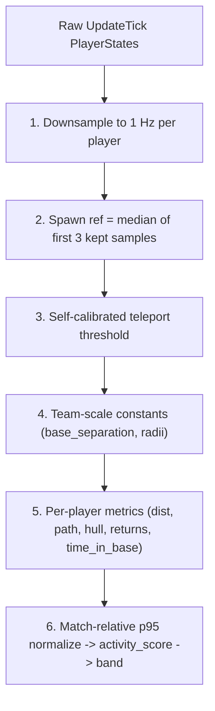
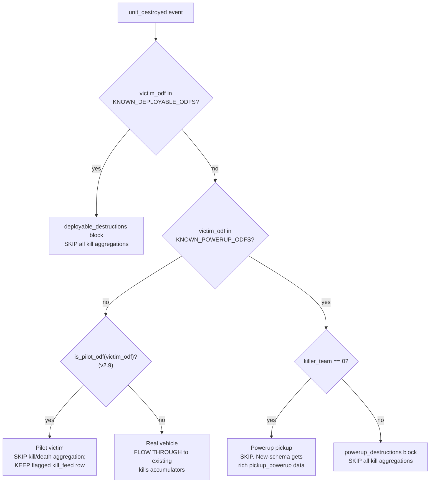

# VT Stats — Data Dictionary

## 1. Overview

VT Stats is a static-site dashboard for Battlezone: Combat Commander match statistics. The system has three stages:

1. **Raw Data** — Match events are captured by the [statsgate](https://github.com/VTrider/statsgate) collector as Protocol Buffer (protobuf) binary files.
2. **Processing Pipeline** — A Python script (`scripts/process_stats.py`) reads the raw protobuf data, aggregates statistics, and writes pre-computed JSON files.
3. **Browser Dashboard** — The static HTML/JS frontend loads the JSON and renders interactive charts, tables, and leaderboards.

```
data/sessions/<username>/*.binpb.gz   Raw session files (protobuf, gzip-compressed)
        │
        ▼
scripts/process_stats.py              Python pipeline
        │  ├── data/odf.min.json                         Weapon / unit / powerup name DB
        │  ├── scripts/extract_proto_docs.py             Proto-comment extraction (pre-step)
        │  └── scripts/build_map_registry.py             Map metadata + image fetch (post-step)
        │             │  ├── data/vsrmaplist.json        PRIMARY — vendored BZCC-Website
        │             │  │                               index (Pools / Loose / Tags /
        │             │  │                               formatted_size / Author / Image
        │             │  │                               URL); refresh via
        │             │  │                               scripts/refresh_vsrmaplist.py
        │             │  ├── iondriver gamelistassets    Per-map enrichment — netVars
        │             │  │                               (svar1/svar2 etc.) + richer
        │             │  │                               title/description fallback
        │             │  └── js/bz2api.js                LEGACY FALLBACK — baked-in
        │             │                                  VSR_MAP_DATA catalog
        │             ▼
        │       data/map-registry.json + data/maps/*     Per-map title / image / netVars +
        │                                                pools / loose / tags / formatted_size
        │       data/proto-docs.json                     {Message.field: comment} dict
        │
        ▼
data/processed/                       Pre-computed JSON consumed by the browser
        ├── matches.json                    Match manifest (drives the picker)
        ├── <match_id>.json                 Per-match aggregates + positioning + odf_map
        └── match_contributions.json        Slim per-match contributions for the
                                            client-side All Matches aggregator
        │
        ▼
index.html + JS                       Dashboard renders charts, tables, replay, positioning
js/all-matches-aggregator.js          Pure summation over match_contributions.json
                                      scoped to the picker-filtered subset
raw.html + js/raw-browser.js          Standalone Raw Data Browser: decodes binpb
                                      client-side and renders three tiers per match
```

Per-match aggregation (leaderboards, weapon meta, rivalry matrices, positioning, odf_map, sentinel telemetry) happens in the Python pipeline — never in browser JavaScript. The **one documented exception** is `js/all-matches-aggregator.js`, which performs pure summation over `match_contributions.json` to produce the All Matches view's aggregate; it exists so the picker's facet filters can scope the cross-match aggregate without re-fetching per-match JSONs or pre-computing every facet combination.

---

## 2. Source Data — Protobuf Schema

The canonical schema is defined in `scripts/statsgate.proto`. Every match recording is a single `ClientStatSession` message containing a header and an ordered stream of events.

### ClientStatSession

The top-level container for one match recording.

| Field | Type | Description |
|---|---|---|
| `header` | `StatHeader` | Match metadata and player roster |
| `event_stream` | `repeated StatEvent` | Ordered list of all recorded events |

### StatHeader

Match metadata. Most fields are captured at match start; in proto v3 the
`players` roster accumulates across the whole match and `game_outcome` /
`author_*` are written at the final tick.

| Field # | Field | Type | Description |
|---|---|---|---|
| 1 | `map` | `string` | Map filename (e.g. `havenvsr.bzn`) |
| 2 | `start_time` | `Timestamp` | Match start time (UTC) |
| 3 | `author_nickname` | `string` | Recording player's nickname (v3 note: written at last tick; currently resolves to `'Unknown'` — the pipeline uses the sessions folder name for submitter identity) |
| 4 | `author_steam64` | `uint64` | Recording player's Steam64 ID |
| 5 | `tick_rate` | `uint32` | Simulation tick rate (typically 20 ticks/second) |
| 6 | `s64_to_nick` | `map<uint64, string>` | **v1/v2 only — `reserved` in v3.** Steam64 ID → Nickname lookup |
| 7 | `teamnum_to_s64` | `map<int32, uint64>` | **v1/v2 only — `reserved` in v3.** Slot number (1-10) → Steam64 ID |
| 8 | `active_config_mod` | `string` | Server configuration mod identifier |
| 9 | `s64_to_teamnum` | `map<uint64, int32>` | **v1/v2 only — `reserved` in v3.** Steam64 ID → Slot number (reverse of field 7) |
| 10 | `player_count` | `uint32` | **v1/v2 only — `reserved` in v3.** Number of players in the match |
| 11 | `last_tick` | `uint32` | Final game tick (0 if not populated by collector) |
| 12 | `terrain_min_x` | `float` | World-space minimum X (west edge). Axis convention: +X East, +Y Up, +Z North |
| 13 | `terrain_max_x` | `float` | World-space maximum X (east edge) |
| 14 | `terrain_min_y` | `float` | World-space minimum Y (lowest elevation) |
| 15 | `terrain_max_y` | `float` | World-space maximum Y (highest elevation) |
| 16 | `terrain_min_z` | `float` | World-space minimum Z (south edge) |
| 17 | `terrain_max_z` | `float` | World-space maximum Z (north edge) |
| 18 | `shutdown_requested` | `bool` | **v2+.** Stat session cancelled mid-game via mission script / console command |
| 19 | `team1_race` | `Race` | **v2+.** Team 1's faction (authoritative when non-zero) |
| 20 | `team2_race` | `Race` | **v2+.** Team 2's faction |
| 21 | `game_outcome` | `Outcome` | **v3-only.** Host-attested outcome from the end-of-game dialog: `0` UNSPECIFIED, `1000` TEAM1_WIN, `1001` TEAM2_WIN, `1002` DRAW, `1003` GAME_CANCELLED (1000-series values double as Win32 TaskDialog button IDs upstream; out-of-enum values like `IDCANCEL = 2` are possible when the host ESCs the dialog and are treated as unattested). See [§10 Match Winner Resolution](#10-match-winner-resolution-inference--v15-attestation). |
| 22 | `players` | `repeated PlayerInfo` | **v3-only.** Per-tick-accumulated roster (replaces fields 6/7/9/10): `{steam64, teamnum, nickname}` per player observed in any slot at any tick — captures late joiners; `nickname` is first-recorded. Hash-ordered on the wire (NOT first-seen). May carry garbage entries with invalid Steam64s from EMPTY slots (the collector scans without a player-handle guard); the pipeline's `_valid_steam64` gate (`(s64 >> 32) == 0x01100001`) drops them from the working identity while `match.roster` preserves them flagged `valid: false`. |

All six `terrain_*` fields are 0.0 when the collector does not populate them (pre-schema sessions). The pipeline treats all-zero as "unset" and falls back to observed player extents for `positioning.map_bounds`; the source choice is surfaced via `positioning.map_bounds_source` (`"terrain"` vs `"observed"`).

### StatEvent

A wrapper that holds exactly one event type via a `oneof`:

| Field # | Event Type | Description |
|---|---|---|
| 1 | `BulletInit` | A player fires a projectile |
| 2 | `BulletHit` | A projectile connects with a target |
| 3 | `DamageDealt` | Damage source side of a damage event |
| 4 | `DamageReceived` | Damage target side of a damage event |
| 5 | `UpdateTick` | Per-tick snapshot of all player states (**v4**: + per-team `ResourceState`) |
| 6 | `UnitDestroyed` | A unit was destroyed |
| 7 | `UnitSniped` | A snipe event occurred |
| 8 | `PickupPowerup` | A player picked up a crate / pod (Phase 3 — new-schema only) |
| 9 | `BuildEvent` | **v4-only.** A producer order changed state (QUEUE / CANCEL / BUILD) |

### ResourceState (v4)

Carried on every `UpdateTick` as `team1_resources` / `team2_resources`
(fields 3/4) — the collector samples both team banks on every tick.

| Field # | Field | Type | Description |
|---|---|---|---|
| 1 | `current_scrap` | `uint32` | Team scrap bank at this tick |
| 2 | `max_scrap` | `uint32` | Storage cap = `(recycler alive ? 40 : 0) + 20 × pool_count` (verified model) |
| 3 | `scrap_status` | `ScrapStatus` | `1` GREEN / `2` YELLOW / `3` RED / `4` PARALLEL (unused) — DERIVED display enum: which storage segment the current level sits in, which is also the team's current regen rate (red 2/s, yellow 1/s, green ⅓/s). Never a rating input. |
| 4 | `pool_count` | `uint32` | Live extractor census (net control, includes upgraded) |
| 5 | `upgrade_count` | `uint32` | Upgraded extractors only (`scrapDelay == 0.5` heuristic — stock/VSR reliable) |

### BuildEvent (v4)

| Field # | Field | Type | Description |
|---|---|---|---|
| 1 | `tick` | `uint32` | Game tick |
| 2 | `type` | `BuildEventType` | `1` QUEUE (order placed — **scrap is deducted here**, measured), `2` CANCEL (one event per unit on stack-cancels; factory-lane refunds ≈ 50%, armory 0% — measured, small n), `3` BUILD (completion) |
| 3 | `producer` | `ProducerType` | `1` FACTORY (recycler builds ALSO arrive as FACTORY — the pipeline's producer reverse-map disambiguates via odf.min.json menus), `2` CONSTRUCTOR (hover rigs; QUEUE-only before EXU2 1.6.3 — the pipeline's dual-mode `structures_completion_source` handles both eras), `3` ARMORY |
| 4 | `teamnum` | `uint32` | Producer's team slot (observed values 1 / 6) |
| 5 | `build_odf` | `string` | Ordered item's ODF — **inconsistently `.odf`-suffixed on the wire** (armory items); the pipeline normalizes via `_norm_build_odf()` before any FIFO/dedup/counting |

### BulletInit

Recorded when a recognized player fires a projectile.

| Field | Type | Description |
|---|---|---|
| `tick` | `uint32` | Game tick when the shot was fired |
| `shooter` | `uint64` | Steam64 ID of the player who fired |
| `ordnance_odf` | `string` | Weapon ODF identifier (e.g. `chaingun_c.odf`) |

Only player-fired projectiles are tracked. AI and structure shots are not recorded by the collector.

### BulletHit

Recorded when a projectile connects with any target.

| Field | Type | Description |
|---|---|---|
| `tick` | `uint32` | Game tick of the hit |
| `shooter` | `uint64` | Steam64 ID of the player who fired (0 if not a player) |
| `ordnance_odf` | `string` | Weapon ODF identifier |
| `victim` | `uint64` | Steam64 ID of the victim (0 if not a player) |
| `victim_odf` | `string` | ODF of the hit entity |
| `shooter_odf` | `string` | Shooter's vehicle ODF (not yet populated by collector) |

The pipeline uses `shooter` and `ordnance_odf` for hit counting per player per weapon.

### DamageDealt + DamageReceived (Adjacent Pair Rule)

These two events represent **two sides of the same damage instance** in the game engine. They **always occur as adjacent pairs** in the event stream — a `DamageDealt` is immediately followed by the corresponding `DamageReceived`.

**DamageDealt:**

| Field | Type | Description |
|---|---|---|
| `tick` | `uint32` | Game tick |
| `shooter` | `uint64` | Steam64 ID of the damage source player. **0 if the source is not a player** (e.g. AI unit, structure). |
| `team` | `int32` | **Owning player's slot (1-10).** This is NOT a faction ID — it is the slot number of the player who owns the source entity. 0 = world prop. |
| `ordnance_odf` | `string` | Weapon ODF identifier. May be null for environmental damage. |
| `amount` | `float` | Damage amount (always matches the paired DamageReceived) |

**DamageReceived:**

| Field | Type | Description |
|---|---|---|
| `tick` | `uint32` | Game tick |
| `victim` | `uint64` | Steam64 ID of the damage target player. **0 if the target is not a player** (e.g. AI unit, structure). |
| `team` | `int32` | **Owning player's slot (1-10).** Slot of the player who owns the target entity. 0 = world prop. |
| `ordnance_odf` | `string` | Weapon ODF identifier |
| `amount` | `float` | Damage amount |

#### The `team` Field

This is the most commonly misunderstood field. The `team` value is **always a player slot number (1-10)**, not a faction or team ID. A slot's faction is determined by convention: slots 1-5 = Team 1, slots 6-10 = Team 2. If a player owns AI units or structures, those entities share the player's slot number.

#### Attribution Logic

How the pipeline assigns credit based on the `shooter`/`victim` values:

| shooter | victim | Dealt Credit | Received Credit | Rivalry? |
|---|---|---|---|---|
| > 0 (player) | > 0 (player) | Personal dealt to shooter | Personal received to victim | Yes |
| > 0 (player) | = 0 (non-player) | Personal dealt to shooter | Asset received to victim's owning slot | No |
| = 0 (non-player) | > 0 (player) | Asset dealt to shooter's owning slot | Personal received to victim | No |
| = 0 (non-player) | = 0 (non-player) | Asset dealt to owning slot | Asset received to owning slot | No |

**Skip conditions:**
- If `dd.team == 0` or `dd.amount == 0.0`, the **entire shooter side is skipped** (no dealt credit given). But the victim's received damage is still processed normally.
- If `dr.team == 0`, the victim side is skipped (world prop target).

### UpdateTick

Periodic state snapshots of all players. The pipeline downsamples these to 1 Hz per player and feeds the entire `positioning` block (§5) — spawn detection, top-down heatmaps, movement bands, T-key target-lock ratios. See `positioning` in §5 for the full derivation.

| Field | Type | Description |
|---|---|---|
| `tick` | `uint32` | Game tick |
| `players` | `repeated PlayerState` | State of each player |

**PlayerState fields:**

| Field | Type | Description |
|---|---|---|
| `player` | `uint64` | Steam64 ID |
| `position` | `Vec3` | World position (x, y, z) |
| `speed` | `float` | Current speed |
| `health` | `float` | Current health (actual HP, not ratio) |
| `ammo` | `float` | Current ammo (actual value, not ratio) |
| `odf` | `string` | Current vehicle ODF |
| `has_target` | `bool` | `true` when the player has a target lock active at this tick (T-key activates target mode; tap-to-toggle — minor aim/tracking advantage). Defaults to `false` for pre-schema collector versions. |

### UnitDestroyed

Recorded when a unit is destroyed (player vehicle, AI unit, structure, deployable, or — in pre-Phase-3 sessions — a synthetic emission for crate/pod pickups).

| Field | Type | Description |
|---|---|---|
| `tick` | `uint32` | Game tick |
| `killer` | `uint64` | Steam64 of killer (0 if not a player) |
| `killer_team` | `uint32` | Killer's team slot. **`0` is the engine's signal that the destruction had no real attacker** — used by the four-way classification (§8) to detect powerup pickups disguised as destructions. |
| `killer_odf` | `string` | Killer's vehicle ODF |
| `victim` | `uint64` | Steam64 of victim (0 if not a player) |
| `victim_team` | `uint32` | Victim's team slot |
| `victim_odf` | `string` | Destroyed unit's ODF |

Note: every `UnitDestroyed` event passes through the pipeline's **four-way classification** (real vehicle / powerup pickup / powerup-or-crate destruction / deployable destruction) before any kill aggregator touches it. Only real-vehicle destructions reach the `kills.*` block — the other three categories are routed to `pickups`, `powerup_destructions`, and `deployable_destructions` respectively. See [§8 UnitDestroyed Classification & Powerup Economy](#8-unitdestroyed-classification-powerup-economy).

### UnitSniped

Recorded when a pilot snipe event occurs.

| Field | Type | Description |
|---|---|---|
| `tick` | `uint32` | Game tick |
| `shooter` | `uint64` | Steam64 of sniper (collector-bug poisoned through ~2026-05-04 — see erratum) |
| `shooter_team` | `uint32` | Sniper's team slot — **authoritative for sniper identity** |
| `shooter_odf` | `string` | Sniper's vehicle ODF (typically a pilot ODF: `isuser*.odf`, `ispilo*.odf`, `fsuser*.odf`) |
| `victim` | `uint64` | Steam64 of pilot victim (collector-bug always-zero through ~2026-05-04 — see erratum) |
| `victim_team` | `uint32` | Victim's team slot — **authoritative for victim identity** |
| `victim_odf` | `string` | Victim's vehicle ODF (the unit they were piloting when sniped) |

Phase 3 enriched `UnitSniped` with the shooter / victim / odf fields. Pre-Phase-3 sessions only carry `tick`; the other six fields are protobuf defaults (zeros / empty strings).

**Collector-bug erratum (Phase 3 through ~2026-05-04).** A copy-paste typo at `statsgate/statsgate/src/stat_client.cpp:273` caused `set_shooter()` to be called twice in `record_snipe()`, so:
- `shooter` (uint64) was overwritten with the **victim's** Steam64 in nearly every event (or stayed as the genuine shooter Steam64 when the victim handle wasn't a tracked player — both outcomes unreliable for attribution)
- `victim` (uint64) was never written and stayed at protobuf default `0`
- The four slot / ODF fields (`shooter_team`, `shooter_odf`, `victim_team`, `victim_odf`) were always correct

The pipeline mitigates this by **slot-deriving identity** in [`process_stats.py`](../scripts/process_stats.py) at the `unit_sniped` event branch: sniper Steam64 = `header.teamnum_to_s64[shooter_team]`, victim Steam64 = `header.teamnum_to_s64[victim_team]`. The `shooter` and `victim` Steam64 fields are ignored. This is forward-compatible with the upstream fix — when fixed-collector sessions arrive, the slot-derivation produces identical output without code changes. A one-line sanity warning fires during reprocess if a fixed-session `shooter` Steam64 maps to a slot that's neither `shooter_team` nor `victim_team`. Full evidence chain in [`_sniper_investigation/DIAGNOSIS.txt`](../_sniper_investigation/DIAGNOSIS.txt).

### PickupPowerup

Recorded when a player picks up a crate / pod. **Phase 3 (April 2026)** — new-schema sessions only. Pre-Phase-3 sessions do not contain this event; the engine emits a synthetic `UnitDestroyed` for the same tick (with `killer_team == 0`) regardless of schema version.

| Field | Type | Description |
|---|---|---|
| `tick` | `uint32` | Game tick |
| `picker` | `uint64` | Steam64 of picker (0 if AI) |
| `picker_team` | `uint32` | Picker's team slot |
| `picker_odf` | `string` | Picker's vehicle ODF |
| `powerup_team` | `uint32` | Team that owned the powerup spawn |
| `powerup_odf` | `string` | The collectible ODF (e.g. `apsnipvsr.odf`) |

The pipeline routes the synthetic `UnitDestroyed` companion (powerup-pickup branch in §8) to suppression and consumes the real `PickupPowerup` event into `pickups.feed` for the rich picker context. The match-global `match.has_pickup_data` flag is `true` iff at least one `PickupPowerup` event was observed.

### Player Identity

Players are identified by `uint64` Steam64 IDs. The header provides three lookup maps:

| Map | Type | Description |
|---|---|---|
| `s64_to_nick` | `map<uint64, string>` | Steam64 → display name |
| `teamnum_to_s64` | `map<int32, uint64>` | Slot (1-10) → Steam64 |
| `s64_to_teamnum` | `map<uint64, int32>` | Steam64 → Slot (reverse) |

The pipeline builds `nick_map` (slot → name) by joining `teamnum_to_s64` with `s64_to_nick`.

**Proto v3:** the three maps are `reserved`; identity comes from the `header.players` PlayerInfo roster instead (see the StatHeader table above), normalized into the same three working dicts by `_build_identity_maps()` in `scripts/process_stats.py` — **evidence-first**. Invalid Steam64s (empty-slot collector garbage) are dropped via the `_valid_steam64` gate. Active players are placed at the **majority-vote slot from the engine's event attributions** (every `team` field on `DamageDealt` / `UnitDestroyed` / `UnitSniped` / `PickupPowerup` is the actor's team slot 1-10 at that moment) — `PlayerInfo.teamnum` only records the FIRST slot seen, which pre-game lobby shuffles corrupt both loudly (contested slots between full-match players) and silently (wrong-side placements that fire no conflict). No-evidence players (spectators, cameos, phantoms) keep their roster-hint slot when free; when taken, `presence_share >= 0.25` overflows to the lowest free same-side slot (campod spectators keep a visible-but-never-rated row) and lower presence drops. Every resolution lands on `match.roster_conflicts` (`resolution: "evidence" | "reassigned" | "dropped"`, `assigned_slot`, `presence_share`, `evidence_events`). The raw roster survives verbatim on `match.roster` (`[{steam64, slot, nickname, valid}]`, pre-`ACCOUNT_REROUTES`).

### Faction Resolution

Teams (factions) are determined by player slot convention: slots 1-5 = Team 1, slots 6-10 = Team 2.

### Source-Level Filters

These are applied by the statsgate collector before data reaches the pipeline:

- **Collision damage** (`DAMAGE_TYPE_COLLISION`) is excluded at source — never appears in the data
- **Bullet events** are only recorded for recognized players (v1/v2: those in the first-tick `s64_to_nick`; v3: any non-zero Steam64 — late joiners' shots now record)
- **Header snapshot timing (v1/v2 only):** the identity maps were captured at the first tick — players who joined/left after that point are not reflected, and players the host's first-tick scan missed are permanently absent (the bug v3's per-tick roster scan fixes)
- **v3 collector data gaps (first batch; upstream exu2 hook regression):** zero `BulletHit` events (bullets fire via `BulletInit` but no hits land on the wire → `match.has_bullet_hit_data: false`, accuracy/range surfaces degrade to em-dash), zero `PickupPowerup` events (`has_pickup_data: false` handles it), and `UnitSniped` events with every field blank except `tick` (snipes fall back to tick-only rows). Upstream has been notified; the flags auto-heal when fixed collector builds ship.

---

## 3. Processing Pipeline

The Python pipeline (`scripts/process_stats.py`) transforms raw protobuf data into pre-computed JSON. Here is each step:

### Step 1: Session Discovery

The pipeline scans `data/sessions/` for username subdirectories. Within each, it finds all `.binpb.gz` files (gzip-compressed protobuf). Each file is paired with its submitter username (the parent folder name). Files are sorted by name within each user folder.

### Step 2: Protobuf Parsing

Each `.binpb.gz` file is decompressed with `gzip.open()` and parsed into a `ClientStatSession` protobuf message. This gives the pipeline access to the header and the complete event stream.

### Step 3: Weapon Name Resolution (ODF)

The `data/odf.min.json` database maps raw ODF strings to human-readable weapon names. The resolution chain tries these lookups in order (first match wins):

| Priority | Lookup | Example |
|---|---|---|
| 1 | `WeaponClass.ordName` → `wpnName` | `chaingun_c` → `Chain Gun` |
| 2 | `DispenserClass.objectClass` → `wpnName` | Dispenser class → parent weapon |
| 3 | `TargetingGunClass.leaderName` → `wpnName` | Targeting gun → parent weapon |
| 4 | Explosion mapping (Vehicle → torpedo/explosion → parent weapon) | Explosion ODF → source weapon |
| 5 | **Fallback:** Raw ODF string minus `.odf` extension | `unknown_wpn.odf` → `unknown_wpn` |
| 6 | **Null ordnance:** Display as `"Unknown"` | `null` → `Unknown` |

When multiple ODF strings resolve to the same display name, the raw ODF is appended in parentheses for disambiguation (e.g. `Shell Gun (shellgun_c)`).

### Step 4: Header / Roster Setup

The pipeline normalizes identity through `_build_identity_maps(header, schema, events)`:
- **v1/v2**: `slot_to_s64` / `s64_to_slot` / `s64_to_nick` copied directly from `header.teamnum_to_s64` / `header.s64_to_teamnum` / `header.s64_to_nick`
- **v3**: the same three dicts derived from `header.players` — entries failing the `_valid_steam64` gate are dropped (empty-slot collector garbage); active players sit at their engine-event-evidence majority slot (the roster's first-seen `teamnum` is only a hint), no-evidence spectators keep/overflow-within their hinted side by presence (all resolutions → `match.roster_conflicts`)
- Builds `nick_map` (slot → nickname) by joining `slot_to_s64` with `s64_to_nick`
- Faction is determined by slot convention (1-5 = Team 1, 6-10 = Team 2)

### Step 5: Single-Pass Event Processing

The pipeline iterates through the event stream once, processing each event type:

| Event | What It Contributes |
|---|---|
| `BulletInit` | Shot count per player×weapon, faction shot totals, global weapon shot totals, tick range |
| `BulletHit` | Hit count per player×weapon, faction hit totals, global weapon hit totals, tick range |
| `DamageDealt` + `DamageReceived` | Personal dealt/received, asset dealt/received, faction totals, rivalry matrix, weapon damage, ODF collection. **`amount > 1e6` events are dropped at the top of the branch by the sentinel filter — see [§7](#7-sentinel-damage-filter).** |
| `UpdateTick` | Position / speed / health / ammo / odf / has_target snapshots downsampled to 1 Hz per player; feeds the entire `positioning` block (heatmaps, distance metrics, activity score, T-key target-lock ratio). |
| `UnitDestroyed` | Routed through the four-way classification before any kill aggregator touches it — only real-vehicle destructions reach `kills.*`; powerup pickups, denial destructions, and deployable destructions go to their own blocks. See [§8](#8-unitdestroyed-classification-powerup-economy). |
| `UnitSniped` | `snipes.feed` entry, `snipes.by_player` and `snipes.totals` rollups, plus the legacy `match.snipe_count` count. **Identity is slot-derived** — sniper / victim Steam64 come from `header.teamnum_to_s64[shooter_team]` / `[victim_team]`, not from the `shooter` / `victim` Steam64 wire fields, which were collector-bug poisoned through ~2026-05-04. See [§ UnitSniped](#unitsniped) for the full erratum. |
| `PickupPowerup` | `pickups.feed` entry with picker context, `pickups.by_player`, `pickups.by_odf`, `pickups.totals`. New-schema only; the synthetic `UnitDestroyed` companion the engine emits at the same tick is suppressed by the four-way classification. |

Damage events are consumed as adjacent pairs. The [attribution logic](#attribution-logic) from Section 2 determines where each damage value is credited.

### Step 6: Timeline Recomputation

After the main pass, the timeline is recomputed from scratch. This is necessary because `min_tick` is not known until all events are processed, so initial bucketing during the main pass may be inaccurate.

- Time is divided into **10-second buckets** based on tick rate
- Each bucket accumulates total damage dealt during that window
- Two parallel timelines are built: **by player** and **by faction**
- Asset damage (shooter = 0) is included in the faction timeline but not the player timeline
- The sentinel filter from [§7](#7-sentinel-damage-filter) is mirrored here so the timeline reflects exactly the same dropped-event set as the per-match aggregates.

### Step 7: Derived Outputs

After event processing, the pipeline computes:

- **Match metadata:** ID (from start_time), map, date, duration, tick range, tick rate, player count, config mod, submitter, snipe count, team rosters, schema version, the three `has_*_data` availability flags, terrain bounds, base-to-base distance, sentinel-damage telemetry
- **Leaderboard:** Sorted by personal damage dealt (descending). Each entry includes personal stats (with PvP/PvE split), kills/deaths, asset stats, weapon breakdown, hit-target distribution
- **Faction totals:** Aggregate dealt/received (with PvP/PvE split), shots/hits/accuracy per team
- **Rivalry matrix:** Player-on-player damage grid (shooter name → victim name → damage)
- **Top rivalries:** Top 5 bidirectional pairs sorted by total mutual damage
- **Weapon meta:** Per-weapon totals (damage, shots, hits, accuracy, user count)
- **Pickups, Powerup destructions, Deployable destructions:** Per-match blocks from the four-way classification ([§8](#8-unitdestroyed-classification-powerup-economy))
- **Snipes:** Per-match block (Phase 3-enriched feed + per-player + totals)
- **Positioning:** Full `positioning` block from `UpdateTick` events (heatmaps, distance metrics, activity score, T-key target-lock ratio, trail segments) — see `positioning` in §5
- **odf_map:** Per-match raw-ODF → display-name lookup populated from every `*_odf` field encountered in the event stream — see `odf_map` in §5
- **Sentinel damage telemetry:** `match.sentinel_damage = { count, total_amount, first_tick, last_tick }` — see [§7](#7-sentinel-damage-filter)
- **Timeline:** Labels (M:SS format) with damage arrays per player and per faction
- **Asset damage:** AI/structure damage breakdown by player and by faction
- **Kills:** Kill leaderboard and kill feed (from UnitDestroyed events)

### Step 8: Slim Per-Match Contributions

After per-match processing, `_extract_contribution()` in `scripts/process_stats.py` produces a slim per-match record with the fields needed to rebuild career stats / global weapon meta / global rivalries by summation. Every per-match record is collected into a single `data/processed/match_contributions.json` dict keyed by `<match_id>.json`.

The actual cross-match aggregate is **not** written to disk — the browser builds it on demand via `VTAggregate.build(contributions, fileIds)` in [js/all-matches-aggregator.js](../js/all-matches-aggregator.js), summing over whatever subset of matches passes the active picker filter. This is the documented exception to the "no aggregation in JS" rule, made so picker-filtered career views can rescope the aggregate without per-match round trips.

The aggregator emits the same `{meta, career_stats, global_weapon_meta, global_rivalries}` shape the legacy `all_matches.json` had (see §5 "match_contributions.json + In-Memory Aggregate" for full field tables), then prunes any `career_stats[]` row whose `matches_played < MIN_CAREER_MATCHES` (currently `5`) and cascade-filters `global_rivalries[]` to the kept names. Fields used by the aggregator from each contribution:

- **Identity / metadata:** `id`, `map`, `date`, `duration_sec`, `submitter`, `player_count`, `has_position_data`, `has_target_lock_data`, `has_pickup_data`, `sentinel_damage_count`
- **Per-player rows (`leaderboard`):** `name`, `dealt`, `received`, `pvp_dealt`, `pve_dealt`, `pvp_received`, `pve_received`, `asset_dealt`, `structure_dealt`, `shots_fired`, `shots_hit`, `kills`, `deaths`, `pickups`, `weapon_breakdown`, `activity_score`, `movement_band`, `path_length`, `target_lock_pct`
- **Match-level rollups:** `weapon_meta[]`, `rivalry_matrix`

---

## 4. Source → Display Mapping

This table traces every dashboard-visible datapoint from its protobuf origin through pipeline processing to its final JSON field and UI location.

### Match Info Banner

The hero banner above the tab strip is built by `renderBanner()` + `renderMapBannerFields()` in `js/app.js`. The banner is intentionally lean: it surfaces match-level facts (duration, players, submitter, snipes) and a clickable map thumbnail that opens the Map Info Modal (below) for everything else.

| Displayed | JSON Path | Computed From |
|---|---|---|
| Map | `match.map` | `StatHeader.map` (direct) |
| Date | `match.date` | `StatHeader.start_time` → ISO datetime string |
| Duration | `match.duration_sec` | `(max_tick - min_tick) / tick_rate` across all events |
| Players | `match.player_count` | `StatHeader.player_count` or `len(nick_map)` |
| Submitted by | `match.submitter` | Parent folder name of the session file |
| Snipes | `match.snipe_count` | Hidden when zero |
| Map thumbnail | `data/map-registry.json[key].image_path` → `data/maps/<map_file>.png` | 70×70 `` wrapped in `#info-map-thumb-btn` with a `bi-zoom-in` corner overlay. Click opens the Map Info Modal. Hidden when the match's map isn't in the registry |
| View raw | hyperlink → `raw.html?match=<id>` | Per-match Raw Data Browser cross-link |

### Map Info Modal

Opened by clicking the hero banner thumbnail (`#info-map-thumb-btn`). Built by `renderMapInfoModal()` in `js/app.js` from the same three-source merge as the hero (`getMapMeta()` plus the raw `mapRegistry[key]` entry): `match.terrain_bounds` (highest precedence) → `data/map-registry.json` (primary; sourced from vendored `data/vsrmaplist.json` + iondriver `getdata.php` enrichment) → `BZ2API.VSR_MAP_DATA` (baked-in library fallback). Re-runs every banner render so opening the modal after a match switch always reflects the current map. Rows self-omit when their underlying value is missing.

| Displayed | JSON Path | Computed From |
|---|---|---|
| Title | `data/map-registry.json[key].title` ∪ `match.name` | Registry title wins (iondriver primary, vsrmaplist `Name` fallback); falls back to manifest name then bare map key |
| Description | `data/map-registry.json[key].description` | BOM-stripped, CRLF/LF rendered as `<br>`, run through `esc()` first. Rendered into the LEFT column under the image (not the metadata grid). Iondriver `data.description` primary, vsrmaplist `Description` fallback |
| Author | `data/map-registry.json[key].author` ∪ `BZ2API.VSR_MAP_DATA[key].author` | vsrmaplist `Author` primary, library fallback |
| Canonical size | `data/map-registry.json[key].formatted_size` ∪ `data/map-registry.json[key].canonical_size` ∪ `BZ2API.VSR_MAP_DATA[key].size × 2` | Renders `formatted_size` as-is (e.g. `"1024x1024"`) when present; falls back to `~Nm` from `canonical_size`. `formatted_size` comes from vsrmaplist's `Size.formattedSize` |
| Canonical base-to-base | `data/map-registry.json[key].canonical_b2b` ∪ `BZ2API.VSR_MAP_DATA[key].baseToBase` | Rendered as `Nm` (map-design reference). vsrmaplist `Size.baseToBase` primary, library fallback |
| Pools | `data/map-registry.json[key].pools` | Integer scrap-pool count (vsrmaplist `Pools`); row omitted if absent |
| Loose scrap | `data/map-registry.json[key].loose` | Integer loose-scrap budget (vsrmaplist `Loose`); rendered as `Unlimited` when value `< 0` (upstream sentinel); row omitted if absent |
| Tags | `data/map-registry.json[key].tags` | String array (vsrmaplist `Tags` comma-string split + trimmed; observed values `"popular"`, `"played"`); rendered as `.vt-map-info-tag` chip(s); row omitted when array empty |
| Map file | `data/map-registry.json[key].map_file` | `<key>.bzn` in `<code>` |
| Mod | `data/map-registry.json[key].mod_resolved` | Linked to `https://steamcommunity.com/sharedfiles/filedetails/?id=<id>` when numeric |
| Team 1 / Team 2 name | `data/map-registry.json[key].net_vars.svar1` / `svar2` | iondriver-side team name strings (only source — vsrmaplist has no equivalent) |
| Terrain size | `match.terrain_bounds` | `(max.x − min.x) × (max.z − min.z)` rendered as `N × Nm`. Section: "This match" |
| Elevation | `match.terrain_bounds.max.y − min.y` | `min → max m`. Section: "This match" |
| Empirical base-to-base | `match.base_to_base_distance` | Spawn-centroid distance this match. Section: "This match" |
| Source | `data/map-registry.json[key].attribution.source` | Section: "Attribution". Concatenation of contributing upstreams (e.g. `"iondriver.com / gamelistassets + battlezonescrapfield.github.io (vsrmaplist)"`) |

### Faction Scoreboard

| Displayed | JSON Path | Computed From |
|---|---|---|
| Player Dealt | `faction_totals[n].player_dealt` | Sum of `player_dealt` for all Steam64s in faction |
| PvP Dealt | `faction_totals[n].pvp_dealt` | Sum of rivalry rows for all faction Steam64s (shooter > 0 AND victim > 0) |
| PvE Dealt | `faction_totals[n].pve_dealt` | `player_dealt − pvp_dealt` — damage to AI units + world props |
| Asset Dealt | `faction_totals[n].asset_dealt` | Sum of `asset_dealt` for all slots in faction |
| Total Dealt | `faction_totals[n].total_dealt` | Running total from `faction_dealt` accumulator |
| Player Received | `faction_totals[n].player_received` | Sum of `player_received` for all Steam64s in faction |
| PvP Received | `faction_totals[n].pvp_received` | Sum of rivalry columns for all faction Steam64s (damage from other humans) |
| PvE Received | `faction_totals[n].pve_received` | `player_received − pvp_received` — damage from AI units + world props |
| Asset Received | `faction_totals[n].asset_received` | Sum of `asset_received` for all slots in faction |
| Total Received | `faction_totals[n].total_received` | Running total from `faction_received` accumulator |
| Shots | `faction_totals[n].shots` | Count of `BulletInit` events for faction |
| Hits | `faction_totals[n].hits` | Count of `BulletHit` events for faction |
| Accuracy | `faction_totals[n].accuracy` | `hits / shots` |

### Player Leaderboard

| Column | JSON Path | Computed From |
|---|---|---|
| Player | `leaderboard[].name` | `s64_to_nick[steam64]` |
| Team | `leaderboard[].faction` | `slot_to_faction(slot)` — slot convention |
| PvP | `leaderboard[].personal.pvp_dealt` | Player-on-player subset of `dealt` — sum of `rivalry_matrix[name]` (shooter > 0 AND victim > 0 AND **shooter != victim**). Includes friendly-fire between humans; **excludes self-damage** (carved into `self_dealt` in `match.schema_version` 8). |
| PvE | `leaderboard[].personal.pve_dealt` | `dealt − pvp_dealt − self_dealt` — damage to AI units and world props (single bucket) |
| Self | `leaderboard[].personal.self_dealt` | Self-inflicted damage (shooter == victim, e.g. Blink AOE splash on the firing ship). New in `match.schema_version` 8; pre-v8 matches default to 0. |
| Dealt | `leaderboard[].personal.dealt` | Sum of `DamageDealt.amount` where `shooter` = this player's Steam64. Equals `pvp_dealt + pve_dealt + self_dealt` within ±0.1 rounding. |
| PvP In | `leaderboard[].personal.pvp_received` | Damage received from other humans — column sum of `rivalry_matrix` for this victim. Excludes self-damage. |
| PvE In | `leaderboard[].personal.pve_received` | `received − pvp_received − self_received` — damage received from AI units / world |
| Self In | `leaderboard[].personal.self_received` | Mirror of `self_dealt` (same event from the victim side; always equal). |
| Received | `leaderboard[].personal.received` | Sum of `DamageReceived.amount` where `victim` = this player's Steam64. Equals `pvp_received + pve_received + self_received` within ±0.1 rounding. |
| Net | `leaderboard[].personal.net` | `dealt - received` |
| Ratio | `leaderboard[].personal.ratio` | `dealt / received` — `null` when received = 0 and dealt > 0 (displayed as ∞) |
| Accuracy | `leaderboard[].personal.accuracy` | `shots_hit / shots_fired` from bullet events |
| Kills | `leaderboard[].kills` | Count of `UnitDestroyed` where `killer` = this player's Steam64 |
| Deaths | `leaderboard[].deaths` | Count of `UnitDestroyed` where `victim` = this player's Steam64 |
| Asset Dmg | `leaderboard[].assets.dealt` | Sum of `DamageDealt.amount` where `shooter = 0` and `team` = this player's slot |
| Fav Weapon | `leaderboard[].personal.fav_weapon` | Weapon with highest dealt damage for this player |
| # Wpns | `leaderboard[].personal.weapons_used` | Count of distinct ODFs with dealt damage |

### Combat Tab — Timeline Chart

| Displayed | JSON Path | Computed From |
|---|---|---|
| Time labels | `timeline.labels` | 10-second buckets: `bucket_index * 10` → `M:SS` format |
| Player series | `timeline.by_player[name]` | Damage dealt per 10s bucket by each player |
| Faction series | `timeline.by_faction[n]` | Damage dealt per 10s bucket by faction (includes asset damage) |

### Combat Tab — Weapon Meta Chart

| Displayed | JSON Path | Computed From |
|---|---|---|
| Weapon name | `weapon_meta[].weapon` | ODF → display name via resolution chain |
| Total damage | `weapon_meta[].total_damage` | Sum of `DamageDealt.amount` per ODF (all players) |
| Total shots | `weapon_meta[].total_shots` | Count of `BulletInit` per ODF |
| Total hits | `weapon_meta[].total_hits` | Count of `BulletHit` per ODF |
| Accuracy | `weapon_meta[].accuracy` | `total_hits / total_shots` |
| Users | `weapon_meta[].users` | Count of distinct players who dealt damage with this weapon |

### Combat Tab — Kill Feed

| Displayed | JSON Path | Computed From |
|---|---|---|
| Kill entries | `kills.feed[]` | `UnitDestroyed` events: `{ tick, killer, killer_odf, victim, victim_odf }` |
| Timestamp | Derived from `tick` | `(tick - min_tick) / tick_rate` → `M:SS` format |

### Combat Tab — Vehicle Destruction Breakdown

| Displayed | JSON Path | Computed From |
|---|---|---|
| Vehicle names | `kills.by_vehicle[].name` | Resolved via `prettify_odf` — weapon ODFs via the `Weapon.*` chain, otherwise via `GameObjectClass.unitName` across every top-level ODF DB category (`Vehicle`, `Building`, `Powerup`, `Pilot`, `Ordnance`). Same-name collisions (including `_vsr` siblings) disambiguate as `Name (raw_stem)`. Falls back to a title-cased stem only for ODFs the DB does not recognize at all. |
| Destruction count | `kills.by_vehicle[].count` | Count of `UnitDestroyed` events per `victim_odf` |

### Combat Tab — Snipe Feed

Pilot-snipe entries with shooter / victim context (Phase 3). Auto-hides when `snipes.feed` is empty.

| Displayed | JSON Path | Computed From |
|---|---|---|
| Snipe entries | `snipes.feed[]` | `UnitSniped` events: `{ tick, sniper, sniper_in_game_nick, sniper_odf, victim, victim_in_game_nick, victim_odf }`. Names are slot-derived from `shooter_team` / `victim_team` so the wire-level `shooter` / `victim` Steam64 collector bug is mitigated (see [`§ UnitSniped`](#unitsniped)). Pre-Phase-3 sessions render with empty `sniper_odf` / `victim_odf` — the feed still draws but tooltip detail is reduced. |
| Per-sniper counts | `snipes.by_player[]` | `{ name, count }` |
| Totals | `snipes.totals` | `{ total, team_1, team_2 }` |

### Combat Tab — Powerup Destruction Breakdown

Powerup pods / crates a real player destroyed before someone could pick them up — effectively denying the enemy economy. Auto-hides when `powerup_destructions.totals.total` is zero.

| Displayed | JSON Path | Computed From |
|---|---|---|
| Per-powerup destruction counts | `powerup_destructions.by_odf[]` | `{ odf, name, count }`; `name` from the same `powerup_display_name(odf)` chain that powers `pickups.by_odf[].name`. Sourced from `UnitDestroyed` events whose `victim_odf` is in the DB-derived powerup set AND `killer_team != 0`. |
| Per-killer breakdown | `powerup_destructions.by_player[]` | `{ name, count }` |
| Detail feed | `powerup_destructions.feed[]` | `{ tick, killer, killer_in_game_nick, killer_odf, powerup_odf, powerup_name, powerup_team }` |
| Totals | `powerup_destructions.totals` | `{ total, team_1, team_2 }` |

### Player Performance Radar (spiderweb)

Eight-axis normalized shape chart, rendered in four modes across Overview (single), Rivalries (compare), Combat (team), and All Matches (career). All axes normalize to the range 0–100 so shapes are directly comparable within a single polygon and across overlaid polygons. Values closer to the outer ring are always "better" — the Survivability axis combines damage-trade ratio (dealt ÷ received) and K/D (kills ÷ deaths) into a single skill-like composite, so low raw damage taken alone no longer inflates the score.

Every radar card carries a card-header info icon (`<i class="bi bi-info-circle">` with `data-vt-radar-info="per-match"` or `"career"`) whose tooltip describes all eight axes in full — the tooltip HTML is built by `buildRadarInfoTooltipHtml(mode, careerScale)` in `js/charts-radar.js` so the copy stays in sync across Combat, Rivalries, Career, and the small Profile radar. The optional `careerScale` argument (`'totals'` | `'per-match'`) is consulted only when `mode === 'career'` and produces a top-of-tooltip note explaining which axes are affected; `js/app.js`'s `syncCareerRadarModeButtons()` rebuilds and re-injects the tooltip HTML whenever the user flips the Career Radar's scale toggle.

| Axis | Source field | Normalizer | Tooltip content |
|---|---|---|---|
| Damage Dealt | `leaderboard[].personal.dealt` | match max of `dealt` (match-level) · career max of `total_dealt` (career-level, totals scale) · career max of `total_dealt / matches_played` (career-level, per-match scale) | Raw damage; per-match scale shows `Dealt N / match (avg over M matches)` |
| Accuracy | `leaderboard[].personal.accuracy` · `career_stats[].overall_accuracy` | already 0–1 | Percentage |
| Kills | `leaderboard[].kills` · `career_stats[].total_kills` | match max of `kills` (floor 1) · career max (totals scale) · career max of `total_kills / matches_played` (per-match scale) | Raw count + derived K/D; per-match scale shows `N.NN kills/match — K/D Y.YY` |
| Survivability | `dealt / received` (damage trade) + `kills / deaths` (K/D) | `0.6 × clip(ratio, ratioP95) + 0.4 × clip(kd, kdP95)` — each ratio clipped at the 95th-percentile of the peer distribution, then weighted 60/40 toward damage trade. **Career mode** additionally applies Bayesian shrinkage toward the league mean with a 10-match prior: `w = matches / (matches + 10)`, `shrunk = w·player + (1−w)·leagueMean`. Team mode uses max of the two teams as the p95. Per-match and team modes do NOT shrink. Infinity (zero received / zero deaths) clips to 1.0 on its sub-component. | `Damage trade X.XX (dealt per received) — K/D (Kill-to-Death) Y.YY` |
| Mobility | `positioning.players[name].metrics.activity_score` · `career_stats[].mean_movement_score` | `/ 100` | Score + movement band. "Mobility: no position data" when `positioning.has_position_data === false` (per-match) or `matches_with_positioning === 0` (career). Career value is an average of match-relative scores — carries a minor approximation |
| Weapon Diversity | `leaderboard[].personal.weapons_used` · `len(career_stats[].weapon_breakdown)` (totals scale) · `career_stats[].mean_weapons_used` (per-match scale) | match max of `weapons_used` (floor 1) · career max of distinct count (totals) · career max of `mean_weapons_used` (per-match) | Count + `fav_weapon`; per-match scale shows `N.N weapons/match \| Fav: X` |
| PvP Share | `personal.pvp_dealt / personal.dealt` · `career_stats[].total_pvp_dealt / total_dealt` | already 0–1 | PvP dealt + PvE dealt |
| T-Key Usage | `positioning.players[name].metrics.target_lock_pct` · `career_stats[].mean_target_lock_pct` | already 0–1 (absolute — no normalizer) | `T-Key NN.N%` when `positioning.has_target_lock_data === true` (per-match) or `matches_with_target_lock_data > 0` (career); otherwise "T-Key: no data". Cross-match comparable — career value is a valid direct average |

**Survivability formula rationale.** The previous `1 − received/max(received)` formulation penalized veteran players: cumulative damage taken scales with match count, so the axis was effectively a "played fewer matches" proxy at career scope. The composite fixes this by measuring *efficiency*:

- `dealt / received` captures how much damage you produce per unit absorbed (trade-efficiency).
- `kills / deaths` captures how often you end engagements on top vs. on the floor.
- 95th-percentile clipping prevents a single outlier (e.g. a player who took almost no damage in one match) from compressing everyone else's score.
- 60/40 weighting favors damage-trade because it's a continuous signal; K/D is an integer event count with less information per sample.
- Career-mode shrinkage with a 10-match prior ensures a player with 2 matches doesn't outrank a player with 100 matches on a single blowout — the short-history player is pulled toward the league average until they accumulate evidence of their true skill.

Implementation lives in `js/charts-radar.js`: `_safeRatio`, `_percentile`, `_finiteMean`, `_clipNorm`, `_compositeSurvivability`, and the per-mode norm computers (`_computeRadarAxes`, `_computeFactionNorms`, `_computeCareerNorms`).

**Mode-specific details:**

| Mode | Home | Data source | Pair selection |
|---|---|---|---|
| single | Overview player profile card | Unfiltered `currentData` so the ghost median reflects the whole match roster | N/A — follows the selected player |
| compare | Rivalries tab (`#section-rivalry-radar`) | Client-filtered `data` | Click a top-rivalry card to drill in (default = `top_rivalries[0]`); **Custom...** reveals two dropdowns for arbitrary pairs. On filter change the selection reconciles against the filtered roster with fallback to the first visible `top_rivalries[]` entry |
| team | Combat tab (`#section-faction-radar`) | Client-filtered `data` | Aggregated from `faction_totals` + per-faction leaderboard subsets. Mobility = mean `activity_score` across faction members with positioning data; T-Key Usage = mean `target_lock_pct` across the same subset |
| career | All Matches tab (`#section-career-radar`) | In-memory aggregate's `career_stats[]` (built client-side by `VTAggregate.build()` from `match_contributions.json`) | Single mode with ghost median by default; the **Compare** toggle reveals a second dropdown. A separate **Totals \| Per match** segmented toggle on the card header switches the scale of axes 1 (Damage Dealt), 3 (Kills), and 6 (Weapon Diversity) between lifetime totals and per-match averages — the other 5 axes are already match-agnostic and identical between scales. Per-match scale uses `total_dealt / matches_played`, `total_kills / matches_played`, and `mean_weapons_used` respectively, with all three peer maxes recomputed accordingly. State lives in `careerRadarState.mode` in `js/app.js` and persists in `localStorage` under `vt-career-radar-mode` (default `'totals'`); preserved across `loadAllMatches()` re-runs since it is a UI lens, not match-data state. Composes orthogonally with Compare. Mobility uses `mean_movement_score` (match-relative average — approximation); T-Key Usage uses `mean_target_lock_pct` (absolute — valid direct average). The All Matches view does **not** apply the global filter — the A/B picker here is the only selection UI |

**Empty states:**

- Zero players in view → the canvas draws "No player data for current selection." and persists the canvas element so subsequent renders can recover.
- Same player picked twice in compare mode → falls through to a single polygon with an inline hint.
- Career tab with fewer than 2 players → Compare toggle is disabled and the median overlay is suppressed.

### Replay Tab — Timeline Player

Animated playback of the same `timeline` data shown on the Combat tab, with transport controls and live companion stats.

| Displayed | JSON Path | Computed From |
|---|---|---|
| Animated chart (Players mode) | `timeline.by_player[name]` | Same per-bucket damage arrays, sliced to `[0..currentIndex]` each tick |
| Animated chart (Teams mode) | `timeline.by_faction["1" / "2"]` | Same per-bucket faction damage arrays, sliced to `[0..currentIndex]` each tick |
| Time labels / scrub range | `timeline.labels` | Bucket labels drive the current-time readout and scrub bar bounds |
| Playback interval | `timeline.bucket_seconds` | `intervalMs = (bucket_seconds × 1000) / speed` (1000ms at 10x with 10s buckets) |
| Kill markers on chart | `kills.feed[].tick` + `match.tick_rate` + `match.tick_range[0]` | `bucket = floor(((tick − tick_range[0]) / tick_rate) / bucket_seconds)`; markers only drawn up to `currentIndex` |
| Running leaderboard | Cumulative sum of `timeline.by_player[name][0..currentIndex]` | Re-sorted each tick; rank/value/bar width update live |
| Faction tug-of-war segments | Cumulative sums of `timeline.by_faction["1"][0..currentIndex]` vs `["2"][0..currentIndex]` | Segment widths as percentage of combined total |
| Bucket spotlight | `argmax(timeline.by_player[*][currentIndex])` | Highlights the biggest contributor in the current bucket |
| Momentum chip | Sum of last 3 buckets per faction | Whichever faction leads by >10% points the arrow; otherwise "Even" or "Quiet" |
| Player colors | `buildPlayerColorMap(leaderboard_names)` | Same 15-color palette used across the dashboard for consistency |

Filter integration: the Replay tab consumes the client-filtered `data.timeline` object the same way the Combat tab does, so "Team" or "Player" filter selections narrow the animated chart and the running leaderboard to the selected subset. `by_faction` passes through unfiltered (matches the Combat tab's behavior).

### Rivalries Tab — Damage Heatmap

| Displayed | JSON Path | Computed From |
|---|---|---|
| Cell values | `rivalry_matrix[shooter][victim]` | Sum of `DamageDealt.amount` where both `shooter > 0` and `victim > 0` |

### Rivalries Tab — Top Rivalry Cards

| Displayed | JSON Path | Computed From |
|---|---|---|
| Player A / B | `top_rivalries[].a` / `.b` | Alphabetically sorted pair |
| A → B damage | `top_rivalries[].a_to_b` | Directional damage from A to B |
| B → A damage | `top_rivalries[].b_to_a` | Directional damage from B to A |
| Total | `top_rivalries[].total` | `a_to_b + b_to_a` |

Top 5 pairs sorted by total mutual damage.

### Rivalries Tab — Kill Rivalry Heatmap

| Displayed | JSON Path | Computed From |
|---|---|---|
| Cell values | `kills.kill_rivalry_matrix[killer][victim]` | Count of `UnitDestroyed` events where both `killer > 0` and `victim > 0` |

### Weapons & Accuracy Tab

| Displayed | JSON Path | Computed From |
|---|---|---|
| Per-player weapon stacks | `leaderboard[].weapon_breakdown` | Per-weapon dealt/received/shots/hits/accuracy for each player |
| Shot Accuracy table | `leaderboard[].personal.shots_fired/shots_hit/accuracy` | From `BulletInit` / `BulletHit` counts |
| Weapon Accuracy ranking | `weapon_meta[].accuracy` | `total_hits / total_shots` per weapon |
| Hit Distribution by Target | `leaderboard[].hit_targets` | Per-player: victim name → `{ hits, damage }`. Columns: Hits, Damage, Dmg/Hit (derived), % of Hits |

### Assets Tab

| Displayed | JSON Path | Computed From |
|---|---|---|
| Per-player asset dealt/received | `asset_damage.by_player[name]` | Damage where `shooter = 0` (dealt to owning slot) or `victim = 0` (received to owning slot) |
| Per-faction asset dealt/received | `asset_damage.by_faction[n]` | Sum of asset damage for all slots in faction |

### All Matches — Career Leaderboard

| Column | JSON Path | Computed From |
|---|---|---|
| Player | `career_stats[].name` | Player nickname |
| Matches | `career_stats[].matches_played` | Count of matches containing this player |
| Total Dealt | `career_stats[].total_dealt` | Sum of `personal.dealt` across all matches |
| Total Received | `career_stats[].total_received` | Sum of `personal.received` across all matches |
| Accuracy | `career_stats[].overall_accuracy` | `total_shots_hit / total_shots_fired` across all matches |
| Kills | `career_stats[].total_kills` | Sum of `kills` across all matches |
| Deaths | `career_stats[].total_deaths` | Sum of `deaths` across all matches |
| Asset Dealt | `career_stats[].total_asset_dealt` | Sum of `assets.dealt` across all matches |
| Fav Weapon | `career_stats[].fav_weapon` | Weapon with highest total dealt across all matches |

### All Matches — Global Weapons & Rivalries

| Displayed | JSON Path | Computed From |
|---|---|---|
| Global weapon chart | `global_weapon_meta[]` | Weapon totals summed across all matches |
| Cross-match rivalries | `global_rivalries[]` | Top 10 bidirectional pairs across all matches |

### Positioning Tab

The Positioning tab is gated by `match.has_position_data`. When `false`, every card is hidden and `#section-positioning-empty` is shown. When `true`, the tab renders these surfaces (all data lives under the per-match `positioning` block — see §5):

| Displayed | JSON Path | Computed From |
|---|---|---|
| Movemint Leaderboard | `positioning.players[name].metrics.{activity_score, movement_band, mean_dist, max_dist, path_length, time_in_base_pct}` | Per-player rows, sortable. Hover reveals Area Covered (`convex_hull_area`), First Leave (`time_to_first_leave_sec`), Returns (`return_to_base_count`), P95 (`p95_dist`). Click a row to focus that player in the distance timeline. |
| Distance from Spawn — Team bands mode | `positioning.players[*].trail.t / x / z` plus team membership | Per-tick horizontal distance from each player's spawn, aggregated to per-team **median + p25-p75 IQR band**. Solid line = median, shaded band = IQR. Blue = Team 1, purple = Team 2. |
| Distance from Spawn — All players mode | Same as above | Every player drawn at low opacity; hover or click a Movemint Leaderboard row to highlight. |
| Distance from Spawn — Focused mode | Same as above | One player drawn full-opacity over faded team bands. Click a leaderboard row to pick. |
| Distance from Spawn — Smooth (5s) toggle | Same as above | Centered 5-second rolling median applied before band computation, suppresses tick-to-tick noise. |
| Trail teleport gaps | `positioning.players[name].trail.segments` | Index ranges split at teleport detections; each segment renders as a separate polyline so the trail visibly breaks instead of flying across the map. |
| All Players Heatmap (combined) | Sum of `positioning.players[*].heatmap_grid_xz` | **Grid-native** 2D canvas: the `heatmap_grid_xz` bins are drawn directly to the canvas (no map-image underlay, no world-space viewport). All cards share one **activity crop** (bounding box of every visited + spawn cell, squared) so they fill the container yet stay comparable. One fixed-color spawn marker per team at `team_base[n].centroid` (blue = Team 1, red = Team 2). Hover a cell for total visits + top-3 contributor breakdown. Compass rose, scale label, fullscreen re-renders at elevated DPR. |
| Per-Player Movemint Heatmaps grid | `positioning.players[name].heatmap_grid_xz` | Grid-native small-multiples grid. **Shared activity crop** + **shared p95 intensity scale** (one cell's brightness means the same thing across cards). Cells + spawn marker use the player's fixed team color; the enemy team's spawn is drawn muted for spatial context. Fixed two-row card headers keep every canvas vertically aligned regardless of name length. Compact legend strip; fullscreen re-renders every card at elevated DPR. |
| Time by Distance Band ring histogram | `positioning.players[name].trail` + `base_separation` | Stacked horizontal bar per player: Inner Base / Outer Base / Front Line / Deep Push, where band thresholds derive from `base_separation`. |

Filter integration: `renderPositioningTab` narrows `positioning.players` to the filtered leaderboard for the Movemint Leaderboard + per-player small-multiples, but always passes the full `positioning` block to the combined heatmap so its team centroids and both teams' spawn markers still render for spatial context.

### Match Picker Modal

The match picker (`#match-picker-modal` in `index.html`) is the user-facing entry point for switching matches and scoping the All Matches view. State lives in `pickerState` in `js/app.js` and persists in `sessionStorage` under `vt.picker.filters.v2` (one-shot v1 migration on first read).

| Facet | UI control | Source |
|---|---|---|
| Free-text search | Search input | Matches against per-match search blob built by `buildEntrySearchBlob()` — covers `name`, `map`, `submitter`, `players[]` (full roster), and `team_leaders` (commander names). |
| Sort | Dropdown | Newest / Oldest / Longest / Shortest / Most players / Fewest players / Map A-Z |
| Duration | Single-select chips | Any · `<10m` · `10–20m` · `20m+` (radio) |
| Player count | Multi-select chips | Distinct counts in the manifest |
| Submitter | Multi-select chips | Distinct values from `manifest[i].submitter` |
| Players (full roster) | Multi-select chips with own search | Drawn from union of every match's `manifest[i].players[]`. Two orthogonal toggles modify the predicate: |
| Match-mode | Segmented toggle | `Any of these` (default — match if any selected player was in the match) · `All of these` (match only if every selected player was) |
| Role | Segmented toggle | `Any role` (default) · `Commander` (selected players must be in the match's `team_leaders`) · `Thug` (selected players must be in `players[]` but NOT in `team_leaders`) |

Picker filters AND-combine across facets and with the free-text search. The pinned "All Matches" card at the top is exempt from every filter and sort.

Effect on the All Matches view: when the user is on the All Matches view and toggles a chip, `applyPickerFilters()` schedules a debounced `loadAllMatches()` re-aggregate via `scheduleAllMatchesReaggregate()`, so the career table / radar / global weapon meta / global rivalries reflect only the filtered subset. The `#all-matches-filter-banner` above the aggregate surfaces "Aggregate of K of N matches matching the active filters" + a Clear-filters shortcut.

### URL Parameters & Live Sync

Any combination of match, filter, and tab is shareable via query parameters. URL writes are gated by the **Live Sync** topnav toggle (`bi-broadcast`) — when off (default), `syncUrl()` is a no-op. The **Share** button (`bi-link-45deg`) bypasses the gate and copies a URL representing the current state regardless of toggle state. Both preferences persist independently (`vt-url-sync` + `vt-filter-persist`).

| Param | Values | Notes |
|---|---|---|
| `match` | match ID (e.g. `2026-04-16T01-27-48`) or `all` | Omitted → load first match in manifest |
| `filter` | `all` \| `team` \| `player` | Omitted or `all` means no filter |
| `team` | `1` \| `2` | Only valid when `filter=team` |
| `players` | comma-separated names or Steam64 IDs | Only valid when `filter=player`. Tokens matching `/^\d{16,}$/` resolve against `leaderboard[].steam64`; otherwise case-insensitive against `leaderboard[].name`. Unresolved tokens are dropped silently |
| `tab` | per-match: `overview`, `combat`, `rivalries`, `weapons`, `assets`, `positioning`, `replay`. all-matches: `overview`, `weapons-rivalries` | Omitted when on the default Overview tab |
| `t` | raw tick (uint32) | One-shot Replay seek target. Produced by the Raw Data Browser's events-table row click. Forces `tab=replay` when no explicit `tab` is provided. Consumed once by `VTReplay.jumpToTick` on initial load and cleared. |

Full edge-case table (insecure-context Share fallback, mid-session Live Sync flip, match-not-found recovery, etc.) lives in [DEVELOPER_GUIDE.md §6](../DEVELOPER_GUIDE.md).

---

## 5. Output JSON Reference

All numeric values are pre-rounded: 1 decimal place for damage amounts, 3 decimal places for ratios and accuracy, 2 decimal places for the damage ratio.

### matches.json (Manifest)

An array of match summaries used to populate the match selector dropdown.

| Field | Type | Description |
|---|---|---|
| `id` | `string` | Match ID derived from start_time (`YYYY-MM-DDTHH-MM-SS`) |
| `name` | `string` | Display name resolved from `data/map-registry.json[<key>].title` with iteratively-stripped `XYZ: ` prefixes (e.g. `"VSR: Ancient Hills"` → `"Ancient Hills"`, `"ST: VSR: TVD: Ebola"` → `"Ebola"`). Falls back to the raw filename minus `.bzn` (case preserved) when the registry has no title. See `resolve_match_name()` in `scripts/process_stats.py` |
| `file` | `string` | Per-match JSON filename |
| `map` | `string` | Raw map name from header |
| `date` | `string` | ISO datetime from `start_time` |
| `duration_sec` | `number` | Match duration in seconds |
| `player_count` | `number` | Number of named players |
| `submitter` | `string` | Username of who submitted the session file |
| `team_leaders` | `object` | `{ "1": { name, s64 }, "2": { name, s64 } }` — slot 1 and slot 6 occupants. Drives the picker's Commander/Thug Role facet (a name in `team_leaders` is the match's commander; otherwise it's a thug). |
| `players` | `string[]` | Sorted unique display names from the match's `leaderboard[]` (same nicknames the dashboard shows). Used by the picker's free-text search blob (`buildEntrySearchBlob` in `js/app.js`). |
| `has_position_data` | `boolean` | Mirrors per-match `match.has_position_data`. `true` iff the session contained `UpdateTick` events. Drives picker thumbnail decoration and Positioning-tab UI gating. |
| `has_target_lock_data` | `boolean` | Mirrors per-match `match.has_target_lock_data`. `true` iff any `PlayerState.has_target=true` sample was observed. |
| `has_pickup_data` | `boolean` | Phase 3. Mirrors per-match `match.has_pickup_data`. `true` iff the match contains at least one `PickupPowerup` event. |

### Per-Match JSON

Each match file has these top-level keys:

#### `match`

| Field | Type | Description |
|---|---|---|
| `id` | `string` | Unique match ID |
| `source_file` | `string` | Source `.binpb.gz` filename |
| `submitter` | `string` | Submitter username |
| `map` | `string` | Raw map name |
| `date` | `string` | ISO datetime |
| `duration_sec` | `number` | Duration in seconds |
| `tick_range` | `[number, number]` | `[min_tick, max_tick]` across all events |
| `tick_rate` | `number` | Simulation ticks per second |
| `player_count` | `number` | Number of players |
| `config_mod` | `string` | Server configuration mod |
| `snipe_count` | `number` | Number of UnitSniped events |
| `teams` | `object` | `"1"` and `"2"` → arrays of roster entries |
| `team_leaders` | `object` | `{ "1": { name, s64 }, "2": { name, s64 } }` — slot 1 and slot 6 occupants. Drives the picker's Commander/Thug Role facet (a name in `team_leaders` is the match's commander; otherwise it's a thug). Match-global, always-unfiltered. |
| `team_factions` | `object` | `{ "1": { code, name } \| null, "2": { code, name } \| null }` — derived faction per team. `code` is one of `"i"` (ISDF) / `"e"` (Hadean) / `"f"` (Scion); `name` is the human label. `null` for teams with no signal (sandbox / pure-AI / corrupt match). Schema v3+. See [Team Faction Detection](#team-faction-detection) for the algorithm. Match-global, always-unfiltered. |
| `schema_version` | `number` | Per-match output schema version. `1` = Phase 3 baseline. `2` adds the top-level `highlights` block. `3` adds `match.team_factions` + `match.winner` (this commit). Absence indicates legacy data written before this PR. Bumped only when an output-shape-breaking change ships. |
| `has_position_data` | `boolean` | `true` iff the session contained `UpdateTick` events. Mirrored from `positioning.has_position_data`. Drives Positioning-tab UI gating. |
| `has_target_lock_data` | `boolean` | `true` iff any `PlayerState.has_target=true` sample was observed. Mirrored from `positioning.has_target_lock_data`. Distinguishes "no T-key data" (pre-schema or never pressed) from "0% lock" in Career Radar tooltips. |
| `has_pickup_data` | `boolean` | Phase 3. `true` iff the match contains at least one `PickupPowerup` event. `false` for pre-Phase-3 sessions captured before the proto added the event. |
| `terrain_bounds` | `object \| null` | Full 3D `{min:{x,y,z}, max:{x,y,z}}` from `StatHeader.terrain_*` (+X East, +Y Up, +Z North). Mirrored from `positioning.terrain_bounds`. `null` for pre-schema sessions. Match-global, always-unfiltered. |
| `base_to_base_distance` | `number \| null` | Raw horizontal distance (units) between Team 1 and Team 2 spawn centroids — no floor applied. `null` when either team has zero players. Mirrored from `positioning.base_to_base_distance`. Distinct from `positioning.base_separation` which is a floored internal scaling value. Match-global, always-unfiltered. |
| `sentinel_damage` | `object` | Per-match telemetry for engine sentinels dropped by the `> 1e6` filter: `{ count, total_amount, first_tick, last_tick }`. `count` is DD+DR pair count (one pair = 1); `total_amount` is the sum of DD-side amounts. `first_tick` / `last_tick` are `null` on clean matches. Always present (zeros when clean). Match-global, always-unfiltered. See [§7](#7-sentinel-damage-filter). |
| `has_resource_data` | `boolean` | **`match.schema_version` 17 (proto v4).** `true` iff the session carried per-tick `ResourceState` telemetry. **Absent = `false`** (inverse of the `has_bullet_hit_data` default — the legacy corpus lacks the data). Gates the `economy` block + every economy UI surface. Mirrored on manifest entries + contributions. |
| `has_build_data` | `boolean` | **`match.schema_version` 17 (proto v4).** `true` iff the session carried `BuildEvent` telemetry. Absent = `false`. Gates the `builds` block. Mirrored on manifest entries + contributions. |

Each roster entry: `{ slot, player_id, name, steam64 }`

#### `economy` (proto v4 — `match.schema_version` 17)

Match-global, always-unfiltered (highlights passthrough contract). Present only when `has_resource_data`.

| Field | Type | Description |
|---|---|---|
| `has_resource_data` | `boolean` | Always `true` when the block exists |
| `sample_rate_hz` | `number` | Stored-series downsample rate (`ECON_SAMPLE_RATE_HZ` = 1; summary scalars are computed at FULL tick rate pre-downsample) |
| `ticks[]` | `number[]` | Shared tick axis for the per-team series |
| `teams{1,2}.scrap[]` / `max_scrap[]` / `pool_count[]` / `upgrade_count[]` | `number[]` | 1 Hz series (chart source) |
| `teams{n}.commander` | `object` | `{name, s64}` from `team_leaders` |
| `teams{n}.scrap_income` | `number` | **Σ positive FULL-RATE per-tick bank deltas** — the flow-complete income measure; the Tycoon basis (spend+Δbank reconstruction undercounts up to 33%) |
| `teams{n}.income_regen` / `income_loose` / `income_refund` / `income_unclassified` | `number` | Full-rate delta classifier, in order: (1) **refund-first**, but only for expected refunds `>= ECON_REFUND_MIN_MATCH` (= 5); (2) **cap-clamp** — a delta that lands the bank AT `max_scrap` whose remainder is neither 1 nor a 5-multiple is a loose delivery truncated to the free room, so all of it books to loose and `5 - rem % 5` is carried as withheld overflow; (3) remaining 5k = loose collected by scavengers; (4) a sub-cap 2/3/4 remainder draws down withheld overflow into loose (the tail of an already-counted pickup); (5) a leftover +1 = regen; (6) anything still left = unclassified. **The four are a partition of `scrap_income`** — they sum to it exactly (gated). **Terminology contract**: players say "collected" (never "salvaged") and count loose by SCRAP AMOUNT — "I got 25 loose" means 25 scrap — so `income_loose` (the amount) is the headline number on every display surface. |
| `teams{n}.loose_collections` | `number` | Count of individual loose pickups (secondary telemetry — never the headline copy; see the terminology contract above). A cap-clamped pickup is counted once, when its first installment lands — the later flush of its withheld part adds scrap to `income_loose` but does NOT bump this |
| `teams{n}.scrap_outflow_gross` | `number` | Σ negative full-rate deltas |
| `teams{n}.outflow_built_cost` / `outflow_cancelled_cost` / `outflow_pending_at_end_cost` / `outflow_structure_orders` / `outflow_clamped_cost` | `number` | Outflow ledger components. **Scrap is charged at build-START, not at QUEUE** (v20 — see the bulk-cancel section below): `outflow_cancelled_cost` books ONE unit per bulk cancel (the unit in production), and `outflow_pending_at_end_cost` books only the in-progress unit per producer, not the whole voided queue. `outflow_clamped_cost` (v20) is scrap destroyed when a dying pool drops `max_scrap` below the bank — real gross outflow with no order behind it. **These six plus `scrap_outflow_unaccounted` sum to `scrap_outflow_gross` exactly** (gated in `run_all_gates.py`) |
| `teams{n}.scrap_outflow_unaccounted` | `number` | Residual sink — EXPECTED ≈ 0 (repairs/clamps only); a large value is an engine-anomaly detector |
| `teams{n}.final_scrap` / `peak_scrap` / `mean_scrap` | `number` | Bank summary. `final_scrap` is an artifact of when the game stopped and is NOT displayed on the Economy card (v18 dropped it in favour of peaks / averages / cumulatives) |
| `teams{n}.peak_max_scrap` | `number` | **v18.** Largest storage cap observed (`40·recycler + 20·pools`) — the denominator that makes `peak_scrap` readable |
| `teams{n}.mean_float_ratio` | `number` | Mean bank/max_scrap ratio — LOW = building in the fast-regen zone (verified regen-segment model) = skilled |
| `teams{n}.green_share` / `yellow_share` / `red_share` | `number` | Time-share in each regen segment (tallied from the wire enum) |
| `teams{n}.green_sec` / `yellow_sec` / `red_sec` | `number` | **v18.** The same tallies as absolute seconds (`status_ticks / tick_rate`). Emitted rather than derived UI-side as `share × duration_sec`: the full-rate sample count is not otherwise published, and a match whose resource ticks don't span the whole game would silently stretch a duration-based estimate. Renderers MUST read `red_sec` / `red_share` directly — deriving red as `100 − green − yellow` absorbs the other two bands' rounding error |
| `teams{n}.peak_pools` / `final_pools` / `pools_lost` / `upgrades_final` | `number` | Extractor summary |
| `teams{n}.upgrades_built` | `number` | **v18.** Cumulative upgrades built (Σ positive `upgrade_count` deltas). `>= upgrades_final`, which is a final snapshot and loses upgraded pools that died — the real v4 match has a side at 5 built / 1 final |
| `teams{n}.time_to_3_pools_sec` / `..5..` / `..7..` / `time_to_first_upgrade_sec` | `number\|null` | Tempo markers |
| `teams{n}.scrap_advantage_integral` / `pool_advantage_integral` | `number` | Signed Σ(own − opponent) over full-rate ticks / tick_rate (scrap·sec / pool·sec; own-perspective, so team 2's values are the negation of team 1's) |

##### Withheld loose overflow (the mechanic behind the cap-clamp rule)

A loose pickup is worth `ECON_LOOSE_SIZE` (5) scrap, but if the bank has
less than 5 free the engine credits only what fits and **holds** the rest —
it is not destroyed. The withheld part is credited on the first later tick
the bank has headroom.

All of this is measured on the wire, not assumed (probes in
`_investigation/probe_income_unclassified*.py`, full dumps under
`_investigation/output/`):

- The clamped delta is visible directly, e.g. bank `77 → 80` at cap 80 = +3.
- The withheld part typically lands **one tick (0.05 s) after a purchase**
  frees room — far too fast for a scavenger to fly back and unload, so
  whatever holds it is already at the recycler or is an engine-side pending
  buffer. 14 of 16 such deltas on the first v4 match landed at exactly
  spend+1 tick.
- **The release trigger is headroom, not planting a scav.** Of 62 pool
  plants across both teams, 61 moved the bank by 0 or +1 (nothing), and the
  lone exception was a plant that raised the cap 60 → 80 while the bank was
  pinned at 60. Raising the cap is simply another way to create headroom.
- Consequence: loose collected while the bank stays pinned at cap is
  invisible (delta 0) and never counts as income. Anything still withheld
  at match end is never observed at all.

Before `PIPELINE_VERSION` 34 both halves of a split pickup fell through to
`income_unclassified` (127 of that bucket's 151 scrap on the first v4
match); the cap-clamp rule books them to `income_loose` where they belong,
leaving `income_unclassified` as a genuine anomaly detector near zero.

##### Scrap is charged at build-START, and a bulk cancel clears the queue

The other half of the same misconception, fixed at `PIPELINE_VERSION` 35.

Each producer (recycler / factory / armory — all one-per-team, and a faction
factory upgrade REPLACES its predecessor) holds **one order at a time**, and
that order may stack N units of the same ODF. **Each unit is charged when IT
starts building, not when the order is queued.** For an idle producer the two
coincide, which is why the original audit — isolated queues, 92-96% showing
the cost at the queue tick — could not tell them apart.

Consequences, all measured on the first v4 match:

- A **bulk cancel clears the entire queue** and fires one CANCEL per queued
  unit, but only the unit in production was ever paid for. Burst size equals
  tracked depth in every clean case (Harvesters 3=3, 2=2, 1=1, 1=1; artillery
  3=3; the other team's Harvesters 4=4; armory 1=1), and a 3-Harvester stack
  cancel returned ~10 scrap, not 30.
- Production really is strictly sequential: `t=117781..117800` queues 5
  Harvesters, `t=118005..118805` builds them **exactly 200 ticks apart**, then
  7 Service Pods queue and build **exactly 71 ticks apart**, with no overlap.
- Only **205 of 784** Service Pod QUEUE ticks (26%) show the charge at the
  queue tick. Charge-at-queue predicts ~100%.
- **The collector caps bulk-cancel emission at 10 CANCEL events.** Every case
  where depth exceeds burst has burst == exactly 10, and all are pure Service
  Pod queues (which are the only orders that exceed the engine's 10-slot
  queue; no non-pod queue in the corpus passes 7). Depth reached 30, 36 and
  39. So `orders_trimmed` MUST come from the tracked depth, never the burst
  size. Quantified in `cancel_events_truncated`.
- Because a bulk cancel clears everything, **resetting the tracked queue to
  empty on every burst is both correct and self-healing** — it resyncs the
  bookkeeping against those missing events, which otherwise accumulate as a
  monotone offset (54 units over the match) that looks like a standing
  backlog but is not one.

Effect on the first v4 match: `outflow_cancelled_cost` 749 → 319 and
`outflow_pending_at_end_cost` 186 → 20 on one side, 106 → 44 and 0 → 0 on the
other, collapsing `scrap_outflow_unaccounted` from **-552 to +24** and from
**-72 to -64**. The remaining gap is the inferred-mode constructor lane
(structure orders with zero BUILD events), which is deliberately untouched.

#### `builds` (proto v4 — `match.schema_version` 17)

Match-global, always-unfiltered. Present only when `has_build_data`.

| Field | Type | Description |
|---|---|---|
| `has_build_data` | `boolean` | Always `true` when the block exists |
| `feed[]` | `object[]` | Every BuildEvent: `{tick, type, producer, producer_resolved, team, teamnum, odf, name, scrap_cost, scrap_status_at_queue, scrap_status_at_build, scrap_at_event, max_scrap_at_event, pool_count_at_event}`. `producer_resolved` ∈ `"recycler"\|"factory"\|null` (reverse-map over odf.min.json producer menus, `cpu`/`insane` + `virtual_class_*` excluded — menus verified disjoint); `name` = unit display name via `prettify_odf()`; both scrap-status stamps recorded, skill summaries key on the QUEUE tick (deduction timing — measured) |
| `feed[].scrap_at_event` / `max_scrap_at_event` / `pool_count_at_event` | `number\|null` | **v21.** The team's scrap bank, storage cap and pool count read at the **most recent resource tick at or before this event** — the same "latest wire value" join that already stamps `scrap_status_at_*`. `UpdateTick` carries `ResourceState` every tick, so this is exact to 0.05 s. The engine debits the bank on the tick *after* a QUEUE (measured: `t=3515` QUEUE → `t=3516` bank 80 → 60), so a queue row reports the **pre-purchase** bank — what the commander actually had to spend — while a build row reports the bank at completion. All three are `null` on a build-data-but-no-resource-data session and on any event preceding the first resource tick. Display telemetry for the Build Order Log's context badge (`cost \| bank \| cap \| pools`); rating-inert (`_investigation/golden_builds_inert.py` blanks the whole feed) |
| `teams{n}.units_queued` / `units_cancelled` / `units_built` | `number` | Unit-lane counts (factory + recycler + armory). `units_cancelled` is the RAW CANCEL event count, kept for tier-2 reconcile — for display use the v20 split below, since a bulk cancel fires one event per queued unit and this number blends "backed out of a build" with "trimmed an over-long queue" |
| `teams{n}.orders_backed_out` | `number` | **v20.** Bulk cancels that hit a live order, i.e. the commander cancelled something already building. This is the reaction/mistake metric and the count `cancel_sunk_cost` belongs to |
| `teams{n}.orders_trimmed` | `number` | **v20.** Units that were queued behind the one in production and cancelled before starting. **Free** — the engine never charged them. The over-queueing / churn metric. Derived from the tracked queue depth, never from the burst size (see `cancel_events_truncated`) |
| `teams{n}.cancels_unmatched` | `number` | **v20.** Bulk cancels with no tracked open order, i.e. the QUEUE event was dropped rather than the CANCEL invented. All 5 in the first v4 corpus are armory-lane (one ODF has 2 cancels and 0 queues at all). These still charge one unit, treating the CANCEL as evidence the order existed |
| `teams{n}.cancel_events_truncated` | `number` | **v20.** Collector gap: Σ `max(0, tracked_depth − cancel_events)`. A bulk cancel of a queue deeper than 10 emits only 10 CANCEL events, so deep Service Pod stacks under-report. 54 on mort in the first v4 match, 0 elsewhere |
| `teams{n}.orders_open_at_end` | `number` | **v20.** Orders still queued when the stream stopped (e.g. voided by the producer dying). Counted, never costed beyond the in-progress head unit |
| `teams{n}.ships_built` | `number` | Combat vehicles only — classLabel chains + producer resolution, NEVER the ODF DB top-level category (service pods land in `Effect`) |
| `teams{n}.combat_ship_value` | `number` | Σ scrapCost over combat-ship BUILDs — the War Machine basis |
| `teams{n}.scrap_spent_units` | `number` | Σ scrapCost of unit BUILDs ("value fielded" — deduction-timing-agnostic display measure) |
| `teams{n}.structures_queued` / `structures_cancelled` / `structures_built_events` | `number` | Constructor lane raw counts |
| `teams{n}.structures_completion_source` | `string` | **Dual-mode (era-scoped):** `"events"` when real CONSTRUCTOR BUILDs exist (EXU2 ≥ 1.6.3), else `"inferred"` |
| `teams{n}.structures_built` | `number` | Real completions in events mode; dev-endorsed inference `queued − cancelled` in inferred mode |
| `teams{n}.scrap_spent_structures` | `number\|null` | Σ structure costs (events mode only; `null` when inferred) |
| `teams{n}.builds_per_min` | `number\|null` | `units_built / minutes` |
| `teams{n}.dedup_folded_queues` | `number` | Defensive same-tick QUEUE dedup counter (protects the inference arithmetic; interim-era world-dup insurance) |
| `teams{n}.producer_unresolved_count` | `number` | FACTORY-producer events the reverse-map could not resolve |
| `teams{n}.cancel_sunk_cost` | `number` | Queue deduction − observed refund (descriptive) |
| `teams{n}.by_producer` | `object` | Per-resolved-lane `{queued, cancelled, built}` counts |
| `teams{n}.orders_by_status` | `object` | Builds-by-scrap-status splits (counts + scrap value), keyed to the QUEUE tick |
| `teams{n}.cancel_counts[]` | `object[]` | Per-unit cancel tallies `{odf, name, count}` (stack-cancels fire per unit — verified) |
| `teams{n}.median_rebuild_latency_sec` | `number\|null` | Median delay from each combat-ship loss (kill feed, pilot victims excluded) to the same side's next combat-ship QUEUE. **Still emitted, but RETIRED from the per-match Economy card at v18** — the next order after a loss is not attributable to the thug who died, it misses commanders who re-ship from pre-built stock (no queue fires), and the implementation does not consume matched queues so a cluster of deaths all resolve to one order. `thug_supply.reship_median_sec` measures the outcome instead. Career surfaces (Economy Leaders, player page) still read this field; their migration is a follow-up |
| `teams{n}.first_builds[]` | `object[]` | First 10 build orders (opening telemetry) |

#### `thug_supply` (`match.schema_version` 19)

Match-global, always-unfiltered. **ALWAYS present** — unlike `economy` /
`builds` this is corpus-wide, because it is built from the per-player
combat rows, the ODF cost DB and positioning, none of which need proto v4.

How hard the commander's thugs were to keep in ships. This is the metric
that replaced `median_rebuild_latency_sec` on the Economy card: rather
than timing the commander's next build ORDER after a loss (unattributable,
and blind to a commander who re-ships from pre-built stock), it measures
the outcome — ships actually lost, and time actually spent on foot.

Thugs are every non-commander slot (2-5 / 7-10). There is deliberately NO
campod / low-activity exclusion: this is display telemetry about what the
commander had to cope with, not a rating input, and a thug who spent the
match in a camera pod IS part of that story. Nothing here feeds any rating
ladder — proven by two gates: `_investigation/golden_v18_no_drift.py`
strips every v18 field, and `_investigation/golden_income_thug_inert.py`
*perturbs* every income / thug_supply value (value-insensitivity, which is
what a value correction needs); both require byte-identical VTSR-T and
VTSR-C output.

The two halves gate independently and null out honestly (an em-dash beats
a fake zero): the loss half needs only the per-player combat rows, the
time half needs positioning.

**Human-piloted losses only (v19 correction).** Through v18 the loss half
scanned the kill feed gated only on `victim_team` landing in a thug slot,
which silently counted AI-piloted craft owned by that slot — most often an
empty ship left behind after an eject. Those rows carry a victim Steam64 of
0 (`kills.feed[].victim` renders them as the literal `"Team 1"` /
`"Team 2"`), and corpus-wide 659 of them sat at thug slots: **46% of team
1's figure on the first v4 match** (54 losses → 29). v19 derives the losses
from each player's own `leaderboard[].per_ship_combat[]` rows instead,
which is human-only by construction — no fragile victim-label matching —
and inherits the v2.9 pilot-victim exclusion for free. `thug_ships_lost`
and `thug_ship_value_lost` therefore MOVED on existing matches; this is the
one non-additive part of v19.

| Field | Type | Description |
|---|---|---|
| `{n}.commander` | `object\|null` | `{name, s64}` mirror of `team_leaders` |
| `{n}.thug_count` | `number` | Non-commander slots on this side |
| `{n}.thug_ships_lost` | `number` | **Human-piloted** combat vehicles lost by thugs: Σ `per_ship_combat[].deaths` over ODFs in the `combat_ship_odfs` terminal set (the same set `ships_built` uses). Sourcing from the player's own row is what makes it human-only; pilot victims are already excluded upstream by v2.9 |
| `{n}.thug_ship_value_lost` | `number` | Σ `deaths × GameObjectClass.scrapCost` of those losses. ODFs missing a cost still count toward the *count* but add 0 here — the count is the reliable half |
| `{n}.thug_pilot_sec` | `number\|null` | Σ per-player `pilot_sec` over thugs — total time out of a ship, at base AND walking back. `null` without positioning |
| `{n}.thug_at_base_pilot_sec` | `number\|null` | Σ per-player `at_base_pilot_sec` — the ship-denied subset (on foot INSIDE their own base radius). The "commander hasn't re-shipped me" signal |
| `{n}.reship_median_sec` | `number\|null` | Median shipless-spell length, **pooled across the side's thugs** (a median of per-player medians is not a median). `null` when no spell qualified. Deliberately NOT reconstructable from `thugs[]` |
| `{n}.reship_spells` | `number\|null` | Qualifying spells in that pool |
| `{n}.thugs[]` | `object[]` | **v19.** Per-thug breakdown behind the totals, one entry per non-commander slot, sorted by `ships_lost` DESC then `pilot_sec` DESC then name — the order the Economy card renders its sub-rows in |
| `{n}.thugs[].name` / `.steam64` / `.slot` | `string` / `string` / `number` | Identity; `steam64` powers the card's `player/<slug>/` cross-link |
| `{n}.thugs[].ships_lost` / `.ship_value_lost` | `number` | This thug's share. **Σ over `thugs[]` equals the team total exactly** (gated in `run_all_gates.py`) |
| `{n}.thugs[].pilot_sec` / `.at_base_pilot_sec` | `number\|null` | This thug's own positioning metrics; Σ equals the team total. `null` without positioning |
| `{n}.thugs[].reship_median_sec` / `.reship_spells` | `number\|null` | This thug's own re-ship profile (mirror of `positioning.players[name].metrics`). The team `reship_median_sec` is a pooled median and will NOT equal any aggregate of these |

**Spell definition** (`_reship_spells()` in [scripts/process_stats.py](../scripts/process_stats.py)): a maximal run of consecutive on-foot samples in the 1 Hz pilot series. Three runs are deliberately excluded — a run still open at the last sample (censored: the match ended before the re-ship was observed, so counting the observed prefix would fake a fast time), the run starting at index 0 (every match opens with players on foot at the recycler — opening build order, not a re-ship), and runs shorter than `RESHIP_MIN_SPELL_SEC = 10` (voluntary hops: powerup grabs, ground snipes, ship swaps at base). Because it reads the pilot series rather than correlating deaths to build orders, it captures deaths, snipes and ejects alike and cannot be fooled by re-shipping from stock. `RESHIP_MIN_SPELL_SEC` is tunable without a schema bump.

#### `leaderboard[]`

Each entry represents one player, sorted by personal damage dealt (descending).

| Field | Type | Description |
|---|---|---|
| `player_id` | `string` | Player display name |
| `name` | `string` | Player display name (same as player_id) |
| `slot` | `number` | Team slot (1-10) |
| `steam64` | `string` | Steam64 ID as string |
| `faction` | `number` | Team number (1 or 2) |
| `kills` | `number` | UnitDestroyed events where this player is killer. **v2.9 (`match.schema_version` 14):** on-foot pilot-victim events are excluded (see [§8.1](#81-pilot-victim-exclusion-v29)) — killing an ejected pilot earns no kill. Killing a *ship* while on foot still counts. |
| `deaths` | `number` | UnitDestroyed events where this player is victim. **v2.9:** dying as an on-foot pilot is excluded (see [§8.1](#81-pilot-victim-exclusion-v29)) — e.g. artillery-spammed pilots are not penalized. |
| `kd_ratio` | `number\|null` | `kills / deaths`. `null` when deaths = 0. |
| `personal` | `object` | Personal combat stats (see below) |
| `assets` | `object` | Asset damage stats: `{ dealt, received }` |
| `weapon_breakdown` | `object` | Weapon name → `{ dealt, received, shots, hits, accuracy }` |
| `hit_targets` | `object` | Victim name → `{ hits, damage }`. `hits` = BulletHit count, `damage` = total player-on-player damage from rivalry matrix. Dashboard derives Dmg/Hit from these. |

**`personal` object:**

| Field | Type | Description |
|---|---|---|
| `dealt` | `number` | Total personal damage dealt (equals `pvp_dealt + pve_dealt + self_dealt` within ±0.1 rounding from `match.schema_version` 8 onward; pre-v8 the `self_*` term was silently folded into `pvp_dealt`). |
| `received` | `number` | Total personal damage received (equals `pvp_received + pve_received + self_received` within ±0.1 rounding from `match.schema_version` 8 onward). |
| `pvp_dealt` | `number` | Player-on-player subset of `dealt`. Row sum of `rivalry_matrix[name]` (`shooter > 0 ∧ victim > 0 ∧ shooter != victim`). Includes friendly-fire between humans; **excludes self-damage** (carved into `self_dealt` from `match.schema_version` 8). |
| `pve_dealt` | `number` | `dealt − pvp_dealt − self_dealt`. Damage to AI units and world props in one bucket. |
| `pvp_received` | `number` | Damage received from other humans. Column sum of `rivalry_matrix` for this victim. Self-damage excluded. |
| `pve_received` | `number` | `received − pvp_received − self_received`. Damage received from AI units / world. |
| `self_dealt` | `number` | **`match.schema_version` 8.** Self-inflicted damage (shooter == victim, e.g. Blink AOE splash on the firing ship — ~64.5% of all blink damage in the audit corpus). Carved out of `pvp_dealt` so the PvP/PvE attribution is honest. Pre-v8 matches default to 0. |
| `self_received` | `number` | **`match.schema_version` 8.** Equal to `self_dealt` (same event from the victim side); both halves emitted for symmetry with the dealt/received pattern and to make the Reconcile view's row layout uniform. |
| `self_kills` | `number` | **`match.schema_version` 8.** Rare — count of `UnitDestroyed` where `killer == victim == this player's Steam64`. Carved out of `pvp_kills`. |
| `self_deaths` | `number` | **`match.schema_version` 8.** Equal to `self_kills` by definition. |
| `self_shots_hit` | `number` | **`match.schema_version` 8.** Count of `BulletHit` where `shooter == victim == this player's Steam64`. Carved out of `pvp_shots_hit` (the implicit `pve_shots_hit` is the remainder). |
| `effective_pvp_kills` | `number` | **`match.schema_version` 13.** Assist-aware PvP kill credit. Each PvP `UnitDestroyed` is split among the shooters who damaged that victim within the `EFFECTIVE_KILL_WINDOW_SEC` (10s) window before the kill: `credit[s] = (1 − FLOOR)·dmg_share[s]`, plus `credit[finisher] += FLOOR` (`EFFECTIVE_KILL_FINISHER_FLOOR` = 0.30). Per-kill credit sums to 1.0, so **`Σ effective_pvp_kills` across the lobby equals `Σ pvp_kills`** (auditable invariant). Falls back to pure last-hit (`{finisher: 1.0}`) when no in-window damage is attributable (crush / mine / environmental). Drives the VTSR-T `thug_kill_rate` axis (preferred over raw `pvp_kills`). Pre-v13 consumers default to `pvp_kills`. |
| `pvp_assists` | `number` | **`match.schema_version` 13.** Count of PvP kills where this player contributed non-finisher credit above `EFFECTIVE_KILL_ASSIST_EPS` (1e-3). Display-only (the rating uses `effective_pvp_kills`). Pre-v13 defaults to 0. |
| `net` | `number` | `dealt - received` |
| `ratio` | `number\|null` | `dealt / received`. `null` when infinite (dealt > 0, received = 0). |
| `shots_fired` | `number` | Total `BulletInit` count |
| `shots_hit` | `number` | Total `BulletHit` count |
| `accuracy` | `number` | `shots_hit / shots_fired` |
| `fav_weapon` | `string` | Weapon name with highest dealt damage |
| `weapons_used` | `number` | Count of distinct weapons with dealt damage |

#### `faction_totals`

Keyed by `"1"` and `"2"` (faction number as string).

| Field | Type | Description |
|---|---|---|
| `player_dealt` | `number` | Sum of all players' personal dealt in this faction |
| `pvp_dealt` | `number` | Player-on-player subset of `player_dealt` (sum of rivalry rows for faction Steam64s) |
| `pve_dealt` | `number` | `player_dealt − pvp_dealt` — damage to AI units / world props |
| `asset_dealt` | `number` | Sum of asset dealt for slots in this faction |
| `total_dealt` | `number` | Total damage dealt by this faction (from running accumulator) |
| `player_received` | `number` | Sum of all players' personal received |
| `pvp_received` | `number` | Damage received from humans — sum of rivalry columns for faction Steam64s |
| `pve_received` | `number` | `player_received − pvp_received` — damage received from AI / world |
| `asset_received` | `number` | Sum of asset received for slots in this faction |
| `total_received` | `number` | Total damage received by this faction |
| `shots` | `number` | Total shots fired by this faction |
| `hits` | `number` | Total shots hit by this faction |
| `accuracy` | `number` | `hits / shots` |

#### `rivalry_matrix`

A nested object: `{ "ShooterName": { "VictimName": damageAmount } }`. Only contains entries where both shooter and victim are players (not skipped).

#### `top_rivalries[]`

Top 5 bidirectional player pairs, sorted by total mutual damage.

| Field | Type | Description |
|---|---|---|
| `a` | `string` | First player (alphabetical) |
| `b` | `string` | Second player |
| `a_to_b` | `number` | Damage dealt from A to B |
| `b_to_a` | `number` | Damage dealt from B to A |
| `total` | `number` | `a_to_b + b_to_a` |

#### `odf_map`

Top-level per-match object mapping raw ODF strings to their best human-readable name. The pipeline's source of truth for ODF resolution; the Raw Data Browser and other downstream consumers read this rather than re-running the resolver chain.

| Property | Notes |
|---|---|
| Keys | Raw ODF strings exactly as they appear in the binpb wire format, including the `.odf` suffix. |
| Values | Resolved display name via `prettify_odf` — (1) weapons via `build_weapon_name_resolver` (the `Weapon.*` ordName / objectClass / leaderName / explosion chain), (2) any other game object via `build_unit_name_resolver` (`GameObjectClass.unitName` across `Vehicle`, `Building`, `Powerup`, `Pilot`, `Ordnance`), (3) title-cased form of the raw stem as a last-resort fallback for ODFs the DB does not recognize. |
| Disambiguation | Same-name collisions inside a match (e.g. multiple "Pulse" weapons or stock + `_vsr` "Scavenger") resolve as `Name (raw_stem)` via the shared `disambiguate_names` helper. |
| Population | Every `*_odf` field encountered in the match: `BulletInit.ordnance_odf`, `BulletHit.{ordnance_odf, victim_odf, shooter_odf}`, `DamageDealt.ordnance_odf`, `DamageReceived.ordnance_odf`, `UnitDestroyed.{killer_odf, victim_odf}`, and `PlayerState.odf`. Typically 10-50 entries per match. |
| Consumers | Primarily [js/raw-browser.js](../js/raw-browser.js) for inline ODF resolution in the Decoded tier. `kills.by_vehicle[].name` is routed through the same `prettify_odf` chain so it always agrees with `odf_map`. |
| Filter contract | **Match-global, always-unfiltered.** See `.cursor/rules/filter-contract.mdc`. |

```json
{
  "chaingun_c.odf": "Chain Gun",
  "ivscav_vsr.odf": "Scavenger (ivscav_vsr)",
  "apsnipvsr.odf": "ISDF Pulse Rifle Powerup"
}
```

#### `weapon_meta[]`

Per-weapon statistics for the match, sorted by total damage (descending).

| Field | Type | Description |
|---|---|---|
| `weapon` | `string` | Human-readable weapon name |
| `odf` | `string` | Raw ODF identifier |
| `total_damage` | `number` | Total damage dealt with this weapon |
| `total_shots` | `number` | Total times fired |
| `total_hits` | `number` | Total times connected |
| `accuracy` | `number` | `total_hits / total_shots` |
| `users` | `number` | Number of distinct players who used this weapon |

#### `timeline`

Damage over time in 10-second buckets.

| Field | Type | Description |
|---|---|---|
| `bucket_seconds` | `number` | Bucket size (always 10) |
| `labels` | `string[]` | Time labels in `M:SS` format |
| `by_player` | `object` | Player name → array of damage values per bucket |
| `by_faction` | `object` | `"1"` / `"2"` → array of damage values per bucket |

#### `asset_damage`

AI and structure damage attribution.

| Field | Type | Description |
|---|---|---|
| `by_player` | `object` | Player name → `{ dealt, received }` |
| `by_faction` | `object` | `"1"` / `"2"` → `{ dealt, received }` |

#### `kills`

Kill/death data from UnitDestroyed events. After Phase 3, only **real-vehicle** destructions reach this block — powerup pickups, powerup/crate destructions, and deployable destructions are routed away by the four-way classification (see `.cursor/rules/data-schema.mdc` "UnitDestroyed Four-Way Classification" + [§8 UnitDestroyed Classification & Powerup Economy](#8-unitdestroyed-classification-powerup-economy)).

| Field | Type | Description |
|---|---|---|
| `leaderboard` | `array` | Sorted by kills descending. Each: `{ player_id, name, kills, deaths, kd_ratio }` |
| `feed` | `array` | Chronological kill events. Each: `{ tick, killer, killer_team, killer_in_game_nick, killer_odf, victim, victim_team, victim_in_game_nick, victim_odf, is_pilot_victim, assists }`. `is_pilot_victim` (**`match.schema_version` 14**, v2.9) is `true` when the destroyed unit was an on-foot pilot ODF; these rows stay in the feed (UI renders a muted `pilot` badge) but are excluded from every kill/death aggregation — see [§8.1 Pilot-victim exclusion](#81-pilot-victim-exclusion-v29). Pre-v14 entries lack the field (default `false`). `killer_team` / `victim_team` are raw uint slots (1-10, or 0 for unattributed) carried through from the proto so winner-inference can attribute kills to a faction without re-deriving identity from the display string. The `killer` / `victim` display strings fall back to `"Team 1"` / `"Team 2"` (faction-aligned) when no Steam64 is present, `"Self"` when the victim died on foot in a pilot ODF and the killer is fully unattributed, and `"World"` otherwise. `assists` (**`match.schema_version` 13**) is a list of non-finisher contributors to a PvP kill — `[{ name, steam64, share }]` sorted by descending damage `share` (0-1, the player's `effective_pvp_kills` credit for that kill); empty for PvE / unattributed kills and on pre-v13 data. See [`personal.effective_pvp_kills`](#leaderboard) for the credit model. Pure-noise rows (every attribution field zero/empty) are dropped during pipeline aggregation. |
| `by_vehicle` | `array` | Vehicle types destroyed, sorted by count descending. Each: `{ odf, name, count }`. `name` is resolved via the same `prettify_odf` chain that powers `odf_map`. Capped to top 15 after filtering ignored ODFs (see `VEHICLE_DESTRUCTION_IGNORE_ODFS` in `scripts/process_stats.py`). |
| `kill_rivalry_matrix` | `object` | Nested `{ "KillerName": { "VictimName": killCount } }`. Only player-on-player kills. |

#### `pickups` (Phase 3)

Crate / pod pickups from `PickupPowerup` events (new-schema only). Always emitted; populated only when `has_pickup_data: true`.

| Field | Type | Description |
|---|---|---|
| `has_pickup_data` | `bool` | `true` iff the match contains at least one `PickupPowerup` event. `false` for pre-Phase-3 sessions. |
| `feed` | `array` | Chronological pickup events. Each: `{ tick, picker, picker_in_game_nick, picker_odf, powerup_odf, powerup_name, powerup_team }`. AI pickers labeled as `"Team N"`. |
| `feed[].powerup_name` | `string` | Disambiguated display name (e.g. `"Chain Gun Powerup"`), suffixed with " Powerup" to distinguish the pod from the same-named weapon ordnance. Resolution order: DB Powerup `unitName` -> stripped-vsr Powerup `unitName` -> weapon name -> stripped-vsr weapon name -> title-cased stem. Empty string for empty `powerup_odf`. |
| `by_player` | `array` | Per-player counts. Each: `{ name, count }`, sorted descending. |
| `by_odf` | `array` | Per-powerup counts. Each: `{ odf, name, count }`, sorted descending. `name` via `prettify_odf`. |
| `totals` | `object` | `{ total, team_1, team_2, ai }` — match-global counts; `ai` is pickups by non-player units. |

#### `powerup_destructions` (Phase 3)

Powerups/crates destroyed in real combat (not picked up). Effectively denies the enemy economy by removing the pickup before someone could grab it. Sourced from `UnitDestroyed` events with `victim_odf in KNOWN_POWERUP_ODFS` AND `killer_team != 0`. Populated for both old and new schema (the team-zero filter discriminates regardless of source).

| Field | Type | Description |
|---|---|---|
| `feed` | `array` | Chronological powerup/crate destruction events. Each: `{ tick, killer, killer_in_game_nick, killer_odf, powerup_odf, powerup_name, powerup_team }`. |
| `feed[].powerup_name` | `string` | Same disambiguated display name as `pickups.feed[].powerup_name` (see above). |
| `by_player` | `array` | Per-killer counts. Each: `{ name, count }`. |
| `by_odf` | `array` | Per-powerup counts. Each: `{ odf, name, count }`. |
| `totals` | `object` | `{ total, team_1, team_2 }`. |

#### `deployable_destructions` (Phase 3)

Mine / deployable utility destructions. No `feed` (engine emits a lot of self-detonation noise). Both schemas populate this block.

| Field | Type | Description |
|---|---|---|
| `by_player` | `array` | Per-killer counts. Each: `{ name, count }`. |
| `by_odf` | `array` | Per-deployable counts. Each: `{ odf, name, count }`. |
| `totals` | `object` | `{ total }`. |

#### `snipes` (Phase 3)

Pilot snipes from `UnitSniped` events. Phase 3 enriched the proto event with shooter / victim context; pre-Phase-3 sessions still produce `feed` entries but with empty `sniper_odf` / `victim_odf` strings (protobuf defaults).

| Field | Type | Description |
|---|---|---|
| `feed` | `array` | Chronological snipe events. Each: `{ tick, sniper, sniper_in_game_nick, sniper_odf, victim, victim_in_game_nick, victim_odf }`. |
| `by_player` | `array` | Per-sniper counts. Each: `{ name, count }`. |
| `totals` | `object` | `{ total, team_1, team_2 }`. |

**Identity provenance.** Both `feed[].sniper` and `feed[].victim` (and the `by_player[].name` rollup) are **slot-derived nicknames** — the pipeline resolves them from `header.teamnum_to_s64[shooter_team]` and `header.teamnum_to_s64[victim_team]`, then nick-resolves through `s64_to_nick` / `known_players`. The wire-level `UnitSniped.shooter` and `UnitSniped.victim` Steam64 fields are **ignored** because the statsgate collector through ~2026-05-04 had a copy-paste bug at `stat_client.cpp:273` that poisoned `shooter` (overwrote it with the victim's Steam64) and never wrote `victim` (left it at protobuf default `0`). See [`§ UnitSniped`](#unitsniped) for the full erratum and [`_sniper_investigation/DIAGNOSIS.txt`](../_sniper_investigation/DIAGNOSIS.txt) for the evidence chain. The slot-derivation strategy is forward-compatible: when fixed-collector sessions arrive, no code changes are needed because the slot fields are correct under both collectors. `feed[].victim_in_game_nick` is now reliably non-null for victims whose in-game alias differs from their canonical name (it was always `null` pre-fix because `victim` Steam64 was always `0`). When a slot has no `s64_to_nick` mapping (e.g. AI shooter, slot recycled mid-match), the renderer falls back to the literal string `"Team {N}"` for that side of the entry.

#### `positioning`

Player movement analytics derived from `UpdateTick` events. Captured positions are downsampled to **1 Hz** in the processed JSON regardless of source `tick_rate`. When a session has no `UpdateTick` events, the block is still emitted with `has_position_data: false` and empty `players`.

##### Axis Convention

- **+X = East, −X = West**
- **+Y = Up, −Y = Down**
- **+Z = North, −Z = South** (developer-confirmed)
- Left-handed, Y-up. All distance / path / hull math is horizontal-only: `dist = sqrt(dx² + dz²)`.
- Rendering: screen-X = world-X (east right), screen-Y = `−world-Z` (north up).

##### Top-level fields

| Field | Type | Description |
|---|---|---|
| `has_position_data` | `boolean` | `true` when the session contained `UpdateTick` events |
| `has_target_lock_data` | `boolean` | `true` iff any `PlayerState.has_target=true` sample was observed in the match. `false` for pre-schema matches AND for new-schema matches where no player ever activated target mode. Distinguishes "no data" from "0% lock" in the UI (see T-Key Usage subsection below) |
| `sample_rate_hz` | `number` | Always 1 (downsample target) |
| `match_sample_count` | `number` | Total seconds covered by any player (drives animation duration) |
| `map_bounds` | `object` | `{ min: {x, z}, max: {x, z} }`. 2D reference frame used for `heatmap_grid_xz` binning and all canvas projections. Sourced from `terrain_bounds` when the header provides it, otherwise from observed player extents. `null` when `has_position_data: false` |
| `map_bounds_source` | `string \| null` | `"terrain"` when `map_bounds` came from the header, `"observed"` when derived from player extents, `null` when `has_position_data: false`. Lets frontends label tooltips / axis ticks as absolute-map vs. match-relative |
| `terrain_bounds` | `object \| null` | Full 3D `{ min: {x, y, z}, max: {x, y, z} }` from `StatHeader.terrain_*` (+X East, +Y Up, +Z North). `null` for pre-schema sessions. Mirrored onto the `match` object for convenience |
| `map_diagonal` | `number` | Horizontal distance between `map_bounds` min/max. Used to gate faction-tint overlays |
| `base_separation` | `number` | Floored internal scaling value `max(computed_centroid_dist, 500, observed_max_range × 0.3)`. Drives `R_base = 0.15 × base_separation` for `time_in_base_pct` heuristics. **Not** the user-facing measurement — see `base_to_base_distance` |
| `base_to_base_distance` | `number \| null` | Raw horizontal distance between Team 1 and Team 2 spawn centroids, no floor applied. `null` when either team has zero players. This is the "how far apart are the bases" measurement. Mirrored onto the `match` object |
| `observed_max_range` | `number` | Max horizontal distance any player reached from their personal spawn |
| `p99_speed` | `number` | 99th percentile of per-step speeds (non-teleport filtered) — used for diagnostics |
| `teleport_threshold` | `number` | Self-calibrated: `max(300, p99_speed × 2)` u/s |
| `team_base` | `object` | `"1"` / `"2"` → `{ centroid: {x, z}, radius }` or `null` for an empty team |
| `players` | `object` | Player name → per-player positioning block (see below) |

##### Per-player block

| Field | Type | Description |
|---|---|---|
| `spawn` | `{x, y, z}` | Median of first 3 kept samples — robust against tick-0 jitter |
| `personal_base_radius` | `number` | Clip of `team_radius × 1.1` to the `[100, 400]` range; 150 fallback |
| `sample_count` | `number` | Per-player kept-sample count (may be less than `match_sample_count` for late joiners / early disconnects) |
| `first_seen_sec` | `number` | First `trail.t[]` value |
| `last_seen_sec` | `number` | Last `trail.t[]` value |
| `metrics` | `object` | Derived metrics (see below) |
| `trail` | `object` | Downsampled position arrays + segment breaks |
| `heatmap_grid_xz` | `number[][]` | 64×64 bin counts over `map_bounds`. `[row][col]` where row = x-index (0 = west), col = z-index (0 = south). Grid resolution is `POSITIONING_HEATMAP_GRID_SIZE` in the pipeline; the renderer reads the array length so a bump needs no JS change |
| `heatmap_polar` | `number[][]` | 16 angular × 8 radial bin counts around personal spawn. Angular bin 0 = due East (+X), increasing counter-clockwise. Radial bins span `0 .. p95_dist` |

##### Pipeline overview

Raw `UpdateTick` events pass through a six-stage funnel before metrics are emitted. Each stage feeds the next; the score at the end is a function of every upstream decision.


```mermaid
flowchart TD
  Raw["Raw UpdateTick PlayerStates"] --> Down["1. Downsample to 1 Hz per player"]
  Down --> Spawn["2. Spawn ref = median of first 3 kept samples"]
  Spawn --> Teleport["3. Self-calibrated teleport threshold"]
  Teleport --> Scale["4. Team-scale constants (base_separation, radii)"]
  Scale --> Metrics["5. Per-player metrics (dist, path, hull, returns, time_in_base)"]
  Metrics --> Score["6. Match-relative p95 normalize -> activity_score -> band"]
```

Stage-by-stage code anchors in `scripts/process_stats.py`:

1. **Downsample to 1 Hz per player.** Independent cadence per player so absences don't drift sampling. Constants: `POSITIONING_SAMPLE_RATE_HZ = 1` at [scripts/process_stats.py:36](scripts/process_stats.py); downsample gate lives in the raw UpdateTick loop around [scripts/process_stats.py:773-776](scripts/process_stats.py).
2. **Spawn reference = median of first 3 kept samples.** Robust against tick-0 jitter. Constant `POSITIONING_SPAWN_SAMPLES = 3` at [scripts/process_stats.py:37](scripts/process_stats.py); computed at [scripts/process_stats.py:446-451](scripts/process_stats.py).
3. **Self-calibrated teleport threshold.** `max(300 u/s, p99_speed × 2)` — see Teleport detection below. Computed at [scripts/process_stats.py:515-522](scripts/process_stats.py).
4. **Team-scale constants.** `base_separation` (three-way floor) and per-team base radii. Computed at [scripts/process_stats.py:453-499](scripts/process_stats.py).
5. **Per-player metrics.** Distances, path length (teleport-aware), convex hull, hysteresis-gated returns, time-in-base. First-pass loop at [scripts/process_stats.py:528-620](scripts/process_stats.py).
6. **Match-relative p95 normalize → `activity_score` → band.** Second pass once all first-pass metrics exist. At [scripts/process_stats.py:622-643](scripts/process_stats.py).

The two-pass structure exists because the `activity_score` normalizers (`p95_max_dist`, `p95_path_per_sec`) are computed across all players in the match — the score of any one player depends on the whole roster's performance in the same match.

##### Per-player `metrics`

All distances computed on the `(x, z)` horizontal plane against the player's personal spawn.

| Metric | Type | Description |
|---|---|---|
| `mean_dist` | `number` | Arithmetic mean of per-sample distances from spawn |
| `max_dist` | `number` | Farthest horizontal distance from spawn |
| `p50_dist`, `p90_dist`, `p95_dist` | `number` | Percentile distances |
| `time_in_base_pct` | `number` | Fraction of this player's samples with `dist < personal_base_radius`. Denominator is **per-player** `sample_count`, not match total |
| `time_to_first_leave_sec` | `number \| null` | First `t` where `dist > personal_base_radius`; `null` if never left |
| `path_length` | `number` | Sum of non-teleport deltas. Teleport-aware (see Teleport detection below) |
| `path_length_per_sec` | `number` | `path_length / (last_seen − first_seen)`. Uses observed presence duration |
| `convex_hull_area` | `number` | Area of convex hull of all positions. 0 when `sample_count < 3` |
| `bounding_box_area` | `number` | Axis-aligned bounding box area. 0 when `sample_count < 2` |
| `return_to_base_count` | `number` | Hysteresis-counted re-entries: cross `R_base × 1.2` out, **stay outside ≥ 5 seconds**, then re-enter past `R_base × 0.8`. Post-teleport re-entries excluded (see Teleport detection below for why respawn returns are filtered out). The min-outside gate filters boundary-noise oscillations |
| `activity_score` | `number` | 0–100. **Higher = more active / more map coverage; lower = stayed at base.** `round(100 × (0.5 × (1 − time_in_base_pct) + 0.3 × normalized_max_dist + 0.2 × normalized_path_per_sec))` where `normalized_max_dist = min(max_dist / p95_max_dist_in_match, 1.0)` and `normalized_path_per_sec = min(path_length_per_sec / p95_path_per_sec_in_match, 1.0)`. p95 is computed across all players in this match, making the score self-calibrate per match (so spread is meaningful even on tightly contested or sluggish games). See Pipeline overview above for where this is computed and Worked example below for a numeric walkthrough |
| `movement_band` | `string` | Bucketed `activity_score`: 0-20 Defensive, 21-40 Territorial, 41-60 Balanced, 61-80 Mobile, 81-100 Aggressive |
| `target_lock_pct` | `number` | 0–1 ratio: fraction of this player's kept 1 Hz samples where `PlayerState.has_target=true` (T-key held). Absolute value — directly comparable across matches, unlike `activity_score`. See T-Key Usage subsection below. 0.0 when `has_target_lock_data=false` at the top level; use the flag to distinguish "no data" from "0% lock" |
| `at_base_pilot_sec` | `number` | **v2.8 (match.schema_version 9)** — seconds this player spent **on foot (pilot ODF) AND within `personal_base_radius` of spawn** = "ship-denied" time (positioned to be rebuilt a ship but still shipless). On-foot time *out in the field* (walking back from a death) is NOT counted. `count(samples where is_pilot AND dist < personal_base_radius) / POSITIONING_SAMPLE_RATE_HZ`. Read by [scripts/elo.py](../scripts/elo.py)'s low-tier at-base lift (§13.7.3). 0.0 on pre-v9 / no-positioning matches. |
| `at_base_pilot_share` | `number` | **v2.8** — `at_base_pilot_sec` as a share of this player's kept samples (0–1). Diagnostic / tooltip companion to `at_base_pilot_sec`; the lift itself uses the absolute seconds. |
| `pilot_sec` | `number` | **v18** — TOTAL seconds on foot, wherever the player was. Superset of `at_base_pilot_sec` (which is only the in-base subset): this one also counts walking back from a death out in the field. Rolled up per team into `thug_supply.thug_pilot_sec`. |
| `reship_median_sec` | `number\|null` | **v18** — median length of this player's qualifying shipless spells (see the `thug_supply` spell definition). `null` when none qualified. Note the per-team figure pools raw spells rather than averaging these. |
| `reship_spells` | `number` | **v18** — how many spells that median is over. `0` is normal for a player who never lost a ship. |

##### Per-player `trail`

| Field | Type | Description |
|---|---|---|
| `t` | `number[]` | Sparse per-sample seconds-from-match-start. May skip values if the player was absent from an `UpdateTick` (dead, disconnected, out of scope) |
| `x` | `number[]` | Per-sample world X (east/west) |
| `z` | `number[]` | Per-sample world Z (north/south) |
| `y` | `number[]` | Per-sample world Y (up/down). Stored but not used by v1 metrics; available for future elevation features |
| `segments` | `[number, number][]` | Index ranges `[start, end]` (inclusive) split at teleport detections. Frontend draws one polyline per segment; the first sample of each post-teleport segment is excluded from `return_to_base_count` |

##### Teleport detection

Teleports happen when a player dies and respawns: the next `UpdateTick` can "jump" hundreds of units instantly. Left uncorrected these jumps inflate `path_length` and draw spurious lines across the map.

The threshold is **self-calibrated per match**: compute per-step speeds across all players, take the 99th percentile of values below the floor (`300 u/s`), then set `teleport_threshold = max(300, p99 × 2)`. Steps exceeding the threshold are:

- Excluded from `path_length`
- Recorded as a segment break in `trail.segments`
- First re-entry of each new segment excluded from `return_to_base_count`

But still counted in `time_in_base_pct` because the player genuinely was at their base during the respawn window.

##### `base_separation` derivation

Used as the scale unit that makes `activity_score` comparable across maps of different sizes.

1. Compute each team's spawn centroid from its players' personal spawns (median-of-first-3-samples).
2. `computed_separation = horizontal_dist(team1_centroid, team2_centroid)`.
3. Final value: `max(computed_separation, 500, observed_max_range × 0.3)` — three-way floor protects against maps where both teams spawn close together (FFA / mod variants).

If one team has zero populated spawns, `team_base[n] = null` and the computed separation falls back to the safety floor.

##### Movement band thresholds

| `activity_score` | Band | Interpretation |
|---|---|---|
| 0–20 | Defensive | Stays at or near spawn almost the entire match |
| 21–40 | Territorial | Orbits the base, short pushes |
| 41–60 | Balanced | Mix of defense and offense |
| 61–80 | Mobile | Regular rotations, meaningful time out of base |
| 81–100 | Aggressive | Pushes deep, rarely returns, high path length |

**Operational definition of each band:** bands are pure thresholds on `activity_score`. "Aggressive" means `activity_score >= 81`, which in practice requires a player near the top-5%-roamer in both `max_dist` and `path_length_per_sec` **and** `time_in_base_pct` close to zero. No single metric alone can push someone into the band — the three terms (weighted 0.5 / 0.3 / 0.2) must all be favorable.

##### Known limitations

- **Pilot-eject deflates "active" reading.** Foot speed (~5 u/s) is well below vehicle speed; frequent ejectors score less active than their play warrants. V1 does not filter by `PlayerState.odf`.
- **`trail.t[]` is sparse.** Players can be absent from `UpdateTick` events (dead, disconnected, out of sim scope). Renderers must iterate using `t[i]` as authoritative time, not array index.
- **Unit scale is map-specific.** BZ "world units" are not meters. All thresholds scale with `base_separation`, so activity_score is unit-agnostic.
- **Scores are match-relative, not universal.** Because the `max_dist` and `path_length_per_sec` normalizers are this-match p95s, a score of 90 in a low-action match is not directly comparable to a score of 90 in a high-action match. Absolute comparison across matches should go through the `career_stats` aggregates (`mean_movement_score`, `movement_band_dominant`), which average per-match relative scores.

##### T-Key Usage (Target Lock)

BZCC's **T-key** activates target mode against the nearest enemy, giving a small tracking / aim-assist advantage. It is **tap-to-toggle** — one press acquires the target lock, and the lock persists until the target dies or the player presses T again to drop it. The collector captures whether a lock is currently active as a per-tick boolean in `PlayerState.has_target`; the pipeline distills it into a per-player time-fraction.

- **Signal**: raw `has_target` booleans in `UpdateTick.players[]`, downsampled to 1 Hz parallel to positioning samples.
- **Per-player metric**: `metrics.target_lock_pct = sum(has_target) / sample_count`, rounded to 3 decimals. 0 means "never had a target lock active"; 1 means "had a target lock active for every kept sample"; in practice expect 0.05–0.40 for active pilots, near 0 for FPS-style ground players or pre-schema matches.
- **Match-global flag**: `positioning.has_target_lock_data` (also mirrored on `match.has_target_lock_data` and manifest entries) is `true` iff any `has_target=true` sample was observed in the match. It gates the T-Key Usage UI so a pre-schema match (where the field did not exist) renders "no data" instead of an indistinguishable 0% bar.
- **Edge case — field present but no player ever activated target mode**: collapses to `has_target_lock_data=false`, same as pre-schema. This is an unavoidable limitation of protobuf's implicit presence: the wire format cannot distinguish "never set" from "explicit false". In practice both cases are correctly labeled "no data" because neither carries a meaningful T-key signal.
- **Contrast with `activity_score`**: unlike `activity_score` (match-relative, p95-normalized across the roster), `target_lock_pct` is **absolute** — a 0.25 ratio means the player had a target lock active for a quarter of their kept samples regardless of how anyone else played. This is why `career_stats[].mean_target_lock_pct` is a **straight direct average** across matches (valid), whereas `mean_movement_score` is an average-of-relatives (approximation, noted in the career Mobility tooltip).
- **Career aggregation**: `career_stats[].mean_target_lock_pct` and `career_stats[].matches_with_target_lock_data`; also surfaced as `meta.matches_with_target_lock_data` on the in-memory aggregate (built client-side by `VTAggregate.build()` from `match_contributions.json`). Only matches where `has_target_lock_data=true` contribute to the average — that prevents pre-schema zero-fill from diluting real values.
- **UI surface**: the 8th "T-Key Usage" axis on the Player Performance Radar in all four modes (single / compare / team / career). The career Radar reads `mean_target_lock_pct` directly; the per-match Radar reads per-player `target_lock_pct`. Both tooltips fall back to "T-Key: no data" when the availability flag is false.

##### Worked example

Walking through VTrider's score on match `2026-04-16T01-27-48.json` (the published sample match). All numbers pulled live from the processed JSON.

Match-level normalizers (computed across all 10 players in this match):

```
p95_max_dist        = 1051.8
p95_path_per_sec    = 22.80
```

VTrider's first-pass metrics:

```
time_in_base_pct    = 0.256     (25.6% of kept samples were inside personal base radius)
max_dist            = 1024.0    (farthest point from spawn, in world units)
path_length_per_sec = 20.25     (non-teleport path / observed presence duration)
```

Score derivation:

```
term_a = 0.50 × (1 − 0.256)                        = 0.3720
term_b = 0.30 × min(1024.0 / 1051.8, 1.0)
       = 0.30 × 0.9736                             = 0.2921
term_c = 0.20 × min(20.25 / 22.80, 1.0)
       = 0.20 × 0.8883                             = 0.1777

activity_score = round(100 × (0.3720 + 0.2921 + 0.1777))
               = round(84.18)
               = 84

movement_band  = _band_for_score(84) = "Aggressive"    (since 84 >= 81)
```

Reading: VTrider spent ~74% of the match outside their base, reached ~97% of the top-roamer's max distance, and covered ~89% of the top-roamer's path rate. All three terms land near their ceilings, which is what pushes the score over the Aggressive threshold.

Contrast with F9bomber on the same match: `time_in_base_pct = 0.469`, `max_dist = 1006.1`, `path_length_per_sec = 18.62` → `term_a = 0.266`, `term_b = 0.287`, `term_c = 0.163` → score `72` → **Mobile**. Same map, same normalizers — the lower share of time outside base alone drops them a full band.

#### `highlights` (Phase 3, schema_version 2)

Per-match award catalog. A fixed slate of **12 always-on cards** ("The Bully", "Grim Reaper", "Bullet Sponge", "The Hustler", "Sharpshooter", "Gunner", "Puppeteer", "Frenemies", "Roadrunner", "Pod Goblin", "Chris Kyle", "The Locksmith"). Each card is emitted unconditionally as long as its data gate passes; cards whose underlying data is unavailable (positioning / pickups / T-key gates, missing snipes, etc.) are simply omitted. Pre-computed in `scripts/process_stats.py` `compute_highlights()` from already-built per-match blocks (`leaderboard`, `top_rivalries`, `pickups`, `powerup_destructions`, `snipes`, `positioning`). **Match-global, always-unfiltered** — the dashboard reads `currentData.highlights` and never narrows under `filterState`.

Top-level shape:

| Field | Type | Description |
|---|---|---|
| `schema_version` | `number` | Inner highlights schema version (independent of per-match `meta.schema_version`). `1` was the initial bare-scalar shape; **`2`** adds a per-card `value_breakdown` payload (always present) and pivots `the_bully.value` to `personal.pvp_dealt`. `bullet_sponge.value` continues to rank on total `personal.received` (humans + PvE) — the Bully/Sponge asymmetry is intentional. Bumped when card definitions, payload shape, or narrative bucketing change in a way that breaks the renderer. |
| `cards` | `array` | Cards in the canonical render order (see catalog below). May be shorter than 12 — failed gates simply drop entries. Empty arrays are valid; the UI hides the section. |

Each entry in `cards[]`:

| Field | Type | Description |
|---|---|---|
| `category` | `string` | Stable id (snake_case). One of `the_bully`, `the_grim_reaper`, `bullet_sponge`, `the_hustler`, `sharpshooter`, `gunner`, `puppeteer`, `frenemies`, `roadrunner`, `crate_pod_goblin`, `chris_kyle`, `the_locksmith`. |
| `label` | `string` | Display label (e.g. `"The Bully"`). Always matches the catalog row below. |
| `icon` | `string` | Bootstrap-icons class (`bi-emoji-angry`, `bi-trophy-fill`, etc.). |
| `winner` | `object` | `{ type: "player", name, steam64 }` for normal cards; `{ type: "pair", a, b }` for `frenemies`. `steam64` is the leaderboard Steam64 string when available, `null` otherwise. |
| `value` | `number` | Card-specific metric (rounded by the pipeline). Format depends on `value_format`. |
| `value_format` | `string` | Renderer hint: `"damage"`, `"count"`, `"score"`, `"ratio"`, `"kd"`, `"percent"`, `"accuracy"`, `"distance"`. Drives [`formatHighlightValue()`](../js/app.js) — locale-formatted integer for `damage`/`count`/`score`/`distance`; two decimals for `ratio` and `kd`; `(value * 100).toFixed(1) + '%'` for `percent`/`accuracy`. `kd` is functionally identical to `ratio` at the value-formatting layer; the separate enum value tells the renderer to render the breakdown line as `{kills}K / {deaths}D` (with `(perfect)` instead of a number when `deaths == 0`). |
| `value_breakdown` | `object` | **Schema v2: present on every card.** Card-specific contextual payload that gives the headline `value` meaning. The renderer surfaces these as a sub-line below the value (and a few keys also feed copy-template tokens). Per-category keys documented below. |
| `runner_up` | `object \| null` | `{ name, value }` — runner-up's display name and metric (already rounded to match the winner's format). For pair cards (`frenemies`) the `name` is `"A vs B"`, no Steam64. `null` when no runner-up was eligible (rare; only one player passed the gate). |
| `delta_pct` | `number \| null` | `(winner_value − runner_up_value) / runner_up_value`, rounded to 3 decimals. `null` when there is no runner-up or the runner-up value is non-positive. |
| `narrative` | `string` | Discrete bucket keyed off `delta_pct`: `"dominant"` (`delta_pct >= 0.50`), `"clear"` (`delta_pct >= 0.15`), `"close"` otherwise. `null` `delta_pct` (solo standout) reads as `"clear"`. The renderer picks one of three deterministic copy variants per (category, narrative) bucket — same match always shows the same line. The renderer skips templates whose `{token}` placeholders would interpolate to empty (e.g. a `{top_victim}`-flavored line on a legacy match with no kill data) and walks the bucket to the next viable variant. |

##### Catalog (canonical render order, gates, tiebreakers)

| # | Category / Label | Icon | Source / formula | Floor / gate | Tiebreak |
|---|---|---|---|---|---|
| 1 | `the_bully` — The Bully | `bi-emoji-angry` | `max leaderboard[].personal.pvp_dealt` (player-on-player only — PvE excluded) | — | higher `personal.dealt` total, then `kills` |
| 2 | `the_grim_reaper` — The Grim Reaper | `bi-person-x-fill` | `max leaderboard[].kills` | `kills > 0` | higher `kd_ratio`, then higher `dealt` |
| 3 | `bullet_sponge` — Bullet Sponge | `bi-shield-fill` | `max leaderboard[].personal.received` (total damage absorbed — humans **and** AI / turrets / scavs / mines / world). Asymmetric to The Bully on purpose: sponge soaks everything, bullying is humans-only. | — | higher `pvp_received` (so a true tie resolves toward whoever took more of their damage from real opponents) |
| 4 | `the_hustler` — The Hustler | `bi-graph-up-arrow` | `max kd_ratio` (kills/deaths trade) | `kills >= 3` | higher `kills`. 0-death runs map to `kills` as a synthetic-high ratio for sort purposes; renderer surfaces "(perfect)" instead of a numeric K/D in that case. |
| 5 | `sharpshooter` — Sharpshooter | `bi-bullseye` | `max leaderboard[].personal.accuracy` | `shots_fired >= 100` | higher `shots_hit` |
| 6 | `gunner` — Gunner | `bi-lightning-charge` | `max leaderboard[].personal.shots_fired` | — | higher `accuracy` |
| 7 | `puppeteer` — Puppeteer | `bi-diagram-3` | `max leaderboard[].assets.dealt` (turrets / scavs / deployables owned by player) | `assets.dealt > 0` | higher `personal.dealt` |
| 8 | `frenemies` — Frenemies *(pair card)* | `bi-people-fill` | `top_rivalries[0]` — both names; value is `total` mutual damage | `top_rivalries.length > 0 && total > 0` | — |
| 9 | `roadrunner` — Roadrunner | `bi-rocket-takeoff` | `max positioning.players[].metrics.activity_score` | `match.has_position_data && players[*].metrics.activity_score != null` | higher `path_length` |
| 10 | `crate_pod_goblin` — Pod Goblin | `bi-box-seam` | `max(pickups.by_player[name].count + powerup_destructions.by_player[name].count)` | combined total `> 0` | higher pickups count |
| 11 | `chris_kyle` — Chris Kyle | `bi-crosshair` | `max snipes.by_player[].count` | `snipes.totals.total > 0` | higher `kills` |
| 12 | `the_locksmith` — The Locksmith | `bi-lock-fill` | `max positioning.players[].metrics.target_lock_pct` | `match.has_target_lock_data && target_lock_pct >= 0.10` | longer presence (`sample_count`) |

##### `value_breakdown` keys per category (schema v2)

| Category | Keys | Source / meaning |
|---|---|---|
| `the_bully` | `top_victim` (string \| null), `top_victim_damage` (number) | Argmax over `leaderboard[winner].hit_targets[*].damage`. `null` victim when the winner has no recorded `hit_targets` (legacy / damage-less match). |
| `the_grim_reaper` | `top_victim` (string \| null), `top_victim_count` (int) | Argmax over `kills.kill_rivalry_matrix[winner][*]`. |
| `bullet_sponge` | `top_tormentor` (string \| null), `top_tormentor_damage` (number) | Column scan: argmax shooter over `rivalry_matrix[*][winner]`. |
| `the_hustler` | `kills` (int), `deaths` (int) | Pulled from the leaderboard row. Renderer shows `(perfect)` instead of a numeric ratio when `deaths == 0`. |
| `sharpshooter` | `shots_hit` (int), `shots_fired` (int) | Pulled from `leaderboard[winner].personal`. |
| `gunner` | `accuracy` (number, 0-1, 3 dp) | Pulled from `leaderboard[winner].personal.accuracy`. |
| `puppeteer` | `personal_dealt` (number) | Pulled from `leaderboard[winner].personal.dealt` for contrast against `assets.dealt`. |
| `frenemies` | `a_to_b` (number), `b_to_a` (number) | Directional split from `top_rivalries[0]`. |
| `roadrunner` | `movement_band` (string), `path_length` (int) | Pulled from `positioning.players[winner].metrics`. `path_length` rounded to whole units. |
| `crate_pod_goblin` | `pickups` (int), `destructions` (int) | The two halves of the combined total. |
| `chris_kyle` | `top_victim` (string \| null), `top_victim_count` (int) | Counter over `snipes.feed[]` filtered to `sniper == winner.name`. Names are slot-derived (see [`snipes` block](#snipes-phase-3) for the identity provenance) so the value is a real nickname for any slot present in `header.teamnum_to_s64`. Falls back to `Team {N}` only when the victim's slot has no Steam64 mapping (slot recycled mid-match, AI victim, etc.). |
| `the_locksmith` | `seconds_locked` (int), `total_seconds` (int) | `target_lock_pct * sample_count` and `sample_count` directly. |

##### Renderer contract

- The dashboard reads `currentData.highlights` (unfiltered) — **never** the narrowed `data` view from `getFilteredData()`. Same passthrough contract as `kills.by_vehicle` and the `*.totals` blocks.
- Pre-`schema_version=2` matches have no `highlights` key. The renderer hides the section in that case (no crash, no placeholder tiles).
- The card grid uses Bootstrap `row-cols-1 row-cols-sm-2 row-cols-md-3 row-cols-lg-4 row-cols-xl-6 g-3`. With 12 cards this lays out 6×2 on xl, 4×3 on lg, 3×4 on md, 2×6 on sm, single-column on xs.
- Copy templates live in [`js/app.js`](../js/app.js) `HIGHLIGHT_COPY[category][narrative] = string[]` and pick a deterministic variant via a small FNV-1a hash over `match.id + category` so re-renders are byte-identical and two matches don't echo each other.
- **Headline unit suffixes (presentation only).** The renderer appends a category-specific unit label to each headline value (and the runner-up value) from a renderer-side `HIGHLIGHT_UNITS` map in `js/app.js`. Current map: `the_bully` / `bullet_sponge` / `puppeteer` / `frenemies` -> `"dmg"`, `the_grim_reaper` -> `"kills"`, `the_hustler` -> `"K/D"`, `gunner` -> `"shots"`, `roadrunner` -> `"mvnt"` (project shorthand for "Movemint" / activity index), `chris_kyle` -> `"snipes"`. Cards whose `value_format` is `accuracy` / `percent` (`sharpshooter`, `the_locksmith`) and `crate_pod_goblin` (whose breakdown line already supplies "X grabbed · Y denied" context) render bare. The unit is rendered as a small muted sub-span beside the big mono number — it is presentation only and not part of the JSON payload.

### `match_contributions.json` + In-Memory Aggregate

The pipeline emits `data/processed/match_contributions.json` — a single dict keyed by `<match_id>.json` whose values are slim per-match contributions produced by `_extract_contribution()` in `scripts/process_stats.py`. The browser fetches this file once per session, caches it on `window.__vtContributions`, and rebuilds the cross-match aggregate on demand via `VTAggregate.build(contributions, fileIds)` in [js/all-matches-aggregator.js](../js/all-matches-aggregator.js) over whatever `fileIds` subset the active picker filter resolves to.

The legacy `all_matches.json` artifact is no longer written; `scripts/process_stats.py`'s `build_all_matches_aggregate()` Python function is kept as reference code only. The `{meta, career_stats, global_weapon_meta, global_rivalries}` shape below describes the **in-memory** aggregate produced by `VTAggregate.build()`, not an on-disk JSON.

#### Contribution shape (per match in `match_contributions.json`)

```json
{
  "2026-04-16T01-27-48.json": {
    "id": "2026-04-16T01-27-48",
    "map": "havenvsr.bzn",
    "date": "2026-04-16T01:27:48.447651+00:00",
    "duration_sec": 847.8,
    "submitter": "VTrider",
    "player_count": 10,
    "has_position_data": true,
    "has_target_lock_data": false,
    "has_pickup_data": false,
    "sentinel_damage_count": 0,
    "leaderboard": [
      {
        "player_id": "VTrider", "name": "VTrider",
        "dealt": 75489.3, "received": 33462.1,
        "pvp_dealt": 35058.7, "pve_dealt": 40430.6,
        "pvp_received": 31936.1, "pve_received": 1526.0,
        "asset_dealt": 0.0, "structure_dealt": 4218.7,
        "shots_fired": 3700, "shots_hit": 3116,
        "kills": 0, "deaths": 0, "pickups": 17,
        "weapon_breakdown": { "Minigun": { "dealt": 20576.0, "shots": 958, "hits": 651,
          "range_hist": { "pvp": [120, 88, 60, ...], "pve": [10, 4, ...] },
          "range_pct_hist": { "pvp": [40, 70, 88, ...], "pve": [3, 5, ...] } } },
        "distance_buckets": { "pvp": { "close": 268, "mid": 90, "long": 12, "extreme": 1 },
                              "pve": { "close": 14, "mid": 2, "long": 0, "extreme": 0 } },
        "activity_score": 84, "movement_band": "Aggressive",
        "path_length": 17154.2,
        "target_lock_pct": null
      }
    ],
    "weapon_meta": [
      { "weapon": "Minigun", "total_damage": 20576.0, "total_shots": 958, "total_hits": 651 }
    ],
    "distance_bin_edges": [10, 20, 30, 40, 50, 75, 100, 150, 200, 300, 400, 600, 800, 1200],
    "distance_pct_bin_edges": [10, 20, 30, 40, 50, 60, 70, 80, 90, 100, 120],
    "weapon_ranges": { "Minigun": 105.0, "Sabot": 800.0 },
    "rivalry_matrix": { "VTrider": { "Domakus": 18900.1 } }
  }
}
```

**Engagement-range fields (`match.schema_version` 11, v2-only).**

| Field | Type | Description |
|---|---|---|
| `match.distance_bin_edges` | `number[]` \| `null` | Shared bin layout (world units == meters) for all `range_hist` arrays and `distance_buckets`. `null` on v1 / no-distance matches. Bin `i` = `[edges[i-1], edges[i])`; trailing bin is overflow `[edges[-1], inf)`. Histogram length = `len(edges)+1`. |
| `weapon_breakdown[w].range_hist` | `{pvp?: number[], pve?: number[]}` | Per-weapon engagement-distance histogram per channel. `pvp` = player-vs-player hits (self-hits excluded); `pve` = player shooter vs non-player victim. A channel is omitted when it has no hits; `range_hist` is absent entirely when neither channel recorded distance. |
| `personal.distance_buckets` | `{pvp:{close,mid,long,extreme}, pve:{...}}` \| `null` | Per-player coarse range fingerprint (counts). Boundaries `0-50 / 50-150 / 150-400 / >400` m. `null` when the player had no engagement-range data. |

All three are **descriptive playstyle/meta only — never a skill signal or VTSR-T axis** (weapon/ship access confounds range). Histograms are additive so the dashboard sums them across the player-filtered roster and across channels (`Both` = `pvp`+`pve`) before estimating percentiles for the Weapon Engagement Range strip; the Shot Accuracy table renders the `distance_buckets` fingerprint. Both surfaces gate on `match.bullet_hit_distance.with_distance > 0`. The slim `match_contributions.json` slice intentionally drops `range_hist` (no career range rollup in v1).

**Weapon-fair engagement % fields (`match.schema_version` 12, v2-only).**

| Field | Type | Description |
|---|---|---|
| `match.distance_pct_bin_edges` | `number[]` \| `null` | Shared `%`-bin layout for `range_pct_hist`. `[10,20,...,100,120]`; trailing bin = `>120%` (exceeds book range). `null` on v1 / no-max-range matches. |
| `match.weapon_ranges` | `{display: number}` \| `null` | Hit-weighted representative theoretical max range (m) per weapon display name, from ODF `shotSpeed * lifeSpan`. Drives the meters-mode theoretical-max reference marker + tooltips. |
| `weapon_breakdown[w].range_pct_hist` | `{pvp?: number[], pve?: number[]}` | Per-weapon histogram of `100 * distance / ordnance_max_range`, per channel. Only filled for hits whose ordnance has a usable (non-lobbed) max range. |
| `match.bullet_hit_distance.with_max_range` | `number` | Count of distance-bearing hits that also had a usable ordnance max range (fed the `%` histograms). Coverage telemetry vs `with_distance`. |

The `%`-of-max view is **weapon-fair** (normalizes away weapon-choice differences), so it is the basis for the Shot Accuracy table's per-player **Engagement Envelope** column (weapon-weighted mean `%` of max, sortable, with `Point-blank`/`Mid`/`Edge`/`Over-range` bands) and the strip's `Meters | % of max` toggle. Lobbed/timed ordnance (`lifeSpan ~ 1e30`) is excluded via `MAX_REASONABLE_RANGE = 2000` (still counted in meters). Still **descriptive-only — not a VTSR-T axis**. The contributions slice drops `range_pct_hist` (no career rollup).

#### Aggregate shape (built in-memory by `VTAggregate.build()`)

After summation, the aggregator drops any `career_stats[]` row whose `matches_played < MIN_CAREER_MATCHES` (currently `5`) and cascade-filters `global_rivalries[]` to the kept names. `global_weapon_meta` and `meta.*` totals are unaffected — the threshold is exclusively about cross-match player identity. Per-match views (`<match_id>.json` → Player Leaderboard, kill feed, per-match rivalries) are unaffected.

The threshold is **scope-aware**: it reads `matches_played` *in the current scope*, so a player with 30 career matches who appears in only 3 of the picker-filtered subset is hidden in that view (semantics: "show me players with meaningful presence in this view").

#### `meta`

| Field | Type | Description |
|---|---|---|
| `match_count` | `number` | Total matches in the current aggregate scope |
| `total_duration_sec` | `number` | Sum of all match durations |
| `maps_played` | `string[]` | Sorted list of unique map names |
| `date_range` | `[string, string]` | Earliest and latest match dates |
| `submitters` | `string[]` | Sorted list of unique submitter usernames |
| `matches_with_positioning` | `number` | Count of matches whose top-level `match.has_position_data` is `true` |
| `matches_with_target_lock_data` | `number` | Count of matches whose top-level `match.has_target_lock_data` is `true` (i.e. at least one player activated target mode at least once during the match) |
| `total_sentinel_damage_dropped` | `number` | Sum of per-match `sentinel_damage_count` across the aggregate scope (DD+DR pair count). See [§7](#7-sentinel-damage-filter) |
| `matches_with_sentinel_damage` | `string[]` | List of match IDs whose `sentinel_damage_count > 0` |
| `min_career_matches` | `number` | Live threshold value (currently `5`). UI labels read this instead of hardcoding "5+" |
| `players_dropped_by_min_matches` | `number` | Count of `career_stats[]` rows pruned for the current scope (zero when nobody was below threshold) |

#### `career_stats[]`

Per-player career totals, sorted by total dealt (descending).

| Field | Type | Description |
|---|---|---|
| `player_id` | `string` | Player display name |
| `name` | `string` | Player display name |
| `matches_played` | `number` | Number of matches this player appeared in |
| `total_dealt` | `number` | Lifetime personal damage dealt |
| `total_received` | `number` | Lifetime personal damage received |
| `total_pvp_dealt` | `number` | Lifetime player-on-player damage dealt (sum of per-match `personal.pvp_dealt`) |
| `total_pve_dealt` | `number` | Lifetime player-on-AI damage dealt (sum of per-match `personal.pve_dealt`) |
| `total_pvp_received` | `number` | Lifetime damage received from other humans |
| `total_pve_received` | `number` | Lifetime damage received from AI units / world |
| `total_asset_dealt` | `number` | Lifetime asset damage dealt |
| `overall_accuracy` | `number` | `total_shots_hit / total_shots_fired` across all matches |
| `total_kills` | `number` | Lifetime kills from real-vehicle `UnitDestroyed` events. Phase 3: powerup pickups, powerup/crate destructions, and deployable destructions no longer count (the four-way classification routes them away from `kills.*` at the source). |
| `total_deaths` | `number` | Lifetime deaths from real-vehicle `UnitDestroyed` events |
| `total_pickups` | `number` | Phase 3. Sum of `pickups.by_player[name].count` across all matches the player appeared in. Old-schema matches contribute zero (their `pickups` block is empty). |
| `fav_weapon` | `string` | Weapon with highest total dealt across all matches |
| `best_match` | `object` | `{ id, map, dealt }` — match with highest personal dealt |
| `weapon_breakdown` | `object` | Weapon name → `{ dealt, shots, hits, accuracy }` |
| `mean_weapons_used` | `number` | Mean count of distinct weapons fired per match (`mean(len(weapon_breakdown_per_match))`). **Valid direct average** — per-match weapon variety is absolute (independent of match volume). Powers axis 6 (Weapon Diversity) of the Career Radar's per-match scale; `len(weapon_breakdown)` powers the same axis on the totals scale. `0` when the player has no recorded matches. Rounded to 1 decimal to stay byte-identical with the Python reference in `build_all_matches_aggregate()` |
| `mean_movement_score` | `number \| null` | Mean `activity_score` across matches where this player had positioning data. `null` when `matches_with_positioning = 0`. Approximation — averages match-relative scores (see Positioning Block Known limitations) |
| `movement_score_stddev` | `number \| null` | Population stddev of per-match `activity_score`s. 0 when only one match; `null` when no matches contribute |
| `movement_band_dominant` | `string \| null` | Modal `movement_band` across contributing matches |
| `movement_band_distribution` | `object` | Band name → count of matches in that band |
| `total_path_length` | `number` | Sum of `metrics.path_length` across contributing matches |
| `matches_with_positioning` | `number` | Denominator for `mean_movement_score` / `total_path_length` — number of matches where this player had a positioning entry |
| `mean_target_lock_pct` | `number \| null` | Mean `target_lock_pct` across matches where `has_target_lock_data=true` and the player has a positioning entry. **Valid direct average** (target_lock_pct is absolute). `null` when `matches_with_target_lock_data = 0` |
| `matches_with_target_lock_data` | `number` | Denominator for `mean_target_lock_pct`. Always `<= matches_with_positioning`; the delta is the count of pre-schema or no-T-pressed matches that contributed positioning but no T-key signal |

#### `global_weapon_meta[]` — same structure as per-match `weapon_meta` but summed across all matches.

#### `global_rivalries[]` — same structure as per-match `top_rivalries` but aggregated across all matches (top 10 pairs).

---

## 6. Datapoint Glossary

Alphabetical reference of every statistic displayed in the dashboard.

| Datapoint | Definition | Source Events | Formula |
|---|---|---|---|
| **Accuracy (Player)** | Percentage of shots that connected | `BulletInit`, `BulletHit` | `shots_hit / shots_fired` |
| **Accuracy (Weapon)** | Per-weapon hit rate across all users | `BulletInit`, `BulletHit` | `total_hits / total_shots` per ODF |
| **Asset Damage Dealt** | Damage credited to a player's AI units or structures | `DamageDealt` where `shooter = 0` | Sum of `amount` grouped by owning slot (`team` field) |
| **Asset Damage Received** | Damage taken by a player's AI units or structures | `DamageReceived` where `victim = 0` | Sum of `amount` grouped by owning slot (`team` field) |
| **Base-to-Base Distance** | Raw horizontal distance between Team 1 and Team 2 spawn centroids (no floor applied) | `UpdateTick.players[].position` (first 3 kept samples per player) | Median of first-3 samples per player → per-team centroid of (x, z) → `sqrt(dx² + dz²)`. `null` if either team empty. See `positioning.base_to_base_distance` and the mirrored `match.base_to_base_distance`. Hero banner shows empirical as primary with a tooltip comparing to the canonical value |
| **Base-to-Base Distance (Canonical)** | Map-design reference base-to-base distance | `BZ2API.VSR_MAP_DATA[<mapKey>].baseToBase` | Baked-in library value from the VSR map catalog (sevsunday/bz2vsr). Differs from empirical by a few units: canonical reflects the designed recycler-to-recycler distance while empirical is the median of first-3 kept spawn samples (players may have drifted slightly). Both shipped side-by-side in the hero base-to-base tooltip |
| **Canonical Map Size** | Map edge length in world units, from the map-design reference | Preferred: `data/map-registry.json[<mapKey>].formatted_size` (vsrmaplist's `Size.formattedSize` string, e.g. `"1024x1024"`). Fallback: `data/map-registry.json[<mapKey>].canonical_size` (numeric edge length) ∪ `BZ2API.VSR_MAP_DATA[<mapKey>].size * 2` (library stores half-edge; full-edge = size × 2) | Map Info Modal's "Canonical size" row renders `formatted_size` directly when present, else falls back to `~Nm` from `canonical_size`. Note: cached entries built before the vsrmaplist vendor may have `canonical_size` from the legacy bz2api `* 2` doubling that disagrees with `formatted_size`'s parsed value; the renderer's `formatted_size`-first preference makes the discrepancy invisible in the UI. Also present as `canonical_size` / `formatted_size` on `data/maps/<mapFile>.json` |
| **Formatted Map Size** | Display-ready string form of the canonical map size (e.g. `"1024x1024"`) | `data/map-registry.json[<mapKey>].formatted_size` ← `data/vsrmaplist.json[].Size.formattedSize` | Vsrmaplist-only field. Preferred display source for the Map Info Modal's "Canonical size" row. Absent on maps that fall through to the iondriver-only or `VSR_MAP_DATA`-only path; row falls back to `~Nm` from `canonical_size` in that case. Match-global, always-unfiltered |
| **Map Image** | Top-down map image (PNG/JPG) downloaded by the pipeline | Primary URL: iondriver `getdata.php` `data.image`. Fallback URL: `data/vsrmaplist.json[].Image` (same SHA-content-addressed `assets/<sha>.png` URL on the iondriver host). Local copy: `data/maps/<mapFile>.<ext>` | Downloaded at pipeline time by `scripts/build_map_registry.py`; content-addressed filenames on the source side guarantee cache stability. Surfaces: hero 70×70 thumbnail (clickable, opens Map Info Modal), Map Info Modal full-size image, match-picker 96×96 card thumbnails, heatmap background (`js/positioning-charts.js`), replay trail background (`js/positioning-player.js`) |
| **Map Pools** | Number of designed scrap-pool spawn locations on the map | `data/map-registry.json[<mapKey>].pools` ← `data/vsrmaplist.json[].Pools` | Integer (typical range 3–9; observed mode = 7). Vsrmaplist-only field. Surfaced as the "Pools" row in the Map Info Modal; row omitted when absent. Match-global, always-unfiltered |
| **Map Loose Scrap** | Designed loose-scrap budget (units of scrap scattered across the map outside of pools) | `data/map-registry.json[<mapKey>].loose` ← `data/vsrmaplist.json[].Loose` | Integer. Upstream sentinel `< 0` ("unlimited" loose scrap) is preserved in the JSON and rendered as `Unlimited` in the modal. Vsrmaplist-only field. Surfaced as the "Loose scrap" row in the Map Info Modal; row omitted when absent. Match-global, always-unfiltered |
| **Map Tags** | Curator-assigned tags from the upstream BZCC-Website index | `data/map-registry.json[<mapKey>].tags` ← `data/vsrmaplist.json[].Tags` (comma-separated string, split + trimmed + empty-filtered into a string array) | Observed values: `"popular"`, `"played"`. Vsrmaplist-only field. Rendered as `.vt-map-info-tag` chips in the Map Info Modal's "Tags" row; row omitted when array is empty (16 of 34 maps in the current corpus carry at least one tag). Match-global, always-unfiltered |
| **Map Registry** | Consolidated metadata dict for every distinct map in the corpus | `data/map-registry.json` | `{ <mapFile>: { title, description, image_path, image_hash_origin, image_calibration, net_vars, author, canonical_size, canonical_b2b, formatted_size, pools, loose, tags, mod_resolved, attribution: { source, map_author }, fetched_at } }`. Keyed by lowercase `<mapFile>` (stripped `.bzn` extension). Built by `scripts/build_map_registry.py` from `data/vsrmaplist.json` (primary), iondriver `getdata.php` (per-map enrichment for `net_vars` + title/description fallback), and `BZ2API.VSR_MAP_DATA` (legacy fallback). Consumed by `js/app.js` for the hero banner + Map Info Modal + `js/positioning-charts.js` + `js/positioning-player.js` for overlays. External reference data; match-global; always-unfiltered |
| **Image Calibration** | Optional per-map override telling the frontend what world-space rectangle the map image covers | `data/maps/<mapFile>.json` → `image_calibration.image_bounds_world = { min:{x,z}, max:{x,z} }` | When `null` (default), frontend projection falls back to `match.terrain_bounds` (2D xz). When populated, `image_bounds_world` becomes the authoritative image-to-world mapping for heatmap + trail overlays, hero thumbnail projection, and the match-picker thumb. Preserved across `scripts/build_map_registry.py` reruns (additive on cache-hit). Tuning workflow in `DEVELOPER_GUIDE.md` §10 |
| **Overlay Projection** | The pixel-to-world contract shared by map image and every data point drawn on top of it | `imageBounds` (from calibration or terrain_bounds) | `px = (worldX − min.x) / (max.x − min.x) × canvasW` ; `py = (max.z − worldZ) / (max.z − min.z) × canvasH`. Axis convention: +X East, +Z North, image top = north. Guarantees images + heatmap cells + trails stay co-aligned regardless of calibration. See `_drawMapImageLayer()` in `js/positioning-charts.js` |
| **Best Match** | The match where a player dealt the most personal damage | `leaderboard[].personal.dealt` | Max dealt across matches (career view only) |
| **Bucket Spotlight (Replay)** | Biggest contributor in the current playback bucket | `timeline.by_player[name][currentIndex]` | `argmax` of per-player damage at `currentIndex` |
| **Config Mod** | Server configuration identifier | `StatHeader.active_config_mod` | Direct from header |
| **Date** | When the match started | `StatHeader.start_time` | Protobuf Timestamp → ISO datetime |
| **Deaths** | Times a player's unit was destroyed | `UnitDestroyed` where `victim` = player Steam64 | Count per player. Phase 3: powerup pickups, powerup/crate destructions, and deployable destructions are routed away from `kills.*` by the four-way classification (see [§8](#8-unitdestroyed-classification-powerup-economy)) — only real-vehicle destructions count. |
| **Deployable Destruction** | Mine / deployable-utility destruction (self-detonate, expire, or shot down) | `UnitDestroyed` where `victim_odf` is in `KNOWN_DEPLOYABLE_ODFS` (currently just `fball2c.odf` flame mine) | Routed to `deployable_destructions.{by_player, by_odf, totals}` (no `feed` — too noisy). Suppressed from `kills.*`. See [§8](#8-unitdestroyed-classification-powerup-economy) |
| **Duration** | How long the match lasted | All events with `tick` | `(max_tick - min_tick) / tick_rate` |
| **Faction Accuracy** | Team-wide hit rate | `BulletInit`, `BulletHit` grouped by faction | `faction_hits / faction_shots` |
| **Hit Distribution** | Per-player breakdown of which targets were hit most, with damage context | `BulletHit` (hits) + `DamageDealt` rivalry (damage) | `{ hits: count, damage: total }` per shooter → victim pair. Dmg/Hit = `damage / hits` |
| **Faction Total Dealt** | All damage dealt by a team (players + assets) | `DamageDealt` grouped by faction | Running accumulator across all `DamageDealt` events |
| **Faction Total Received** | All damage received by a team (players + assets) | `DamageReceived` grouped by faction | Running accumulator across all `DamageReceived` events |
| **Favorite Weapon** | Weapon a player dealt the most damage with | `DamageDealt` per player per ODF | Weapon name with `max(dealt)` |
| **Kill Rivalry** | How many times one player killed another | `UnitDestroyed` where both `killer > 0` and `victim > 0` | Count grouped by killer → victim pair |
| **Kills** | Times a player destroyed a unit | `UnitDestroyed` where `killer` = player Steam64 | Count per player |
| **Map** | The BZCC map played | `StatHeader.map` | Direct from header |
| **Match Highlights** | Per-match award catalog rendered above the Faction Scoreboard. A fixed 12-card slate (The Bully, Grim Reaper, Bullet Sponge, Hustler, Sharpshooter, Gunner, Puppeteer, Frenemies, Roadrunner, Pod Goblin, Chris Kyle, Locksmith). Cards self-omit when their data gates fail (positioning / pickups / T-key gates, no snipes, etc.) — the renderer reflows around the gap | Per-match `highlights.cards[]` produced by `compute_highlights()` in `scripts/process_stats.py` | Sourced from already-built per-match blocks (`leaderboard`, `top_rivalries`, `pickups`, `powerup_destructions`, `snipes`, `positioning`). Match-global, always-unfiltered (read directly from `currentData.highlights`, not the filtered view). New top-level field added at `meta.schema_version = 2`; pre-v2 matches have no block and the section is hidden. See §5 `highlights` and the canonical card catalog there |
| **The Bully (Highlight)** | Player who dealt the most player-on-player damage in the match (PvE excluded) | `leaderboard[].personal.pvp_dealt` | `argmax`. Tiebreak: higher `personal.dealt` total, then `kills`. No floor. **Schema-v2 change:** previously ranked on `personal.dealt`; pivoted to `pvp_dealt` so a future "Domination" card can claim the directional argmax-rivalry story. **Asymmetric to Bullet Sponge on purpose** — Bully is humans-only ("bullying" is a thing you do to people); Sponge is total-incl-PvE. `value_breakdown` carries `top_victim` / `top_victim_damage` from `hit_targets` |
| **Grim Reaper (Highlight)** | Player with the most kills in the match | `leaderboard[].kills` | `argmax`, floor `kills > 0`. Tiebreak: higher `kd_ratio`, then higher `dealt` |
| **Bullet Sponge (Highlight)** | Player who absorbed the most damage in the match (humans **and** AI / turrets / scavs / mines / world) | `leaderboard[].personal.received` | `argmax`. Tiebreak: higher `pvp_received` (so a true tie resolves toward whoever took more of their damage from real opponents). **Asymmetric to The Bully on purpose** — Sponge counts everything that hits you; Bully is humans-only. `value_breakdown` carries `top_tormentor` / `top_tormentor_damage` from a `rivalry_matrix` column scan (still PvP-side — names the worst single human shooter, while the delta between value and breakdown surfaces the PvE share implicitly) |
| **The Hustler (Highlight)** | Best K/D trade ratio with a meaningful sample size | `leaderboard[].kd_ratio` | `argmax`, floor `kills >= 3`. Tiebreak: higher `kills`. 0-death runs use `kills` as a synthetic-high sort key; renderer surfaces "(perfect)" in the breakdown line. `value_format = "kd"`, `value_breakdown = {kills, deaths}` |
| **Sharpshooter (Highlight)** | Highest shot-to-hit accuracy with a meaningful sample size | `leaderboard[].personal.accuracy` | `argmax`, floor `shots_fired >= 100`. Tiebreak: higher `shots_hit`. `value_breakdown = {shots_hit, shots_fired}` so the breakdown line shows the denominator |
| **Gunner (Highlight)** | Most rounds put downrange | `leaderboard[].personal.shots_fired` | `argmax`. Tiebreak: higher `accuracy`. `value_breakdown = {accuracy}` so the breakdown line shows hit-rate context |
| **Puppeteer (Highlight)** | Most damage credited to player-owned AI / structures (turrets, scavs, deployables) | `leaderboard[].assets.dealt` | `argmax`, floor `assets.dealt > 0`. Tiebreak: higher `personal.dealt`. `value_breakdown = {personal_dealt}` for contrast |
| **Frenemies (Highlight)** | Pair card — the rivalry pair that traded the most mutual damage | `top_rivalries[0]` (`a`, `b`, `total`) | Floor: `top_rivalries.length > 0 && total > 0`. Pair-typed winner (`type: "pair"`); no Steam64 emitted. `value_breakdown = {a_to_b, b_to_a}` so the breakdown line surfaces the directional split |
| **Roadrunner (Highlight)** | Most active player on the map (Movement Profile) | `positioning.players[].metrics.activity_score` | `argmax`. Gate: `match.has_position_data && score != null`. Tiebreak: higher `path_length`. `value_breakdown = {movement_band, path_length}` so the abstract 0-100 score is paired with its qualitative band + raw path coverage |
| **Pod Goblin (Highlight)** | Most powerup activity (pickups + denials) | `pickups.by_player[name].count + powerup_destructions.by_player[name].count` | `argmax` of the combined sum. Gate: combined `> 0` (one half can be zero). Tiebreak: higher pickups count. `value_breakdown = {pickups, destructions}` (promoted to a visible breakdown line in v2 — was xl-tooltip-only in v1) |
| **Chris Kyle (Highlight)** | Most pilot snipes in the match | `snipes.by_player[].count` | `argmax`. Gate: `snipes.totals.total > 0`. Tiebreak: higher `kills`. `value_breakdown = {top_victim, top_victim_count}` from a counter over `snipes.feed[]` filtered to the winning sniper |
| **The Locksmith (Highlight)** | Highest T-key (target-lock) usage ratio | `positioning.players[].metrics.target_lock_pct` | `argmax`. Gate: `match.has_target_lock_data && target_lock_pct >= 0.10`. Tiebreak: longer presence (`sample_count`). `value_breakdown = {seconds_locked, total_seconds}` so the percentage is anchored to absolute time |
| **Highlight Narrative Bucket** | Discrete copy-template bucket per card, keyed off `delta_pct` (winner-vs-runner-up margin) | `highlights.cards[].narrative` | `"dominant"` if `delta_pct >= 0.50` (winner ≥ 1.5× runner-up), `"clear"` if `delta_pct >= 0.15`, `"close"` otherwise. `null` `delta_pct` (solo standout) reads as `"clear"`. Renderer picks one of three deterministic copy variants per `(category, narrative)` via FNV-1a hash over `match.id + category` so re-renders are byte-identical. The renderer skips templates whose `{token}` placeholders would interpolate to empty (e.g. a `{top_victim}`-flavored line on a legacy match with no kill data) and walks the bucket to the next viable variant |
| **Highlight Breakdown** | Per-card contextual sub-line (schema v2) that gives the headline `value` interpretable units / paired comparisons | `highlights.cards[].value_breakdown` | Per-category dispatch in `formatHighlightBreakdown()` (`js/app.js`). Examples: Hustler "12K / 3D (4.00)", Sharpshooter "482 / 1,758 shots", Bully "most on Viv: 38,420 dmg", Sponge "most from VTrider: 7,500 dmg", Reaper "3 kills on F9bomber", Chris Kyle "4 snipes on Team 2", Puppeteer "vs 364,502 personal dmg", Roadrunner "Aggressive · 24,500u path", Locksmith "~373s of 1,126s". Each breakdown line includes the relevant unit word inline so it self-labels even on a dense xl tile. The breakdown line stays visible at every breakpoint (xl included), unlike the flavor copy which xl hides behind a tooltip |
| **Matches Played** | Number of matches a player appeared in | Match presence | Count of matches containing this `player_id` |
| **Momentum (Replay)** | Which faction is dominating the current phase of playback | `timeline.by_faction` rolling 3-bucket sums | Faction ahead by >10% drives the arrow direction; otherwise "Even" or "Quiet" |
| **Movement Profile / Activity Score** | 0-100 per-player number summarizing how active a player was on the map (0 = stayed at base, 100 = covered most of the map) | `UpdateTick.players[].position` (downsampled to 1 Hz) | `round(100 × (0.5 × (1 − time_in_base_pct) + 0.3 × normalized_max_dist + 0.2 × normalized_path_per_sec))`. Both normalizers are match-relative p95 (computed across all players in the match), so the score self-calibrates per match. Bands: 0-20 Defensive, 21-40 Territorial, 41-60 Balanced, 61-80 Mobile, 81-100 Aggressive. Career aggregate `career_stats[].mean_movement_score` is an average-of-relatives — labeled as an approximation. See `positioning` block in §5 |
| **Net Damage** | Difference between damage dealt and received | `DamageDealt`, `DamageReceived` | `personal_dealt - personal_received` |
| **Picker Filter** | Cross-match filter modifying the All Matches aggregate's scope (separate axis from the per-match Player Filter). Facets: duration band, player count, submitter, full-roster Players (with Match-mode and Role toggles) | `pickerState` in `js/app.js`, persisted in `sessionStorage` under `vt.picker.filters.v2` | When the user is on the All Matches view and toggles a chip, `applyPickerFilters()` debounce-reruns `loadAllMatches()` so the career table / radar / global meta reflect only the filtered subset. The 5-match career-roster minimum is applied **after** picker scoping, so `meta.players_dropped_by_min_matches` reflects pruning *within the current scope*. See "Match Picker Modal" subsection in §4 |
| **Pickup** | Crate / pod pickup event (Phase 3 — new-schema sessions only) | `PickupPowerup` events: `{ tick, picker, picker_team, picker_odf, powerup_team, powerup_odf }` | Routed to `pickups.{feed, by_player, by_odf, totals}`. The synthetic `UnitDestroyed` companion the engine still emits at the same tick is suppressed by the four-way classification (see [§8](#8-unitdestroyed-classification-powerup-economy)). `match.has_pickup_data` is `true` iff at least one `PickupPowerup` event was observed |
| **Player Count** | Number of named players in a match | `StatHeader.player_count` | Direct from header (fallback: `len(nick_map)`) |
| **Playhead (Replay)** | Continuous playback position expressed in buckets | `timeline.labels`, `timeline.bucket_seconds` | `progressBuckets` is a float 0.0 (empty: "0:00") → `totalBuckets` (full match), driven by `requestAnimationFrame` so the chart line, scrub thumb, time readout, and faction tug-of-war move continuously. Numeric panels (running leaderboard, bucket spotlight, momentum chip) snap per whole bucket so values stay readable. `prefers-reduced-motion` users get a fallback that steps per whole bucket via `setInterval` |
| **Powerup Destruction** | Powerup pod / crate a real player destroyed before someone could pick it up — denying the enemy economy | `UnitDestroyed` where `victim_odf` is in the DB-derived powerup set AND `killer_team != 0` | Routed to `powerup_destructions.{feed, by_player, by_odf, totals}`. Suppressed from `kills.*`. The Combat tab's Powerup Destruction Breakdown chart auto-hides when totals are zero. See [§8](#8-unitdestroyed-classification-powerup-economy) |
| **Ratio** | Damage dealt relative to damage received | `DamageDealt`, `DamageReceived` | `dealt / received`. Infinite (∞) when received = 0 and dealt > 0. |
| **Replay Speed** | How fast the Replay tab plays relative to real match time | `timeline.bucket_seconds` | `intervalMs = (bucket_seconds × 1000) / speed`; options 0.5x (slow-mo), 1x, 2x (default), 5x, 10x, 20x |
| **Rivalry** | Bidirectional damage between two specific players | `DamageDealt` + `DamageReceived` pairs where both `shooter > 0` and `victim > 0` | Sum of mutual damage in both directions |
| **Shots Fired** | Number of projectiles a player launched | `BulletInit` | Count per player |
| **Shots Hit** | Number of projectiles that connected | `BulletHit` | Count per player |
| **Sentinel Event** | Engine-emitted damage event dropped by the pipeline's sentinel filter. Observed value exactly `268,435,456.0` (= 2^28 = `0x4d800000` as IEEE-754 float bits) from BZCC's `DAMAGE_TYPE_UNKNOWN` force-kill pathway via `misnexport2 + 0x1c`. Not real combat damage. | `DamageDealt` / `DamageReceived` where `amount > 1e6` | Skipped at ingest (pipeline and timeline recompute) before any accumulator touches the value. Both DD and paired DR are consumed together. Full evidence chain, struct layout, and decompile in [§7 Sentinel Damage Filter](#7-sentinel-damage-filter) |
| **Sentinel Damage (match)** | Per-match telemetry for sentinel events dropped | `match.sentinel_damage = { count, total_amount, first_tick, last_tick }` | `count` is number of DD+DR pairs (not individual events). `total_amount` is the sum of DD-side amounts. `first_tick`/`last_tick` are `null` on clean matches. Present on every match (zeros when clean). Match-global, always-unfiltered |
| **Sentinel Damage (meta)** | Corpus-wide sentinel rollup | In-memory aggregate `meta.total_sentinel_damage_dropped` (pair count sum) + `meta.matches_with_sentinel_damage` (list of affected match IDs); built client-side by `VTAggregate.build()` from `match_contributions.json` | Enables regression detection if a future session reintroduces sentinels after upstream fix |
| **Snipe Count** | Number of snipe events in a match | `UnitSniped` | Count per match |
| **Snipe Feed (Phase 3)** | Per-snipe entries with sniper / victim context | `UnitSniped` events with `shooter_team`, `shooter_odf`, `victim_team`, `victim_odf` (Phase 3-enriched fields). The wire-level `shooter` / `victim` Steam64 fields were collector-bug poisoned through ~2026-05-04 — pipeline ignores them and slot-derives identity from `header.teamnum_to_s64[shooter_team]` / `[victim_team]`; see [`§ UnitSniped`](#unitsniped) for the erratum | Routed to `snipes.{feed, by_player, totals}`. Pre-Phase-3 sessions render with empty `sniper_odf` / `victim_odf` (protobuf defaults). Combat-tab card auto-hides when feed is empty |
| **Submitter** | Who submitted the session data | Filesystem | Parent folder name of the `.binpb.gz` file |
| **T-Key Usage / Target Lock** | Per-player ratio of kept positioning samples where the player had a target lock active (the T-key activates a tap-to-toggle target mode against the nearest enemy; gives a small tracking / aim-assist advantage). **Absolute 0-1 ratio** — directly comparable across matches | `UpdateTick.players[].has_target` (downsampled to 1 Hz) | `metrics.target_lock_pct = sum(has_target) / sample_count`, rounded to 3 decimals. Match-global flag `positioning.has_target_lock_data` (mirrored on `match.has_target_lock_data` and manifest entries) is `true` iff any `has_target=true` sample was observed; distinguishes "no data" (pre-schema or never-pressed) from "0% lock" in radar tooltips. Career aggregate `career_stats[].mean_target_lock_pct` is a valid direct average. Powers the 8th "T-Key Usage" axis of the Player Performance Radar |
| **Terrain Bounds** | Full 3D world-space extents of the map | `StatHeader.terrain_min_*` / `terrain_max_*` (fields 12-17) | `{min:{x,y,z}, max:{x,y,z}}`, axis convention +X East / +Y Up / +Z North. `null` for pre-schema sessions (all-zero fallback). Surfaced on `positioning.terrain_bounds` and mirrored to `match.terrain_bounds`. Drives `positioning.map_bounds` when present (`map_bounds_source = "terrain"`); observed player extents fallback otherwise |
| **Timeline** | Damage over time in 10-second windows | `DamageDealt` | Damage per bucket = `(tick - min_tick) / (bucket_seconds * tick_rate)` |
| **Tug-of-War (Replay)** | Cumulative faction damage as a two-segment bar during playback | `timeline.by_faction["1" / "2"]` | Segment width = `cumulative_faction_total / combined_total × 100%` |
| **Vehicle Kills** | How many times each vehicle type was destroyed | `UnitDestroyed` grouped by `victim_odf` | Count per vehicle ODF |
| **Total Dealt (Career)** | Lifetime personal damage dealt across all matches | `leaderboard[].personal.dealt` | Sum across all matches |
| **Total Received (Career)** | Lifetime personal damage received across all matches | `leaderboard[].personal.received` | Sum across all matches |
| **Weapon Breakdown** | Per-weapon stats for a player | `DamageDealt`, `BulletInit`, `BulletHit` per player per ODF | `{ dealt, received, shots, hits, accuracy }` per weapon |
| **Weapons Used** | Count of distinct weapons a player dealt damage with | `DamageDealt` per player | Count of unique ODFs with `dealt > 0` |

---

## 7. Sentinel Damage Filter

Reference for the `amount > 1e6` sentinel damage filter applied in
`scripts/process_stats.py` and mirrored in `js/raw-browser.js` Reconcile.
The canonical observed value is `268,435,456` (= `2^28` =
`0x4d800000` as IEEE-754 float bits), emitted by the BZCC engine's
internal force-kill pathway. These events are not real combat damage
and are dropped before aggregation.

### TL;DR

Any damage event with `amount > 1e6` is skipped at ingest:
- **v1**: the legacy two-event pair (`DamageDealt` + adjacent `DamageReceived`) is dropped as a single unit — one logical record.
- **v2**: the unified `DamageDealt` (which carries both sides) is dropped — also one logical record.

The on-the-wire shape differs but the in-game damage event count is identical, so the same `match.sentinel_damage.count` integer is comparable across schemas. Tooling that reports "sentinel pairs" is now reporting "sentinel logical records" — same number, schema-agnostic name.

Counters + diagnostics flow through:

- `match.sentinel_damage = { count, total_amount, first_tick, last_tick }` — `count` is logical-records (v1: pairs, v2: events)
- `meta.total_sentinel_damage_dropped` (aggregate logical-record count)
- `meta.matches_with_sentinel_damage` (list of affected match IDs)
- Per-match pipeline log lines, deduped by `(tick, shooter_team, amount)`
- Raw Browser Reconcile view: inline badge + reconcile summers mirror the filter (schema-agnostic)
- `scripts/audit_sentinel_events.mjs` emits `total_sentinel_logical_records` as its primary metric; `total_sentinel_dd` / `total_sentinel_dr` retained as breakdown diagnostics (`sentinel_dr` is always 0 on v2)

Threshold `1e6` matches the upstream collector's `record_damage()`
`unusual_damage.txt` diagnostic threshold. Real BZCC combat per-event
amounts top out in the low tens of thousands, so the guard is ~100x
above any legitimate event.

### Evidence chain

#### 1. The raw events have a perfectly clean signature

Across 13 matches / 1,960,518 events at time of investigation, exactly 10
events (5 paired `DamageDealt` + `DamageReceived`) carried
`amount == 268435456`. All 10 share the identical wire profile:

```
damageDealt    | no_shooter | no_victim | no_ordnance | team=9    -> 5
damageReceived | no_shooter | no_victim | no_ordnance | team=9    -> 5
```

Wire format (verbatim, protobufjs `defaults: false` so absent fields are
genuinely absent on the wire):

```json
{ "damageDealt":   { "tick": 70099, "team": 9, "amount": 268435456 } }
{ "damageReceived":{ "tick": 70099, "team": 9, "amount": 268435456 } }
```

No `shooter`. No `victim`. No `ordnanceOdf`. These are not a projectile
hit and not an ODF-driven explosion.

#### 2. Only one match in the corpus was affected

12 of 13 matches had zero sentinel events. Only `2026-04-22T01-58-26`
(Vegan) contained the 5-pair cluster. This rules out "normal death
cascade" — if the sentinel fired on every unit death it would be seen
hundreds of times per match.

#### 3. The events cluster into two short bursts tied to a single player's deaths

All 5 sentinels occurred within a 63-tick window (~3.15 s @ 20 Hz):

| Tick | Context |
|---|---|
| 70099 | During enemy Arc Blast hit on Danya + Danya's vehicle death-explosion (`xcarxpl_e.odf`) |
| 70100 | Same tick as `UnitDestroyed{ victim=Danya, victimOdf=evscoutm_vsr.odf, killerTeam=6, killerOdf=fbspir_vsr.odf }` |
| 70105 | 5 ticks later, no other event at this tick |
| 70160 | 15 ticks after `UnitDestroyed{ victim=Danya, victimOdf=esuser_m.odf (pilot), killerTeam=7 }` at tick 70145 |
| 70162 | 2 ticks after 70160 |

The cluster brackets Danya's vehicle death and her subsequent pilot
death. Between 70099 and 70162 there are no other `UnitDestroyed`
events, and nearby deaths for other players do not trigger sentinels —
so "a death happened" is necessary but not sufficient.

#### 4. `team=9` is the owning slot of the force-killed object

All 10 sentinels have `team=9`. The decompile (below) reads the target
handle from `piVar1[0xb8]` of the object being force-killed, supporting
"owner of the object being force-killed" over any alternate "fallback
to local player's slot". Either way, downstream the effect is the same:
one slot's `assets.dealt` / `assets.received` column is inflated by
`N × 2^28`.

#### 5. Dev decompile + struct layout confirm an engine-level magic constant

The struct layout and the decompiled call site line up exactly.

**DAMAGE struct** (engine source, annotated with what the decompiled
path writes at each offset):

| Offset | Type | Field | Written by the decompiled path |
|---|---|---|---|
| 0  | int   | `owner` | target handle (`piVar1[0xb8]`) |
| 4  | int   | `source` | copy of target handle |
| 8  | float | `base` | 0 |
| 12 | float | `armor` | 0 |
| 16 | float | `shield` | 0 |
| 20 | float | `value` | **`0x4d800000` = 2^28** |
| 24 | byte + 2 bools (bitpacked) | `type` + `friendly_fire` + `self_damage` | type = `DAMAGE_TYPE_UNKNOWN` (0); both flags cleared |

**`DAMAGE_TYPE` enum** (engine source):

```cpp
enum DAMAGE_TYPE : byte {
    DAMAGE_TYPE_UNKNOWN,    // 0  <-- what our sentinel events carry
    DAMAGE_TYPE_ORDNANCE,   // 1
    DAMAGE_TYPE_EXPLOSION,  // 2
    DAMAGE_TYPE_COLLISION,  // 3
    DAMAGE_TYPE_WATER,      // 4
    DAMAGE_TYPE_UNDERWATER, // 5
    DAMAGE_TYPE_SCRIPT,     // 6
    DAMAGE_TYPE_LAST
};
```

The engine explicitly categorises the force-kill path as
`DAMAGE_TYPE_UNKNOWN` — **not** the same code path as script-invoked
`SelfDamage` (which uses `DAMAGE_TYPE_ORDNANCE` + the `self_damage`
flag). This matches the wire-format observation: no ordnance_odf on
sentinel events.

**Decompiled call site**:

```c
piVar1[0xba] |= 0x600;       // flag bits on target object
piVar1[0x3f] |= 5;
piVar1[0x20] = 0; piVar1[0x22] = 0;
piVar1[0x30] = 0; piVar1[0x32] = 0;
piVar1[0xd4] = 0; piVar1[0xd6] = 0;
FUN_006cec40();

local_20 = 0; local_1c = 0; local_18 = 0;
local_28 = piVar1[0xb8];     // target handle
local_f  = 0;
local_14 = 0x4d800000;       // <-- 2^28 as IEEE-754 float bits
local_10 = 1;
local_24 = local_28;

// Call mission DLL's damage callback at misnexport2 + 0x1c
if ((DAT_008a30e0 != 0) && (*(code **)(DAT_008a30e0 + 0x1c) != 0)) {
    (**(code **)(DAT_008a30e0 + 0x1c))(DAT_0087c750, local_28, 0, &local_28);
}

local_10 = 1;
(**(code **)(*piVar1 + 0xb0))(&local_28);  // vtable method on target (Kill?)
```

Bit-pattern check: IEEE-754 `0x4d800000` has sign 0, exponent `0x9B - 127 = 28`,
mantissa 0 → `1.0 × 2^28 = 268,435,456.0f` exactly. Confirmed.

The compiler emits a single dword-wide MOV to zero the three 1-byte
flag slots at offset 24 (hence `local_10 = 1` looking like a whole-dword
write). The engine is explicitly constructing a `DAMAGE_TYPE_UNKNOWN`
event with `value = 2^28`, pushing it through the mission DLL's damage
callback at `misnexport2 + 0x1c`, then calling the target's vtable
method at `+0xb0` (almost certainly its `Kill`/`Destroy` handler).
Statsgate hooks that very callback, so the sentinel arrives verbatim in
the binpb wire stream.

#### 5b. Player observation lines up

Danya (slot 3, the victim of the deaths bracketing the sentinels):
"interesting how these freak events revolve around me dying lol" /
"this only happened in that one game lol ... even the code gets hazey
in the late game". Consistent with the tick-cluster analysis above —
the 5 sentinels bracket successive vehicle+pilot deaths in a specific
late-game state.

#### 6. Pipeline inflation, explained

`scripts/process_stats.py` previously summed `dd.amount` into
`asset_dealt[dd.team]` whenever `shooter == 0`, and `dr.amount` into
`asset_received[dr.team]` whenever `victim == 0`. With 5 DD + 5 DR at
`2^28` each and `team == 9`:

- `asset_dealt[9]  += 5 × 268,435,456 = 1,342,177,280`
- `asset_received[9] += 5 × 268,435,456 = 1,342,177,280`

Which matches the ~63k delta seen on the Vegan match's processed JSON
(`asset_dealt = 1,342,614,569`, `asset_received = 1,342,783,249`): the
residual ~437k and ~606k is ordinary asset damage that survives the
filter. The spike in `timeline.by_faction["2"]` at bucket 350 (~58:20)
similarly accumulates `5 × 2^28 = 1,342,177,280`, matching the observed
`1,342,184,712.2` (the residual 7,432 is one bucket's worth of real
combat).

### Implementation

#### Python pipeline

[scripts/process_stats.py](../scripts/process_stats.py):

```python
SENTINEL_DAMAGE_THRESHOLD = 1e6

def _is_sentinel_damage(amount):
    return amount is not None and amount > SENTINEL_DAMAGE_THRESHOLD
```

At the top of the `damage_dealt` event branch (before the existing
`skip_shooter` check), peek at the paired DR. If either side is
sentinel, advance past both events, update
`match.sentinel_damage.{count,total_amount,first_tick,last_tick}`, log
a deduped line, and `continue`. The timeline-recompute loop applies the
same check.

#### Raw Browser Reconcile

[js/raw-browser.js](../js/raw-browser.js) mirrors with
`isSentinelDamage(amount)` applied in `computePersonalDealt`,
`computePersonalReceived`, `computePersonalPvpDealt`. The Reconcile
view shows an inline badge with the literal dropped total when any
sentinel events are present in the current match. The raw events table
(virtualized) still displays the sentinel values verbatim — the raw
tier's job is to show what's on the wire.

### Upstream (VTrider's collector)

VTrider indicated he intends to filter `DAMAGE_TYPE_UNKNOWN` events in
the collector itself. That would make our pipeline-side filter a no-op
guardrail on new sessions while keeping it relevant for the
already-archived sentinel-bearing `.binpb.gz` files on disk.

### Future schema enhancement (proposed upstream)

Propagating `DAMAGE_TYPE` on the wire would let us filter
`DAMAGE_TYPE_UNKNOWN` defensively without needing an amount-based
heuristic, and would enable future breakdowns by damage source type
(script vs ordnance vs collision vs water etc.). Rough shape:

```proto
enum DamageType {
  DAMAGE_TYPE_UNKNOWN    = 0;
  DAMAGE_TYPE_ORDNANCE   = 1;
  DAMAGE_TYPE_EXPLOSION  = 2;
  DAMAGE_TYPE_COLLISION  = 3;
  DAMAGE_TYPE_WATER      = 4;
  DAMAGE_TYPE_UNDERWATER = 5;
  DAMAGE_TYPE_SCRIPT     = 6;
}

message DamageDealt {
  uint32 tick = 1;
  uint64 shooter = 2;
  int32  team = 3;
  string ordnance_odf = 4;
  float  amount = 5;
  DamageType damage_type = 6;  // new, default 0
}
```

Backwards-compatible (default 0 = `UNKNOWN`). Not needed for the current
filter; recorded here so it can be picked up the next time the upstream
proto is touched.

### Re-running the audit

The promoted `scripts/audit_sentinel_events.mjs` scans all
`data/sessions/**/*.binpb.gz` and prints + writes a histogram to
`_investigation/output/sentinel_histogram.{json,txt}`. Requires
`npm install --no-save protobufjs@7` once; the `_investigation/` folder
is gitignored so repeated runs don't pollute the tree.

```bash
node scripts/audit_sentinel_events.mjs
```

Primary metric: `total_sentinel_pairs`. Must match the All Matches
aggregate's `meta.total_sentinel_damage_dropped` (built client-side by
[js/all-matches-aggregator.js](../js/all-matches-aggregator.js) from
`data/processed/match_contributions.json`) after each pipeline rerun.

`scripts/dump_events_window.mjs` dumps arbitrary tick windows for any
match — useful for investigating future anomalies beyond just sentinels.

---

## 8. UnitDestroyed Classification & Powerup Economy

Reference for the four-way classification of `unit_destroyed` events that
the pipeline applies to disentangle real combat kills from powerup pickups,
powerup/crate destructions, and deployable detonations.

Linked from:

- [.cursor/rules/data-schema.mdc](../.cursor/rules/data-schema.mdc)
- [DEVELOPER_GUIDE.md](../DEVELOPER_GUIDE.md)
- [scripts/process_stats.py](../scripts/process_stats.py) helper `_load_known_powerup_odfs(odf_db)` + constant `KNOWN_DEPLOYABLE_ODFS`
- [scripts/audit_pickup_powerup.mjs](../scripts/audit_pickup_powerup.mjs) (verification tool)

### Background

The `statsgate.proto` schema added a `PickupPowerup` event in April 2026 that
records crate / pod pickups with picker + powerup context. Before that
addition, the BZCC engine emitted a synthetic `UnitDestroyed` event when a
player picked up a crate, with `killer_team == 0` (no real "killer") and
`victim_odf` set to the powerup's ODF string. The new `PickupPowerup` event
*supplements* but does not *replace* this synthetic destruction: in
new-schema sessions, the engine still emits the fake `UnitDestroyed` for the
same tick.

This section captures the empirical evidence and the resulting classification
rule the pipeline applies uniformly to old AND new sessions.

### The four buckets

Every `unit_destroyed` event is classified in the
[scripts/process_stats.py](../scripts/process_stats.py) event loop into one
of four categories. The classification happens at the very top of the
`unit_destroyed` branch, before any kill / vehicle-destruction accumulator
touches the event:


```mermaid
flowchart TD
  Start[unit_destroyed event] --> InDep{victim_odf in<br/>KNOWN_DEPLOYABLE_ODFS?}
  InDep -- yes --> Dep[deployable_destructions block<br/>SKIP all kill aggregations]
  InDep -- no --> InPow{victim_odf in<br/>KNOWN_POWERUP_ODFS?}
  InPow -- no --> IsPilot{"is_pilot_odf(victim_odf)?<br/>(v2.9)"}
  InPow -- yes --> KT{killer_team == 0?}
  KT -- yes --> Pickup[Powerup pickup<br/>SKIP. New-schema gets<br/>rich pickup_powerup data]
  KT -- no --> Destruction[powerup_destructions block<br/>SKIP all kill aggregations]
  IsPilot -- yes --> PilotVic["Pilot victim<br/>SKIP kill/death aggregation;<br/>KEEP flagged kill_feed row"]
  IsPilot -- no --> Vehicle[Real vehicle<br/>FLOW THROUGH to existing<br/>kills accumulators]
```

Categorical effect on per-match output:

| Bucket | `kills.*` | New JSON block | Notes |
|---|---|---|---|
| Real vehicle | full passthrough | none | Existing accumulators untouched |
| Pilot victim (v2.9) | suppressed for kills/deaths; kept in `kills.feed[]` flagged `is_pilot_victim: true` | none | On-foot pilot ODF (`is_pilot_odf`). Victim-only gate -- a pilot who destroys a *ship* still scores normally. See [§8.1](#81-pilot-victim-exclusion-v29) |
| Powerup pickup | suppressed | `pickups.feed[]` (new-schema only, populated from real `pickup_powerup` events) | Synthetic `unit_destroyed` companion is silently dropped |
| Powerup/crate destruction | suppressed | `powerup_destructions.{feed,by_player,by_odf,totals}` | Real player shot the powerup before someone picked it up, effectively denying the enemy economy |
| Deployable destruction | suppressed | `deployable_destructions.{by_player,by_odf,totals}` | No `feed` (too noisy) |

### 8.1 Pilot-victim exclusion (v2.9)

`match.schema_version 14` / `PIPELINE_VERSION 26`. Within the real-vehicle
branch, the pipeline applies one more **victim-only** gate before any kill /
death accumulator runs: if `is_pilot_odf(victim_odf)` (substring `user_m` --
catches `isuser_m` / `esuser_m` / `fsuser_m` plus VSR-mod pilot variants),
the event is a **pure omission**:

- No `player_kills` for the killer, no `player_deaths` for the victim.
- No `kill_rivalry`, no `per_ship_combat` kill/death/pvp credit.
- No `pvp_kill_log` entry (so it never enters `effective_pvp_kills`).
- No `vehicle_destruction_count` (so the pilot ODF never appears in `kills.by_vehicle`).

Rationale: ejected on-foot pilots are near-harmless, so farming them earned
trivial-but-real kill credit, and dying as a pilot (e.g. artillery spam)
imposed unearned death penalties. Excluding the event from both sides fixes
both at once.

**The gate inspects only the victim.** A pilot who *destroys a ship* (pulse
rifle / low-damage sniper finish during the ejection window) generates an
`UnitDestroyed` whose `victim_odf` is a **vehicle**, so it flows through
normally and the on-foot killer keeps full credit (attributed to the pilot
ODF in `per_ship_combat`, i.e. their Loadout). Pilot-vs-pilot kills are
excluded (victim is a pilot regardless of killer).

The event is still appended to `kills.feed[]` with `is_pilot_victim: true`
for display transparency (the dashboard renders a muted `pilot` badge); ODF
registration (`odf_map`) and faction-detection votes still run. Snipes
(`UnitSniped`, separate event, vehicle `victim_odf`), all damage buckets, and
`net_damage_share` are unaffected. No `scripts/elo.py` axis-math change --
the corrected per-row `personal.*` kill/death values flow into the existing
`thug_kill_rate` (effective kills) and K/D-derived surfaces automatically.
Bumps `ELO_SCHEMA_VERSION 8 -> 9`; **pre-v9 `peak_vtsr` is no longer
comparable** (corpus re-rated).

### Evidence

Audit script [scripts/audit_pickup_powerup.mjs](../scripts/audit_pickup_powerup.mjs)
walks every `data/sessions/**/*.binpb.gz` and histograms `unit_destroyed`
events by `(victim_odf, killer_team == 0)`.

Headline findings from the initial corpus (47 sessions, 24 new-schema +
23 old-schema):

- `killer_team == 0` is a near-perfect pickup discriminator. 18 distinct
  ODFs show >=80% team-zero (mostly 87-100%), all matching the BZCC
  powerup naming convention (`ap*` American, `ep*` Erstwhile, `fp*` Furie).
- Real combat ODFs (`*scout*`, `*tank*`, `*scav*`, structures) all sit at
  0-5% team-zero (noise floor).
- The engine continues to double-emit in new-schema matches:
  `apserv_vsr.odf` shows 89% team-zero in NEW-schema matches (vs 87% in
  OLD-schema). The classification flow's powerup-pickup branch
  transparently handles this; no separate dedup needed.
- Real-combat powerup destructions (~10-15% of powerup
  `unit_destroyed` events) have a non-zero killer_team. These are the
  data behind the `powerup_destructions` block.

#### IMPORTANT: domain knowledge required

`fball2c.odf` (a deployable flame mine) shows **79% team-zero** in the
audit. By the team-zero threshold alone it looks powerup-shaped, but it is
**NOT** a powerup -- it's a ground-deployed utility that self-detonates,
expires, or gets shot. It belongs in `KNOWN_DEPLOYABLE_ODFS`, not the DB
Powerup bucket. (Verified: `fball2c.odf` is absent from
`data/odf.min.json -> Powerup` -- the DB and domain knowledge agree it's
not a powerup.)

Future maintainers extending the deployable set or recommending DB updates
must apply domain knowledge about the BZCC entity in question:

- **Collectible item** (gives the picker a powerup / weapon): should be in
  `data/odf.min.json -> Powerup`. The pipeline picks it up automatically.
  If a real powerup is missing from the DB, extend the DB upstream.
- **Deployable utility** (mine, decoy, smoke pot): goes into
  `KNOWN_DEPLOYABLE_ODFS` in [scripts/process_stats.py](../scripts/process_stats.py).
  Cross-reference [data/odf.min.json](../data/odf.min.json) for `wpnName`
  containing "Mine", "Bait", "Decoy".
- **Real combat unit** (vehicle, structure, soldier): leave it out of both
  sets. The pipeline routes it through existing kill accumulators.

Do **not** auto-promote based on the team-zero signal alone.

### Authoritative source: `data/odf.min.json -> Powerup`

`KNOWN_POWERUP_ODFS` is built by `_load_known_powerup_odfs(odf_db)` in
[scripts/process_stats.py](../scripts/process_stats.py) on every pipeline
run from the same DB the dashboard uses. The current DB carries **159
Powerup entries** (run `Get-Content data/odf.min.json | ConvertFrom-Json |
ForEach-Object { $_.Powerup.PSObject.Properties.Name.Count }` to verify).

Every entry has a `GameObjectClass.unitName` field that yields the
friendly display name (e.g. `apchain.odf` -> "Chain Gun",
`apserv.odf` -> "Service Pod"). The `powerup_display_name(odf)` closure in
`process_match` consumes these names and suffixes " Powerup" to
disambiguate from the same-named weapon ordnance:

- `apchainvsr.odf` (powerup pod) -> "Chain Gun Powerup"
- `apchain.odf` (the weapon ordnance the pod grants) -> "Chain Gun"
  (unchanged via `prettify_odf` for kill feeds)

#### Why the hand-curated 18-entry set was insufficient

The audit-derived set used a `total >= 5, team_zero >= 80%` threshold and
missed 5 ODFs the engine itself emitted `pickup_powerup` events for in the
new-schema sessions:

| ODF | Pickup events | DB unit_name |
|---|---:|---|
| `apshellgun.odf` | 5 | (in DB) |
| `applasvsr.odf` | 3 | (in DB) |
| `apdefl.odf` | 2 | "Deflection" |
| `apmdmgvsr.odf` | 2 | "MDM Mortar" |
| `apsplasmavsr.odf` | 2 | (in DB) |
| `apquilvsr.odf` | 2 | (in DB) |
| `apfafmvsr.odf` | 2 | "FAF Missile" |

These are now correctly classified by the DB-derived approach without any
manual constant edit.

#### `_strip_vsr_suffix` fallback

VSR-mod ODFs typically inherit from stock parents at runtime via the
`[GameObjectClass]\nbaseName` ODF directive, but the flattened DB doesn't
capture inheritance. `_load_known_powerup_odfs` synthesizes both `*vsr.odf`
and `*_vsr.odf` variants for every Powerup-bucket entry, expanding 159 ->
~437 entries. `powerup_display_name` additionally falls back to
`_strip_vsr_suffix(odf)` lookup when the variant isn't in the bucket
directly.

**Highest-volume case**: `apserv_vsr.odf` is absent from `Powerup` directly,
but the strip-vsr fallback resolves it via stock `apserv.odf` ->
"Service Pod" -> "Service Pod Powerup". This single ODF accounts for
**110,589 `pickup_powerup` events** in the current corpus -- by far the
dominant pickup ODF -- so the fallback is the highest-volume code path.

### Current `KNOWN_DEPLOYABLE_ODFS` (1 entry, hand-curated)

| ODF | Team-zero % | Total | Notes |
|---|---:|---:|---|
| `fball2c.odf` | 78.7% | 705 | Flame mine. Curated by domain knowledge; absent from DB Powerup bucket. |

### Reproducibility

```sh
npm install --no-save protobufjs@7   # one-off, gitignored
node scripts/audit_pickup_powerup.mjs
```

Outputs:
- `_investigation/output/pickup_powerup_histogram.json` (machine-readable)
- `_investigation/output/pickup_powerup_histogram.txt` (human-readable)

### Maintenance trigger

Re-run the audit when:

- A new map / mod ships and the dashboard surfaces unfamiliar ODFs in
  `kills.by_vehicle` or in player K/D rankings that "shouldn't be there".
- The reprocessing diff shows large unexplained `kills.by_vehicle` totals.

Procedure:

1. Run the audit script. It surfaces "promotion candidates" -- ODFs with
   team-zero >= 80% and total >= 5 that are NOT in either set (DB-derived
   or hand-curated).
2. For each candidate, apply domain knowledge:
   - **Collectible powerup**: extend `data/odf.min.json -> Powerup`
     upstream so the DB picks it up. The pipeline's
     `_load_known_powerup_odfs` will pick up the change on next run.
   - **Deployable utility (mine, decoy)**: add to `KNOWN_DEPLOYABLE_ODFS`
     in [scripts/process_stats.py](../scripts/process_stats.py).
   - **Real combat unit**: leave it alone -- the audit threshold is just
     a heuristic; some weird edge cases are legitimately combat events.
3. Run `python scripts/process_stats.py` to reprocess.

### Engine emission semantics (verified by audit)

For powerups in NEW-schema sessions:

```
tick T: PickupPowerup { picker, powerup_odf, ... }      <-- new event, real data
tick T: UnitDestroyed { victim_odf=powerup_odf, killer_team=0, killer=0 }  <-- synthetic companion
```

The pipeline classifies the synthetic `UnitDestroyed` into the powerup-pickup
branch (suppressed) and consumes the real `PickupPowerup` event for
`pickups.feed`. No deduplication state machine is required.

For powerups in OLD-schema sessions:

```
tick T: UnitDestroyed { victim_odf=powerup_odf, killer_team=0, killer=0 }  <-- only signal
```

The classification rule applies identically. `pickups.feed` is empty
(`pickups.has_pickup_data == false`) but `powerup_destructions` still
populates from the ~10-15% of powerup destructions that had a real killer.

### Collector-bug erratum: rejected-pickup over-count (Phase 3 through ~2026-05-05)

**Supersedes the "no deduplication state machine is required" claim above
and the "engine continues to double-emit in new-schema matches" claim in
[Evidence](#evidence).** Until `PIPELINE_VERSION = 2` (May 2026), the
pipeline assumed that every `PickupPowerup` event represented an actual
consumption — i.e. that the new event was 1:1 with real pickups. That
assumption is **wrong**. The upstream collector
(`statsgate/src/stat_client.cpp`) hooks the engine's pickup-volume
callback, which fires on **contact** with the pod, not on **consumption**.
A vehicle at full HP / ammo / shield rolling through a Service Pod's
volume generates a `PickupPowerup` event each time the engine re-checks
the volume — but no consumption occurs and the pod stays alive on the map.

Empirical impact on the corpus: in match `2026-05-05T02-23-38`, a single
player accumulated **8,304 "pickups"** of `apserv_vsr.odf` (Service Pod) —
98.2% of the entire match's pickup count came from this one ODF, against
only 16 real Service Pod destructions in the same match. Players sitting
on a repair pad were inflating both the per-match `pickups.by_player`
column and the cross-match Pod Goblin highlight by orders of
magnitude.

#### Three-era collector behavior model

A corpus-wide scan reveals the upstream collector evolved through three
distinct emission behaviors (verified against every `data/sessions/**/*.binpb.gz`):

| Era | Date range | `pickup_powerup` events | Synthetic `unit_destroyed` (`killer_team=0`, powerup `victim_odf`) |
|---|---|---|---|
| **1. Pre-Phase-3** | Through ~2026-04-26 | 0 (event didn't exist) | Many (the only pickup signal) |
| **2. Transitional** | ~2026-04-26 through ~2026-04-30 | Many (with rejection-spam) | Many (1 per real consume) |
| **3. Post-2026-05-01** | ~2026-05-01 onward | Many (with rejection-spam) | **Zero** |

The original docs (and the original fix attempt) keyed off the era-2
double-emit pattern, which by the time the bug was discovered had been
deprecated for ~5 days of new sessions. The "89% team-zero in new-schema
matches" figure quoted earlier was a corpus-wide average dominated by
era-1 + era-2 matches; era-3 matches contribute zero to that ratio.

#### Fix (pipeline-side, applied in `PIPELINE_VERSION = 2`)

Per-`(picker, powerup_odf, powerup_team)` tick-cooldown deduplication.
The `pickup_powerup` branch in `process_match()` collapses PP events
sharing that key within `PICKUP_DEDUP_GAP_TICKS = 60` (3 seconds at 20
Hz) of the previous kept event into one logical pickup. Effect: each
"pad visit" or "crate touch" registers as a single pickup regardless
of how many engine re-checks fire during contact. Works uniformly
across all three collector eras (era 1 has no PP events to dedup,
eras 2 and 3 both produce identical accept/reject-collapsed outputs).

The 60-tick cooldown was chosen to be conservative against the dominant
problem (Service Pod sit-on-pad spam where consecutive events are 0–10
ticks apart) while preserving distinct visits separated by a vehicle
leaving and re-entering the pickup zone (typically separated by 100+
ticks of repositioning). Empirical session counts at this cutoff for
the screenshot match's apserv events: Lithium 8,301 → 23 visits;
Certified Bad Guy 1,436 → 15; VTrider 812 → 20; Domakus 774 → 30.

The Category 2 branch in the four-way classification is unchanged: era-1
and era-2 synthetic UDs are still suppressed from kill aggregation. The
synthetic-UD signal is no longer used as a pairing input.

#### Forward compatibility

When/if the upstream collector is fixed to relocate `PickupPowerup`
emission from the volume-entry hook to the consume hook (so PP only
fires on real pickups), the cooldown gate becomes a near-no-op for
single-consume crates and would still correctly merge any per-tick
emission for continuous-effect structures. Safe to leave in place
permanently as defense-in-depth. No proto / schema / frontend changes
are required for either the pipeline-side fix or a future collector fix.

#### `match_has_pickup_data` flag

Stays loose by design: it flips `True` on the first `PickupPowerup`
event seen, regardless of whether that event passed the dedup gate. The
flag's contract is "match was recorded by a new-schema collector" (used
by UI gates for the "no pickup data" badge), not "match has interesting
pickup data." Tightening to "any *kept* pickup" would risk legit matches
where every touch happened to land within the cooldown window of a
prior event showing as "no pickup data."

#### Affected corpus

Every era-2 and era-3 match. The pipeline-side gate corrects the corpus
on next reprocess (`--force` or the `PIPELINE_VERSION` bump alone).
Era-1 (pre-Phase-3) sessions are unaffected because they have no
`PickupPowerup` events to dedup.

## 9. Team Faction Detection

BZCC matches are played by three asymmetric factions: **ISDF**, **Hadean**,
and **Scion**. The current proto schema (v2) carries explicit `Race`
enum values on the header (`StatHeader.team1_race`, `team2_race`), which
authoritatively label each team's faction. v1 sessions and rare v2
sessions that left the field as `RACE_UNSPECIFIED` fall back to the
algorithmic inference below — preserved verbatim so the pipeline
continues to label legacy sessions correctly. Each unit ODF in the match
data still encodes its owning faction in its first letter:

- `i*` (e.g. `ivtank.odf`, `ibrecy_vsr.odf`, `isuser_m.odf`) → ISDF
- `e*` (e.g. `evtank.odf`, `ebrecym_vsr.odf`, `esuser_m.odf`) → Hadean
- `f*` (e.g. `fvscav_vsr.odf`, `fbrecy_vsr.odf`, `fsuser_m.odf`) → Scion

The pipeline's `detect_team_factions()` helper combines two complementary
algorithms to derive each team's faction reliably enough to surface in
the UI, even on adversarial inputs (brief vehicle hijacks, pilot-only
events, AI-only slots).

### Header override (v2 only)

After `detect_team_factions()` returns its inference, `process_match()`
overrides per team when the v2 header carries a definite `Race`:

| `StatHeader.team{1,2}_race` enum | Faction code | Faction name |
|---|---|---|
| `RACE_UNSPECIFIED` (0) | inference unchanged | inference unchanged |
| `RACE_ISDF` (1) | `"i"` | ISDF |
| `RACE_SCION` (2) | `"f"` | Scion |
| `RACE_HADEAN` (3) | `"e"` | Hadean |

Mapping is `RACE_TO_FACTION_CODE` in `scripts/process_stats.py`. The
override path always preserves the inference for non-overridden teams.
When the inferred code disagrees with the header code, the pipeline
logs a one-line `faction header/algo mismatch teamN: header=X algo=Y
(using header)` diagnostic to stdout but never blocks. The header wins
by design: the engine itself authored the value. v1 sessions have no
race fields in the proto, so they always fall back to the algorithmic
inference described below.

### Output: `match.team_factions`

```json
"match": {
  "team_leaders": { "1": {...}, "2": {...} },
  "team_factions": {
    "1": { "code": "i", "name": "ISDF" },
    "2": { "code": "e", "name": "Hadean" }
  }
}
```

Per-team value is `null` when no slot in that team produced any faction
signal — sandbox / pure-AI / corrupt match. Faction is fixed per match,
so this field is **match-global, always-unfiltered** (the global player
filter in `js/app.js` does not narrow it).

### Algorithm A: Starting Ship

For each slot, capture the **first non-empty `PlayerState.odf`** observed
in `UpdateTick` events. This is the closest analogue we have to a
match-start roster check absent an explicit "MatchStarted" event in the
proto. Stored in `slot_first_odf` during the event loop, weighted as one
extra vote on top of Algorithm B's tally.

Limitations:
- AI-only slots have no Steam64, so they never appear in `UpdateTick`
  (the pipeline filters them out via `s64 not in s64_to_nick`). Their
  faction signal flows from Algorithm B instead.
- A player who hijacked an enemy vehicle on tick 0 would mis-vote on
  Algorithm A, but Algorithm B's continuous-time vote will dominate.

### Algorithm B: Event-Stream Votes

Accumulate first-letter votes for each slot from every team-attributed
**vehicle / structure / pilot ODF** observed in the event stream. Sources:

| Event | Slot source | ODF source | Notes |
|---|---|---|---|
| `BulletHit` | `s64_to_slot[shooter]` | `shooter_odf` | Their own vehicle |
| `BulletHit` | `s64_to_slot[victim]` | `victim_odf` | Their own vehicle |
| `UnitDestroyed` (Cat 4) | `killer_team` | `killer_odf` | Their own vehicle (the killing unit) |
| `UnitDestroyed` (Cat 4) | `victim_team` | `victim_odf` | Their own vehicle/structure |
| `UpdateTick` `players[]` | `s64_to_slot[player]` | `odf` | Continuous-time vehicle/pilot signal |
| `PickupPowerup` | `picker_team` | `picker_odf` | Their own vehicle/pilot |
| `UnitSniped` | `shooter_team` | `shooter_odf` | Sniper's vehicle (slot fields reliable under both buggy and fixed collectors — see UnitSniped notes in §2) |
| `UnitSniped` | `victim_team` | `victim_odf` | Victim's vehicle/pilot |

**Excluded vote sources:** weapon ordnance ODFs (`BulletInit`,
`BulletHit.ordnance_odf`, `DamageDealt.ordnance_odf`) and powerup ODFs
(`PickupPowerup.powerup_odf`). Weapon ordnance prefixes do not follow the
i/e/f convention reliably (`gauss_a.odf`, `cphcg_c.odf`, `pulsei.odf` —
faction encoding lives in the suffix, not the first letter). Powerup
prefixes use a distinct `ap*` / `ep*` / `fp*` convention that overlaps
the unit prefixes only by coincidence.

Votes are stored in `slot_faction_votes[slot]: Counter[faction_code]`
where each vote is a single-character code (`'i'` / `'e'` / `'f'`).

### Combining + Winning

For each slot:

1. Take the slot's `slot_faction_votes` Counter.
2. Add `+1` to the bucket matching `faction_from_odf(slot_first_odf[slot])`
   (Algorithm A weight).
3. The slot's faction is the mode of this combined Counter.

For each team (1: slots 1-5; 2: slots 6-10):

1. Tally the slot-factions of every slot in the team that produced any signal.
2. The team's faction is the mode of that tally.
3. If no slot in the team produced any signal, the team's faction is `null`.

### Edge cases

- **Symmetric matchups** (ISDF vs ISDF, Scion vs Scion): both teams'
  `code` matches; the badges show the same color for both teams. This is
  a real game configuration, not a detection error.
- **AI-only teams**: votes come exclusively from Algorithm B sources
  carrying slot fields (`UnitDestroyed`, `BulletHit`, `PickupPowerup`,
  `UnitSniped`), since `UpdateTick` skips AI slots. Detection still
  succeeds when the team produced any team-attributed event.
- **Corrupt / sandbox matches**: zero signal means `null` for that team;
  the UI hides the badge.
- **Brief hijacks**: a player who pilots a few enemy vehicles for a
  short window contributes a small number of opposite-faction votes,
  outweighed by their own match-long vehicle/pilot stream.

### Source files

- `scripts/process_stats.py`: `RECYCLER_ODFS` / `FACTORY_ODFS` /
  `FACTION_BY_PREFIX` / `PILOT_ODFS` constants, `faction_from_odf()` and
  `detect_team_factions()` helpers, per-event branch instrumentation.
- `js/app.js`: `renderFactionScoreboard()` injects the badge from
  `currentData.match.team_factions`; `renderKillFeed()` resolves ODFs
  via `currentData.odf_map`.
- `css/vtstats-theme.css`: `.vt-faction-badge[data-faction-code]` color
  variants (`i` → `--kb-primary`, `e` → `--kb-warning`, `f` → `--kb-accent`).

## 10. Match Winner Resolution (inference + v15 attestation)

Two complementary sources determine each match's winner:

1. **Kill-feed inference** (all schemas): the proto has no explicit
   "MatchEnded" event, so the pipeline infers the winner from the cleaned
   `kill_feed[]` using a conservative toggle model on recycler/factory
   destruction events (`compute_match_winner()`).
2. **Host attestation** (proto v3+, `match.schema_version` 15): the v3
   collector shows the host an end-of-game dialog ("Team 1 Win / Team 2
   Win / Draw / Game Cancelled") and records the click as
   `StatHeader.game_outcome`.

`resolve_match_outcome()` combines them through an **evidence-first
trust ladder** (the first real v3 batch proved attestation is noisy
human input — 1 of 3 outcomes contradicted overwhelming physical
evidence, a mis-clicked "Team 2 Win" in a match Team 1 won 115–59 on
kills while razing Team 2's entire base):

| Inference | Attestation | Result |
|---|---|---|
| any | `GAME_CANCELLED` | `decided_by: "cancelled"`, team null — validity statement, always wins; ELO-excluded (`matches_excluded_cancelled`) |
| `clean_win` T=x | team win T=x | `decided_by: "attested"`, `agreement: true` |
| `clean_win` T=x | team win T=y / draw | **inference wins**: `decided_by: "clean_win"`, `disputed: true`, `agreement: false`, WARN + UI warning glyph |
| `clean_win` T=x | absent / `UNSPECIFIED` / out-of-enum | `decided_by: "clean_win"` (pre-v15 behavior verbatim) |
| `contested` / `unclear` | team win T=y | `decided_by: "attested"`, team = y (borrows the inference tick only when the contested guess agrees) |
| `contested` / `unclear` | `DRAW` | `decided_by: "draw"`, team null |
| `contested` / `unclear` | absent / `UNSPECIFIED` / out-of-enum | unchanged legacy behavior |

Out-of-enum values are real: ESCing the TaskDialog yields `IDCANCEL = 2`.
Python must access the field via `getattr(header, "game_outcome", 0)` —
the v1/v2 descriptor classes lack the attribute entirely.

### Human adjudication (v16 — precedence level 0)

Above the entire ladder sits the **pipeline operator's sign-off**: every
proto v3+ match prompts once in `python scripts/process_stats.py` for
outcome confirmation (console prompt showing both teams with canonical
Steam names + leaders, the host's dialog choice, the kill-feed evidence,
the current resolution, and duration/top-kills memory joggers). Options
mirror the collector dialog — `1: Team 1`, `2: Team 2`, `3: Draw`,
`4: Cancelled` — plus `Enter` (confirm current), `u` (Unknown: sign off
as permanently unclear), `d` (defer: publish with the interim ladder
resolution and re-prompt next run).

Answers persist in **`data/match_outcome_adjudications.json`**
(committed; keyed by match id so dual recordings of one game share one
answer; flushed after every prompt so Ctrl+C keeps progress). Application
is a pure winner-block rewrite by `scripts/adjudication.py::apply_outcome`:

- **Confirmed** the current resolution → `decided_by` unchanged
  (`attested` / `clean_win` / `contested` stay meaningful for the
  source-accuracy funnel), `adjudicated: true` added.
- **Overrode / supplied** a team win → `decided_by: "adjudicated"`,
  `decided_at_tick` kept only when the kill-feed inference agrees on the
  same team.
- **Draw / Cancelled** → reuse the existing `"draw"` / `"cancelled"`
  values + the flag (the ELO cancelled-exclusion needs no changes).
- **Unknown** → flag only; the block stays `unclear` (the UI badge
  distinguishes reviewer-confirmed-unknown from not-yet-reviewed).
- Provenance fields (`attested`, `disputed`, `agreement`, `inferred`,
  `evidence`) are **never rewritten**.

A reconciliation pass re-applies every entry each run (idempotent), so
hand-editing the adjudications file — fixing an answer, or deleting an
entry to force a re-prompt — takes effect on the next run without
`--force`. Pipeline flags: `--no-prompt` (automation: skip prompting,
warn, publish interim resolutions), `--force-prompt` (prompt from piped
stdin — testing), `--adjudicate-all` (optional pre-v3 legacy backfill).
Manifest mirror: `winner_adjudicated: bool`.

The result is emitted as `match.winner` and is **match-global,
always-unfiltered** — the renderer reads the block directly from
`currentData.match.winner` and never from the (possibly narrowed)
`data.kills.feed`, so a player filter that hides the loser's
recycler/factory destruction events cannot corrupt the result.

### Output: `match.winner`

```json
"match": {
  "winner": {
    "team": 2,
    "loser": 1,
    "decided_at_tick": 47823,
    "decided_by": "attested",
    "attested": true,
    "disputed": false,
    "agreement": true,
    "inferred": { "team": 2, "loser": 1, "decided_by": "clean_win", "decided_at_tick": 47823 },
    "evidence": {
      "rec_dest_count": {"1": 1, "2": 0},
      "fac_dest_count": {"1": 1, "2": 0},
      "loser_rec_destroyed_tick": 47100,
      "loser_fac_destroyed_tick": 47823,
      "loser_rec_odf": "ibrecy_vsr.odf",
      "loser_fac_odf": "ibfact_vsr.odf"
    }
  }
}
```

Schema v3+ (attestation fields at v15; on pre-v15 output they're simply
absent and consumers default them off). Always emitted. `team` and
`loser` are `null` for `unclear` / `draw` / `cancelled` outcomes — which
is what keeps no-winner outcomes out of every win-rate denominator (the
aggregator's determined check requires `team === 1|2`); the aggregator's
per-map rollup folds draw/cancelled into its `unclear` bucket to keep
`count == wins_t1 + wins_t2 + contested + unclear` holding. The rest of
the block (including `evidence`, always inference-derived) is always
present so renderers can read it without absence-checking each field.
`inferred` preserves the raw inference verbatim whenever an attestation
was present alongside it (agreeing, resolving, or disputed); `null`
otherwise.

### Toggle model

Per team, count `kill_feed` entries whose `victim_odf` is a recycler /
factory ODF and whose `victim_team` resolves (via `slot_to_faction()`)
to that team:

- `rec_dest_count[team]` and `fac_dest_count[team]` — total destruction
  events seen.
- A team's recycler is **dead at match end** iff `rec_dest_count` is
  odd. Same for factory. Both odd → team is **fully dead**.
- Even count means the team rebuilt at least once after the last
  destruction (or was never destroyed). The toggle correctly models
  "destroyed → rebuilt → destroyed → rebuilt → end of match alive."

### Classification (`decided_by`)

| State | `decided_by` | Notes |
|---|---|---|
| Exactly one team fully dead AND the other has zero rec/fac destructions | `clean_win` | Highest-confidence path — nothing to interpret about rebuilds or commander demos. |
| Both teams fully dead | `contested` | Loser = whichever fell first (max of last_rec_tick and last_fac_tick is earlier). |
| Anything else | `unclear` | Includes rebuild ambiguity (one team fully dead but the other has non-zero destructions), zero-destruction matches (premature quit / timeout), and commander self-demolitions that didn't register in the kill feed. |

### Why "Unclear" exists

There are several real-world game-end states the kill feed alone cannot
disambiguate:

1. **Rebuild ambiguity** — a player can lose a factory, rebuild it, then
   lose the recycler. The toggle model says "rec_dead, fac_alive after
   rebuild" → not fully dead → `unclear` if the other team also took
   any rec/fac damage. We deliberately do **not** speculate about which
   destruction was "the final one."
2. **Commander self-demolition** — any commander can hit `Demo` on their
   own recycler or factory. These self-demos may emit a `UnitDestroyed`
   event with `killer_team == victim_team`, but the in-game effect is
   immediate self-destruction, not a real combat loss. We treat them as
   ordinary destructions for the toggle (which is mostly correct), but
   when a self-demo was the *only* rec/fac destruction in a match, the
   result drops into `unclear`.
3. **Premature quit / host quit** — the recording session can end before
   either team's bases fell.
4. **Timeout** — the match ended via clock without a base loss.

The renderer surfaces `unclear` via a question-mark badge with a tooltip:
"Match outcome could not be determined from the kill feed. The game may
have ended via host quit, timeout, or commander self-demolition of
recycler/factory. Future stat collection will close these gaps."

### Renderer integration

- **Kill Feed card header** (`renderKillFeed()` in `js/app.js`): inserts
  `<span class="vt-winner-badge" data-decided-by="...">` with three
  visual variants. `clean` and `contested` show a trophy + faction-name
  label; `unclear` shows a question-circle icon + "Outcome unclear"
  with a tooltip. Tooltips are wired via `ensureTooltips()` — Bootstrap
  `data-bs-toggle="tooltip"` on the badge.
- **Faction Scoreboard** (`renderFactionScoreboard()` in `js/app.js`):
  the winning team's `.vt-faction-panel` gets the
  `.vt-faction-panel--winner` class (gold accent) and the team header
  prefixes a `<i class="bi bi-trophy-fill">` icon. Unclear matches get
  no panel highlight.
- **In-feed milestone marker**: a divider row inserted into the kill
  feed list at the `decided_at_tick` for `clean_win` / `contested`
  outcomes. Reads the tick from `currentData.match.winner.decided_at_tick`
  (passthrough), NOT from the filtered `kills.feed`. When a player filter
  is active and the loser's destruction events are absent from view, the
  divider falls through to the end of the list rather than disappearing.

### Future work

The proposed upstream `statsgate.proto` enhancement (a real
`MatchEnded` event with `end_reason` enum: `rec_fac_loss` /
`commander_quit` / `commander_demo` / `timeout` etc.) would
deterministically resolve every "unclear" case. Until then, the toggle
model is the best the pipeline can do without speculation.

## 10.1 Proto v2 Capture Fields (`match.schema_version` 5)

The proto v2 schema migration added three top-level capture fields on
every match (regardless of which proto version the source `.binpb.gz`
was decoded against):

```json
"match": {
  "schema_version": 5,
  "proto_schema_version": "v2",          // or "v1" for legacy sessions
  "shutdown_requested": false,            // v1 always false (field absent)
  "bullet_hit_distance": {
    "count": 4252,        // total BulletHit events seen
    "with_distance": 4252,// subset where distance_to_target > 0
    "mean": 67.74,        // null on v1 / no distance data
    "max": 597.014        // null on v1 / no distance data
  }
}
```

Semantics:

- **`proto_schema_version`** is debugging telemetry only. Detected at
  `load_session()` time. UI never branches on it -- the pipeline already
  normalized every downstream aggregator to a single shape so the
  output is schema-agnostic. Surfaced in `scripts/verify_proto_decode.mjs`
  / `scripts/audit_sentinel_events.mjs` summaries for cross-validation.
- **`shutdown_requested`** is `true` when the match ended because the
  stat session was cancelled mid-game via mission script or console
  command. v1 sessions always report `false` (the field doesn't exist
  in the legacy proto; the v2 collector populates it from the engine's
  shutdown reason). No UI consumer yet -- capture-only. Future filter:
  exclude shutdown-requested matches from career ratings.
- **`bullet_hit_distance`** is a per-match summary of the v2 `BulletHit.distance_to_target`
  field (world units between shooter and victim at impact). v1 sessions
  emit `count=N, with_distance=0, mean=null, max=null` because the
  field is absent from the legacy proto. Capture-only -- see
  [distance_to_target.txt](../distance_to_target.txt) at the repo root
  for concrete future uses (VTSR-T axes, weapon-meta engagement-range
  stats, highlight card refinements).

## 10.2 Spectator-Style Exclusion Flags (`match.schema_version` 6)

Two new boolean flags + two supporting numeric metrics on every per-match
`leaderboard[]` row, set by the pipeline at row build time. Power the
v2.5 row-level exclusion gates in [scripts/elo.py](../scripts/elo.py) +
[js/all-matches-aggregator.js](../js/all-matches-aggregator.js). Rows
where either flag is true are **omitted** from VTSR-T calculations and
from the All Matches career aggregator -- pure omission, **no penalty**,
no `delta` in `elo_history`, no `matches_played` increment. The match
simply does not happen for that player rating-wise.

```json
"leaderboard": [{
  "is_campod":           false,   // > CAMPOD_MAX_SHARE of match wall-clock in a camera-pod ship
  "is_low_activity":     false,   // event-stream presence covered < LOW_ACTIVITY_MIN_PRESENCE of duration
  "campod_share":        0.0,     // 0.0-1.0 share of match.duration_sec spent in a campod
  "presence_window_sec": 1203.4   // (last_event_tick - first_event_tick) / tick_rate
}]
```

### `is_campod` (Rule 1)

Set when the player's `loadout.ships` total time in camera-pod ODFs
divided by `match.duration_sec` exceeds `CAMPOD_MAX_SHARE` (currently
`0.25`, declared in [scripts/process_stats.py](../scripts/process_stats.py)).

The CAMPOD_ODFS set is the complete player-flyable camera-pod variant
list per `data/odf.min.json`:

- `evcamr_vsr.odf` (Scion campod)
- `fvcamr_vsr.odf` (Hadean campod)
- `ivcamr_vsr.odf` (ISDF campod)
- `camerapod_vsr.odf` (generic campod)

Other "camera"-named ODFs in the DB are intentionally NOT included:
`gcamr.odf` is a weapon (grapple-cam) and `apcamr.odf` is a deployable
artifact -- neither is a player-flyable spectator vehicle.

**Denominator is `match.duration_sec`, not `loadout.active_seconds`**.
A player who sat in a campod for 6 minutes of a 20-minute match (30%
wall-clock share) is flagged regardless of how often they died /
respawned during the rest of the time.

### `is_low_activity` (Rule 2)

Set when the player's event-stream presence window covers less than
`LOW_ACTIVITY_MIN_PRESENCE` of match duration (currently `0.75`).

The presence window is `(last_event_tick - first_event_tick) / tick_rate`,
where `first_event_tick` / `last_event_tick` are the min/max ticks across
every event branch that mentions the player's Steam64:

- `UpdateTick` (every `ps.player` in `ut.players`)
- `DamageDealt` (shooter + victim)
- `BulletHit` (shooter)
- `UnitDestroyed` (killer + victim)
- `PickupPowerup` (picker)
- `UnitSniped` (slot-derived sniper + victim)

Catches BOTH late joiners (large `first_event_tick`) and mid-match
disconnects (small `last_event_tick`) with one window check. Players
who died often but stayed in the match end-to-end have a full presence
window and are **not** flagged -- their dead time is correctly NOT a
participation deficit.

### Pool-level counters

Surfaced on [`elo_current.json`](#data-processed-elo-current-json):

- `rows_excluded_campod` — total leaderboard rows across the corpus
  flagged with `is_campod`.
- `rows_excluded_low_activity` — total leaderboard rows across the corpus
  flagged with `is_low_activity`.

These are independent counters; a row hitting both flags is counted in
both keys but excluded once from the rated lobby either way.

### Cross-references

- The All Matches aggregator skips rows where EITHER flag is true (see
  [js/all-matches-aggregator.js](../js/all-matches-aggregator.js)) so
  `career_stats[]`, `commander_stats[]`, `global_weapon_meta`,
  `global_rivalries`, and `meta_charts` all reflect real-participation
  rows only.
- The per-match dashboard keeps excluded rows VISIBLE in the Player
  Leaderboard (with `Campod` / `Partial` badges + 55% opacity) for
  transparency.
- Backward-compatible: pre-v6 rows lack these fields; consumers default
  both flags to `False` via `.get("is_campod", False)` and treat the
  row as a normal thug.

## 10.3 Account Reroutes (`match.schema_version` 7)

Pipeline-side identity rewrite for the shared-PC case: when a different
real player plays on someone else's Steam account, the in-game nick (as
recorded in `header.s64_to_nick`) carries a signature that lets us
reattribute the slot to the actual player's Steam64 **before any
aggregator runs**. Everything downstream (per-match leaderboard, ELO,
positioning, highlights, kill feed, faction badges, contributions
extractor, career rollup) is identity-blind on Steam64, so a single
rewrite at the top of `process_match` cascades correctly without any
per-consumer changes.

### Mechanism

Declared in [scripts/process_stats.py](../scripts/process_stats.py) as a
module-level `ACCOUNT_REROUTES` dict keyed by **owner Steam64** (the
account being borrowed). Each entry is a list of rules:

```python
ACCOUNT_REROUTES = {
    76561198088036138: [  # dd
        {
            "pattern":    _ACCOUNT_REROUTE_MAX_NICK,  # compiled re.Pattern
            "reroute_to": 76561198877763773,           # MAX (dd's son)
            "label":      "via dd",                    # shown on the leaderboard chip
        },
    ],
}
```

At the top of `process_match()`, `_resolve_account_reroutes()` walks
every slot in the match, and for each slot whose owner Steam64 is keyed
in `ACCOUNT_REROUTES`, tests the raw in-game nick against each rule's
`pattern`. The first rule that matches (and survives the collision
guard, below) is applied:

1. The local identity dicts (`slot_to_s64`, `s64_to_slot`, `s64_to_nick`)
   are rewritten so the slot maps to the target Steam64.
2. `_apply_account_reroutes_to_events()` walks the full proto event
   stream and rewrites every player-id field (`shooter`, `victim`,
   `killer`, `picker`, `update_tick.players[].player`, etc.) to the
   target Steam64. Handles both v1 and v2 schemas; the only v1/v2
   difference is `DamageDealt.victim` which exists only in v2.

### Collision guard

If a rule's `reroute_to` target Steam64 is **already present** in the
match's `slot_to_s64` (i.e. the target player is in the lobby with their
own real account), the reroute is **skipped with a warning** to prevent
collapsing two distinct slots onto the same `player_id`. Audit of the
current corpus shows zero collisions, but the guard is non-negotiable
defensive code.

### Nick pattern semantics

The MAX rule uses:

```python
re.compile(r'(?<![A-Za-z0-9])max(?![A-Za-z0-9])', re.IGNORECASE)
```

The lookarounds treat **only letters and digits** as boundary-blockers,
so punctuation, underscores, brackets, dots, and spaces are all valid
separators. Examples:

| Raw nick                | Verdict       | Why                                  |
|-------------------------|---------------|--------------------------------------|
| `max`                   | match         | start/end boundaries                 |
| `Max`, `MAX`            | match         | case-insensitive                     |
| `_max_`                 | match         | `_` is not a letter/digit            |
| `[MAX]`                 | match         | brackets are separators              |
| `max.dd`                | match         | dot is separator                     |
| `MAX on dd's pc`        | match         | space boundary                       |
| `Maxwell`, `_maxwell`   | **no match**  | `w` blocks right side                |
| `maxim`                 | **no match**  | `i` blocks right side                |
| `climax`                | **no match**  | `a` blocks left side                 |
| `3max`, `3max `         | **no match**  | digit `3` blocks left side           |

### Per-row provenance: `leaderboard[].rerouted_from`

Non-null on rows whose slot was rewritten. Renderer
[js/app.js](../js/app.js) surfaces a small `via dd` chip
(`.vt-reroute-badge`) on the row with a tooltip explaining the
provenance:

```json
"leaderboard": [{
  "rerouted_from": {
    "steam64":  "76561198088036138",
    "name":     "dd",
    "raw_nick": "MAX",
    "label":    "via dd"
  }
}]
```

Pre-v7 rows have no field; consumers default to `null` via
`.get("rerouted_from")`.

### Per-match audit log: `match.account_reroutes`

Always emitted (empty list when no reroutes applied) so the JS check is
`length > 0`, not field existence:

```json
"match": {
  "account_reroutes": [
    {
      "slot":         1,
      "from_steam64": "76561198088036138",
      "from_name":    "dd",
      "to_steam64":   "76561198877763773",
      "raw_nick":     "MAX",
      "label":        "via dd"
    }
  ]
}
```

Powers the Raw Data Browser's processed-tier provenance banner
([js/raw-browser.js](../js/raw-browser.js)).

### Provenance contract across the three raw-browser tiers

| Tier               | Identity shown for affected slots          |
|--------------------|--------------------------------------------|
| 1 (binpb download) | **Source-accurate**: DD's Steam64 + raw `'MAX'` nick |
| 2 (decoded JSON)   | **Source-accurate**: DD's Steam64 + raw `'MAX'` nick |
| 3 (processed JSON) | **Rewritten**: MAX's Steam64 + matched `rerouted_from` block |

The processed-tier rewrite is announced via a banner above the tree so
debuggers immediately see why the IDs differ between tiers 2 and 3.

### Cache invalidation

Adding, removing, or editing an `ACCOUNT_REROUTES` entry requires
bumping `PIPELINE_VERSION` to force a full corpus reprocess. Otherwise
matches cached from a prior run will retain their old attribution.

### Worked example: DD → MAX

- Owner: DD (`76561198088036138`), present in 27 of 98 corpus matches.
- Audit identified 6 matches where DD's slot had nick exactly `'MAX'`.
- All 6 reattribute to MAX (`76561198877763773`); 3 of them are
  commander slots, so the v2.4 commander-axis adjustment now applies to
  MAX's rating rather than DD's.
- Before the rewrite, MAX had **zero** corpus presence
  (`matches_played = 0`); after, MAX clears the `MIN_CAREER_MATCHES = 5`
  threshold and appears in `career_stats[]` and the VTSR-T leaderboard
  for the first time.

## 11. VTSR / VTSR-T Outputs (`elo_current.json` + `elo_history.json`)

Pipeline-emitted by [scripts/elo.py](scripts/elo.py) at the end of every `process_stats.py` run. **VTSR-T** (VT Stats Rating — Thug) is the thug-focused rating; the JSON field `vtsr` is the published headline number ($\mathrm{VTSR\text{-}T} = \alpha R^W + (1-\alpha) R^T$ — equal to **thug_elo** when $\alpha=0$). Full algorithm and constants are in [§13 of DEVELOPER_GUIDE.md](../DEVELOPER_GUIDE.md#vtsr-methodology).

> **v2.3 rename**: the rating's combat-skill component, previously called *Combat ELO* with JSON field `combat_elo`, is now called **Thug ELO** with JSON field `thug_elo`. Future VTSR-C (Commander) follows the same blend shape with its own commander-axis composite.
>
> **v2.4 — commander role adjustment**: per-match commander rows now get a per-axis additive shift in post-clip space so commanders aren't penalized for their role on the unified VTSR-T leaderboard. New top-level fields on `elo_current.json`: `commander_axis_prior` / `commander_baseline_shrinkage` / `commander_baseline_locked_axes` / `commander_baseline_observed`. New per-rating fields: `matches_as_commander` / `matches_as_thug`. New optional sibling block on commander deltas in `elo_history.json`: `axis_contributions_meta`. **All `peak_vtsr` values from v2.3 are no longer comparable to v2.4** — corpus re-rated.
>
> **v2.5 (current) — row-level exclusion gates**: two new boolean flags on every per-match `leaderboard[]` row (`is_campod`, `is_low_activity`) set by [scripts/process_stats.py](../scripts/process_stats.py); rows where either flag is true are **omitted** from the rated lobby in [compute_performance_index](../scripts/elo.py) (no per-axis contribution, no delta entry in `elo_history`, no `matches_played` bump). Two new pool-level counters on `elo_current.json`: `rows_excluded_campod` and `rows_excluded_low_activity`. **All `peak_vtsr` values are likely shifted for the small set of affected players on the v2.5 re-rate** — players who never had a campod / low-activity row see no change. `ELO_SCHEMA_VERSION` 5 → 6 and `PIPELINE_VERSION` 15 → 16. Full per-row schema in [§10.2](#102-spectator-style-exclusion-flags-matchschema_version-6).
>
> **v2.7 (current) — thug-only mode (parallel JSON pair).** The pipeline now emits a second `(elo_current, elo_history)` pair under different filenames, computed with `compute_elo(all_match_data, exclude_commanders=True)`. Every `is_commander` row (slots 1 / 6, set by [scripts/process_stats.py](../scripts/process_stats.py)) is dropped from the rated lobby in [compute_performance_index](../scripts/elo.py) before z-scoring as a third pure-omission gate alongside `is_campod` / `is_low_activity`. Output filenames:
>
> | Mode | Filenames |
> |------|-----------|
> | Canonical | `data/processed/elo_current.json` + `elo_history.json` |
> | Thug-only | `data/processed/elo_current_thugs_only.json` + `elo_history_thugs_only.json` |
>
> Both files share the same `ELO_SCHEMA_VERSION` and field shape. Two **new top-level fields** distinguish them:
>
> - `excludes_commanders: bool` — `false` (or absent) on the canonical file; `true` on the alt file. Cheap sanity-check for downstream consumers.
> - `rows_excluded_commander_mode: int` — `0` on canonical; total commander rows dropped corpus-wide on the alt. Mirrors the existing `rows_excluded_campod` / `rows_excluded_low_activity` counter contract.
>
> In thug-only mode, every rating's `matches_as_commander` is `0` and `matches_as_thug == matches_played`. The v2.4 commander axis-shift machinery still runs but is a no-op (no commander rows reach the rolling buffers; the snapshot equals the seed prior every match). **`ELO_SCHEMA_VERSION` is NOT bumped** — additive sentinel fields don't break existing readers. `PIPELINE_VERSION` 18 → 19. The dashboard's VTSR-T Leaderboard card carries an `[All matches | Thug-only]` segmented toggle that swaps every elo-dependent surface on `index.html` between the two datasets; localStorage key `vt.elo_mode` persists the choice. Toggle scope is the dashboard ONLY — Player Profile pages and Tools page stay on the canonical file. **Bug fix in [scripts/elo.py](../scripts/elo.py)**: the per-match per-key inner loop in `compute_elo` was reading `lobby[i]` from the FULL pre-filter leaderboard while `keys[i]` was the post-filter index — a latent index-alignment bug masked in canonical mode but dramatically amplified in thug-only mode (commander rows dropped on every match). `compute_elo` now filters its local `lobby` with the same predicate as `compute_performance_index` so indices align.

> **v2.8 (current) — low-tier at-base lift.** Stops over-penalizing established-low-tier thugs for shipless time spent **at base** (commander didn't rebuild them). The positioning pass emits `at_base_pilot_sec` / `at_base_pilot_share` per player (on-foot AND within `personal_base_radius` of spawn); for eligible thug rows [scripts/elo.py](../scripts/elo.py) recomputes `thug_kill_rate` over effective (non-at-base) time and applies the gain as an additive post-clip z-shift on that row only (lobby mean/std stay canonical → non-eligible players byte-identical). Eligibility is keyed on the **canonical (no-lift) rating** — `compute_elo` runs two passes (canonical → `eligibility = clip((1460 − vtsr)/60, 0, 1)` → lifted) so the gate can't self-sustain. New top-level `lowtier_lift` block + per-rating `lowtier_lift_factor` on `elo_current.json`. Global scope (dashboard + Player Profile pages + Tools Team Balonce). Constants (`LOWTIER_LIFT_ENABLED` / `_CUTOFF` / `_TAPER` / `_AXIS` / `_MIN_SHIP_MIN`) are tunable without a schema bump; `LOWTIER_LIFT_ENABLED=False` is the kill switch. Schema bumps: `PIPELINE_VERSION 20 → 21`, `match.schema_version 8 → 9` (positioning `at_base_*` metrics), `ELO_SCHEMA_VERSION 7 → 8` (additive). **Pre-v8 `peak_vtsr` no longer comparable** — corpus re-rated. Full derivation: [DEVELOPER_GUIDE.md §13.7.3](../DEVELOPER_GUIDE.md).

### `data/processed/elo_current.json`

Current per-player ratings keyed for the All Matches view's VTSR-T Leaderboard. Top-level shape:

```json
{
  "schema_version": 5,
  "alpha": 0.0,
  "alpha_pve": 0.5,
  "anchor": 1500.0,
  "rating_scale": 2.5,
  "expected_score_logistic_scale": 800.0,
  "k_loss_aversion": 0.85,
  "rating_floor": 1000.0,
  "floor_taper_window": 150.0,
  "k_base": 40.0,
  "k_floor": 12.0,
  "provisional_prior": 10.0,
  "provisional_threshold": 10,
  "min_player_count": 6,
  "min_duration_sec": 240,
  "computed_at": "2026-05-12T22:00:00Z",
  "match_count": 57,
  "matches_excluded_low_player_count": 4,
  "matches_excluded_short_duration": 4,
  "matches_excluded_no_winner": 0,
  "matches_excluded_cancelled": 0,       // v15: host-attested GAME_CANCELLED matches (visible on the dashboard, never rated)
  "rows_excluded_campod": 13,            // v2.5: leaderboard rows skipped for is_campod (>25% match in camera-pod)
  "rows_excluded_low_activity": 0,       // v2.5: leaderboard rows skipped for is_low_activity (presence < 75% of match)
  "weights": { "net_damage_share": 0.20, "thug_kill_rate": 0.20, "thug_efficiency": 0.16,
               "thug_accuracy": 0.15, "pve_share": 0.12, "mobility": 0.08,
               "snipe_bonus": 0.005, "target_lock_pct": 0.005 },  // v2.10: luxury axes cut to 0.005; raw sum ≈0.92, runtime-renormalized
  "commander_axis_prior": {
    "mobility": -0.488, "thug_kill_rate": -0.164, "net_damage_share": -0.131,
    "thug_efficiency": -0.106, "target_lock_pct": -0.10, "pve_share": -0.05
  },
  "commander_baseline_shrinkage": 30.0,
  "commander_baseline_locked_axes": ["pve_share", "target_lock_pct"],
  "commander_baseline_observed": {
    "mobility":         { "n": 116, "running_mean": -0.488, "shrunk_baseline_at_corpus_end": -0.488, "locked": false },
    "thug_kill_rate":   { "n": 116, "running_mean": -0.164, "shrunk_baseline_at_corpus_end": -0.164, "locked": false },
    "net_damage_share": { "n": 116, "running_mean": -0.131, "shrunk_baseline_at_corpus_end": -0.131, "locked": false },
    "thug_efficiency":  { "n": 116, "running_mean": -0.106, "shrunk_baseline_at_corpus_end": -0.106, "locked": false },
    "target_lock_pct":  { "n": 116, "running_mean": -0.466, "shrunk_baseline_at_corpus_end": -0.10,  "locked": true  },
    "pve_share":        { "n": 116, "running_mean":  0.111, "shrunk_baseline_at_corpus_end": -0.05,  "locked": true  }
  },
  "ratings": [{
    "name": "VTrider",
    "steam64": "76561197974548434",
    "vtsr": 2708.9,
    "thug_elo": 2708.9,
    "wins_elo": 1500.0,
    "matches_played": 49,
    "matches_as_commander": 4,
    "matches_as_thug": 45,
    "matches_provisional": false,
    "last_match_id": "2026-05-04T03-06-22",
    "last_delta": 12.10,
    "peak_vtsr": 2708.9,
    "peak_at": "2026-05-04T03-06-22",
    "win_history": [12.4, 8.1, -3.2, 5.7],
    "axis_means": { "net_damage_share": 0.42, "thug_kill_rate": 0.38, "thug_accuracy": 0.21, "thug_efficiency": 0.30, "pve_share": -0.15, "mobility": 0.18, "snipe_bonus": 0.05, "target_lock_pct": 0.10 }
  }]
}
```

| Field | Type | Description |
|---|---|---|
| `schema_version` | int | Output shape version. Bump when the JS reader needs to change. **v2 (Phase 12)**: bumped 1 → 2 when the per-match comparison switched from $P_{\text{med}}$ to $E_i$ and `expected_score_logistic_scale` + per-delta `expected` joined the schema. **v2.2 (Phase 13)**: bumped 2 → 3 when the composite changed shape — `asset_multiplier` dropped, `structure_share` + `target_lock_pct` added. **v2.3**: bumped 3 → 4 — axis renames (`kill_rate`→`thug_kill_rate`, `accuracy`→`thug_accuracy`, `pvp_share`→`thug_efficiency`, `structure_share`→`pve_share`); JSON field rename `combat_elo`→`thug_elo`; new `alpha_pve` constant in top-level constants block; new `axis_means` object on every rating row; new `axis_contributions` object on every non-excluded delta in `elo_history.json`. **v2.4**: bumped 4 → 5 — new top-level commander block (`commander_axis_prior` / `commander_baseline_shrinkage` / `commander_baseline_locked_axes` / `commander_baseline_observed`); new per-rating `matches_as_commander` / `matches_as_thug` fields; new optional per-delta `axis_contributions_meta` block on commander rows in `elo_history.json`. **v2.5**: bumped 5 → 6 (row-level `is_campod` / `is_low_activity` exclusion gates + `rows_excluded_*` counters). **v2.8**: bumped 7 → 8 (low-tier at-base lift: `lowtier_lift` block + per-rating `lowtier_lift_factor`). **v2.9**: bumped 8 → 9 (pilot-victim kill/death exclusion — input-only re-rate signal, no shape change). **v2.10**: bumped 9 → 10 — `snipe_bonus` / `target_lock_pct` weights cut to 0.005 each. **Output shape is unchanged** (still 8 weight keys); the bump is purely a re-rate / comparability signal (the `weights` field *values* changed and the corpus is re-rated, so **pre-v10 `peak_vtsr` is no longer comparable**). The JS reader never branches on this field. |
| `alpha` | float | Wins ELO blend weight. v1: 0.0 (Thug-only). |
| `alpha_pve` | float | **v2.3** — PvE-credit fraction in the three thug axes (`thug_kill_rate`, `thug_accuracy`, `thug_efficiency`). Locked default `0.5`. Tunable post-ship without a schema bump (only `PIPELINE_VERSION` to force re-rating). |
| `anchor` | float | League anchor where every new player starts. 1500.0. |
| `rating_scale` | float | Per-match outcome scale $S_O$ in $\Delta R = K \cdot S_O \cdot (P_i - E_i)$. 2.5. |
| `expected_score_logistic_scale` | float | Rating-logistic scale $S_R$ in $E_i = 2/(1 + 10^{(\bar{R}_i - R_i)/S_R}) - 1$. v2.0 shipped at **400.0** but over-compressed our small-population corpus; v2.1 widened to **800.0** (calibrated for continuous $P_i$ scoring + ~25-player league). v2 only. |
| `k_loss_aversion` | float | Asymmetric loss multiplier. 0.85. |
| `rating_floor` | float | Soft floor below which losses go to zero. 1000.0. |
| `floor_taper_window` | float | Width of the linear taper above the floor. 150.0 → full losses resume at 1150. |
| `k_base`, `k_floor`, `provisional_prior` | float | K-decay curve parameters (40 / 12 / 10). |
| `provisional_threshold` | int | matches_played below which the row gets a "Provisional" badge (10). |
| `min_player_count`, `min_duration_sec` | int | ELO-exclusion gates (6 / 240). |
| `computed_at` | ISO8601 | Wallclock time of the run. NOT part of the deterministic output contract. |
| `match_count` | int | Number of matches that contributed to ratings (i.e. matches that passed both gates). |
| `matches_excluded_*` | int | Per-reason exclusion counters. Sum + `match_count` reconciles to `len(manifest)`. |
| `weights` | object | Snapshot of `THUG_WEIGHTS` for transparency. **v2.3**: 8 keys (`net_damage_share`, `thug_kill_rate`, `thug_efficiency`, `thug_accuracy`, `pve_share`, `mobility`, `snipe_bonus`, `target_lock_pct`). The Python dict was renamed `COMBAT_WEIGHTS` → `THUG_WEIGHTS` in v2.3 to align with the Combat ELO → Thug ELO rename. The `pve_share` axis (was `structure_share` pre-v2.3) covers ALL enemy non-human damage — structures + mobile AI like Scavengers, Producers, Extractors. Sources from `personal.pve_dealt`. The three "thug" axes (`thug_kill_rate`, `thug_accuracy`, `thug_efficiency`) credit PvE work at fractional weight `alpha_pve` (default 0.5). **v2.10**: `snipe_bonus` + `target_lock_pct` cut from 0.05 / 0.04 to **0.005 each** (luxury/preview axes — kept in the composite so the leaderboard detail + radar still show who's dominating them, but ~0.5% effective weight each so they don't handicap no-frills thugs). Because only those two knobs moved, the **raw dict now sums to ≈0.92, not 1.00** — `compute_performance_index()` renormalizes available-axis weights at runtime (`weights[a] / Σ available`), so each axis's effective weight is `raw / 0.92` when all eight are present. Consumers that render per-axis weight % should renormalize over the axes actually present (the dashboard `renderVtsrAxisGrid` / player radar already do). |
| `commander_axis_prior` | object | **v2.4** — snapshot of `COMMANDER_AXIS_PRIOR` for transparency. Up to 8 keys (1 per axis); axes omitted from this dict are role-blind (currently `thug_accuracy`, `snipe_bonus`). Values are in **post-clip space** (i.e. measured in the same units as `clip(z, -2, +2) / 2`). For commander rows on each listed axis, the per-match shift applied is `-baseline[axis]`, where `baseline` comes from `commander_shrunk_baseline()` (audit-derived axes blend with the running mean; locked axes equal the prior exactly). |
| `commander_baseline_shrinkage` | float | **v2.4** — shrinkage strength (in pseudo-observations) used for audit-derived axes. Live data takes over the seed prior smoothly as the corpus grows. Default `30.0`. Locked axes ignore this constant. |
| `commander_baseline_locked_axes` | array<string> | **v2.4** — sorted list of axis names whose baselines are locked at the seed prior (no shrinkage). Default `["pve_share", "target_lock_pct"]` — the two hand-tuned priors whose design intent should not silently drift toward live empirical means. |
| `commander_baseline_observed` | object | **v2.4** — per-axis snapshot of the rolling baseline state at the end of the corpus walk. Keys match `commander_axis_prior`. Each value: `{ "n": int, "running_mean": float, "shrunk_baseline_at_corpus_end": float, "locked": bool }`. `n` is the number of commander rows that contributed to the running mean across the corpus. `running_mean` is the empirical mean of pre-shift post-clip z-scores observed for commander rows on this axis (visibility only when `locked: true`). `shrunk_baseline_at_corpus_end` is the value `commander_shrunk_baseline()` would return at corpus end — equals the prior exactly when `locked: true`; for unlocked axes it sits between `prior` and `running_mean`, weighted toward `running_mean` as `n` grows past `commander_baseline_shrinkage`. `locked: true` is a clear signal in the JSON that this axis's prior is hand-tuned and not drift-tracking. |
| `excludes_commanders` | bool | **v2.7** — sentinel distinguishing the canonical file (`false` or absent) from the thug-only alt file (`true`). On the alt file, every `is_commander` row was dropped before scoring; every `matches_as_commander` is `0` and `matches_as_thug == matches_played`. |
| `rows_excluded_commander_mode` | int | **v2.7** — total leaderboard rows skipped corpus-wide because `is_commander` was true and `exclude_commanders=True` was passed to `compute_elo`. Always `0` on the canonical file. Mirrors the `rows_excluded_campod` / `rows_excluded_low_activity` counter contract. |
| `ratings[]` | array | Per-player rows. Sorted by `vtsr` desc, name asc as tiebreak. |
| `ratings[].name` | string | Display name. Most-recent-seen across the corpus for renames. |
| `ratings[].steam64` | string \| null | Stable identity. Null for legacy rows missing steam64. |
| `ratings[].vtsr` | float | Published headline rating (= **VTSR-T** when $\alpha=0$). Rounded to 1 decimal. |
| `ratings[].thug_elo` | float | **v2.3** — pure Thug-ELO component (was `combat_elo` pre-v2.3). |
| `ratings[].wins_elo` | float | Wins-ELO component ($R^W$). **Stage E (proto v4 overhaul): REAL ladder values** — updated on every rated match with a determined outcome (see the `wins_*` top-level constants below); anchor 1500 for players with zero wins-rated games. Consequence-free while `alpha = 0.0` (the published `vtsr` is bit-identical to `thug_elo`), but visible: the ELO-page rating tooltip and the Tools resolver read it. Pre-Stage-E files carried a flat 1500.0 stub. |
| `ratings[].wins_games` | int | **Stage E** — count of wins-rated rows for this player (determined-outcome matches only; always ≤ `matches_played`). |
| `ratings[].wins_record` | object | **Stage E** — `{w, l, d}` tallies over the wins-rated rows (draws = attested/adjudicated `decided_by == "draw"`). |
| `wins_k_base` / `wins_k_floor` / `wins_provisional_prior` / `wins_logistic_scale` | float | **Stage E** — wins-ladder constants: symmetric K decaying 24 → 12 over the first 10 wins-rated games; classic chess logistic scale 400; team-MEAN reference (Phase 2C rejected MAX/softmax for update rules); no loss aversion, no floor, no inactivity boost. |
| `wins_matches_rated` | int | **Stage E** — rated matches that scored the wins ladder (determined team win or draw, both sides represented). |
| `wins_matches_skipped_undetermined` | int | **Stage E** — rated matches whose outcome was unverifiable → wins ladder skipped, thug side still rated in full (`matches_excluded_no_winner` stays 0 by design). |
| `wins_matches_skipped_one_sided` | int | **Stage E** — defensive counter: rated matches where every rated row landed on one side (no duel structure). |
| `alpha` | float | The EFFECTIVE blend weight this file was computed with (`vtsr = alpha·wins_elo + (1−alpha)·thug_elo`). Canonical: the module `ALPHA` (0.0). |
| `alpha_overridden` | bool | **Stage E** — `true` only on the forensic `elo_current_alpha{10,25,50}.json` pairs (emitted via `compute_elo(alpha_override=…)`, scored by `validate_elo.py --elo-mode alpha{10,25,50}` against the pre-registered promote rule in `critique/decisions/phase-5-wins-blend.md`). On those pairs the published `vtsr` is the real blend and `peak_vtsr` tracks the blended value per match. |
| `ratings[].matches_played` | int | Number of rated matches contributing to this rating. Excluded matches don't count. |
| `lowtier_lift` | object | **v2.8** — metadata for the low-tier at-base lift (§13.7.3). Keys: `enabled` (bool — `true` on the published canonical file when the lift fired; `false` when disabled / nobody eligible), `cutoff` (float, default 1460), `taper` (float, default 60), `axis` (string, `"thug_kill_rate"`), `min_ship_minutes` (float, small-sample guard, default 2.0), `eligible_count` (int — players with eligibility > 0). The lift recomputes `thug_kill_rate` over effective (non-at-base) time for eligible low-tier thug rows and applies the gain as an additive post-clip z-shift on that row only; eligibility is keyed on the canonical (no-lift) rating so the gate can't self-sustain. |
| `ratings[].lowtier_lift_factor` | float | **v2.8** — eligibility factor `clip((cutoff − canonical_vtsr) / taper, 0, 1)` applied to this player's thug rows. `0.0` for mid/high players (never eligible) and when the lift is off. Tapers to 0 as the player's canonical skill climbs out of the low band — the self-closing escape hatch. |
| `ratings[].matches_as_commander` | int | **v2.4** — count of rated matches where the player held a commander slot (slot 1 / 6 — `is_commander: true` on the leaderboard row). |
| `ratings[].matches_as_thug` | int | **v2.4** — `matches_played - matches_as_commander`. Sums to `matches_played` exactly. Both fields are 0 for players who only appear in excluded matches. |
| `ratings[].matches_provisional` | bool | True when `matches_played < provisional_threshold`. |
| `ratings[].last_match_id` | string | Match id of the player's most recent rated match. |
| `ratings[].last_delta` | float | The Δ applied at `last_match_id` (negative = loss). |
| `ratings[].peak_vtsr` | float | Highest headline rating (`vtsr`) this player has ever held. **All `peak_vtsr` values from v2.3 are no longer comparable to v2.4** — the $P_i$ definition changed for commander rows; historical peaks were recomputed from scratch on the v2.4 re-rate. |
| `ratings[].peak_at` | string | Match id where `peak_vtsr` was set. |
| `ratings[].win_history` | array<float> | Last 10 deltas (oldest-first), used by the trend sparkline. |
| `ratings[].axis_means` | object | **v2.3** — per-axis career-average z-scores, keyed by axis name. Each value is the mean of the player's per-match clipped-z (post `clip / 2`, so range $[-1, +1]$) across the rated matches where that axis was available for the lobby. Some keys may be absent if the player has never been in a lobby where that axis fired (e.g. matches with no positioning data → no `mobility` key). Powers the VTSR-T leaderboard's "Strong axes" tooltip on the rating cell. |

### `data/processed/elo_history.json`

Per-match rating deltas, chronological. Powers the (deferred) per-match rating-over-time chart, the VTSR-T leaderboard's per-axis breakdown popover (v2.3), and the determinism / audit checks.

```json
{
  "schema_version": 5,
  "history": [{
    "match_id": "2026-04-16T01-27-48",
    "match_date": "2026-04-16T01:27:48Z",
    "match_excluded": false,
    "deltas": [
      { "name": "VTrider", "steam64": "...", "before": 1500.0, "after": 1517.2,
        "delta": 17.2, "performance": 0.42, "expected": 0.05,
        "axis_contributions": { "net_damage_share": 0.85, "thug_kill_rate": 0.40,
                                 "thug_accuracy": 0.10, "thug_efficiency": 0.30,
                                 "pve_share": -0.20, "mobility": 0.50,
                                 "snipe_bonus": 0.0, "target_lock_pct": 0.15 } },
      { "name": "Snake", "steam64": "...", "before": 1500.0, "after": 1503.1,
        "delta": 3.1, "performance": 0.05, "expected": -0.02,
        "axis_contributions": { "net_damage_share": 0.0, "thug_kill_rate": -0.05,
                                 "thug_accuracy": 0.10, "thug_efficiency": -0.05,
                                 "pve_share": 0.16, "mobility": 0.0,
                                 "snipe_bonus": 0.0, "target_lock_pct": -0.366 },
        "axis_contributions_meta": {
          "mobility":         { "z_pre_shift": -0.488, "shift": 0.488, "z_post_shift": 0.0 },
          "thug_kill_rate":   { "z_pre_shift": -0.214, "shift": 0.164, "z_post_shift": -0.05 },
          "net_damage_share": { "z_pre_shift": -0.131, "shift": 0.131, "z_post_shift": 0.0 },
          "thug_efficiency":  { "z_pre_shift": -0.156, "shift": 0.106, "z_post_shift": -0.05 },
          "target_lock_pct":  { "z_pre_shift": -0.466, "shift": 0.10,  "z_post_shift": -0.366 },
          "pve_share":        { "z_pre_shift": 0.111,  "shift": 0.05,  "z_post_shift": 0.161 }
        } }
    ]
  }]
}
```

| Field | Type | Description |
|---|---|---|
| `history[].deltas[].before` / `after` / `delta` | float | Pre-match rating, post-match rating, and the applied $\Delta R$ (negative = loss). |
| `history[].deltas[].performance` | float | The 8-axis composite $P_i$ from `compute_performance_index()` (v2.3). Range $[-1, +1]$. **v2.4**: for commander rows, this is the post-shift composite. |
| `history[].deltas[].expected` | float | **v2+** — the opponent-strength-weighted expected performance $E_i$ (median-of-opponents reference, logistic with $S_R = 800$ as of v2.1). Range $[-1, +1]$. |
| `history[].deltas[].axis_contributions` | object | **v2.3** — per-axis z-score after clip-and-divide-by-2 (range $[-1, +1]$ per axis), keyed by axis name. Audit invariant: $\sum_a z_a \cdot w'_a \approx \text{performance}$ where $w'_a$ is the redistributed weight (axes absent from this dict had their weight redistributed to the available axes). When an axis was unavailable for the lobby (e.g. no positioning data → no `mobility` key, no PvE damage in the lobby → no `pve_share` key, etc.), the axis is OMITTED from the dict. Powers the VTSR-T leaderboard's per-axis breakdown popover on the Last-delta cell. **v2.4**: shape unchanged. For commander rows, each value is `z_post_shift` (i.e. what fed into `performance`); for thug rows the value is the un-shifted post-clip z. The flat shape lets existing JS rendering work without changes. |
| `history[].deltas[].axis_contributions_meta` | object \| absent | **v2.4** — optional sibling block, present ONLY on commander rows (`is_commander: true` on the source leaderboard row) AND only for axes that were both available for the lobby AND listed in `commander_axis_prior`. Shape: `{axis_name: {z_pre_shift, shift, z_post_shift}}` where `z_pre_shift` is the value before the v2.4 commander shift (post-clip space, range $[-1, +1]$), `shift = -baseline[axis]` (where `baseline` is `commander_shrunk_baseline()` evaluated at the start of this match — frozen at the prior for locked axes), and `z_post_shift` is the final value after re-clipping to $[-1, +1]$. **Audit invariant**: for each shifted axis $a$ on a commander row, `axis_contributions[a] == axis_contributions_meta[a].z_post_shift` exactly (because the post-shift value IS what feeds the rating math). For thug rows, this block is OMITTED entirely. Forensics-only for now; not consumed by the dashboard renderer. |
| `history[].deltas[].wins` | object \| absent | **Stage E** — per-row wins-ladder audit block, present only on rows of matches that scored the wins ladder: `{before, after, delta, s, e}` where `s` is the raw outcome score (1 / 0 / 0.5) and `e` the side-level expected score from the team-mean $R^W$ logistic. Absent on rows of undetermined / one-sided matches (the wins ladder didn't move). Top-level `alpha` / `alpha_overridden` mirror the current-file fields. |

Excluded matches still appear in `history[]` with `match_excluded: true`, an `exclusion_reason` string (`"low_player_count"` / `"short_duration"` / `"cancelled"` / `"empty_lobby"`), and an empty `deltas[]` array. This makes `match_count + matches_excluded_*` reconcile to `len(history)`. The `"cancelled"` reason (v15) fires when `match.winner.decided_by == "cancelled"` — the host attested `GAME_CANCELLED` on the v3 end-of-game dialog (early RE / crash / restart); real combat may have occurred, so the match stays fully visible on the dashboard but never rates.

### `data/processed/elo_commander_current.json` + `elo_commander_history.json` — VTSR-C v2 (experimental)

Emitted by [scripts/elo_commander.py](../scripts/elo_commander.py) (own `schema_version: 2`, separate from `ELO_SCHEMA_VERSION`) right after the canonical VTSR-T pair. **Outcome-pure win/loss commander ELO with a team-strength handicap** — full derivation in [DEVELOPER_GUIDE.md §13.12](../DEVELOPER_GUIDE.md). Corpus-wide, picker-unaware, NOT in the pipeline cache key (both filenames in the `load_cache_index()` skip set); the dashboard thug-only toggle does not apply. All UI consumers are 404-safe.

**v2 (proto v4 overhaul) adds an economy-performance composite, structurally INERT behind `alpha_c = 1.0`** — formulas frozen in [critique/decisions/vtsr-c-v2-composite.md](../critique/decisions/vtsr-c-v2-composite.md) BEFORE any telemetry corpus accumulated. Five axes per telemetry duel (both `has_resource_data` AND `has_build_data` required): `pool_tempo` (pool_advantage_integral / duration), `production_output` (scrap_spent_units / min), `thug_supply` (min(3, ships_built / team deaths)), `econ_efficiency` (1 − mean_float_ratio), `upgrade_investment` (upgrades_final / peak_pools). Normalization is the **within-match differential** (n=2 makes lobby z-scores degenerate): `z = clip(diff / shrunk_std(axis), −2, 2) / 2` with a rolling per-axis RMS (seed prior + shrinkage 10 pseudo-duels, snapshot-before-duel / update-after); `P₁ = Σw·z / Σw`, `P₂ = −P₁`. Blend `S' = alpha_c·S + (1−alpha_c)·(P+1)/2` applies only on telemetry duels — the code branches on `alpha_c < 1.0` so the inert path never routes through blend arithmetic (golden byte-identity gate: `_investigation/golden_vtsrc_v2.py`). Duels without telemetry score outcome-pure S at ANY alpha_c (ratified fallback policy). W/L/D records always tally the RAW outcome. New v2 fields: top-level `alpha_c`, `econ_weights`, `econ_std_prior`, `econ_std_shrinkage`, `thug_supply_cap`, `econ_std_observed {axis: {count, std}}`; per-rating `duels_with_telemetry`; per-duel `performance {available, p, axes{axis: {diff, std, z}}}` (team-1 perspective; side 2 = negation) + per-side `score_blend {alpha_c, s_raw, s_blended}`. Pre-registered promote rule (the only path below 1.0): ≥ 25 telemetry duels AND ≥ 3 axes sign-agreement > 0.55 with none < 0.35 AND the validator alpha_c ablation improves-or-holds accuracy while improving log-loss; axis discard at < 0.40 with n ≥ 40.

`elo_commander_current.json` top-level shape:

```json
{
  "schema_version": 1,
  "anchor": 1500.0,
  "k_base": 40.0, "k_floor": 20.0,
  "logistic_scale": 400.0,
  "lambda_team_handicap": 1.0,
  "provisional_prior": 5.0,
  "provisional_threshold": 5,
  "computed_at": "2026-08-24T02:00:00Z",
  "rated_match_count": 37,
  "matches_skipped_undetermined": 74,
  "matches_skipped_missing_commander": 0,
  "ratings": [
    { "name": "blue", "steam64": "7656119...", "vtsr_c": 1562.8,
      "matches_commanded_rated": 4, "wins": 4, "losses": 0, "draws": 0,
      "win_pct": 1.0, "peak_vtsr_c": 1562.8, "peak_at": "2026-07-01T02-11-40",
      "peak_date": "2026-07-01T02:11:40+00:00",
      "last_match_id": "2026-07-01T02-11-40", "last_delta": 12.4,
      "provisional": true }
  ]
}
```

| Field | Type | Description |
|---|---|---|
| `rated_match_count` | int | Determined rated duels walked (adjudicated / attested / clean_win / contested team wins + attested draws). |
| `matches_skipped_undetermined` | int | Rated VTSR-T matches whose outcome is unverifiable (`unclear`, or no winner team) — skipped, zero rating effect. |
| `matches_skipped_missing_commander` | int | Rated determined matches where either team's commander couldn't be identified (leaderboard `is_commander` + `team_leaders` fallback both failed) or the history entry didn't join back to the corpus. |
| `ratings[].vtsr_c` | float | Commander rating. Anchor 1500; no floor. Sorted desc. |
| `ratings[].matches_commanded_rated` | int | Rated duels for this commander. `wins + losses + draws` always equals it. |
| `ratings[].win_pct` | float | `wins / matches_commanded_rated` (draws count in the denominator). |
| `ratings[].provisional` | bool | `matches_commanded_rated < provisional_threshold` — UI renders the badge. |
| `ratings[].peak_at` / `peak_date` | string | Match id / match date where `peak_vtsr_c` was reached. |

`elo_commander_history.json`: same header constants + `duels[]` (chronological, one entry per rated duel):

```json
{
  "duels": [{
    "match_id": "2026-08-23T03-25-36",
    "date": "2026-08-23T03:25:36.018223+00:00",
    "decided_by": "attested", "adjudicated": true,
    "outcome": "team2",
    "commanders": {
      "1": { "steam64": "...", "name": "F9bomber", "before": 1457.60, "after": 1447.02,
             "delta": -10.58, "expected": 0.5292, "k": 20.0, "score": 0.0 },
      "2": { "steam64": "...", "name": "muerte.", "before": 1510.99, "after": 1525.81,
             "delta": 14.82, "expected": 0.4708, "k": 28.0, "score": 1.0 }
    },
    "team_handicap": { "t1_thug_mean": 1565.0, "t2_thug_mean": 1491.32, "diff": 73.68, "lambda": 1.0 }
  }]
}
```

| Field | Type | Description |
|---|---|---|
| `duels[].outcome` | string | `"team1"` / `"team2"` / `"draw"` (draws score 0.5 for both). |
| `duels[].commanders.{1,2}.expected` | float | Handicap-aware expected score. The two values always sum to 1. |
| `duels[].commanders.{1,2}.k` | float | Effective K after provisional decay (40 → 20 over the first 5 duels). |
| `duels[].team_handicap.t{1,2}_thug_mean` | float \| null | Mean pre-match VTSR-T of the team's non-commander rated rows (from the canonical `elo_history` deltas' `before` values — zero leakage). `null` when the side has no joinable thug rows (handicap term becomes 0). |
| `duels[].team_handicap.diff` | float | `t1_thug_mean − t2_thug_mean` (0.0 when either side is null). |

**`validation_summary.json` additions (validator v1.2, additive):** `latest.vtsr_c_n` / `latest.vtsr_c_accuracy` / `latest.vtsr_c_log_loss` headline-trend fields, plus two `latest_detail` blocks — `vtsr_c` (`{available, n_duels, n_scored, n_draws, lambda_canonical, accuracy, accuracy_ci, log_loss, replay_max_abs_diff, per_lambda: [{lambda, canonical, n, accuracy, accuracy_ci, log_loss}]}`) and `axis_outcome` (`{available, n_matches_determined, axes: [{axis, n, sign_agreement, sign_agreement_ci, mean_winner_minus_loser}]}`). Both `{available: false, skipped_reason}` when the commander history is absent; the ELO page's Does-it-work tab self-hides those sections.

**`validation_summary.json` additions (validator v1.3 / `report.json` schema 4, additive):** `latest_detail.vtsr_c_perf` — the VTSR-C v2 proof sections. `econ_axes` (`{available, n_telemetry_duels, n_scored, axes: [{axis, n, sign_agreement, sign_agreement_ci, mean_winner_minus_loser}]}` — metric #12, THE promote-rule gate) and `alpha_ablation` (`{available, n_duels, n_telemetry_duels, n_telemetry_scored, replay_max_abs_diff, per_alpha: [{alpha_c, canonical, n_telemetry_scored, accuracy, accuracy_ci, log_loss}]}` — metric #13; the walk covers every duel but accuracy counts only telemetry duels so fallback rows never dilute the gate; the `alpha_c = 1.0` row doubles as a replay-integrity check). Both absent-safe; consumed by the ELO page's Does-it-work tab.

## 12. Aggregator output keys (Phase 3 + 6)

`window.VTAggregate.build(contributions, fileIds, elo)` in [js/all-matches-aggregator.js](../js/all-matches-aggregator.js) produces these top-level keys (in addition to the pre-existing `meta` / `career_stats` / `global_weapon_meta` / `global_rivalries`).

### `commander_stats`

```json
{
  "rows": [{
    "name": "VTrider", "steam64": "...",
    "matches_as_commander": 17, "matches_as_thug": 25,
    "wins_as_commander": 0, "losses_as_commander": 4,
    "contested_as_commander": 0,
    "determined_as_commander": 4, "determined_as_thug": 8,
    "win_pct_as_commander": null, "win_pct_as_thug": 0.625,
    "avg_dealt_as_commander": 35491.0, "avg_dealt_as_thug": 51938.9,
    "avg_kills_as_commander": 3.88, "avg_kills_as_thug": 5.04,
    "faction_distribution": { "i": 15, "e": 3, "f": 24 },
    "favored_faction": "f"
  }, ...],
  "head_to_head": [{ "a": "VTrider", "b": "Domakus", "matches": 12,
                     "a_wins": 7, "b_wins": 4, "contested": 1 }, ...],
  "most_commanded_against": [/* same shape as head_to_head, full list, no top-10 cap */]
}
```

`win_pct_*` cells are `null` when `determined_*` is below 5 (UI displays `—` with an explanatory tooltip). `head_to_head` is capped at the top 10 pairs by `matches`. `most_commanded_against` is the full sorted list.

### `faction_stats`

```json
{
  "by_team_slot": { "1": { "i": 32, "e": 16, "f": 16 }, "2": { "i": 33, "e": 6, "f": 25 } },
  "win_counts":   { "i": { "wins": 10, "losses": 10, "determined": 20 },
                    "e": { "wins": 2,  "losses": 1,  "determined": 3 },
                    "f": { "wins": 5,  "losses": 6,  "determined": 11 } }
}
```

Faction codes are lowercase (`i`/`e`/`f` = ISDF/Hadean/Scion), matching the pipeline's canonical letter codes on `match.team_factions`.

### `meta_charts`

```json
{
  "maps":           [{ "map": "stredslopevsr.bzn", "count": 5, "wins_t1": 0, "wins_t2": 3,
                       "contested": 0, "unclear": 2, "avg_duration_sec": 894.5 }, ...],
  "duration_bands": { "under5": 6, "5to10": 9, "10to15": 17, "15plus": 32 },
  "player_counts":  { "10": 45, "8": 8, "6": 3, ... },
  "submitters":     [{ "submitter": "VTrider", "count": 64 }, ...],
  "matches_over_time": [{ "week_iso": "2026-W16", "count": 8 }, ...]
}
```

`maps[].count = wins_t1 + wins_t2 + contested + unclear` always. ISO week ids follow `strftime("%G-W%V")` (the year is the ISO week-numbering year, not the calendar year).

### `career_highlights`

```json
{
  "schema_version": 1,
  "cards": [{ /* same shape as match Highlights cards in §5 */ }]
}
```

Up to 24 cards (12 career-rolled siblings of the per-match catalog with `career_*` category prefixes, plus 12 cross-match-only originals: `the_champion`, `the_veteran`, `the_workhorse`, `the_carry`, `the_anchor`, `isdf_loyalist`, `hadean_loyalist`, `scion_loyalist`, `the_diplomat`, `map_master`, `streak_king`, `the_polymath`). Cards self-omit when their data gates fail (Bayesian K/D needs `total_kills >= 25`; Sharpshooter needs `total_shots_fired >= 1000`; faction loyalists need 5 matches on that faction; Map Master needs 3 determined wins AND 3 total matches on a single map; etc.).

## 13. Contribution Shape Extensions (Phase 2)

The `match_contributions.json` slim per-match shape (see [scripts/process_stats.py](../scripts/process_stats.py) `_extract_contribution()`) gained five additive fields when `PIPELINE_VERSION` bumped from 6 to 7:

| Field | Type | Source | Consumer |
|---|---|---|---|
| `team_leaders` | object | `match.team_leaders` (passthrough) | Aggregator commander pairing |
| `team_factions` | object | `match.team_factions` (passthrough) | Faction stats + per-player faction roll |
| `winner.team` | int \| null | `match.winner.team` | Win/loss attribution |
| `winner.decided_by` | string | `match.winner.decided_by` ("clean_win" / "contested" / "unclear") | Match-exclusion + tie-break logic |
| `snipes_by_player` | `{ name: count }` | `match.snipes.by_player` flattened | Career Chris Kyle highlight |
| `powerup_destructions_by_player` | `{ name: count }` | `match.powerup_destructions.by_player` flattened | Career Pod Goblin highlight |

Per-leaderboard entries gained:

| Field | Type | Source | Consumer |
|---|---|---|---|
| `steam64` | string | leaderboard `steam64` | ELO identity, VTSR-T table joins |
| `slot` | int (1-10) | leaderboard `slot` | Commander/thug split |
| `team` | int (1\|2) | leaderboard `faction` (team number, not faction code) | Team-attributed rolls |
| `is_commander` | bool | `slot in {1, 6}` | Role split |

Manifest entries (`data/processed/matches.json`) also gained `team_factions` + `winner_decided_by` for future picker facets.

## 14. Map Browser Outputs (`map_stats.json`)

Per-map roll-up emitted by `scripts/generate_map_pages.py::compute_map_stats()` and consumed by `js/maps.js` (and by the per-map pre-gen stub OG description builder). Corpus-wide and **NOT picker-filter aware** (mirrors VTSR-T contract). Keyed by the lowercased `map_file` stem (same as `data/map-registry.json` keys). See `DEVELOPER_GUIDE.md` §15 for architectural context.

### File: `data/processed/map_stats.json`

```json
{
  "schema_version": 1,
  "template_version": 1,
  "generated_at": "2026-05-19T16:49:33Z",
  "site_url": "https://vtstats.bz",
  "min_recent_matches_shown": 10,
  "max_top_commanders": 10,
  "maps": {
    "havenvsr": {
      "map_file": "havenvsr",
      "match_count": 4,
      "total_duration_sec": 5128,
      "avg_duration_sec": 1282,
      "first_played": "2026-04-16T01:27:48.447651+00:00",
      "last_played":  "2026-04-29T04:07:14.337730+00:00",
      "top_commanders": [
        { "steam64": "76561198045727092", "name": "Snake", "matches_commanded": 1 }
      ],
      "recent_matches": [
        {
          "id":           "2026-04-29T04-07-14",
          "date":         "2026-04-29T04:07:14.337730+00:00",
          "duration_sec": 384,
          "player_count": 6,
          "commanders":   {
            "1": { "name": "Snake",   "s64": "76561198045727092" },
            "2": { "name": "Cloaket", "s64": "76561198025032941" }
          },
          "winner_decided_by": "unclear",
          "winner_team":       null
        }
      ]
    },
    "vsrabuse": { /* unplayed - all stat fields zeroed */ }
  }
}
```

### Top-level fields

| Field | Type | Notes |
|---|---|---|
| `schema_version` | int | Bumped only when consumers (`js/maps.js`) need to branch on shape changes; adding optional fields stays at v1. |
| `template_version` | int | Mirrors `MAP_TEMPLATE_VERSION` in `scripts/generate_map_pages.py`. Bumped when the rendered stub HTML shape changes — orthogonal to `schema_version`. |
| `generated_at` | string (ISO 8601) | UTC timestamp of the last run. Excluded from the `_stable_equals` write check so timestamp drift never triggers a no-delta rewrite. |
| `site_url` | string | Echoes the `SITE_URL` constant for reference; consumers should still read their own `SITE_URL` rather than depending on this. |
| `min_recent_matches_shown` | int | Capacity cap for `recent_matches` (currently 10). Future expansions can request more rows by lifting `MAX_RECENT_MATCHES`. |
| `max_top_commanders` | int | Capacity cap for `top_commanders` (currently 10). |
| `maps` | object | `{ map_file_stem: per_map_entry }`. **Catalog completeness contract**: every key in `data/map-registry.json` gets an entry here, even with zero matches. The directory's "X with match data" hero counter and the `Unplayed` filter chip both depend on this. |

### Per-map entry fields

| Field | Type | Aggregation rule |
|---|---|---|
| `map_file` | string | Same as the parent dict key. Provided redundantly so consumers iterating `Object.values()` keep the slug. |
| `match_count` | int | Every match the map appears in. **No exclusion gates** — the match itself happened, even if individual players were excluded. |
| `total_duration_sec` | float | Sum of `match.duration_sec` across all matches on this map. Rounded to 1 decimal place. |
| `avg_duration_sec` | float | `total_duration_sec / match_count` (zero on unplayed). Rounded to 1 decimal place. |
| `first_played` | string \| null | Min `match.date` (ISO 8601 with timezone). `null` on unplayed maps. |
| `last_played` | string \| null | Max `match.date`. `null` on unplayed. |
| `top_commanders[]` | array | Top 10 by `matches_commanded`. **Exclusion gate**: per-row `is_campod` and `is_low_activity` are skipped (mirrors VTSR-T exclusion contract). Sort key: `(-matches_commanded, -last_appearance_iso)` so ties break to the more-recently-active commander. Capped at `MAX_TOP_COMMANDERS`. |
| `recent_matches[]` | array | 10 most recent matches by `date desc`. **No exclusion gate** — users want full chronology, not a sanitised subset. Capped at `MAX_RECENT_MATCHES`. |

### `top_commanders[]` row shape

| Field | Type | Notes |
|---|---|---|
| `steam64` | string | Source identity for cross-link to `/player/<slug>/`. |
| `name` | string | Display name from the most recent match the commander appeared on (handles renames; promoted to the latest seen name). |
| `matches_commanded` | int | Count of slot-1 / slot-6 leaderboard rows on this map where neither exclusion flag was set. |

### `recent_matches[]` row shape

| Field | Type | Notes |
|---|---|---|
| `id` | string | Match id (matches `data/processed/matches.json` and the per-match JSON filename stem). Drives the `index.html?match=<id>` cross-link. |
| `date` | string \| null | `match.date` (ISO 8601 w/ timezone). |
| `duration_sec` | int \| float | `match.duration_sec`. |
| `player_count` | int | `match.player_count`. |
| `commanders["1"]` / `["2"]` | object \| null | `{name, s64}` for each team's commander (slot 1 / slot 6). `null` when the slot was unfilled (no team-leader on that team). The renderer maps `null` to em-dash. |
| `winner_decided_by` | string | `"clean_win"` / `"contested"` / `"unclear"` (passthrough from `match.winner.decided_by`). |
| `winner_team` | int \| null | `1` or `2` for `clean_win`; `null` for any other outcome (renderer maps `null` to a muted em-dash chip). |

### Pre-gen stub (`map/<slug>/index.html`) OG block

Each per-map stub's `<head>` carries an Open Graph block that Discord / Slack / Twitter unfurl:

| Meta tag | Source |
|---|---|
| `<title>` / `og:title` / `twitter:title` | `"<map title with stripped XYZ: prefixes> — VT Stats"` |
| `og:description` / `twitter:description` / `<meta name="description">` | `"<author> · <pools>p / <loose> loose · <formatted_size> · <match_count> matches recorded"` (registry blurb prefix added when there's headroom; `"no matches recorded yet"` substituted for the count segment when `match_count == 0`). Truncated to ~280 chars. |
| `og:url` / `<link rel="canonical">` | `"https://vtstats.bz/map/<slug>/"` |
| `og:image` / `twitter:image` | `"https://vtstats.bz/data/maps/<slug>.png"` when the per-map screenshot exists at stub-render time; else falls back to `"https://vtstats.bz/data/og/map-card.png"`. |
| `og:image:width` / `og:image:height` | `1200` / `630` (registry images are typically square 1024+; Discord/Twitter rescale fine). |
| `og:type` | `"article"` (per-map page is article-shaped — title + description + image). |
| `twitter:card` | `"summary_large_image"`. |
| Inline `<script>window.__vtMapBoot = {...}</script>` | `{ map_file: "<slug>", template_version: <int> }` — picked up by `js/maps.js` `dispatch()` to trigger single-map mode without depending on a query string. |

