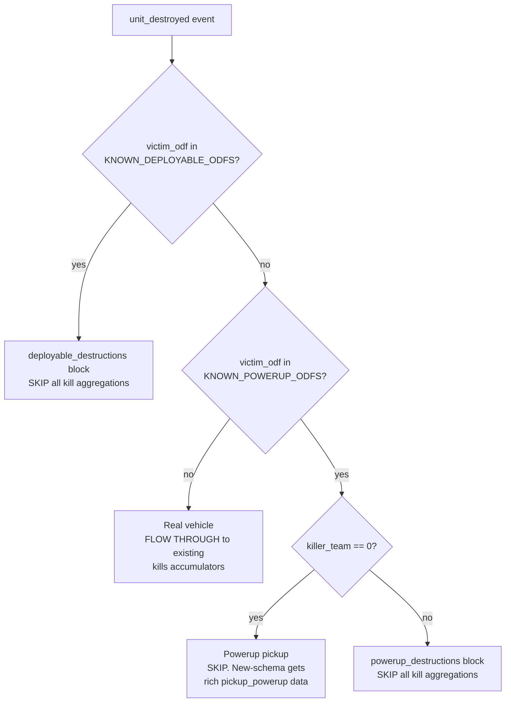

# Pickup / powerup / deployable semantics

Reference doc for the four-way classification of `unit_destroyed` events that
the pipeline applies to disentangle real combat kills from powerup pickups,
powerup/crate destructions, and deployable detonations.

Linked from:

- [.cursor/rules/data-schema.mdc](../.cursor/rules/data-schema.mdc)
- [DEVELOPER_GUIDE.md](../DEVELOPER_GUIDE.md)
- [scripts/process_stats.py](../scripts/process_stats.py) helper `_load_known_powerup_odfs(odf_db)` + constant `KNOWN_DEPLOYABLE_ODFS`
- [scripts/audit_pickup_powerup.mjs](../scripts/audit_pickup_powerup.mjs) (verification tool)

## Background

The `statsgate.proto` schema added a `PickupPowerup` event in April 2026 that
records crate / pod pickups with picker + powerup context. Before that
addition, the BZCC engine emitted a synthetic `UnitDestroyed` event when a
player picked up a crate, with `killer_team == 0` (no real "killer") and
`victim_odf` set to the powerup's ODF string. The new `PickupPowerup` event
*supplements* but does not *replace* this synthetic destruction: in
new-schema sessions, the engine still emits the fake `UnitDestroyed` for the
same tick.

This doc captures the empirical evidence and the resulting classification
rule the pipeline applies uniformly to old AND new sessions.

## The four buckets

Every `unit_destroyed` event is classified in the
[scripts/process_stats.py](../scripts/process_stats.py) event loop into one
of four categories. The classification happens at the very top of the
`unit_destroyed` branch, before any kill / vehicle-destruction accumulator
touches the event:



Categorical effect on per-match output:

| Bucket | `kills.*` | New JSON block | Notes |
|---|---|---|---|
| Real vehicle | full passthrough | none | Existing accumulators untouched |
| Powerup pickup | suppressed | `pickups.feed[]` (new-schema only, populated from real `pickup_powerup` events) | Synthetic `unit_destroyed` companion is silently dropped |
| Powerup/crate destruction | suppressed | `powerup_destructions.{feed,by_player,by_odf,totals}` | Real player shot the powerup before someone picked it up, effectively denying the enemy economy |
| Deployable destruction | suppressed | `deployable_destructions.{by_player,by_odf,totals}` | No `feed` (too noisy) |

## Evidence

Audit script [scripts/audit_pickup_powerup.mjs](../scripts/audit_pickup_powerup.mjs)
walks every `data/sessions/**/*.binpb.gz` and histograms `unit_destroyed`
events by `(victim_odf, killer_team == 0)`.

Headline findings from the initial corpus (47 sessions, 24 new-schema +
23 old-schema):

- `killer_team == 0` is a near-perfect pickup discriminator. 18 distinct
  ODFs show >=80% team-zero (mostly 87-100%), all matching the BZCC
  powerup naming convention (`ap*` American, `ep*` Erstwhile, `fp*` Furie).
- Real combat ODFs (`*scout*`, `*tank*`, `*scav*`, structures) all sit at
  0-5% team-zero (noise floor).
- The engine continues to double-emit in new-schema matches:
  `apserv_vsr.odf` shows 89% team-zero in NEW-schema matches (vs 87% in
  OLD-schema). The classification flow's powerup-pickup branch
  transparently handles this; no separate dedup needed.
- Real-combat powerup destructions (~10-15% of powerup
  `unit_destroyed` events) have a non-zero killer_team. These are the
  data behind the `powerup_destructions` block.

### IMPORTANT: domain knowledge required

`fball2c.odf` (a deployable flame mine) shows **79% team-zero** in the
audit. By the team-zero threshold alone it looks powerup-shaped, but it is
**NOT** a powerup -- it's a ground-deployed utility that self-detonates,
expires, or gets shot. It belongs in `KNOWN_DEPLOYABLE_ODFS`, not the DB
Powerup bucket. (Verified: `fball2c.odf` is absent from
`data/odf.min.json -> Powerup` -- the DB and domain knowledge agree it's
not a powerup.)

Future maintainers extending the deployable set or recommending DB updates
must apply domain knowledge about the BZCC entity in question:

- **Collectible item** (gives the picker a powerup / weapon): should be in
  `data/odf.min.json -> Powerup`. The pipeline picks it up automatically.
  If a real powerup is missing from the DB, extend the DB upstream.
- **Deployable utility** (mine, decoy, smoke pot): goes into
  `KNOWN_DEPLOYABLE_ODFS` in [scripts/process_stats.py](../scripts/process_stats.py).
  Cross-reference [data/odf.min.json](../data/odf.min.json) for `wpnName`
  containing "Mine", "Bait", "Decoy".
- **Real combat unit** (vehicle, structure, soldier): leave it out of both
  sets. The pipeline routes it through existing kill accumulators.

Do **not** auto-promote based on the team-zero signal alone.

## Authoritative source: `data/odf.min.json -> Powerup`

`KNOWN_POWERUP_ODFS` is built by `_load_known_powerup_odfs(odf_db)` in
[scripts/process_stats.py](../scripts/process_stats.py) on every pipeline
run from the same DB the dashboard uses. The current DB carries **159
Powerup entries** (run `Get-Content data/odf.min.json | ConvertFrom-Json |
ForEach-Object { $_.Powerup.PSObject.Properties.Name.Count }` to verify).

Every entry has a `GameObjectClass.unitName` field that yields the
friendly display name (e.g. `apchain.odf` -> "Chain Gun",
`apserv.odf` -> "Service Pod"). The `powerup_display_name(odf)` closure in
`process_match` consumes these names and suffixes " Powerup" to
disambiguate from the same-named weapon ordnance:

- `apchainvsr.odf` (powerup pod) -> "Chain Gun Powerup"
- `apchain.odf` (the weapon ordnance the pod grants) -> "Chain Gun"
  (unchanged via `prettify_odf` for kill feeds)

### Why the hand-curated 18-entry set was insufficient

The audit-derived set used a `total >= 5, team_zero >= 80%` threshold and
missed 5 ODFs the engine itself emitted `pickup_powerup` events for in the
new-schema sessions:

| ODF | Pickup events | DB unit_name |
|---|---:|---|
| `apshellgun.odf` | 5 | (in DB) |
| `applasvsr.odf` | 3 | (in DB) |
| `apdefl.odf` | 2 | "Deflection" |
| `apmdmgvsr.odf` | 2 | "MDM Mortar" |
| `apsplasmavsr.odf` | 2 | (in DB) |
| `apquilvsr.odf` | 2 | (in DB) |
| `apfafmvsr.odf` | 2 | "FAF Missile" |

These are now correctly classified by the DB-derived approach without any
manual constant edit.

### `_strip_vsr_suffix` fallback

VSR-mod ODFs typically inherit from stock parents at runtime via the
`[GameObjectClass]\nbaseName` ODF directive, but the flattened DB doesn't
capture inheritance. `_load_known_powerup_odfs` synthesizes both `*vsr.odf`
and `*_vsr.odf` variants for every Powerup-bucket entry, expanding 159 ->
~437 entries. `powerup_display_name` additionally falls back to
`_strip_vsr_suffix(odf)` lookup when the variant isn't in the bucket
directly.

**Highest-volume case**: `apserv_vsr.odf` is absent from `Powerup` directly,
but the strip-vsr fallback resolves it via stock `apserv.odf` ->
"Service Pod" -> "Service Pod Powerup". This single ODF accounts for
**110,589 `pickup_powerup` events** in the current corpus -- by far the
dominant pickup ODF -- so the fallback is the highest-volume code path.

## Current `KNOWN_DEPLOYABLE_ODFS` (1 entry, hand-curated)

| ODF | Team-zero % | Total | Notes |
|---|---:|---:|---|
| `fball2c.odf` | 78.7% | 705 | Flame mine. Curated by domain knowledge; absent from DB Powerup bucket. |

## Reproducibility

```sh
npm install --no-save protobufjs@7   # one-off, gitignored
node scripts/audit_pickup_powerup.mjs
```

Outputs:
- `_investigation/output/pickup_powerup_histogram.json` (machine-readable)
- `_investigation/output/pickup_powerup_histogram.txt` (human-readable)

## Maintenance trigger

Re-run the audit when:

- A new map / mod ships and the dashboard surfaces unfamiliar ODFs in
  `kills.by_vehicle` or in player K/D rankings that "shouldn't be there".
- The reprocessing diff shows large unexplained `kills.by_vehicle` totals.

Procedure:

1. Run the audit script. It surfaces "promotion candidates" -- ODFs with
   team-zero >= 80% and total >= 5 that are NOT in either set (DB-derived
   or hand-curated).
2. For each candidate, apply domain knowledge:
   - **Collectible powerup**: extend `data/odf.min.json -> Powerup`
     upstream so the DB picks it up. The pipeline's
     `_load_known_powerup_odfs` will pick up the change on next run.
   - **Deployable utility (mine, decoy)**: add to `KNOWN_DEPLOYABLE_ODFS`
     in [scripts/process_stats.py](../scripts/process_stats.py).
   - **Real combat unit**: leave it alone -- the audit threshold is just
     a heuristic; some weird edge cases are legitimately combat events.
3. Run `python scripts/process_stats.py` to reprocess.

## Engine emission semantics (verified by audit)

For powerups in NEW-schema sessions:

```
tick T: PickupPowerup { picker, powerup_odf, ... }      <-- new event, real data
tick T: UnitDestroyed { victim_odf=powerup_odf, killer_team=0, killer=0 }  <-- synthetic companion
```

The pipeline classifies the synthetic `UnitDestroyed` into the powerup-pickup
branch (suppressed) and consumes the real `PickupPowerup` event for
`pickups.feed`. No deduplication state machine is required.

For powerups in OLD-schema sessions:

```
tick T: UnitDestroyed { victim_odf=powerup_odf, killer_team=0, killer=0 }  <-- only signal
```

The classification rule applies identically. `pickups.feed` is empty
(`pickups.has_pickup_data == false`) but `powerup_destructions` still
populates from the ~10-15% of powerup destructions that had a real killer.
