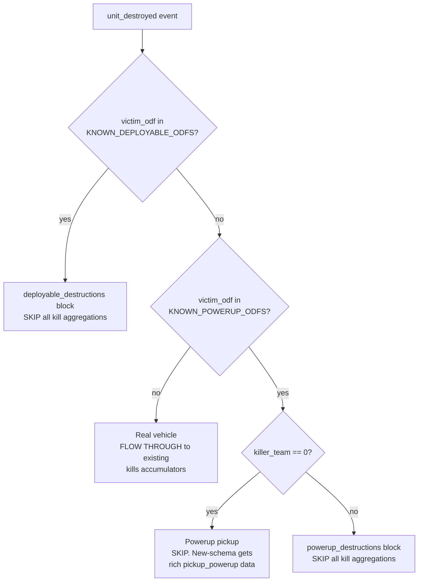

# Pickup / powerup / deployable semantics

Reference doc for the four-way classification of `unit_destroyed` events that
the pipeline applies to disentangle real combat kills from powerup pickups,
powerup denials, and deployable detonations.

Linked from:

- [.cursor/rules/data-schema.mdc](../.cursor/rules/data-schema.mdc)
- [DEVELOPER_GUIDE.md](../DEVELOPER_GUIDE.md)
- [scripts/process_stats.py](../scripts/process_stats.py) constants `KNOWN_POWERUP_ODFS` + `KNOWN_DEPLOYABLE_ODFS`

## Background

The `statsgate.proto` schema added a `PickupPowerup` event in April 2026 that
records crate / pod pickups with picker + powerup context. Before that
addition, the BZCC engine emitted a synthetic `UnitDestroyed` event when a
player picked up a crate, with `killer_team == 0` (no real "killer") and
`victim_odf` set to the powerup's ODF string. The new `PickupPowerup` event
*supplements* but does not *replace* this synthetic destruction: in
new-schema sessions, the engine still emits the fake `UnitDestroyed` for the
same tick.

This doc captures the empirical evidence and the resulting classification
rule the pipeline applies uniformly to old AND new sessions.

## The four buckets

Every `unit_destroyed` event is classified in the
[scripts/process_stats.py](../scripts/process_stats.py) event loop into one
of four categories. The classification happens at the very top of the
`unit_destroyed` branch, before any kill / vehicle-destruction accumulator
touches the event:



Categorical effect on per-match output:

| Bucket | `kills.*` | New JSON block | Notes |
|---|---|---|---|
| Real vehicle | full passthrough | none | Existing accumulators untouched |
| Powerup pickup | suppressed | `pickups.feed[]` (new-schema only, populated from real `pickup_powerup` events) | Synthetic `unit_destroyed` companion is silently dropped |
| Powerup denial | suppressed | `powerup_destructions.{feed,by_player,by_odf,totals}` | Real player shot the powerup before someone picked it up |
| Deployable destruction | suppressed | `deployable_destructions.{by_player,by_odf,totals}` | No `feed` (too noisy) |

## Evidence

Audit script [scripts/audit_pickup_powerup.mjs](../scripts/audit_pickup_powerup.mjs)
walks every `data/sessions/**/*.binpb.gz` and histograms `unit_destroyed`
events by `(victim_odf, killer_team == 0)`.

Headline findings from the initial corpus (47 sessions, 24 new-schema +
23 old-schema):

- `killer_team == 0` is a near-perfect pickup discriminator. 18 distinct
  ODFs show >=80% team-zero (mostly 87-100%), all matching the BZCC
  powerup naming convention (`ap*` American, `ep*` Erstwhile, `fp*` Furie).
- Real combat ODFs (`*scout*`, `*tank*`, `*scav*`, structures) all sit at
  0-5% team-zero (noise floor).
- The engine continues to double-emit in new-schema matches:
  `apserv_vsr.odf` shows 89% team-zero in NEW-schema matches (vs 87% in
  OLD-schema). The classification flow's powerup-pickup branch
  transparently handles this; no separate dedup needed.
- Real-combat powerup destructions (~10-15% of powerup
  `unit_destroyed` events) have a non-zero killer_team. These are the
  data behind the `powerup_destructions` (denial) block.

### IMPORTANT: domain knowledge required

`fball2c.odf` (a deployable flame mine) shows **79% team-zero** in the
audit. By the team-zero threshold alone it looks powerup-shaped, but it is
**NOT** a powerup -- it's a ground-deployed utility that self-detonates,
expires, or gets shot. It belongs in `KNOWN_DEPLOYABLE_ODFS`, not
`KNOWN_POWERUP_ODFS`.

Future maintainers extending these constants must apply domain knowledge
about the BZCC entity in question:

- **Collectible item** (gives the picker a powerup / weapon): goes into
  `KNOWN_POWERUP_ODFS`. Match the `ap*` / `ep*` / `fp*` naming convention.
- **Deployable utility** (mine, decoy, smoke pot): goes into
  `KNOWN_DEPLOYABLE_ODFS`. Cross-reference [data/odf.min.json](../data/odf.min.json)
  for `wpnName` containing "Mine", "Bait", "Decoy".
- **Real combat unit** (vehicle, structure, soldier): leave it out of both
  sets. The pipeline routes it through existing kill accumulators.

Do **not** auto-promote based on the team-zero signal alone.

## Current `KNOWN_POWERUP_ODFS` (18 entries)

| ODF | Team-zero % | Total |
|---|---:|---:|
| `apserv_vsr.odf` | 87.0% | 2456 |
| `apchainvsr.odf` | 88.9% | 171 |
| `apshdwvsr.odf` | 83.7% | 49 |
| `apsnipvsr.odf` | 89.6% | 48 |
| `apeburst.odf` | 100.0% | 48 |
| `apslicer.odf` | 85.3% | 34 |
| `aplasevsr.odf` | 92.6% | 27 |
| `epsnip_vsr.odf` | 83.3% | 18 |
| `aptaggvsr.odf` | 84.6% | 13 |
| `apdragb.odf` | 100.0% | 9 |
| `apcphan.odf` | 87.5% | 8 |
| `apblst.odf` | 100.0% | 7 |
| `apredfvsr.odf` | 100.0% | 6 |
| `apsonicvsr.odf` | 100.0% | 6 |
| `approxvsr.odf` | 100.0% | 6 |
| `apphanvsr.odf` | 80.0% | 5 |
| `fpsnipvsr.odf` | 100.0% | 5 |
| `aplockvsr.odf` | 100.0% | 5 |

## Current `KNOWN_DEPLOYABLE_ODFS` (1 entry)

| ODF | Team-zero % | Total | Notes |
|---|---:|---:|---|
| `fball2c.odf` | 78.7% | 705 | Flame mine. Curated by domain knowledge despite high team-zero. |

## Reproducibility

```sh
npm install --no-save protobufjs@7   # one-off, gitignored
node scripts/audit_pickup_powerup.mjs
```

Outputs:
- `_investigation/output/pickup_powerup_histogram.json` (machine-readable)
- `_investigation/output/pickup_powerup_histogram.txt` (human-readable)

## Maintenance trigger

Re-run the audit when:

- A new map / mod ships and the dashboard surfaces unfamiliar ODFs in
  `kills.by_vehicle` or in player K/D rankings that "shouldn't be there".
- The reprocessing diff shows large unexplained `kills.by_vehicle` totals.

Procedure:

1. Run the audit script. It surfaces "promotion candidates" -- ODFs with
   team-zero >= 80% and total >= 5 that are NOT in either constant.
2. For each candidate, look up the ODF in [data/odf.min.json](../data/odf.min.json)
   to determine its category (collectible powerup vs deployable utility
   vs real combat unit).
3. Add to the appropriate frozenset in
   [scripts/process_stats.py](../scripts/process_stats.py) and append a row
   to the corresponding table above.
4. Run `python scripts/process_stats.py` to reprocess.

## Engine emission semantics (verified by audit)

For powerups in NEW-schema sessions:

```
tick T: PickupPowerup { picker, powerup_odf, ... }      <-- new event, real data
tick T: UnitDestroyed { victim_odf=powerup_odf, killer_team=0, killer=0 }  <-- synthetic companion
```

The pipeline classifies the synthetic `UnitDestroyed` into the powerup-pickup
branch (suppressed) and consumes the real `PickupPowerup` event for
`pickups.feed`. No deduplication state machine is required.

For powerups in OLD-schema sessions:

```
tick T: UnitDestroyed { victim_odf=powerup_odf, killer_team=0, killer=0 }  <-- only signal
```

The classification rule applies identically. `pickups.feed` is empty
(`pickups.has_pickup_data == false`) but `powerup_destructions` still
populates from the ~10-15% of powerup destructions that had a real killer.
