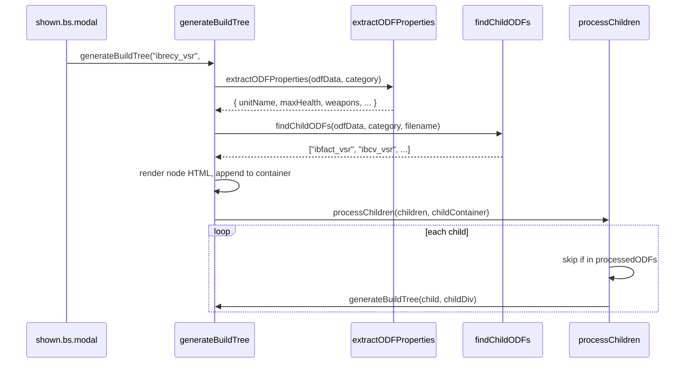

# ODF Browser — Build Tree Technical Specification

> **Audience:** A developer (or Claude instance) reimplementing the ODF Browser in a new codebase, with zero context about the original bz2vsr project.
>
> **Scope:** This document covers only the Build Tree feature. The main spec is [`ODFBrowser_TechSpec.md`](ODFBrowser_TechSpec.md). The Build Tree is an **optional** feature — the core ODF Browser (sidebar, detail view, search, compare) works independently of it.

---

## 1. Purpose

The Build Tree visualizes the **technology progression** (tech tree) for each of the three factions in the **Battlezone II: Combat Commander VSR mod**. It shows what a faction can construct, and what those constructions can further build, starting from each faction's Recycler (the base building).

In BZ2 VSR, three factions exist: **ISDF**, **Hadean**, and **Scion**. Each has a unique recycler ODF that is the root of its build tree. The feature is displayed in a fullscreen modal, with one column per faction rendered side by side.

The build tree does not exist as stored data — it is computed at runtime by recursively walking the ODF data graph starting from three hardcoded root ODFs.

---

## 2. Data Inputs

The build tree reads exclusively from the `odf.min.json` data already loaded by the ODF Browser. It uses these specific key paths within ODF objects:

| Source Class Key | Description |
|---|---|
| `FactoryClass.buildItem1` … `buildItem10` | Items a factory building can produce |
| `ConstructionRigClass.buildItem1` … `buildItem10` | Items the construction rig (recycler) can build |
| `ArmoryGroup1.buildItem1` … up to `ArmoryGroup5.buildItem10` | Items in armory upgrade groups |
| `GameObjectClass.weaponName1` … `weaponName10` | Weapons equipped to a vehicle |
| `GameObjectClass.upgradeName` | Upgrade building (used in two special cases only) |

All key names are read **exactly as stored in the merged ODF object** — they are already inheritance-resolved by the build pipeline. No further inheritance resolution is needed at runtime.

Value format: ODF filename **without** the `.odf` extension (e.g., `"ibgtow"` refers to `ibgtow.odf`).

---

## 3. Root Selection

The build tree always renders exactly three trees — one per faction. The roots are **hardcoded** by ODF filename:

| Faction | Root ODF name | Notes |
|---|---|---|
| ISDF | `ibrecy_vsr` | ISDF VSR Recycler |
| Hadean | `ebrecym_vsr` | Hadean VSR Recycler |
| Scion | `fbrecy_vsr` | Scion VSR Recycler |

**Search behavior:** The root is found by iterating all categories in the data and doing a **case-insensitive filename match** — checking both `ibrecy_vsr.odf` and bare `ibrecy_vsr` against each ODF key. This is done in `generateBuildTree()` in `js/odf.js`.

If a root ODF is not found in the data, the column renders an `alert-danger` error message.

---

## 4. Recursion Algorithm

`generateBuildTree(odfName, containerElement)` is the entry point. It is called once per faction on `shown.bs.modal` of the build tree modal.

```
generateBuildTree(odfName, container):
  1. Find odfData by case-insensitive search across all categories
  2. If not found → render error, return
  3. Extract display properties (extractODFProperties)
  4. Find child ODF names (findChildODFs) → returns string[]
  5. Create node HTML (collapsible alert + optional caret)
  6. Append node to container
  7. For each child in children:
     a. Skip if already in processedODFs Set
     b. Add to processedODFs Set
     c. Find child's category
     d. If parent is Vehicle AND child is Weapon → SKIP (do not recurse)
     e. Create a child div, append to childContainer
     f. Call generateBuildTree(child, childDiv)  ← recursion
```

**Important:** `processedODFs` is created fresh for each top-level faction tree call in `showBuildTree()` → `generateBuildTree()`. It is **not** shared across factions. Each faction gets its own cycle-prevention set scoped to that single call chain.

The actual implementation passes `processedODFs` through a closure (`processChildren` inner function), not as a parameter to `generateBuildTree` itself, which means each top-level call creates its own set.



---

## 5. Child Resolution Rules

`findChildODFs(odfData, category, filename)` returns a `Set` (converted to array) of child ODF names. It walks these paths in order:

| Priority | Class Key | Loop | Max children |
|---|---|---|---|
| 1 | `FactoryClass.buildItem{N}` | N = 1…10 | 10 |
| 2 | `ConstructionRigClass.buildItem{N}` | N = 1…10 | 10 |
| 3 | `GameObjectClass.weaponName{N}` | N = 1…10 | 10 |
| 4 | `ArmoryGroup{G}.buildItem{N}` | G = 1…5, N = 1…10 | 50 |
| 5 | `GameObjectClass.upgradeName` | Special cases only (see §8) | 1 |

Values are added as-is (without `.odf` extension). Null/undefined values are silently skipped (`addChild` checks `if (!name) return`).

A `Set` is used internally so duplicates are automatically deduplicated (e.g., a weapon that appears in multiple weapon slots is counted once in the tree structure, though its display count is tracked separately for the properties panel).

---

## 6. Cycle Prevention

A `Set<string>` named `processedODFs` is maintained inside a closure in `generateBuildTree`. Before recursing into a child, the system checks:

```js
if (processedODFs.has(child)) return;
processedODFs.add(child);
```

This prevents infinite recursion in cases where ODF A builds ODF B which builds ODF A. The set is keyed by the child ODF name string (as returned by `findChildODFs`, without `.odf` extension).

**Scope:** One set per top-level faction tree. ISDF, Hadean, and Scion trees do not share their sets.

---

## 7. Skip Rules

One category-relationship skip rule exists:

> **If the current parent node is category `Vehicle` AND a child ODF is category `Weapon`, skip that child.**

This prevents weapons from appearing as child nodes under vehicles in the tree. Vehicles list their weapons via `weaponName1..10` — those weapons are displayed in the vehicle's **properties panel** (as the weapons list), not as tree children.

The skip is applied in `processChildren`:
```js
if (!(category === 'Vehicle' && childCategory === 'Weapon')) {
    // recurse into child
}
```

Where `category` is the **parent's** category and `childCategory` is resolved by searching all data categories for the child filename.

---

## 8. Special-Case Upgrade Handling

`upgradeName` is the only key that is **conditionally** followed — only for two specific buildings:

| Condition | ODF | Building |
|---|---|---|
| `odfData.GameObjectClass.baseName?.toLowerCase() === 'ebfact'` | Hadean Xenomator factory | Follows `upgradeName` to its upgraded form |
| `odfData.GameObjectClass.baseName?.toLowerCase() === 'fbkiln'` | Scion Kiln | Follows `upgradeName` |
| `filename.toLowerCase().includes('fbkiln_vsr')` | Scion Kiln VSR variant | Additional filename-based check |

For all other ODFs, `upgradeName` is **not** followed in the build tree (even if the property exists). This is intentional — most buildings have upgrade paths that would bloat the tree.

---

## 9. UI Structure

The build tree modal is created dynamically in `initializeBuildTree()` during `ODFBrowser` construction (not from HTML), using `document.body.insertAdjacentHTML('beforeend', ...)`.

**Modal structure:**
- Fullscreen Bootstrap modal (`modal-fullscreen`)
- Static backdrop (`data-bs-backdrop="static"`) — clicking outside does not close it
- 3-column Bootstrap row — one `col-md-4` per faction
- Each column: faction header (name + logo image) + scrollable `overflow-auto` div for the tree

**Tree node structure** (per ODF):
```
<div class="build-tree-node mb-3">
  <div class="d-flex align-items-center gap-2">
    <div class="alert alert-{categoryColor}" [data-bs-toggle="collapse" data-bs-target="#collapse-{id}"]>
      <span class="fw-bold">{unitName}</span>           ← visible label
      <div class="collapse" id="collapse-{id}">         ← expanded properties panel
        <div class="build-tree-properties small">
          {formatTreeProperties output}
        </div>
        <button "View Full Data">                        ← navigates to detail view
      </div>
    </div>
    [<button data-bs-toggle="collapse" data-bs-target="#children-{id}">  ← caret, if hasCollapsibleChildren]
  </div>
  [<div class="build-tree-children collapse" id="children-{id}">         ← child nodes, if any
    {child build-tree-node divs}
  </div>]
</div>
```

**Collapse ID generation:** `collapseId = "collapse-" + filename.replace(/\W/g, '')` — non-word characters stripped from filename to make a valid HTML id.

**"View Full Data" button behavior:** Hides the modal, calls `browser.displayODFData(category, filename)`, and updates the sidebar active selection. Implemented as an inline `onclick` string (a known code quality issue).

---

## 10. Expansion Default Behavior

| Condition | Children collapsed by default? |
|---|---|
| ODF filename contains `"brecy"` (recyclers: `ibrecy_vsr`, `ebrecym_vsr`, `fbrecy_vsr`) | **Expanded** (`show` class on children div) |
| ODF is a `FactoryClass`, `ConstructionRigClass`, or `ArmoryClass` node with children | **Collapsed** (caret button shown, children div without `show`) |
| All other nodes with children | **Always expanded** (no caret button, `show` class always applied) |

The check `isBaseODF = filename.toLowerCase().includes('brecy')` determines whether the recycler-level children are auto-expanded.

`hasCollapsibleChildren` is true when the node is a factory/rig/armory OR is the base recycler, AND has at least one child. Only nodes with `hasCollapsibleChildren === true` get the caret toggle button.

---

## 11. Properties Displayed Per Node

`extractODFProperties(odfData, category)` returns a flat object of display properties from the ODF data:

**Common (all categories):**

| Property | Source key |
|---|---|
| `unitName` | `GameObjectClass.unitName` |
| `maxHealth` | `GameObjectClass.maxHealth` |
| `scrapValue` | `GameObjectClass.scrapValue` |
| `scrapCost` | `GameObjectClass.scrapCost` |
| `armorClass` | `GameObjectClass.armorClass` |

**Vehicle-specific (when `category === 'Vehicle'`):**

| Property | Source key |
|---|---|
| `customCost` | `GameObjectClass.customCost` |
| `buildTime` | `GameObjectClass.buildTime` |
| `customTime` | `GameObjectClass.customTime` |
| `maxAmmo` | `GameObjectClass.maxAmmo` |
| `isAssault` | `GameObjectClass.isAssault` |
| `engageRange` | `CraftClass.engageRange` |
| `topSpeed` | `CraftClass.topSpeed` |
| `weapons` | Computed (see §12) |

**Building-specific (when `category === 'Building'`):**

| Property | Source key |
|---|---|
| `powerCost` | `GameObjectClass.powerCost` |
| `buildSupport` | `GameObjectClass.buildSupport` |
| `buildRequire` | `GameObjectClass.buildRequire` |
| `powerName` | `PoweredBuildingClass.powerName` (if present) |

---

## 12. Weapon Display Logic

For Vehicle nodes, weapons are collected from `GameObjectClass.weaponName1` through `weaponName10`. For each weapon:

1. Look up `data['Weapon'][weaponFile + '.odf']` (adds `.odf` if not already present)
2. Get display name: `WeaponClass.wpnName` or fall back to the filename
3. Determine assault/combat badge: `WeaponClass.isAssault === "1"` → `"A"`, otherwise `"C"`
4. Prepend: `<span class="text-warning fw-bold">A</span> | {displayName}` or `C | {displayName}`
5. Count duplicates using a `Map<displayName, count>` — if a weapon appears multiple times (same weapon in multiple weapon slots), it is shown once with a `×N` suffix: e.g., `C | Machine Gun ×2`

The final `properties.weapons` is an array of formatted display strings.

**Rendering:** Each weapon string becomes a Bootstrap `alert alert-secondary d-inline-block` pill inside the properties panel.

---

## 13. Color Coding

`getCategoryColor(category, odfData)` maps category name to a Bootstrap color name:

| Category | Bootstrap color | Rendered as |
|---|---|---|
| `Vehicle` | `primary` | Blue alert/button |
| `Building` | `warning` | Yellow/amber alert |
| `Weapon` | `secondary` | Gray alert |
| `Powerup` | `success` | Green alert |
| `Pilot` | `info` | Teal alert |
| (any other) | `secondary` | Gray |

The color is used in `alert-{color}` and `btn-{color}` classes on the node element.

---

## 14. Known Quirks

1. **Hardcoded faction roots.** The three recycler ODF names are strings in the source code. Any non-VSR mod with different recycler names would require a code change. Consider making the roots configurable (e.g., a JSON config or query param).

2. **`odfData` is `undefined` check missing.** `extractODFProperties` and `findChildODFs` do not guard against missing sub-keys beyond optional chaining on `GameObjectClass`. If a non-standard ODF lacks expected class objects, properties silently resolve to `undefined` and are skipped in display — this is acceptable but should be noted.

3. **Inline `onclick` string in "View Full Data" button.** The button uses a hardcoded `onclick` attribute with escaped quotes for the filename. This breaks if a filename contains a single quote. All current BZ2 ODF filenames are alphanumeric + underscore so this is not currently triggered, but is fragile.

4. **`data-bs-parent` attribute on collapse.** Each properties collapse uses `data-bs-parent="#children-{id}"` which attempts accordion behavior — but this ID refers to the children container, not a common ancestor. In practice this may not behave as intended; the accordion grouping is essentially broken but harmless since nodes open/close independently.

5. **No lazy rendering.** All three faction trees are rendered synchronously on `shown.bs.modal`. For large mods with many buildings, this could block the UI thread for several hundred milliseconds. Consider `requestIdleCallback` or chunked rendering for future optimization.

6. **No search/filter inside the build tree.** The modal has no search input; users must visually scan the tree.

---

## 15. Porting Notes

**Must port (functional logic):**
- The `generateBuildTree` recursion with `processedODFs` cycle prevention
- `findChildODFs` — the exact key paths walked (§5), including the 1…10 loop range and ArmoryGroup1…5 grouping
- The Vehicle+Weapon skip rule (§7)
- The two special-case `upgradeName` conditions (§8): `baseName === 'ebfact'`, `baseName === 'fbkiln'`, filename contains `fbkiln_vsr`
- `extractODFProperties` property extraction rules (§11)
- Weapon display logic with A/C badge and duplicate counting (§12)

**Depends on the same data contract:**
The build tree reads from the same `odf.min.json` that the rest of the browser uses. No additional data source is needed. The `Weapon` category lookup for weapon display names requires that category to exist in the loaded data.

**UI is fully replaceable:**
The tree node HTML structure (§9) uses Bootstrap 5 collapse + alerts. In a new framework (React, Vue, Svelte, etc.), this entire rendering layer can be replaced with components. The recursion algorithm and data extraction logic are the only pieces that must be preserved in spirit.

**Faction roots can be passed as configuration:**
Rather than hardcoding the three ODF names, a reimplementation could accept them as a config object, making the build tree reusable for any BZ2 mod:
```js
const FACTION_ROOTS = [
    { name: 'ISDF', odf: 'ibrecy_vsr', logo: './img/ISDF-Logo.png' },
    { name: 'Hadean', odf: 'ebrecym_vsr', logo: './img/Hadean-Logo.png' },
    { name: 'Scion', odf: 'fbrecy_vsr', logo: './img/Scion-Logo2.png' },
];
```
