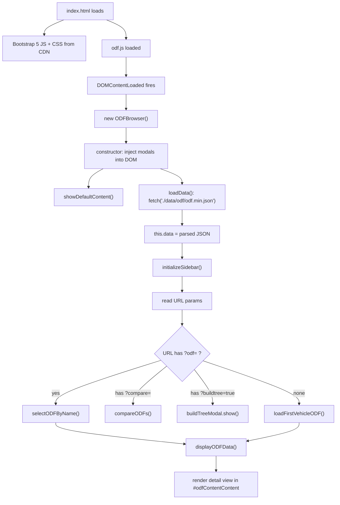
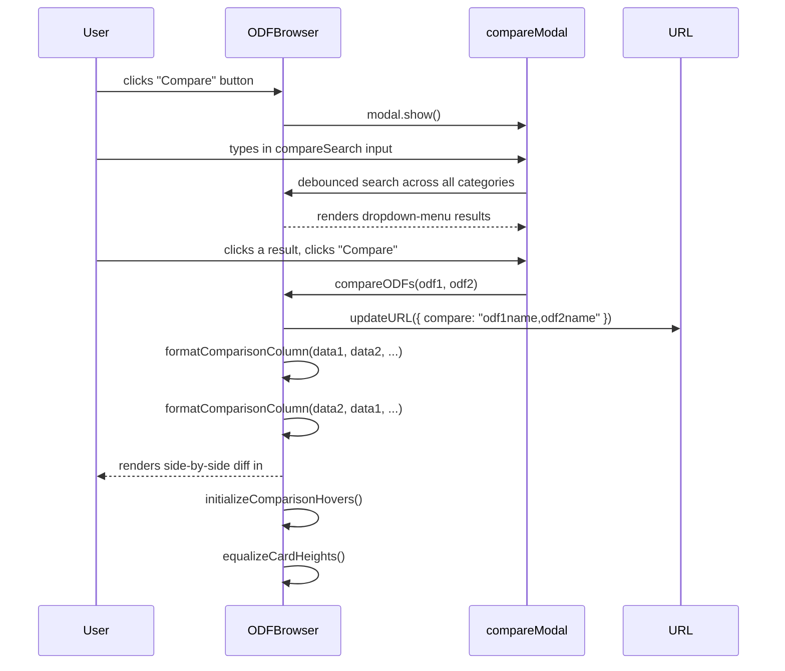
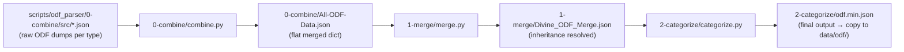

# ODF Browser — Technical Specification

> **Audience:** A developer (or Claude instance) reimplementing the ODF Browser in a new codebase with its own styling/CSS. This document assumes you have access to the files in this `odf-browser-seed/` folder and zero other context about the original bz2vsr project.
>
> **Key upfront note:** `demo-only-style.css` and the images in `img/` are included so the seed *looks* like the live site. They are **NOT port requirements**. See §10 (Demo-Only Assets) for the full list of what you can drop safely. Everything else is a functional requirement.

---

## Table of Contents

1. [File Inventory](#1-file-inventory)
2. [Runtime Architecture](#2-runtime-architecture)
3. [Data Contract: odf.min.json](#3-data-contract-odfminjson)
4. [Build Pipeline (Data Generation)](#4-build-pipeline-data-generation)
5. [Feature Catalog](#5-feature-catalog)
   - 5.1 Sidebar
   - 5.2 Detail View
   - 5.3 Property Filter
   - 5.4 Compare Mode
   - 5.5 URL Routing
   - 5.6 Smart ODF Cross-Linking
   - 5.7 Audio Preview
   - 5.8 Keyboard Shortcuts
   - 5.9 Right-Click Context Menu
   - 5.10 Inline Popovers
   - 5.11 Inheritance Chain Display
6. [Build Tree (Optional Feature)](#6-build-tree-optional-feature)
7. [External Dependencies](#7-external-dependencies)
8. [Path & Asset References](#8-path--asset-references)
9. [Known Bugs & Tech Debt](#9-known-bugs--tech-debt)
10. [Demo-Only Assets](#10-demo-only-assets)
11. [Porting Guide](#11-porting-guide)
12. [Optimization Suggestions](#12-optimization-suggestions)

---

## 1. File Inventory

| File | Role | Original bz2vsr path | Port requirement? | Modified in seed? |
|---|---|---|---|---|
| `index.html` | UI shell — HTML structure only, no logic | `odf/index.html` | Yes (structure) | Yes — dead deps removed, Bootstrap from CDN, paths made relative |
| `js/odf.js` | Entire `ODFBrowser` class (~2,493 lines) | `js/odf.js` | **Yes** | Yes — 4 paths rewritten to relative |
| `data/odf/odf.min.json` | Pre-processed ODF data (~1.6 MB) | `data/odf/odf.min.json` | **Yes** | No |
| `data/audio/*.wav` | 633 game audio files for inline playback | `data/audio/*.wav` | Yes (if audio preview needed) | No |
| `img/logo.png` | Navbar logo | `img/logo.png` | No — demo-only | No |
| `img/ISDF-Logo.png` | ISDF faction logo in build tree modal | `img/ISDF-Logo.png` | No — demo-only | No |
| `img/Hadean-Logo.png` | Hadean faction logo in build tree modal | `img/Hadean-Logo.png` | No — demo-only | No |
| `img/Scion-Logo2.png` | Scion faction logo in build tree modal | `img/Scion-Logo2.png` | No — demo-only | No |
| `demo-only-style.css` | All custom CSS (renamed from `css/main.css`) | `css/main.css` | **No — demo-only** | No (content unchanged) |
| `scripts/odf_parser/` | Python pipeline to regenerate `odf.min.json` | `scripts/odf_parser/` | No (build-time only) | No |
| `ODFBrowser_TechSpec.md` | This document | (new) | No | N/A |
| `ODFBrowser_BuildTree_TechSpec.md` | Build tree sub-spec | (new) | No | N/A |

---

## 2. Runtime Architecture

### Overview

The ODF Browser is a **single-page application** with no backend. All data is loaded once via a single `fetch()` and everything else is computed in the browser.



### Key State

The `ODFBrowser` class instance is stored on `window.browser` (set in `DOMContentLoaded`). This global reference is used by inline `onclick` attributes in dynamically generated HTML (a known code smell — see §9).

Instance state:
- `this.data` — the full parsed JSON from `odf.min.json`
- `this.currentCategory` — the currently active sidebar category tab
- `this.searchTerm` — current sidebar search string
- `this.selectedODF` — `{ category, filename, data }` for the currently displayed ODF
- `this.currentAudio` — the currently playing `Audio` instance (for stop-on-next-play)
- `this.groupedEntries` — grouped property entries for the current detail view (used by property filter)
- `this.comparisonData` — current compare state `{ odf1, odf2, data1, data2, displayName1, displayName2 }`
- `this.buildTreeModal` — Bootstrap `Modal` instance for the build tree
- `this.lastEscapePress` — timestamp of last Escape keypress (for double-Escape detection)

### Sequence: Compare Flow



---

## 3. Data Contract: `odf.min.json`

> This is the most important section for a reimplementation. The entire browser is a UI over this JSON file.

### 3.1 Top-Level Structure

```json
{
  "Vehicle":  { "<filename>.odf": <ODFObject>, ... },
  "Weapon":   { "<filename>.odf": <ODFObject>, ... },
  "Pilot":    { "<filename>.odf": <ODFObject>, ... },
  "Building": { "<filename>.odf": <ODFObject>, ... },
  "Ordnance": { "<filename>.odf": <ODFObject>, ... },
  "Powerup":  { "<filename>.odf": <ODFObject>, ... }
}
```

**Category counts (current data):**
- Vehicle: 261 ODFs
- Weapon: 238 ODFs
- Pilot: 9 ODFs
- Building: 261 ODFs
- Ordnance: 200 ODFs
- Powerup: 159 ODFs

All ODF filenames (keys) are lowercase. The `.odf` extension is always present on the key.

### 3.2 ODF Object Shape

Each value is a flat object whose keys are **class section names** from the original BZ2 ODF file format:

```json
{
  "GameObjectClass": {
    "unitName": "Gun Tower",
    "baseName": "ibgtow",
    "classLabel": "turret",
    "scrapCost": "50",
    "scrapValue": "10",
    "maxHealth": "5000",
    "armorClass": "H",
    "weaponName1": "gtower",
    "weaponName2": "gtower",
    "requireName1": "ibcbun"
  },
  "BuildingClass": {},
  "CraftClass": {
    "rangeScan": "250",
    "engageRange": "200",
    "subAttackClass": "ANN"
  },
  "TurretCraftClass": {
    "omegaTurret": "2.0"
  },
  "inheritanceChain": ["turret"]
}
```

**Key conventions:**
- **All values are strings**, even numbers (`"5000"`, `"2.0"`). Numbers with an `f` suffix (e.g., `"1.5f"`) are also strings. The browser parses nothing — it displays values as-is.
- An **empty object `{}`** for a class key means the class applies to this ODF (via inheritance) but has no locally-defined properties.
- `"NULL"` as a value is a valid BZ2 convention meaning "no reference". The browser displays it as a string.

### 3.3 Special Keys

Three keys on the ODF object have special meaning set by the build pipeline — they are NOT class names from original ODF files:

| Key | Type | Description |
|---|---|---|
| `inheritanceChain` | `string[]` | Ordered list of `classLabel` values from most-derived to least-derived. Example: `["turretfull", "turret"]`. Used by the inheritance chain display in the detail view header. |
| `Ordnance.*` | object | Prefixed keys copied from a referenced ordnance ODF. E.g., `"Ordnance.OrdnanceClass"` contains properties from the weapon's projectile ODF. See §3.5. |
| `Powerup.*` | object | Prefixed keys copied from the powerup ODF that references this weapon. E.g., `"Powerup.WeaponPowerupClass"`. See §3.5. |

### 3.4 Category-to-Class-Marker Map

The build pipeline determines a category by looking for a specific class key:

| Category | Primary class key | Notes |
|---|---|---|
| `Vehicle` | `CraftClass` | Craft (vehicle) class presence |
| `Weapon` | `WeaponClass` | Weapon class presence |
| `Pilot` | `PersonClass` | Pilot/person class presence |
| `Building` | `BuildingClass` | Building class presence |
| `Ordnance` | `OrdnanceClass` | Ordnance/projectile class presence |
| `Powerup` | `WeaponPowerupClass` | Powerup class presence |

**Hardcoded special cases** (take priority over the above):

| ODF filename | Assigned category | Reason |
|---|---|---|
| `apwrck.odf` | `Weapon` | Day Wrecker — classified as Vehicle by class structure but is treated as a weapon |
| `apwrckvsr.odf` | `Weapon` | VSR variant of Day Wrecker |
| `apserv.odf` | `Powerup` | Service Pod — classified differently than its class structure suggests |

### 3.5 Cross-Reference Inlining (Ordnance and Powerup Prefixes)

The build pipeline resolves two kinds of cross-references at build time and inlines them into the ODF object:

**Ordnance inlining** (`WeaponClass.ordName` → prefixed `Ordnance.*`):
When a Weapon ODF's `WeaponClass.ordName` references an ordnance ODF (e.g., `"gbolt"` → `gbolt.odf`), all class sections from that ordnance ODF are copied into the weapon object with an `Ordnance.` prefix:
```json
"Ordnance.OrdnanceClass": { "lifespan": "2.5", "speed": "80" },
"Ordnance.Render": { "geometry": "gbolt_gob" }
```

**Powerup inlining** (`WeaponPowerupClass.weaponName` → prefixed `Powerup.*`):
When a Powerup ODF references a Weapon ODF via `weaponName`, all class sections from the powerup are copied into the weapon object with a `Powerup.` prefix:
```json
"Powerup.WeaponPowerupClass": { "weaponName": "gtower", "ammoCount": "20" },
"Powerup.GameObjectClass": { "unitName": "Gun Tower Powerup" }
```

Additionally, if the powerup's `GameObjectClass.unitName` is absent, the pipeline tries to copy the weapon's `WeaponClass.wpnName` as the powerup's display name.

**Why this matters for porting:** The browser does not resolve references at runtime. The `Ordnance.*` and `Powerup.*` sections in `odf.min.json` are already the pre-resolved data. The detail view displays them as grouped sections with an ordnance or powerup icon prefix.

### 3.6 Display Name Resolution

The browser looks for a human-readable name for an ODF in this priority order:
1. `GameObjectClass.unitName` — for vehicles, buildings, pilots, powerups
2. `WeaponClass.wpnName` — for weapons (and powerups that have it via pipeline)
3. Fall back to the ODF filename without `.odf` extension

This is checked in `generateODFList`, `displayODFData`, `compareODFs`, and `extractODFProperties`.

### 3.7 Fully-Annotated Sample ODF Walkthrough

The following is `ibgtow.odf` (ISDF Gun Tower) — a Vehicle ODF — annotated:

```json
"ibgtow.odf": {
  // Standard BZ2 class sections:
  "GameObjectClass": {
    "baseName": "ibgtow",         // base ODF filename this inherits from (classLabel.odf)
    "classLabel": "turret",       // the inheritance parent — see inheritanceChain below
    "unitName": "Gun Tower",      // DISPLAY NAME — used in sidebar and detail view header
    "scrapCost": "50",            // cost to build (in scrap)
    "scrapValue": "10",           // salvage value when destroyed
    "maxHealth": "5000",          // hit points
    "armorClass": "H",            // armor type (H = heavy)
    "isAssault": "1",             // can be used in assault mode
    "requireName1": "ibcbun",     // CROSS-REFERENCE → links to ibcbun.odf in detail view
    "requireText1": "Build Relay Bunker",
    "weaponName1": "gtower",      // CROSS-REFERENCE → links to gtower.odf in detail view
    "weaponName2": "gtower"       // same weapon in slot 2
  },
  "BuildingClass": {},            // empty = presence via inheritance, no local overrides
  "CraftClass": {
    "rangeScan": "250",
    "engageRange": "200",         // SPECIAL POPOVER: context-aware based on subAttackClass
    "CanBailout": "false"
  },
  "TurretCraftClass": {           // subclass of CraftClass for turrets
    "omegaTurret": "2.0"
  },
  "Lod1": {},                     // Level-of-detail section — typically empty, used for grouping
  "inheritanceChain": ["turret"]  // SPECIAL KEY: computed by pipeline from classLabel chain
                                  // "turret" → turret.odf → ... (chain stops when parent not found)
}
```

**This ODF would be displayed in:**
- Category tab: `Vehicle`
- Sidebar display: `Gun Tower  ibgtow` (named first, filename in secondary color)
- Detail view groups: `GameObj` tab, `Craft` tab, `Other` tab (for `Lod1`, `BuildingClass`), `TurretCraftClass` tab; plus an "All" tab

---

## 4. Build Pipeline (Data Generation)

The pipeline produces `odf.min.json` from raw ODF JSON exports. It is a **build-time only** process — the browser never runs it. The current `data/odf/odf.min.json` is the production output.

### 4.1 Pipeline Overview



Run with: `python scripts/odf_parser/Parse-ODF-Data.py` (orchestrates all three stages and copies intermediates).

### 4.2 Stage 0 — Combine (`0-combine/combine.py`)

**Input:** All JSON files in `0-combine/src/`:
- `Vehicle-ODF-Data.json`
- `Building-ODF-Data.json`
- `Weapon-ODF-Data.json`
- `Pilot-ODF-Data.json`
- `DataPak-ODF-Data.json` (ordnances, powerups, misc)

**What it does:**
- Merges all source files into a single flat `{ "filename.odf": <raw ODF object> }` dict
- Lowercases all ODF keys (filenames) and ensures `.odf` extension is present
- Strips surrounding double-quotes from string values (BZ2 ODF format uses `= "value"` syntax, parsed upstream into `"\"value\""`)

**Output:** `0-combine/All-ODF-Data.json`

**To add a new source:** Add a new JSON file to `0-combine/src/`. Must follow the same raw ODF object format.

### 4.3 Stage 1 — Merge (`1-merge/merge.py`)

**Input:** `1-merge/src/All-ODF-Data.json` (copied from stage 0 output)

**What it does:**
1. **Inheritance resolution:** For each ODF, finds `classLabel` in any class section, looks up `{classLabel}.odf` in the full dataset, and deep-merges the parent into the child (child values take priority). Recurses up the chain. Builds `inheritanceChain` list.
2. **Ordnance inlining:** Finds `WeaponClass.ordName` references, copies all class sections from the referenced ordnance ODF with `Ordnance.` prefix.
3. **Powerup inlining:** Finds `WeaponPowerupClass.weaponName` references, copies all class sections from the powerup into the weapon ODF with `Powerup.` prefix. Also infers display name.

**Key behavior:** Deep merge gives **child precedence** — if a child ODF defines `maxHealth = 8000` and its parent defines `maxHealth = 5000`, the merged result is `8000`.

**Cycle detection:** `process_inheritance` tracks a `processed` set to prevent infinite loops.

**Output:** `1-merge/Divine_ODF_Merge.json`

### 4.4 Stage 2 — Categorize (`2-categorize/categorize.py`)

**Input:** `2-categorize/src/Divine_ODF_Merge.json` (copied from stage 1 output)

**What it does:**
- Groups each ODF into a category by checking for the presence of a marker class key (see §3.4)
- Applies the two hardcoded special cases (`apwrck.odf`, `apwrckvsr.odf` → Weapon; `apserv.odf` → Powerup)
- Writes both a pretty-printed and a minified output

**Outputs:**
- `2-categorize/Categorized-ODF-Data.json` (pretty, for debugging)
- `2-categorize/odf.min.json` → manually copy to `data/odf/odf.min.json` to deploy

---

## 5. Feature Catalog

All features are implemented in `js/odf.js` as methods of the `ODFBrowser` class (lines referenced are in the seed's `js/odf.js`).

---

### 5.1 Sidebar

**What it does:** Renders a searchable, tabbed list of all ODFs, grouped by category. Clicking an item loads the detail view.

**Structure:**
- Search input (`#odfSearch`) + Clear button + Reset button
- Category tab bar (`#categoryTabs`) — one tab per category key in the data
- Tab pane per category (`#list-{Category}`) — scrollable list of `.odf-item` buttons

**ODF item rendering** (`generateODFList`, line ~426):
- Named ODFs (those with `GameObjectClass.unitName` or `WeaponClass.wpnName`) are sorted alphabetically by display name, placed first
- Unnamed ODFs (no display name) are sorted by filename, placed after named ones
- Each item renders: `<span class="odf-name">{displayName}</span> <span class="text-secondary">{filename without .odf}</span>` for named items, or just the filename for unnamed

**Tab rendering:**
- Tabs are generated dynamically from `Object.keys(this.data)` — always in the order: Vehicle, Weapon, Pilot, Building, Ordnance, Powerup
- During search, tabs show a count badge: `Vehicle <span class="badge">12</span>`
- Tab switching is handled manually (Bootstrap's native tab JS is not used), with `show`/`active` classes managed directly

**Click handler:** Defined in `DOMContentLoaded` at line ~2480. When a `.odf-item` is clicked, calls `browser.displayODFData(category, filename)` and toggles `active` class.

**Data dependencies:** `this.data` must be loaded. Tab count badges need `categoryCounts` computed during search.

---

### 5.2 Detail View

**What it does:** Renders all properties for the selected ODF in a 3-column card layout, with tabs per property group.

**Entry point:** `displayODFData(category, filename)` (line ~627)

**Display name and header:**
- Shows `unitName` or `wpnName` as `<h3>`, filename as secondary text
- Shows `inheritanceChain` as `Inherits: A → B → C` in info color (if chain is non-empty)

**Property grouping logic** (lines ~650–707):

Keys in the ODF object (excluding `inheritanceChain`) are grouped by these rules, in order:

1. **Dot-prefix groups** — keys containing `.` (e.g., `"Ordnance.OrdnanceClass"`, `"Powerup.GameObjectClass"`): grouped by the prefix before the first dot. Group name = the prefix (`"Ordnance"`, `"Powerup"`).

2. **Non-empty `*Class` keys** — keys ending in `Class` whose value is non-empty: grouped by `name.replace('Class', '')`. E.g., `"GameObjectClass"` → group `"GameObj"`, `"CraftClass"` → group `"Craft"`.

3. **Numbered pattern groups** — keys whose base name (stripping trailing digits) appears more than once: grouped under the base name. E.g., if `"ArmoryGroup1"`, `"ArmoryGroup2"`, `"ArmoryGroup3"` all exist, they form the group `"ArmoryGroup"`.
   - Exception: base names shorter than 4 characters go to `"Other"` instead.

4. **Everything else** (empty Class keys, lone entries, short-base numbered keys) → `"Other"` group.

**Column layout** (`renderColumnContent`, line ~1400):
- The content area has 3 equal columns (`.col-4`)
- Cards are distributed across columns by a **greedy height-balance algorithm**: each card is placed in the column with the smallest estimated height
- Height estimate: `60 (card header) + 42 (table header) + (number of properties × 42)` pixels
- This is a heuristic — actual rendered heights differ from estimates, which is why `equalizeCardHeights()` runs afterward during compare mode

**Content tabs:**
- An `"All"` tab always exists showing all groups
- Individual tabs are generated for each group (except `"Other"`)
- Bootstrap Pill tabs (`data-bs-toggle="pill"`) are used for the content tabs

**Card format per group** (`formatODFDataColumn`, line ~875):
- Each group renders as a Bootstrap card with `card-header` (group name) + a `<table>` of Property/Value rows
- Ordnance groups get an ordnance SVG icon prefix; Powerup groups get a powerup SVG icon prefix

**Property value rendering** (`formatValue`, line ~943) — see §5.6 for ODF link logic and §5.7 for audio. Other behaviors:
- Numeric values (including `"1.5f"`, scientific notation `"1e-3f"`, space-separated vectors) render in orange `<code>` styling
- String values have surrounding double-quotes stripped: `"\"value\""` → `"value"`
- `wpnReticle` values with `" / "` separators have quotes stripped and separator replaced with `, `
- Object/array values (should not occur in well-formed data): rendered as `<pre><code>JSON.stringify(...)</code></pre>`

---

### 5.3 Property Filter

**What it does:** Filters the currently displayed ODF's properties in real time by key name or value substring.

**Input:** `#odfPropertySearch` input in the detail view card header (rendered by `displayODFData`)

**Logic** (`handlePropertySearch`, line ~1328):
- Operates on the currently active content tab (checks `#odfContentContent .tab-pane.active`)
- For each group entry: checks if the **class name** contains the term (case-insensitive), or if any **key** or **value** in the class data contains the term
- If class name matches → shows the entire class with all its properties
- If class name doesn't match but properties match → shows only matching properties
- Re-renders via `renderColumnContent` (replacing existing column content)
- Shows an alert if no matches found

**Scope:** Filters the *current* tab only. Switching tabs re-applies the filter to the new tab's entries.

**Tab change reapplication:** `shown.bs.tab` listener on each pill tab re-calls `handlePropertySearch` with the current search value.

**Clear button (`#clearPropertySearch`):** Sets value to `""` and calls `handlePropertySearch("")` which restores the full view.

---

### 5.4 Compare Mode

**What it does:** Side-by-side property diff between two ODFs, with color coding and hover synchronization.

**Entry point:** `compareODFs(odf1, odf2)` (line ~1605), where each arg is `{ category, filename }`.

**Triggered by:**
- "Compare" button in the detail view header → opens `compareModal`, user searches for second ODF → `confirmCompare` click → `compareODFs()`
- Direct URL: `?compare=odfname1,odfname2` → parsed in `loadData()` then

**Layout:** Replaces `#odfContentContent` with a 2-column (`col-6`) side-by-side view. Each column has a sticky header showing the ODF filename and display name.

**Diff algorithm** (`formatComparisonColumn`, line ~1828):
1. Union of all class types from both ODFs (excluding `inheritanceChain`)
2. For each class type, union of all properties from both ODFs
3. Each property is classified:
   - **Different** (`text-warning bg-warning bg-opacity-10`): both ODFs have the property but values differ (case-insensitive, trimmed string comparison)
   - **Same** (no highlight): both ODFs have the same value
   - **Unique** (`text-info bg-info bg-opacity-10`): property exists in this ODF but not the other
4. Properties are shown in order: different first, then same, then unique

**Hover synchronization** (`initializeComparisonHovers`, line ~1936):
- Each `<tr>` in the comparison has `data-property`, `data-class`, `data-column` attributes
- `mouseenter` on any row also highlights the corresponding row in the other column (matched by property + class)
- `mouseleave` removes all highlights

**Height equalization** (`equalizeCardHeights`, line ~2013):
- After rendering, for each class type that appears in both columns, sets both cards to `max(height1, height2)` so rows align horizontally
- Uses `offsetHeight` after DOM paint

**Property filter in compare mode** (`filterComparisonProperties`, line ~1699):
- Filters by key name or value substring in both columns simultaneously
- Re-renders both columns and re-runs `equalizeCardHeights`
- **Known bug:** `filterODFData` (line ~1796) has a `const` reassignment (see §9)

**URL:** `?compare=name1,name2` (comma-separated, no `.odf` extension). Updated via `updateURL({ compare: "..." })`.

**"Exit Comparison" button:** Calls `updateURL({ odf: ... })` and `displayODFData()` to return to single-ODF view.

**Back/forward navigation:** `popstate` handler at line ~263 detects `event.state.compare` and calls `handleCompareState(odf1, odf2)`.

---

### 5.5 URL Routing

**What it does:** Encodes the current view state in the URL, enabling shareable links, and responds to browser back/forward.

**URL parameters:**

| Param | Example | Effect |
|---|---|---|
| `?odf=ibgtow` | `?odf=ibgtow` | Load and display `ibgtow.odf` on page load |
| `?compare=ibgtow,fbspir` | `?compare=ibgtow,fbspir` | Load comparison view for those two ODFs on page load |
| `?cat=Craft` | (internal use) | Select a specific content tab (not widely used) |
| `?buildtree=true` | `?buildtree=true` | Open the build tree modal after page load (with 100ms delay) |

**State writing** (`updateURL`, line ~1967):
- Uses `window.history.pushState(params, '', urlString)`
- Clears all existing params before setting new ones
- Encoded commas (`%2C`) are replaced with literal `,` in the URL string

**State reading** (in `loadData().then()`, line ~100):
- `urlParams.get('compare')` → split on `,`, search both ODFs, call `compareODFs()`
- `urlParams.get('odf')` → call `selectODFByName()`
- `urlParams.get('buildtree')` → setTimeout 100ms → `buildTreeModal.show()`

**Back/forward** (`popstate`, line ~263):
- `event.state.compare` → `handleCompareState(odf1, odf2)`
- `event.state.odf` → `handleODFState(odfName)` → `selectODFByName()`

**Reset:** `resetView()` (line ~2397) pushes `window.location.pathname` with no params.

---

### 5.6 Smart ODF Cross-Linking

**What it does:** Property values that reference other ODFs are rendered as clickable links that navigate to that ODF's detail view.

**Decision function** (`shouldLinkToODF`, line ~1080):

Returns `true` if the property name matches the rules below AND the value is non-empty AND the value doesn't reference the currently displayed ODF.

**Universal properties** (link for any category):
- `classLabel`
- `baseName`

**Category-specific properties:**

| Category | Property pattern | Matches |
|---|---|---|
| `Vehicle` | `/^weaponName\d*$/` | `weaponName`, `weaponName1`, `weaponName2`, … |
| `Vehicle` | `/^requireName\d*$/` | `requireName`, `requireName1`, … |
| `Vehicle` | `/^buildItem\d*$/` | `buildItem`, `buildItem1`, … |
| `Weapon` | `altName` | exact match |
| `Weapon` | `ordName` | exact match |
| `Pilot` | `/^weaponName\d*$/` | `weaponName`, `weaponName1`, … |
| `Building` | `upgradeName` | exact match |
| `Building` | `/^requireName\d*$/` | `requireName`, `requireName1`, … |
| `Building` | `powerName` | exact match |
| `Building` | `/^buildItem\d*$/` | `buildItem`, `buildItem1`, … |
| `Powerup` | `weaponName` | exact match |

**Link rendering** (in `formatValue`, line ~1046):
- `findODFCategory(value)` searches all categories for `{value}.odf`
- If found → renders an `<a>` tag with `data-category` and `data-filename` attributes
- `href` is set to `?odf={odfName}` (enables right-click → "Open in new tab")
- Click is intercepted by the document-level click handler (`initializeEventListeners`, line ~1293) which calls `displayODFData()` and updates the sidebar

**Note:** Values are matched without `.odf` extension (the link adds `.odf` for the lookup). The value `"gtower"` links to `gtower.odf`.

---

### 5.7 Audio Preview

**What it does:** Property values ending in `.wav` render as an inline play button that plays the audio file.

**Trigger:** In `formatValue` (line ~1032):
```js
if (value.toLowerCase().endsWith('.wav')) { ... }
```

**Rendered HTML:** An orange `<code>` showing the filename + a circular play button + an empty `<span>` for error messages.

**`playAudio(url, buttonElement)`** (line ~1194):
- Creates `new Audio(url)` with the path `./data/audio/{filename}`
- Stops any currently playing audio (`this.currentAudio.pause()`) before playing new one
- On error: populates the sibling error `<span>` with `"Sound file not found."`
- Does not toggle to a stop button — clicking again creates a new Audio instance from the start

**Audio path:** `./data/audio/${value}` — the value from the ODF data is the raw filename (e.g., `"abetty1.wav"`), used directly as-is.

**633 audio files** are included in `data/audio/`. Many ODF property values are filenames that reference these.

---

### 5.8 Keyboard Shortcuts

All shortcuts are handled in a single `document.addEventListener('keydown', ...)` at line ~178.

| Shortcut | Behavior | Focus rules |
|---|---|---|
| `↑` / `↓` | Navigate through the visible ODF list (cycles within the active category tab) | Always fires, even if a nav-link has focus — blurs it first |
| `←` / `→` | Cycle through category tabs | Fires only if active element is NOT an `<input>` |
| `Ctrl+K` | Focus `#odfSearch` | Only if active element is not an input |
| `Esc` (once) | Clear search (`#clearSearch` click) + focus `#odfSearch` | Except when `#odfPropertySearch` is focused (clears it instead) |
| `Esc Esc` | Reset view (`#resetView` click) + clear search | Double-Esc within 750ms triggers reset |

**`cycleODFs(direction)`** (line ~1155):
- Gets visible `.odf-item` elements in the active tab pane (excludes `display: none`)
- Finds current active item, moves by `direction` (+1 or -1), wraps around
- Calls `displayODFData()` on the new selection

**`cycleTabs(forward)`** (line ~1140):
- Gets all `#categoryTabs .nav-link` elements
- Clicks the next/previous one (wraps around)

**`flashButton(button)`** (line ~253):
- Briefly applies `text-bg-primary` class for 150ms visual feedback

**Property search Escape handling:**
- If `#odfPropertySearch` is focused and Escape is pressed, clears the property search and returns (does not propagate to the main Escape handler)

---

### 5.9 Right-Click Context Menu

**What it does:** Right-clicking any `.odf-item` in the sidebar list shows a minimal context menu with "Open in new tab."

**Initialization** (`initializeContextMenu`, line ~2416):
- A `<div id="odfContextMenu">` is injected into `<body>` in the constructor as a dropdown-menu
- A `<style>` block is also injected (position fixed, z-index 1000, display none) — this is the inline style injection noted in §9

**Behavior:**
- `contextmenu` event on document: if target `.closest('.odf-item')` exists, prevents default, positions the menu at the cursor (clamped to viewport), shows it
- "Open in new tab" click: constructs `?odf={name}` URL, calls `window.open(url, '_blank')`, hides menu
- Menu is hidden on: any `click`, any `scroll`, any `Escape` keydown

---

### 5.10 Inline Popovers

Bootstrap Popovers are used for two specific properties:

**`subAttackClass`** (Vehicle category only, in `formatValue` line ~948):
- Always shown when this property is present in a Vehicle ODF
- Content explains the 3-letter format:
  - Letter 1: `N` = ground targets only, `A` = ground + air
  - Letter 2: `N` = attack undeployed, `D` = attack deployed
  - Letter 3: `N` = use `engageRange`, `S` = use `Weapon.aiRange`
- Trigger: `hover focus`, placement `right`

**`engageRange`** (Vehicle category only, in `formatValue` line ~983):
- Shown only if `CraftClass.subAttackClass` is available in the current ODF's data
- Content is context-aware based on the third letter of `subAttackClass`:
  - Letter = `S` → "uses `Weapon.aiRange` instead of `engageRange`" (value shown in orange/highlighted)
  - Letter = `N` → "uses this `engageRange` value" (value shown in orange)
- If no popover content applies, the value is rendered as plain text

**Popover initialization:** All `[data-bs-toggle="popover"]` elements are initialized at the end of `displayODFData` (line ~870):
```js
document.querySelectorAll('[data-bs-toggle="popover"]').forEach(el => {
    new bootstrap.Popover(el);
});
```

---

### 5.11 Inheritance Chain Display

**What it does:** Below the ODF filename in the detail view header, displays the precomputed inheritance lineage.

**Source data:** `odfData.inheritanceChain` — an array of `classLabel` strings from most-derived to least-derived, e.g., `["turretfull", "turret"]`.

**Rendering** (in `displayODFData`, line ~642):
```js
const inheritanceHtml = odfData.inheritanceChain ?
    `<div class="text-info small">Inherits: ${odfData.inheritanceChain.join(' → ')}</div>` : '';
```

If `inheritanceChain` is absent or empty, nothing is rendered.

**Important:** The `inheritanceChain` key is filtered out when iterating class sections — it is checked explicitly with `entries.filter(name => name !== 'inheritanceChain')` in multiple places. A reimplementation must handle this magic key consistently.

---

## 6. Build Tree (Optional Feature)

The Build Tree is a separate, self-contained feature that visualizes the faction tech progression starting from three hardcoded VSR recycler ODFs. It does not affect any other browser feature.

Full documentation in [`ODFBrowser_BuildTree_TechSpec.md`](ODFBrowser_BuildTree_TechSpec.md).

**In a reimplementation, the Build Tree can be:**
- Implemented exactly as documented in the build tree spec
- Omitted entirely (the rest of the browser works without it)
- Replaced with a different visualization (e.g., a graph, a table) using the same data-walking logic

**Integration surface:** One navbar button (`#showBuildTree`) calls `browser.showBuildTree()`. The modal and all tree logic live in `initializeBuildTree()`, `showBuildTree()`, `generateBuildTree()`, and related helpers.

---

## 7. External Dependencies

### 7.1 Bootstrap 5 — Hard Dependency

Bootstrap 5.3 is a **functional hard dependency** — not just a styling choice. The `js/odf.js` code uses Bootstrap's JavaScript APIs directly.

| Bootstrap API | Where used | Line(s) |
|---|---|---|
| `new bootstrap.Modal(element)` | Compare modal init, build tree modal init | ~1505, ~2094 |
| `modal.show()` / `modal.hide()` | Compare confirm, build tree show | ~1519, ~2105 |
| `new bootstrap.Popover(element)` | Inline property popovers | ~871 |
| `data-bs-toggle="pill"` + `shown.bs.tab` event | Content group tabs | ~828 |
| `data-bs-toggle="collapse"` | Build tree node expansion | (in generated HTML) |
| `data-bs-dismiss="modal"` | Modal close buttons | (in HTML) |
| `data-bs-toggle="popover"` | Popover triggers | (in generated HTML) |

**Utility classes used** (extensive — all Bootstrap): `d-flex`, `flex-column`, `h-100`, `overflow-auto`, `card`, `card-header`, `card-body`, `alert`, `alert-{color}`, `badge`, `nav`, `nav-link`, `tab-pane`, `dropdown-menu`, `list-group`, `list-group-item`, `table`, `table-hover`, `table-striped`, `table-sm`, `form-control`, `input-group`, `btn`, `btn-sm`, `btn-outline-secondary`, `modal`, `modal-dialog`, `modal-fullscreen`, `collapse`, `position-sticky`, etc.

**Porting to a framework without Bootstrap:** You must replace at minimum:
- `bootstrap.Modal` → host framework's modal/dialog primitive
- `bootstrap.Popover` → host framework's tooltip/popover
- `data-bs-toggle="pill"` tab behavior + `shown.bs.tab` event → host framework's tab component
- `data-bs-toggle="collapse"` → host framework's collapse/accordion

### 7.2 No Other Runtime Dependencies

The browser uses no other JavaScript libraries at runtime. All logic is vanilla ES2020 JavaScript with one class, two module-level functions (`fuzzySearch`, `debounce`), and the Bootstrap 5 APIs above.

### 7.3 Removed Dependencies (Already Done in Seed)

The original `odf/index.html` in bz2vsr loaded **jQuery 3.7** and **DataTables 2.2** from CDN. These are completely absent from `js/odf.js` — they were never used. The seed's `index.html` omits them entirely. If you inspect the original `odf/index.html` and see DataTables references, ignore them.

---

## 8. Path & Asset References

Every URL in the seed code, with its original (bz2vsr absolute) and seed (relative) forms:

| Location | Original path (bz2vsr) | Seed path (relative) | Notes |
|---|---|---|---|
| `js/odf.js` line ~316 | `/data/odf/odf.min.json` | `./data/odf/odf.min.json` | JSON fetch in `loadData()` |
| `js/odf.js` line ~1037 | `../data/audio/${value}` | `./data/audio/${value}` | Audio file URL in `formatValue()` |
| `js/odf.js` line ~2061 | `/img/ISDF-Logo.png` | `./img/ISDF-Logo.png` | Build tree modal ISDF logo |
| `js/odf.js` line ~2070 | `/img/Hadean-Logo.png` | `./img/Hadean-Logo.png` | Build tree modal Hadean logo |
| `js/odf.js` line ~2079 | `/img/Scion-Logo2.png` | `./img/Scion-Logo2.png` | Build tree modal Scion logo |
| `index.html` | `/css/bootstrap.min.css` | CDN: `https://cdn.jsdelivr.net/npm/bootstrap@5.3.3/dist/css/bootstrap.min.css` | Bootstrap CSS |
| `index.html` | `/css/main.css` | `./demo-only-style.css` | Custom styles (demo-only) |
| `index.html` | `/img/logo.png` | `./img/logo.png` | Navbar brand logo |
| `index.html` | `/js/bootstrap.bundle.min.js` | CDN: `https://cdn.jsdelivr.net/npm/bootstrap@5.3.3/dist/js/bootstrap.bundle.min.js` | Bootstrap JS |
| `index.html` | `/js/odf.js` | `./js/odf.js` | Main application script |

**For a new project:** Every path in the left two columns above is a surface to rewire. Replace both the JSON fetch path and all asset paths to match your project's directory structure or CDN strategy.

---

## 9. Known Bugs & Tech Debt

### Bug 1 — `filterODFData` `const` reassignment (RUNTIME ERROR)

**Location:** `js/odf.js`, line ~1802–1810

**Code:**
```js
const filteredProperties = {};
// ...
if (className.toLowerCase().includes(term)) {
    filteredProperties = {...classData};  // ← TypeError: Assignment to constant variable
    hasMatch = true;
}
```

**Effect:** When a user types in the property filter during compare mode AND the search term matches a class *name* (not just a property key/value), JavaScript throws a `TypeError` and the comparison filter stops working. Filtering by property key or value still works because the `else` branch uses `filteredProperties[key] = value` (mutation, not reassignment) which is valid on a `const`.

**Fix:** Change `const filteredProperties = {};` to `let filteredProperties = {};`

---

### Bug 2 — Console logs left in production

**Location:** Throughout `js/odf.js`

Approximately 15 `console.log` and `console.warn` calls remain:
- `formatClassProperties` (line ~921): logs `selectedODF` state on every property render
- `formatClassProperties` (line ~933): logs each property key/value
- `selectODFByName` (lines ~1216, 1229, 1249): logs selection state
- `selectODFCategory` (lines ~1256–1290): extensive debug logging

**Effect:** Performance and console noise. The property-render logging is especially expensive since it fires for every row of every rendered ODF.

**Fix:** Remove or gate behind a `DEBUG` flag.

---

### Bug 3 — O(n) category search repeated ~10 times

**Location:** `findODFCategory` (line ~1130), `selectODFByName` (line ~1222), `handleCompareState` (line ~1994), `generateBuildTree` (line ~2115), `findChildODFs` child category resolution (line ~2226), and 5+ other locations

**Code pattern:**
```js
for (const [category, odfs] of Object.entries(this.data)) {
    if (odfs[`${odfName}.odf`]) return category;
}
```

**Effect:** Each lookup iterates all 6 categories × up to 261 ODFs per category. For the build tree which recurses into many nodes, this is called hundreds of times.

**Fix:** Build a flat `Map<filename, { category, data }>` index once after `loadData()`:
```js
this.odfIndex = new Map();
for (const [cat, odfs] of Object.entries(this.data)) {
    for (const [fname, odfData] of Object.entries(odfs)) {
        this.odfIndex.set(fname, { category: cat, data: odfData });
    }
}
```

---

### Bug 4 — Monolithic 2,493-line class

**Description:** The entire application is one `ODFBrowser` class with no module system. All methods are directly on the class prototype, constructor injects HTML via `insertAdjacentHTML`, and global state is entirely on `this`.

**Effect:** Difficult to test, difficult to maintain, difficult to extend. The `window.browser` global reference is used by inline `onclick` handlers which creates tight coupling.

**Suggested split for reimplementation:**
- `DataStore` — wraps `this.data`, index, and lookup utilities
- `Sidebar` — renders and manages the ODF list + search
- `DetailView` — renders single ODF detail + property filter
- `CompareView` — renders comparison + diff logic
- `BuildTree` — the build tree feature
- `URLRouter` — URL param reading/writing
- `KeyboardController` — all keyboard event handling

---

### Bug 5 — Brittle 3-column height estimation

**Location:** `renderColumnContent` (line ~1400)

**Description:** Card distribution across 3 columns uses an estimated height: `60 + 42 + (propertyCount × 42)`. This estimate is wrong for cards with multi-line values, nested objects, or varying row heights.

**Effect:** Columns can be visibly unbalanced.

**Fix:** Use CSS multi-column layout (`column-count: 3; column-gap: 1rem;`) with `break-inside: avoid` on cards, or CSS grid with a masonry plugin.

---

### Bug 6 — Inline `<style>` injection from constructor

**Location:** `ODFBrowser` constructor (line ~278)

**Description:**
```js
const styleSheet = document.createElement('style');
styleSheet.textContent = `
    #odfContextMenu { position: fixed; z-index: 1000; display: none; }
    ...
`;
document.head.appendChild(styleSheet);
```

Context menu styles are injected as a `<style>` element at construction time, duplicating them if the class is ever instantiated more than once.

**Fix:** Move these styles to the CSS file.

---

### Bug 7 — Hardcoded faction roots (VSR-specific)

**Location:** `initializeBuildTree` (line ~2098)

**Description:** `'ibrecy_vsr'`, `'ebrecym_vsr'`, `'fbrecy_vsr'` are hardcoded string arguments. The build tree only works for VSR mod recyclers.

**Fix:** Accept roots as configuration (see Build Tree spec §15).

---

## 10. Demo-Only Assets

The following files are included in this seed for **visual fidelity of the demo only**. They are NOT required for a functional ODF Browser. A reimplementation can drop all of them and replace with its own design system.

| File | What it provides | Drop safely? |
|---|---|---|
| `demo-only-style.css` | Custom site styling: dark background, fonts, `.odf-item` highlight colors, `.btn-purple`, `.search-shortcut` positioning, `.build-tree-*` tree node styles | Yes — replace with your own |
| `img/logo.png` | Navbar brand logo | Yes — replace or omit |
| `img/ISDF-Logo.png` | ISDF faction logo in build tree modal header | Yes — replace or omit |
| `img/Hadean-Logo.png` | Hadean faction logo in build tree modal header | Yes — replace or omit |
| `img/Scion-Logo2.png` | Scion faction logo in build tree modal header | Yes — replace or omit |

**The HTML `<link rel="stylesheet" href="./demo-only-style.css">` in `index.html`** is marked with a comment indicating its demo-only status. Remove this line when porting.

**Bootstrap itself** (loaded from CDN in the seed) is also not strictly "your" styling — but it IS a functional requirement because `js/odf.js` calls Bootstrap JS APIs directly (see §7.1). Your reimplementation must either include Bootstrap or replace all its APIs.

---

## 11. Porting Guide

### Required Steps

1. **Serve the JSON data.** The browser fetches `./data/odf/odf.min.json` on load. In your new project, serve this file from wherever makes sense (local path, API endpoint, CDN). Update the fetch URL in `js/odf.js` line ~316. Alternatively, re-run the Python pipeline with updated source data.

2. **Satisfy Bootstrap dependencies OR replace them.** If your new project uses Bootstrap 5: include it and you're done. If not: replace the specific APIs listed in §7.1 (`Modal`, `Popover`, Pill tabs, Collapse) with your framework's equivalents. Every Bootstrap utility class in the generated HTML will also need updating.

3. **Rewire all asset paths.** Update the five URL paths in `js/odf.js` and the five in `index.html` listed in §8. Pay particular attention to the audio path `./data/audio/${value}` — the `value` variable is the raw filename from the ODF data (e.g., `"abetty1.wav"`).

4. **Serve audio files.** If you want audio preview: copy `data/audio/*.wav` (633 files) to wherever your project serves static audio, and update the path in `formatValue`.

5. **Expose `window.browser`.** The class instance must be on `window.browser` because inline `onclick` attributes in dynamically generated HTML reference `window.browser.displayODFData(...)`. If you refactor away from inline handlers, this constraint disappears.

### Optional / Recommended Steps

6. **Fix the `const` reassignment bug** (§9 Bug 1) before doing anything else — it breaks compare-mode property filtering.

7. **Remove console.log calls** (§9 Bug 2) for performance.

8. **Split the class** into modules (§9 Bug 4). The sidebar, detail view, compare view, and build tree are naturally decoupled — they only share `this.data` and a few navigation callbacks.

9. **Replace the 3-column balancing** with CSS columns (§9 Bug 5).

10. **Make Build Tree faction roots configurable** (§9 Bug 7).

11. **Build the ODF index Map** (§9 Bug 3) for O(1) lookups.

### What NOT to Port

- `demo-only-style.css` — replace with your own design
- Faction images — replace or omit
- Navbar "Return Home" link, "Guide" link — bz2vsr-specific navigation; replace with appropriate links for your project
- Clicky analytics (already removed from seed)
- The `<a href="/odf/guide/">Guide</a>` navbar link — the guide is a separate static site, not part of the ODF Browser

---

## 12. Optimization Suggestions

Items marked **[Seed applies]** are already done in this seed vs. the original bz2vsr codebase.

| # | Suggestion | Impact | Notes |
|---|---|---|---|
| 1 | Remove dead deps (jQuery, DataTables) | High — eliminates ~200KB of unused JS | **[Seed applies]** |
| 2 | Fix `const` reassignment bug | High — compare filter broken without this | See §9 Bug 1 |
| 3 | Remove `console.log` calls | Medium — property render logs are called per-row | See §9 Bug 2 |
| 4 | Precompute `Map<filename, {category, data}>` index | Medium — replaces O(n) loops in ~10 places | See §9 Bug 3 |
| 5 | CSS multi-column layout for property cards | Medium — more accurate than JS height estimation | Replace `renderColumnContent` heuristic |
| 6 | Component-based templating | High for maintainability | Replace inline HTML string template literals |
| 7 | Split `ODFBrowser` into modules | High for maintainability | See §9 Bug 4 |
| 8 | Make build tree faction roots configurable | Low — affects only VSR-specific usage | See §9 Bug 7 |
| 9 | Move context menu CSS to stylesheet | Low | See §9 Bug 6 |
| 10 | Lazy sidebar list rendering | Low — lists render fine at current data size | Only needed if ODF count grows >1000+ |
| 11 | Accessibility pass | Medium | Currently: no focus traps in modals, no `aria-live` on search results, no `role` on the ODF list buttons beyond default |
| 12 | Debounce tuning | Low | Current: 300ms for sidebar search, 300ms for property filter. Adjust to taste. |
